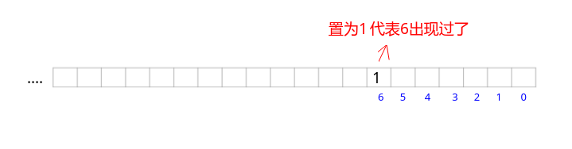

## 剑指Offer - 45 - 扑克牌顺子

#### [题目链接](https://www.nowcoder.com/practice/762836f4d43d43ca9deb273b3de8e1f4?tpId=13&tqId=11198&tPage=3&rp=1&ru=%2Fta%2Fcoding-interviews&qru=%2Fta%2Fcoding-interviews%2Fquestion-ranking)

> https://www.nowcoder.com/practice/762836f4d43d43ca9deb273b3de8e1f4?tpId=13&tqId=11198&tPage=3&rp=1&ru=%2Fta%2Fcoding-interviews&qru=%2Fta%2Fcoding-interviews%2Fquestion-ranking

#### 题目

> 从扑克牌中随机抽5张牌，判断是不是一个顺子，即这5张牌是不是连续的。2~10为数字本身，A为1，J为11，Q为12，K为13，而大、小王可以看成任意数字。
>
> 如果牌能组成顺子就输出true，否则就输出false。**为了方便起见,你可以认为大小王是0。**

### 解析

两种思路。

#### 1、思路一

**先把数组排序**。

由于 0 可以当成任意数字，我们可以用 0 去补满数组中的空缺。如果排序之后的数组不是连续的，即相邻的两个数字相隔若干个数字，但只要我们有足够的 0 可以补满这两个数字的空缺，这个数组实际上还是连续的。

举个例子，数组排序之后为`{0，1，3，4，5}`，在1和3之间空缺了一个 2，刚好我们有一个 0，也就是我们可以把它当成 2去填补这个空缺 。

分析了上面的问题之后，我们就可以整理出解题步骤:

* 首先把数组排序，再统计数组中 0 的个数，最后统计排序之后的数组中相邻数字之间的空缺总数；
* 如果空缺的总数小于或者等于 0 的个数，那么这个数组就是连续的，反之则不连续；
* 还需要注意: 如果数组中的**非 0 数字**重复出现，则该数组不是连续的。即如果一副牌里含有对子，则不可能是顺子；

代码:

```java
import java.util.Arrays;
public class Solution {
    public boolean isContinuous(int[] numbers) {
        if (numbers.length != 5)
            return false;
        Arrays.sort(numbers);
        int interval = 0, zero = 0;
        for (int i = 0; i < 4; i++) {
            if (numbers[i] == 0) {//写在循环前面, 且numbers[4]不需要判断了
                zero++;
                continue;// 记得不要判断下面的对子了，因为number[i+1]有可能也是0
            }
            if (numbers[i] == numbers[i + 1])
                return false;
            interval += numbers[i + 1] - numbers[i] - 1;
        }
        return zero >= interval;
    }
}
```

#### 2、思路二

思路二的判断点:

- 最大的牌到最小的牌的距离要小于`5`。
- 也是不能有重复的牌 (除`0`外)；

因为我们没有对数组排序，**这里用位操作来判断数组中是否含有重复的数字**。



```java
public class Solution {
    public boolean isContinuous(int[] numbers) {
        if (numbers.length != 5)
            return false;
        int max = -1, min = 14;
        int bit = 0; // 用bit判断是否相同
        for (int num : numbers) {
            if (num > 13 || num < 0) return false;
            if (num == 0) continue;
            if (((bit >> num) & 1) != 0) return false;
            bit |= (1 << num);
            if(num > max) max = num;
            if(num < min) min = num;
            if(max - min >= 5) return false;
        }
        return true;
    }
}
```

