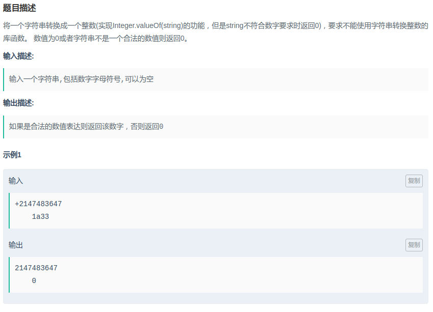

## 把字符串转换成整数

#### [题目链接](https://www.nowcoder.com/practice/1277c681251b4372bdef344468e4f26e?tpId=13&tqId=11202&tPage=3&rp=1&ru=%2Fta%2Fcoding-interviews&qru=%2Fta%2Fcoding-interviews%2Fquestion-ranking)

> https://www.nowcoder.com/practice/1277c681251b4372bdef344468e4f26e?tpId=13&tqId=11202&tPage=3&rp=1&ru=%2Fta%2Fcoding-interviews&qru=%2Fta%2Fcoding-interviews%2Fquestion-ranking

#### 题目



> 注意可以包含**字母和符号**。

### 解析

比较简单的模拟题。但是也要注意一些情况:

* 前面的空字符要去掉；
* 然后就是第一个如果是符号要判断；
* 还有一个就是判断溢出，这个问题可能有点麻烦，方式挺多，但是很多都有小问题；

代码:

```java
public class Solution {

    public int StrToInt(String str) {
        if (str == null || str.trim().equals(""))
            return 0;
        char[] chs = str.trim().toCharArray();//去除前面的空字符' '
        int res = 0;
        for (int i = (chs[0] == '-' || chs[0] == '+') ? 1 : 0; i < str.length(); i++) {
            if(chs[i] < '0' || chs[i] > '9') return 0; // < 48 || > 57
            int num = chs[i] - '0'; // chs[i] - 48
            int sum = res * 10 + num;
            if((sum - num)/10 != res) // 如果 sum超出范围了，这个表达式就回不到原来的res
                return 0;
            res = sum;
        }
        return chs[0] == '-' ? -res : res;
    }
}
```

