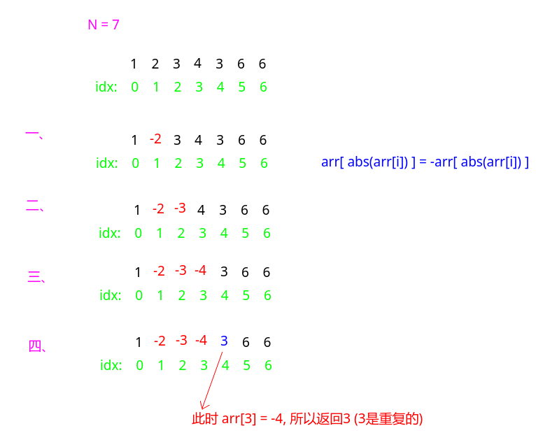

## 剑指Offer - 50 - 数组中重复的数字

#### [题目链接](https://www.nowcoder.com/practice/623a5ac0ea5b4e5f95552655361ae0a8?tpId=13&tqId=11203&tPage=3&rp=1&ru=%2Fta%2Fcoding-interviews&qru=%2Fta%2Fcoding-interviews%2Fquestion-ranking)

> https://www.nowcoder.com/practice/623a5ac0ea5b4e5f95552655361ae0a8?tpId=13&tqId=11203&tPage=3&rp=1&ru=%2Fta%2Fcoding-interviews&qru=%2Fta%2Fcoding-interviews%2Fquestion-ranking

#### 题目

> **在一个长度为n的数组里的所有数字都在0到`n-1`的范围内**。 数组中某些数字是重复的，但不知道有几个数字是重复的。也不知道每个数字重复几次。请找出数组中任意一个重复的数字。 例如，如果输入长度为7的数组`{2,3,1,0,2,5,3}`，那么对应的输出是第一个重复的数字`2`。

### 解析

给出三种解法，后面两种O(1)空间实现。

#### 解法一

直接用一个数组保存那个数之前有没有出现过即可。因为数在`0~n-1`之间，所以数组只需要开`n`即可。

```java
public class Solution {
    public boolean duplicate(int numbers[], int length, int[] duplication) {
        if(numbers == null || length == 0) return false;
        boolean[] used = new boolean[length];
        for(int num : numbers){
            if(used[num]){
                duplication[0] = num;
                return true;
            }
            used[num] = true;
        }
        return false;
    }
}
```

#### 解法二

思路:

* 充分利用数只出现在`0 ~ n-1`之间，所以我们每次将`arr[ abs(arr[i])] `标记成它的相反数；
* 下次，如果再发现一个`arr[i]`，且`arr[ abs(arr[i])] < 0`，说明之前已经标记过了，所以可以返回`arr[i]`；

先给出代码:

```java
public class Solution {
    public boolean duplicate(int numbers[], int length, int[] duplication) {
        if(numbers == null || length == 0) return false;
        for(int i = 0; i < length; i++){
            int idx = Math.abs(numbers[i]);
            if(numbers[idx] >= 0)
                numbers[idx] = -numbers[idx];
            else {
                duplication[0] = idx;
                return true;
            }
        }
        return false;
    }
}
```

看个例子: `arr = {1, 2, 3, 4, 4, 6, 6}`



#### 解法三

这种解法和上面那种解法其实本质差不多。

这里是将`arr[ arr[i] ] = arr[arr[i]] + length`。然后一开始的时候就需要还原(`-=length`)，然后判断。

```java
public class Solution {
    public boolean duplicate(int numbers[], int length, int[] duplication) {
        if(numbers == null || length == 0) return false;
        for(int i = 0; i < length; i++){
            int idx = numbers[i];
            if(idx >= length) idx -= length;
            if(numbers[idx] >= length) {
                duplication[0] = idx;
                return true;
            }
            numbers[idx] = numbers[idx] + length;
        }
        return false;
    }
}
```

