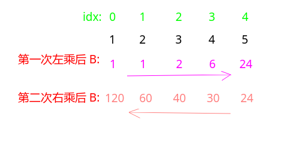

## 剑指Offer - 51 - 构建乘积数组

#### [题目链接](https://www.nowcoder.com/practice/94a4d381a68b47b7a8bed86f2975db46?tpId=13&tqId=11204&tPage=3&rp=1&ru=%2Fta%2Fcoding-interviews&qru=%2Fta%2Fcoding-interviews%2Fquestion-ranking)

> https://www.nowcoder.com/practice/94a4d381a68b47b7a8bed86f2975db46?tpId=13&tqId=11204&tPage=3&rp=1&ru=%2Fta%2Fcoding-interviews&qru=%2Fta%2Fcoding-interviews%2Fquestion-ranking

#### 题目

> 给定一个数组`A[0,1,...,n-1]`，请构建一个数组`B[0,1,...,n-1]`，其中B中的元素`B[i]=A[0]*A[1]*...*A[i-1]*A[i+1]*...*A[n-1]`。**不能使用除法**。

### 解析

显然O(N^2)的方法不是好方法，好的方法是**分别从两边开始乘**。

* 一开始从左往右累乘到`B[i]`，但是不要包括`A[i]` (也就是`A[0 ~ i-1]`)；
* 第二次从后往前累乘到`B[i]`，也不要包括`A[i]`(也就是`A[i+1 ~ n-1]`)；

看个例子:



代码:

```java
public class Solution {
    public int[] multiply(int[] A) {
        int n = A.length;
        int[] B = new int[n];
        int mul = 1;
        for (int i = 0; i < n; i++) {
            B[i] = mul;//先 =
            mul *= A[i];
        }
        mul = 1;
        for (int i = n - 1; i >= 0; i--) {
            B[i] *= mul;//先 *
            mul *= A[i];
        }
        return B;
    }
}
```

