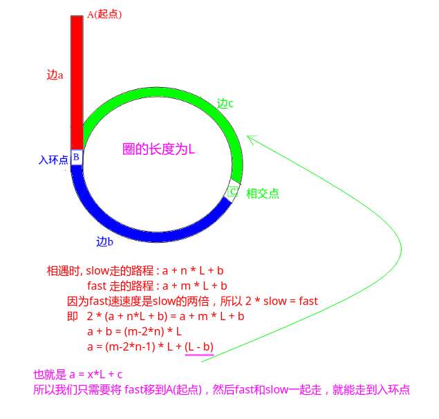

## 剑指Offer - 55 - 链表中环的入口结点

#### [题目链接](https://www.nowcoder.com/practice/253d2c59ec3e4bc68da16833f79a38e4?tpId=13&tqId=11208&tPage=3&rp=1&ru=%2Fta%2Fcoding-interviews&qru=%2Fta%2Fcoding-interviews%2Fquestion-ranking)

> https://www.nowcoder.com/practice/253d2c59ec3e4bc68da16833f79a38e4?tpId=13&tqId=11208&tPage=3&rp=1&ru=%2Fta%2Fcoding-interviews&qru=%2Fta%2Fcoding-interviews%2Fquestion-ranking

#### 题目

给一个链表，若其中包含环，请找出该链表的环的入口结点，否则，输出`null`。

### 解析

这题可以用HashSet来做，但是那样空间复杂度为`O(N)`，比较好的经典的算法是双指针(数学)方法。

* 两个指针`fast、slow`，`fast`一次走两步，`slow`一次走一步；
* 如果有环，他们一定会在环内相遇；
* 当他们相遇之后，让`fast`回到起点，`slow`不动；
* 然后两个指针一起走，都是走一步，当他们走到一起的时候，他们的交点就是入环点；

简单证明:



代码：

```java
public class Solution {
    public ListNode EntryNodeOfLoop(ListNode pHead) {
        if(pHead == null) return null;
        ListNode fast = pHead, slow = pHead;
        while(slow.next != null && fast.next.next != null){
            slow = slow.next;
            fast = fast.next.next;
            if(slow == fast){
                fast = pHead;
                while(slow != fast){
                    slow = slow.next;
                    fast = fast.next;
                }
                return fast;
            }
        }
        return null;
    }
}
```

