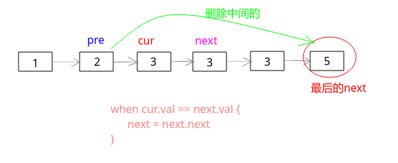

## 剑指Offer - 56 - 删除链表中重复的节点

#### [题目链接](https://www.nowcoder.com/practice/fc533c45b73a41b0b44ccba763f866ef?tpId=13&tqId=11209&tPage=3&rp=1&ru=%2Fta%2Fcoding-interviews&qru=%2Fta%2Fcoding-interviews%2Fquestion-ranking)

> https://www.nowcoder.com/practice/fc533c45b73a41b0b44ccba763f866ef?tpId=13&tqId=11209&tPage=3&rp=1&ru=%2Fta%2Fcoding-interviews&qru=%2Fta%2Fcoding-interviews%2Fquestion-ranking

#### 题目

在一个排序的链表中，存在重复的结点，请删除该链表中重复的结点，重复的结点不保留，返回链表头指针。 例如，链表`1->2->3->3->4->4->5` 处理后为 `1->2->5`。

### 解析

这题主要是练习链表的操作。

非递归:

用三个变量`pre、cur、next`操作即可。注意用`dummyHead`操作会方便一些。



代码:

```java
public class Solution {
    
    public ListNode deleteDuplication(ListNode pHead){
        if(pHead == null) return null;
        if(pHead.next == null) return pHead;
        ListNode dummyHead = new ListNode(Integer.MAX_VALUE);
        dummyHead.next = pHead;
        ListNode pre = dummyHead, cur = pHead, next;
        while(cur != null){
            next = cur.next;
            if(next == null) break;
            if(cur.val == next.val){
                while(next != null && cur.val == next.val)//重复的一截
                    next = next.next;
                pre.next = next;// 减掉中间重复的
                cur = next;
            }else {
                pre = pre.next;
                cur = cur.next;
            }
        }
        return dummyHead.next;
    }
}
```

递归写法: 原理一样。

```java
public class Solution {

    public ListNode deleteDuplication(ListNode pHead) {
        if (pHead == null || pHead.next == null) return pHead;
        ListNode cur = pHead, next = pHead.next;
        if (cur.val != next.val) {
            cur.next = deleteDuplication(next);
            return cur;
        } else {
            while (next != null && cur.val == next.val)
                next = next.next;
            return deleteDuplication(next);
        }
    }
}
```

