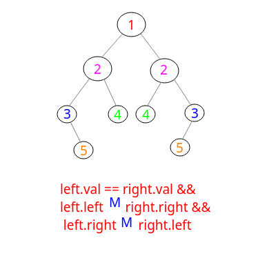

## 剑指Offer - 58 - 对称的二叉树

#### [题目链接](https://www.nowcoder.com/practice/ff05d44dfdb04e1d83bdbdab320efbcb?tpId=13&tqId=11211&tPage=3&rp=1&ru=%2Fta%2Fcoding-interviews&qru=%2Fta%2Fcoding-interviews%2Fquestion-ranking)

> https://www.nowcoder.com/practice/ff05d44dfdb04e1d83bdbdab320efbcb?tpId=13&tqId=11211&tPage=3&rp=1&ru=%2Fta%2Fcoding-interviews&qru=%2Fta%2Fcoding-interviews%2Fquestion-ranking

#### 题目

请实现一个函数，用来判断一颗二叉树是不是对称的。注意，**如果一个二叉树同此二叉树的镜像是同样的**，定义其为对称的。

### 解析

递归思路。

* 首先根节点，只要`pRoot.left`和`pRoot.right`对称即可；

* 左右节点的**值相等**且对称子树`left.left 和 right.right对称` ，且`left.rigth和right.left也对称`。

<div align="center">></div><br>

递归:

```java
public class Solution {

    boolean isSymmetrical(TreeNode pRoot){
        return pRoot == null ? true : mirror(pRoot.left, pRoot.right);
    }

    boolean mirror(TreeNode left, TreeNode right) {
        if(left == null && right == null) return true;
        if(left == null || right == null) return false;
        return left.val == right.val 
                && mirror(left.left, right.right) 
                && mirror(left.right, right.left);
    }
}
```

非递归:

层次遍历即可，注意队列中要成对成对的取。

```java
import java.util.LinkedList;
import java.util.Queue;

public class Solution {

    boolean isSymmetrical(TreeNode pRoot) {
        if (pRoot == null) return true;
        Queue<TreeNode> queue = new LinkedList<>();
        queue.add(pRoot.left);
        queue.add(pRoot.right);
        while (!queue.isEmpty()) {
            TreeNode right = queue.poll();
            TreeNode left = queue.poll();
            if (left == null && right == null) continue;
            if (left == null || right == null) return false;
            if (left.val != right.val) return false;
            //成对插入
            queue.add(left.left); queue.add(right.right);
            queue.add(left.right); queue.add(right.left);
        }
        return true;
    }
}
```

栈也可以:

```java
import java.util.LinkedList;
import java.util.Queue;
import java.util.Stack;

public class Solution {

    boolean isSymmetrical(TreeNode pRoot) {
        if (pRoot == null) return true;
        Stack<TreeNode> s = new Stack<>();
        s.push(pRoot.left);
        s.push(pRoot.right);
        while (!s.isEmpty()) {
            TreeNode right = s.pop();
            TreeNode left = s.pop();
            if (left == null && right == null) continue;
            if (left == null || right == null) return false;
            if (left.val != right.val) return false;
            //成对插入
            s.push(left.left); s.push(right.right);
            s.push(left.right); s.push(right.left);
        }
        return true;
    }
}
```

