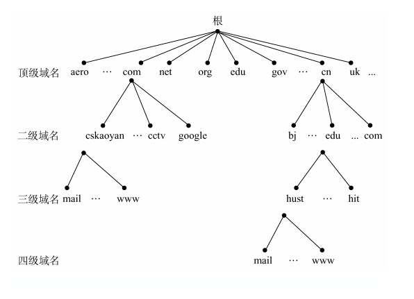
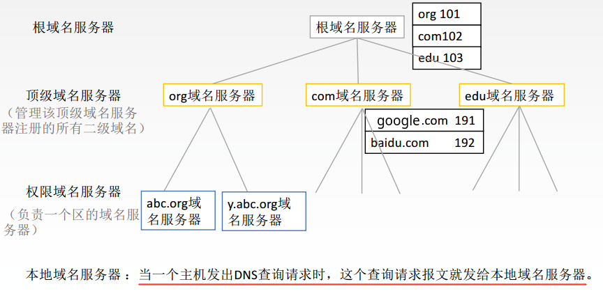
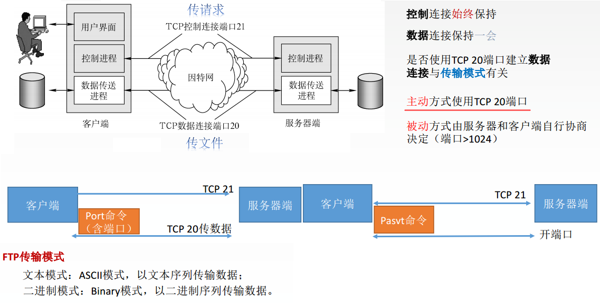
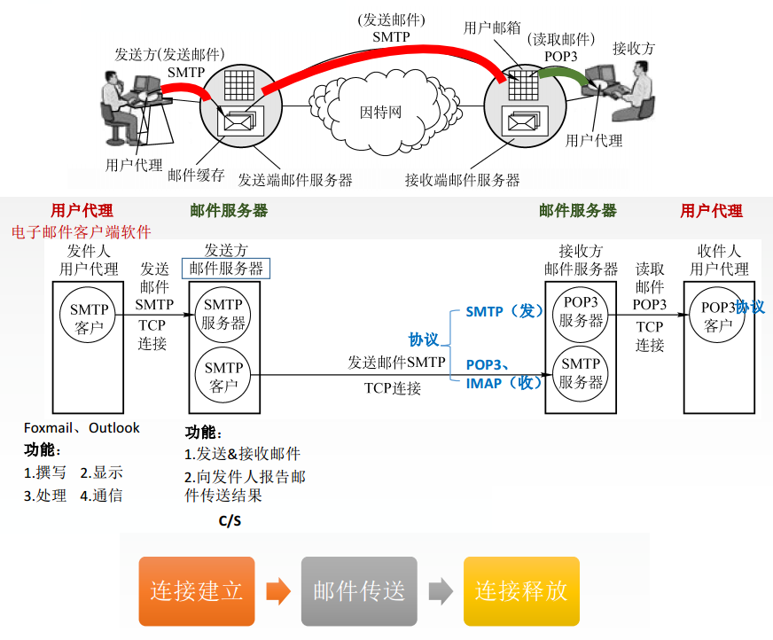

# 计网总结(六)一应用层

* DNS
* FTP
* 电子邮件

## 1、DNS

DNS提供了主机名和 IP 地址之间相互转换的服务。域名具有层次结构，从上到下依次为：根域名、顶级域名、二级域名...。

 

> DNS 可以使用 UDP 或者 TCP 进行传输，使用的端口号都为 53。大多数情况下 DNS 使用 UDP 进行传输，这就要求域名解析器和域名服务器都必须自己处理超时和重传来保证可靠性。在两种情况下会使用 TCP 进行传输：
> - 如果返回的响应超过的 512 字节（UDP 最大只支持 512 字节的数据）。
> - 区域传送（区域传送是主域名服务器向辅助域名服务器传送变化的那部分数据）。

## 2、FTP

FTP是基于**客户/服务器**(C/S) 的协议。

用户通过一个客户机程序连接至在远程计算机上运行的服务器程序。依照 FTP 协议提供服务，进行文件传送的计算机就是 FTP 服务器。

连接FTP服务器，遵循FTP协议与服务器传送文件的电脑就是FTP客户端。

FTP 使用 TCP 进行连接，它需要两个连接来传送一个文件：

- 控制连接：**服务器打开端口号 21 等待客户端的连接**，客户端主动建立连接后，使用这个连接将客户端的命令传送给服务器，并传回服务器的应答。
- 数据连接：用来传送一个文件数据。

## 3、电子邮件

一个电子邮件系统由三部分组成：用户代理、邮件服务器以及邮件协议。

邮件协议包含发送协议和读取协议，发送协议常用 SMTP，读取协议常用 POP3 和 IMAP。

