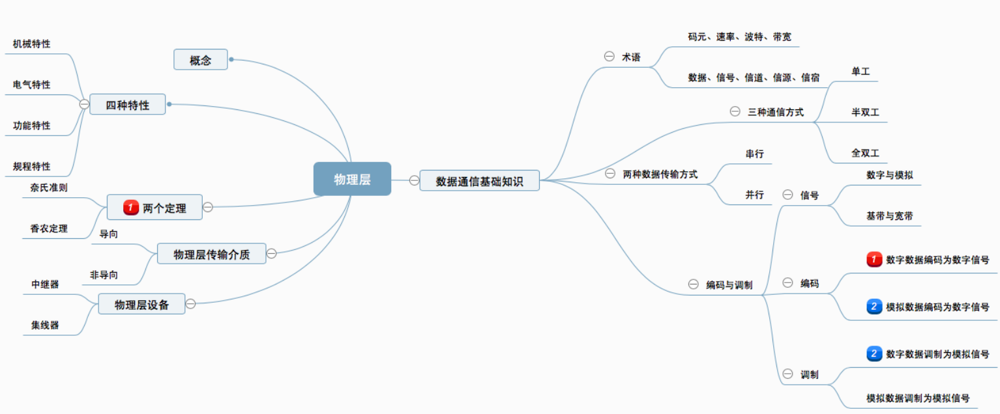
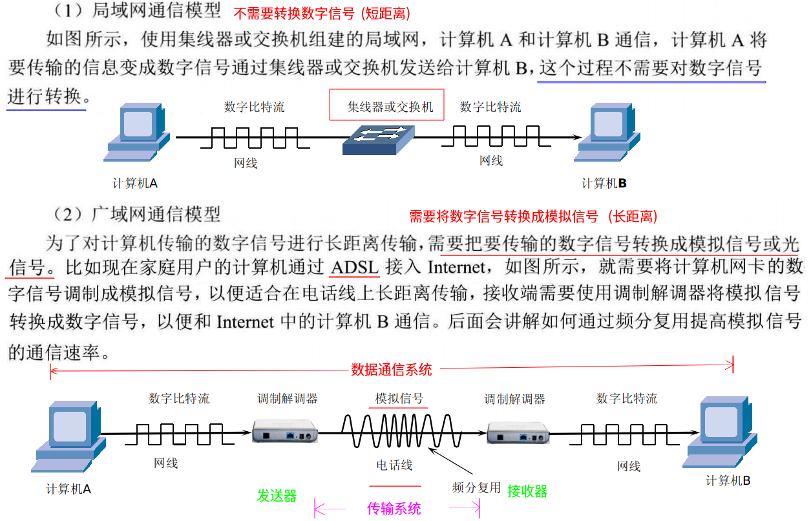
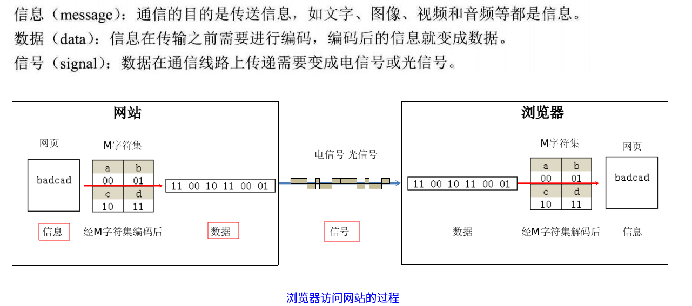
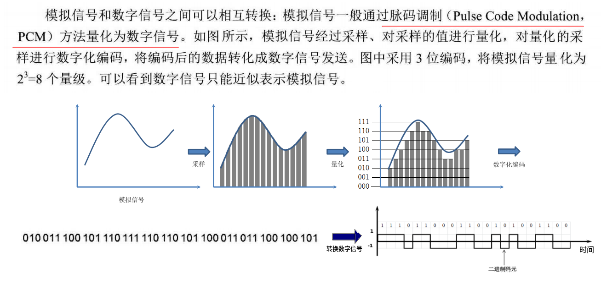
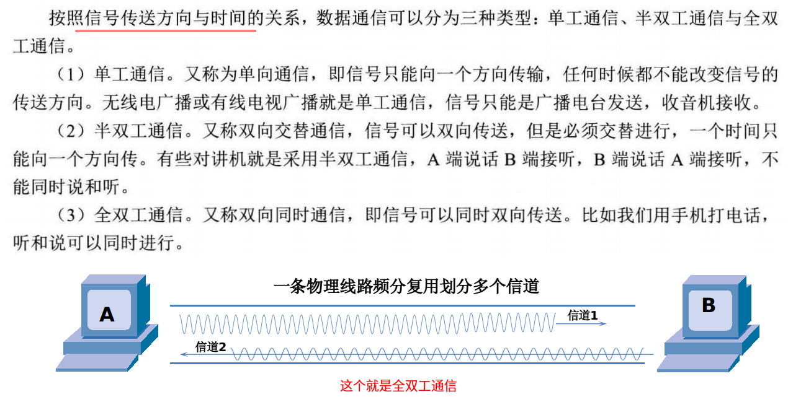
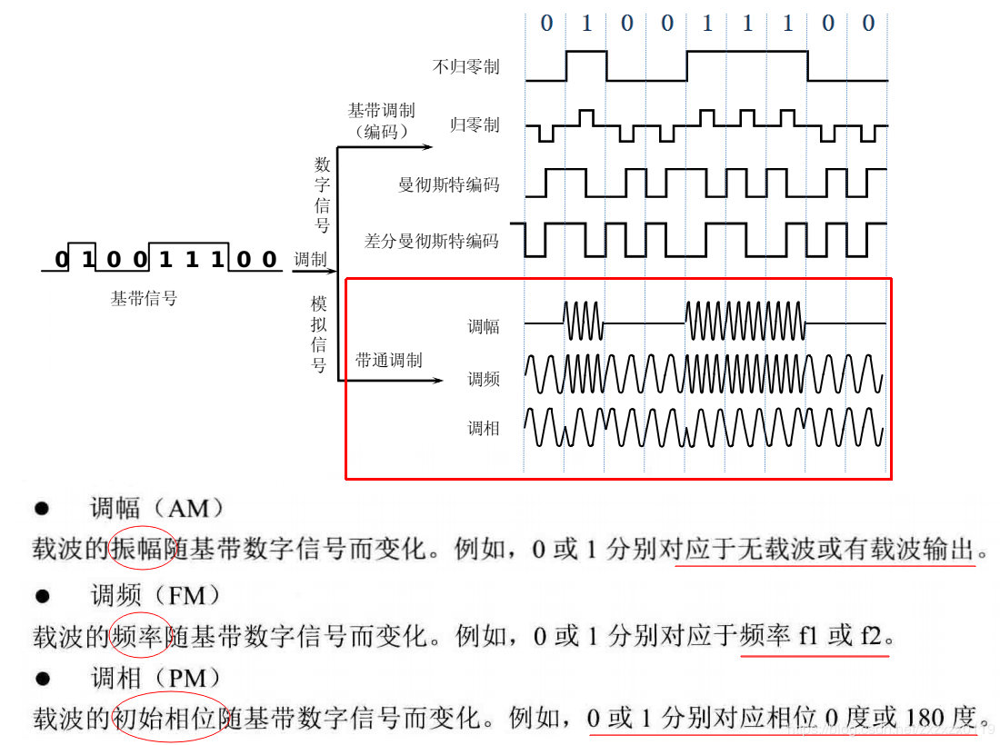
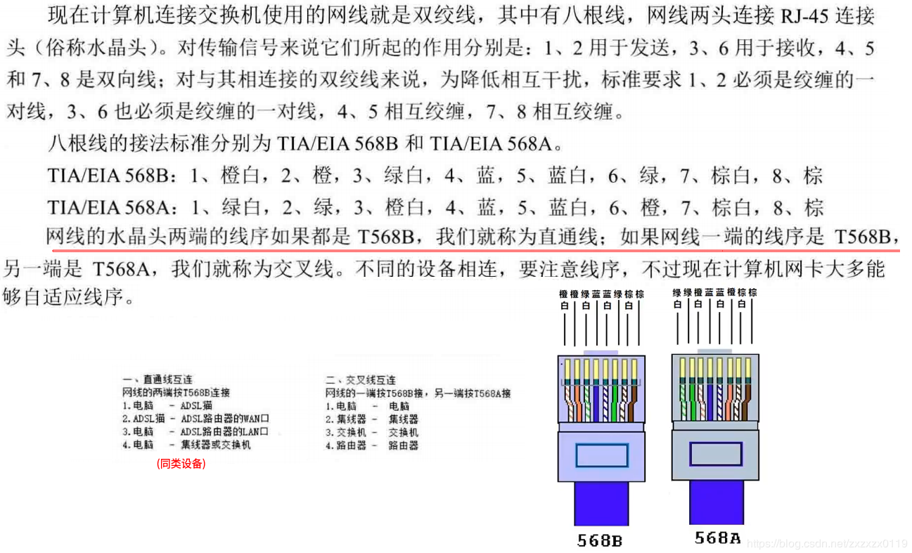
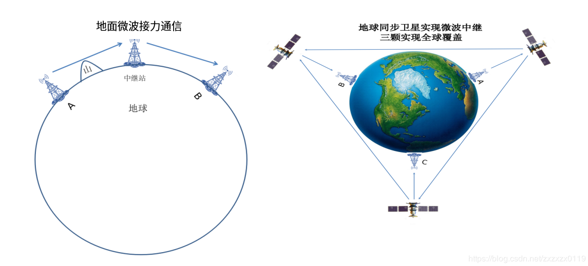
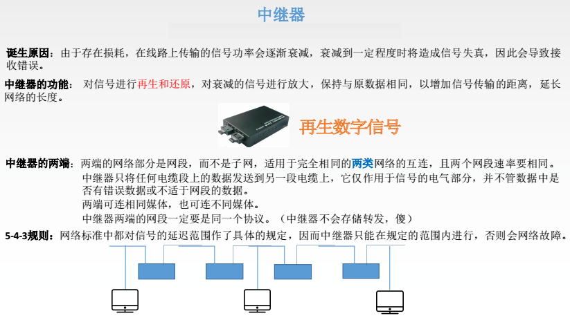
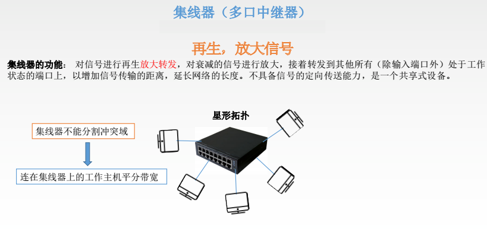

# 计网总结(二)一物理层

* [一、物理层基本概念](#一物理层基本概念)
* [二、数据通信基础](#二数据通信基础)
* [三、物理层下的传输媒体](#三物理层下的传输媒体)
* [四、物理层设备](#五物理层设备)

知识总览:

## 一、物理层基本概念

简单定义以及涉及相关知识: 
* 定义: 为传输数据所需要的物理链路创建、维持、拆除，而提供具有机械的，电子的，功能的和规范的特性。简单的说，**物理层确保原始的数据可在各种物理媒体上传输**，即传输数据比特流。
* 物理层设计的相关知识点:  数字信号、双绞线 、同轴电缆 、 光纤 、  时分多路 、波分复用 、 编码方式 、模拟信号、  频分多路复用  、  码分复用技术、  全双工 、半双工 、单工通信；

四大特性:

* **机械特性**: 指明接口所用接线器的形状和尺寸、引脚数目和排列、固定和锁定装置等。
* **电器特性**: 指明在接口电缆的各条线上出现的电压的范围；
* **功能特性**: 指明某条线上出现的某一电平的电压的意义；
* **过程特性**: 定义了在信号线上进行二进制比特流传输的一组操作过程，包括各信号线的工作顺序和时序，使得比特流传输得以完成；

## 二、数据通信基础
### 1、数据通信模型

分别看局域网通信模型和广域网通信模型:

> 不过现在很多用户已经通过**光纤**接入`Internet`了，这就需要将计算机网卡的数字信号通过**光电转换设备**转换成光信号进行长距离传输，在接收端通过光电转换设备转换成数字信号。

### 2、数据通信的一些术语

### 3、模拟信号和数字信号
* 模拟信号: 代表消息的参数的取值是**离散**的，在一定的范围内可以有无限多个不同的取值； 
* 数字信号: 代表消息的参数的取值是**连续**的；在数字信号中通常用码元(时间间隔相同的符号)来表示一个二进制数字；
* 码元: 在使用时间域（或简称为时域）的波形表示数字信号时，代表不同离散数值的基本波形。(可以表示一、二、三、四位二进制数)；
* 模拟信号和数字信号之间的转换；

看下图: 

### 4、信道 

信道: 一般用来表示向某一个方向传送信息的媒体。

按照信号传送方向与时间的关系，数据通信分为三种类型: 

* 单向通信（单工通信）: 只能有一个方向的通信而没有反方向的交互。
* 双向交替通信（半双工通信) :  通信的双方都可以发送信息，但不能双方同时发送(当然也就不能同时接收)。
* 双向同时通信（全双工通信) : 通信的双方可以同时发送和接收信息。

### 5、调制
调制分为两大类：
* 基带调制：仅对基带信号的波形进行变换，使它能够与信道特性相适应。变换后的信号仍然是基带信号。把这种过程称为编码 (`coding`)。
* 带通调制：使用载波 (`carrier`)进行调制，把基带信号的频率范围搬移到较高的频段，并转换为模拟信号，这样就能够更好地在模拟信道中传输（即仅在一段频率范围内能够通过信道） 。
* 带通信号：经过载波调制后的信号。

常用编码方式: 

* 不归零制：正电平代表 `1`，负电平代表 `0`。(效率最高，但是如果发送端发送连续的`0`或者`1`，接收端不容易判断码元的边界)；
* 归零制：正脉冲代表 `1`，负脉冲代表 `0`。
* 曼彻斯特编码：位周期中心的向上跳变代表 `0`，位周期中心的向下跳变代表 `1`。但也可反过来定义。(`1`比特需要`2`码元)
* 差分曼彻斯特编码：在每一位的中心处始终都有跳变。位开始边界有跳变代表 `0`，而位开始边界没有跳变代表 `1`。

基本带通调制方法: 

* 基带信号往往包含有较多的低频成分，甚至有直流成分，而许多信道并不能传输这种低频分量或直流分量。为了解决这一问题，就必须对基带信号进行调制 (`modulation`)。 
* 最基本的二元制调制方法有以下几种：①　调幅(AM)。②调频(FM)。③调相(PM) 。

* 从信号波形中可以看出，曼彻斯特 (Manchester) 编码和差分曼彻斯特编码产生的信号频率比不归零制高。
* 从自同步能力来看，不归零制不能从信号波形本身中提取信号时钟频率（这叫作没有自同步能力），而曼彻斯特编码和差分曼彻斯特编码具有自同步能力。

> 不是码元越多越好。若每一个码元可表示的比特数越多，则在接收端进行解调时要正确识别每一种状态就越困难，出错率增加。

### 6、信道极限容量
基本概念:

* 任何实际的信道都不是理想的，在传输信号时会产生各种失真以及带来多种干扰。 
* 影响信道上的数字信息传输速率的因素有两个: **码元的传输速度和每个码元承载的比特信息量**，码元传输的速率越高，或信号传输的距离越远，或传输媒体质量越差，在信道的输出端的波形的失真就越严重。 

从概念上讲，限制码元在信道上的传输速率的因素有以下两个：
* 信道能够通过的频率范围
* 信噪比

①信道能够通过的频率范围
* 具体的信道所能通过的频率范围总是有限的。信号中的许多高频分量往往不能通过信道。
* 1924年，奈奎斯特 (Nyquist) 就推导出了著名的奈氏准则。**他给出了在假定的理想条件下，为了避免码间串扰，码元的传输速率的上限值**。
* 在任何信道中，码元传输的速率是有上限的，否则就会出现码间串扰的问题，使接收端对码元的判决（即识别）成为不可能。
* **如果信道的频带越宽，也就是能够通过的信号高频分量越多，那么就可以用更高的速率传送码元而不出现码间串扰**。  (可以通过信道的传输速度，计算码元的最高传输速率) 

②信噪比(香农公式)

* 噪声存在于所有的电子设备和通信信道中。噪声是随机产生的，它的瞬时值有时会很大。因此噪声会使接收端对码元的判决产生错误；
* 但噪声的影响是相对的。如果信号相对较强，那么噪声的影响就相对较小；
* 信噪比就是信号的平均功率和噪声的平均功率之比。常记为 `S/N`，并用分贝 (`dB`) 作为度量单位。即：
信噪比(`dB`) = **10 log10(S/N)**   (`dB`) 。例如，当 S/N = 10 时，信噪比为 10 `dB`，而当 S/N = 1000时，信噪比为 30 `dB`。 例如，当 S/N = 10 时，信噪比为 10 dB，而当 S/N = 1000时，信噪比为 30 dB；
* 1984年，香农 (Shannon) 用信息论的理论推导出了带宽受限且有高斯白噪声干扰的信道的极限、无差错的信息传输速率（香农公式）。
* 信道的极限信息传输速率 C 可表达为：`C = W log2(1+S/N)`   (`bit/s`) ；其中，`W` 为信道的带宽（以 Hz 为单位）；`S` 为信道内所传信号的平均功率；`N` 为信道内部的高斯噪声功率。  

香农公式表明: 
* 信道的带宽或信道中的信噪比越大，则信息的极限传输速率就越高。 
* 只要信息传输速率低于信道的极限信息传输速率，就一定可以找到某种办法来实现无差错的传输。 
* 若信道带宽 W 或信噪比 S/N 没有上限（当然实际信道不可能是这样的），则信道的极限信息传输速率 C 也就没有上限。
* 实际信道上能够达到的信息传输速率要比香农的极限传输速率低不少。  
* 对于频带宽度已确定的信道，如果信噪比不能再提高了，并且码元传输速率也达到了上限值，那么还有办法提高信息的传输速率。这就是：**用编码的方法让每一个码元携带更多比特的信息量**。 

## 三、物理层下的传输媒体

* 传输媒体也称为传输介质或传输媒介，它就是**数据传输系统中在发送器和接收器之间的物理通路**。
* 传输媒体可分为两大类，即导引型传输媒体和非导引型传输媒体。
  * 在导引型传输媒体中，**电磁波被导引沿着固体媒体（铜线或光纤）传播**。
  * 非导引型传输媒体就是指自由空间。**在非导引型传输媒体中，电磁波的传输常称为无线传输**。

### 1、导引型传输媒体
#### 1)、双绞线(网线)
* 最常用的传输媒体；
* 模拟传输和数字传输都可以使用双绞线，其通信距离一般为几到十几公里。  屏蔽双绞线 `STP` 无屏蔽双绞线 `UTP`；

#### 2)、同轴电缆
* 同轴电缆具有很好的抗干扰特性，被广泛用于传输较高速率的数据。
* 同轴电缆的带宽取决于电缆的质量。
50  同轴电缆 —— LAN / 数字传输常用
75  同轴电缆 —— 有线电视 / 模拟传输常用
#### 3)、光缆
* 光纤是光纤通信的传输媒体。
* 由于可见光的频率非常高，约为 `108` MHz 的量级，因此一个光纤通信系统的传输带宽远远大于目前其他各种传输媒体的带宽。

多模光纤和单模光纤: 

* 多模光纤 : 可以存在多条不同角度入射的光线在一条光纤中传输。这种光纤就称为多模光纤(适合近距离)。
* 单模光纤 :  若光纤的直径减小到只有一个光的波长，则光纤就像一根波导那样，它可使光线一直向前传播，而不会产生多次反射。这样的光纤称为单模光纤。
### 2、非导引型传输媒体
* 将自由空间称为“非导引型传输媒体”。
* 无线传输所使用的频段很广。
* 短波通信（即高频通信）主要是靠电离层的反射，但短波信道的通信质量较差，传输速率低。
* 微波在空间主要是直线传播。
* 传统微波通信有两种方式：①地面微波接力通信；②卫星通信  ；

## 四、物理层设备

两个主要设备:

* 中继器；
* 集线器；

中继器：

集线器:

