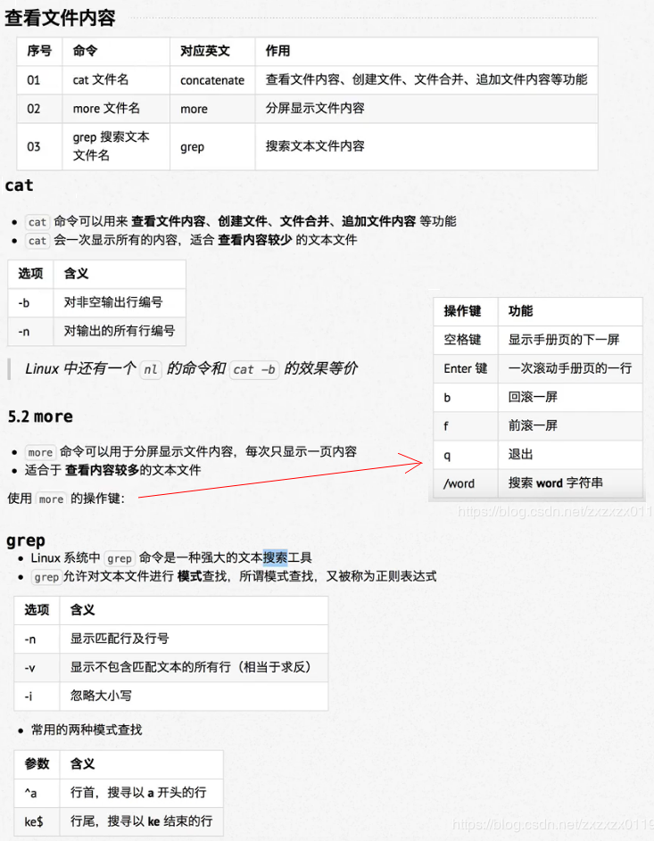
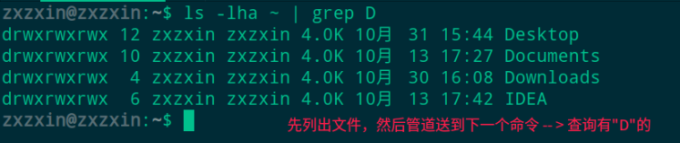
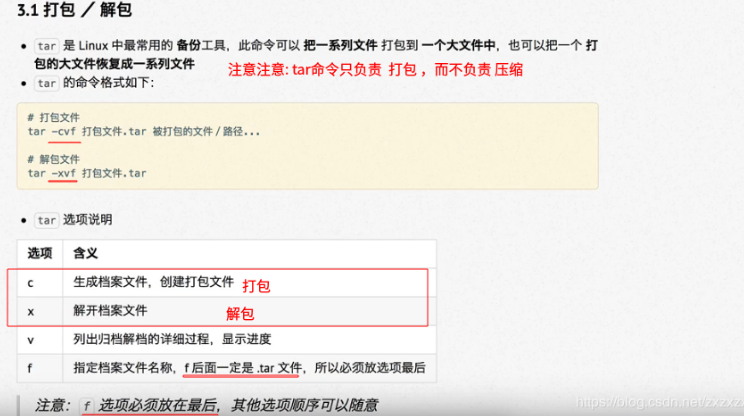

# Linux知识总结

* [一、基础知识以及常用命令](#一基础知识以及常用命令)
* [二、远程管理](#二远程管理)
* [三、用户权限和用户管理](#三用户权限和用户管理)
* [四、其他命令](#四其他命令)

***
## 一、基础知识以及常用命令
### 1、操作系统的基本知识

#### 1)、操作系统概念

* 操作系统是计算机系统的内核与基石。操作系统需要处理如管理与配置内存、决定系统资源供需的优先次序、控制输入与输出设备、操作网络与管理文件系统等基本事务。
* 操作系统也提供一个让用户与系统交互的操作界面。(软件之下，硬件之上)


#### 2)、Unix和Linux之间的关系 

#### 3)、发行版和内核之间的关系 
发行版只是在内核的基础少包了一层壳；


#### 4)、多用户操作系统(不同于Windows的单用户操作系统) 


相关的目录的作用速查

* `/`：根目录，一般根目录下只存放目录，在Linux下有且只有一个根目录。所有的东西都是从这里开始。当你在终端里输入“/home”，你其实是在告诉电脑，先从/（根目录）开始，再进入到home目录。 
* `/bin`: /usr/bin: 可执行二进制文件的目录，如常用的命令ls、tar、mv、cat等。
* `/boot`：放置linux系统启动时用到的一些文件，如Linux的内核文件：/boot/vmlinuz，系统引导管理器：/boot/grub。
* `/dev`：存放linux系统下的设备文件，访问该目录下某个文件，相当于访问某个设备，常用的是挂载光驱 mount /dev/cdrom /mnt。
* `/etc`：系统配置文件存放的目录，不建议在此目录下存放可执行文件，重要的配置文件有 /etc/inittab、/etc/fstab、/etc/init.d、/etc/X11、/etc/sysconfig、/etc/xinetd.d。
* `/home`：系统默认的用户家目录，新增用户账号时，用户的家目录都存放在此目录下，~表示当前用户的家目录，~edu 表示用户 edu 的家目录。
* `/lib`: /usr/lib: /usr/local/lib：系统使用的函数库的目录，程序在执行过程中，需要调用一些额外的参数时需要函数库的协助。
* `/lost+fount`：系统异常产生错误时，会将一些遗失的片段放置于此目录下。
* `/mnt`: /media：光盘默认挂载点，通常光盘挂载于 /mnt/cdrom 下，也不一定，可以选择任意位置进行挂载。
* `/opt`：给主机额外安装软件所摆放的目录。
* `/proc`：此目录的数据都在内存中，如系统核心，外部设备，网络状态，由于数据都存放于内存中，所以不占用磁盘空间，比较重要的目录有 /proc/cpuinfo、/proc/interrupts、/proc/dma、/proc/ioports、/proc/net/* 等。
* `/root`：系统管理员root的家目录。
* `/sbin`: /usr/sbin: /usr/local/sbin：放置系统管理员使用的可执行命令，如fdisk、shutdown、mount 等。与 /bin 不同的是，这几个目录是给系统管理员 root使用的命令，一般用户只能"查看"而不能设置和使用。
* `/tmp`：一般用户或正在执行的程序临时存放文件的目录，任何人都可以访问，重要数据不可放置在此目录下。
* `/srv`：服务启动之后需要访问的数据目录，如 www 服务需要访问的网页数据存放在 /srv/www 内。
* `/usr`：应用程序存放目录，/usr/bin 存放应用程序，/usr/share 存放共享数据，/usr/lib 存放不能直接运行的，却是许多程序运行所必需的一些函数库文件。/usr/local: 存放软件升级包。/usr/share/doc: 系统说明文件存放目录。/usr/share/man:  程序说明文件存放目录。
* `/var`：放置系统执行过程中经常变化的文件，如随时更改的日志文件 /var/log，/var/log/message：</font>所有的登录文件存放目录，/var/spool/mail：邮件存放的目录，/var/run:程序或服务启动后，其PID存放在该目录下。

### 2、常用命令
终端命令格式以及常用linux命令：

基本格式: 

```shell
command [-options] [parameter]
```
* `command` : 命令名，相应功能的英文单词或单词的缩写；
* `[-options]`: 选项，可以用来对命令进行控制，也可以省略；
*  `[parameter]` : 传给命令的参数，可以是**零个，一个或多个**；

<font color = blue>注: `[]`代表的是可选操作。


> 小技巧： `ctrl + -/+ `可以缩小/放大终端的字体；

常用的7个命令:

 

#### 1)、查看相关命令的帮助信息的两种方式 

* `command --help`，比如  `ls -- help`查看ls的命令的帮助信息；
* `man`，比如`man ls`查看`ls`的帮助信息；

#### 2)、 Linux下文件和目录的特点

* Linux文件或目录名称最长可以有`256`个字符；
* 以`.`开头的文件为隐藏文件，需要用`-a`参数才能显示；
* `.`代表当前目录；
* `..`代表上一级目录； 


#### 3)、命令结合通配符的使用

简单的使用举例: 


#### 4)、`cd`命令的常用变化格式以及路径


#### 5)、创建、删除、移动、复制操作

#### 6)、查看文件内容的三个命令



grep使用案例: 


#### 7)、echo、重定向、管道


管道使用案例: 



***
## 二、远程管理

### 1、网络的基本知识


### 2、 远程登录


关于域名以及端口号：


SSH的简单使用:


### 3、远程复制


### 4、SSH高级一免密码登录和设置别名


***
## 三、用户权限和用户管理

主要知识: 

* 用户和权限的基本概念；
* 用户管理终端命令；
* 组管理终端命令；
* 修改权限终端命令；


`ls -l`相关参数说明: 


终端测试说明: 


其中上面绿色字体的硬链接数就是有多少种方式可以到达这个目录或者文件: 


`chmod命令`改变`文件/目录`的权限: 


测试使用`chmod`命令: 


执行可执行的权限`chmod +x 01.py`就可以执行了: 


`chmod`对目录的操作: 


### 1、超级用户

### 2、组管理命令


### 3、用户管理终端命令


在`unbutu`中创建一个`zhangsan`的用户并放到`dev`组：


### 4、查看用户信息以及passwd文件和usermod命令

\


如果是在`Windows`下使用`XShell`来操作`Linux`，默认使用的`shell(终端)`是`dash`，但是这个`Shell`不好，所以可以使用下面的命令来更改默认的`Shell`: 

```shell
sudo usermod -s /bin/bash zhangsan   // 指定张三用户的shell为bash，而不是默认的dash
```

### 5、which查看可执行文件的位置


>可以使用`last`命令 查询用户登录情况；

### 6、切换用户

### 7、修改文件权限的三个命令以及chmod和三个数字修改权限(常用)

***
### 8、系统信息相关命令


***
## 四、其他命令
* 查找文件 `find`
* 软链接`ln`
* 打包和压缩`tar`
* 软件安装`apt-get`


### 1、查找文件


演练: 


### 2、软链接(类似`Windows`的快捷方式)


举例:  

 先看相对路径建立软链接: 


通过绝对路径创建的、以及移动两个软链接之后，相对路径的失效效果:


**`注意`: 当省略了`-s`选项就是创建硬链接。**

硬链接即使删除了源文件，也能继续查看硬链接的内容。

下面是软链接和硬链接的示意图:


### 3、打包压缩



演练: 


演练: 


注意，除了`.gzip`的压缩文件，还有一个`bz2`的文件压缩文件格式: 


### 4、软件安装


设置软件源: 


