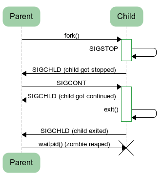

# Other
## 1、硬链接与软链接

<div align="center"></div>
### 1.1、硬链接

一般情况下，文件名和 inode 号码是 "一一对应" 关系，每个 inode 号码对应一个文件名。**但是，Unix/Linux 系统允许，多个文件名指向同一个 inode 号码**。

这意味着，**可以用不同的文件名访问同样的内容；对文件内容进行修改，会影响到所有文件名；但是，删除一个文件名，不影响另一个文件名的访问**。这种情况就被称为 "硬链接"（hard link）。

运行上面这条命令以后，源文件与目标文件的 inode 号码相同，都指向同一个 inode。inode 信息中有一项叫做 "链接数"，记录指向该 inode 的文件名总数，这时就会增加 1。

**反过来，删除一个文件名，就会使得 inode 节点中的 "链接数" 减1。当这个值减到 0，表明没有文件名指向这个 inode，系统就会回收这个 inode 号码，以及其所对应 block 区域**。

这里顺便说一下目录文件的 "链接数"。创建目录时，默认会生成两个目录项：`"."和".."`。前者的 inode 号码就是当前目录的 inode 号码，等同于当前目录的 "硬链接"；后者的 inode 号码就是当前目录的父目录的inode号码，等同于父目录的 "硬链接"。所以，任何一个目录的 "硬链接" 总数，总是等于 2 加上它的子目录总数（含隐藏目录）。

几个硬连接＝几个名字的同一个房子

**硬链接（Hard Link）**：硬连接不能跨越不同的文件系统，硬连接记录的是目标的 inode；只能指向文件。硬连接与原始文件都删除才意味着文件被删除。

- 特征
  - 拥有相同的 i 节点和存储 block 块，可以看做是同一个文件
  - 可通过 i 节点识别
  - 不能跨分区
  - 不能针对目录使用

### 1.2、软链接

除了硬链接以外，还有一种特殊情况。

**文件 A 和文件 B 的 inode 号码虽然不一样，但是文件 A 的内容是文件 B 的路径。读取文件 A 时，系统会自动将访问者导向文件 B。因此，无论打开哪一个文件，最终读取的都是文件 B。这时，文件 A 就称为文件 B 的"软链接"（soft link）或者"符号链接（symbolic link）**。

这意味着，文件 A 依赖于文件 B 而存在，如果删除了文件 B，打开文件 A 就会报错："No such file or directory"。这是软链接与硬链接最大的不同：文件 A 指向文件 B 的文件名，而不是文件 B 的 inode 号码，文件 B 的 inode "链接数"不会因此发生变化。

几个软链接=几个指向源文件的路标

**软链接（Symbolic Link，又称符号链接）**：软链接能跨越不同的文件系统，软链接记录的是目标的 path。源文件删除后，则软链接无效。**相当于Windows系统中的“快捷方式”**

- 特征：
  - 类似 windows 的快捷方式
  - 软链接拥有自己的 i 节点和 block 块，但是数据块中只保存原文件的文件名和 i  节点号，并没有实际的文件数据
  - 修改任意一个文件，另一个都会改变
  - 删除源文件，则软链接无法使用
  - 软链接的文件权限都为 rwxrwxrwx (文件权限以原文件为准)
  - 若要创建软链接，则创建的源文件必须使用绝对路径，否则在使用软链接时会报错

注意：复制是建造一个一模一样的房子，inode是不同的。

命令

```
 硬链接：ln 源文件 链接名
 软链接：ln -s 源文件 链接名
```

区别： 若将源文件删除，硬链接依旧有效，而软链接会无效，即找不到源文件

## 2、僵尸进程和孤儿进程

https://www.cnblogs.com/Anker/p/3271773.html

我们知道在unix/linux中，正常情况下，子进程是通过父进程创建的，子进程在创建新的进程。子进程的结束和父进程的运行是一个异步过程,即父进程永远无法预测子进程 到底什么时候结束。 当一个 进程完成它的工作终止之后，它的父进程需要调用wait()或者waitpid()系统调用取得子进程的终止状态。

　　**孤儿进程：一个父进程退出，而它的一个或多个子进程还在运行，那么那些子进程将成为孤儿进程。孤儿进程将被init进程(进程号为1)所收养，并由init进程对它们完成状态收集工作。**

　　**僵尸进程：一个进程使用fork创建子进程，如果子进程退出，而父进程并没有调用wait或waitpid获取子进程的状态信息，那么子进程的进程描述符仍然保存在系统中。这种进程称之为僵死进程。**

**3、问题及危害**

　　unix提供了一种机制可以保证只要父进程想知道子进程结束时的状态信息， 就可以得到。这种机制就是: 在每个进程退出的时候,内核释放该进程所有的资源,包括打开的文件,占用的内存等。 但是仍然为其保留一定的信息(包括进程号the process ID,退出状态the termination status of the process,运行时间the amount of CPU time taken by the process等)。直到父进程通过wait / waitpid来取时才释放。 但这样就导致了问题，**如果进程不调用wait / waitpid的话，** **那么保留的那段信息就不会释放，其进程号就会一直被占用，但是系统所能使用的进程号是有限的，如果大量的产生僵死进程，将因为没有可用的进程号而导致系统不能产生新的进程. 此即为僵尸进程的危害，应当避免。**

　　**孤儿进程是没有父进程的进程，孤儿进程这个重任就落到了init进程身上**，init进程就好像是一个民政局，专门负责处理孤儿进程的善后工作。每当出现一个孤儿进程的时候，内核就把孤 儿进程的父进程设置为init，而init进程会循环地wait()它的已经退出的子进程。这样，当一个孤儿进程凄凉地结束了其生命周期的时候，init进程就会代表党和政府出面处理它的一切善后工作。**因此孤儿进程并不会有什么危害。**

　　**任何一个子进程(init除外)在exit()之后，并非马上就消失掉，而是留下一个称为僵尸进程(Zombie)的数据结构，等待父进程处理。**这是每个 子进程在结束时都要经过的阶段。如果子进程在exit()之后，父进程没有来得及处理，这时用ps命令就能看到子进程的状态是“Z”。如果父进程能及时 处理，可能用ps命令就来不及看到子进程的僵尸状态，但这并不等于子进程不经过僵尸状态。  如果父进程在子进程结束之前退出，则子进程将由init接管。init将会以父进程的身份对僵尸状态的子进程进行处理。

　　僵尸进程危害场景：

　　例如有个进程，它定期的产 生一个子进程，这个子进程需要做的事情很少，做完它该做的事情之后就退出了，因此这个子进程的生命周期很短，但是，父进程只管生成新的子进程，至于子进程 退出之后的事情，则一概不闻不问，这样，系统运行上一段时间之后，系统中就会存在很多的僵死进程，倘若用ps命令查看的话，就会看到很多状态为Z的进程。 严格地来说，僵死进程并不是问题的根源，罪魁祸首是产生出大量僵死进程的那个父进程。因此，当我们寻求如何消灭系统中大量的僵死进程时，答案就是把产生大 量僵死进程的那个元凶枪毙掉（也就是通过kill发送SIGTERM或者SIGKILL信号啦）。枪毙了元凶进程之后，它产生的僵死进程就变成了孤儿进 程，这些孤儿进程会被init进程接管，init进程会wait()这些孤儿进程，释放它们占用的系统进程表中的资源，这样，这些已经僵死的孤儿进程 就能瞑目而去了。

## 3、查看CPU占用

### 3.1、top

**top命令**可以实时动态地查看系统的整体运行情况，是一个综合了多方信息监测系统性能和运行信息的实用工具。通过top命令所提供的互动式界面，用热键可以管理。

### 3.2、cat /proc/meminfo

查看RAM使用情况最简单的方法是通过 `/proc/meminfo`。这个动态更新的虚拟文件实际上是许多其他内存相关工具(如：free / ps / top)等的组合显示。`/proc/meminfo` 列出了所有你想了解的内存的使用情况。 

### 3.3、free

free 命令是一个快速查看内存使用情况的方法，它是对 `/proc/meminfo` 收集到的信息的一个概述。

这个命令用于显示系统当前内存的使用情况，包括已用内存、可用内存和交换内存的情况

默认情况下 free 会以字节为单位输出内存的使用量

```shell
$ free
             total       used       free     shared    buffers     cached
Mem:       3566408    1580220    1986188          0     203988     902960
-/+ buffers/cache:     473272    3093136
Swap:      4000176          0    4000176
```

如果你想以其他单位输出内存的使用量，需要加一个选项，`-g` 为GB，`-m` 为MB，`-k` 为KB，`-b` 为字节

```shell
$ free -g
             total       used       free     shared    buffers     cached
Mem:             3          1          1          0          0          0
-/+ buffers/cache:          0          2
Swap:            3          0          3
```

如果你想查看所有内存的汇总，请使用 -t 选项，使用这个选项会在输出中加一个汇总行

```shell
$ free -t
             total       used       free     shared    buffers     cached
Mem:       3566408    1592148    1974260          0     204260     912556
-/+ buffers/cache:     475332    3091076
Swap:      4000176          0    4000176
Total:     7566584    1592148    5974436
```

## 4、文件系统和innode

<https://www.cnblogs.com/zengkefu/p/5603187.html>

如Windows所用的文件系统主要有FAT16、FAT32和NTFS，Linux所用的文件系统主要有ext2、ext3、Ext4和ReiserFS等。

### 4.1、文件系统工作原理

文件系统的工作与操作系统的文件数据有关。现在的操作系统的文件数据除了文件实际内容外，通常含有非常多的属性，例如文件权限(rwx)与文件属性(所有者、用户组、时间参数等)。

**文件系统通常会将这两部份的数据分别存放在不同的区块，权限与属性放到inode中，数据则放到block区块中**。另外，还有一个超级区块(super block)会记录整个文件系统的整体信息，包括 inode与block的总量、使用量、剩余量等等等。

每个 inode 与 block 都有编号，至于这三个数据的意义可以简略说明如下：

- 1)、superblock：记录此 filesystem 的整体信息，包括inode/block的总量、使用量、剩余量， 以及文件系统的格式与相关信息等；
- 2)、inode：**记录文件的属性，一个文件占用一个inode，同时记录此文件的数据所在的 block 号码**；
- 3)、block：实际记录文件的内容，若文件太大时，会占用多个 block 。

由于每个 inode 与 block 都有编号，而每个文件都会占用一个 inode ，inode 内则有文件数据放置的 block 号码。 因此，我们可以知道的是，**如果能够找到文件的 inode 的话，那么自然就会知道这个文件所放置数据的 block 号码， 当然也就能够读出该文件的实际数据了**。这是个比较有效率的作法，因为如此一来我们的磁盘就能够在短时间内读取出全部的数据， 读写的效能比较好。

我们将 inode 与 block 区块用图解来说明一下，如下图所示，文件系统先格式化出 inode 与 block 的区块，假设某一个档案的属性与权限数据是放置到 inode 4 号(下图较小方格内)，而这个 inode 记录了档案数据的实际放置点为 2, 7, 13, 15 这四个 block 号码，此时我们的操作系统就能够据此来排列磁盘的阅读顺序，可以一口气将四个 block 内容读出来！ 那么数据的读取就如同下图中的箭头所指定的模样了。


这种数据存取的方法我们称为索引式文件系统(indexed allocation)。下面我们来看一下windows系统中的FAT，这种格式的文件系统并没有 inode 存在，所以 FAT 没有办法将这个文件的所有 block 在一开始就读取出来。每个 block 号码都记录在前一个 block 当中， 他的读取方式有点像底下这样:


### 4.2、inode的内容

inode 包含文件的元信息，具体来说有以下内容：

```java
* 文件的字节数
* 文件拥有者的 User ID
* 文件的 Group ID
* 文件的读、写、执行权限
* 文件的时间戳，共有三个：ctime：指inode上一次变动的时间，mtime：指文件内容上一次变动的时间，atime：指文件上一次打开的时间。
* 链接数，即有多少文件名指向这个inode
* 文件数据block的位置
```

可以用 `stat` 命令，查看某个文件的 inode 信息：

```shell
$ stat abby.txt
  File: ‘abby.txt’
  Size: 22              Blocks: 8          IO Block: 4096   regular file
Device: fd01h/64769d    Inode: 2106782     Links: 2
Access: (0644/-rw-r--r--)  Uid: (    0/    root)   Gid: (    0/    root)
Access: 2018-07-22 16:37:18.640787898 +0800
Modify: 2018-07-22 16:37:10.678607855 +0800
Change: 2018-07-22 16:37:10.833611360 +0800
 Birth: -
```

总之，除了文件名以外的所有文件信息，都存在inode之中。至于为什么没有文件名，下文会有详细解释。

### 4.3、inode的大小

<div align="center"></div><br>
inode 也会消耗硬盘空间，所以硬盘格式化的时候，操作系统自动将硬盘分成两个区域。一个是**数据区**，存放文件数据；另一个是 **inode 区**（inode table），存放 inode 所包含的信息。

每个 inode 节点的大小，一般是 128 字节或 256 字节。inode 节点的总数，在格式化时就给定，一般是每 1KB 或每 2KB 就设置一个 inode。假定在一块 1GB 的硬盘中，每个 inode 节点的大小为 128 字节，每 1KB 就设置一个 inode，那么 inode table 的大小就会达到 128 MB，占整块硬盘的 12.8%。

查看每个硬盘分区的 inode 总数和已经使用的数量，可以使用df 命令。

```shell
$ df -i
Filesystem      Inodes  IUsed   IFree IUse% Mounted on
/dev/vda1      3932160 189976 3742184    5% /
devtmpfs        998993    339  998654    1% /dev
tmpfs          1001336      1 1001335    1% /dev/shm
tmpfs          1001336    397 1000939    1% /run
tmpfs          1001336     16 1001320    1% /sys/fs/cgroup
tmpfs          1001336      1 1001335    1% /run/user/0
```

查看每个 inode 节点的大小，可以用如下命令：

```shell
$ sudo dumpe2fs -h /dev/vda1 | grep "Inode size"
dumpe2fs 1.42.9 (28-Dec-2013)
Inode size:               256
```

由于每个文件都必须有一个inode，因此有可能发生inode已经用光，但是硬盘还未存满的情况。这时，就无法在硬盘上创建新文件。

### 4.4、inode号码

每个 inode 都有一个号码，**操作系统用 inode 号码来识别不同的文件**。

这里值得重复一遍，Unix/Linux 系统内部不使用文件名，而使用 inode 号码来识别文件。对于系统来说，文件名只是 inode 号码便于识别的别称或者绰号。

表面上，用户通过文件名，打开文件。实际上，系统内部这个过程分成三步：首先，系统找到这个文件名对应的 inode 号码；其次，通过 inode 号码，获取 inode 信息；最后，根据 inode 信息，找到文件数据所在的 block，读出数据。

使用 `ls -i` 命令，可以看到文件名对应的 inode 号码：

```shell
$ ls -i test.txt
1712426 test.txt
```

## 5、用户管理

实现用户账号的管理，要完成的工作主要有如下几个方面：

- 用户账号的添加、删除与修改。
- 用户口令的管理。
- 用户组的管理。

### 5.1、添加用户

```shell
useradd 选项 用户名
参数说明：
选项:
    -c comment 指定一段注释性描述。
    -d 目录 指定用户主目录，如果此目录不存在，则同时使用-m选项，可以创建主目录。
    -g 用户组 指定用户所属的用户组。
    -G 用户组，用户组 指定用户所属的附加组。
    -s Shell文件 指定用户的登录Shell。
    -u 用户号 指定用户的用户号，如果同时有-o选项，则可以重复使用其他用户的标识号。
用户名:
    指定新账号的登录名。
```

实例:

```shell
实例1
# useradd –d /usr/zx -m zx
此命令创建了一个用户zx，其中-d和-m选项用来为登录名zx产生一个主目录/usr/sam（/usr为默认的用户主目录所在的父目录）。

实例2
# useradd -s /bin/sh -g group –G adm,root zx
此命令新建了一个用户zx，该用户的登录Shell是 /bin/sh，它属于group用户组，同时又属于adm和root用户组，其中group用户组是其主组。
这里可能新建组：#groupadd group及groupadd adm
增加用户账号就是在/etc/passwd文件中为新用户增加一条记录，同时更新其他系统文件如/etc/shadow, /etc/group等。
```

### 5.2、删除用户

删除用户账号就是要将`/etc/passwd`等系统文件中的该用户记录删除，必要时还删除用户的主目录。

删除一个已有的用户账号使用`userdel`命令，其格式如下：

`userdel 选项 用户名`
常用的选项是` -r`，**它的作用是把用户的主目录一起删除**(日常一般不会删除)。

例如：

```shell
# userdel -r zx
```

此命令删除用户`zx`在系统文件中（主要是`/etc/passwd, /etc/shadow, /etc/group`等）的记录，同时删除用户的主目录。

### 5.3、修改用户

修改用户账号就是根据实际情况更改用户的有关属性，如用户号、主目录、用户组、登录Shell等。

```shell
修改已有用户的信息使用usermod命令，其格式如下：

usermod 选项 用户名

常用的选项包括-c, -d, -m, -g, -G, -s, -u以及-o等，这些选项的意义与useradd命令中的选项一样，可以为用户指定新的资源值。

另外，有些系统可以使用选项：-l 新用户名

这个选项指定一个新的账号，即将原来的用户名改为新的用户名。

例如：

# usermod -s /bin/ly -d /home/ly –g developer zx
此命令将用户zx的登录Shell修改为ly，主目录改为/home/ly，用户组改为developer。
```

### 5.4、口令管理

超级用户可以为自己和其他用户指定口令，普通用户只能用它修改自己的口令。命令的格式为：

```shell
passwd 选项 用户名
可使用的选项：

-l 锁定口令，即禁用账号。
-u 口令解锁。
-d 使账号无口令。
-f 强迫用户下次登录时修改口令。
如果默认用户名，则修改当前用户的口令。

例如，假设当前用户是sam，则下面的命令修改该用户自己的口令：
passwd 
如果是超级用户，可以用下列形式指定任何用户的口令：
passwd sam 
```

> `etc/password`下文件的格式：
>
> `用户名:口令:用户标识号:组标识号:注释性描述:主目录:登录Shell`

## 6、用户组管理

每个用户都有一个用户组，系统可以对一个用户组中的所有用户进行集中管理。不同Linux 系统对用户组的规定有所不同，**如Linux下的用户属于与它同名的用户组，这个用户组在创建用户时同时创建**。

用户组的管理涉及用户组的添加、删除和修改。组的增加、删除和修改实际上就是对`/etc/group`文件的更新。

### 6.1、增加用户组

```shell
命令: 
groupadd 选项 用户组
可以使用的选项有：

-g GID 指定新用户组的组标识号（GID）。
-o 一般与-g选项同时使用，表示新用户组的GID可以与系统已有用户组的GID相同。
实例1：
# groupadd group1
此命令向系统中增加了一个新组group1，新组的组标识号是在当前已有的最大组标识号的基础上加1。

实例2：
# groupadd -g 101 group2
此命令向系统中增加了一个新组group2，同时指定新组的组标识号是101。
```

### 6.2、删除用户组

```shell
groupdel 用户组
例如：
# groupdel group1
此命令从系统中删除组group1。
```

### 6.3、修改用户组

```shell
groupmod 选项 用户组
常用的选项有：

    -g GID 为用户组指定新的组标识号。
    -o 与-g选项同时使用，用户组的新GID可以与系统已有用户组的GID相同。
    -n 新用户组 将用户组的名字改为新名字
实例1：
# groupmod -g 102 group2
此命令将组group2的组标识号修改为102。

实例2：
# groupmod –g 10000 -n group3 group2
此命令将组group2的标识号改为10000，组名修改为group3。
```

## 7、进程管理

### 7.1、查看进程

#### ps

查看某个时间点的进程信息

示例一：查看自己的进程

```
# ps -l

```

示例二：查看系统所有进程

```
# ps aux

```

示例三：查看特定的进程

```
# ps aux | grep threadx

```

```
-a：显示所有终端机下执行的程序，除了阶段作业领导者之外。
-u<用户识别码>：此选项的效果和指定"-U"选项相同。
x：显示所有程序，不以终端机来区分。

```

#### top

实时显示进程信息

示例：两秒钟刷新一次

```
# top -d 2

```

#### pstree

查看进程树

示例：查看所有进程树

```
# pstree -A

```

#### netstat

查看占用端口的进程

示例：查看特定端口的进程

```
# netstat -anp | grep port
```

参考资料：

[Linux基础13 进程管理_哔哩哔哩 (゜-゜)つロ 干杯~-bilibili](https://www.bilibili.com/video/av9539203?from=search&seid=12568422774751055363)

<https://www.bilibili.com/video/av9539203?from=search&seid=12568422774751055363>

### 7.2、进程状态


| 状态 | 说明                                                         |
| ---- | ------------------------------------------------------------ |
| R    | running or runnable (on run queue)                           |
| D    | uninterruptible sleep (usually I/O)                          |
| S    | interruptible sleep (waiting for an event to complete)       |
| Z    | zombie (terminated but not reaped by its parent) 僵尸进程    |
| T    | stopped (either by a job control signal or because it is being traced) |

#### SIGCHLD

当一个子进程改变了它的状态时：停止运行，继续运行或者退出，有两件事会发生在父进程中：

- 得到 SIGCHLD 信号；
- waitpid() 或者 wait() 调用会返回。



**其中子进程发送的 SIGCHLD 信号包含了子进程的信息，包含了进程 ID、进程状态、进程使用 CPU 的时间等。**

**在子进程退出时，它的进程描述符不会立即释放，这是为了让父进程得到子进程信息**。父进程通过 wait() 和 waitpid() 来获得一个已经退出的子进程的信息。

#### wait()

```c
pid_t wait(int *status)
```

父进程调用 wait() 会一直阻塞，直到收到一个子进程退出的 SIGCHLD 信号，之后 wait() 函数会销毁子进程并返回。

如果成功，返回被收集的子进程的进程 ID；如果调用进程没有子进程，调用就会失败，此时返回 -1，同时 errno 被置为 ECHILD。

参数 status 用来保存被收集的子进程退出时的一些状态，如果我们对这个子进程是如何死掉的毫不在意，只想把这个子进程消灭掉，可以设置这个参数为 NULL：

```
pid = wait(NULL);

```


#### waitpid()

```c
pid_t waitpid(pid_t pid, int *status, int options)
```

作用和 wait() 完全相同，但是多了两个可由用户控制的参数 pid 和 options。

pid 参数指示一个子进程的 ID，表示只关心这个子进程的退出 SIGCHLD 信号。如果 pid=-1 时，那么和 wait() 作用相同，都是关心所有子进程退出的 SIGCHLD 信号。

options 参数主要有 WNOHANG 和 WUNTRACED 两个选项，WNOHANG 可以使 waitpid() 调用变成非阻塞的，也就是说它会立即返回，父进程可以继续执行其它任务。


#### 孤儿进程

一个父进程退出，而它的一个或多个子进程还在运行，那么这些子进程将成为孤儿进程。

孤儿进程将被 init 进程（进程号为 1）所收养，并由 init 进程对它们完成状态收集工作。

由于孤儿进程会被 init 进程收养，所以孤儿进程不会对系统造成危害。


#### 僵尸进程

一个子进程的进程描述符在子进程退出时不会释放，只有当父进程通过 wait() 或 waitpid() 获取了子进程信息后才会释放。如果子进程退出，而父进程并没有调用 wait() 或 waitpid()，那么子进程的进程描述符仍然保存在系统中，这种进程称之为僵尸进程。

僵尸进程通过 ps 命令显示出来的状态为 Z（zombie）。

系统所能使用的进程号是有限的，如果大量的产生僵尸进程，将因为没有可用的进程号而导致系统不能产生新的进程。

要消灭系统中大量的僵尸进程，只需要将其父进程杀死，此时所有的僵尸进程就会变成孤儿进程，从而被 init 所收养，这样 init 就会释放所有的僵死进程所占有的资源，从而结束僵尸进程。


参考资料：

- [孤儿进程与僵尸进程[总结] - Anker's Blog - 博客园](https://www.cnblogs.com/Anker/p/3271773.html)
- [《深入理解计算机系统》异常控制流——读书笔记 - CSDN博客](https://blog.csdn.net/zhanghaodx082/article/details/12280689)
- [Linux系统学习笔记：异常控制流 - CSDN博客](https://blog.csdn.net/yangxuefeng09/article/details/10066357)
- [Linux 之守护进程、僵死进程与孤儿进程 | LiuYongbin](http://liubigbin.github.io/2016/03/11/Linux-%E4%B9%8B%E5%AE%88%E6%8A%A4%E8%BF%9B%E7%A8%8B%E3%80%81%E5%83%B5%E6%AD%BB%E8%BF%9B%E7%A8%8B%E4%B8%8E%E5%AD%A4%E5%84%BF%E8%BF%9B%E7%A8%8B/)
- [CSAPP笔记第八章异常控制流 呕心沥血千行笔记- DDUPzy - 博客园](https://www.cnblogs.com/zy691357966/p/5480537.html)


## 8、kill用法，某个进程杀不掉的原因（进入内核态，忽略kill信号）

1. 该进程是僵尸进程（STAT z），此时进程已经释放所有的资源，但是没有被父进程释放。僵尸进程要等到父进程结束，或者重启系统才可以被释放。
2. 进程处于“核心态”，并且在等待不可获得的资源，处于“核心态 ”的资源默认忽略所有信号。只能重启系统。

参考资料：

- [linux kill -9 杀不掉的进程 - CSDN博客](https://blog.csdn.net/lemontree1945/article/details/79169178)

### kill

kill命令用来删除执行中的程序或工作。kill可将指定的信息送至程序。预设的信息为`SIGTERM(15)`,可将指定程序终止。若仍无法终止该程序，可使用SIGKILL(9)信息尝试强制删除程序。程序或工作的编号可利用[ps](http://man.linuxde.net/ps)指令或job指令查看。

**语法** 

```
kill(选项)(参数)

```

**选项** 

```
-a：当处理当前进程时，不限制命令名和进程号的对应关系；
-l <信息编号>：若不加<信息编号>选项，则-l参数会列出全部的信息名称；
-p：指定kill 命令只打印相关进程的进程号，而不发送任何信号；
-s <信息名称或编号>：指定要送出的信息；
-u：指定用户。

```

**参数** 

进程或作业识别号：指定要删除的进程或作业。

**实例** 

列出所有信号名称：

```
 kill -l
 1) SIGHUP       2) SIGINT       3) SIGQUIT      4) SIGILL
 5) SIGTRAP      6) SIGABRT      7) SIGBUS       8) SIGFPE
 9) SIGKILL     10) SIGUSR1     11) SIGSEGV     12) SIGUSR2
13) SIGPIPE     14) SIGALRM     15) SIGTERM     16) SIGSTKFLT
17) SIGCHLD     18) SIGCONT     19) SIGSTOP     20) SIGTSTP
21) SIGTTIN     22) SIGTTOU     23) SIGURG      24) SIGXCPU
25) SIGXFSZ     26) SIGVTALRM   27) SIGPROF     28) SIGWINCH
29) SIGIO       30) SIGPWR      31) SIGSYS      34) SIGRTMIN
35) SIGRTMIN+1  36) SIGRTMIN+2  37) SIGRTMIN+3  38) SIGRTMIN+4
39) SIGRTMIN+5  40) SIGRTMIN+6  41) SIGRTMIN+7  42) SIGRTMIN+8
43) SIGRTMIN+9  44) SIGRTMIN+10 45) SIGRTMIN+11 46) SIGRTMIN+12
47) SIGRTMIN+13 48) SIGRTMIN+14 49) SIGRTMIN+15 50) SIGRTMAX-14
51) SIGRTMAX-13 52) SIGRTMAX-12 53) SIGRTMAX-11 54) SIGRTMAX-10
55) SIGRTMAX-9  56) SIGRTMAX-8  57) SIGRTMAX-7  58) SIGRTMAX-6
59) SIGRTMAX-5  60) SIGRTMAX-4  61) SIGRTMAX-3  62) SIGRTMAX-2
63) SIGRTMAX-1  64) SIGRTMAX

```

只有第9种信号(SIGKILL)才可以无条件终止进程，其他信号进程都有权利忽略，**下面是常用的信号：**

```
HUP     1    终端断线
INT     2    中断（同 Ctrl + C）
QUIT    3    退出（同 Ctrl + \）
TERM   15    终止
KILL    9    强制终止
CONT   18    继续（与STOP相反， fg/bg命令）
STOP   19    暂停（同 Ctrl + Z）

```

先用ps查找进程，然后用kill杀掉：

```
ps -ef | grep vim
root      3268  2884  0 16:21 pts/1    00:00:00 vim install.log
root      3370  2822  0 16:21 pts/0    00:00:00 grep vim

kill 3268
kill 3268
-bash: kill: (3268) - 没有那个进程

```

### kill all

**killall命令使用进程的名称来杀死进程**，使用此指令可以杀死一组同名进程。我们可以使用[kill](http://man.linuxde.net/kill)命令杀死指定进程PID的进程，如果要找到我们需要杀死的进程，我们还需要在之前使用[ps](http://man.linuxde.net/ps)等命令再配合[grep](http://man.linuxde.net/grep)来查找进程，而killall把这两个过程合二为一，是一个很好用的命令。

**语法** 

```
killall(选项)(参数)

```

选项 

```
-e：对长名称进行精确匹配；
-l：忽略大小写的不同；
-p：杀死进程所属的进程组；
-i：交互式杀死进程，杀死进程前需要进行确认；
-l：打印所有已知信号列表；
-q：如果没有进程被杀死。则不输出任何信息；
-r：使用正规表达式匹配要杀死的进程名称；
-s：用指定的进程号代替默认信号“SIGTERM”；
-u：杀死指定用户的进程。

```

**参数** 

进程名称：指定要杀死的进程名称。

**实例** 

杀死所有同名进程

```
killall vi

```


## 9、Linux文件系统介绍

在 Linux操作系统中，所有被操作系统管理的资源，例如网络接口卡、磁盘驱动器、打印机、输入输出设备、普通文件或是目录**都被看作是一个文件**。也就是说在LINUX系统中有一个重要的概念：**一切都是文件**。

Linux支持的5种文件类型:

| 文件类型       | 描述                                                         | 示例                                                         |
| -------------- | ------------------------------------------------------------ | ------------------------------------------------------------ |
| 普通文件       | 用来在辅助设备(如磁盘)上存储信息和数据                       | 包含程序源代码、可执行程序、图片、声音、图像等               |
| 目录文件       | 用于表示和管理系统中的文件，目录文件中包含一些文件名和子目录名 | /root、/home                                                 |
| 链接文件       | **用于不同目录下文件的共享**                                 | 当创建一个已存在文件的符号链接时，系统就创建一个链接文件，这个链接文件指向已存在的文件 |
| 设备文件       | 用来访问硬件设备                                             | 包括键盘、硬盘、光驱、打印机等                               |
| 命名管道(FIFO) | 是一种特殊类型的文件、Linux系统下，**进程之间通信可以通过该文件完成** |                                                              |

## 10、linux运行级别

运行级别就是操作系统当前正在运行的功能级别。

级别是从`0`到`6`，具有不同的功能。这些级别定义在`/ect/inittab`文件中。

这个文件是init程序寻找的主要文件，最先运行的服务是那些放在`/ect/rc.d`目录下的文件。

Linux下的7个运行级别：

- `0`: 系统停机状态，系统默认运行级别不能设置为0，否则不能正常启动，机器关闭。
- `1`: 单用户工作状态，root权限，用于系统维护，禁止远程登陆，就像Windows下的安全模式登录。
- `2`: **多用户状态**，没有NFS支持。
- `3`: **完整的多用户模式**，有NFS，登陆后进入**控制台命令行模式**。
- `4`: 系统未使用，保留一般不用，在一些特殊情况下可以用它来做一些事情。例如在笔记本电脑的电池用尽时，可以切换到这个模式来做一些设置。
- `5`: X11控制台，登陆后进入图形GUI模式，XWindow系统。

**标准的Linux运行级别为5或者3**

## 11、运行级别原理

总结:

- 在目录`/etc/rc.d/init.d`下有许多服务器脚本程序，一般称为服务(service)
- 在`/etc/rc.d`下有7个名为rcN.d的目录，对应系统的7个运行级别
- `rcN.d`目录下都是一些符号链接文件，这些链接文件都指向init.d目录下的service脚本文件，命名规则为K+nn+服务名或S+nn+服务名，其中nn为两位数字。
- 系统会根据指定的运行级别进入对应的rcN.d目录，并按照文件名顺序检索目录下的链接文件：对于以K(Kill)开头的文件，系统将终止对应的服；对于以S(Start)开头的文件，系统将启动对应的服务
- **查看运行级别用**：`runlevel`
- 进入其它运行级别用：`init N`，如果`init 3`则进入终端模式，`init 5`则又登录图形GUI模式
- 另外`init 0`为关机，`init 6`为重启系统
  标准的Linux运行级别为3或5，如果是3的话，系统就在多用户状态；如果是5的话，则是运行着XWindow系统。不同的运行级别有不同的用处，也应该根据自己的不同情形来设置。例如，如果丢失了root口令，那么可以让机器启动进入单用户状态来设置。在启动后的lilo提示符下输入：
  `init=/bin/shrw`

这样就可以使机器进入运行级别1，并把root文件系统挂为读写。它会路过所有系统认证，让你使用passwd程序来改变root口令，然后启动到一个新的运行级。

## 12、Linux进程状态

Linux 中进程有哪几种状态？在 ps 显示出来的信息中，分别用什么符号表示的？

**答案**：

- 1）、不可中断状态：进程处于睡眠状态，但是此刻进程是不可中断的。不可中断， 指进程不响应异步信号；
- 2）、暂停状态/跟踪状态：向进程发送一个 SIGSTOP 信号，它就会因响应该信号 而进入 TASK_STOPPED 状态;当进程正在被跟踪时，它处于 TASK_TRACED 这个特殊的状态。“正在被跟踪”指的是进程暂停下来，等待跟踪它的进程对它进行操作；
- 3）、就绪状态：在 `run_queue` 队列里的状态；
- 4）、运行状态：在 `run_queue` 队列里的状态；
- 5）、可中断睡眠状态：处于这个状态的进程因为等待某某事件的发生（比如等待 socket 连接、等待信号量），而被挂起；
- 6）、zombie 状态（僵尸）：父亲没有通过 wait 系列的系统调用会顺便将子进程的尸体（`task_struct`）也释放掉；
- 7）、退出状态；

符号:

- `D` :   不可中断 Uninterruptible（usually IO）
- `R` :    正在运行，或在队列中的进程
- `S` :    处于休眠状态
- `T` :    停止或被追踪
- `Z` :    僵尸进程
- `W` :    进入内存交换（从内核 2.6 开始无效）
- `X` :    死掉的进程


