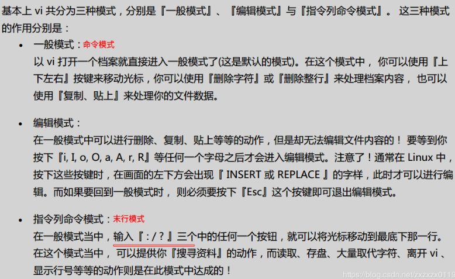
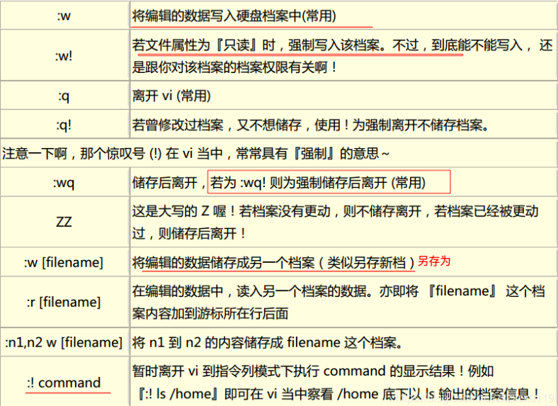

# Vim编辑器总结
* [一、日常发现总结](#一日常发现总结)
* [二、基本知识总结](#二基本知识总结)
* [三、命令表](#三命令表)
***
## 一、日常发现总结(持续更新)
* 日常开发中，知道某一行有错，打开文件的时候同时定位到对应的行。命令： `vim 文件名 +行数`；
* 如果后面没有加上函数，也就是`vim 文件名 +`，则定位到文件末尾；
* 如果在终端强制退出`vim`，会产生一个`.swp`的交换文件，再次编辑的时候会出现需要选择编辑的情况，此时选择`D`选项，删除之前的`.swp`文件，然后编辑即可；
*  `"+y`将Vim中的内容复制到系统剪切板；
* `"+p`将系统剪切板的内容拷贝到vim中（非编辑模式下）。
***
## 二、基本知识总结
### 1、工作模式

注意末行模式的常见命令: 

### 2、移动、选中文本(可视化)

### 3、撤销、恢复、删除

### 4、复制、粘贴、替换

### 5、 缩排、重复执行

### 6、查找、替换

### 7、查找、替换

替换结果: 

### 8、插入命令的扩展

插入命令的两个日常使用

### 9、分屏命令

`Vim`默认的内置文件浏览器

展示一个为目录，一个来编辑文件。

***
## 三、命令表

### 1、移动光标

### 2、搜寻与取代

### 3、删除、复制、粘贴

### 4、插入模式

### 5、末行模式命令

### 6、区块选择、分屏

