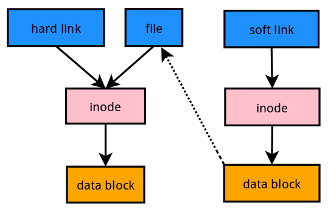

## 什么是硬链接与软链接

<div align="center"></div>

### 硬链接

一般情况下，文件名和 inode 号码是 "一一对应" 关系，每个 inode 号码对应一个文件名。**但是，Unix/Linux 系统允许，多个文件名指向同一个 inode 号码**。

这意味着，**可以用不同的文件名访问同样的内容；对文件内容进行修改，会影响到所有文件名；但是，删除一个文件名，不影响另一个文件名的访问**。这种情况就被称为 "硬链接"（hard link）。

运行上面这条命令以后，源文件与目标文件的 inode 号码相同，都指向同一个 inode。inode 信息中有一项叫做 "链接数"，记录指向该 inode 的文件名总数，这时就会增加 1。

**反过来，删除一个文件名，就会使得 inode 节点中的 "链接数" 减1。当这个值减到 0，表明没有文件名指向这个 inode，系统就会回收这个 inode 号码，以及其所对应 block 区域**。

这里顺便说一下目录文件的 "链接数"。创建目录时，默认会生成两个目录项：`"."和".."`。前者的 inode 号码就是当前目录的 inode 号码，等同于当前目录的 "硬链接"；后者的 inode 号码就是当前目录的父目录的inode号码，等同于父目录的 "硬链接"。所以，任何一个目录的 "硬链接" 总数，总是等于 2 加上它的子目录总数（含隐藏目录）。

几个硬连接＝几个名字的同一个房子

**硬链接（Hard Link）**：硬连接不能跨越不同的文件系统，硬连接记录的是目标的 inode；只能指向文件。硬连接与原始文件都删除才意味着文件被删除。

- 特征
  - 拥有相同的 i 节点和存储 block 块，可以看做是同一个文件
  - 可通过 i 节点识别
  - 不能跨分区
  - 不能针对目录使用

### 软链接

除了硬链接以外，还有一种特殊情况。

**文件 A 和文件 B 的 inode 号码虽然不一样，但是文件 A 的内容是文件 B 的路径。读取文件 A 时，系统会自动将访问者导向文件 B。因此，无论打开哪一个文件，最终读取的都是文件 B。这时，文件 A 就称为文件 B 的"软链接"（soft link）或者"符号链接（symbolic link）**。

这意味着，文件 A 依赖于文件 B 而存在，如果删除了文件 B，打开文件 A 就会报错："No such file or directory"。这是软链接与硬链接最大的不同：文件 A 指向文件 B 的文件名，而不是文件 B 的 inode 号码，文件 B 的 inode "链接数"不会因此发生变化。

几个软链接=几个指向源文件的路标

**软链接（Symbolic Link，又称符号链接）**：软链接能跨越不同的文件系统，软链接记录的是目标的 path。源文件删除后，则软链接无效。**相当于Windows系统中的“快捷方式”**

- 特征：
  - 类似 windows 的快捷方式
  - 软链接拥有自己的 i 节点和 block 块，但是数据块中只保存原文件的文件名和 i  节点号，并没有实际的文件数据
  - 修改任意一个文件，另一个都会改变
  - 删除源文件，则软链接无法使用
  - 软链接的文件权限都为 rwxrwxrwx (文件权限以原文件为准)
  - 若要创建软链接，则创建的源文件必须使用绝对路径，否则在使用软链接时会报错

注意：复制是建造一个一模一样的房子，inode是不同的。

命令

```
 硬链接：ln 源文件 链接名
 软链接：ln -s 源文件 链接名
```

区别： 若将源文件删除，硬链接依旧有效，而软链接会无效，即找不到源文件
