# 操作系统总结 - 进程概念、进程处理机调度(二)

* [一、进程的定义、组成、组织、特征](#一进程的定义组成组织特征)
* [二、进程的状态与转换](#二进程的状态与转换)
* [三、进程控制](#三进程控制)
* [四、进程通信](#四进程通信)
* [五、线程、多线程概念模型](#五线程多线程概念模型)
* [六、处理机调度的概念、层次](#六处理机调度的概念层次)
* [七、进程调度的时机、切换与过程、方式](#七进程调度的时机切换与过程方式)
* [八、调度算法的评价指标](#八调度算法的评价指标)
* [九、调度算法：先来先服务、最短作业优先、最高响应比优先](#九调度算法先来先服务最短作业优先最高响应比优先)
* [十、调度算法：时间片轮转、优先级、多级反馈队列](#十调度算法时间片轮转优先级多级反馈队列)

***
## 一、进程的定义、组成、组织、特征

**进程定义**

* 进程的定义: 进程是支持程序执行的机制，是程序针对某一数据集合的执行过程。
* 进程可以理解为程序对数据或请求的处理过程。

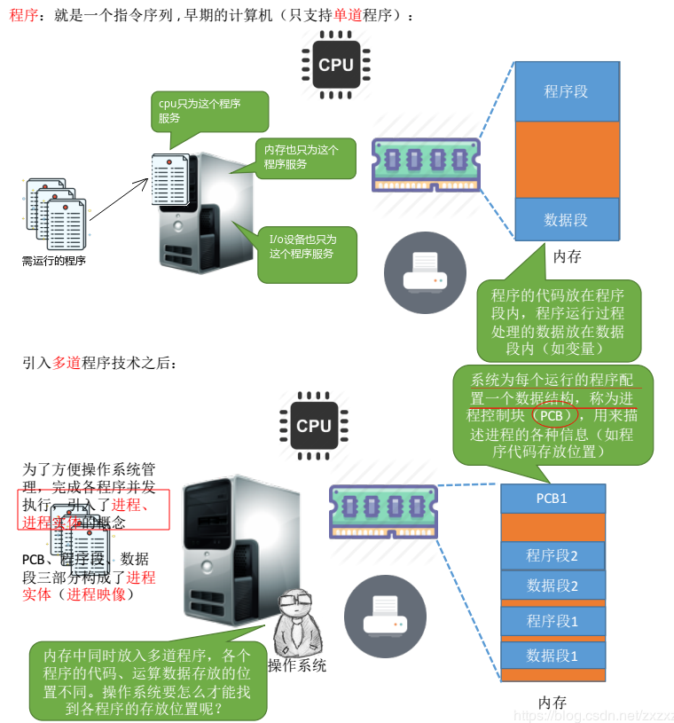

**进程(进程实体)的组成: 程序段、数据段、PCB**

* `PCB`(进程管理块): 为了描述控制进程的运行，系统中存放进程的管理和控制信息的数据结构称为进程控制块（`Process Control Block`）。它是进程实体的一部分，是操作系统中最重要的记录性数据结构。它是进程管理和控制的最重要的数据结构，每一个进程均有一个PCB，在创建进程时，建立PCB，伴随进程运行的全过程，直到进程撤消而撤消。所谓的创建进程和撤销进程，都是指对 PCB 的操作。
* 程序段: 存放执行的代码；
* 数据段: 存放程序运行过程中处理的各种数据；

例题: 进程控制块的作用是什么？PCB中应包括哪些信息？

> 答：进程控制块的作用是：进程控制块用于保存每个进程和资源的相关信息，包括进程标识、空间、运行状态、资源等信息。以便于操作系统管理和控制进程和资源。
`PCB`中应包括：1、进程标识信息：本进程的标识、父进程的标识、进程所属用户的标识。2、处理机状态信息。保存进程的运行现场信息，包括用户可用寄存器的信息；控制和状态寄存器的信息；栈指针。

**进程的组织方式**

**进程特征**

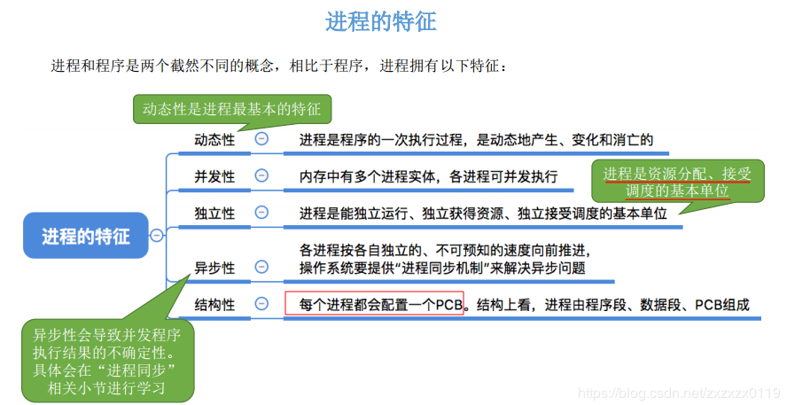

**本节小结**

***

## 二、进程的状态与转换

**状态转换**:

注意以下内容: 
* 只有就绪态和运行态可以相互转换，其它的都是单向转换。就绪状态的进程通过调度算法从而获得 CPU 时间，转为运行状态；
* 而运行状态的进程，在分配给它的 CPU 时间片用完之后就会转为就绪状态，等待下一次调度。阻塞状态是缺少需要的资源从而由运行状态转换而来，但是该资源不包括 CPU 时间，缺少 CPU 时间会从运行态转换为就绪态； 
* 进程只能自己阻塞自己，因为只有进程自身才知道何时需要等待某种事件的发生；

**本节小结**:

例题:  进程创建的主要工作是什么？
> 答：进程创建时的主要工作如下：
1、接收进程运行现场初始值，初始优先级，初始执行程序描述，其它资源等参数。
2、请求分配进程描述块PCB空间，得到一个内部数字进程标识。
3、用从父进程传来的参数初始化PCB表。
4、产生描述进程空间的数据结构，用初始执行文件初始化进程空间，建立程序段，数据段、栈段等。
5、用进程运行现场初始值设置处理机现场保护区。造一个进程运行栈帧。
6、置好父进程等关系域。
7、将进程置成就绪状态。
8、将PCB表挂入就绪队列，等待时机被调度运行
***

## 三、进程控制

**进程控制的主要功能是**:

* 对系统中所有的进程实施有效的管理，它具有创建新进程、撤销已有进程、实现进程状态转换等功能；(简单理解就是进程状态转换)
* 主要通过就绪队列和阻塞队列来切换线程状态；

例题: 何谓原语？它与系统调用有何区别？如何实现原语执行的不可分割性？
>   答：**原语是指完成某种功能且不被分割、不被中断执行的操作序列**。有时也称为原子操作。
    它与系统调用的区别：原语和系统调用是两个不同的概念，原语主要强调操作的不可分割性，可以认为是一个不可中断的子程序调用，但是系统调用是由用户态进入核心态，虽然系统调用一般也不被中断，但是如果有更高更紧迫的系统调用的话，还是能够打断原来的系统调用的。
    实现原语执行的不可分割性：通常由硬件来实现，也可以由软件通过中断屏蔽的方法来实现。

例题: 如果P，V操作不作为原语（可分割执行），那么是否还可用于解决互斥问题？如果不能，则举例说明。
>    答：如果`P，V`操作不作为原语，那么不可用于解决互斥问题。因为如果那样的话，则：程序语言`s = s-1`;翻译成机器语言为：`load R1, s; load R2, 1; sub R1, R2;` 此时，他们之间的操作可以分割执行，假设有两个进程`P1`、`P2`，`s`初值为`1`，当`P1`进入`P`操作时，`s`大于`0`，可以进入，因此会执行上面的机器语言，将`s`的值取出来，放入`R1`寄存器中，而此时，有可能`P2`进程要进入临界段，因此，它也比较`s`的值是否小于`0`，因为此时`s`的值仍为`1`，所以`P2`也进入临界段，出现错误。

**注意阻塞原语和唤醒原语必须成对使用**。

**本节小结**:

***
## 四、进程通信
**知识总览** :

**进程通信引入**:

**三种通信方式: 共享存储、 管道通信、消息传递**

限制: 

* 只支持半双工通信（单向传输）；
* 只能在父子进程中使用。

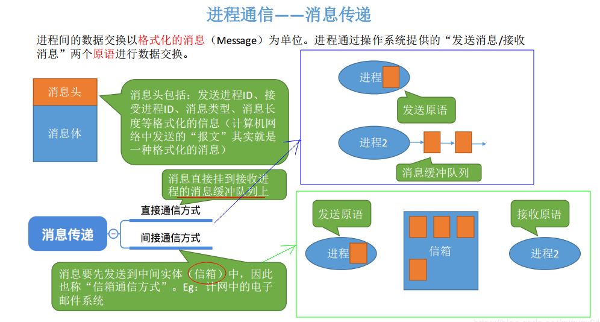

**本节小结** :

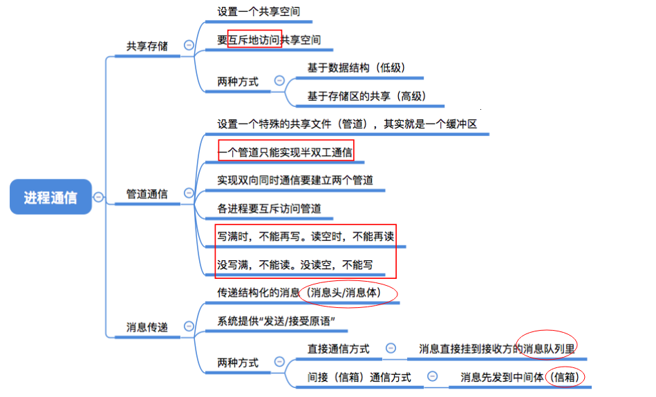

***

## 五、线程、多线程概念模型

**引入线程机制带来的变化**:

* 进程是资源分配的基本单位。
* 线程是独立调度的基本单位。

**线程属性**:

**线程的实现方式: 用户级线程和内核级线程**

**三种多线程模型**:

**本节小结**

注意进程和线程区别:

 * ①拥有资源: 进程是资源分配的基本单位，但是线程不拥有资源，线程可以访问隶属进程的资源；
 * ②调度: 线程是独立调度的基本单位，在同一进程中，线程的切换不会引起进程切换，从一个进程内的线程切换到另一个进程中的线程时，会引起进程切换。
 * ③系统开销: 由于创建或撤销进程时，系统都要为之分配或回收资源，如内存空间、I/O 设备等，所付出的开销远大于创建或撤销线程时的开销。类似地，在进行进程切换时，涉及当前执行进程 CPU 环境的保存及新调度进程 CPU 环境的设置，而线程切换时只需保存和设置少量寄存器内容，开销很小。
 * ④通信: 进程间通信 (IPC) 需要进程同步和互斥手段的辅助，以保证数据的一致性。而线程间可以通过直接读/写同一进程中的数据段（如全局变量）来进行通信。

***
##  六、处理机调度的概念、层次

**知识总览** 

**三种调度:高级调度(作业调度)、中级调度(内存调度)、低级调度(进程调度**)

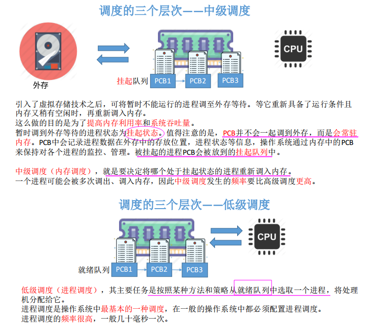

**本节小结**

***
## 七、进程调度的时机、切换与过程、方式

**知识总览**

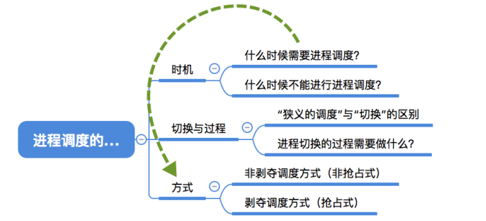

**由被动放弃处理机调度方式引出进程调度的方式: 非剥夺调度方式和剥夺调度方式**

**本节小结**:

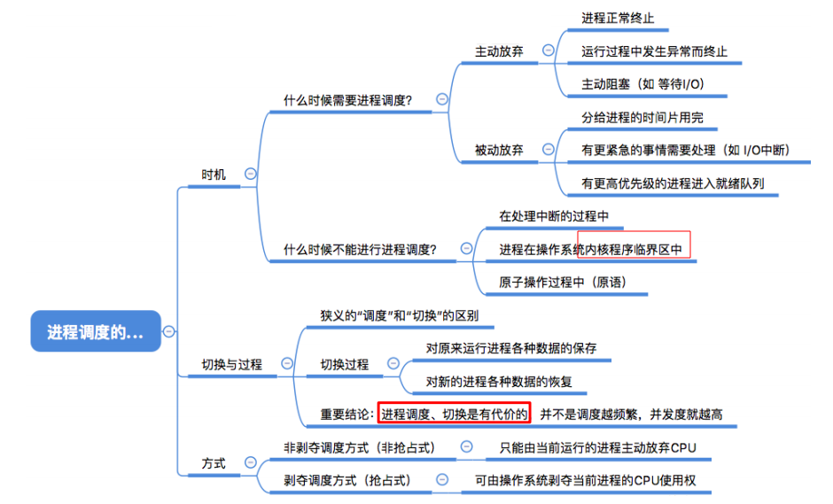

***
## 八、调度算法的评价指标
**知识总览**

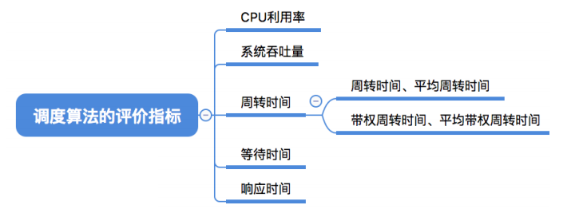

**`CPU`利用率和系统吞吐量**

> 批处理系统没有太多的用户操作，在该系统中，调度算法目标是保证吞吐量和周转时间（从提交到终止的时间）。

**本节小结**

***
## 九、调度算法：先来先服务、最短作业优先、最高响应比优先
**知识总览**

**第一种: 先来先服务(`FCFS`)**

**第二种: 短作业优先**

**最短剩余时间优先(短作业优先的抢占式版本)**

**高响应比优先**

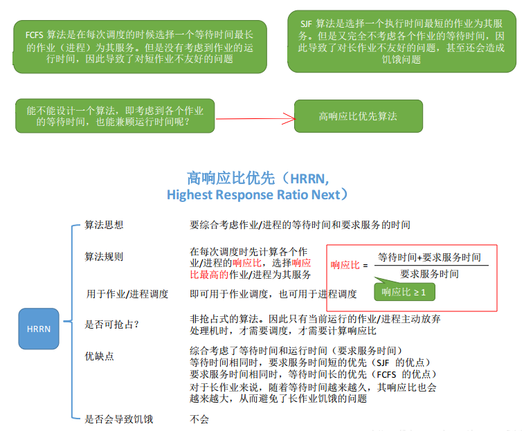

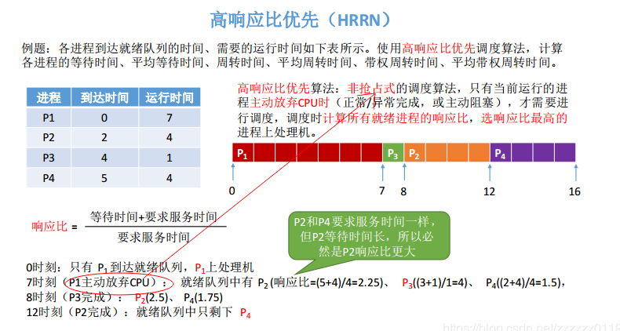

**本节小结:三种算法对比**

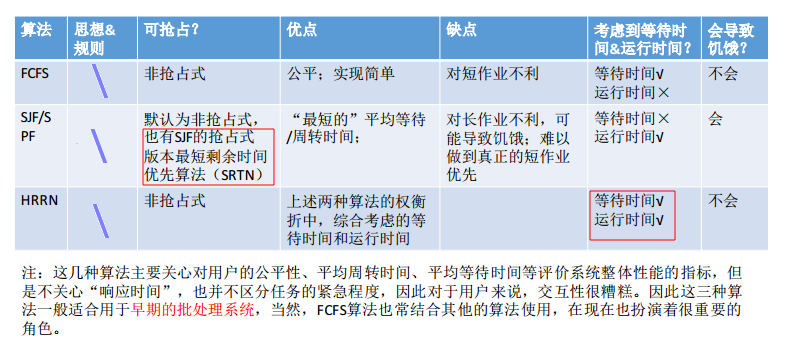

***
## 十、调度算法：时间片轮转、优先级、多级反馈队列
**时间片轮转**

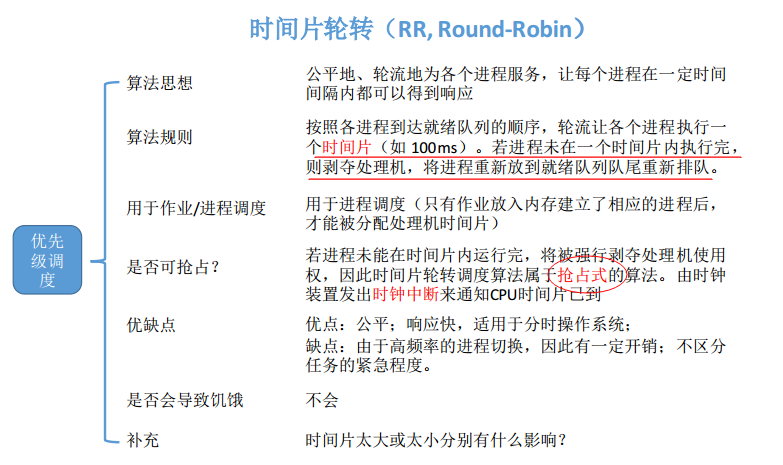

**优先级调度算法**

**抢占式的优先级调度**

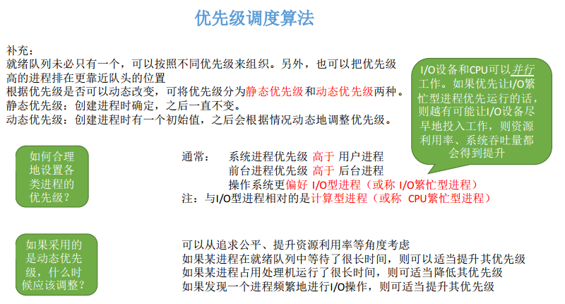

**多级反馈队列调度算法: 优先级+时间片**

**本节小结**

***
