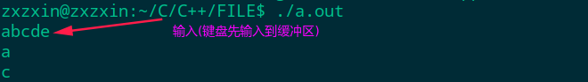
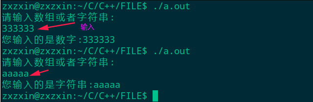
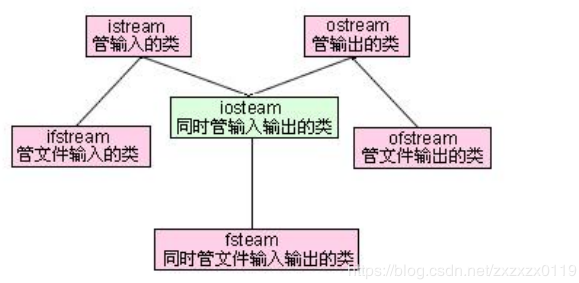
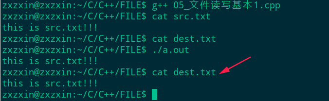

## C++基础知识总结(一)

* [C++对C语言的提高](#c对c语言的提高)
  * [命令空间简单使用](#命令空间简单使用)
  * [`const`关键字的加强](#const关键字的加强)
  * [引用-重点](#引用-重点)
  * [指针引用](#指针引用)
  * [没有引用指针](#没有引用指针)
  * [`const`引用](#const引用)
  * [默认参数函数重载作用域运算符](#默认参数函数重载作用域运算符)
  * [`new`、`delete`的使用](#newdelete的使用)
* [C++面向对象基础](#c面向对象基础)
  * [一个简单案例](#一个简单案例)
  * [构造函数和析构函数](#构造函数和析构函数)
  * [深拷贝和浅拷贝](#深拷贝和浅拷贝)
  * [指向对象成员函数的指针](#指向对象成员函数的指针)
  * [常对象](#常对象)
  * [常对象成员-常数据成员&常成员函数](#常对象成员-常数据成员常成员函数)
* [C++重载运算符](#c重载运算符)
* [函数模板、类模板](#函数模板类模板)
* [文件操作](#文件操作)
***
### <font color = red id = "1">C++对C语言的提高
##### 命令空间简单使用
引用命令空间的三种方式: 

* 直接指定标识符。例如`std::cout<<"hello"<<std::endl;`；
	 使用`using`关键字。例如`using	std::cout;	`；
* 导入整个命令空间。例如`using namespace std; `导入`std`命名空间；
```cpp
#include <iostream>

//定义一个命令空间
namespace space1{ 
    int a = 100;
    int b = 200;
}

//using namespace std;
//只导入其中的cout和endl
using std::cout;
using std::endl;

int main(int argc, char const **argv)
{ 
    cout<<"hello"<<endl;
    using namespace space1;//直接导入命令空间
    cout<<a<<" "<<b<<endl;
    return 0;   
}
```
##### `const`关键字的加强

* `C`语言中的`const`是一个冒牌货，即使用来修饰变量的值不能修改，但是还是可以通过指针指向这个变量，然后修改指针指向的内存来修改这个变量的值；
* 注意`const`和`#define`的区别: ①`#define`只是在预编译时进行字符置换，例如`#define PI 3.14`，这里的`PI`不是变量，没有类型，不占用存储单元。②而`const float PI = 3. 14`定义了常变量`PI`，它具有变量的属性，有数据类型，占用存储单元，只是在程序运行期间变量的值是固定的，不能改变(<font color=  red>真正的不能改变</font>)；

测试: 

```cpp
#include <iostream>

int main(int argc, char const **argv)
{
    //a此时是一个真正的常量 : 不能通过指针修改(C语言中的const是一个冒牌货)
    const int a = 100;
    //如果对一个常量取地址，编译器会临时开辟一个空间temp,让这个指针指向temp
    int *p = (int *)&a; //注意要强制转换一下
    *p = 200;
    printf("a = %d, *p = %d\n", a, *p);

    //可以使用const定义的"常量"来定义数组(C语言中不能这样)
    int arr[a]; //ok
    return 0;
}
```

输出(可以看到`a`没有改变(`C`语言中会变)): 
```
a = 100, *p = 200
```
##### 引用-重点

* 变量名，本身是一段内存的引用，即别名(`alias`). 引用可以看作一个已定义变量的别名；
* 对变量声明一个引用，<font color = red>并不另外开辟内存单元</font>，例如`int &b = a`，则`b`和`a`都代表同一个内存单元(使用`sizeof()`测`a`、`b`大小是相同的)。<font color= red>引用与被引用的变量有相同的地址</font>；
* 在声明一个引用时，<font color = red>必须同时初始化</font>(和常量有点类似)，即声明它代表哪一个变量；
* 当声明一个变量的引用后，改引用一直与其代表的变量相联系，<font color = red>不能再作为其他变量的别名</font>。
* `&`符号前有数据类型时，是引用。其他都是代表取地址；
* 引用所占用的大小跟指针是相等的，引用可能是一个"常指针"(`int *const p`)；
* 对引用的初始化，可以是一个变量名，也可以是另一个引用。如`int a = 3; int &b = a; int &c = b；`此时，整形变量`a`有两个别名`b`、`c`；
* 不能建立`void`类型的引用(但是有`void *`类型指针(万能指针))。不能建立引用的数组(可以有指针数组)；


使用经典的`swap`问题来看引用作为形参的简单使用: 

```cpp
#include <stdio.h>

//值传递(不行)
int swap1(int a, int b){ 
    int t = a;
    a = b;
    b = t;
}

//指针(也是值传递)
int swap2(int *a, int *b){   
    int t = *a;
    *a = *b;
    *b = t;
}

//引用(引用传递)
int swap3(int &a, int &b){ 
    int t = a;
    a = b;
    b = t;
}

int main(int argc, char const **argv)
{ 
    int a = 100, b = 200;
    swap1(a, b);
    printf("a = %d, b = %d\n", a , b);
    swap2(&a, &b);
    printf("a = %d, b = %d\n", a , b);
    swap3(a, b);
    printf("a = %d, b = %d\n", a , b);
    return 0;
}
```
输出: 

```cpp
a = 100, b = 200
a = 200, b = 100
a = 100, b = 200
```

##### 指针引用
可以建立指针变量的引用，如: 

```cpp
int a = 5;
int *p = &a;
int* &ref = p; //ref是一个指向 “整形变量的指针变量” 的引用，初始化为p
```
下面看一个使用指针引用的例子，对比使用<font color = blue>二级指针</font>和使用<font color= blue>指针引用</font>的区别: 
```cpp
#include <stdio.h>
#include <string.h>
#include <stdlib.h>

struct Student{ 
    int age;
    char name[20];
};

//通过二级指针
void getMem(Student **temp){ 
    Student *p = (Student *)malloc(sizeof(Student));
    p->age = 13;
    strcpy(p->name, "zhangsan");
    *temp = p;
}
//通过引用
void getMem2(Student* &p){ //将Student*看成一个类型 
    p = (Student *)malloc(sizeof(Student));
    p->age = 14;
    strcpy(p->name, "lisi");
}

//通过指针
void free1(Student **temp){ 
    Student *p = *temp;
    if(p != NULL){ 
        free(p);
        *temp = NULL;
    }
}
//通过指向指针的引用
void free2(Student* &p){ //指向指针的引用
    if(p != NULL){ 
        free(p);
        p = NULL;
    }
}

int main(int argc, char const **argv)
{ 
    Student *p = NULL;
    getMem(&p);
    printf("age = %d, name = %s\n", p->age, p->name); 
    free1(&p);

    printf("------------------\n");

    getMem2(p);
    printf("age = %d, name = %s\n", p->age, p->name);
    free2(p);
    return 0;
}

```
输出:

```cpp
age = 13, name = zhangsan
------------------
age = 14, name = lisi
```

##### 没有引用指针
* 由于引用不是一种独立的数据类型，所以不能建立指向引用类型的指针变量。 
* 但是，可以将<font color= blue>变量的引用的地址</font>赋值给一个指针，此时指针指向的是<font color= blue>原来的变量</font>。

例如: 

```cpp
int a = 3;
int &b = a;
int *p = &b;  //指针变量p指向变量a的引用b,相当于指向a,合法
```
上面代码和下面一行代码相同: 

```cpp
int *p = &a;
```
输出`*p`的值，就是`b`的值，即`a`的值。
不能定义指向引用类型的指针变量，不能写成: 

```cpp
int& *p = &a; //企图定义指向引用类型的指针变量，错误
```

##### `const`引用

* 如果想对一个常量进行引用，必须是一个`const`引用；
* <font color=  red>可以对一个变量进行 常引用(此时引用不可修改，但是原变量可以修改)。这个特征一般是用在函数形参修饰上，不希望改变原来的实参的值；</font>
* 可以用常量或表达式对引用进行初始化，但此时必须用`const`作声明(<font color=  blue>内部是使用一个`temp`临时变量转换</font>)；


测试:

```cpp
#include <stdio.h>
#include <iostream>
using namespace std;

int main(int argc, char const **argv)
{ 
    //对一个常量进行引用
    const int a = 10;
    //int& ref1 = a; //err
    const int &ref1 = a; //ok

    //可以对一个变量进行 常引用(此时引用不可修改，但是原变量可以修改)
    //这个特征一般是用在函数形参修饰上，有时候不希望改变原来的实参的值
    int b = 10;
    const int& ref2 = b;
    //ref2 = 20; //err
    b = 20; // ok
    printf("b = %d, ref2 = %d\n", b, ref2);

    //对表达式做引用
    // 内部系统处理 int temp = c+10; const int& ref3 = temp;
    int c = 30;
    const int& ref3 = c + 10; //合法

    //也可以对不同类型进行转换
    double d = 3.14;
    const int& ref4 = d; // int temp = d; const int& ref4 = temp
    cout<<d<<" "<<ref4<<endl;//b = 3.14,ref4 = 3

    return 0;
}
```
输出: 
```cpp
b = 20, ref2 = 20
3.14 3
```

##### 默认参数、函数重载、作用域运算符

* 如果全局和局部有相同名字变量，使用`::`运算符来操作全局变量；
	 默认参数要注意：<font color = red>	如果默认参数出现，那么右边的都必须有默认参数，也就是只有参数列表后面部分的参数才可以提供默认参数值</font>；
* 函数重载规则: ①函数名相同。②参数个数不同,参数的类型不同,参数顺序不同,均可构成重载。 ③<font color=  red>返回值类型不同则不可以构成重载。 
* 一个函数，不能既作重载，又作默认参数的函数。

简单使用:

```cpp
#include <stdio.h>

int fun(int a, int b = 20, int c = 30){ 
    return a + b + c;
}

int a = 100;

int main(int argc, char const **argv)
{ 
    // 作用域运算符 ::
    int a = 200;
    printf("a = %d\n", a);
    printf("a2 = %d\n", ::a); //全局的a

    printf("%d\n",fun(10));
    printf("%d\n",fun(10, 10));
    printf("%d\n",fun(10, 10, 10));
    return 0;
}
```
##### `new`、`delete`的使用

* `C`语言中使用`malloc`函数必须指定开辟空间的大小，即`malloc(size)`，且`malloc`函数只能从用户处知道应开辟空间的大小而不知道数据的类型，因此无法使其返回的指针指向具体的数据类型。其返回值一律为`void *`，使用时必须强制转换；
* `C++`中提供了`new`和`delete`<font color= red>运算符</font>来替代`malloc`和`free`函数；
* 差别: `malloc`不会调用类的构造函数,而`new`会调用类的构造函数。②`free`不会调用类的析构函数，而`delete`会调用类的析构函数；(析构函数释放的是对象内部的内存，而`delete`释放的是对象，而`delete`也出发析构，所以都可以释放)


例如

```cpp
new int； //开辟一个存放整数的空间，返回一个指向整形数据的指针
new int(100); //开辟一个存放整数的空间，并指定初始值为100
new char[10]; // 开辟一个存放字符数组的空间，size = 10
new int[5][4];
float *p = new float(3.14); //将返回的指向实型数据的指针赋给指针变量p
delete p;
delete []p; //释放对数组空间的操作(加方括号)
```
简单测试：

```cpp
#include <stdio.h>

int main(int argc, char const **argv)
{
    // new 和 delete 使用
    int *p1 = new int(10);
    printf("*p1 = %d\n", *p1);
    delete p1;

    int *p2 = new int[10];
    for(int i = 0;i < 10; i++)
        p2[i] = i;
    for(int i = 0;i < 10; i++)
        printf("%d ",p2[i]);
    printf("\n");
    
    delete []p2;
    return 0;
}
```
输出:
```cpp
*p1 = 10
0 1 2 3 4 5 6 7 8 9 
```

***
###  <font color = red id = "2">C++面向对象基础

##### 一个简单案例
> 题目，判断两个圆是否相交。
```cpp
#include <stdio.h>
#include <iostream>
#include <math.h>
using namespace std;

//点(坐标类)
class Point{ 
    public:
        void setXY(int x, int y);
        double getPointDis(Point &thr); //计算两点距离
    private:
        int x;
        int y;
};

//圆类
class Circle{ 
    public:
        void setR(int r);
        void setXY(int x, int y);
        bool isInterSection(Circle &thr);
    private:
        int r;
        Point p0; //圆心
};

void Point::setXY(int x, int y){ 
    this->x = x;
    this->y = y;
}
double Point::getPointDis(Point &thr){ 
    int dx = x - thr.x;
    int dy = y - thr.y;
    double dis = sqrt(dx*dx + dy*dy);
    return dis;
}

void Circle::setR(int r){ 
    this->r = r; //注意不能写成this.r (this是一个指针,每个对象都可以通过this指针来访问自己的地址)
}
void Circle::setXY(int x,int y){ 
    p0.setXY(x, y);
}
bool Circle::isInterSection(Circle &thr){ 
    int R = r + thr.r; //两个圆的半径之和
    double dis = p0.getPointDis(thr.p0); //两个圆心的距离
    if(dis <= R)
        return true;
    else 
        return false;
}

int main(int argc, char const **argv)
{   
    Circle c1,c2;
    c1.setR(1);
    c1.setXY(0,0);
    c2.setR(3);
    c2.setXY(2,2);

    Circle *pc1 = &c1; //定义指向对象的指针

    if(pc1->isInterSection(c2))//通过指针的方式调用
        printf("两圆相交!\n");
    else 
        printf("两圆不相交!\n");
    return 0;
}

```
输出：
```cpp
两圆相交!
```
##### 构造函数和析构函数
* 如果用户没有定义默认的，系统会提供一个默认构造函数，但是如果用户已经定义了构造函数，系统就不会提供默认的构造函数；
* 系统也会提供一个默认的<font  color = blue>拷贝构造函数</font>，默认是浅拷贝，形如`Clazz c1(c2)`的使用，将`c1`拷贝给`c2`；
* `C++`有一个参数初始化列表的特性，注意不能用在数组上；
* 构造函数也可以是带有默认参数；
* 析构函数被调用的情况:① 如果用`new`运算符动态的建立了一个对象，当用`delete`运算符释放该对象时，先调用该对象的析构函数。②`static`局部对象在函数调用结束之后对象并不是放，因此也不调用析构函数。只有在调用`exit`或者`main`函数结束的时候才会调用`static`的析构函数。
* 构造函数和析构函数的顺序: ①<font color = red>先构造的后析构，后构造的先析构；


拷贝构造函数
```cpp
#include <stdio.h>

class Clazz{ 
    public:
        Clazz(){ 
            x = 0;
            y = 0;
        }
        Clazz(int x, int y){ 
            this->x = x;
            this->y = y;
        }
        void printXY(){ 
            printf("%d, %d\n", x, y);
        }

        //显示的拷贝构造函数  如果不写，默认也有这个
        Clazz(const Clazz &thr){ 
            x = thr.x;
            y = thr.y;
        }
    private:
        int x;
        int y;
};

int main(int argc, char const **argv)
{
    Clazz c1(100, 200);

    Clazz c2(c1); //拷贝
    c2.printXY();

    //构造函数是对象初始化的时候调用
    Clazz c3 = c1; // 调用的依然是c3的拷贝构造函数
    c3.printXY();


    Clazz c4; //调用的是无参构造器
    c4 = c1; //不是调用拷贝构造函数，而是重载操作符
    c4.printXY();

    return 0;
}

```

构造函数中的<font color = blue>参数初始化列表</font>: 

* 注意构造对象成员的 顺序跟初始化列表的顺序无关；
* 而是跟成员对象的定义顺序有关；
```cpp
#include <stdio.h>
#include <string.h>

class Box{ 
    public:
        Box(); //默认的无参
        //参数初始化表
        Box(int l, int w, int h):l(l),w(w),h(h)
        {
            strcpy(this->name, "zhangsan"); //默认
        }
        Box(int l, int w, int h, const char *name):l(l),w(w),h(h)
        {
            strcpy(this->name,name); //字符串不能那样初始化
        }
        int volume();
    private:
        char name[10];
        int l,w,h;
};

Box::Box()
{ 
    l = 10;
    w = 10;
    h = 10;
    strcpy(this->name, "zhangsan");
}

int Box::volume()
{ 
    return l*w*h;
}

int main(int argc, char const **argv)
{ 
    Box b1;
    printf("%d\n", b1.volume());
    Box b2(20, 20, 20);
    printf("%d\n", b2.volume());
    Box b3(30, 30, 30, "lisi");
    printf("%d\n", b3.volume());
    return 0;
}
```
输出: 

```cpp
1000
8000
27000
```

##### 深拷贝和浅拷贝
* 深拷贝是有必要的，因为析构函数释放内存的时候，如果使用浅拷贝拷贝了一个对象，释放两个对象指向得到同一个内存两次，就会产生错误。
```cpp
#include <stdio.h>
#include <stdlib.h>
#include <string.h>

class Teacher{ 
    public:
        Teacher(int id, const char* name){
            this->id = id;
            int len = strlen(name);
            this->name = (char*)malloc(len+1);
            strcpy(this->name, name);
        }

        //显式的提供一个拷贝构造函数，完成深拷贝动作
        // 防止在析构函数中 释放堆区空间两次
        Teacher(const Teacher &thr){ 
            id = thr.id;
            //深拷贝  
            int len = strlen(thr.name);
            name = (char*)malloc(len + 1);
            strcpy(name, thr.name);
        }

        //必须要显式的提供深拷贝构造函数，不然会释放两次
        ~Teacher(){ 
            if(name != NULL){ 
                free(name);
                name = NULL;
            }
        }

        void print(){ 
            printf("id: %d, name = %s\n", id, name);
        }
    private:
        int id;
        char *name;
};

int main(int argc, char const **argv)
{ 
    Teacher t1(1, "zhangsan");
    t1.print(); 
    Teacher t2(t1);
    t2.print();
    return 0;
}
```


##### 指向对象成员函数的指针
* 注意: 定义指向对象成员函数的指针变量的方法和定义[**指向普通函数的指针变量**](https://blog.csdn.net/zxzxzx0119/article/details/84001021#t3)不同，定义指向成员函数的指针变量的方法: `void (Time:: *p)();`(对比普通的: `void (*p)();`) : 定义`p`为指向`Time`类中公共成员函数的指针变量；
* 可以使用上面的`p`指针指向一个公用成员函数，只需把公用成员函数的入口地址赋给一个公用成员函数的指针即可，如`p = &Time::get_time`;

简单测试: 
```cpp
#include <stdio.h>

class Time{ 
    public:
        Time(int h, int m, int s):hour(h),minute(m),sec(s){ }
        void get_time();
    private:
        int hour;
        int minute;
        int sec;
};

void Time::get_time()
{ 
    printf("%d:%d:%d\n", hour, minute, sec);
}

int main(int argc, char const **argv)
{ 
    Time t1(10,10,30); //10:10:30
    Time *p = &t1; //定义指向对象的指针
    p->get_time();

    void (Time::*p2)(); //定义指向Time类公共成员函数的指针变量
    p2 = &Time::get_time;
    (t1.*p2)(); // 调用对象t1中p2所指向的成员函数(即t1.get_time())

    return 0;
}
```
输出:  
```cpp
10:10:30
10:10:30
```
##### <font color = green>常对象
* 可以在定义对象时加上关键字`const`，指定对象为常对象。<font color= red>常对象必须要有初值，凡是希望保护数据成员不被改变的对象，都可以声明为常对象。</font>
* 基本语法: `类名 const 对象名 [(实参表)]` 或者`const 类名 对象名 [(实参表)]`，举例: `Time const t(10, 10, 30)`和`const Time t(10, 10, 30)`；
* 如果一个对象被声明为常对象，则通过改对象<font color = red>只能调用它的常成员函数，不能调用对象的普通成员函数；例如`void get_time() const` </font>(常成员函数)；
* <font color= blue>常成员函数可以访问常对象中的数据成员，但不允许修改常对象中数据成员的值；</font>

##### <font color = green>常对象成员-常数据成员&常成员函数
①<font color = purple>常数据成员
* 只能通过构造函数的<font color=  red>参数初始化表</font>对常数据成员进行初始化，任何其他函数都不能对常数据赋值；
* 因为常数据成员不能被赋值；

②<font color = purple>常成员函数
* 常成员函数声明: 例如`void get_time() const`，<font color= red>常成员函数只能引用本类中的数据成员，不能修改它们</font>；
* 注意: 如果定义了一个常对象，只能调用其中的`const`成员函数，不能调用非`const`成员函数(不论这些函数是否会修改对象中的数据)；
* 常成员函数不能调用另一个非`const`成员函数；

|数据成员|非`const`成员函数|`const`成员函数|
|-|-|-|
|非`const`数据成员|可以引用，可以改变值|可以引用，不可改变值|
|`const`数据成员|可以引用，不可改变值|可以引用，不可改变值|
|`const`对象|不允许|可以引用，不可改变值|

##### <font color = green>指向对象的常指针
* 基本语法`Time * const p = &t1`和基本的常指针差不多；
* 只能指向同一个对象不能改变指针的指向；
* 意义是作为函数的形参，不允许在函数执行过程中改变指针变量，使其始终指向原来的对象；
##### <font color = green>指向常变量、对象的指针
①<font color = purple>指向常变量的指针
* 如果一个变量已经被声明为常变量，只能用指向常变量的指针变量指向它，而不能用非`const`指针指向它；

```cpp
const char c[] = "boy";
const char *p1 = c; // ok
char *p2 = c; // err
```
* `const`指针除了可以指向`const`变量，<font color = blue>还可以指向非`const`变量，此时不能通过指针来改变变量的值；
* 如果函数的形参是指向非`const`变量的指针变量，实参只能使用指向非`const`变量的指针；更多形参和实参指针变量关系看下表；

|<font color= blue>形参|<font color= blue>实参|<font color= blue>合法否|<font color= blue>改变指针所指向的变量的值|
|-|-|-|-|
|指向非`const`变量的指针|非`const`变量的地址|合法|可以|
|指向非`const`变量的指针|`const`变量的地址|不合法||
|指向`const`变量的指针|`const`变量的地址|合法|不可以|
|指向`const`变量的指针|非`const`变量的地址|合法|不可以|

②<font color = purple>指向常对象的指针
* 和指向常变量的指针类似，只能用<font color = red>指向常对象的指针变量</font>指向它，不能用指向非`const`对象的指针指向它；
* 如果定义了一个指向常对象的指针变量，并指向了一个<font color=  red>非`const`对象</font>，则不能通过改指针变量来改变变量的值；

```cpp
Time t1(10, 10, 30);
const Time *p = &t1;
(*p).hour = 20;  //err
```
* 使用意义也是在形参上，希望调用函数的时候对象的值不被改变，就把形参指定为指向常对象的指针变量；

##### 静态成员
①<font color = purple>静态数据成员
* 静态数据成员在内存中只占一份空间(不是每一个对象都为它保留一份空间)，静态数据成员的值对所有对象都是一样的，如果改变它的值，在其他对象中也会改变；
* <font color = red>静态数据成员只能在类体外进行初始化。如`int Box::height = 10;`，只在类体中声明静态数据成员时加上`static`，不必在初始化语句中加`static`。
* 不能在参数初始化列表中对静态数据成员进行初始化；

②<font color = purple>静态成员函数
* <font color = red>静态成员函数和普通函数最大的区别就在静态成员函数没有`this`指针，决定了静态成员函数与不能访问本类中的非静态成员。</font>所以静态成员函数的作用就是用来访问静态数据成员；
* 但是普通成员函数(非静态)可以引用类中的静态数据成员；
##### 友元
① <font color = purple>将普通函数声明为友元函数

* 这样这个普通函数就可以访问声明了友元函数的那个类的私有成员；

```cpp
#include <stdio.h>

class Time{
    public:
        Time(int, int, int);
        friend void display(Time&); 
    private:
        int hour;
        int minute;
        int sec;
};

Time::Time(int h, int m, int s){ 
    hour = h;
    minute = m;
    sec = s;
}

//普通的友元函数
void display(Time& t){ 
    printf("%d:%d:%d\n", t.hour, t.minute, t.sec);
}

int main(int argc, const char **argv)
{ 
    Time t(10, 10, 30);
    display(t);
    return 0;
}
```
输出: 
```cpp
10:10:30
```

② <font color = purple>将别的类中的成员函数声明为友元函数

```cpp
#include <stdio.h>

class Date; //对Date类声明

class Time{ 
    public:
        Time(int, int, int);
        void display(Date &); //要访问Date类的成员
    private:
        int hour;
        int minute;
        int sec;
};

Time::Time(int h, int m, int s){ 
    hour = h;
    minute = m;
    sec = s;
}

class Date{ 
    public:
        Date(int, int, int);
        friend void Time::display(Date &); //声明Time类中的display函数为本类的友元函数
    private:
        int month;
        int day;
        int year;
};

Date::Date(int m, int d, int y){ 
    month = m;
    day = d;
    year = y;
}

void Time::display(Date &d){ 
    printf("%d/%d/%d\n",d.month, d.day, d.year);
    printf("%d:%d:%d\n", hour, minute, sec);
}

int main(int argc, const char **argv)
{
    Time t(10, 10, 30);
    Date d(12,25,2018);
    t.display(d);
    return 0;
}

```

③ <font color = purple>友元类

* 在`A`类中声明`B`类是自己的友元类，这样`B`类就可以访问`A`的所有私有成员了。
* 但是要注意友元的关系是单向的而不是双向的。且友元的关系不能传递；

* **
###  <font color = red id = "3">C++重载运算符

##### 重载基本运算符
<font color = purple>**案例一: 重载`+`号来计算复数**

```cpp
#include <stdio.h>


class Complex{ 
    public:
        Complex(int a, int b):a(a),b(b){ }
        
        // 方法一.使用成员函数
        //不能写成返回& （引用)因为temp是局部的 ,函数调用完毕就会释放 
        Complex operator+ (const Complex &thr){
            Complex temp(a + thr.a, b + thr.b);
            return temp;
        }

        //　方法二.使用友元函数
        //friend Complex operator+ (const Complex &c1, const Complex &c2);

        // 打印
        void printC()
        { 
            printf("(%d,%di)\n",a,b);
        }
    private:
        int a; //实部
        int b; //虚部
};

//Complex operator+ (const Complex &c1, const Complex &c2){ //注意也不能返回局部的引用 
//    return Complex(c1.a + c2.a, c1.b + c2.b);
//}

int main(int argc, char const **argv)
{ 
    Complex c1(1,2);
    Complex c2(3,4);
    Complex c3 = c1 + c2;
    
    //下面的显示调用也是和上面等同的，但是一般不会这么写
    //Complex c3 = c1.operator+(c2); //成员函数 
    //Complex c3 = operator+(c1, c2); //友元函数
    c3.printC();
}

```
输出: 
```cpp
(4,6i)
```

<font color = purple>**案例二: 重载双目运算符**

* 注意这个要返回的是引用，因为运算符支持连续的相加操作；
* 在成员函数中返回 `this`指针指向的内容，在友元函数中可以返回第一个参数的引用(不是局部变量的，所以可以返回)；

```cpp
#include <stdio.h>

//重载 += 运算符
class Complex{ 
    public:
        Complex(int a, int b):a(a), b(b){ }

        // 方法一:使用成员函数 
        // 注意这里和上一个不同，这里要返回引用
        //Complex& operator+= (const Complex &thr){ 
        //    this->a += thr.a;
        //    this->b += thr.b;
        //    return *this; //注意这里返回this指针指向的内容
        //}

        // 方法二: 使用友元函数
        friend Complex& operator+= (Complex& c1, const Complex& c2);

        void printC()
        { 
            printf("(%d,%di)\n", a, b);   
        }
    private:
        int a;
        int b;
};

//也要返回引用 因为要支持连续操作 类似(c1 += c2) += c3
Complex& operator+= (Complex& c1, const Complex& c2){ 
    c1.a += c2.a;
    c1.b += c2.b;
    return c1;
}

int main(int argc, char const **argv)
{ 
    Complex c1(1,2);
    Complex c2(3,4);
    (c1 += c2) += c2;
    c1.printC();
    
    return 0;
}

```
<font color = purple>**案例三: 重载单目运算符**

```cpp
#include <stdio.h>


class Complex{ 
    public:
        Complex(int a, int b):a(a),b(b){ }

        //重载 前置++
        Complex operator++ (){ 
            a++;
            b++;
            return *this;
        }

        // 重载后置++  需要使用一个占位符
        friend const Complex operator++ (Complex& c1, int);
        void printC()
        { 
            printf("(%d,%di)\n", a, b);
        }
    private:
        int a;
        int b;
    
};

//后置++
const Complex operator++ (Complex& c1, int)
{ 
    Complex temp(c1.a, c1.b);
    c1.a++;
    c1.b++;
    return temp; 
}

int main(int argc, char const **argv)
{ 
    Complex c(1,2);
    c++;
    c.printC();
    ++c;
    c.printC();
    return 0;
}

```
输出: 

```cpp
(2,3i)
(3,4i)
```


##### 重载`=`号操作符
* 这个重点是在当类中有指针的时候，就要注意堆中分配空间的问题，如果不是在初始化的时候使用的`=`操作符，就是代表的赋值，其中的指针不能使用浅拷贝；
* 需要我们重写`=`操作符，实现深拷贝。(就是不能让两个对象同时指向堆中的同一块内存，因为释放内存的时候不能释放两次)；
```cpp
#include <stdio.h>
#include <string.h>

class Student{ 
    public:
        Student() {
            this->id = 0;
            this->name = NULL;
        }
        Student(int id, const char *name){ 
            this->id = id;

            int len = strlen(name);
            this->name = new char[len+1];
            strcpy(this->name, name);
        }
        Student(const Student& thr){  // 拷贝构造
            this->id = thr.id;
            //深拷贝
            int len = strlen(thr.name);
            this->name = new char[len+1];
            strcpy(this->name, thr.name);
        }

        //重载=号，防止 s2 = s1的时候内部的name直接指向堆中的同一个内容，析构时发生错误
        Student& operator= (const Student& thr){ 
            //1. 防止自身赋值
            if(this == &thr) //&是取地址 
                return *this;
            //2. 将自身的空间回收
            if(this->name != NULL){ 
                delete[] this->name;
                this->name = NULL;
                this->id = 0;
            }

            //3. 执行深拷贝
            this->id = thr.id;
            int len = strlen(thr.name);
            this->name = new char[len + 1];
            strcpy(this->name, thr.name);

            //4. 返回本身的对象
            return *this;
        }
        ~Student(){ 
            if(this->name != NULL){ 
                delete[] this->name;
                this->name = NULL;
                this->id = 0;
            }
        }
        void printS(){ 
            printf("%s\n", name);
        }
    private:
        int id;
        char *name;
};


int main(int argc,const char **argv)
{
    Student s1(1, "zhangsan");
    Student s2(s1); //拷贝构造
    Student s3 = s1; //这个调用的还是拷贝构造函数，不是=操作符，初始化的都是拷贝构造函数
    s1.printS();
    s2.printS();
    s3.printS();
    

    //但是这样就是调用的等号操作符
    Student s4;
    s4 = s1; //不是初始化的时候
    s4.printS();
    return 0;
}
```

##### 重载流插入运算符和流提取运算符

* 重载流插入运算符的基本格式: `istream& operator>> (istream&, 自定义类&);` ，也就是返回值和第一个参数必须是`istream&`类型；
* 重载流提取运算符的基本格式: `ostream& operator<< (istream&, 自定义类&);`，也就是返回值和第一个参数必须是`ostream&`类型；
* <font color = red>注意: 重载这两个运算符的时候，只能将他们作为友元函数，不能作为成员函数。避免修改 `c++`的标准库。</font>

案例: 
```cpp
#include <stdio.h>
#include <iostream>
using namespace std;

class Complex{ 
    public:
        friend ostream& operator<< (ostream&, Complex&);
        friend istream& operator>> (istream&, Complex&);
    private:
        int a;
        int b;
};

ostream& operator<< (ostream& os, Complex& c)
{ 
    os<<"("<<c.a<<","<<c.b<<"i)"<<endl;
    return os;//返回stream对象就可以连续向输出流插入信息
}

istream& operator>> (istream& is, Complex& c)
{ 
    cout<<"a:";
    is>>c.a;
    cout<<"b:";
    is>>c.b;
    return is;
}

int main(int argc, char const **)
{ 
    Complex c;
    cin>>c;
    cout<<c;
    return 0;
}

```
##### 综合案例: 矩阵加法以及输入输出

```cpp
#include <stdio.h>
#include <iostream>
using namespace std;

const int N = 2;
const int M = 3;

class Matrix{ 
    public:
        Matrix();
        friend Matrix operator+(Matrix&, Matrix&);
        //千万注意: 只能将"<<"和">>"定义为友元函数，不能作为成员函数
        friend ostream& operator<<(ostream&, Matrix&);
        friend istream& operator>>(istream&, Matrix&); 
    private:
        int mat[N][M];
};

Matrix::Matrix(){ 
    for(int i = 0; i < N; i++){ 
        for(int j = 0; j < M; j++){ 
            mat[i][j] = 0;
        }
    }
}

//注意返回局部变量对象，不能返回引用
Matrix operator+ (Matrix& a, Matrix& b){ 
    Matrix c;
    for(int i = 0; i < N; i++){ 
        for(int j = 0; j < M; j++){ 
            c.mat[i][j] = a.mat[i][j] + b.mat[i][j];
        }
    }
    return c;
}

ostream& operator<<(ostream& os, Matrix& m){ 
    for(int i = 0; i < N; i++){ 
        for(int j = 0; j < M; j++){ 
            os<<m.mat[i][j]<<" ";
        }
        os<<endl;
    }
}

istream& operator>>(istream& is, Matrix& m){ 
    for(int i = 0; i < N; i++){ 
        for(int j = 0; j < M; j++){ 
            is>>m.mat[i][j];
         }
    }
    return is;
}

int main(int argc, const char **argv)
{
    Matrix matrix1,matrix2;
    cin>>matrix1;
    cin>>matrix2;
    Matrix matrix3 = matrix1 + matrix2;
    cout<<matrix3<<endl;
    return 0;
}
```
运行结果: 


***

###  <font color = red id = "4">函数模板、类模板

* 函数模板基本语法: `template <typename T>`；
* 类模板基本语法: `template <class T>`，注意函数声明在外面的时候也要在函数的上面写上这个语句；
* 函数模板实际上是建立一个通用函数， 其函数类型和形参类型不具体制定， 用 一个虚拟的类型来代表。 这 个通用函数就成为函数模板；
* 注意:  ①函数模板不允许自动类型转化；②普通函数能够自动进行类型转化；
* <函数模板和普通函数在一起调用规则：① 函数模板可以想普通函数那样可以被重载；②`C++`编 译器优先考虑普通函数；
* 类模板中的 `static`关 键字: ①从 类模板实例化的每一个模板类有自己的类模板数据成员， 该 模板的所有对象共享一 个 `statci`数 据成员②每 个模板类有自己类模板的`static`数据成员的副本；


测试程序: 
```cpp
#include <stdio.h>
#include <iostream>
using namespace std;

template<typename T>
void swap1(T& a, T& b){
    T t = a;
    a = b;
    b = t;
}

template<class T, class R>
class Complex{ 
    public:
        Complex(T a, R b):a(a),b(b){ }
        //方法一: 下面的printC函数是在类内实现
        //void printC()
        //{
        //    cout<<"("<<a<<","<<b<<"i)"<<endl;
        //}
        
        //方法二: 在类外实现要声明
        void printC();

        //方法三: 重载+友元函数 最好作为内部，外部有点麻烦
        friend ostream& operator<< (ostream& os, Complex<T,R>& c){ 
            os<<"("<<c.a<<","<<c.b<<"i)"<<endl;
            return os;
        }
    private:
        T a;
        R b;
};

//在类外实现,必须要加上函数模板
template<class T,class R>
void Complex<T,R>::printC()
{ 
    cout<<"("<<a<<","<<b<<"i)"<<endl;
}

int main(int argc, const char **argv)
{ 
    int a = 10, b = 20;
    swap1<int>(a,b);//显示的调用
    //自动类型推导
    //swap1(a, b);
    printf("a = %d,b = %d\n", a, b);

    printf("-------类模板-------\n");
    Complex<double, double>c1(2.2, 3.3);
    c1.printC();

    Complex<int, double>c2(4, 5.5);
    cout<<c2<<endl;
    return 0;
}
```
输出: 

```cpp
a = 20,b = 10
-------类模板-------
(2.2,3.3i)
(4,5.5i)
```
**案例: 简单实现的Vector类模板中的`push_back`**
```cpp
#include <stdio.h>
#include <string.h>
#include <iostream>
using namespace std;

template<class T>
class MyArray{ 
    public:
        MyArray(int capacity){ //构造函数
            this->capacity = capacity;
            this->size = 0;
            this->p = new T[this->capacity];
        }
        MyArray<T>(const MyArray<T>& thr){ //拷贝构造
            this->size = thr.size;
            this->capacity = thr.capacity;
            this->p = new T[this->capacity];
            for(int i = 0; i < this->size; i++){  
                this->p[i] = thr.p[i];
            }
        }

        //重载=号
        MyArray<T>& operator= (const MyArray<T>& thr){ 
             //1. 防止自身赋值
             if(this == &thr){ 
                return *this;
             }
             //2. 删除原来的
            if(p != NULL){ 
                delete[] this->p;
                this->p = NULL;
            }

            this->size = thr.size;
            this->capacity = thr.capacity;
            this->p = new T[this->capacity];
            for(int i = 0; i < this->size; i++){ 
                this->p[i] = thr.p[i];
            }
            return *this;
        }


        //重载[]运算符: 提取元素
        T& operator[](int index){ 
            return this->p[index];
        }

        void pushBack(T& ele){ 
            if(size == capacity){ 
                return;
            }
            // 调用的是 = 号运算符，如果成员是指针，要注意深拷贝问题
            p[size++] = ele;
        }
        //搞定插入常量(右值)的引用问题(C++11特性)
        void pushBack(T&& ele){ 
            if(size == capacity){ 
                return;
            }
            // 调用的是 = 号运算符，如果成员是指针，要注意深拷贝问题
            p[size++] = ele;
        }

        ~MyArray(){ 
            if(this->p != NULL){ 
                delete[] this->p;
            }
        }
        
        int getSize(){ 
            return this->size;
        }
    private:
        int capacity;//容量
        int size; //当前数组元素
        T *p; //数组首地址
};


int main(int argc, const char **argv)
{ 
    MyArray<int>array(20); 
    int a = 10, b = 20;
    array.pushBack(a);
    array.pushBack(b);

    array.pushBack(30);

    for(int i = 0; i < array.getSize(); i++){ 
        cout<<array[i]<<endl;
    }
    return 0;
}

```
输出: 
```cpp
10
20
30
```
***
###  <font color = red id = "5">文件操作

#### 输入输出流　

`C++`输入输出包含以下三个方面的内容：
* 对 系统指定的标准设备的输入和输出。 即从键盘输入数据，输出到显示器屏幕。这种输入输出称为标准的输入输出，简称<font color  = blue>标准 I /O。
* 以外存磁盘文件为对象进行输入和输出， 即从磁盘文件输入数据， 数据输出到磁盘文件。 以外存文件为对象的输入输出称为文件的输入输出，简称<font color  = blue>文件 I /O。
* 对 内存中指定的空间进行输入和输出。通常指定一个字符数组作为存储空间( 实际上可以利用该空间存储任何信息) 。 这种输入和输出称为字符串输入输出，简称<font color  = blue>串 I /O。 


缓冲区的概念: 
* 要注意；
* 读和写是站在应用程序的角度来看的；


标准输入流对象 `cin`， 重点函数:
```cpp
cin.get() // 一次只能读取一个字符
cin.get(一个参数) // 读 一个字符
cin.get(两个参数) // 可以读字符串
cin.getline()
cin.ignore()
cin.peek()
cin.putback()
```

测试`cin.get()`、`cin.getline()`的简单使用: 
```cpp
#include <iostream>
#include <iomanip>
using namespace std;

int main(int argc, char const **argv)
{ 
    char ch;
    //while( (ch = cin.get()) != EOF)
    //    cout << ch << endl;
    //char ch;  cin.get(ch); //same as above
    char buf[256] = { 0 };
    cin.get(buf, 256); //　两个参数,从缓冲区读取一个字符串指定长度
    cout << buf;
    cin.get(buf, 256, '\n'); //三个参数,指定终止的字符
    cout << buf;
    cin.getline(buf, 256);  //读取一行数据，不读换行符
    cout << buf;
    return 0;
}
```
测试`cin.ignore()`使用: 

```cpp
#include <iostream>

using namespace std;

int main(int argc, char const **argv)
{ 
    char ch;
    cin.get(ch);    //从缓冲区要数据 阻塞
    cout << ch << endl;
    cin.ignore(1); //忽略当前字符 从缓冲区取走了
    cin.get(ch);
    cout << ch << endl;
    return 0;
}
```
运行效果: 


测试`cin.peek()`函数的使用: 
```cpp
#include <iostream>

using namespace std;

int main(int argc, char const** argv)
{ 
    cout << "请输入数组或者字符串:" << endl;
    char ch;
    ch = cin.peek(); //偷窥一下缓冲区，并不会取走, 返回第一个字符
    if (ch >= '0' && ch <= '9'){
        int number;
        cin >> number; // 从缓冲区读取这个数字
        cout << "您输入的是数字:" << number << endl;
    }
    else{
        char buf[256] = { 0 };
        cin >> buf; // 从缓冲区读取这个字符串
        cout << "您输入的是字符串:" << buf << endl;
    }
    return 0;
}

```
运行结果：　


测试`cin.putback()`函数的使用: 

```cpp
#include <iostream>

using namespace std;

int main(int argc, char const **argv)
{ 
    cout << "请输入字符串或者数字:" << endl;
    char ch;
    cin.get(ch); //从缓冲区取走一个字符
    if (ch >= '0' && ch <= '9'){
        cin.putback(ch); //ch放回到缓冲区
        int number;
        cin >> number;
        cout << "您输入的是数字:" << number << endl;
    }else{
        cin.putback(ch);// 将字符放回缓冲区
        char buf[256] = { 0 };
        cin >> buf;
        cout << "您输入的是字符串: " << buf << endl;
    }
    return 0;
}
```
效果和测试`cin.peek()`函数的一样。

标准输出流对象 `cout`，重点函数: 
```cpp
cout.flush() // 刷新缓冲区
cout.put() // 向缓冲区写字符
cout.write() // 二进制流的输出
cout.width() // 输出格式控制
cout.fill()
cout.setf(标记)
```
`cout`比较简单不做案例演示。


#### 文件读写
输入输出是以系统指定的标准设备（输入设备为键盘，输出设备为显示器）为对象的。 在实际应用中，常以磁盘文件作为对象。即从磁盘文件读取数据，将数据输出到磁盘文件。 和 文件有关系的输入输出类主要在 `fstream.h` 这 个头文件中被定义，在这个头文件中主要被定义了三个类， 由这三个类控制对文件的各种输入输出操作 ， 他们分别是 `ifstream`、 `ofstream`。


由于文件设备并不像显示器屏幕与键盘那样是标准默认设备，所以它在 `fstream.h` 头 文件中
是没有像 `cout` 那 样预先定义的全局对象，所以我们必须自己定义一个该类的对象。 `ifstream` 类 ，它是从 `istream` 类 派生的，用来支持从磁盘文件的输入。`ofstream` 类 ，它是从`ostream`类 派生的，用来支持向磁盘文件的输出。
`fstream` 类 ，它是从` iostream `类 派生的，用来支持对磁盘文件的输入输出。

所谓打开( `open`)文 件是一种形象的说法，如同打开房门就可以进入房间活动一样。 打
开 文件是指在文件读写之前做必要的准备工作，包括：
* 为文件流对象和指定的磁盘文件建立关联，以便使文件流 向指定的磁盘文件。
*  指定文件的工作方式，如，该文件是作为输入文件还是输出文件，是 `ASCII` 文件还是二进制文件等。

以上工作可以通过两种不同的方法实现。

```cpp
#include <iostream>
#include <fstream> //文件读写的头文件

using namespace std;

int main(int argc, char const **argv)
{ 
    const char* srcName = "src.txt";
    const char* destName = "dest.txt";
    ifstream is(srcName, ios::in); //只读方式打开
    ofstream os(destName, ios::out | ios::app); // app表示是追加
    if(!is){ 
        cout << "打开文件失败!" << endl;
        return -1;
    }
    char ch;
    while(is.get(ch)){ 
        cout << ch;
        os.put(ch); // 输出到os指向的文件
    }
    is.close();
    os.close();
    return 0;
}
```

演示结果: 



测试按照二进制方式写入和读取: 
```cpp
#include <iostream>
#include <fstream>
using namespace std;

class Person{ 
public:
    int age;
    int id;
    Person(){ }
    Person(int age, int id):age(age), id(id){ }
    void show()
    { 
        cout << "age: " << age << ", id: " << id << endl;
    }
};

#if 0
int main(int argc, char const **argv)
{ 
    Person p1(10, 20), p2(30, 40);
    const char *destFile = "dest.txt";
    ofstream os(destFile, ios::out | ios::binary); // 二进制方式写入
    os.write((char*)&p1, sizeof(Person));
    os.write((char*)&p2, sizeof(Person));
    os.close();
    return 0;
}
#endif

int main(int argc, char const** argv)
{ 
    const char *destFile = "dest.txt";
    ifstream is(destFile, ios::in | ios::binary);
    Person p1, p2;
    is.read((char*)&p1, sizeof(Person));
    is.read((char*)&p2, sizeof(Person));
    p1.show();
    p2.show();
    return 0;
}

```

