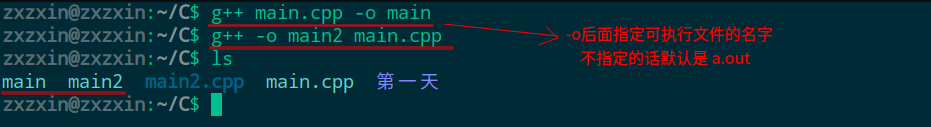
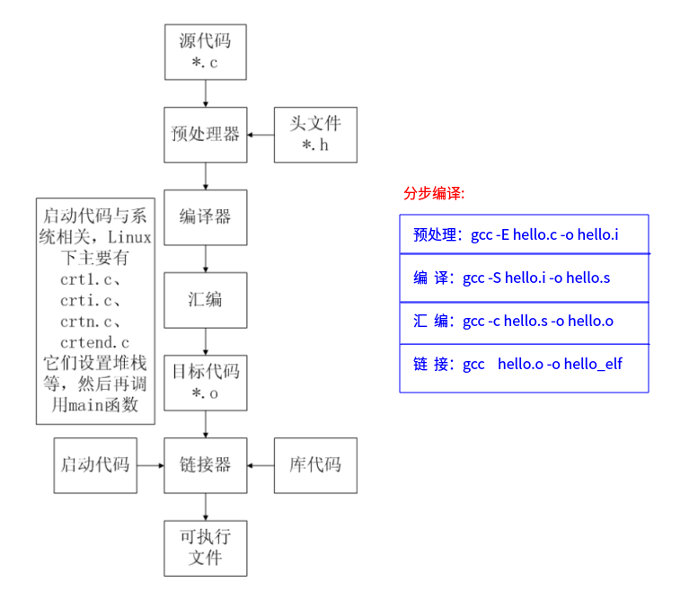
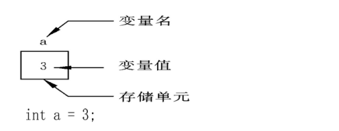
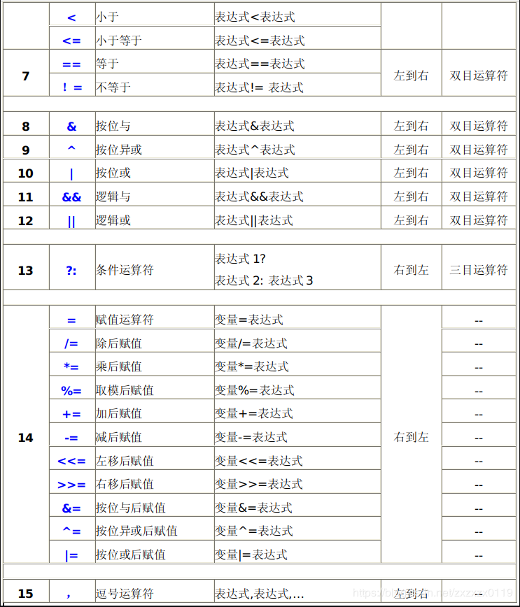
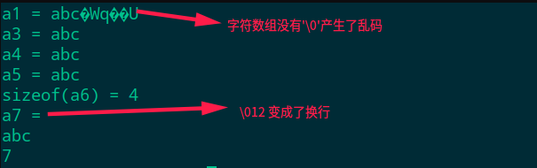
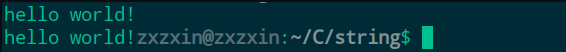
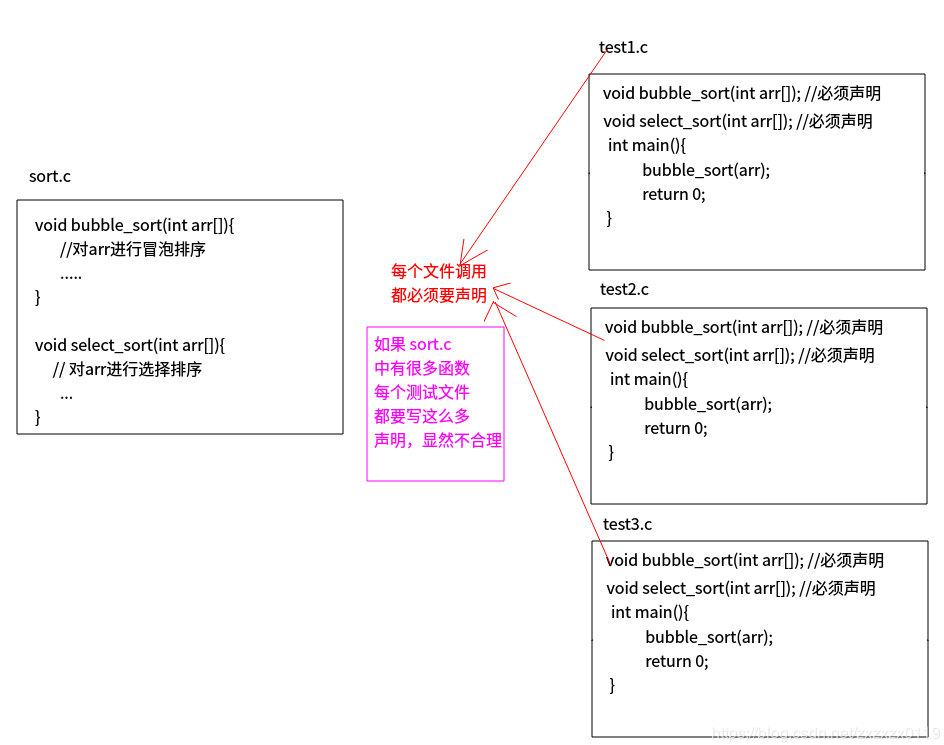
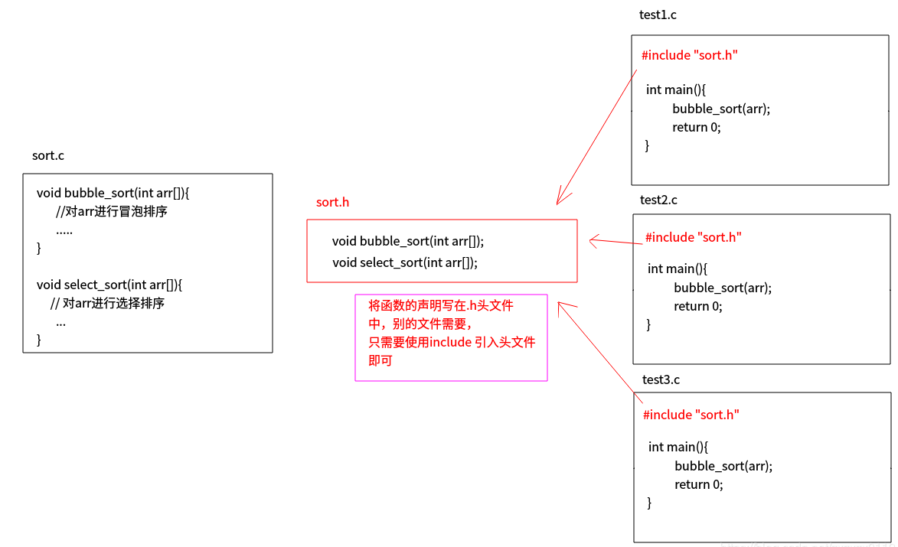

## C语言基础知识总结(一)

* [编译、运行](#编译运行)
  * [编译格式](#编译格式)
  * [C语言编译过程](#c语言编译过程)
  * [CPU、寄存器](#cpu寄存器)
  * [关于VS的C4996错误](#关于vs的c4996错误)
* [进制，原、反、补码](#进制原反补码)
  * [进制相关](#进制相关)
  * [原码、反码、补码](#原码反码补码)
  * [原码和补码互换](#原码和补码互换)
  * [有符号和无符号的区别](#有符号和无符号的区别)
  * [数据类型取值分析](#数据类型取值分析)
  * [越界问题](#越界问题)
* [数据类型、运算符等基础](#数据类型运算符等基础)
  * [C语言数据类型](#c语言数据类型)
  * [sizeof关键字](#sizeof关键字)
  * [char数据类型-char的本质就是一个1字节大小的整型](#char数据类型-char的本质就是一个1字节大小的整型)
  * [浮点数不准确、类型限定符](#浮点数不准确类型限定符)
  * [字符的输入问题](#字符的输入问题)
  * [运算符以及优先级](#运算符以及优先级)
  * [类型转换](#类型转换)
* [数组、字符串、函数](#数组字符串函数)
  * [数组初始化的几种方式](#数组初始化的几种方式)
  * [字符数组与字符串](#字符数组与字符串)
  * [字符串输出乱码问题以及一系列字符串要注意的问题](#字符串输出乱码问题以及一系列字符串要注意的问题)
  * [随机数生成](#随机数生成)
  * [字符串相关函数](#字符串相关函数)
  * [函数](#函数)

***
### 编译、运行

##### 编译格式
 `gcc -o main main.cpp`生成`main`可执行文件，可以有两种运行方式: 
 * 当前目录运行`./main`；
 * <font color = red>绝对路径运行</font>，例如`/home/zxzxin/C/main`，要注意的是绝对路 径没有`.`，因为`.`代表的是当前路径，也就是说我们只需要<font color = blue>写上完整路径即可；</font> 


 编译命令格式 
```shell
gcc [-option] ... <filename>   //c语言编译
g++ [-option] ... <filename>   //c++编译
```
* gcc、g++编译常用选项说明：

|选项|含义|
|--|--|
|-o file|指定生成的输出文件名为file|
|-E|只进行预处理|
|-S(大写)|只进行预处理和编译|
|-c(小写)|只进行预处理、编译和汇编|

* 注意下面的两种方式生成可执行文件的效果是一样的: 



**平台问题:**
① Linux编译后的可执行程序只能在Linux运行，Windows编译后的程序只能在Windows下运行；
②64位的Linux编译后的程序只能在64位Linux下运行，32位Linux编译后的程序只能在32位的Linux运行；
③<font color = blue>64位的Windows编译后的程序只能在64位Windows下运行，32位Windows编译后的程序<font color = red>可以</font>在64位的Windows运行；</font>


**可以在程序中嵌套`Linux`的命令，会在可执行文件的对应目录执行相应的命令；**
```cpp
#include <stdio.h>
#include <stdlib.h>

int main(int argc, char const *argv[])
{
    printf("before\n");
    system("ls -alh"); // system内放置 linux的命令  甚至也可以在""内放 ./a.out这种，也可以调用
    printf("after\n");
    return 0;
}
```
运行: 


* `#include< >` 与 `#include ""`的区别：
①`< >` 表示系统直接按系统指定的目录检索；
② `""` 表示系统先在 `""` 指定的路径(没写路径代表当前路径)查找头文件，如果找不到，再按系统指定的目录检索；

##### C语言编译过程
C代码编译成可执行程序经过4步：

* 1）预处理：宏定义展开、头文件展开、条件编译等，同时将代码中的注释删除，这里并不会检查语法；
* 2）编译：检查语法，将预处理后文件编译生成汇编文件； 
* 3）汇编：将汇编文件生成目标文件(二进制文件)；
* 4）链接：C语言写的程序是需要依赖各种库的，所以编译之后还需要把库链接到最终的可执行程序中去；





<font color = red>然而一般编译的时候都是使用的一步编译</font>。 (但是这样还是经过：<font color = red>预处理、编译、汇编、链接的过程。)

```shell
gcc hello.c -o hello
```
* `Linux`下查找程序所依赖的动态库

```shell
ldd hello
```
##### CPU、寄存器

* 寄存器是CPU内部最基本的存储单元；
* CPU对外是通过总线(地址、控制、数据)来和外部设备交互的，总线的宽度是8位，同时CPU的寄存器也是8位，那么这个CPU就叫8位CPU
* CPU计算时，先预先把要用的数据从硬盘读到内存，然后再把即将要用的数据读到寄存器。于是` CPU<--->寄存器<--->内存`，这就是它们之间的信息交换，看下面的图片说明:  

<font color = red> 寄存器、缓存、内存三者关系: 


##### 关于VS的C4996错误

* 由于微软在VS2013中不建议再使用C的传统库函数scanf,strcpy,sprintf等，所以直接使用这些库函数会提示C4996错误。VS建议采用带`_s`的函数，如`scanf_s`、`strcpy_s`，但这些并不是标准C函数。
* 要想继续使用此函数，需要在源文件中添加以下两个指令中的一个就可以避免这个错误提示：
```cpp
#define _CRT_SECURE_NO_WARNINGS     //这个宏定义最好要放到.c文件的第一行
#pragma warning(disable:4996)	//或者使用这个
```

***
### 进制，原、反、补码
##### 进制相关
```cpp
#include <stdio.h>

int main(int argc, char const *argv[])
{ 
    int a = 123;		//十进制方式赋
    int b = 0123;		//八进制方式赋值， 以数字0开
    int c = 0xABC;	//十六进制方式赋值
    
    //如果在printf中输出一个十进制数那么用%d，八进制用%o，十六进制是%x
    printf("十进制：%d\n",a );
    printf("八进制：%o\n", b);	// %o,为字母o,不是数字
    printf("十六进制：%x\n", c);
    return 0;
}
```
输出: 

```cpp
十进制：123
八进制：123
十六进制：abc
```

##### 原码、反码、补码
###### <font color = green>原码

一个数的原码(原始的二进制码)有如下特点：
* 最高位做为符号位，0表示正,为1表示负；
* 其它数值部分就是数值本身绝对值的二进制数；
* <font color = blue>负数的原码是在其绝对值(相反数)的基础上，最高位变为1；

例如：(以一个字节(8bit)来看)　
|十进制数|原码|
|--|--|
|+15|0000 1111|
|-15|1000 1111|
|+0|0000 0000|
|-0|1000 0000|

<font color = red>原码存储导致2个问题：

* 0有两种存储方式；
* 正数和负数相加，结果不正确（<font color = blue>计算机只会加不会减</font>）；

例如: 
以<font color = blue>原码</font>来算不同符号的数: 
```cpp
1-1 = 1 + -1
  1： 0000 0001
 -1： 1000 0001
      1000 0010 = -2   //答案错误
```

###### <font color = green>反码
* 正数的原码和反码是一样；
* 对于负数，先求原码，<font color = red>在原码基础上，符号位不变，其它位取反（0为1， 1变0）；

例如：(以一个字节(8bit)来看)　

|十进制数|原码|反码|
|--|--|--|
|+15|0000 1111|0000 1111|
|-15|1000 1111|1111 0000|
|+0|0000 0000|0000 0000|
|-0|1000 0000|1111 1111|

反码计算两个符号不同的数:  

```cpp
1-1 = 1 + -1
 1：0000 0001
-1：1111 1110
    1111 1111 = -0   //答案是对的
```

<font color = blue>但是反码还是没有解决</font><font color = red>0有两种存储方式</font>的问题。 
###### <font color = green>补码

<font color = red>综上，计算机存储数字以补码方式存储（为了解决负数的存储）； 

补码特点: 
* 对于正数，原码、反码、补码相同；
* 对于负数，其补码为它的反码加1；

例如：(以一个字节(8bit)来看)　

|十进制数|原码|反码|补码|
|--|--|--|--|
|+15|0000 1111|0000 1111|0000 1111|
|-15|1000 1111|1111 0000|1111 0001|||
|+0|0000 0000|0000 0000|0000 0000||
|-0|1000 0000|1111 1111|0000 0000|

补码计算: 

```cpp
1-1 = 1 + -1
 1：0000 0001
-1：1111 1111
   10000 0000（最高位丢弃） = 0000 0000  //注意1字节，所以丢弃最高位
```

<font color = red>记得一个原则: 
* 十进制数  -->  站在用户的角度  --> 原码；
* 二进制、八进制、十六进制   -->  站在计算机角度  --> 补码；


##### 原码和补码互换

<font color = purple>原码求补码：
* ①. 先求原码: 最高位符号位，其它位就是二进制；
* ②. 在①基础上，符号位不变，其它位取反；
* ③. 在②基础上加1；

<font color = purple>补码求原码：
* ①.  先得到补码；
* ②.  求补码的反码，符号位不变，其它位取反；
* ③.   在②基础上加1(<font color = blue>注意不要人为的相乘相反是减)


<font color  =red>综上，在计算机系统中，数值一律用补码来存储，主要原因是：
* 统一了零的编码；
* 将符号位和其它位统一处理；
* 将减法运算转变为加法运算；
* 两个用补码表示的数相加时，如果最高位(符号位)有进位，则进位被舍弃；


相关案例计算转换: 

```cpp
#include <stdio.h>

int main(int argc, char const *argv[])
{
    char a = 0x81; // 计算机的角度(补码)
    printf("a = %d\n",a);

    char b = 0xe5;//计算机的角度(补码)
    printf("b = %d\n",b);

    char c = 0x6f; //计算机的角度(补码)
    printf("c = %d\n",c);

    char d = -123; //人类的角度 --> 看成原码
    printf("d = %x\n",d);//输出16进制(计算机的角度)
    return 0;
}
```
输出:

```cpp
a = -127
b = -27
c = 111
d = ffffff85
```
<font color = red>对于上面程序的分析:</font> 
```cpp
//二进制、八进制、十六进制，站在计算机角度，补码
//0x81转为为二进制位1000 0001，最高位为1，说明是负数
char a = 0x81;
补码：1000 0001
反码：1111 1110
原码：1111 1111 = -127 
//10进制数，站在用户的角度，原码
printf("%d\n", a); //-127


//二进制、八进制、十六进制，站在计算机角度，补码
//0xe5二进制为1110 0101，最高位为1，说明是负数，它是负数的补码
char b = 0xe5;
补码：1110 0101
反码：1001 1010
原码：1001 1011 = -27
//10进制数，站在用户的角度，原码
printf("%d\n", b);// -27


0x6f的二级制为0110 1111，最高位为0，它是正数
char c = 0x6f;
printf("%d\n", c);// 111 原码、反码、补码都相同


//10进制数，站在用户的角度，原码
int a = -123;//注意这个是十进制，所以直接就是原码
原码：1000 0000 0000 0000 0000 0000 0111 1011
反码：1111 1111 1111 1111 1111 1111 1000 0100
补码：1111 1111 1111 1111 1111 1111 1000 0101
	   f     f   f    f     f   f    8     5
%x，默认以4个字节(32位)大小打印
//二进制、八进制、十六进制，站在计算机角度，补码
printf("%x\n", a);// 16进制打印 ffffff85
```

##### 有符号和无符号的区别

*  有符号，最高位是符号位，如果是1代表为负数，如果为0代表为正数；
* 无符号，最高位不是符号位，是数的一部分，无符号不可能是负数；


测试: 

```cpp
#include <stdio.h>

int main(int argc, char const *argv[])
{
    // 1000 0000 0000 0000 0000 0000 0111 1011
    // 8000007b
    // %d按照有符号数来打印  
    printf("%d\n", 0x8000007b);
    // %u按照无符号数打印
    printf("%u\n", 0x8000007b);

    // signed 和 unsigned
    signed int a = 10;
    unsigned int b = -10;

    //注意输出结果　以%d 为准，%d表示按照有符号数来输出    
    unsigned int c = 0x8000007b;
    printf("c[有符号] = %d\n",c);
    printf("c[无符号] = %u\n",c);
    return 0;
}
```
输出：

```cpp
-2147483525
2147483771
c[有符号] = -2147483525
c[无符号] = 2147483771
```
分析: 

```cpp
1000 0000 0000 0000 0000 0000 0111 1011   //二进制
8000007b   //16进制  

//有符号   --->   %d, 默认以有符号的方式打印
补码：1000 0000 0000 0000 0000 0000 0111 1011
反码：1111 1111 1111 1111 1111 1111 1000 0100
原码：1111 1111 1111 1111 1111 1111 1000 0101
     - 7   f    f    f    f    f    8    5 = -2147483525
										     -2147483525
printf("%d\n", 0x8000007b); //-2147483525

//无符号(最高位看做是数的一部分)  --->    %u, 以无符号的方式打印
1000 0000 0000 0000 0000 0000 0111 1011
8000007b = 2147483771
		   2147483771
printf("%u\n", 0x8000007b); //2147483771
```

##### 数据类型取值分析

```cpp
数据类型范围（站在10进制角度，原码）：
char 1个字节（8位，8bit）
有符号的范围：
正数：
0000 0000 ~ 0111 1111
0             127

负数：
1000 0000 ~ 1111 1111
-0 ~ -127

注意这里比较特使：
-0 当做 -128使用
-128：
原码：  1 1000 0000 
反码：  1 0111 1111
补码：  1 1000 0000
这个很特别: -128的原码和补码是一样的，发现和0 (1000 0000)也是一样的。

无符号范围：
0000 0000 ~ 1111 1111
0 ~ 255
```
综上，char:
* 有符号：-128 ~ 127；
* 无符号：0 ~ 255；
##### 越界问题
赋值或者运算，记得不要越界，下面展示了越界的情况: 
```cpp
#include <stdio.h>

int main(int argc, char const *argv[])
{
    //有符号越界
    char a = 127 + 2;
    printf("a = %d\n",a);  //-127

    //无符号越界
    unsigned char b = 255 + 2;
    printf("b = %u\n",b);  //1
    return 0;
}
```
输出: 
```cpp
-127
1
```
分析: 
```cpp
char a = 127 + 2;
129转换为二进制：1000 0001，这是负数补码(计算机角度)
补码：1000 0001 
反码：1111 1110
原码：1111 1111(最高位是符号位) = -127
printf("%d\n", a);//-127

unsigned char b = 255 + 2; 
257转化为二进制 ：0001 0000 0001 （只取后8位）
printf("%u\n", b);// 1
```
***
### 数据类型、运算符等基础
##### C语言数据类型
* 数据类型的作用：编译器预算对象（变量）分配的内存空间大小。

  

   


**变量特点:**
* <font color = red>变量在编译时为其分配相应的内存空间；</font>

* <font color = red>可以通过其名字和地址访问相应内存；

  

  


**声明和定义的区别:**

* <font color = blue>声明变量不需要建立存储空间，如：`extern int a`; (使用`extern`关键字)
* 定义变量需要建立存储空间，如：`int b`;
* 从广义的角度来讲声明中包含着定义，即定义是声明的一个特例，所以并非所有的声明都是定义：
   ① `int b` 它既是声明，同时又是定义；
   ②对于`extern int b`来讲它只是声明不是定义；

* <font color = blue>一般的情况下，把建立存储空间的声明称之为“定义”，而把不需要建立存储空间的声明称之为“声明”。


##### sizeof关键字

* `sizeof`不是函数，所以不需要包含任何头文件，它的功能是<font color = red>计算一个数据类型的大小，单位为字节；
* `sizeof`的返回值为`size_t`；
* `size_t`类型在32位操作系统下是`unsigned int`，是一个无符号的整数；

```cpp
#include <stdio.h>

int main(int argc, char const *argv[])
{ 
    //数据类型的作用: 告诉编译器，分配此类型的变量需要多大的空间
    printf("sizeof(char) = %u\n",sizeof(char));

    int a;
    printf("sizeof(a) = %d\n",sizeof(a));
    
    size_t len = sizeof(long);
    printf("sizeof(long) = %u\n",len);
    return 0;
}
```
输出:
```cpp
sizeof(char) = 1
sizeof(a) = 4
sizeof(long) = 8
```
##### char数据类型-char的本质就是一个1字节大小的整型

* <font color = red>内存中没有字符，只有数字；
* 一个数字，对应一个字符，这种规则就是`ascii`；
* 使用字符或数字给字符变量赋值是等价的；
* <font color = red>字符类型本质就是1个字节大小的整形；
* 字符变量实际上并不是把该字符本身放到变量的内存单元中去，而是将该字符对应的 ASCII 编码放到变量的存储单元中。

测试: 
```cpp
#include <stdio.h>

int main(int argc, char const *argv[])
{
    char ch = 'a';
    printf("ch[c] = %c, ch[d] = %d\n",ch, ch);

    char ch2 = 97;
    printf("ch2[c] = %c\n", ch2);

    printf("ch2 - 32 = %c\n",ch2 - 32);
    return 0; 
}
```
输出：

```cpp
ch[c] = a, ch[d] = 97
ch2[c] = a
ch2 - 32 = A
```
<font color = blue>以及注意转义字符: 


转义字符简单测试: 

```cpp
#include <stdio.h>

int main(int argc, char const *argv[])
{ 
    char ch = '\r';
    printf("abcdddd%cefg\n",ch);

    ch = '\b';
    printf("12%c345\n",ch);

    ch = ' ';
    printf("%d\n",ch); // 打印' '的对应数字

    // 8进制转义字符
    printf("%d\n", '\123'); //8进制123 -->　对应10进制83
    printf("%d\n", '\x23'); //16进制23 --> 对应10进制35

    // '\0'和0等价
    printf("%d,%d\n",'\0',0);
    return 0;
}
```
输出: 
```cpp
efgdddd
1345
32
83
35
0,0
```
##### 浮点数不准确、类型限定符

* 浮点数不准确:

```cpp
#include <stdio.h>

int main(int argc, char const *argv[])
{ 
    float a = 100.9;
    printf("a = %f\n",a);
    return 0;
}
```
输出:

```cpp
a = 100.900002
```
原因还是计算机按照`二进制`存储。

* 类型限定符:


##### 字符的输入问题

```cpp
#include <stdio.h>

int main(int argc, char const *argv[])
{ 
    char ch1;
    printf("请输入字符:");
    scanf("%c",&ch1);
    printf("ch1 = %c\n",ch1);

    char ch2;
    printf("请输入字符:");
    scanf("%c",&ch2);
    printf("ch2 = %c\n",ch2);
    //输出ch2的ascii码
    printf("ch2[d] = %d\n",ch2);
    return 0;
}

```
输入输出演示: 


这个程序要特别注意: 

* 当我们输入完一个字符时，按下回车，会直接结束程序；
* 因为第二个字符在按下回车的时候已经输入完成了，也就是`ch2 = '\n'`；而`'\n'`的`ascii`码为10；


处理上面的问题，可以使用另一个字符变量过滤掉`\n`，也可以使用`getchar()`来过滤一个字符: 

```cpp
#include <stdio.h>

int main(int argc, char const *argv[])
{ 
    char ch1;
    printf("请输入字符:");
    scanf("%c",&ch1);
    printf("ch1 = %c\n",ch1);

    //为了处理上面的问题，可以自己用scanf处理这个回车
    char tmp;
    //scanf("%c",&tmp); //或者使用下面的方法输入一个字符
    // tmp = getchar(); //或者也可以直接调用getchar()即可
    getchar();

    char ch2;
    printf("请输入字符:");
    scanf("%c",&ch2);
    printf("ch2 = %c\n",ch2);
    //输出ch2的ascii码
    printf("ch2[d] = %d\n",ch2);
    return 0;
}

```

##### 运算符以及优先级
**<font color  = red>运算符优先级: </font>**




> *  另外，注意 逻辑判断中的  <font color = red>短路原则。</font>

##### 类型转换

* 隐式转换: 编译器内部自动转换；
* 强制类型转换：把表达式的运算结果强制转换成所需的数据类型。
* 浮点型打印说明: 不要以为指定了打印的类型就会自动转换，必须要强制转换；
* 转换原则: <font color = red>数据类型小的往大的转换；
```cpp
#include <stdio.h>

int main(int argc, char const *argv[])
{ 
    printf("------------隐式转换-----------\n");
    //隐式转换
    double a;
    int b = 10;
    //编译器内部自动转换，在第10行自动转换，其他地方b还是int
    a = b;
    printf("a = %lf\n",a);


    printf("------------强制类型转换-----------\n");
    //强制类型转换
    double c = (double)1/2; //强制将1转换成double
    printf("c = %lf\n",c);
    printf("sizeof(int) = %u\n",(unsigned int)sizeof(int));


    printf("------------浮点型打印说明-----------\n");
    //浮点型打印说明
    int d = 11;
    printf("d[wrong] = %lf\n",d); //以为指定了%lf就会转换成浮点数，其实是错的
    printf("d[right] = %lf\n",(double)d); // 正确的打印是要强制类型转换的
    double e = 88.14;
    printf("e[wrong] = %d\n",e);
    printf("e[right] = %d\n",int(e));

    printf("-------------转换原则----------\n");
    //转换原则: 数据类型　小的往大的　转换
    int g = 129;
    char h = 111;
    //g = (int)h; // 这个是可以转换的
    //printf("g = %d\n",g);
    h = (char)g; //这个转换是出错的，h会变成一个负数
    printf("h = %d\n",h);
    return 0;
}
```
输出：

```cpp
------------隐式转换-----------
a = 10.000000
------------强制类型转换-----------
c = 0.500000
sizeof(int) = 4
------------浮点型打印说明-----------
d[wrong] = 0.000000
d[right] = 11.000000
e[wrong] = 1519177328
e[right] = 88
-------------转换原则----------
h = -127
```
***
### 数组、字符串、函数

##### 数组初始化的几种方式

```cpp
#include <stdio.h>

int main(int argc, char const *argv[])
{
    int arr1[5] = {1,2,3,4,5}; //数组的定义需要{}，只有在定义的时候才能初始化
    int arr2[5];
    //arr2 = {1,2,3,4,5}; //err 这个是错误的

    //数组全部元素初始化为 某个值
    int arr3[5] = {0};

    //如果定义的同时 初始化，第一个[]内可以不写内容
    int arr4[] = {1,2,3,4,5}; //编译器会根据用户初始化的元素来确定数组的大小
    //int arr4[]; //err //必须初始化的时候才能省略
    int arr5[][4] = {0,1,2,3,4,5,6,7,8,9,10,11}; //第一个可以省略
    return 0;
}
```

* 数组的名字代表着数组的首地址，以及使用`sizeof`来求数组长度的方法；

```cpp
#include <stdio.h>

int main(int argc, char const *argv[])
{
    printf("------------一维数组------------\n");
    
    int arr[10];
    //1. 数组名是数组首元素地址
    printf("arr = %p, &arr[0] = %p\n", arr, &arr[0]); //两个是一样的

    //2. 测试数组总的字节大小 : sizeof(数组名) 10 * 4 = 40
    printf("sizeof(arr) = %u\n",sizeof(arr));

    //3. 得到数组长度 数组总大小/每个元素大小 (常用)
    int len = sizeof(arr)/sizeof(arr[0]);
    printf("len(arr) = %d\n",len);


    printf("------------二维数组------------\n");

    int arr2[5][10];
    // 1. 数组名是常量，不能修改
    // a = 10; //err
    //2. sizeof(数组名),测数组的总大小 5*int[10] = 5*4*10
    printf("sizeof(arr2) = %u\n",sizeof(arr2));
    
    //3. 求行数
    int n = sizeof(arr2)/sizeof(arr2[0]);
    printf("行数 = %d\n",n);

    //4. 求列数
    int m = sizeof(arr2[0])/sizeof(arr2[0][0]);
    printf("列数 = %d\n",m);

    //5. 总个数
    printf("总个数 = %d\n",sizeof(arr2)/sizeof(arr2[0][0]));
    return 0;
}

```
输出:

```cpp
------------一维数组------------
arr = 0x7ffc86eac190, &arr[0] = 0x7ffc86eac190
sizeof(arr) = 40
len(arr) = 10
------------二维数组------------
sizeof(arr2) = 200
行数 = 5
列数 = 10
总个数 = 50
```
<font color = red>可以看出`arr`和`arr[0]`的地址是一样的。 

##### 字符数组与字符串
* C语言中没有字符串这种数据类型，可以通过`char`的数组来替代；
* 字符串一定是一个`char`的数组，但`char`的数组未必是字符串；
* 数字`0`(和字符`‘\0’`等价)结尾的`char`数组就是一个字符串，但如果`char`数组没有以数字`0`结尾，那么就不是一个字符串，只是普通字符数组，所以字符串是一种特殊的`char`的数组。 
```cpp
#include <stdio.h>

int main(int argc, char const *argv[])
{
    // 1. c语言没有字符串类型，用字符数组模拟
    char str[10];

    // 2. 字符串一定是字符数组，字符数组不一定是字符串
    // 3. 如果字符数组以'\0'(0)结尾，就是字符串

    char str2[] = {'a', 'b', 'c'};//字符数组 --> 注意这里[]内没有指定数字
    char str3[10] = {'a', 'b', 'c', '\0'}; //字符串
	char str4[10] = {'a', 'b', 'c', 0};    //字符串
    return 0;
}
```

##### 字符串输出乱码问题以及一系列字符串要注意的问题

```cpp
#include <stdio.h>

int main(int argc, char const *argv[])
{
    // 1. 字符数组打印乱码问题
    char a1[] = {'a', 'b', 'c'}; //字符数组
    printf("a1 = %s\n",a1); //这个是乱码，因为字符数组后面没有'\0'

    // 2. 正确的字符串
    char a2[] = {'a', 'b', 'c', '\0'};
    //char a2[] = {'a', 'b', 'c', 0}; // 0也可以

    // 3. 遇到'\0'提前截断
    char a3[] = {'a', 'b', 'c', '\0', 'h', 'e', '\0'};
	printf("a3 = %s\n", a3);//"abc"

    // 4. 前3个字符赋值为a, b, c, 后面自动赋值为0
    char a4[10] = {'a', 'b', 'c'};
	printf("a4 = %s\n", a4);

    // 5. 常用的初始化方法  --> 使用字符串初始化，在字符串结尾自动加结束符数字0
    //    这个结束符，用户看不到（隐藏），但是是存在的
    char a5[10] = "abc";
    printf("a5 = %s\n", a5);

    // 6. 使用sizeof()测试隐藏的那个'\0'
    char a6[] = "abc";
    printf("sizeof(a6) = %d\n", sizeof(a6));

    // 7. \0 后面最好别跟数字，不然有可能变成转义字符 例如\012 就是'\n'
    char a7[] = "\012abc";
    printf("a7 = %s\n", a7);

    // 8. 最多写9个字符，留一个位置放结束符
    char a8[10] = "123456789"; 

    // 9. sizeof()测数据类型大小，不会因为结束符提前结束  sizeof("123\045") = 5
    char a9[] = "abc\0de";
    printf("%u\n", sizeof(a9));  // 7 --> a b c \0 d e \0  不要忘记最后还有一个\0

    // 10. scanf("%s", a); //a没有&，原因数组名是首元素地址，本来就是地址
    return 0;
}
```
输出结果: 




##### 随机数生成

```cpp
#include <stdio.h>
#include <stdlib.h>
#include <time.h>

int main(int argc, char const *argv[])
{
    // 1. 先设置种子，种子设置一次即可
	// 2. 如果srand()参数一样，随机数就一样
	//srand(100);

    // 由于希望产生的随机数不同，所以要使用系统时间作为随机数  
    srand( (unsigned int)time(NULL) ); // 返回的是time_t类型 相当于long，单位为毫秒，注意强制转换一下

    for(int i = 0; i < 3; i++){
        printf("the rand number is = %d\n", rand());
    }
    return 0;
}
```
##### 字符串相关函数
###### 输入函数
① `gets(str)`与`scanf(“%s”,str)`的区别：
* `gets(str)`允许输入的字符串含有空格；
* `scanf(“%s”,str)`不允许含有空格；

> * 注意：由于`scanf()`和`gets()`无法知道字符串s大小，必须遇到换行符或读到文件结尾为止才接收输入，因此容易导致字符数组越界(缓冲区溢出)的情况。

② `fgets函数`相关：
　　

```c
char *fgets(char *s, int size, FILE *stream);
```
* <font color = red>功能</font>：从stream指定的文件内读入字符，保存到s所指定的内存空间，直到出现换行字符、读到文件结尾或是已读了size - 1个字符为止，最后会自动加上字符 '\0' 作为字符串结束；
* <font color =red>参数 </font>: 
    <font color = blue>s</font>：字符串；
	<font color = blue>size</font>：指定最大读取字符串的长度（size - 1）(大于这个长度就舍弃)；
	<font color = blue>stream</font>：文件指针，如果读键盘输入的字符串，固定写为stdin；
* 返回值：
	<font color = blue>成功</font>：成功读取的字符串；
	<font color = blue>读到文件尾或出错</font>： NULL；

* 注意，`fgets()`在读取一个用户通过键盘输入的字符串的时候，<font color = red>同时把用户输入的回车('\n')也做为字符串的一部分</font>。通过scanf和gets输入一个字符串的时候，不包含结尾的“\n”，但通过fgets结尾多了“\n”。
* fgets()函数是安全的，不存在缓冲区溢出的问题。

简单测试：

```cpp
#include <stdio.h>

int main(int argc, char const *argv[])
{
    // 1. scanf()输入字符串 不做越界检查，此函数不安全

    // 2. gets(已抛弃，不安全) 
    char buf[10];
    // gets(buf);  //不安全 已废弃
    // printf("buf = %s\n", buf);

    // 3. fgets(安全，可以指定大小)
    fgets(buf,sizeof(buf),stdin);
    printf("buf = '%s'\n", buf);

    // 4. 测试读入了　最后的换行
    fgets(buf,sizeof(buf),stdin); // 注意虽然这里从键盘读入，但是如果缓冲区还有内容就不会读这里的
    printf("buf2 = '%s'\n", buf);
    return 0;
}
```
输入输出结果: 


###### 输出函数

```cpp
int puts(const char *s);
功能：标准设备输出s字符串，在输出完成后自动输出一个'\n'。
int fputs(const char * str, FILE * stream);  //文件操作
功能： 将str所指定的字符串写入到stream指定的文件中， 字符串结束符 '\0'  不写入文件。 
```

简单测试: 

```cpp
#include <stdio.h>

int main(int argc, char const *argv[])
{
    char str[] = "hello world!";
    puts(str); //会自动加上一个 '\n'

    fputs(str,stdout); // 不会自动加上 '\n'
    return 0;
}
```
输出: 





###### sizeof()和strlen()的区别

注意: 
*  `strlen()` 从首元素开始，到结束符为止的长度，结束符不算(遇到'\0'结束)；
* 而`sizeof()`则不管遇不遇到`'\0'`都会计算整个数据类型大小；
```cpp
#include <stdio.h>
#include <string.h>

int main(int argc, char const *argv[])
{

    char buf[] = "hello";

    // strlen 从首元素开始，到结束符为止的长度，结束符不算(遇到'\0'结束)
    int len = strlen(buf);
    printf("strlen(buf) = %d\n", len);   //5
    printf("sizeof(buf) = %d\n", sizeof(buf)); // 6 这个还包括 '\0'

    char buf2[] = "\0hello";
    printf("strlen(buf2) = %d\n", strlen(buf2)); // 0
    printf("sizeof(buf2) = %d\n", sizeof(buf2)); // 7  注意不要忘记最后还有一个 '\0'


    char buf3[100] = "zxzxin";
    printf("strlen(buf3) = %d\n", strlen(buf3)); //6
    printf("sizeof(buf3) = %d\n", sizeof(buf3));  //100

    return 0;
}
```
###### 字符串拷贝strcpy()和strncpy()
注意两者区别: 
* `char *strcpy(char *dest, const char *src) `：把src所指向的字符串复制到dest所指向的空间中，'\0'也会拷贝过去。(如果参数dest所指的内存空间不够大，可能会造成缓冲溢出的错误情况。)
* `char *strncpy(char *dest, const char *src, size_t n)`：把src指向字符串的前n个字符复制到dest所指向的空间中，<font color=  red>是否拷贝结束符看指定的长度是否包含'\0'。
```cpp
#include <stdio.h>
#include <string.h>

int main(int argc, char const *argv[])
{ 

    //strcpy:  把src所指向的字符串复制到dest所指向的空间中，'\0'也会拷贝过去
    char src[] = "hello world!"; 
    char dest[100] = "aaaaaaaaaaaaaaaaaaaaaaa";
    strcpy(dest,src);
    printf("dest = %s\n", dest);// hello world!  不会输出后面的aaaa， 因为'\0'也拷贝在后面了

    // strncpy : 把src指向字符串的前n个字符复制到dest所指向的空间中，是否拷贝结束符看指定的长度是否包含'\0'。
    char dest2[100] = "aaaaaaaaaaaaaaaaaaaaaaa";
    strncpy(dest2, src, strlen(src));
    printf("dest2 = %s\n", dest2); //hello world!aaaaaaaaaaa

    //但是如果拷贝的长度大于strlen(src)
    char dest3[100] = "aaaaaaaaaaaaaaaaaaaaaaa";
    strncpy(dest3, src, strlen(src)+1);
    printf("dest3 = %s\n", dest3); //hello world!
    return 0;
}
```
输出：


###### strcat()、strncat()、 strcmp()、strncmp()

* `char *strcat(char *dest, const char *src);`: 将src字符串连接到dest的尾部，`‘\0’`也会追加过去；
* `char *strncat(char *dest, const char *src, size_t n);`: 将src字符串前n个字符连接到dest的尾部，`‘\0’`也会追加过去；
* `int strcmp(const char *s1, const char *s2);`: 比较 s1 和 s2 的大小，比较的是字符ASCII码大小；
* `int strncmp(const char *s1, const char *s2, size_t n);`：比较 s1 和 s2 前n个字符的大小，比较的是字符ASCII码大小；

测试:

```cpp
#include <stdio.h>
#include <string.h>

int main(int argc, char const *argv[])
{
    char s1[] = "abc";
    char s2[] = "abcd";
    int flag = strcmp(s1, s2);
    printf("flag = %d\n",flag);// <0

    char s3[] = "abc";
    char s4[] = "Abcd";
    int flag2 = strncmp(s3, s4, 3); //指定比较前3个字符
    printf("flag2 = %d\n",flag2);// >0s

    printf("-------------strcat和strncat------------\n");
    char src[] = " hello mike";
    char dst[100] = "abc";
    //把src的内容追加到dst的后面
    //strcat(dst, src); //dst = "abc  hello mike"
    strncat(dst, src, strlen(" hello")); //指定长度追加 dst = "abc  hello"
    printf("dst = %s\n", dst);
    return 0;
}
```
输出：

```cpp
flag = -100
flag2 = 32
-------------strcat和strncat------------
dst = abc hello
```
###### sprintf()、sscanf()
* `int sprintf(char *str, const char *format, ...);`: 根据参数format字符串来转换并格式化数据，然后将结果输出到str指定的空间中，直到出现字符串结束符 '\0'  为止。
* `int sscanf(const char *str, const char *format, ...);`: 从str指定的字符串读取数据，并根据参数format字符串来转换并格式化数据。
```cpp
#include <stdio.h>

int main(int argc, char const *argv[])
{
    printf("--------------sprintf-------------------\n");
    int n = 10;
    char ch = 'a';
    char buf[10] = "hello";
    char dest[30];
    sprintf(dest,"n = %d, ch = %c, buf = %s\n", n, ch, buf);
    printf("dest: %s", dest);  // 注意这里没有加上 '\n' 但是之前里面有

    printf("--------------sscanf-------------------\n");
    // sscanf和spirnf相反  这里从dest中读取
    int n2;
    char ch2;
    char buf2[10];
    sscanf(dest, "n = %d, ch = %c, buf = %s\n", &n2, &ch2, &buf2); //记得加上 &
    printf("n2 = %d\n", n2);
    printf("ch2 = %c\n", ch2);
    printf("buf2 = %s\n", buf2);

    printf("-----------字符串提取注意的地方--------------\n");
    // 从字符串中提取 内容最好按照空格进行分割 ，不然有可能提取不出来
    // 1. 按照空格分割 --> 正确
    char buf3[] = "aaa bbb ccc";
    char a[10],b[10],c[10];
    sscanf(buf3, "%s %s %s", a,b,c); //注意没有&
    printf("a = %s, b = %s, c = %s\n", a, b, c);
    // 2. 按照逗号分割 --> 错误
    char buf4[] = "aaa,bbb,ccc";
    char a2[10],b2[10],c2[10];
    sscanf(buf4, "%s,%s,%s", a2,b2,c2); //注意没有&
    printf("a2 = %s, b2 = %s, c2 = %s\n", a2, b2, c2);

    return 0;
}
```
结果: 


###### strchr()、strstr()、strtok()

* `char *strchr(const char *s, char c);`: 在字符串s中查找字母c出现的位置；
* `char *strstr(const char *haystack, const char *needle);`: 在字符串haystack中查找字符串needle出现的位置；
* `char *strtok(char *str, const char *delim);`
①来将字符串分割成一个个片段。当strtok()在参数s的字符串中发现参数delim中包含的分割字符时, 则会将该字符改为\0 字符，当连续出现多个时只替换第一个为\0；
②在第一次调用时：strtok()必需给予参数s字符串；
③<font color =red>往后的调用则将参数s设置成NULL</font>，每次调用成功则返回指向被分割出片段的指针；
```cpp
#include <stdio.h>
#include <string.h>

int main(int argc, char const *argv[])
{
    printf("-------------strchr------------\n");
    char str1[] = "aaabbbccc";
    char *p = strchr(str1, 'b');
    printf("p = %s\n", p);

    printf("-------------strstr------------\n");
    char str2[] = "ddddabcd123abcd333abcd";
    char *p2 = strstr(str2, "abcd");
    printf("p2 = %s\n", p2);

    printf("-------------strtok------------\n");
    char str3[100] = "adc*fvcv*ebcy*hghbdfg*casdert";
    char *s = strtok(str3, "*");   //将"*"分割的子串取出
    while (s != NULL){
        printf("%s\n", s);
        s = strtok(NULL, "*");//往后的调用则将参数s设置成NULL，每次调用成功则返回指向被分割出片段的指针
    }
    return 0;
}
```
输出:

```cpp
-------------strchr------------
p = bbbccc
-------------strstr------------
p2 = abcd123abcd333abcd
-------------strtok------------
adc
fvcv
ebcy
hghbdfg
casdert
```
##### 函数

* 函数内部，包括()内部的形参变量，只有在调用时分配空间，调用完毕自动释放；
* `return`和`exit()`函数区别，只要一调用 `exit()`函数(不管在什么地方)，整个程序就结束，但是只有在`main`函数中调用`return`才会结束程序；
* 声明函数加不加 `extern`关键字都一样，<font color = red>  声明函数可以不指定形参名称，只指定形参形参类型，但是定义不可以。
* 头文件一般是放函数声明；

看下面两张图解释`.h`文件的作用: 




解决办法: 



* 多个文件中(同一项目)，不能出现同名函数(static除外)。<font color =red>这就是为什么 `.h`文件只放函数的声明，不放函数的定义；

* 防止头文件重复包含: 当一个项目比较大时，往往都是分文件，这时候有可能不小心把同一个头文件 `include` 多次，或者头文件嵌套包含。


<font color = blue>防止办法: 
①`#ifndef` 方式；

```cpp
#ifndef __SOMEFILE_H__
#define __SOMEFILE_H__

// 声明语句

#endif
```

②`#pragma once` 方式。

