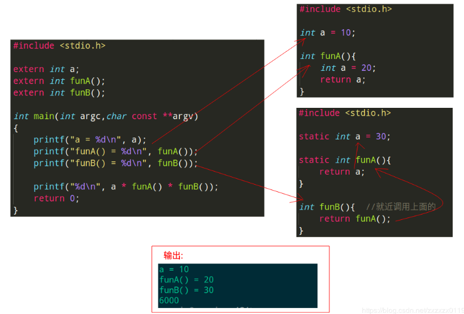
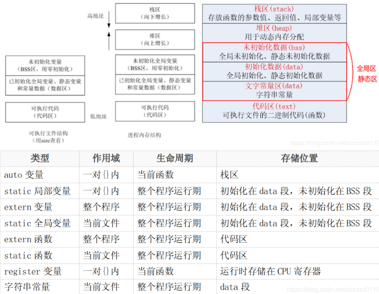
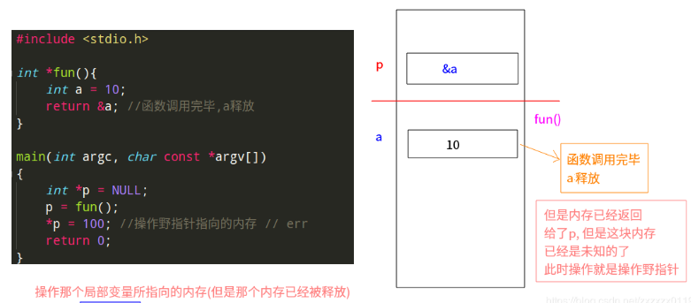
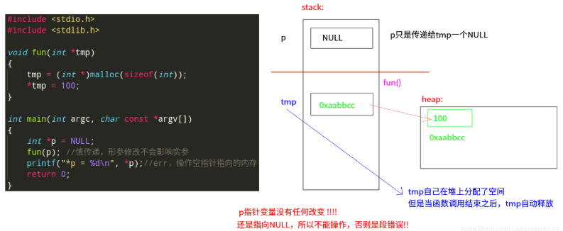
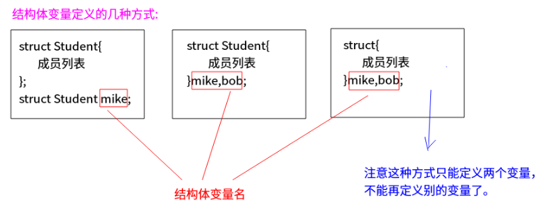
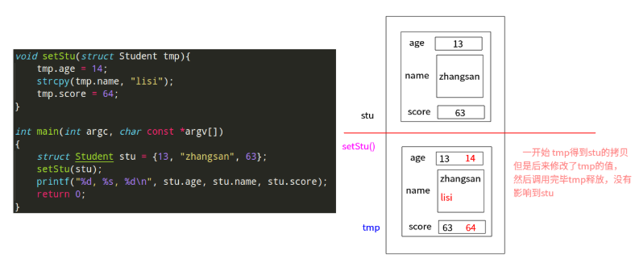
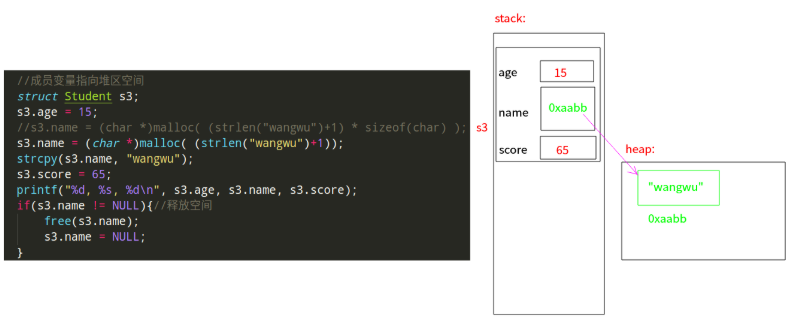
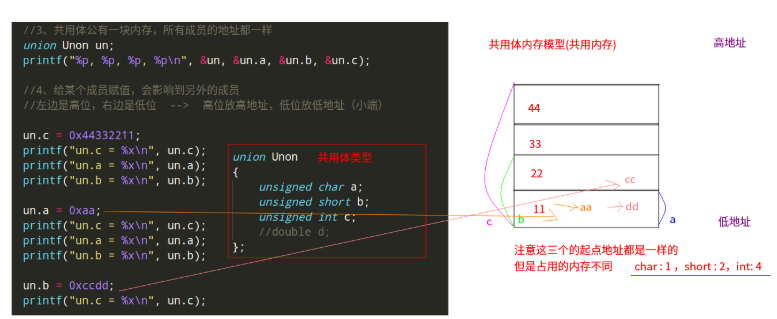
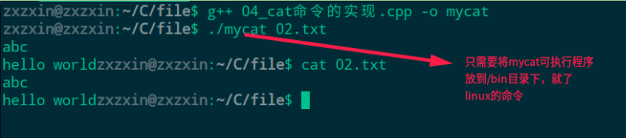
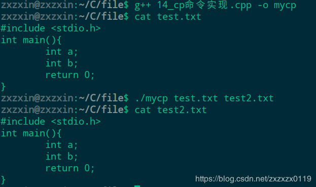

## C语言知识总结(三)

* 内存管理
* 内存布局
* 结构体、共用体
* 文件
***
### 内存管理

##### 作用域

C语言变量的作用域分为：
* 代码块作用域(代码块是{}之间的一段代码)；
* 函数作用域；
* 文件作用域；

#####  普通局部变量
局部变量也叫auto自动变量(auto可写可不写)，一般情况下代码块{}内部定义的变量都是自动变量，它有如下特点：
* 在`{}`内部定义的变量就是局部变量(在一个函数内定义，只在函数范围内有效)(在复合语句中定义，只在复合语句中有效)；
* 只有执行到定义变量的这个语句，系统才会给这个变量分配空间；
* 随着函数调用的结束或复合语句的结束局部变量的声明声明周期也结束；
* `{}`内的普通局部变量，加不加`auto`(注意和`C++`的不同)关键字等价，普通局部变量也加`auto`；
* 如果没有赋初值，内容为随机；

##### `static`局部变量
* `static`局部变量的作用域也是在定义的函数内有效；
* `static`局部变量的生命周期和程序运行周期一样，同时`staitc`局部变量的值<font color= red>只初始化一次</font>，但可以赋值多次；
* static局部变量若未赋以初值，则由系统自动赋值：数值型变量自动赋初值`0`，字符型变量赋空字符；

```cpp
#include <stdio.h>

void fun(){
    int i = 0;
    i++;
    printf("i = %d\n",i);
}

//1、static局部变量，是在编译阶段就已经分配空间，函数没有调用前，它已经存在
//2、当离开{}，static局部变量不会释放，只有程序结束，static变量才自动释放
//3、局部变量的作用域在当前的{}，离开此{}，无法使用此变量
//4、如果static局部变量不初始化，它的值默认为0
//5、static局部变量初始化语句，只会执行一次，但是可以赋值多次
//6、static变量只能用常量初始化(注意)
void static_fun(){
    static int i = 0; //只初始化一次(只执行一次),只能使用常量初始化
    i++;
    printf("i = %d\n",i);
}

int main(int argc, char const *argv[])
{
    fun(); fun(); fun(); // 输出都是i = 1
    printf("-----------------\n");
    static_fun(); static_fun(); static_fun(); 
    return 0;
}
```

输出: 

```cpp
i = 1
i = 1
i = 1
-----------------
i = 1
i = 2
i = 3
```
##### 普通局部变量和`static`局部变量的区别

从<font color =red>内存分配和释放</font>的角度看: 

 * ①普通局部变量只有执行到定义变量的语句才分配空间；
    ②`static`局部变量在编译阶段(函数还没有执行)，变量的空间已经分配；
* ①普通局部变量离开作用域`{}`，自动释放；
②`static`局部变量只有在整个程序结束才自动释放；


从<font color =red>初始化</font>的角度来看: 
* ①普通局部变量不初始化，值为随机数；
②`static`局部变量不初始化，值为0；
* `static`局部变量初始化语句只有第一次执行有效；
* `static`局部变量只能用常量初始化；

##### 普通的全局变量(外部链接)

* 在函数外定义，可被本文件及其它文件中的函数所共用，<font color = red>若其它文件中的函数调用此变量,须用`extern`声明；
* 全局变量的生命周期和程序运行周期一样；
* <font color =red>不同文件，普通全局变量只能定义一次，可以声明多次。所以`.h`文件中不能放</font><font color = blue>定义</font>，<font color =red>只能放</font><font color=  blue>声明；</font>
```cpp
#include <stdio.h>

//1、只有定义了全局变量，任何地方都能使用此变量
//2、如果使用变量时，在前面找不到此全局变量的定义，需要声明后才能使用
//3、全局变量不初始化，默认赋值为0
//4、声明只是针对全局变量，不是针对局部变量
//5、全局变量在编译阶段已经分配空间（函数没有执行前），只有在整个程序结束，才自动释放
void fun2()
{
    extern int a; //声明时，不要赋值
    extern int a; //可以声明多次
    printf("fun2 a = %d\n", a);// 200
}

int a = 100;  //在fun2后定义

void fun()
{
    a = 200;
}

int main(int argc, char *argv[])
{
    fun();
    fun2(); 
    return 0;
}
```
> C语言全局变量的缺陷: 
> * ①如果定义一个全局变量，没有赋值（初始化），无法确定是定义，还是声明；
> * ② 如果定义一个全局变量，同时初始化，这个肯定是定义；
> 
> C语言定义全局变量的建议:
> * ①如果定义一个全局变量，<font color = red>建议初始化；
> * ②如果声明一个全局变量，建议加`extern`；
##### `static`全局变量(内部链接)
* `static`全局变量和普通全局变量的区别就是<font color = red>作用域不一样(文件作用域)：
① 普通全局变量: 所有文件都能使用，使用前需要使用`extern`关键字声明；
② `static`全局变量: 只能在本文件使用，别的文件不能使用；(<font color = rblue>可以保证数据安全</font>)
* 一个文件只能有一个`static`全局变量的定义，不同文件静态全局变量可以重名,但作用域不冲突；
* `extern`关键字只适用于普通全局变量的声明；
* `static`全局变量的生命周期和程序运行周期一样，同时`staitc`全局变量的值只初始化一次；

##### 全局函数和静态函数
在C语言中函数默认都是全局的，使用关键字static可以将函数声明为静态，函数定义为static就意味着这个函数只能在定义这个函数的文件中使用，在其他文件中不能调用，即使在其他文件中声明这个函数都没用。
* 同一源文件中,允许全局变量和局部变量同名，在局部变量的作用域内，全局变量不起作用；
* <font color = red>所有的函数默认都是全局的，意味着所有的函数都不能重名，但如果是staitc函数，那么作用域是文件级的，所以不同的文件static函数名是可以相同的。

看一个分文件编程的例子，加深对`static`函数和普通全局函数的理解: 



##### 总结

***
### 内存布局

##### 内存分区
* 在没有运行程序前，也就是说程序没有加载到内存前，可执行程序内部已经分好3段信息，分别为代码区（`text`）、数据区（`data`）和未初始化数据区（`bss`）3 个部分（有些人直接把`data`和`bss`合起来叫做静态区或全局区）。
* 当运行程序，加载内存，首先根据前面确定的内存分区: 
 <font color =blue>(`text`, `data`, `bss`)先加载： </font>
①`text`(代码区)：<font color= red>只读，共享</font>的，函数。（存放 CPU 执行的机器指令）(使其可共享的目的是对于频繁被执行的程序，只需要在内存中有一份代码即可)；
②`data`: <font color = red>初始化的数据</font>，全局变量，static变量， 文字常量区（只读）；
③`bss`: <font color = red>没有初始化的数据</font>， 全局变量，static变量；
 <font color =blue>然后额外加载2个区: </font>
④`stack`(栈区)：普通局部变量，自动管理内存，先进后出的特点；
⑤`heap`(堆区)：手动申请空间，手动释放，整个程序结束，系统也会自动回收，如果没有手动释放，程序也没有结束，这个堆区空间不会自动释放；

> * 代码区`text segment`: 加载的是可执行文件代码段，所有的可执行代码都加载到代码区，这块内存是不可以在运行期间修改的。
> * 未初始化数据区`BSS`: 加载的是可执行文件BSS段，位置可以分开亦可以紧靠数据段，存储于数据段的数据（全局未初始化，静态未初始化数据）的生存周期为整个程序运行过程。
> * 全局初始化数据区/静态数据区`data segment`: 加载的是可执行文件数据段，存储于数据段（全局初始化，静态初始化数据，文字常量(只读)）的数据的生存周期为整个程序运行过程。
> * 栈区`stack`: 栈是一种先进后出的内存结构，由编译器自动分配释放，存放函数的参数值、返回值、局部变量等。在程序运行过程中实时加载和释放，因此，局部变量的生存周期为申请到释放该段栈空间。
> * 堆区 `heap`: 堆是一个大容器，它的容量要远远大于栈，但没有栈那样先进后出的顺序。用于动态内存分配。堆在内存中位于BSS区和栈区之间。一般由程序员分配和释放，若程序员不释放，程序结束时由操作系统回收。 




##### `memset`使用
`void *memset(void *s, int c, size_t n);`

* 功能：将`s`的内存区域的前`n`个字节以参数`c`填入；
* 参数：①`s`：需要操作内存`s`的首地址；②`c`：填充的字符，`c`虽然参数为`int`，但必须是`unsigned char` , 范围为`0~255`③`n`：指定需要设置的大小；
* 返回值：`s`的首地址；
```cpp
#include <stdio.h>
#include <string.h>

int main(int argc, char const *argv[])
{
    int a; 
    memset(&a, 0, sizeof(a)); // 清0  ---> 常用的方式
    printf("%d\n", a); // 0 --> ok

    //　中间参数虽然是整形，但是当做字符串处理
    memset(&a, 10, sizeof(a)); 
    printf("%d\n", a); //168430090 得不到想要的结果
    memset(&a, 97, sizeof(a)); 
    printf("%c\n", a); // 打印为 'a'

    //常用的，对数组清0
    int b[10];
    memset(b, 0, sizeof(b)); //注意不要加 & 数组名就是首地址
    memset(b, 0, 10 * sizeof(int)); //和上面的写法一样
    for(int i = 0; i < sizeof(b)/sizeof(*b); i++)
        printf("%d ", b[i]);
    printf("\n");
    return 0;
}
```
输出: 
```cpp
0
168430090
a
0 0 0 0 0 0 0 0 0 0 
```
使用的意义: 

```cpp
#include <stdio.h>
#include <string.h>

int main(int argc,char const **argv)
{ 
    int arr[10] = {0};

    // 中间操作：对arr修改了
    
    // 想重新清0 --> 使用这个函数就可以快速的清0
    memset(arr, 0, sizeof(arr));
    //arr = { 0 }; //err
    return 0;
}

```

###### `memcpy`、`memmove`、`memcmp`使用

* 使用`strcpy`拷贝的时候，不能将`'\0'`拷贝进去；
* 可以使用`memcpy`拷贝，可以将`'\0'`也拷贝进去；
* `void *memcpy(void *dest, const void *src, size_t n);`: 拷贝`src`所指的内存内容的前`n`个字节到`dest`所值的内存地址上。
```cpp
#include <stdio.h>
#include <string.h>

int main(int argc, char const **argv)
{ 
    char p[] = "hello\0world";
    char dest[100];
    printf("sizeof(p) = %d\n", sizeof(p));
    strncpy(dest, p, sizeof(p));
    printf("dest = %s\n",dest);
    printf("dest2 = %s\n",dest + strlen("hello") + 1); //后面是没有拷贝的

    memset(dest,0,sizeof(dest));
    memcpy(dest,p,sizeof(p));
    printf("dest = %s\n",dest);//注意这里也不是输出完整的因为有\0就输出不了
    printf("dest2 = %s\n",dest + strlen("hello") + 1); //后面能输出
    return 0;
}
```
运行结果：


`memmove`和`memcmp`简单使用测试：

*  `memmove` : `memmove()`功能用法和`memcpy()`一样，区别在于：`dest`和`src`所指的内存空间重叠时，`memmove()`仍然能处理，不过执行效率比`memcpy()`低些；
* `int memcmp(const void *s1, const void *s2, size_t n);`: 比较s1和s2所指向内存区域的前n个字节；

```cpp
#include <stdio.h>
#include <string.h>

int main(int argc, char const *argv[])
{
    int a[10] = {1, 2, 3, 4, 5, 6, 7, 8, 9, 10};
    int b[10];

    //第3个参数是指拷贝内存的总大小
    memcpy(b, a, 10 * sizeof(int) );
    memcpy(b, a, sizeof(a) );

    // memmove 移动(出现内存重叠的时候使用)
    //使用memcpy()最好别出现内存重叠
    //如果出现内存重叠，最好使用memmove
    //memcpy(&a[2], a, 5*sizeof(int) ); //err
    memmove(&a[2], a, 5*sizeof(int) ); 

    // memcmp  : 主要是看两个数组内容是不是完全一样
    int arr1[10] = {1, 2, 3, 4, 5, 6, 7, 8, 9, 10};
    int arr2[10] = {1, 2, 3, 4, 5, 6, 7, 8, 9, 10};
    int res = memcmp(arr1, arr2, 10 * sizeof(int) );
    printf("res = %d\n", res);  // 0
    return 0;
}
```
##### 堆区

在堆区分配内存(使用`malloc`函数分配):

 * 动态分配的空间，如果程序没有结束，不会自动释放；
* 一般使用完，需要人为的释放:  `free(p)`；
* `free(p)`,不是释放`p`变量，而是释放`p`所指向的内存；
* 同一块堆区内存只能释放一次；
* 所谓的释放不是指内存消失，指这块内存用户不能再次使用(系统回收),如果用户再用,就是操作非法内存；

```cpp
#include <stdio.h>
#include <stdlib.h>

int main(int argc, char const *argv[])
{
    //在堆区分配sizeof(int)的内存,返回内存地址
    int *p = (int *)malloc( sizeof(int) );
    if(p == NULL){
        printf("分配失败!");
        return -1;
    }
    *p = 10;
    printf("*p = %d\n", *p); //10
    free(p); // 人为释放
    return 0;
}
```
分析: 


> * 内存泄露: 动态分配了空间，不释放；
> * 内存污染: 非法使用内存； 


##### 内存分区代码分析(5个例子(重点))

①. <font color = red>返回栈区地址(不合法):  
```cpp
#include <stdio.h>

int *fun(){
    int a = 10;
    return &a; //函数调用完毕,a释放
}

main(int argc, char const *argv[])
{
    int *p = NULL;
    p = fun();
    *p = 100; //操作野指针指向的内存 // err
    return 0;
}
```
<font color = blue>局部变量返回地址:



②. <font color = red>返回data区地址(合法): 

```cpp
#include <stdio.h>

int *fun(){
    static int a = 100; //静态，函数调用完毕，a不释放
    return &a;
}

int main(int argc, char const *argv[])
{
    int *p = NULL;
    p = fun();
    *p = 200;
    printf("*p = %d\n", *p);// 200
    return 0;
}
```
③. 值传递一(不合法): 

```cpp
#include <stdio.h>
#include <stdlib.h>

void fun(int *tmp)
{
    tmp = (int *)malloc(sizeof(int));
    *tmp = 100;
}

int main(int argc, char const *argv[])
{
    int *p = NULL;
    fun(p); //值传递，形参修改不会影响实参
    printf("*p = %d\n", *p);//err，操作空指针指向的内存 -->段错误
    return 0;
}
```

④. 值传递二(合法): 

* 和上面的程序唯一的不同就是此时`p`是在函数调用之前分配空间；

```cpp
#include <stdio.h>
#include <stdlib.h>

void fun(int *tmp){
    *tmp = 100;
}

int main(int argc, char const *argv[])
{
    int *p = NULL;
    p = (int *)malloc(sizeof(int));
    fun(p);
    printf("*p = %d\n",*p);// ok，*p为100 不会发生段错误
    return 0;
}
```
同样看内存图: 


⑤. 返回堆区地址(合法): 

```cpp
#include <stdio.h>
#include <stdlib.h>

int *fun(){
    int *tmp = NULL;
    tmp = (int *)malloc(sizeof(int));
    *tmp = 100;
    return tmp;
}

int main(int argc, char const *argv[])
{
    int *p = NULL;
    p = fun();
    printf("*p = %d\n", *p); // ok

    //堆区空间，使用完毕，手动释放
    if(NULL != p){
        free(p); //不是释放p，而是p指向的内存空间
        p = NULL; // p重新指向NULL
    }
    return 0;
}
```


***
### 结构体、共用体

##### 结构体的基本使用

```cpp
#include <stdio.h>
#include <string.h>

// 1. struct Student合起来才是结构体类型
// 2. 结构体内部定义的变量不能直接赋值
//    结构体只是一个类型，没有定义变量前，是没有分配空间，没有空间，就不能赋值
struct Student{
    int age;
    char name[50];
    int score;
};

int main(int argc, char const *argv[])
{
    struct Student stu;// 别忘了struct关键字
    struct Student stu2 = {10, "zxzxin", 90}; //只有在定义时可以初始化
    printf("stu2.age = %d, stu2.name = %s, stu2.score = %d\n", stu2.age, stu2.name, stu2.score);
    
    // 如果是普通变量，使用 . 运算符
    stu.age = 23;
    strcpy(stu.name, "zhangsan");
    stu.score = 60;
    printf("stu.age = %d, stu.name = %s, stu.score = %d\n", stu.age, stu.name, stu.score);

    // 如果是指针变量，使用->
    // 注意: 指针有合法指向，才能操作结构体成员 (小心野指针)
    struct Student *p;
    p = &stu2;
    p->age = 20;
    strcpy(p->name, "luoying");
    p->score = 80;
    printf("stu2.age = %d, stu2.name = %s, stu2.score = %d\n", stu2.age, stu2.name, stu2.score);

    // 任何结构体变量都能使用 -> 或者 . 来操作 , *p也可以写成p[](类似指针)
    (&stu)->age = 33;
    (*p).age = 30;
    p[0].age = 40;

    return 0;
}
```
<font color =red>定义结构体变量的方式：
* 先声明结构体类型再定义变量名；
* 在声明类型的同时定义变量；
* 直接定义结构体类型变量（无类型名）；

三种方式对应下图: 



<font color =red>结构体类型和结构体变量关系：

* <font color= blue>结构体类型</font>：指定了一个结构体类型，它相当于一个模型，但其中并无具体数据，系统对之也不分配实际内存单元；
* <font color= blue>结构体变量</font>：系统根据结构体类型（内部成员状况）为之分配空间；

##### 结构体数组

* 注意结构体数组的初始化方式，和数组类似；
* 巩固几种访问成员列表的方式；
```cpp
#include <stdio.h>
#include <string.h>

struct Student{
    int age;
    char name[50];
    int score;
};

int main(int argc, char const *argv[])
{
    struct Student arr[4];
    //演示几种访问的方式
    arr[0].age = 13;
    strcpy(arr[0].name, "zhangsan");
    arr[0].score = 63;

    (*(arr + 1)).age = 14;
    strcpy((*(arr + 1)).name, "lisi");
    (*(arr + 1)).score = 64;

    (&arr[2])->age = 15;
    strcpy((&arr[2])->name, "wangwu");
    (&arr[2])->score = 65;

    (arr + 3)->age = 16;
    strcpy((arr + 3)->name, "zhaoliu");
    (arr + 3)->score = 66;

    for(int i = 0; i < sizeof(arr)/sizeof(*arr); i++)
        printf("%d, %s, %d\n", arr[i].age, arr[i].name, arr[i].score);
    printf("\n");


    printf("-----------------------------\n");
    // 另一种初始化的方式
    struct Student arr2[4] = {
        {13, "zhangsan", 63},
        {14, "lisi", 64},
        {15, "wangwu", 65},
        {16, "zhaoliu", 66}
    };
    for(int i = 0; i < sizeof(arr2)/sizeof(*arr2); i++)
        printf("%d, %s, %d\n", arr2[i].age, arr2[i].name, arr2[i].score);
    printf("\n"); 
    return 0;
}
```
输出:

```cpp
13, zhangsan, 63
14, lisi, 64
15, wangwu, 65
16, zhaoliu, 66

-----------------------------
13, zhangsan, 63
14, lisi, 64
15, wangwu, 65
16, zhaoliu, 66

```
##### 值传递也适用结构体

```cpp
#include <stdio.h>
#include <string.h>

struct Student{
    int age;
    char name[50];
    int score;
};

void setStu(struct Student tmp){
    tmp.age = 14;
    strcpy(tmp.name, "lisi");
    tmp.score = 64;
}

int main(int argc, char const *argv[])
{
    struct Student stu = {13, "zhangsan", 63};
    setStu(stu);
    printf("%d, %s, %d\n", stu.age, stu.name, stu.score);
    return 0;
}
```
输出：

```cpp
13, zhangsan, 63
```
分析: 



##### 结构体的打印
有两种打印方式: 

* 通过值传递，这种方式形参是实参的拷贝，改变形参不会改变实参，但是拷贝导致效率会比较低；
* 通过地址传递，这种方式是直接操作实参的内容，但是最好使用`const`来修饰地址的内容，防止被改变；
```cpp
#include <stdio.h>

struct Student {
    int age;
    char name[50];
    int score;
};

// 这种是结构体的拷贝(改变tmp也不会改变原来的结构体)，效率没有那么高
void print_stu(struct Student tmp){
    printf("%d, %s, %d\n", tmp.age, tmp.name, tmp.score);
}

// 最好是传递地址，直接打印原结构体, 这种方式最好设定指针指向的内存为const --> 只读(安全)
void print_stu2(const struct Student *p){
    printf("%d, %s, %d\n", p->age, p->name, p->score); 
    //p->age = 22; // err
}

int main(int argc, char const *argv[])
{
    struct Student stu = {13, "zhangsan", 63};
    print_stu(stu);  // 13, zhangsan, 63
    print_stu2(&stu);// 13, zhangsan, 63
    return 0;
}
```
###### 指针在堆区分配空间

```cpp
#include <stdio.h>
#include <string.h>
#include <stdlib.h>

struct Student{ 
    int age;
    char name[50];
    int score;
};

int main(int argc, char const **argv)
{ 

    struct Student *p;
    p = (struct Student*)malloc(sizeof(struct Student));
    if(NULL == p){ 
        printf("分配失败!");
        return -1;
    }
    //已经分配好了空间，可以操作了(不是野指针了)
    p->age = 13;
    strcpy(p->name, "zhangsan");
    p->score = 63;
    printf("%d, %s, %d\n", p->age, p->name, p->score);

    if(NULL != p){ 
        free(p);
        p = NULL;
    }
    return 0;
}
```
内存分析: 


##### 成员列表中有指针
①. <font color=  blue>成员变量保存字符串常量的首地址: 


②. <font color= blue>成员变量指向栈区空间: 


③. 成员变量指针指向堆区空间: 



总的测试代码: 

```cpp
#include <stdio.h>
#include <string.h>
#include <stdlib.h>

struct Student{
    int age;
    char *name;
    int score;
};

int main(int argc, char const *argv[])
{
    struct Student s1;
    s1.age = 13;
    s1.name = "zhangsan";// 指针变量保存字符串常量的首地址
    s1.score = 63;

    // 成员变量指针指向栈区空间
    struct Student s2;
    s2.age = 14;
    char buf[50];
    s2.name = buf;//s2的指针指向了字符数组
    strcpy(s2.name, "lisi");
    s2.score = 64;
    printf("buf = %s\n",buf);

    //成员变量指向堆区空间
    struct Student s3;
    s3.age = 15;
    //s3.name = (char *)malloc( (strlen("wangwu")+1) * sizeof(char) );
    s3.name = (char *)malloc( (strlen("wangwu")+1));
    strcpy(s3.name, "wangwu");
    s3.score = 65;
    printf("%d, %s, %d\n", s3.age, s3.name, s3.score);
    if(s3.name != NULL){//释放空间 
        free(s3.name);
        s3.name = NULL;
    }
    return 0;
}
```
④. <font color = blue> 给结构体变量分配堆区空空间(注意内部的指针也要同时分配): 

```cpp
#include <stdio.h>
#include <stdlib.h>
#include <string.h>

struct Student
{ 
    int age;
    char *name;
    int score;
};

int main(int argc, char const **argv)
{ 
    struct Student *p;

    // 给结构体变量在堆上分配空间
    p = (struct Student*)malloc(sizeof(struct Student));

    p->age = 13;
    //strcpy(p->name, "zhangsan");//err

    //这里注意上面只是给p分配了，但是p中的name还是没有分配
    p->name = (char*)malloc(sizeof(char) * strlen("zhangsan") + 1); //+1是为了'\0'
    strcpy(p->name,"zhangsan");

    p->score = 63;

    printf("%d, %s, %d\n", p->age, p->name, p->score);

    //释放的时候先释放 p->name
    if(NULL != p->name){ 
        free(p->name);
        p->name = NULL;
    }   

    if(NULL != p){ 
        free(p);
        p = NULL;
    }
    return 0;
}
```
示意图: 


###### 共用体

* 联合`union`是一个能在同一个存储空间存储不同类型数据的类型；
* 联合体所占的内存长度等于其<font color = red>最长成员的长度</font>，也有叫做共用体；
* 同一内存段可以用来存放几种不同类型的成员，但每一瞬时只有一种起作用；
* 共用体变量中起作用的成员是最后一次存放的成员，在存入一个新的成员后原有的成员的值会被覆盖；
* <font color = red>共用体变量的地址和它的各成员的地址都是同一地址。
```cpp
#include <stdio.h>

union Unon
{
    unsigned char a;
    unsigned short b;
    unsigned int c;
    //double d;
};

int main(int argc, char *argv[])
    {
    //1、结构体的大小可以简单认为成员大小的累加
    //2、共用体的大小为最大成员的大小
    printf("%lu\n", sizeof(union Unon));

    //3、共用体公有一块内存，所有成员的地址都一样
    union Unon un;
    printf("%p, %p, %p, %p\n", &un, &un.a, &un.b, &un.c);

    //4、给某个成员赋值，会影响到另外的成员
    //左边是高位，右边是低位  -->  高位放高地址，低位放低地址（小端）
  
    un.c = 0x44332211;
    printf("un.c = %x\n", un.c);
    printf("un.a = %x\n", un.a);
    printf("un.b = %x\n", un.b);

    un.a = 0xaa;
    printf("un.c = %x\n", un.c);
    printf("un.a = %x\n", un.a);
    printf("un.b = %x\n", un.b);

    un.b = 0xccdd;
    printf("un.c = %x\n", un.c);

    return 0;
}
```
运行结果: 


分析: 



##### `typedef`关键字
* 作用是为一种数据类型(基本类型或自定义数据类型)定义一个新名字，不能创建新类型；
* 与`#define`不同，`typedef`仅限于数据类型，而不是能是表达式或具体的值；
* `#define`发生在预处理，`typedef`发生在编译阶段；

简单使用测试: 

```cpp
#include <stdio.h>

typedef int INT;
typedef char BYTE;
typedef BYTE T_BYTE;
typedef unsigned char UBYTE;

typedef struct type
{
    UBYTE a;
    INT b;
    T_BYTE c;
}TYPE, *PTYPE; //注意*PTYPE是这个类型的指针

int main()
{
    TYPE t;
    t.a = 254;
    t.b = 10;
    t.c = 'c';

    PTYPE p = &t;
    printf("%u, %d, %c\n", p->a, p->b, p->c);// 254, 10, c
    return 0;
}
```

***
### 文件


##### 磁盘文件和设备文件
* 磁盘文件： 指一组相关数据的有序集合，通常存储在外部介质(如磁盘)上，使用时才调入内存。
* 设备文件：在操作系统中把每一个与主机相连的输入、输出设备看作是一个文件，把它们的输入、输出等同于对磁盘文件的读和写。


##### 磁盘文件的分类
计算机的存储在物理上是二进制的，所以物理上所有的磁盘文件本质上都是一样的：<font color = red>以字节为单位进行顺序存储</font>。从用户或者操作系统使用的角度（逻辑上）把文件分为：
* 文本文件：基于字符编码的文件  ；
* 二进制文件：基于值编码的文件

##### 文本文件和二进制文件
①文本文件: 
* 基于字符编码，常见编码有ASCII、UNICODE等；
* 一般可以使用文本编辑器直接打开；
* 数`5678`的以ASCII存储形式(ASCII码)为：
`00110101 00110110 00110111 00111000`

②二进制文件：
* 基于值编码,自己根据具体应用,指定某个值是什么意思；
* 把内存中的数据按其在内存中的存储形式原样输出到磁盘上；
* 数`5678`的存储形式(二进制码)为：`00010110 00101110`;

##### 文件的打开和关闭
文件指针`FILE`(文件句柄):
* 在C语言中用一个指针变量指向一个文件，这个指针称为文件指针。
* FILE是系统使用`typedef`定义出来的有关文件信息的一种结构体类型，结构中含有<font color = blue>文件名、文件状态和文件当前位置等信息。
* 声明FILE结构体类型的信息包含在头文件`“stdio.h”`中，一般设置一个指向FILE类型变量的指针变量，然后通过它来引用这些FILE类型变量。通过文件指针就可对它所指的文件进行各种操作。 
* `FILE`指针`fp`，调用了`fopen()`，就在堆上分配空间，把地址返回给`fp`；
* <font color = red>`fp`指针不是指向文件，`fp`指针和文件关联，`fp`内部成员保存了文件的状态；
* 操作`fp`指针，不能直接操作，必须通过文件库函数来操作`fp`指针；(对文件的任何操作，`fp`里面内容发生变化)


C语言中有三个特殊的文件指针由系统默认打开，用户无需定义即可直接使用:
* `stdin`： 标准输入，默认为当前终端（键盘），我们使用的`scanf`、`getchar`函数默认从此终端获得数据。
* `stdout`：标准输出，默认为当前终端（屏幕），我们使用的`printf`、`puts`函数默认输出信息到此终端。
* `stderr`：标准出错，默认为当前终端（屏幕），我们使用的`perror`函数默认输出信息到此终端。

##### 文件的打开

* `FILE * fopen(const char * filename, const char * mode);`: <font color = red>filename</font>：①需要打开的文件名，根据需要加上路径；②<font color =red>mode</font>：打开文件的模式设置；


> 注意: 
> * 只要有`w`就会清空，只要有`r`就必须存在(不然会报错)；
> * `b`是二进制模式的意思，`b`只是在`Windows`有效，在`Linux`用`r`和`rb`的结果是一样的；
> * `Unix`和`Linux`下所有的文本文件行都是`\n`结尾，而`Windows`所有的文本文件行都是`\r\n`结尾；
> * 在`Windows`平台下，以“文本”方式打开文件，不加`b`：①当<font color =red>读取文件</font>的时候，系统会将所有的` "\r\n" `转换成 `"\n"`；②当<font color = red>写入文件</font>的时候，系统会将` "\n" `转换成 `"\r\n"` 写入 ；③以"二进制"方式打开文件，则读写都不会进行这样的转换；
> * 在Unix/Linux平台下，“文本”与“二进制”模式没有区别，"\r\n" 作为两个字符原样输入输出；\


> 关于相对路径:
>  * `VS`相对路径: ①如果编译运行，相对于项目；②如果直接运行程序，相对于程序；
>  * `Qt`相对路径: ①如果编译运行，相对于`Debug`目标；②如果直接运行程序，相对于程序；

##### 文件的关闭
任何文件在使用后应该关闭：

* 打开的文件会占用内存资源，如果总是打开不关闭，会消耗很多内存；
* 一个进程同时打开的文件数是有限制的，超过最大同时打开文件数，再次调用`fopen`打开文件会失败；
* 如果没有明确的调用`fclose`关闭打开的文件，那么程序在退出的时候，操作系统会统一关闭；
* `int fclose(FILE * stream);`: 关闭先前`fopen()`打开的文件。此动作让缓冲区的数据写入文件中，并释放系统所提供的文件资源。

##### 按照字符读写文件`fgetc`、`fputc`

* `int fputc(int ch, FILE * stream);`: 将ch转换为`unsigned char`后写入`stream`指定的文件中；
* `int fgetc(FILE * stream);`: 从`stream`指定的文件中读取一个字符；

> 文件结尾: 
> * 在C语言中，`EOF`表示文件结束符(`end of file`)。在`while`循环中以`EOF`作为文件结束标志，这种以`EOF`作为文件结束标志的文件，必须是文本文件。在文本文件中，数据都是以字符的ASCII代码值的形式存放。我们知道，ASCII代码值的范围是`0~127`，不可能出现`-1`，因此可以用`EOF`作为文件结束标志。
> * `#define EOF     (-1)`；这个就是`-1`的宏；
> * 当把数据以二进制形式存放到文件中时，就会有`-1`值的出现，因此不能采用`EOF`作为二进制文件的结束标志。为解决这一个问题，ANSIC提供一个`feof`函数，用来判断文件是否结束。`feof`函数既可用以判断二进制文件又可用以判断文本文件。
> * `int feof(FILE * stream);`: 检测是否读取到了文件结尾。判断的是最后一次`“读操作的内容”`，不是当前位置内容(上一个内容)。

测试: 

```cpp
#include <stdio.h>
#include <string.h>

int main(int argc, char const *argv[])
{
    FILE *fp = fopen("02.txt", "w");
    if(NULL == fp){
        perror("fopen");
        return -1;
    }

    // fputc一次只能写一个字符  专门写字符的
    fputc('a', fp);
    fputc('b', fp);
    fputc('c', fp);
    fputc('\n', fp);

    //也可以写到屏幕  
    fputc('a', stdout);
    fputc('b', stdout);
    fputc('c', stdout);
    fputc('\n', stdout);

    const char *buf = "hello world";
    for(int i = 0; i < strlen(buf); i++)
        fputc( *(buf+i), fp);

    fclose(fp);
    fp = NULL;
    return 0;
}
```
屏幕输出: 
```
abc
```
`02.txt`文件内容:
```cpp
abc
hello world
```
测试`fgetc`和`feof()`函数:  (读取的是上一个程序写入的`02.txt`内容)

```cpp
#include <stdio.h>

int main(int argc, char const *argv[])
{
    // 打开文件，以读的方式
    FILE *fp = fopen("02.txt", "r");

    // 读文件，每次读一个字符
    char ch = fgetc(fp);
    printf("%c",ch);

    // 循环读取， 文件结尾就是-1  当ch = -1就是文件结尾, 而C内部有一个宏EOF = -1
    // while( (ch = fgetc(fp)) != -1){
    while( (ch = fgetc(fp)) != EOF){
        printf("%c", ch);
    }
    printf("\n");

    fp = fopen("02.txt", "r");
    while(1){
        ch = fgetc(fp);
        if(feof(fp))//如果不想打印最后的-1，这个必须在printf("%c",ch)的前面
            break;
        printf("%c", ch);
    }
    printf("\n");

    // 1.如果是文本文件,可以通过-1(EOF)判断文件是否结尾
    // 2.如果是二进制文件,不能以-1判断文件结尾
    // 3. feof()判断文件是否结尾,任何文件都可以判断
    return 0;
}
```
输出： 
```cpp
abc
hello world
abc
hello world

```
> `feof`函数补充: 
> * 如果第一次没有对文件进行读操作，直接调用此函数，永远返回假(文件没有到结尾)；
> * 此函数必须先读，然后调用`feof`，才有意义；
> * 调用此函数，光标不会往后移动；
> * 必须读取后，才能判断是否结束，判断的是读取(后)的字符；


##### 案例: `cat`、 `vi` 命令实现
①`cat`命令实现: 

```cpp
#include <stdio.h>

int main(int argc, char const *argv[])
{
    FILE *fp = fopen(argv[1], "r");
    char ch;
    while(1){
        ch = fgetc(fp);
        if(feof(fp))
            break;
        printf("%c", ch);
    }
    fclose(fp);
    return 0;
}
```


②`vi`命令的简单模仿实现: 　

```cpp
#include <stdio.h>
#include <string.h>

int main(int argc, char const *argv[])
{
    FILE *fp = fopen(argv[1], "w"); //以写的方式 (不存在就新建)
    char buf[100];
    while(true){
        fgets(buf, sizeof(buf), stdin); //这个函数默认读取一行，也就是遇到换行符(注意换行符也会读进去)，此次就结束读取
        if(strncmp(buf, ":wq", 3) == 0) //比较这一行的前三个字符，如果是:wq就退出
            break;
        // 然后将这一行从buf中写入指定的文件
        for(int i = 0; buf[i] != '\0'; i++)
            fputc(buf[i],fp);
    }
    fclose(fp);
    return 0;
}
```
> 注意`fgets`也会将换行符`\n`读进去。

演示效果：


##### 按照行读写文件`fgets`、`fputs`
* `int fputs(const char * str, FILE * stream);`: 将str所指定的字符串写入到stream指定的文件中，字符串结束符 `'\0'`  不写入文件；
* `char * fgets(char * str, int size, FILE * stream);`: 从`stream`指定的文件内读入字符，保存到`str`所指定的内存空间，直到出现换行字符、读到文件结尾或是已读了`size - 1`个字符为止，最后会自动加上字符 `'\0'` 作为字符串结束；

①`fputs`使用：
```cpp
#include <stdio.h>

int main(int argc, char const *argv[])
{
    FILE *fp = fopen("06.txt", "w");
    const char *p[] = {"zhangsan\n", "lisi\n", "wangwu\n"}; //字符指针数组
    for(int i = 0; i < sizeof(p)/sizeof(*p); i++)
        fputs(p[i], fp);
    fclose(fp);
    return 0;
}
```
`06.txt`文件内容: 
```cpp
zhangsan
lisi
wangwu
```
②`fgets`使用: 
```cpp
#include <stdio.h>
#include <string.h>

int main(int argc, char const *argv[])
{
    FILE *fp = fopen("06.txt", "r");
    
    // 一次一次的读取   遇到换行符,文件结尾,出错,结束本次读取
    char buf[100];
    fgets(buf, sizeof(buf), fp);
    printf("buf = %s", buf);
    fgets(buf, sizeof(buf), fp);
    printf("buf = %s", buf);
    fgets(buf, sizeof(buf), fp);
    printf("buf = %s", buf);
    
    // memset(buf, 0, sizeof(buf)); 
    // 以下的读取，由于到文件结尾了,读取失败
    // buf保存的是上一次读取的内容
    fgets(buf, sizeof(buf), fp); 
    printf("buf = %s", buf);
    fgets(buf, sizeof(buf), fp);
    printf("buf = %s", buf);

    printf("-------------------------\n");

    fp = fopen("06.txt", "r");
    while(true){
        fgets(buf, sizeof(buf), fp);
        if(feof(fp)) //这个必须要写在printf()的上面
            break;
        printf("buf = %s", buf);
    }
    fclose(fp);
    return 0;
}
```
输出:
```cpp
buf = zhangsan
buf = lisi
buf = wangwu
buf = wangwu
buf = wangwu
-------------------------
buf = zhangsan
buf = lisi
buf = wangwu
```

##### 按照格式化文件`fprintf`、`fscanf`
* `int fprintf(FILE * stream, const char * format, ...);` : 根据参数`format`字符串来转换并格式化数据，然后将结果输出到`stream`指定的文件中，指定出现字符串结束符` '\0' ` 为止；
* `int fscanf(FILE * stream, const char * format, ...);` : 从`stream`指定的文件读取字符串，并根据参数`format`字符串来转换并格式化数据；

这里要注意`fscanf()`函数处理边界时的一个问题，和`fgets()`有点不同: 
* `feof()`函数判断是在输出之后；
* 也就是不同于`fgets()`判断文件结尾，这个是按照自己的格式去判断；
```cpp
#include <stdio.h>

int main(int argc, char const *argv[])
{
    //打开文件，写方式
    FILE *fp = fopen("./08.txt", "r+");
    int num;
    char buf[100];
    while(1)
    {
        fscanf(fp, "%d\n", &num);  //这个就不会导致这种问题s
        printf("%d\n", num);
        // memset(buf, 0, sizeof(buf) );
        // fgets(buf, sizeof(buf), fp);
        // printf("buf = %d\n", buf[0]);
        if( feof(fp) )
            break;
    }
    fclose(fp);
    return 0;
}

void test()
{
    //打开文件，写方式
    FILE *fp = fopen("4.txt", "r+");
    int num;
    fscanf(fp, "%d\n", &num);
    printf("num = %d\n", num);

    fscanf(fp, "%d\n", &num);
    printf("num = %d\n", num);

    fscanf(fp, "%d\n", &num);
    printf("num = %d\n", num);

    //读取失败，导致num保存上一次的值 --> 同之前的
    fscanf(fp, "%d\n", &num);
    printf("num = %d\n", num);

    fclose(fp);
}
```

##### 练习案例: 文件版排序(三种写法)
> 要求：实现向`08.txt`文件中写入`500`个随机数(`write_file()`函数)，并通过`read_file()`函数来读取其中的数据，<font color = red>排序后</font>又重新写入原文件。

① 实现方法一: <font color = red>通过`fgets`和`fputs`(先写到`dest`数组，再一次性写入)</font>: 

```cpp
#include <stdio.h>
#include <string.h>
#include <stdlib.h>
#include <time.h>
#include <algorithm>
using namespace std;
#define MAX 500

void bubble_sort(int *arr,int n){
    for(int end = n - 1; end > 0; end--){
        for(int i = 0; i < end; i++){
            if(arr[i] > arr[i+1])
                swap(arr[i], arr[i+1]);
        }
    }
}

void write_file(){
    FILE *fp = fopen("./08.txt", "w");
    srand( (unsigned int )time(NULL)); //设置随机种子
    char buf[100];
    for(int i = 0; i < MAX; i++){
        int num = rand() % 100; //产生1-100随机数
        sprintf(buf, "%d\n", num);
        fputs(buf, fp); //往文件写内容
    }
    fclose(fp);
    fp = NULL;
}

void read_file(){
    FILE *fp = fopen("./08.txt", "r");// ./代表的是当前路径

    char buf[100];
    int tmp, num = 0;
    int arr[500];
    while(true){
        fgets(buf, sizeof(buf), fp);
        if(feof(fp))
            break;
        sscanf(buf, "%d\n", &tmp);
        arr[num++] = tmp;
    }

    bubble_sort(arr, num); //排序

    char dest[500];
    for(int i = 0; i < num; i++){
        sprintf(buf, "%d\n", arr[i]);
        strcat(dest, buf);
    }

    fclose(fp);fp = NULL;
    fp = fopen("./08.txt", "w");

    fputs(dest,fp);//将dest中的内容全部写入fp指向的文件  dest就是一个整体的字符串
    fclose(fp); fp = NULL;
}

int main(int argc, char const *argv[])
{
    // write_file();
    read_file();
    return 0;
}
```
②实现方法二: <font color = red>通过`fgets`和`fputs`(一行一行写入)</font>: 

```cpp
#include <stdio.h>
#include <string.h>
#include <stdlib.h>
#include <time.h>
#include <algorithm>
using namespace std;
#define MAX 500

void bubble_sort(int *arr,int n){
    for(int end = n - 1; end > 0; end--){
        for(int i = 0; i < end; i++){
            if(arr[i] > arr[i+1])
                swap(arr[i], arr[i+1]);
        }
    }
}

void write_file(){
    FILE *fp = fopen("./08.txt", "w");
    srand( (unsigned int )time(NULL)); //设置随机种子
    char buf[100];
    for(int i = 0; i < MAX; i++){
        int num = rand() % 100; //产生1-100随机数
        sprintf(buf, "%d\n", num);
        fputs(buf, fp); //往文件写内容
    }
    fclose(fp);
    fp = NULL;
}

void read_file(){
    FILE *fp = fopen("./08.txt", "r");// ./代表的是当前路径

    char buf[100];
    int tmp, num = 0;
    int arr[500];
    while(true){
        fgets(buf, sizeof(buf), fp);
        if(feof(fp))
            break;
        sscanf(buf, "%d\n", &tmp);
        arr[num++] = tmp;
    }

    bubble_sort(arr, num); //排序

    fp = fopen("./08.txt", "w");
    for(int i = 0; i < num; i++){
        sprintf(buf, "%d\n", arr[i]);
        fputs(buf,fp); //一行一行的写
    }

    fclose(fp);
    fp = NULL;
}

int main(int argc, char const *argv[])
{
    // write_file();
    read_file();
    return 0;
}
```
③实现方法三: <font color = red>通过`fprintf()`和`fscanf()`格式化写入(最简单)</font>

```cpp
#include <stdio.h>
#include <string.h>
#include <stdlib.h>
#include <time.h>
#include <algorithm>
using namespace std;
#define MAX 500

void bubble_sort(int *arr,int n){
    for(int end = n - 1; end > 0; end--){
        for(int i = 0; i < end; i++){
            if(arr[i] > arr[i+1])
                swap(arr[i], arr[i+1]);
        }
    }
}

void write_file(){
    FILE *fp = fopen("./08.txt", "w");
    srand( (unsigned int )time(NULL)); //设置随机种子
    for(int i = 0; i < MAX; i++){
        int num = rand() % 100; //产生1-100随机数
        fprintf(fp,"%d\n",num);
    }
    fclose(fp);
    fp = NULL;
}

void read_file(){
    FILE *fp = fopen("./08.txt", "r");// ./代表的是当前路径 

    char buf[100];
    int tmp, num = 0;
    int arr[500];
    while(true){
        fscanf(fp, "%d\n", &tmp); //注意这里和之前的fgets不同，不会产生最后的边界问题
        arr[num++] = tmp;
        if(feof(fp))
            break;
    }

    bubble_sort(arr, num); //排序

    fp = fopen("./08.txt", "w");
    for(int i = 0; i < num; i++)
        fprintf(fp, "%d\n", arr[i]);
    
    fclose(fp);
    fp = NULL;
}

int main(int argc, char const *argv[])
{
    // write_file();
    read_file();
    return 0;
}
```
##### 按照块读写文件`fread`、`fwrite`

 `size_t fwrite(const void *ptr, size_t size, size_t nmemb, FILE *stream);`
 * 功能：以数据块的方式给文件写入内容；
* 参数:
     `ptr`：准备写入文件数据的地址；
	`size`： `size_t `为 `unsigned int`类型，此参数指定写入文件内容的块数据大小；
	`nmemb`：写入文件的块数，写入文件数据总大小为：`size * nmemb`；
	`stream`：已经打开的文件指针；
* 返回值：
	<font color = blue>成功</font>：实际成功写入文件数据的块数目，此值和`nmemb`相等；
	<font color = blue>失败</font>：`0`；

`size_t fread(void *ptr, size_t size, size_t nmemb, FILE *stream);`
* 功能：以数据块的方式从文件中读取内容；
* 参数：
	`ptr`：存放读取出来数据的内存空间；
	`size`： `size_t` 为 `unsigned int`类型，此参数指定读取文件内容的块数据大小；
	`nmemb`：读取文件的块数，读取文件数据总大小为：`size * nmemb`；
	`stream`：已经打开的文件指针；
* 返回值：
	<font color = blue>成功</font>：<font color = red>实际成功读取到内容的块数，如果此值比`nmemb`小，但大于0，说明读到文件的结尾；</font>
	<font color = blue>失败</font>：`0`；


测试:
> * `write()`函数将`arr[4]`(结构体数组)写入到`12.txt`文件中；
> * `read()`函数将`12.txt`读出来；

```cpp
#include <stdio.h>

typedef struct Student
{
    int age;
    char name[50];
    int score;
}Student;

void write(){
    FILE *fp = fopen("12.txt", "w");
    // Student s = {19, "zxzxin",100};
    Student arr[4] = {
        {13, "zhangsan",33},
        {14, "lisi",44},
        {15, "wangwu", 55},
        {16, "zhaoliu", 66}
    };
    // int ret1 = fwrite(&s, sizeof(Student), 1, fp);
    int ret2 = fwrite(arr, 1, sizeof(arr), fp);   //4 * 60  arr也可以写成 &arr[0]
    // printf("ret1 = %d, ret2 = %d\n", ret1, ret2);
    fclose(fp);
}

void read(){
    FILE *fp = fopen("12.txt", "r");
    Student arr[5];

    //1、如果文件内容大小 > 用户指定的读取大小，返回值为用户指定的块数目
    //int ret = fread(&arr[0], sizeof(Student), 2, fp);

    //2、如果文件内容大小 < 用户指定的读取大小，返回值为实际读取的块数目
    //	 实际读取的块数目 < 用户指定的读取大小，也可能为0

    //int ret = fread(&arr[0], sizeof(Student), 10, fp);
    //用户指定要10 * sizeof(arr)的大小，文件只有0.4个sizeof(arr)，返回值为0
    // int ret = fread(&arr[0], sizeof(arr), 10, fp);

    // 如果把块大小指定为1，返回值就是读取文件的总大小 (很稳妥的方式)
    int ret = fread(&arr[0], 1, sizeof(arr), fp);
    printf("ret = %d\n", ret);
    for(int i = 0; i < 4; i++)
        printf("%d, %s, %d\n", arr[i].age, arr[i].name, arr[i].score);

    printf("--------------循环读------------\n");
    fp = fopen("./12.txt", "r");
    Student arr2[10];
    int num = 0;
    while(true){
        // ret = fread(&arr2[num], 1, sizeof(Student), fp);
        ret = fread(arr2+num, 1, sizeof(Student), fp);
        printf("ret = %d\n", ret);
        if(ret == 0) //读取结束
            break;
        num++;
    }
    printf("num = %d\n", num);
    for(int i = 0; i < num; i++)
        printf("%d, %s, %d\n", arr2[i].age, arr2[i].name, arr2[i].score);
    fclose(fp);
}

int main(int argc, char const *argv[])
{
    // write();
    read();
    return 0;
}
```
测试结果: 


##### 案例: 使用`fwrite`和`fread`实现`cp`命令
> 简单的实现了`linux`下的`cp`拷贝命令，具体细节没有考虑
```cpp
#include <stdio.h>

int main(int argc, char const *argv[])
{
    if(argc < 3){// 参数个数不对 cp 源文件 目标文件
        printf("error");
        return -1;
    }
    FILE *sFp = fopen(argv[1], "rb"); // b是为了程序在windows也能正常操作
    FILE *dFp = fopen(argv[2], "wb");
    char buf[4*1024]; 
    while(true){
        int len = fread(buf, 1, sizeof(buf), sFp);
        // printf("len = %d\n", len);
        if(len == 0)
            break;
        fwrite(buf, 1, len, dFp);
    }
    return 0;
}

```
演示结果: 



> 注意这里打开文件的时候是`rb`和`wb`，这里涉及到<font color = red> Windows和Linux文本文件区别:</font>
> * `b`是二进制模式的意思，`b`只是在`Windows`有效，在`Linux`用`r`和`rb`的结果是一样的；
> * `Unix`和`Linux`下所有的文本文件行都是`\n`结尾，而`Windows`所有的文本文件行都是`\r\n`结尾；
> * 在`Windows`平台下，以“文本”方式打开文件，不加`b`：
> > * 当读取文件的时候，系统会将所有的 `"\r\n"` 转换成 `"\n"`；
> > * 当写入文件的时候，系统会将` "\n" `转换成 `"\r\n"` 写入 ；
> > * 以"二进制"方式打开文件，则读和写都不会进行这样的转换；
> 
> * 在`Unix/Linux`平台下，“文本”与“二进制”模式没有区别，`"\r\n" `作为两个字符原样输入输出

##### 文件的随机读写`fseek`、`ftell`、`rewind`

* `int fseek(FILE *stream, long offset, int whence);`: 移动文件流（文件光标）的读写位置。
    `stream`：已经打开的文件指针；
	`offset`：根据`whence`来移动的位移数（偏移量），可以是正数，也可以负数，如果正数，则相对于`whence`往右移动，如果是负数，则相对于`whence`往左移动。如果向前移动的字节数超过了文件开头则出错返回，如果向后移动的字节数超过了文件末尾，再次写入时将增大文件尺寸；
	`whence`其取值如下：	①` SEEK_SET`：从文件开头移动`offset`个字节②`SEEK_CUR`：从当前位置移动`offset`个字节③`SEEK_END`：从文件末尾移动`offset`个字节；(<font color = blue>注意: 开头不能往左移动，末尾可以往后移动</font>)
	
>例如: 
>* `fseek(fp, 0, SEEK_SET);` 在开头偏移0个字节，回到开头
>* `fseek(fp, 100, SEEK_SET);` 在开头向右偏移100个字节，回到开头
>* `fseek(fp, 0, SEEK_CUR);` 在当前位置偏移0个字节
>* `fseek(fp, 100, SEEK_CUR);` 在当前位置向右偏移100个字节
>* `fseek(fp, -100, SEEK_CUR);` 在当前位置向左偏移100个字节
>* `fseek(fp, 0, SEEK_END);` 在结尾位置偏移0个字节，移动到最后


测试(文件用的还是上一个程序的`12.txt`文件):

```cpp
#include <stdio.h>

typedef struct Student{
    int age;
    char name[50];
    int score;
}Student;

int main(int argc, char const *argv[])
{
    FILE *fp = fopen("12.txt", "r");
    Student s;

    fseek(fp, 3*sizeof(Student), SEEK_SET);// 从开始便宜3个Student大小的位置

    fread(&s, 1, sizeof(Student), fp); // 读的不是第一个，而是第四个
    printf("%d, %s, %d\n", s.age, s.name, s.score);

    rewind(fp); //回到开始

    fread(&s, 1, sizeof(Student), fp); // 读的不是第一个，而是第四个
    printf("%d, %s, %d\n", s.age, s.name, s.score);

    // 获取文件大小
    // 先把光标移动到文件末尾
    fseek(fp, 0, SEEK_END);
    printf("file size = %lld\n", ftell(fp));

    fclose(fp);
    return 0;
}
```
效果： 


##### 文件缓冲区
>ANSI C标准采用“缓冲文件系统”处理数据文件。所谓缓冲文件系统是指: 
> * <font color= blue>系统自动地在内存区为程序中每一个正在使用的文件开辟一个文件缓冲区从内存向磁盘输出数据必须先送到内存中的缓冲区，装满缓冲区后才一起送到磁盘去。
>* 如果从磁盘向计算机读入数据，则一次从磁盘文件将一批数据输入到内存缓冲区(充满缓冲区)，然后再从缓冲区逐个地将数据送到程序数据区(给程序变量) 。

缓冲区的四个状态: 

* 默认情况，程序没有结束，也没有关闭文件缓冲区满，自动刷新缓冲区；
* 文件正常关闭，缓冲区的内容也会写入文件；
* 文件不关闭，程序没有结束，实时刷新，调用`fflush`。函数<font color=  red>`int fflush(FILE *stream);`：更新缓冲区，让缓冲区的数据立马写到文件中；
* 程序正常关闭，缓冲区的内容也会写入文件；

<font color = red>磁盘文件的存取: 


* 磁盘文件，一般保存在硬盘、U盘等掉电不丢失的磁盘设备中，在需要时调入内存；
* 在内存中对文件进行编辑处理后，保存到磁盘中；
* 程序与磁盘之间交互，不是立即完成，系统或程序可根据需要设置缓冲区，以提高存取效率；


