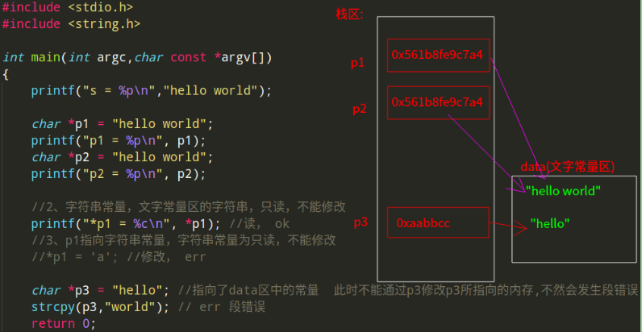

# C语言知识总结(二)一指针(基础篇)
* [内存相关](#1)
	* 内存
	* 物理存储器和存储地址空间
	* 内存地址
* [指针基础](#2)
	* 指针和指针变量
	* 野指针和空指针
	* 指针大小
	* 多级指针
	*  `[]`不是数组的专属
	* 指针的步长、 `void *`万能指针
	* `const`修饰指针变量和修饰内存地址
* [数组和指针](#3)
	* 数组和指针
	* 通过指针加减法来访问数组
	*  指针数组
* [指针和函数](#4)
	* 指针和函数以及值传递
	* 形参中的数组(`"假数组"`(实际上是一个指针))
	* 局部变量和全局变量返回的地址
	*  `%s`打印的内部实现
* [字符串和指针](#5)
	* 字符指针
	* 字符串的拷贝
	* 注意字符串常量以及它的首元素地址 
	* 字符串不能修改(不能通过指针修改)
	* 字符串常量区初始化字符指针和字符数组的区别
	* `main`函数形参说明(字符指针数组) 
	* 字符指针练习: `A`字符串在`B`字符串中出现的次数
	* 不要搞混二级指针和字符数组指针使用

***
### 内存相关
#### 内存
内存含义：
* 存储器：计算机的组成中，用来存储程序和数据，辅助`CPU`进行运算处理的重要部分。 
* 内存：内部存贮器，暂存程序/数据——掉电丢失 `SRAM`、`DRAM`、`DDR`、`DDR2`、`DDR3`。
* 外存：外部存储器，长时间保存程序/数据—掉电不丢 `ROM `、 `ERRROM `、 `FLASH `（ `NAND `、 `NOR `）、硬盘、光盘。

内存是沟通CPU与硬盘的桥梁：
* 暂存放CPU中的运算数据；
* 暂存与硬盘等外部存储器交换的数据；


#### 物理存储器和存储地址空间
<font color = red>有关内存的两个概念：物理存储器和存储地址空间。

<font color = blue>物理存储器：实际存在的具体存储器芯片。
* 主板上装插的内存条；
* 显示卡上的显示RAM芯片；
* 各种适配卡上的RAM芯片和ROM芯片；

<font color = blue>存储地址空间：对存储器编码的范围。我们在软件上常说的内存是指这一层含义。
* 编码：对每个物理存储单元（一个字节）分配一个号码；
* 寻址：可以根据分配的号码找到相应的存储单元，完成数据的读写；

#### 内存地址
* <font color = purple>将内存抽象成一个很大的一维字符数组；
* 编码就是对内存的每一个字节分配一个32位或64位的编号（与32位或者64位处理器相关）；
* 这个内存标号就是内存地址；


***
### 指针和指针变量
#### 指针和指针变量

指针: 
* <font color = red>内存区的每一个字节都有一个编号，这就是“地址”；
* 如果在程序中定义了一个变量，在对程序进行编译或运行时，系统就会给这个变量分配内存单元，并确定它的内存地址(编号)；
* 指针的实质就是内存“地址”。指针就是地址，地址就是指针；

指针变量的定义：
* <font color = red>指针是内存单元的编号，指针变量是存放地址的变量；
* 通常我们叙述时会把指针变量简称为指针，实际他们含义并不一样。


指针变量: 
* 指针也是一种数据类型，指针变量也是一种变量；
* 指针变量指向谁，就把谁的地址赋值给指针变量；
* `“*”`操作符操作的是指针变量指向的内存空间；<font color = red>注意，`*`有两层含义: 
①在定义指针变量的时候，是表示指针的数据类型，比如`int *`、`int **`、`int ***`；
②在操作指针变量地址的时候又是另一层含义；
> * 注意: `&`可以取得一个变量在内存中的地址。但是，不能取寄存器变量，因为寄存器变量不在内存里，而在CPU里面，所以是没有地址的。
```cpp
#include <stdio.h>

int main(int argc, char const *argv[])
{
    int *p;  //指针变量(p的类型是int *)，保存的是 变量的地址
    int a = 100;
    p = &a; // 指针指向谁，就把谁的地址赋给指针 p保存了a的地址
    printf("%p, %p\n", p, &a);  // 16进制的数值(地址) 是相等的

    //1. 直接操作指针变量没有任何意义
    //2. 需要操作*p,操作指针所指向的内存
    printf("%d, %d\n", *p, a);
    *p = 200; // 改变*p指向的内存的值
    printf("%d, %d\n", *p, a);
    return 0;
}
```


#### 野指针和空指针
<font color = red>野指针:

* 指针变量也是变量，是变量就可以任意赋值，不要越界即可（32位为4字节，64位为8字节）；
* 但是，任意数值赋值给指针变量没有意义，因为这样的指针就成了野指针，此指针指向的区域是未知(操作系统不允许操作此指针指向的内存区域)；
* 所以，野指针不会直接引发错误，操作野指针指向的内存区域才会出问题。 
```cpp
#include <stdio.h>

int main(int argc, char const *argv[])
{
    int *p;  //　*p会随机赋值一个地址 
    printf("p = %d\n", p);// 输出地址 没有问题
    //*p = 100; //但是这里会有问题  p指向的地址是随机的,有可能是系统没有授权的内存，　不能随便操作 
    return 0;
}
```
输出: 

```cpp
段错误
```
解释: 


<font color = red>空指针: 

* 野指针和有效指针变量保存的都是数值，为了标志此指针变量没有指向任何变量(空闲可用)，C语言中，可以把NULL赋值给此指针，这样就标志此指针为空指针，没有任何指针。

```cpp
int *p = NULL;
```
注意: <font color = blue>NULL是一个值为0的宏常量：
```cpp
#define NULL    ((void *)0)
```
#### 指针大小

* 使用`sizeof()`测量指针的大小，得到的总是：4或8；
* `sizeof()`测的是指针变量指向存储地址的大小；
* 不是看指针类型有多少个`*`，而是看平台；
* 在32位平台，所有的指针（地址）都是32位(4字节)；
* 在64位平台，所有的指针（地址）都是64位(8字节)

比如我的机器是`64`位的，一下代码全部输出`8`：

```cpp
#include <stdio.h>

int main(int argc, char const *argv[])
{
    int *p1;
    int **p2;
    char *p3;
    char **p4;
    printf("%d\n", sizeof(p1));
    printf("%d\n", sizeof(p2));
    printf("%d\n", sizeof(p3));
    printf("%d\n", sizeof(p4));
    printf("%d\n", sizeof(double *));
    return 0;
}
```
#### 多级指针

```cpp
#include <stdio.h>

int main(int argc, char const *argv[])
{
    int a = 10;

    int *p1 = &a;
    int **p2 = &p1;
    int ***p3 = &p2;
    int ****p4 = &p3;

    printf("*p4 = %d\n", *p4);         //就是p3的地址
    printf("**p4 = %d\n", **p4);       // 就是p2的地址
    printf("***p4 = %d\n", ***p4);     //就是p1的地址
    printf("****p4 = %d\n", ****p4);   //就是p1指向的内存的值

    return 0;
}
```
输出: 

```cpp
*p4 = -733946608
**p4 = -733946600
***p4 = -733946588
****p4 = 10
```
可以看到前三个就是内存地址的值的10进制表示，最后一个是`p1`指向的内存地址的值，也就是`a`的值；

内存图如下: 


####  `[]`不是数组的专属
也可以使用类似数组`[]`的方式来访问指针: 
```cpp
#include <stdio.h>

int main(int argc, char *argv[])
{
    int a = 100;
    int *p = &a;
    //通过指针间接操作a的内存
    *p = 200;
    printf("a = %d\n", a);
    printf("*p = %d\n", *p);
    printf("p[0] = %d\n", p[0]);//*p 等价于*(p+0), 同时等价于p[0]

    printf("----------使用[]来改变指针指向的内存地址---------\n");
    //*p 等价于 p[0]，操作的是指针所指向的内存
    p[0] = 300;
    printf("a = %d\n", a);

    //操作野指针指向的内存
    //p[1] = 111;
    // 等价于 *(p + 1) = 111;
    return 0;
}
```
输出：　

```cpp
a = 200
*p = 200
p[0] = 200
----------使用[]来改变指针指向的内存地址---------
a = 300

```

#### 指针的步长、 `void *`万能指针

* 指针的加法，不是传统的加法；
* 步长由指针指向的数据类型来决定 ` int:4 , char:1`；
```cpp
 #include <stdio.h>

 int main(int argc, char const *argv[])
 {
    // 1. 指针的加法，不是传统的加法
    // 2. 步长由指针指向的数据类型来决定  int:4 , char:1
    int a;
    int *p = &a;
    printf("p: %d, p+1 : %d\n", p, p+1);

    char b;
    char *q = &b;
    printf("q: %d, q+1 : %d\n", q, q+1);
    return 0;
 }
 
```
输出: 

```cpp
p: -968682948, p+1 : -968682944
q: -968682949, q+1 : -968682948
```
可以看出: 
第一个`p+1`比`p`大`4`，而`q+1`比`q`大1。

再看`void *`万能指针: <font color = red>void *指针可以指向任意变量的内存空间。</font>
* `void *p`万能指针，一般用在函数返回值，函数参数；
* 可以理解为`Java`中的`Object`或者类似<font color = red>泛型</font>；
* 不能声明`void`变量，因为不能确定分配多少空间。但是可以使用`void *`指针，因为指针确定了空间(`4`或`8`字节)；
*  `void*`指针作为左值用于“接收”任意类型的指针；
*  `void*`指针作为右值赋值给其它指针时需要强制类型转换。比如 `malloc`返回的就是`void *`类型，则使用的时候`int a = (int *)malloc(sizeof(int ))`；还有`memcpy`的形参类型就是`void *`，所以可以拷贝<font color = blue>字符数组和其他数组</font>；
```cpp
#include <stdio.h>

int main(int argc, char const *argv[])
{
    // void * 可以指向任何类型的变量，使用该指针所指向的内存时，最好强制转换成它本身的类型
    void *p = NULL;
    int a = 100;
    p = &a;

    *( (int *)p ) = 200;  //注意这里强制转化成 int * 类型
    printf("*p = %d\n", *( (int *)p ));// 输出200
    return 0;
}
```

#### `const`修饰指针变量和修饰内存地址
注意要分清修饰的是<font color = red>指针</font><font color = blue>还是</font><font color = red>指针指向的内存地址</font>:

* `const int *p`和`int const *p`都是修饰的`*`，也就是修饰的是<font color = red>指针指向的内存；
* `int * const p`修饰的是`p`这个指针变量，所以此时指针变量不能修改了；
```cpp
#include <stdio.h>

int main(int argc, char const *argv[])
{
    int a = 100;
    int *p1 = &a;
    *p1 = 200; //ok 
    p1 = NULL; //ok 原先指向a的内存,现在改为指向NULL

    // const修饰符 修饰内存地址
    // const int *p2 = &a; //此时const修饰的是int * 也就是指针变量指向的内存地址
    int const *p2 = &a; //和上面的一样的
    // *p2 = 300; // err代码不能编译,因为p2指向的内存　是只读的(const修饰) 
    p2 = NULL; //但是 const没有修饰 p2指针变量, p2是可以改变的 

    // const修饰符　修饰指针变量
    int * const p3 = &a;
    *p3 = 300; //ok   //因为修饰的p3指针， 所以p3指向的内存地址是可以改变的
    // p3 = NULL; //err 但是此时就不能改变指针变量本身了，

    // 指针和内存地址都用const修饰，--> 啥都不能改了
    const int * const p4 = &a;
    // *p4 = 400; //err
    // p4 = NULL; //err
    return 0;
}
```
***
### <font color = red id = "3">数组和指针
#### 数组和指针

```cpp
#include <stdio.h>

int main(int argc, char const *argv[])
{
    int arr[10] = {0,1,2,3,4,5,6,7,8,9};

    // int *p = &arr[0]; 
    int *p = arr; //和上面的代码等价

    for(int i = 0 ; i < sizeof(arr)/sizeof(arr[0]); i++){
        //以下四种方式　是等价的
        // printf("%d ", arr[i]);
        printf("%d ", *(arr + i));
        // printf("%d ", *(p + i));
        // printf("%d ", p[i]);
    }
    printf("\n");
    return 0;
}

```
指针和数组的内存图: 


#### 通过指针加减法来访问数组
```cpp
#include <stdio.h>

int main(int argc, char const *argv[])
{
    
    int arr[10] = {0,1,2,3,4,5,6,7,8,9};
    int *p = arr;
    int len = sizeof(arr)/sizeof(*arr); // *a 等价与 arr[0]
    for(int i = 0; i < len; i++){
        printf("%d ", *p);
        p++; //直接指针做加法
    }
    printf("\n");

    //反向 来访问
    int *q = &arr[len-1];
    for(int i = 0; i < len; i++){
        printf("%d ",*q);
        q--;
    }
    printf("\n");
    return 0;
}
```
输出: 
```cpp
0 1 2 3 4 5 6 7 8 9 
9 8 7 6 5 4 3 2 1 0 
```
#### 指针数组

* 每一个元素都是一个指针；
```cpp
#include <stdio.h>

int main(int argc, char const *argv[])
{
    int a[3] = {1,2,3};
    int *p[3];
    int n = sizeof(p)/sizeof(*p);// 同样也可以这样得到数组的长度 
    for(int i = 0; i < n; i++){
        p[i] = &a[i];   //给每一个指针数组赋值为a数组中的一个内存
    }
    for(int i = 0; i < n; i++){
        // printf("%d ", *p[i]);
        printf("%d ", *(*(p+i))); //和上面的等价
    }
    printf("\n");
    return 0;
}
```
输出: 

```cpp
1 2 3
```
***
###  指针和函数
#### 指针和函数以及值传递

经典问题: `swap`函数。 

* 简单的通过值传递函数不能改变n、m的值；
* <font color = red>通过形参指针变量，实参传递变量的地址，在函数中操作指针变量所指向的内存才可以实现，这就是指针在函数中出现的意义；
* 即: <font color =blue>如果想通过函数改变实参，必须地址传递；  
```cpp
#include <stdio.h>

void swap(int a,int b){  //　值传递 --> 变量传递 
    int t = a;
    a = b;
    b = t;
    printf("a = %d, b = %d\n", a, b);
}

void swap2(int *a,int *b){ //此时a,b是指针变量 ,指向的是n,m的内存
    int t = *a;
    *a = *b;
    *b = t;
}

int main(int argc, char const *argv[])
{
    int n = 10, m = 20;
    //值传递 --> 不管这个变量是什么类型，只要是变量本身传递，就是值传递,
    // 只是一个变量的值的拷贝(就是这个内存的内容，而不是地址)
    // swap(n,m);  //  这个不能交换n、m的值，这个就是指针存在的意义

    swap2(&n,&m); //地址传递，将a,b的地址传递过去

    printf("n = %d, m = %d\n", n, m);// n = 20, m = 10
    return 0;
}
```
内存图如下: 


#### 形参中的数组(`"假数组"`(实际上是一个指针))

* 注意在函数的形参中，出现的数组其实是指针，通过`sizeof()`关键字测试就知道，`sizeof(arr) = 8`(64位操作系统)；
* 所以不管数组方括号内的数字是没有还是多少，都是和一个普通的指针变量是一样；
* 所以要想得到数组的元素个数，最好是直接将数组元素传递到函数中，具体看`print_array2`；
```cpp
#include <stdio.h>


// 1. 形参中的数组，不是数组，而是普通的指针变量(只有一个)
// 2. 以下三种写法都是一样的 编译器都是当做int *处理
// void print_array(int arr[]){
// void print_array(int arr[1000000]){
void print_array(int *arr){  // 所以简单的通过下面的方式来打印a数组是不正确的
    
    int n = sizeof(arr)/sizeof(arr[0]);
    printf("sizeof(arr) = %d\n",sizeof(arr)); //8  --> arr是一个指针变量，因为是64位操作系统，所以是8
    printf("sizeof(arr[0]) = %d\n",sizeof(arr[0]));//4  --> arr[0] 是int类型,所以是4

    for(int i = 0; i < n; i++){ // n = 2
        printf("%d ", arr[i]);
    }
    printf("\n");

    arr = NULL; //ok 不会报编译错误,因为这个只是一个普通的指针变量
}

// 所以要传递一个 数组个数的整形变量
void print_array2(int *arr, int n){  
    for(int i = 0; i < n; i++){
        printf("%d ", arr[i]);
    }
    printf("\n");
}

int main(int argc, char const *argv[])
{
    int arr[10] = {0,1,2,3,4,5,6,7,8,9};
    print_array(arr);    
    printf("--------------------------\n");
    print_array2(arr, sizeof(arr)/sizeof(arr[0]));    
    // arr = NULL:
    return 0;
}
```
#### 局部变量和全局变量返回的地址
注意局部变量和全局变量: 
* 局部变量在函数调用完之后就释放了。所以将局部变量的地址返回，然后在`main`函数中操作这个地址的内存是不安全的，在`linux`下发生段错误；
* 全局变量在程序结束才释放，所以可以操作这个地址；

<font color = blue>局部变量：
```cpp
#include <stdio.h>

int *fun() // 注意,当fun()函数执行完毕, a就自动释放了
{   
    int a;
    return &a;// 返回a的地址
}

int main(int argc, char const *argv[])
{
    int *p = NULL;
    p = fun(); //接受函数返回的地址
    printf("p = %d\n", p); //linux64位gcc，不允许返回局部变量的地址 //发生段错误

    //相当于野指针了
    *p = 100; // 操作那个局部变量所指向的内存(但是那个内存已经被释放)
    return 0;
}
```
输出: 

```cpp
p = 0
段错误
```

<font color = blue>全局变量(注意第二种灵活的改变方式): 

```cpp
#include <stdio.h>

int a; //全局变量只有在程序结束之后才释放

int *fun()
{
    return &a;// 返回全局变量的地址
}

int main(int argc, char const *argv[])
{
    int *p = fun();
    printf("%d\n", p); //打印返回的地址
    *p = 100;
    printf("*p = %d, a = %d\n", *p, a);//*p = 100, a = 100

    //　也可以不使用p来中转
    *( fun() ) = 200;
    printf("a = %d\n", a);//a = 200
    return 0;
}

```
输出：　

```cpp
1263386676
*p = 100, a = 100
a = 200
```
#### `%s`打印的内部实现
* 注意`%s`打印的时候，不要将`str`写成`*str`；
* `%s`操作的是指针指向的内存 , `str`是首元素的地址 , `*str`是字符数组首元素的值(即`str[0]`)；
```cpp
#include <stdio.h>

int main(int argc, char const *argv[])
{
    char str[] = "hello world!";
    for(int i = 0; str[i] != '\0'; i++)
        printf("%c", str[i]);
    printf("\n");
    // printf("%s\n", *str); // 段错误
    printf("%s\n", str); // 为什么不是 *str呢 
    // %s操作的是指针指向的内存 , str是首元素的地址 , *str是字符数组首元素的值
    printf("%c\n", *str);  // h
    return 0;
}
```
输出: 

```cpp
hello world!
hello world!
h
```
***
### <font color = red id = "5">字符串和指针
#### 字符指针
注意字符串特殊的地方，操作的时候就是操作内存了，而不是变量
```cpp
#include <stdio.h>

int main(int argc, char const *argv[])
{
    char str[] = "hello";

    str[0] = '1';
    *(str+1) = '2';
    printf("str = %s\n", str); //12llo
    printf("str = %s\n", &str[0]); //12llo
    printf("str = %s\n", str+1); //2llo
    printf("str = %s\n", &str[0]+1); //2llo

    //定义一个指针，指向首元素
    char *p = &str[0];// 或者char *p = str //数组名就是首元素地址
    *p = 'a';
    p++;
    *p = 'b';
    printf("str = %s\n", str); //abllo
    printf("p = %s\n", p); //bllo
    printf("p = %s\n", p-1);//abllo
}
```
输出：

```cpp
str = 12llo
str = 12llo
str = 2llo
str = 2llo
str = abllo
p = bllo
p = abllo
```
#### 字符串的拷贝

* 可以用指针变量来操作字符串，操作指针所指向的内存就是操作字符串；
* 所以指针需要先指向特定字符串的内存地址，不能将字符串拷贝给野指针；
```cpp
#include <stdio.h>
#include <string.h>

int main(int argc, char const *argv[])
{ 
    char buf[100];
    // p指向buf的首元素
    // strcpy是给p所指向的内存拷贝内容，字符串拷贝给了buf
    char *p = buf;
    strcpy(p,"hello world!");
    printf("p = %s\n", p);
    printf("buf = %s\n", buf);
    return 0;
}

int main01(int argc, char const *argv[])//段错误
{
    char *p;
    // 1.不是给p变量拷贝内容
    // 2.给p所指向的内存拷贝内容
    // 3.p是野指针，给野指针所指向的内存拷贝内容，导致段错误
    strcpy(p, "hello world!");   
    return 0;
}
```
输出: 
```cpp
p = hello world!
buf = hello world!
```
> 注意`0`和`'\0'`以及`'0'`的区别:
> * 前两个是等价的，都是字符串的结束符标志；
> * `'0'`: 字符`'0'`,它的的ascii码是`48`，不是字符串的结束表示；

#### 注意字符串常量以及它的首元素地址 
* 注意每一个字符串常量都有一个特定的地址，不会改变，这个地址就是字符串的首元素地址；
* <font color = red>再重复一遍，字符串常量就是此字符串的首元素地址。所以`char *p = "hello world";`自然就很合理了；</font>
* 字符串常量放在`data`区，也就是文字常量区；
* 可以使用类似指针的加减法来访问字符串；
```cpp
#include <stdio.h>

void fun()
{ 
    printf("%p\n","hello world");
}

int main(int argc,char const *argv[])
{
    //1.每个字符串都是一个地址,这个地址就是字符串的首元素地址
    //2.字符串常量放在data区，也就是文字常量区
    printf("%p\n","hello world");
    fun();
    // 输出"ello world"
    printf("%s\n","hello world" + 1);
    printf("%c\n",*("hello world"));//h
    return 0; 
}
```
输出: 

```cpp
0x55fc6cde07b4
0x55fc6cde07b4
ello world
h
```
#### 字符串不能修改(不能通过指针修改)
* 字符串常量不可修改，有一个固定的地址，可以使用多个指针来指向它；
* 如果某个字符指针指向了常量池中的字符串常量，就不能修改这个指针指向的内存(常量池)，因为字符串常量是不可修改的； 
```cpp
#include <stdio.h>
#include <string.h>

int main(int argc,char const *argv[])
{ 
    printf("s = %p\n","hello world");

    char *p1 = "hello world";
    printf("p1 = %p\n", p1);
    char *p2 = "hello world";
    printf("p2 = %p\n", p2);

    //2、字符串常量，文字常量区的字符串，只读，不能修改
    printf("*p1 = %c\n", *p1); //读， ok
    //3、p1指向字符串常量，字符串常量为只读，不能修改
    //*p1 = 'a'; //修改， err

    char *p3 = "hello"; //指向了data区中的常量  此时不能通过p3修改p3所指向的内存,不然会发生段错误
    strcpy(p3,"world"); // err 段错误
    return 0;
}
```
输出: 

```cpp
s = 0x561b8fe9c7a4
p1 = 0x561b8fe9c7a4
p2 = 0x561b8fe9c7a4
*p1 = h
段错误
```
内存图: 



#### 字符串常量区初始化字符指针和字符数组的区别

* 注意字符串数组和字符指针不同，字符串数组是一个一个的拷贝的；
* 而字符指针是保存的字符串常量的地址；
```cpp
#include <stdio.h>

int main(int argc, char const *argv[])
{
    // 1. p指针保存了"hello"的地址
    // 2. 指针所指向的内存不能修改
    char *p = "hello";

    // 1. 把"hello"一个一个字符放在buf数组中
    // 2. 数组的元素可以修改
    char buf[] = "hello";
    return 0;
}
```

#### `main`函数形参说明(字符指针数组) 
```cpp
#include <stdio.h>

// 以下三种写法也是一样的
// void print_array(char *p[10000],int n){
// void print_array(char *p[],int n){
void print_array(char **p,int n){
    for(int i = 0; i < n; i++)
        printf("%s\n",p[i]);
}

int main(int argc, char const *argv[])
{
    char *p[] = {"aaa", "bbb", "ccc"};
    int n = sizeof(p)/sizeof(*p);
    print_array(p,n);
    return 0;
}
```
输出:

```cpp
aaa
bbb
ccc
```
再来看`main`函数: 
* `main`函数是操作系统调用的，第一个参数标明`argv`数组的成员数量，`argv`数组的每个成员都`是char *`类型；
* `argv`是命令行参数的字符串数组；
* `argc`代表命令行参数的数量，程序名字本身算一个参数；

```cpp
#include <stdio.h>

// 1. argc 相等于n (argv[]数组的元素个数)
// 2. argv就是那个二维数组,数组每个元素都是char *(字符地址) --> 可以写成 char **argv
int main(int argc, char const **argv)
{
    for(int i = 0; i < argc; i++){
        // printf("%s\n", argv[i]);
        printf("%s\n", *(argv+i));
    }
    return 0;
}
```
运行结果：


#### 字符指针练习: `A`字符串在`B`字符串中出现的次数
* 熟练掌握使用指针变量移动来实现寻找出现的次数；
```cpp
#include <stdio.h>
#include <string.h>

int main(int argc, char const *argv[])
{
    char *B = "13435aaa345564aaa34589345aaa78345aaa890345"; 
    char A[] = "aaa";
    char *t = NULL;
    int count = 0;
    while(1){
        t = strstr(B,A);
        if(t == NULL) 
            break;
        else {
            count++;
            B = t + strlen(A); // 这是关键，要移动指针变量
        }
    }
    printf("%s出现的次数 = %d\n", A,count);// 4
    return 0;
}
```
#### 不要搞混二级指针和字符数组指针使用

```cpp
#include <stdio.h>

// 2. 二级指针 当做数组指针 
// 本质是指针
void fun(char **p){
// void fun(char *p[]){
// void fun(char *p[1000]){

}   

int main(int argc, char const *argv[])
{
    // 二级指针使用要分情况
    // 1. 二级指针 不能当做初始化
    // char **p = {"aaa","bbb","ccc"}; //err
    return 0;
}
```


