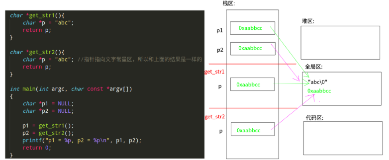
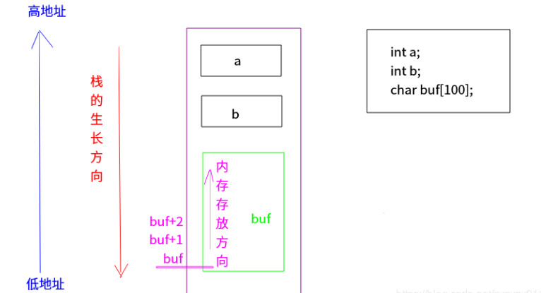
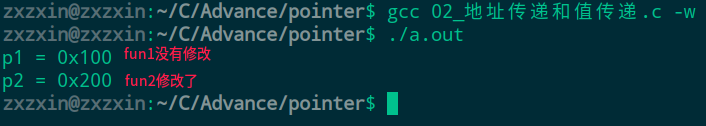
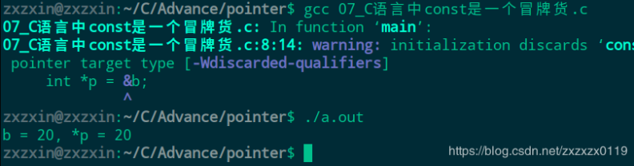
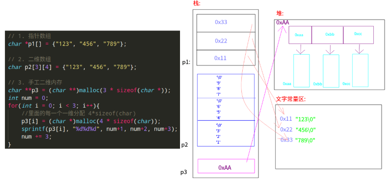
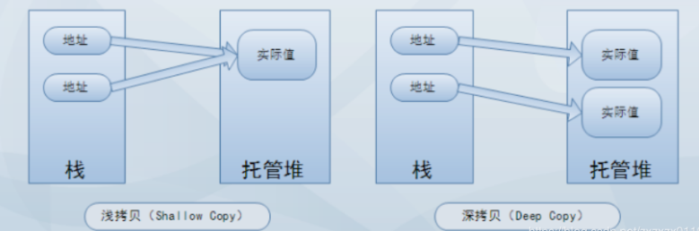

# C语言知识总结(四)一内存、指针、字符串(提高篇)

* [内存四区](#1)
* [指针](#2)
* [函数指针](#3)
* [字符串](#4)
* [二级指针](#5)
* [多维数组](#6)
* [结构体](#7)
***
### <font color= red id = "1">内存四区
##### 数据类型概念
* "类型"是对数据的抽象；
* 类型相同的数据有相同的表示形式、存储格式以及相关的操作 ；
* 程序中使用的所有数据都必定属于某一种数据类型 ； 

##### 数据类型本质
* <font color = red>数据类型可理解为创建变量的模具：是固定内存大小的别名；
* <font color = red>数据类型的作用：编译器预算对象（变量）分配的内存空间大小；
* <font color = red>注意：数据类型只是模具，编译器并没有分配空间，只有根据类型（模具）创建变量（实物），编译器才会分配空间。
* <font color =red>`sizeof`是操作符，不是函数；`sizeof`测量的实体大小为编译期间就已确定。

```cpp
#include <stdio.h>

int main(int argc, char const **argv)
{
    int a;		//告诉编译器，分配 4个字节
    int arr[10];	//告诉编译器，分配 4 * 10 个字节
    //类型的本质：固定内存块大小别名 ,可以通过 sizeof()测试
    printf("sizeof(a) = %d, sizeof(arr) = %d\n", sizeof(a), sizeof(arr));

    //数组名字，数组首元素地址，数组首地址
    printf("arr:%d， &arr:%d\n", arr, &arr); //是一样的

    //arr, &arr的数组类型不一样
    //arr， 数组首元素地址， 一个元素4字节，+1， +4
    //&arr, 整个数组的首地址，一个数组4*10  = 40字节，+1， +40
    printf("arr+1:%d， &arr+1:%d\n", arr+1, &arr+1);  //这两个不同

    //指针类型长度，32位程序， 长度4
    //            64位程序， 长度8
    char ***********************p = NULL;
    int *q = NULL;
    printf("%d, %d\n", sizeof(p), sizeof(q));
    return 0;
}
```
输出结果: 


##### <font color = red>程序内存四区模型: 
* 操作系统把物理硬盘代码load到内存；
* 操作系统把`C`语言代码分成四个区；


各个区的功能: 


> <font color = red>注意全局区包括: 全局变量、静态变量、文字常量区；

<font color = blue>①测试全局文字常量区: 

```cpp
#include <stdio.h>

char *get_str1(){
    char *p = "abc";
    return p;
}

char *get_str2(){
    char *p = "abc"; //指针指向文字常量区，所以和上面的结果是一样的
    return p;
}

int main(int argc, char const *argv[])
{
    char *p1 = NULL;
    char *p2 = NULL;

    p1 = get_str1();
    p2 = get_str2();
    printf("p1 = %p, p2 = %p\n", p1, p2);
    return 0;
}
```
输出： 
```cpp
p1 = 0x55806a717774, p2 = 0x55806a717774
```
分析: (<font color = red>字符串常量放在文字常量区</font> )




<font color = blue>② 栈区测试: 
```cpp
#include <stdio.h>
#include <string.h>

char *get_str(){
    char str[] = "abcd";
    printf("str = %s\n", str);
    return str;
}

int main(int argc, char const *argv[])
{
    char buf[128] = {0};

    // strcpy(buf, get_str());
    // printf("buf = %s\n", buf);//乱码，不确定

    char *p = get_str();
    // 乱码 不确定  因为get_str()函数中 str数组在栈区中的空间已经释放了
    printf("p = %s\n", p);
    return 0;
}
```
输出： 

```cpp
str = abcd
p = (null)
```

内存分析: 


③堆区: 

```cpp
#include <stdio.h>
#include <string.h>
#include <stdlib.h>

char *get_str(){
    char *str = (char*)malloc(100 * sizeof(char));//分配100个字符的空间
    if(str == NULL){
        return NULL;
    }
    strcpy(str, "abcd");
    return str;
}

int main(int argc, char const *argv[])
{
    char *p = get_str();
    if(p != NULL){
        printf("p = %s\n", p);

        free(p);
        p = NULL;
    }
    return 0;
}
```
输出:

```cpp
p = abcd
```


> 关于 `free()`函数: 
> * `free(p)`意义: 告诉系统，`p`原来指向的内存可以被别人使用了；
> * 释放完指针p `free(p)`，此时`p`的地址还在，没有变，只是此时的`p`相当于一个野指针，所以最好是重新赋值为`NULL`；

**总结：** 

* 在<font color = red>堆和全局区</font>分配的: 其他函数都能用；
* <font color = blue>在栈上分配的内存，子函数执行完成，父函数不能使用；
##### 函数的调用模型


##### <font color = red>栈的生长方向和内存存放方向

代码验证: 

```cpp
#include <stdio.h>

int main(int argc, char const *argv[])
{
    int a;
    int b;
    printf("&a = %d, &b = %d\n", &a, &b);

    char buf[100];
    printf("buf = %d, buf+1 = %d\n", buf, buf+1);
    return 0;
}
```
运行结果:


分析: 



***
### <font color= red id = "2">指针

##### 指针是一种数据类型
* 指针是一种数据类型，是指它指向的内存空间的数据类型 ；
* 在指针声明时，`*` 号表示所声明的变量为指针；
* 在指针使用时，`*` 号表示操作指针所指向的内存空间中的值。①`*p`相当于通过地址(`p`变量的值)找到一块内存，然后操作内存；②	`*p`放在等号的左边赋值（给内存赋值，写内存）；③	`*p`放在等号的右边取值（从内存获取值，读内存）；
* 指针变量和它指向的内存块是两个不同的概念，各自的值没有任何关系；

* 当我们不断的给指针变量赋值，就是不断的改变指针变量（和所指向内存空间没有任何关系）。指针指向谁，就把谁的地址赋值给指针；
*  不允许向NULL和未知非法地址拷贝内存(<font color = red>野指针和空指针</font>)；
* 间接赋值是指针存在的最大意义；

注意 ，<font color = red>写内存时，一定要确保内存可写: </font>

```cpp
#include <stdio.h>

int main(int argc, char const *argv[])
{
    char *p = "abcd"; 
    // *(p+1) = 'e'; //发生段错误  常量区不可以修改

    char p2[] = "abcd"; //这个是从常量区拷贝到了栈区，所以可以修改
    p2[1] = 'e';
    return 0;
}
```
分析: 


##### 函数传递(值传递和地址传递)

```cpp
// .c 文件下
#include <stdio.h>

int fun1(int *p){
    p = 0x200;
}

int fun2(int **p){ //指向指针的指针变量
    *p = 0x200;  //通过* 来操作指针变量指向的内存
}

int main(int argc, char const *argv[])
{
    int *p = 0x100;

    fun1(p);  //值传递
    printf("p1 = %p\n", p);//100 

    fun2(&p); //地址传递
    printf("p2 = %p\n", p);//200
    return 0;
}
```
输出:



总结: 

* 还是和之前的一样，只不过这里的变量是<font color = red>指针变量</font>，指针是指向指向指针的指针而已；
* 地址传递前面一定要记得加上`&`，然后函数中通过`*`来操作指针指向的内存；

> 注意: 
> * 地址传递的思想： 函数调用时，形参传给实参，用实参取地址，传给形参，在被调用函数里面用`*p`，来改变实参，把运算结果传出来；
> * 主调函数、被调函数 ：
① <font color = blue>主调函数可把堆区、栈区、全局数据内存地址传给被调用函数；</font>
② <font color = blue>被调用函数只能返回堆区、全局数据；
> * 间接赋值的推论: 
> > * 用`1`级指针形参，去间接修改了`0`级指针(实参)的值。
> > * 用`2`级指针形参，去间接修改了`1`级指针(实参)的值。
> > * 用`3`级指针形参，去间接修改了`2`级指针(实参)的值。
> > * 用`n`级指针形参，去间接修改了`n-1`级指针(实参)的值。


##### 指针做参数输入输出特性(重要)
* 输入： 在主调函数中分配内存；
* 输出： 在被调函数中分配内存；


区别下面两种赋值(还是值传递和地址传递问题): 

代码①
```cpp
#include <stdio.h>
#include <stdlib.h>
#include <string.h>

void fun(char *p){ 
    p = (char*)malloc(sizeof(10));
    if(NULL == p)
        return;
    strcpy(p, "abcd");
}

int main(int argc, char const **argv)
{ 
    char *p = NULL;
    fun(p);
    printf("p = %s\n", p);
    return 0;
}
```
输出： 

```cpp
p = (null)
```

代码②
```cpp
#include <stdio.h>
#include <stdlib.h>
#include <string.h>

void fun(char **p, int *len){ 
    if(NULL == p)
        return;
    char *temp = (char*)malloc(sizeof(10));
    if(NULL == temp)
        return;
    strcpy(temp, "abcd");
    
    //间接赋值
    *p = temp;
    *len = strlen(temp);
}

int main(int argc, char const **argv)
{ 
    char *p = NULL;
    int len = 0;
    fun(&p, &len);
    printf("p = %s, len = %d\n", p, len);
    return 0;
}
```
输出:
```cpp
p = abcd, len = 4
```
看第二种的分析: 
* 第一步，先给`temp`在堆区分配空间，此时`temp`指针变量的值是`oxaabb`；
* 第二步，将`"abcd"`拷贝到`temp`指向的堆区空间；
* 第三步，将`temp`的值(地址的值)赋值给`p`指向的内存，而`p`指向的内存就是`main`函数中的`p`；此时`main`函数中的`p` = `0xaabb`，所以`main`函数中的`p`也指向了堆区空间，所以得到上面的打印结果；


***
### <font color= red id = "3">函数指针

##### 简单应用
* 一个函数在编译时分配给一个入口地址，这个函数的入口地址就成为函数的指针。 可以用一个指针变量指向函数，然后通过该指针变量调用此函数；

看一个简单的使用: 

```cpp
#include <stdio.h>

int max(int a, int b){ 
    return a> b ? a : b;
}

int main(int argc, char const **argv)
{ 
    int a,b;
    //定义一个p是一个指向函数的指针变量，该函数有两个整形参数
    int (*p)(int, int);
    //指向max函数 --> 将max()的入口地址赋给指针变量p
    //和数组名代表数组首元素地址类似，函数名代表改函数的入口地址
    p = max; 
    scanf("%d %d", &a, &b);
    int c = (*p)(a, b);//调用p指向的函数 等价于 c = max(a,b)
    printf("max(%d, %d) = %d\n", a, b, c);
    return 0;
}
```
程序很简单，就是输入`a`、`b`，求`a`、`b`的最大值。
分析: 
* 类似数组首地址，此时`p`和`max`都是函数的开头。调用`*p`就是调用`max`函数；
* 注意指向函数的指针，只能指向函数的入口处，而不能指向中间的某一条指令处，因此不能用`*(p+1)`来表示函数的下一个指令，向`p+n`、`p++`、`p--`等运算是无意义的；

##### 用指向函数的指针做函数参数
使用模型: 

```cpp
void sub(int (*p1)(int), int (*p2)(int, int)){   //形参是两个指向函数的指针
    int res1,res2,a,b;
    res1 = (*p1)(a); //调用p1指向的函数 (传递参数a)
    res2 = (*p2)(a, b); //调用p2指向的函数 (传递参数a,b)
}
```
使用的意义:
* 每次调用`sub`函数时，要调用的函数不是固定的，这次调用的是`f1`、`f2`，下次调用的是`f3`、`f4`，这时，使用指针变量就比较方便；
* 只要每次在调用`sub`函数时给出不同的函数名作为实参即可，`sub`函数不必做任何修改；

使用举例: 

```cpp
#include <stdio.h>

int max(int a, int b){ 
    return a > b ? a : b;
}

int min(int a, int b){ 
    return a < b ? a : b;
}

int sum(int a, int b){ 
    return a + b;
}

int fun(int a, int b, int (*p)(int, int)){ 
    return (*p)(a, b);
}

int main(int argc, char const **argv)
{ 
    int a = 10, b = 20;
    printf("max(%d, %d) = %d\n", a, b, fun(a,b,max));
    printf("min(%d, %d) = %d\n", a, b, fun(a,b,min));
    printf("sum(%d, %d) = %d\n", a, b, fun(a,b,sum));
    return 0;
}
```
输出: 

```cpp
max(10, 20) = 20
min(10, 20) = 10
sum(10, 20) = 30
```
上面的程序也可以看到函数指针作为形参的作用。
***
### <font color= red id = "4">字符串

##### 通过数组法和指针法访问字符串

```cpp
#include <stdio.h>
#include <string.h>

int main(int argc, char const *argv[])
{
    char buf[] = "abc";
    int n = strlen(buf); //编译器转换了类型
    char *p = buf;

    for (int i = 0; i < n; i++){
        printf("%c", buf[i]);
        printf("%c", p[i]); // []方式
        printf("%c", *(p+i) );
        printf("%c", *(buf+i) );
    }
    printf("\n");

    //buf和p完全等价吗？
    // p++;  // ok
    // buf++; // err  --> buf只是一个常量，不能修改
    return 0;
}
```
输出: 
```cpp
aaaabbbbcccc
```
> 注意`buf`和`p`不完全等价，因为`buf`是一个常量，系统要释放空间的时候使用。


##### 字符串拷贝函数的多种写法

```cpp
#include <stdio.h>

void copy1(char *src, char *dest){
    int i;
    for( i = 0; *(src + i) != '\0'; i++)
        *(dest + i) = *(src + i);
    *(dest + i) = 0; // '\0'
}

void copy2(char *src, char *dest){
    while(*src != 0){
        *dest = *src;
        dest++; 
        src++;
    }
    *dest = 0;
}

void copy3(char *src, char *dest){
    while(*dest++ = *src++); //最后会自动有'\0' 
}

// 完整版 : 最好不要直接使用形参
void copy4(char *src, char *dest){
    if(src == NULL || dest == NULL)
        return ;
    char *to = dest;
    char *from = src;
    // while(*dest++ = *src++);
    while(*to++ = *from++);  //注意不要写成 (*dest)++ = (*src)++
    // printf("dest = %s\n", dest); //如果是 直接操作形参，就改变了指针
}

int main(int argc, char const *argv[])
{
    char src[] = "abcd";
    char dest[10];
    // copy1(src, dest);
    // copy2(src, dest);
    // copy3(src, dest);
    copy4(src, dest);

    printf("dest = %s\n", dest);// abcd
    return 0;
}
```
注意两个问题

* `copy3`中的`++`运算符操作的是地址的加减法，而不是内存的值； 
* 最好不要修改形参，可以使用变量存储；

##### C语言的`const`是一个冒牌货

```cpp
// .c文件
#include <stdio.h>

int main(int argc, char const *argv[])
{
    // 在C语言中, const一个冒牌货
    const int b = 10;
    // b = 20; //err
    int *p = &b;
    *p = 20; //ok
    printf("b = %d, *p = %d\n", b, *p);
    return 0;
}
```
输出： 




> * 所以可以看到还是可以通过指针来修改`const`修饰的变量的值；
> * 还有一点 : <font color = blue>在另一.c源文件中引用const常量时，只能声明，不能改变；

***
### <font color= red id = "5">二级指针

##### 基本概念: 

* 	如果<font color=  blue>一个指针变量存放的又是另一个指针变量的地址</font>，则称这个指针变量为<font color = red>指向指针的指针变量。</font>也称为“二级指针”。
* <font color = blue>通过指针访问变量称为间接访问</font>。由于指针变量直接指向变量,所以称为“一级指针”。<font color = red>而如果通过指向指针的指针变量来访问变量则构成“二级指针”。 


##### 二级指针第一种输入模型(<font color = blue>指针数组</font>)

* 当做形参使用的时候， 就是指针数组，和二级指针等价；
* 但是注意不能在初始化字符数组的时候使用，`char **p = {"cba", "abd", "abc", "bac", "bab"};`
```cpp
#include <stdio.h>
#include <string.h>

// void bubble_sort(char *p[], int n){
void bubble_sort(char **p, int n){
    for(int end = n - 1; end > 0; end--){
        for(int i = 0; i < end; i++){
            // if(strcmp(p[i], p[i+1]) > 0){
            if(strcmp(*(p+i), *(p+(i+1))) > 0){
                char *temp = p[i];
                p[i] = p[i+1];
                p[i+1] = temp;
            }
        }
    }  
}

// void print_array(char *p[], int n){
void print_array(char **p, int n){
    for(int i = 0; i < n; i++){
        // printf("%s ", p[i]);
        printf("%s ", *(p+i));
    }
    printf("\n");
}


int main(int argc, char const *argv[])
{
    char *p[] = {"cba", "abd", "abc", "bac", "bab"};
    // char **p = {"cba", "abd", "abc", "bac", "bab"}; // err 注意这里不能用
    int n = sizeof(p)/sizeof(*p);
    print_array(p, n);
    bubble_sort(p, n);
    print_array(p, n);
    return 0;
}

```
输出: 

```cpp
-----------排序前------------
cba abd abc bac bab 
-----------排序后------------
abc abd bab bac cba 
```

##### 二级指针第二种输入模型(<font color = blue>二维数组</font>)

```cpp
#include <stdio.h>

int main(int argc, char const *argv[])
{
    //定义二维数组，不写第一个[]值有条件, 必须要初始化
    //a代表首行地址，首行地址和首行首元素地址有区别，但是他们的值是一样
    //区别：步长不一样
    char a[][30] = { "22222222222", "11111111111", "bbbbbbbbbbb", "aaaaaaaaaaaa" };
    printf("a:%d, a+1:%d\n", a, a+1); // a+1 比 a 大30  所以a代表的是首行的地址， 而不是整个数组的地址
    printf("a[0]: %d, a[0]+1: %d\n", a[0], a[0]+1); // a[0]+1 比 a[0] 大 1 所以a[0]是第0行的首元素地址
    printf("a[0]: %d, a[1]: %d\n", a[0], a[1]);
    
    char b[30];
    printf("&b:%d, &b+1:%d\n", &b, &b+1); // &b+1 比 &b 大30  说明&b是整个数组的地址
    printf("b:%d, b+1:%d\n", b, b+1);     // b+1 比 b 大 1    说明b是首元素的地址

    int n = sizeof(a) / sizeof(a[0]);  // 30*4/30
    printf("n = %d\n", n);

    for (int i = 0; i < 4; i++){
        printf("%s\n",a[i]); 
        // printf("%s\n",*(a+i)); 
        //首行地址，和首行首元素地址的值是一样 ,所以下面的打印也可以，但是正常是上面的打印
        // printf("%s\n",a+i);
    }
    return 0;
}
```
输出: (从输出可以看到二维数组各个地址的特性)
```cpp
a:-375886720, a+1:-375886690
a[0]: -375886720, a[0]+1: -375886719
a[0]: -375886720, a[1]: -375886690
&b:-375886752, &b+1:-375886722
b:-375886752, b+1:-375886751
n = 4
22222222222
11111111111
bbbbbbbbbbb
aaaaaaaaaaaa
```
二维数组`a`(`char a[4][30]`):
>	* 二维数组的数组名代表首行地址（第一行一维数组的地址）；
>	* 	首行地址和首行首元素地址的值是一样的，但是它们步长不一样；
>	* 	首行地址`+1`，跳过一行，一行`30`个字节，`+30`；
>	* 	首行首元素地址`+1`，跳过一个字符，一个字符为`1`个字节，`+1`
>	* 	`sizeof(a)`: 有`4`个一维数组，每个数组长度为`30`，`4 * 30 = 120`；
>	* 	`sizeof(a[0])`: 第`0`个一维数组首元素地址，相当于测第`0`个一维数组的长度：为`30`；

一维数组`b`(`char b[30]`): 
>	*	`&b`代表整个一维数组的地址，相当于二维数组首行地址；
>	*	`b`代表一维数组首元素地址，相当于二维数组首行首元素地址；
>	*	`&b` 和 `b` 的值虽然是一样，但是，它们的步长不一样；
>	*	`&b + 1`： 跳过整个数组，`+30`；
>	*	`b+1`: 跳过`1`个字符，`+1`；

**案例: 二维字符数组排序**

```cpp
#include <stdio.h>
#include <string.h>

void print_array(char a[][30], int n){
    //printf("a: %d, a+1:%d\n", a, a + 1);
    for (int i = 0; i < n; i++)
        printf("%s, ", a[i]); //首行地址，和首行首元素地址的值是一样  
    printf("\n");
}

// 二维数组: 蠢办法: 暂时按照原来的样子写
void sort_array(char a[][30], int n){
    char tmp[30];
    for(int end = n - 1; end > 0; end--){
        for(int i = 0; i < end; i++){
            if (strcmp(a[i], a[i+1])> 0){
                //交换内存块  这里要注意
                strcpy(tmp, a[i]);
                strcpy(a[i], a[i+1]);
                strcpy(a[i+1], tmp);
            }
        }
    }
}

int main(int argc, char const **argv)
{
    char a[][30] = {"cba", "abd", "abc", "bac", "bab"};
    int n = sizeof(a) / sizeof(a[0]);
    printf("before sort:\n");
    print_array(a, n);

    sort_array(a, n);

    printf("after sort:\n");
    print_array(a, n);
    return 0;
}
```
输出: 
```
before sort:
cba, abd, abc, bac, bab, 
after sort:
abc, abd, bab, bac, cba, 
```
总结: 
* 二维数组传参的时候，直接和实参类型写成一样是可以的，但是也可以用数组指针来写，后面看。

##### 二级指针第三种输入模型(<font color = blue>二级指针分配空间</font>)


```cpp
#include <stdio.h>
#include <stdlib.h>
#include <string.h>

char **getMem(int n){
    char **buf = (char **)malloc(n * sizeof(char *));

    for(int i = 0; i < n; i++){
        buf[i] = (char *)malloc(sizeof(char) * 10); //为里面的里面每一个char *分配空间
        char temp[10];
        sprintf(temp, "%d-temp-%d", i, i);
        strcpy(buf[i], temp);
    }
    return buf;
}

void print_buf(char **buf, int n){
    for(int i = 0 ; i < n; i++)
        printf("%s ", buf[i]);
    printf("\n");
}

void free_buf(char **buf, int n){
    for(int i = 0; i < n; i++){
        free(buf[i]);
        buf[i] = NULL;
    }
    if(buf != NULL){
        free(buf);
        // buf = NULL; 这个没有实际的作用，因为是值传递s 
    }
}

void free_buf2(char ***tmp, int n){
    char **buf = *tmp; //定义一个二级指针指向*tmp --> 操作*tmp
    for(int i = 0; i < n; i++){
        free(buf[i]);
        buf[i] = NULL;
    }
    if(buf != NULL){
        free(buf);
        buf = NULL;
    }
    *tmp = NULL;
}

int main(int argc, char const *argv[])
{
    char **buf = NULL;
    int n = 3;
    buf = getMem(n);
    print_buf(buf,n);

    //因为free_buf是值传递，所以自己赋值为NULL，如果要在函数中赋值，就要使用三级指针
    // free_buf(buf, n);
    // buf = NULL; 
    
    free_buf2(&buf, n);
    if(buf == NULL){ // 不能执行
        free(buf);
        buf = NULL;
    }
    return 0;
}
```
输出: 
```cpp
0-temp-0 1-temp-1 2-temp-2 
```
关于`getMem`函数的内存分析: 


##### 总结三种输入模型的内存分配
```cpp
#include <stdio.h>
#include <stdlib.h>

int main(int argc, char const *argv[])
{
    // 1. 指针数组
    char *p1[] = {"123", "456", "789"};

    // 2. 二维数组
    char p2[3][4] = {"123", "456", "789"};
    
    // 3. 手工二维内存
    char **p3 = (char **)malloc(3 * sizeof(char *));
    int num = 0;
    for(int i = 0; i < 3; i++){
        //里面的每一个一维分配 4*sizeof(char)
        p3[i] = (char *)malloc(4 * sizeof(char)); 
        sprintf(p3[i], "%d%d%d", num+1, num+2, num+3);
        num += 3;
    }

    //打印测试
    for(int i = 0; i < 3; i++)
        printf("%s %s %s\n", p1[i], p2[i], p3[i]);
    return 0;
}
```
输出：

```c
123 123 123
456 456 456
789 789 789
```
总结：




##### 案例一:替换字符串
```cpp
#include <stdio.h>
#include <string.h>
#include <stdlib.h>

void replaceStr(char *src/*in*/, char **dst/*out*/, char *sub/*in*/, char *newsub/*in*/){
    if(src == NULL || dst == NULL || sub == NULL || newsub == NULL)
        return ;
    char *start = src;
    char *p = NULL;
    char temp[512]; //存储中间值
    
    while(*start != '\0'){
        p = strstr(start, sub); 
        if(p == NULL){ 
            strcat(temp, p); //记得把最后一段加进去
            break;
        }
        int len = p - start;
        if(len > 0)
            strncat(temp, start, len); //拷贝原来的 
        strncat(temp, newsub, strlen(newsub));//拷贝替换的
        start = p + strlen(sub);
    }
    char *buf = (char *)malloc(strlen(temp) + 1);
    strcpy(buf, temp);
    *dst = buf;// 间接赋值是指针存在的最大意义
}

void free_buf(char **buf){
    char *temp = *buf;
    if(NULL != temp) 
        free(temp);
    *buf = NULL;
} 

int main(int argc, char const *argv[])
{
    char *p = "11111111aaaaa2222222aaaaa333333aaaaa";//将字符串中的aaaaa替换成了bbbbb
    char *buf = NULL; //在被调函数中分配空间
    replaceStr(p, &buf, "aaaaa", "bbbbb");
    printf("buf = %s\n", buf);
    free_buf(&buf);
    return 0;
}
```
输出：　

```
buf = 11111111bbbbb2222222bbbbb333333bbbbb
```
##### 案例二: 分割字符串

```cpp
#include <stdio.h>
#include <stdlib.h>
#include <string.h>

//void splitStr(const char *src, char c, char buf[10][30], int *count){ 
void splitStr(const char *src, char c, char **buf, int *count){ 
    if(src == NULL)
        return;
    const char *start = src;
    char *p = NULL;
    int i = 0;
    while(*start != '\0'){ 
        p = strchr(start, c);// strstr是找字符串
        if(p != NULL){
            int len = p - start;
            strncpy(buf[i], start, len);
            buf[i][len] = 0; //结束符
            i++;
            start = p + 1;
        }else{ 
            strcpy(buf[i],start);
            //buf[i][strlen(p)] = 0;
            i++;
            break;
        }
    }
    *count = i;
}

char **getMem(int n){ 
    char **buf = (char **)malloc(n * sizeof(char *));
    for(int i = 0; i < n; i++){ 
        buf[i] = (char *)malloc(sizeof(char) * 20);
        memset(buf[i], 0, 20);
    }
    return buf;
}

void getMem2(char ***temp, int n){ 
    char **buf = (char **)malloc(n * sizeof(char *));
    for(int i = 0; i < n; i++){ 
        buf[i] = (char *)malloc(sizeof(char) * 20);
        memset(buf[i], 0, 20);
     }
    *temp = buf;//间接赋值是指针存在的最大意义
}

void free_buf(char ***temp, int n){ 
    char **buf = *temp;
    for (int i = 0; i < n; i++){ 
        free(buf[i]);
        buf[i] = NULL;
    }
    if (buf != NULL){ 
        free(buf);
        buf = NULL;
    }
    *temp = NULL;
}

int main(int argc,char const **argv)
{   
    const char *src = "aaa,bbb,abcd,dcba,ccc";
    char **buf = NULL;
    //buf = getMem(10);
    getMem2(&buf, 10);
    int n = 0;
    splitStr(src, ',', buf, &n);
    printf("n = %d\n", n);


    for(int i = 0; i < n; i++)
        printf("%s ", buf[i]);
    free_buf(&buf, n);
    printf("\n");
    return 0;
}
```
输出:

```cpp
n = 5
aaa bbb abcd dcba ccc 
```
***
### <font color= red id = "6">多维数组

##### 数组名
*  数组首元素的地址(数组名`arr`)和数组地址(`&arr`)是两个不同的概念；
*  数组名代表数组首元素的地址，它是个常量。  变量本质是内存空间的别名，一定义数组，就分配内存，内存就固定了。所以数组名起名以后就不能被修改了。
* <font color=  red>数组的类型由元素类型和数组大小共同决定</font>，例如:`int arr[5]`  的类型为 ` int[5]`；

> * 有`typedef`就是类型，没有就是变量。

定义数组指针的三种方法:

*  先定义数组类型，根据数据类型定义指针变量；
* 直接定义<font color  = red>指针类型；
* 直接定义<font color  = red>指针变量(没有`typedef`)；

测试: 

```cpp
#include <stdio.h>

int main(int argc, char const **argv)
{ 
    //数组指针，它是指针，指向一个数组的指针(指向整体)
    //定义一个数组指针变量

    // typedef定义的是数组类型,不是变量
    typedef int(A)[10];
    //typedef int A[10]; 和上面的写法一样
    A a = { 0 };  //等同于 int a[10]
    printf("len(a) = %d\n", sizeof(a)/sizeof(*a));

    // 1. 先定义数组类型，根据数据类型定义指针变量
    A *p = NULL;     //p是数组指针
    p = &a;          //注意不能写成p = a(a是首元素地址)
    printf("p: %d, p+1: %d\n", p, p+1);//跨10*4个字节

    //test　通过数组指针访问数组
    for(int i = 0; i < 10; i++)
        (*p)[i] = i*10;
    for(int i = 0; i < 10; i++)
        printf("%d ", (*p)[i]);
    printf("\n");

    // 2. 直接定义指针类型
    typedef int(*P)[10];//数组指针类型
    P p2;
    p2 = &a; // ok

    // 3. 直接定义指针变量(没有typedef)
    int (*p3)[10];
    p3 = &a; //ok
    return 0;
}
```
输出:(`p+1`比`p`大40)
```cpp
len(a) = 10
p: 1102712240, p+1: 1102712280
0 10 20 30 40 50 60 70 80 90 
```

##### 二维数组的本质也是一维数组

```cpp
#include <stdio.h>

void print_arr(int *arr, int n){ //注意传入的是int *类型的指针 
    for(int i = 0; i < n; i++)
        printf("%d ", arr[i]);
    printf("\n");
}

int main(int argc, char const **argv)
{ 
    int arr[][4] = {
        1,2,3,4,
        5,6,7,8,
        9,10,11,12
    };
    //强制将int (*)[4](数组指针)类型转换成int*类型 
    print_arr((int *)arr,sizeof(arr)/sizeof(arr[0][0]));
    return 0;
}
```
输出：　
```cpp
1 2 3 4 5 6 7 8 9 10 11 12 
```
##### 二维数组一些值的等价(<font color = red>重要</font>)
重点是下面的一些值的等价: 

* 数组地址: `&arr`； 
* `0`行地址 : `arr`,`&arr[0]`；
* `1`行地址 : `arr+1`,`&arr[1]`；
* `arr[0][0]`地址: `arr[0]`, `*(arr+0)`, `*arr`, `&arr[0][0]`；
* `arr[1][0]`地址: `arr[1]`, `*(arr+1)`, `&arr[1][0]`；
* `arr[0][1]`地址: `arr[0]+1`, `*(arr+0)+1`, `&arr[0][1]`；
* `arr[1][2]`值: `arr[1][2]`, `*(arr[1]+2)`, `*(*(arr+1)+2)`, `*(&arr[1][2])`；
```cpp
#include <stdio.h>

int main(int argc, char const **argv)
{ 
    int arr[][4] = {
        1,2,3,4,
        5,6,7,8,
        9,10,11,12
    };
    //1.二维数组名代表第0行的首地址(区别第0行首元素的地址,虽然值一样,步长不一样)
    printf("%d, %d\n",arr,arr+1); // 跳过了 4*4
    printf("%d, %d\n",&arr[0],&arr[1]);
    
    printf("-----------------------------------------\n");

    //2.第0行首元素地址、第0行第二个元素地址,相差 4*1 步长
    printf("%d, %d\n",*(arr+0),*(arr+0)+1);
    printf("%d, %d\n",arr[0], arr[0]+1);
    printf("%d, %d\n",*arr, &arr[0][1]);

    printf("-----------------------------------------\n");

    //3.以下每一行等价
    printf("%d\n",&arr);                 //整个数组地址
    printf("%d, %d\n", arr, &arr[0]);    //都是0行首地址
    printf("%d, %d\n", arr+1, &arr[1]);  //都是第一行首地址
    printf("%d, %d, %d, %d\n", arr[0], *(arr+0), *arr,  &arr[0][0]); //都是arr[0][0]的地址 //虽然这些值和0行首地址相等
    printf("%d, %d, %d\n", arr[1], *(arr+1), &arr[1][0]);     //都是arr[1][0]的地址
    printf("%d, %d, %d\n", arr[0]+1, *(arr+0)+1, &arr[0][1]); //都是arr[0][1]的地址
    printf("%d, %d, %d, %d\n", arr[1][2], *(arr[1]+2), *(*(arr+1)+2), *(&arr[1][2])); //都是arr[1][2]的值

    printf("-----------------------------------------\n");

    //4.遍历一下数组
    int row = sizeof(arr)/sizeof(arr[0]);
    int col = sizeof(arr[0])/sizeof(arr[0][0]);
    for(int i = 0; i < row; i++){ 
        for(int j = 0; j < col; j++){ 
            //printf("%d ", *(arr[i]+j));
            printf("%d ", *(*(arr+i)+j));
            //printf("%d ", arr[i][j]);
        }
        printf("\n");
    }
    return 0;
}
```
输出结果: 


##### 二维数组形参(数组指针做形参)
先看一个<font color  =  red>数组指针</font>来指向二维数组中的`"某一维数组"`</font>: 
```cpp
#include <stdio.h>

int main(int argc, char const ** argv)
{ 
    int arr[][4] = { 
        1,2,3,4,
        5,6,7,8,
        9,10,11,12
    };

    int (*p)[4]; //定义指针数组
    //指向二维数组的 "第一个数组" arr[0]
    p = arr; //a本来就是第0个一维数组的地址 所以无需加&  
    
    for(int i = 0; i < 3; i++){ 
        for(int j = 0; j < 4; j++){ 
            //printf("%d ",p[i][j]);
            //printf("%d ", *(*(p+i)+j));
            printf("%d ", *(p[i]+j));
        }
        printf("\n");
    }
    return 0;
}

```
输出: 
```cpp
1 2 3 4 
5 6 7 8 
9 10 11 12 
```
> 注意 
> * `int (*p)[4]`指向`int a1[4]`的时候加`&`，即`p = &a1`；
> * `int (*p)[4]`指向`int a2[3][4]`的时候不加`&`，即`p = a2`。因为`a2`本来就是第`0`个一维数组的地址所以无需加`&`；  
> * 因为这个是数组指针，即指向一维数组的指针；

<font color = red>所以函数中的二维数组本质上就是一个数组指针: (和一维数组的`int *arr`类比)
```cpp
#include <stdio.h>

// 指针数组 以下三种写法是一样的
//void print_arr(int arr[3][4], int n, int m){ 
//void print_arr(int arr[][4], int n, int m){ 
void print_arr(int (*arr)[4], int n, int m){ 
    for(int i = 0; i < n; i++){ 
        for(int j = 0; j < m; j++){ 
            printf("%d ", *(arr[i]+j));
        }
        printf("\n");
    }
}

int main(int argc, char const **argv)
{ 
    int arr[][4] = { 
        1,2,3,4,
        5,6,7,8,
        9,10,11,12
    };
    int n = sizeof(arr)/sizeof(arr[0]);
    int m = sizeof(arr[0])/sizeof(arr[0][0]);
    print_arr(arr, n, m);

    printf("----------------------------\n");

    //测试sizeof()
    //一维数组
    int a[10];
    printf("%d\n", sizeof(a));
    printf("%d, %d\n", sizeof(a[0]),sizeof(*a));

    printf("----------------------------\n");

    //二维数组
    printf("%d\n", sizeof(arr));
    printf("%d, %d\n", sizeof(arr[0]), sizeof(*arr));
    printf("%d\n", sizeof(arr[0][0]));
    return 0;
}
```
输出: 
```cpp
1 2 3 4 
5 6 7 8 
9 10 11 12 
----------------------------
40
4, 4
----------------------------
48
16, 16
4
```

##### 案例: 合并字符串数组并排序(综合)
> 题目: 
> * 将`p1`和`p2`合并到`p3`(`p3`在函数中分配空间(堆))， 然后对`p3`进行排序。
> * 使用函数`combine_sort`实现；
> * 这题综合了<font color = red>指针数组、数组指针、多级指针</font>的使用。
```cpp
#include <stdio.h>
#include <stdlib.h>
#include <string.h>

void combine_sort(const char **p1, int len1, char (*p2)[10], int len2, char ***p3, int *len3){ 
    if(NULL == p1 || NULL == p2 || NULL == p3)
        return ;

    // 打造一个指针数组 char *temp[len1 + len2]
    char **temp = (char **)malloc( (len1+len2) * sizeof(char*));
    for(int i = 0; i < len1; i++){ 
        temp[i] = (char*)malloc( (strlen(p1[i])+1) * sizeof(char));
        strcpy(temp[i], p1[i]);
    }
    for(int i = len1; i < len1 + len2; i++){ 
        temp[i] = (char*)malloc( (strlen(p2[i-len1]) + 1) * sizeof(char) );
        strcpy(temp[i], p2[i-len1]);
    }

    //bubble_sort
    int n = len1 + len2;
    char *p = NULL; //辅助
    for(int end = n-1; end > 0; end--){ 
        for(int i = 0; i < end; i++){ 
            if(strcmp(temp[i], temp[i+1]) > 0){ 
                //交换的是指针指向 
                p = temp[i];
                temp[i] = temp[i+1];
                temp[i+1] = p;
            }
        }
    }

    //间接赋值是指针存在的最大意义
    *p3 = temp;
    *len3 = n;
}

void free_mem(char ***temp, int n){
    char **buf = *temp;
    for(int i = 0; i < n; i++){
        if(buf[i] != NULL){ 
            free(buf[i]);
            buf[i] = NULL;
        }
    }
    if(buf != NULL){ 
        free(buf);
        *temp = NULL;//注意这里
    }
}

int main(int argc, char const **argv)
{ 
    const char *p1[] = {"ddd","aaa","yyy","bbb"};
    char p2[][10] = {"zzz","eee", "xxx","ccc"};
    char **p3 = NULL; // out 在被调函数中分配

    int len1 = sizeof(p1)/sizeof(*p1);
    int len2 = sizeof(p2)/sizeof(p2[0]);
    int len3;

    combine_sort(p1, len1, p2, len2, &p3, &len3);

    for(int i = 0; i < len3; i++)
        printf("%s ", p3[i]);
    printf("\n");

    free_mem(&p3, len3);
    return 0;
}
```
输出: 
```cpp
aaa bbb ccc ddd eee xxx yyy zzz
```
***
### <font color= red id = "7">结构体

##### 结构体套一级指针
```cpp
#include <stdio.h>
#include <stdlib.h>
#include <string.h>

typedef struct Teacher{ 
    char *name;
    int age;
}Teacher;

Teacher* getMem(int n){ 
    Teacher *p = (Teacher *)malloc(n * sizeof(Teacher));
    char tmp[20];
    for(int i = 0; i < n; i++){ 
        p[i].name = (char *)malloc(20 * sizeof(char));
        sprintf(tmp, "teacher%d", i+1);
        strcpy(p[i].name, tmp);
        p[i].age = 20 + i*2;
    }
    return p;
}

void getMem2(Teacher **temp, int n){ 
    Teacher *p = (Teacher *)malloc(n * sizeof(Teacher));
    char tmp[20];
    for(int i = 0; i < n; i++){ 
        p[i].name = (char *)malloc(20 * sizeof(char));
        sprintf(tmp, "teacher%d", i+1);
        strcpy(p[i].name, tmp);
        p[i].age = 20 + i*2;
    }
    //间接赋值即可
    *temp = p;
}

void free_teacher(Teacher *p, int n){ 
    for(int i = 0; i < n; i++){ 
        if(p[i].name != NULL){ 
            free(p[i].name);
            p[i].name = NULL;
        }
    }
    if(p != NULL) 
        free(p);
}

int main(int argc, char const **argv)
{ 
    Teacher *p = NULL;
    getMem2(&p, 3);
    for(int i = 0; i < 3; i++)
        printf("%s, %d\n", p[i].name, p[i].age);
    printf("\n");

    free_teacher(p, 3);
    p = NULL;
    return 0;
}
```
输出: 
```cpp
teacher1, 20
teacher2, 22
teacher3, 24
```

##### 结构体套二级指针

> 题目: 一个老师可以有多个学生，这里学生在老师的结构体中是二维内存，且这里有多个老师，要求对老师数组按照年龄排序。

```cpp
#include <stdio.h>
#include <stdlib.h>
#include <string.h>
#include <time.h>

typedef struct Teacher{
    int age;
    char **stu; // 一个老师有多个学生
}Teacher;

 //多个老师,每个老师有多个学生 
 //n代表老师个数, m代表学生个数
void createTeacher(Teacher **temp, int n, int m){ 
    Teacher *p = (Teacher *)malloc(n * sizeof(Teacher));
    srand((unsigned int)time(NULL));//设置随机种子
    for(int i = 0; i < n; i++){ 
        p[i].stu = (char **)malloc(m * sizeof(char*));
        for(int j = 0; j < m; j++){ 
            p[i].stu[j] = (char *)malloc(20 * sizeof(char));
            char buf[20];
            sprintf(buf, "teacher%d'stu:%d", i, j);
            strcpy(p[i].stu[j], buf);
        }
        p[i].age = 20 + rand()%10;
    }
    //间接复制
    *temp = p;
}

//打印结构体
void showTeacher(Teacher *p, int n ,int m){ 
    for(int i = 0; i < n; i++){
        printf("Teacher[%d]: [age = %d]\t", i, p[i].age);
        printf("[Stu = ");
        for(int j = 0; j < m; j++){ 
            printf("%s, ", p[i].stu[j]);
        }
        printf("]\n");
    }
    printf("\n");
}

//按照年龄排序
void sortTeacher(Teacher *p, int n){ 
    Teacher tmp;
    for(int end = n-1; end > 0; end--){ 
        for(int i = 0; i < end; i++){ 
            if(p[i].age > p[i+1].age){ 
                tmp = p[i];
                p[i] = p[i+1];
                p[i+1] = tmp;
            }
        }
    }
}

// 释放内存
void freeTeacher(Teacher **temp, int n, int m){ 
    Teacher *p = *temp;
    //对p操作即可
    for(int i = 0; i < n; i++){ 
        for(int j = 0; j < m; j++){ 
            if(p[i].stu[j] != NULL){ 
                free(p[i].stu[j]);
                p[i].stu[j] = NULL;
            }
        }
        if(p[i].stu != NULL){ 
            free(p[i].stu);
            p[i].stu = NULL;
        }
    }
    if(p != NULL){ 
        free(p);
        p = NULL;
        *temp = NULL;
    }
}

int main(int argc, const char **argv)
{ 
    Teacher *p = NULL;
    int n = 5, m = 3; //5个老师,每个老师3个学生
    createTeacher(&p, n, m);
    printf("---------------排序前------------\n");
    showTeacher(p, n, m);
    sortTeacher(p, n);
    printf("---------------排序后------------\n");
    showTeacher(p, n, m);
    freeTeacher(&p, n, m);
    return 0;
}

```
输出: 


大概的内存分析:

 

总结: 

* 主要通过这题加强对内存分配的顺序以及结构体嵌套指针的使用；
* 还有释放内存要注意的顺序；


##### 结构体的浅拷贝和深拷贝

* 所谓浅拷贝就是编译器机械的拷贝变量1中的内容到变量2中，如果是指针变量只会拷贝指针变量中存放的地址并不会拷贝指针所指向的内存空间的内容(只是拷贝值)；
* 深拷贝需要自己实现拷贝指针所指向的内存空间的内容；
* 如果使用浅拷贝，不能同时释放两次内存；



看个例子: 

```cpp
#include <stdio.h>
#include <stdlib.h>
#include <string.h>

typedef struct Student{ 
    int age;
    char *name;
}Student;

void showStudent(Student *p){ 
    printf("%s, %d\n", (*p).name, (*p).age);
}

int main(int argc, char const **argv)
{
    Student s1;
    s1.name = (char *)malloc(20 * sizeof(char));
    strcpy(s1.name, "zhangsan");
    s1.age = 13;

    //浅拷贝
    Student s2;
    s2 = s1;
    showStudent(&s2);

    //深拷贝
    Student s3;
    s3 = s1;
    s3.name = (char *)malloc(20 * sizeof(char));
    strcpy(s3.name, s1.name);
    showStudent(&s3);


    //最主要的区别就是 浅拷贝堆内存不能释放两次，但是深拷贝可以(不能再次释放s2所指向的内存)
    if(s1.name != NULL){ 
        free(s1.name);
        s1.name = NULL;
    }
    if(s3.name != NULL){ 
        free(s3.name);
        s3.name = NULL;
    }
    return 0;
}
```
输出: 
```cpp
zhangsan, 13
zhangsan, 13
```
内存分析: 


##### 结构体字节对齐
一些原则: 

> * 数据成员的对齐规则(以最大的类型字节为单位)。
> > * 结构体（`struct`）的数据成员，第一个数据成员放在`offset`为`0`的地方，以后每个数据成员存放在`offset`为该数据成员大小的整数倍的地方（比如`int`在`32`位机为`４`字节，则要从`4`的整数倍地址开始存储）；
> * 结构体作为成员的对齐规则。
> >* 如果一个结构体`B`里嵌套另一个结构体`A`，则结构体`A`应从`offset`为`A`内部最大成员的整数倍的地方开始存储。（`struct B`里存有`struct A`，`A`里有`char`，`int`，`double`等成员，那`A`应该从`8`的整数倍开始存储。），结构体A中的成员的对齐规则仍满足原则1、原则2。
> > * 注意：①. 结构体`A`所占的大小为该结构体成员内部最大元素的整数倍，不足补齐。②. 不是直接将结构体`A`的成员直接移动到结构体`B`中
>
> * 收尾工作: 结构体的总大小，也就是`sizeof`的结果，必须是其内部最大成员的整数倍，不足的要补齐。


***


