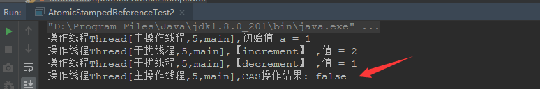
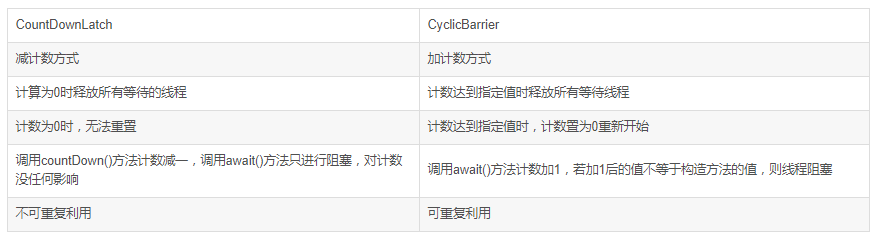

# 并发基础二

* [一、原子变量和CAS](#一原子变量和CAS)
  * [1、AtomicXXX]
  * [2、CAS实现MyReentrantLock]
* [二、显式锁ReentrantLock](#二显式锁ReentrantLock)
  * [1、介绍和简单使用]
  * [2、tryLock防止死锁]
  * [3、lockInterruptibly]
  * [4、ReentrantLock对比synchronized]

## 一、原子变量和CAS

### 1、AtomicXXX

上面给`m()`方法加上了`synchronized`虽然解决了原子性问题，但是性能不好。

JDK提供了一些现成的类，里面的方法都是原子性操作的。这样我们就不需要加`synchronized`，这样性能更好。

```java
/**
 * 解决同样上一个程序问题的更高效的方法，使用AtomXXX类
 * AtomXXX类本身方法都是原子性的，但不能保证多个方法连续调用是原子性的
 */
public class T {
    /*volatile*/ //int count = 0;

    AtomicInteger count = new AtomicInteger(0);

    /*synchronized*/ void m() {
        for (int i = 0; i < 10000; i++)
            //if count.get() < 1000  // 两个Atom类的方法之间还是不具备原子性
            count.incrementAndGet(); //等同于count++, 但是这个是原子性的
    }

    public static void main(String[] args) {
        T t = new T();

        List<Thread> threads = new ArrayList<>();

        for (int i = 0; i < 10; i++) {
            threads.add(new Thread(() -> t.m(), "thread-" + i));
        }

        threads.forEach((o) -> o.start());
        threads.forEach((o) -> {
            try {
                o.join();
            } catch (InterruptedException e) {
                e.printStackTrace();
            }
        });

        System.out.println(t.count);
    }
}
```

AtomicXXX里面的方法依赖于`compareAndSet()`方法：

```java
public final boolean compareAndSet(int expect, int update)
```

这是一个非常重要的方法，比较并设置，我们以后将简称为CAS。该方法以原子方式实现了如下功能：**如果当前值等于expect，则更新为update，否则不更新，如果更新成功，返回true，否则返回false**。

注意，它的声明带有volatile，这是必需的，以保证内存可见性。

它的大部分更新方法实现都类似，我们看一个方法incrementAndGet，其代码为：

```java
public final int incrementAndGet() {
    for (;;) {
        int current = get();
        int next = current + 1;
        if (compareAndSet(current, next))
            return next;
    }
}
```

代码主体是个死循环，先获取当前值current，计算期望的值next，然后调用CAS方法进行更新，如果当前值没有变，则更新并返回新值，否则继续循环直到更新成功为止。

synchronized是悲观的，它假定更新很可能冲突，所以先获取锁，得到锁后才更新。原子变量的更新逻辑是乐观的，它假定冲突比较少，但使用CAS更新，也就是进行冲突检测，如果确实冲突了，那也没关系，继续尝试就好了。

synchronized代表一种阻塞式算法，得不到锁的时候，进入锁等待队列，等待其他线程唤醒，有上下文切换开销。**原子变量的更新逻辑是非阻塞式的，更新冲突的时候，它就重试，不会阻塞，不会有上下文切换开销**。

对于大部分比较简单的操作，无论是在低并发还是高并发情况下，这种乐观非阻塞方式的性能都要远高于悲观阻塞式方式。

### 2、CAS实现MyReentrantLock

基于CAS，除了可以实现乐观非阻塞算法，它也可以用来实现悲观阻塞式算法。

使用CAS自己实现一个简易版的`ReentrantLock`:

```java
public class R implements Runnable {

    static class MyLock {
        private AtomicInteger status = new AtomicInteger(0);

        public void lock() {
            // 功能：如果当前值等于expect，则更新为update，否则不更新，如果更新成功，返回true，否则返回false。
            while (!status.compareAndSet(0, 1)) {
                Thread.yield();
            }
        }

        public void unlock() {
            status.compareAndSet(1, 0);
        }
    }

    private int count = 0;
    private MyLock lock = new MyLock();

    @Override
    public void run() {
        lock.lock();
        count++;
        lock.unlock();
    }

    public static void main(String[] args) {
        R r = new R();
        ArrayList<Thread> threads = new ArrayList<>();
        for (int i = 0; i < 100000; i++) {
            threads.add(new Thread(r, "THREAD" + i));
        }
        threads.forEach((t) -> t.start());

        threads.forEach(t -> {
            try {
                t.join();
            } catch (InterruptedException e) {
                e.printStackTrace();
            }
        });
        System.out.println(r.count);
    }
}
```

这种阻塞方式过于消耗CPU，后面优化。

### 3、CAS的ABA问题

问题演示:

线程1准备用CAS将变量的值由A替换为B。

在此之前，线程2将变量的值由A替换为C，又由C替换为A，然后线程1执行CAS时发现变量的值仍然为A，所以CAS成功。

但实际上这时的现场已经和最初不同了，尽管CAS成功，但可能存在潜藏的问题。

```java
/**
 * 线程1准备用CAS修改变量值A，
 * 在此之前，线程2将变量的值由A替换为B，又由B替换为A，
 * 然后线程1执行CAS时发现变量的值仍然为A，所以CAS成功。但实际上这时的现场已经和最初不同了
 */
public class AtomicStampedReferenceTest {

    public static AtomicInteger a = new AtomicInteger(1);

    public static void main(String[] args) {

        new Thread(() -> {
            System.out.println("操作线程" + Thread.currentThread() + ",初始值 = " + a);  // 定义变量 a = 1
            try {
                Thread.sleep(1000);  //等待1秒 ，以便让干扰线程执行
            } catch (InterruptedException e) {
                e.printStackTrace();
            }
            boolean isCASSuccess = a.compareAndSet(1, 2); // CAS操作
            System.out.println("操作线程" + Thread.currentThread() + ",CAS操作结果: " + isCASSuccess);
        }, "主操作线程").start();

        new Thread(() -> {
            a.incrementAndGet(); // a 加 1, a + 1 = 1 + 1 = 2
            System.out.println("操作线程" + Thread.currentThread() + ",【increment】 ,值 = " + a);
            a.decrementAndGet(); // a 减 1, a - 1 = 2 - 1 = 1
            System.out.println("操作线程" + Thread.currentThread() + ",【decrement】 ,值 = " + a);
        }, "干扰线程").start();

    }
}

```


解决: 使用`AtomicStampedReference`(使用一个stamp时间戳)

AtomicStampedReference主要维护包含一个对象引用以及一个可以自动更新的整数"stamp"的pair对象来解决ABA问题。

```java
public class AtomicStampedReferenceTest2 {

    private static AtomicStampedReference<Integer> atomicStampedRef =
            new AtomicStampedReference<>(1, 0);

    public static void main(String[] args) {

        new Thread(() -> {
            System.out.println("操作线程" + Thread.currentThread() + ",初始值 a = " + atomicStampedRef.getReference());
            int stamp = atomicStampedRef.getStamp(); //获取当前标识别

            try {
                Thread.sleep(1000); //等待1秒 ，以便让干扰线程执行
            } catch (InterruptedException e) {
                e.printStackTrace();
            }

            //此时expectedReference未发生改变，但是stamp已经被修改了,所以CAS失败
            boolean isCASSuccess = atomicStampedRef.compareAndSet(1, 2, stamp, stamp + 1);
            System.out.println("操作线程" + Thread.currentThread() + ",CAS操作结果: " + isCASSuccess);
        }, "主操作线程").start();

        //更新的时候带上时间戳的更新
        new Thread(() -> {
            atomicStampedRef.compareAndSet(1, 2, atomicStampedRef.getStamp(), atomicStampedRef.getStamp() + 1);
            System.out.println("操作线程" + Thread.currentThread() + ",【increment】 ,值 = " + atomicStampedRef.getReference());
            atomicStampedRef.compareAndSet(2, 1, atomicStampedRef.getStamp(), atomicStampedRef.getStamp() + 1);
            System.out.println("操作线程" + Thread.currentThread() + ",【decrement】 ,值 = " + atomicStampedRef.getReference());
        }, "干扰线程").start();

    }
}

```



## 二、显式锁ReentrantLock

### 1、介绍和简单使用

基本使用和上面那个MyLock差不多:

```java
public class R implements Runnable {

    private int count = 0;
    private ReentrantLock lock = new ReentrantLock();

    @Override
    public void run() {
        lock.lock();
        count++;
        lock.unlock(); //不过这个一般放在finally里面
    }

    public static void main(String[] args) {
        R r = new R();
        ArrayList<Thread> threads = new ArrayList<>();
        for (int i = 0; i < 100000; i++) {
            threads.add(new Thread(r, "THREAD" + i));
        }
        threads.forEach((t) -> t.start());

        threads.forEach(t -> {
            try {
                t.join();
            } catch (InterruptedException e) {
                e.printStackTrace();
            }
        });
        System.out.println(r.count);
    }
}
```

防止死锁:

### 2、tryLock防止死锁

死锁案例:

```java
/**
 * 死锁
 */
public class DeadLockDemo {

    private static ReentrantLock lockA = new ReentrantLock();
    private static ReentrantLock lockB = new ReentrantLock();

    private static void startThreadA() {
        Thread aThread = new Thread(() -> {
            lockA.lock();
            try {
                Thread.sleep(1000);
                System.out.println("A1");
                try {
                    lockB.lock();
                    System.out.println("B1");
                } finally {
                    lockB.unlock();
                }
            } catch (InterruptedException e) {
            } finally {
                lockA.unlock();
            }
        });
        aThread.start();
    }

    private static void startThreadB() {
        Thread bThread = new Thread(() -> {
            lockB.lock();
            try {
                Thread.sleep(1000);
                System.out.println("A2");
                try {
                    lockA.lock();
                    System.out.println("B2");
                } finally {
                    lockA.unlock();
                }
            } catch (InterruptedException e) {
            } finally {
                lockB.unlock();
            }
        });
        bThread.start();
    }

    public static void main(String[] args) {
        startThreadA();
        startThreadB();
    }
}
```

使用tryLock()，可以避免死锁。**在持有一个锁，获取另一个锁，获取不到的时候，可以释放已持有的锁**，给其他线程机会获取锁，然后再重试获取所有锁。

```java
public class DeadLockDemo {

    private static ReentrantLock lockA = new ReentrantLock();
    private static ReentrantLock lockB = new ReentrantLock();

    private static void startThreadA() {
        Thread aThread = new Thread(() -> {
            if(lockA.tryLock()) {
                try {
                    Thread.sleep(1000);
                    System.out.println("A1");
                    if (lockB.tryLock()) {
                        try {
                            System.out.println("B1");
                        } finally {
                            lockB.unlock();
                        }
                    }
                } catch (InterruptedException e) {
                } finally {
                    lockA.unlock();
                }
            }
        });
        aThread.start();
    }

    private static void startThreadB() {
        Thread bThread = new Thread(() -> {
            if(lockB.tryLock()) {
                try {
                    Thread.sleep(1000);
                    System.out.println("A2");
                    if (lockA.tryLock()) {
                        try {
                            System.out.println("B2");
                        } finally {
                            lockA.unlock();
                        }
                    }
                } catch (InterruptedException e) {
                } finally {
                    lockB.unlock();
                }
            }
        });
        bThread.start();
    }

    public static void main(String[] args) {
        startThreadA();
        startThreadB();
    }
}
```

### 3、lockInterruptibly

还可以使用`lockInterruptibly`来中断死锁。

使用`lockInterruptibly()`获得锁，如果发生死锁，调用线程interrupt来消除死锁。

`ReentrantLock.lockInterruptibly`允许在等待时由其它线程调用等待线程的`Thread.interrupt`方法来中断等待线程的等待而直接返回，这时不用获取锁，而会抛出一个InterruptedException。而ReentrantLock.lock方法不允许`Thread.interrupt`中断,即使检测到`Thread.isInterrupted`,一样会继续尝试获取锁，失败则继续休眠。

```java
/**
 * 使用ReentrantLock还可以调用lockInterruptibly方法，可以对线程interrupt方法做出响应，
 * 在一个线程等待锁的过程中，可以被打断
 */
public class TestReentrantLock4 {

    public static void main(String[] args){
        ReentrantLock lock = new ReentrantLock();

        Thread t1 = new Thread(()->{
            try {
                lock.lock();
                System.out.println("t1 start");
                TimeUnit.SECONDS.sleep(Integer.MAX_VALUE); // 一直占有这把锁
                System.out.println("t1 end");
            } catch (InterruptedException e) {
                System.out.println("interrupted!");
            } finally {
                lock.unlock();
            }
        });
        t1.start();

        Thread t2 = new Thread(()->{

            try {
                lock.lockInterruptibly(); //  可以对interrupt()方法做出响应
                System.out.println("t2 start");
                TimeUnit.SECONDS.sleep(5);
                System.out.println("t2 end");
            } catch (InterruptedException e) {
                System.out.println("interrupted!");
                System.out.println(Thread.currentThread().isInterrupted());
            } finally {
//                lock.unlock();  //这里会抛异常，因为我没有获取到锁，肯定不能unlock
            }
        });
        t2.start();

        try {
            TimeUnit.SECONDS.sleep(1);
        } catch (InterruptedException e) {
            e.printStackTrace();
        }
        t2.interrupt(); //打断线程2的等待, 就是告诉t2，你别等了，t1要这么久，再怎么等也没用
    }
}
```

实际应用中，检查死锁可以单独开启一个daemon线程，每间隔一段时间检查一下是否发生死锁，如果有则预警、记录日志、或中断该线程避免死锁。

```java
public class DeadLockDemo {

    private static ReentrantLock lockA = new ReentrantLock();
    private static ReentrantLock lockB = new ReentrantLock();

    private static void startThreadA() {
        Thread aThread = new Thread(() -> {
            try {
                lockA.lockInterruptibly();
                Thread.sleep(1000);
                System.out.println("A1");
                try {
                    lockB.lockInterruptibly();
                    System.out.println("B1");
                } catch (InterruptedException e) {
                    e.printStackTrace();
                } finally {
                    lockB.unlock();
                }
            } catch (InterruptedException e1) {
                e1.printStackTrace();
            } finally {
                lockA.unlock();
            }
        }, "Thread-X");
        aThread.start();
    }

    private static void startThreadB() {
        Thread bThread = new Thread(() -> {
            try {
                lockB.lockInterruptibly();
                Thread.sleep(1000);
                System.out.println("A2");
                try {
                    lockA.lockInterruptibly();
                    System.out.println("B2");
                } catch (InterruptedException e) {
                    e.printStackTrace();
                } finally {
                    lockA.unlock();
                }
            } catch (InterruptedException e1) {
                e1.printStackTrace();
            } finally {
                lockB.unlock();
            }
        }, "Thread-Y");
        bThread.start();
    }

    public static void main(String[] args) throws InterruptedException {
        startThreadA();
        startThreadB();

        TimeUnit.SECONDS.sleep(3);

        checkDeadLock();
    }

    //基于JMX获取线程信息
    public static void checkDeadLock() {
        //获取Thread的MBean
        ThreadMXBean mbean = ManagementFactory.getThreadMXBean();
        //查找发生死锁的线程，返回线程id的数组
        long[] deadLockThreadIds = mbean.findDeadlockedThreads();
        System.out.println("---" + Arrays.toString(deadLockThreadIds));

        if (deadLockThreadIds != null) {
            //获取发生死锁的线程信息
            ThreadInfo[] deadThreadInfos = mbean.getThreadInfo(deadLockThreadIds);
            //获取JVM中所有的线程信息
            Map<Thread, StackTraceElement[]> allThreadMap = Thread.getAllStackTraces();
            for (Map.Entry<Thread, StackTraceElement[]> entry : allThreadMap.entrySet()) {

                for (int i = 0; i < deadThreadInfos.length; i++) {
                    Thread t = entry.getKey();

                    if (t.getId() == deadThreadInfos[i].getThreadId()) { // 死锁线程

                        System.out.println("Interrupt Thread Name = " + t.getName());

                        t.interrupt(); //中断发生死锁的线程 -> lock.lockInterruptibly 可以相应中断

                        //打印堆栈信息
                        // for (StackTraceElement ste : entry.getValue()) {
                        // // System.err.println("t" + ste.toString().trim());
                        // }
                    }

                }
            }
        }
    }

}
```

### 4、ReentrantLock实现公平锁

```java
public class FairLock {

    static ReentrantLock lock = new ReentrantLock(true); // 公平锁

    public static void main(String[] args) {
        for (int i = 1; i <= 5; i++)
            new Thread(new T(i)).start();
    }

    static class T implements Runnable {

        Integer id;

        public T(Integer id) {
            this.id = id;
        }

        @Override

        public void run() {
            try {
                TimeUnit.MILLISECONDS.sleep(10);
            } catch (InterruptedException e) {
                e.printStackTrace();
            }
            // 每个线程获取两次锁,但是 一般不会是同一个线程连续获得，而是会按照等待时间
            for (int i = 0; i < 2; i++) {
                lock.lock();
                System.out.println("获得锁的线程：" + id);
                lock.unlock();
            }
        }
    }
}
```
输出：(可以看到大概是轮训公平的)


### 5、显式条件Condition

```java
public class ProducerConsumerTest {

    static class MyBlockingQueue<E> {
        private Queue<E> queue;
        private int limit;
        private ReentrantLock lock = new ReentrantLock();
        private Condition notFull  = lock.newCondition();
        private Condition notEmpty = lock.newCondition();


        public MyBlockingQueue(int limit) {
            this.limit = limit;
            queue = new ArrayDeque<>(limit);
        }

        public void put(E e) throws InterruptedException {
            lock.lockInterruptibly();
            try{
                while (queue.size() == limit) {
                    notFull.await();
                }
                queue.add(e);
                notEmpty.signal();
            }finally{
                lock.unlock();
            }
        }

        public E take() throws InterruptedException {
            lock.lockInterruptibly();
            try{
                while (queue.isEmpty()) {
                    notEmpty.await();
                }
                E e = queue.poll();
                notFull.signal();
                return e;
            }finally{
                lock.unlock();
            }
        }
    }

    static class Producer extends Thread {
        MyBlockingQueue<String> queue;
        public Producer(MyBlockingQueue<String> queue) {
            this.queue = queue;
        }
        @Override
        public void run() {
            int num = 0;
            try {
                while (true) {
                    String task = String.valueOf(num);
                    queue.put(task);
                    System.out.println("P " + task);
                    num++;
                    Thread.sleep((int) (Math.random() * 100));
                }
            } catch (InterruptedException e) {
            }
        }
    }

    static class Consumer extends Thread {
        MyBlockingQueue<String> queue;
        public Consumer(MyBlockingQueue<String> queue) {
            this.queue = queue;
        }
        @Override
        public void run() {
            try {
                while (true) {
                    String task = queue.take();
                    System.out.println("C " + task);
                    Thread.sleep((int)(Math.random()*100));
                }
            } catch (InterruptedException e) {
            }
        }
    }

    public static void main(String[] args) {
        MyBlockingQueue<String> queue = new MyBlockingQueue<>(10);
        new Producer(queue).start();
        new Consumer(queue).start();
    }

}
```

一般而言，与Object的wait方法一样，调用await方法前需要先获取锁，如果没有锁，会抛出异常IllegalMonitorStateException。await在进入等待队列后，会释放锁，释放CPU，当其他线程将它唤醒后，或等待超时后，或发生中断异常后，它都需要重新获取锁，获取锁后，才会从await方法中退出。

另外，与Object的wait方法一样，await返回后，不代表其等待的条件就一定满足了，通常要将await的调用放到一个循环内，只有条件满足后才退出。

一般而言，signal/signalAll与notify/notifyAll一样，调用它们需要先获取锁，如果没有锁，会抛出异常IllegalMonitorStateException。signal与notify一样，挑选一个线程进行唤醒，signalAll与notifyAll一样，唤醒所有等待的线程，但这些线程被唤醒后都需要重新竞争锁，获取锁后才会从await调用中返回。

记住: 不用混用， **显式条件与显式锁配合，wait/notify与synchronized配合**。

### 6、ReentrantLock对比synchronized

Lock具有synchronized不具备的特性:


此外， Lock可以实现公平锁。

## 三、并发容器

### 1、非阻塞队列ConcurrentLinkedQueue和ConcurrentLinkedDeque

引出并发容器。案例: 模拟售票。

```java
/**
 * 有N张火车票，每张票都有一个编号，同时有10个窗口对外售票，请写一个模拟程序
 *
 * 分析下面的程序可能会产生哪些问题？
 * 重复销售？超量销售？
 * 有时候会造成 ArrayIndexOutOfBoundsException
 */
public class TicketSeller {

    static List<String> tickets = new ArrayList<>();
    static {
        for(int i = 1; i <= 100; i++)  tickets.add("票编号: " + i);
    }

    public static void main(String[] args){
        for(int i = 0; i < 10; i++){
            new Thread(() -> {
                while(tickets.size() > 0){
                    System.out.println(Thread.currentThread().getName() + " 销售了 -- " + tickets.remove(0));
                }
            }).start();
        }
    }
}
```

可能会多个线程消费同一张，或者出现同时判断`size`导致`IndexOutOfBoundsException`异常。


所以对应的就有一个`Vector`容器，可以防止并发问题。

但是`Vector`还是存在问题，因为虽然单个方法是原子性的，**但是两个操作之间不是原子性的**。

```java
public class TicketSeller {

    static List<String> tickets = new Vector<>();
    static {
        for(int i = 1; i <= 100; i++)  tickets.add("票编号: " + i);
    }

    public static void main(String[] args){
        for(int i = 0; i < 10; i++){
            new Thread(() -> {
                while(tickets.size() > 0){ // 因为这个和下面那个 remove不是原子操作

                    try {   // 如果加了下面这段话，程序就还是会出问题
                        TimeUnit.MILLISECONDS.sleep(10);
                    } catch (InterruptedException e) {
                        e.printStackTrace();
                    }
                    System.out.println(Thread.currentThread().getName() + " 销售了 -- " + tickets.remove(0));
                }
            }).start();
        }
    }
}
```

使用`synchronized`锁定`ticket.size()`和`tickets.remove`:

```java
 new Thread(() -> {
     while(true){
         synchronized (tickets){ // 加锁
             if(tickets.size() <= 0)break;
             // 即使这里要操作一段时间也不会有问题
             try {
                 TimeUnit.MILLISECONDS.sleep(10);
             } catch (InterruptedException e) {
                 e.printStackTrace();
             }
             System.out.println("销售了 -- " + tickets.remove(0));
         }
     }
 }).start();
```

除此之外，也可能出现ConcurrentModifycationException: (https://www.cnblogs.com/dolphin0520/p/3933551.html)

```java
/**
 * 可能会抛出ConcurrentModificationException异常的案例，尽量使用for循环
 * 使用foreach和iterator可能会抛出这个异常，在并发的环境下抛出异常的概率会更大
 */
public class VectorDemo {

    // java.util.ConcurrentModificationException
    static void test1(Vector<Integer> v1) {
        for (Integer i : v1) {
            if (i.equals(3)) {
                v1.remove(i);
            }
        }
    }

    // java.util.ConcurrentModificationException
    static void test2(Vector<Integer> v1) {
        Iterator<Integer> iterator = v1.iterator();
        while (iterator.hasNext()) {
            Integer i = iterator.next();
            if (i.equals(3)) {
                v1.remove(i);
            }
        }
    }

    // success
    static void test3(Vector<Integer> v1) {
        for (int i = 0; i < v1.size(); i++) {
            if (v1.get(i).equals(3)) {
                v1.remove(i);
            }
        }
    }

    public static void main(String[] args) {

        Vector<Integer> vector = new Vector<>();
        for (int i = 0; i < 5; i++) vector.add(i);

//        test1(vector);  // 异常
//        test2(vector); // 异常
        test3(vector);
    }
}

```

更好的方法是使用JDK提供的并发容器 `ConcurrentLinkedQueue`:

```java
public class TicketSeller {

    static Queue<String> tickets = new ConcurrentLinkedQueue<>();

    static {
        for(int i = 1; i <= 100; i++)  tickets.add("票编号: " + i);
    }

    public static void main(String[] args){
        for(int i = 0; i < 10; i++){
            new Thread(() ->{
                while(true){
                    String poll = tickets.poll(); // poll是原子性的
                    // 因为是先取出来了, 后面没有对容器进行操作，假如这里被打断了，大不了我再拿一遍，拿一个空值出来
                    if(poll == null) // 因为
                        break;
                    else
                        System.out.println("销售了 -- " + poll);
                }
            }).start();
        }
    }
}
```

### 2、阻塞BlockingQueue(七种)

普通阻塞队列。

阻塞队列所谓的"阻塞"，指的是**某些情况下(容量满了put阻塞)线程会挂起（即阻塞），一旦条件满足，被挂起的线程又会自动唤醒**。使用BlockingQueue，不需要关心什么时候需要阻塞线程，什么时候需要唤醒线程，这些内容BlockingQueue都已经做好了。

* ArrayBlockingQueue：数组结构组成的有界  阻塞队列。
* LinkedBlockingQueue：链表结构组成的有界  阻塞队列。
* LinkedBlockingDeque：链表结构组成的双向有界  阻塞队列。
* PriorityBlockingQueue：支持优先级排序的**无界**  阻塞队列。
* DelayQueue：使用优先级队列实现的**无界**  阻塞队列。
* SynchronousQueue：**不存储元素**的无界  阻塞队列。
* LinkedTransferQueue：链表结构组成的无界  阻塞队列。

**ArrayBlockingQueue/LinkedBlockingQueue/LinkedBlockingDeque**

```java
public class ProducerConsumerTest {

    public static void main(String[] args) {
        final BlockingQueue<String> queue = new LinkedBlockingQueue<>(10);
        new Thread(() -> {
            int num = 0;
            try {
                while (true) {
                    String task = String.valueOf(num);
                    queue.put(task);
                    System.out.println("P " + task);
                    num++;
                    Thread.sleep((int) (Math.random() * 100));
                }
            } catch (InterruptedException e) {
            }
        } , "Producer").start();

        new Thread(() -> {
            try {
                while (true) {
                    String task = queue.take();
                    System.out.println("C " + task);
                    Thread.sleep((int) (Math.random() * 100));
                }
            } catch (InterruptedException e) {
            }
        }, "Consumer").start();
    }
}
```

**DelayQueue**

使用`DelayQueue`默认线程运行时间短的先执行:

```java
public class DelayQueueTest {

    static BlockingQueue<MyTask> tasks = new DelayQueue<>();

    // 需要实现Delayed
    static class MyTask implements Delayed {
        long runningTime;
        String name;

        MyTask(long rt, String name) {
            this.runningTime = rt;
            this.name = name;
        }

        // 按照运行时间短的，先运行
        @Override
        public int compareTo(Delayed o) {
            return (int) (getDelay(TimeUnit.MILLISECONDS) - o.getDelay(TimeUnit.MILLISECONDS));
        }

        @Override
        public long getDelay(TimeUnit timeUnit) {
            return timeUnit.convert(runningTime - System.currentTimeMillis(), TimeUnit.MILLISECONDS);
        }

        @Override
        public String toString() {
            return name;
        }
    }

    public static void main(String[] args) throws InterruptedException {
        long curTime = System.currentTimeMillis();
        MyTask t1 = new MyTask(curTime + 1000, "t1");
        MyTask t2 = new MyTask(curTime + 2000, "t2");
        MyTask t3 = new MyTask(curTime + 1500, "t3");
        MyTask t4 = new MyTask(curTime + 2500, "t4");
        MyTask t5 = new MyTask(curTime + 500, "t5"); // 时间最短的，先运行
        // 按照 5 1 3 2 4的顺序执行

        tasks.put(t1);
        tasks.put(t2);
        tasks.put(t3);
        tasks.put(t4);
        tasks.put(t5);

        System.out.println(tasks);

        for (int i = 0; i < 5; i++)  System.out.println(tasks.take());

    }
}
```

输出:

```java
[t5, t1, t3, t4, t2]
t5
t1
t3
t2
t4
```

**SynchronousQueue**

一种阻塞队列，其中每个 put 必须等待一个 take，反之亦然。同步队列没有任何内部容量，甚至连一个队列的容量都没有。这个是一个容量为0的queue，意思就是有东西(生产者一生产就要消费掉)，你马上就要消费掉。

看下面代码输出就懂了:

```java
public class SynchronousQueueTest {

    public static void main(String[] args) {
        final BlockingQueue<String> queue = new SynchronousQueue<>();
        new Thread(() -> {
            int num = 0;
            try {
                while (true) {
                    String task = String.valueOf(num);
                    queue.put(task);
                    System.out.println("P " + task);
                    num++;
                    Thread.sleep((int) (Math.random() * 100));
                }
            } catch (InterruptedException e) {
            }
        } , "Producer").start();

        new Thread(() -> {
            try {
                while (true) {
                    String task = queue.take();
                    System.out.println("C " + task);
                    Thread.sleep((int) (Math.random() * 100));
                }
            } catch (InterruptedException e) {
            }
        }, "Consumer").start();
    }
}
```


**LinkedTransferQueue** （容量不为0）

https://www.jianshu.com/p/ae6977886cec

这个就是，如果先有消费者，我就不放在队列了，直接给消费者了，但是如果没有消费者的话就会阻塞

`LinkedTransferQueue`是 `SynchronousQueue` 和 `LinkedBlockingQueue` 的合体，性能比 `LinkedBlockingQueue` 更高（没有锁操作），比 `SynchronousQueue`能存储更多的元素。

当 `put` 时，如果有等待的线程，就直接将元素 “交给” 等待者， 否则直接进入队列。

`put`和 `transfer` 方法的区别是，put 是立即返回的， transfer 是阻塞等待消费者拿到数据才返回。`transfer`方法和 `SynchronousQueue`的 put 方法类似。tryTransfer和transfer可以检测是否有线程在等待获取数据，如果检测到就立即发送新增的数据给这个线程获取而不用放入队列。

### 3、阻塞队列和非阻塞队列对比

适用阻塞队列的好处：多线程操作共同的队列时不需要额外的同步，另外就是队列会自动平衡负载，即那边（生产与消费两边）处理快了就会被阻塞掉，从而减少两边的处理速度差距。

当许多线程共享访问一个公共 collection 时，ConcurrentLinkedQueue 是一个恰当的选择。


LinkedBlockingQueue 多用于任务队列

ConcurrentLinkedQueue  多用于消息队列


单消费者，用 LinkedBlockingqueue

多消费者 ，用 ConcurrentLinkedQueue

### 4、CopyOnWriteArrayList和CopyOnWriteArraySet

参考: https://www.jianshu.com/p/ce7f203731af

CopyOnWriteArrayList与普通List区别:

- 它是线程安全的，可以被多个线程并发访问
- 它的迭代器不支持修改操作，但也不会抛出ConcurrentModificationException
- 它以原子方式支持一些复合操作

基本原理：

CopyOnWriteArrayList的内部也是一个数组，但这个数组是**以原子方式被整体**更新的。每次修改操作，都会新建一个数组，**复制原数组的内容到新数组**，在新数组上进行需要的修改，然后以原子方式设置内部的数组引用，这就是写时拷贝。

所有的读操作，都是先拿到当前引用的数组，然后直接访问该数组，在读的过程中，可能内部的数组引用已经被修改了，但不会影响读操作，**它依旧访问原数组内容**。

关于`CopyOnWriteList`不会出现ConcurrentModificationException

```java
public class Test {
    public static void main(String[] args) {
//        final List<String> list = Collections.synchronizedList(new ArrayList<>()); // ConcurrentModificationException
        final List<String> list = new CopyOnWriteArrayList<>(); // 读的是原数组

        // 迭代, 修改
        new Thread(() -> {
            while (true) {
                for (String str : list) {
                    System.out.println(str);
                }
            }

        }, "iteratorThread").start();

        new Thread(() -> {
            for (int i = 0; i < 100; i++) {
                list.add("item " + i);
                try {
                    Thread.sleep((int) (Math.random() * 10));
                } catch (InterruptedException e) {
                }
            }
        }, "modifyThread").start();
    }
}

```

缺点

* 内存占用: 如果CopyOnWriteArrayList经常要增删改里面的数据，经常要执行add()、set()、remove()的话，那是比较耗费内存的。增删改操作都要**复制一个数组**出来。

* 不能保证数据实时一致性: 读的是原数组，数据一致性只能保证数据的最终一致性，不能保证数据的实时一致性。比如线程A在迭代CopyOnWriteArrayList容器的数据。线程B在线程A迭代的间隙中将CopyOnWriteArrayList部分的数据修改了(已经调用`setArray()`了)。但是线程A迭代出来的是原有的数据。

### 5、ConcurrentHashMap

HashMap不支持并发，ConcurrentHashMap比HashTable更加高效。

* 链表结构可能形成环，出现死循环，占满CPU(https://coolshell.cn/articles/9606.html)

```java
public class ConcurrentHashMapTest {

    public static void main(String[] args) throws InterruptedException {
        Map<Integer, Integer> map = new HashMap<>(); // 可能出现死循环
//        Map<Integer, Integer> map = new ConcurrentHashMap<>();

        Random rnd = new Random();
        Thread[] ths = new Thread[100];
        CountDownLatch latch = new CountDownLatch(ths.length);

        for (int i = 0; i < ths.length; i++) {
            ths[i] = new Thread(() -> {
                for (int j = 0; j < 10000; j++)
                    map.put(rnd.nextInt(1000), rnd.nextInt(1000));
                latch.countDown();
            });
        }

        Arrays.asList(ths).forEach(t -> t.start());
        latch.await(); //等待100个线程结束
    }
}
```

### 6、ConcurrentSkipListMap和ConcurrentSkipListSet

ConcurrentSkipListMap有如下特点：

- **没有使用锁，所有操作都是无阻塞的，所有操作都可以并行，包括写，多个线程可以同时写**。
- 与ConcurrentHashMap类似，迭代器不会抛出ConcurrentModificationException，是弱一致的，迭代可能反映最新修改也可能不反映，一些方法如putAll, clear不是原子的。
- 与ConcurrentHashMap类似，同样实现了ConcurrentMap接口，直接支持一些原子复合操作。
- 与TreeMap一样，可排序，默认按键自然有序，可以传递比较器自定义排序，实现了SortedMap和NavigableMap接口。

实现原理: 跳表， https://blog.csdn.net/sunxianghuang/article/details/52221913 

## 四、并发工具类

### 1、CountDownLatch

它的大概含义是指，它相当于是一个门栓，一开始是关闭的，所有希望通过该门的线程都需要等待，然后开始倒计时，倒计时变为0后，门栓打开，等待的所有线程都可以通过，它是一次性的，打开后就不能再关上了。

CountDownLatch和join有点类似，但是有种场景join无法完成。

```java
/**
 * join无法完成的
 * 场景：流水线上有3个worker: worker1、worker2、worker3 (每个worker都有两个阶段)
 * 只有当worker1和worker2两者的  阶段1  都执行完后才可以执行worker3
 */
public class T extends Thread {

    private String name;
    private CountDownLatch countDownLatch;

    public T(String name, CountDownLatch countDownLatch) {
        this.name = name;
        this.countDownLatch = countDownLatch;
    }

    @Override
    public void run() {
        try {
            System.out.println(name + "开始阶段1工作");
            long time = (long) (Math.random() * 10000);
            Thread.sleep(time);
            System.out.println(name + "阶段1完成, 耗时：" + time);
            countDownLatch.countDown();

            System.out.println(name + "开始阶段2工作");
            Thread.sleep(time);
            System.out.println(name + "阶段2完成, 耗时：" + time);

        } catch (InterruptedException e) {
            e.printStackTrace();
        }
    }

    public static void main(String[] args) throws InterruptedException {
        int COUNT = 2;
        final CountDownLatch countDownLatch = new CountDownLatch(COUNT);
        T worker1 = new T("t-1", countDownLatch);
        T worker2 = new T("t-2", countDownLatch);

        worker1.start();
        worker2.start();

        countDownLatch.await();

        System.out.println("----准备工作就绪(t1和t2的阶段1都完成)------");

        T worker3 = new T("t-3", countDownLatch);
        worker3.start();

        Thread.sleep(10000);
    }
}

```

输出:


### 2、CyclicBarrier

可参考:

https://www.cnblogs.com/twoheads/p/9555867.html

https://blog.csdn.net/zzg1229059735/article/details/61191679

CyclicBarrier提供2个构造器：

```java
public CyclicBarrier(int parties, Runnable barrierAction) {
}
public CyclicBarrier(int parties) {
}
```

* 参数parties指让多少个线程或者任务等待至barrier状态；

* 参数barrierAction为当这些线程都达到barrier状态时会执行的内容；

CyclicBarrier中最重要的方法就是await方法:

```java
public int await() throws InterruptedException, BrokenBarrierException { };//挂起当前线程，直至所有线程都到达barrier状态再同时执行后续任务；
public int await(long timeout, TimeUnit unit)throws InterruptedException,BrokenBarrierException,TimeoutException { };//让这些线程等待至一定的时间，如果还有线程没有到达barrier状态就直接让到达barrier的线程执行后续任务
```

**对比CountDownLatch和CyclicBarrier不同**:

* `CountDownLatch`一般用于某个线程A等待若干个其他线程执行完任务之后，它才执行；
* `CyclicBarrier`一般用于一组线程互相等待至某个状态，然后这一组线程再同时执行；



CountDownLatch和CyclicBarrier有一个很大的不同，就是:

**线程在countDown()之后，会继续执行自己的任务，而CyclicBarrier会在所有线程任务结束之后，才会进行后续任务**

看下面的对比:

```java
public class CountDownLatchTest {
    public static void main(String[] args) throws InterruptedException {
        CountDownLatch countDownLatch = new CountDownLatch(5);

        for (int i = 0; i < 5; i++)
            new Thread(new R(i, countDownLatch)).start();

        countDownLatch.await();
        System.out.println("-------线程组执行结束-------");
    }

    static class R implements Runnable {

        private int id;
        private CountDownLatch latch;

        public R(int id, CountDownLatch latch) {
            this.id = id;
            this.latch = latch;
        }

        @Override
        public void run() {
            System.out.println("id : " + id);
            latch.countDown();
            System.out.println("线程组任务" + id + "结束，其他任务继续");  //这里在等待的时候可以执行
        }
    }
}
```

输出：


```java
public class CyclicBarrierTest {
    public static void main(String[] args) throws InterruptedException {

        //第一个参数相当于CountDownLatch的那个参数，只不过那个是递减，这个是递增去计算
        //第二个参数是 执行完之后执行这个
        CyclicBarrier cyclicBarrier = new CyclicBarrier(5, () -> System.out.println("-------线程组执行结束-------"));

        for (int i = 0; i < 5; i++)
            new Thread(new R(i, cyclicBarrier)).start();

        //CyclicBarrier 可以重复利用，这个是CountDownLatch做不到的
//        for (int i = 6; i < 10; i++)
//            new Thread(new R(i, cyclicBarrier)).start();
    }

    static class R implements Runnable {

        private int id;
        private CyclicBarrier cyc;

        public R(int id, CyclicBarrier cyc) {
            this.id = id;
            this.cyc = cyc;
        }

        @Override
        public void run() {
            try {
                System.out.println("id: " + id );
                cyc.await();
                System.out.println("线程组任务" + id + "结束，其他任务继续");  //这里在等待的时候可以执行
            } catch (Exception e) {
                e.printStackTrace();
            }
        }
    }
}
```

输出：


其他关于CyclicBarrier:

 await指定等待的时间，超过这个时间就继续执行下面的，这里面可能会抛出异常

```java
public class CyclicBarrierTest2 {
    public static void main(String[] args) throws InterruptedException {

        CyclicBarrier cyclicBarrier = new CyclicBarrier(5, () -> System.out.println("-------线程组执行结束-------"));

        for (int i = 0; i < 5; i++) {
            Thread.sleep(1000);
            new Thread(new R(i, cyclicBarrier)).start();
        }
    }

    static class R implements Runnable {

        private int id;
        private CyclicBarrier cyc;

        public R(int id, CyclicBarrier cyc) {
            this.id = id;
            this.cyc = cyc;
        }

        @Override
        public void run() {
            synchronized (this) {
                try {
                    Thread.sleep(1000);
                    System.out.println("id: " + id + " stared...");
                    cyc.await(2000, TimeUnit.MILLISECONDS); // 等待时间
                } catch (Exception e) {
                    e.printStackTrace();
                }
                System.out.println("id: " + id + " continue..."); //捕捉异常后可以继续执行
            }
        }
    }
}
```


### 3、Semaphore(AQS共享锁)

详解: https://juejin.im/post/5d624162e51d453b762584ba

作用就是控制线程并发的数量。控制资源 同时 被访问的个数。

参数permits，这个参数是整数类型，这个参数的意思是同一时间内，**最多允许多少个线程同时执行acquire方法和release方法之间的代码**，如果方法acquire没有参数则默认是一个许可

```java
// 用于控制资源 同时 被访问的个数
public class SemaphoreTest {

    public static void main(String[] args) {
        Semaphore semaphore = new Semaphore(3);
        for (int i = 1; i <= 12; i++)
            new Thread(new R(semaphore, i)).start();
    }

    static class R implements Runnable {

        Semaphore semaphore;
        Integer id;

        public R(Semaphore semaphore, Integer id) {
            this.semaphore = semaphore;
            this.id = id;
        }

        @Override
        public void run() {
            try {
                semaphore.acquire();
                System.out.println("NowTime : " + new SimpleDateFormat("yyyy年MM月dd日 HH时mm分ss秒").format(System.currentTimeMillis()) +
                        "   -----> id : " + id);
                TimeUnit.SECONDS.sleep(1);
                semaphore.release();
            } catch (InterruptedException e) {
                e.printStackTrace();
            }
        }
    }
}

```

输出:

可一看到每一秒执行3个。


### 4、Exchanger

