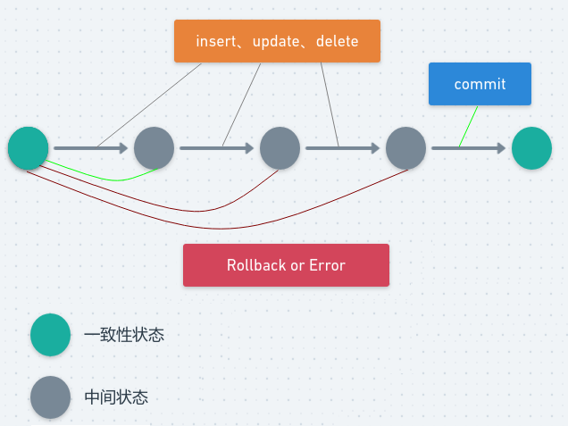
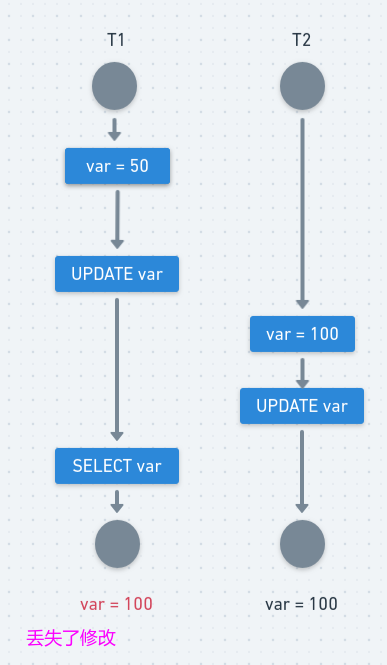
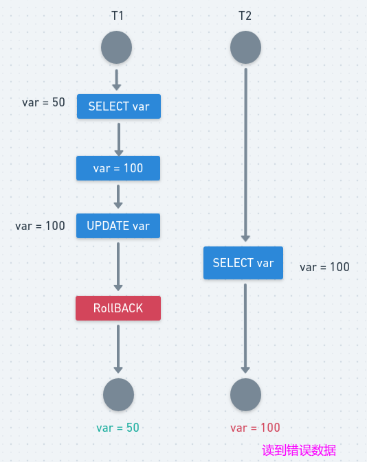
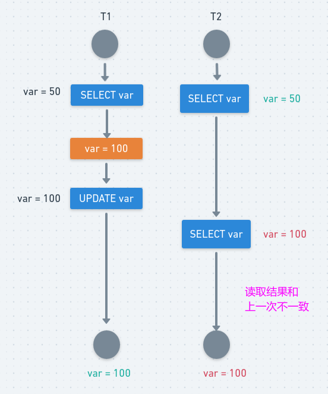
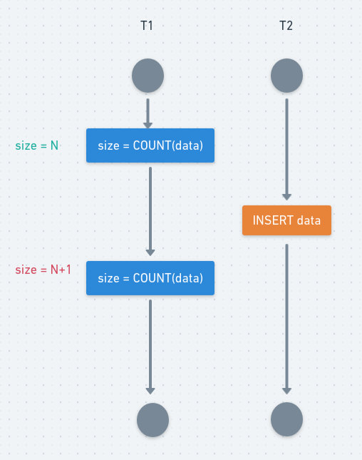

# MYSQL事务和隔离级别

## 一、事务

事务是由一组SQL语句组成的逻辑处理单元，是满足 ACID 特性的一组操作，可以通过 Commit 提交一个事务，也可以使用 Rollback 进行回滚。事务具有以下4个属性，通常简称为事务的ACID属性:

* 原子性（Atomicity）：**事务是一个原子操作单元，其对数据的修改，要么全都执行，要么全都不执行**。比如在同一个事务中的SQL语句，要么全部执行成功，要么全部执行失败。回滚可以用日志来实现，日志记录着事务所执行的修改操作，在回滚时反向执行这些修改操作即可。
* 一致性（Consistent）：**在事务开始和完成时，数据都必须保持一致状态**。这意味着所有相关的数据规则都必须应用于事务的修改，以保持数据的完整性；事务结束时，所有的内部数据结构（如B树索引或双向链表）也都必须是正确的。 以转账为例子，A向B转账，假设转账之前这两个用户的钱加起来总共是2000，那么A向B转账之后，不管这两个账户怎么转，A用户的钱和B用户的钱加起来的总额还是2000，这个就是事务的一致性。
* 隔离性（Isolation）：数据库系统提供一定的隔离机制，保证事务在不受外部并发操作影响的“独立”环境执行。 **隔离性是当多个用户并发访问数据库时，比如操作同一张表时，数据库为每一个用户开启的事务，不能被其他事务的操作所干扰，多个并发事务之间要相互隔离**。即要达到这么一种效果：对于任意两个并发的事务 T1 和 T2，在事务 T1 看来，T2 要么在 T1 开始之前就已经结束，要么在 T1 结束之后才开始，这样每个事务都感觉不到有其他事务在并发地执行。
* 持久性（Durable）：事务完成之后，它对于数据的修改是永久性的，即使出现系统故障也能够保持。 　可以通过数据库备份和恢复来实现，在系统发生奔溃时，使用备份的数据库进行数据恢复。

> MySQL 默认采用**自动提交模式**。也就是说，如果不显式使用 `START TRANSACTION` 语句来开始一个事务，那么每个查询都会被当做一个事务自动提交。

 
 
> 这几个特性不是一种平级关系：
>
> - 只有满足一致性，事务的执行结果才是正确的。
> - 在无并发的情况下，事务串行执行，隔离性一定能够满足。此时要只要能满足原子性，就一定能满足一致性。
> - 在并发的情况下，多个事务并发执行，事务不仅要满足原子性，还需要满足隔离性，才能满足一致性。
> - 事务满足持久化是为了能应对数据库奔溃的情况。

## 二、并发一致性问题

### 1、更新丢失(Lost Update)

**T1 和 T2 两个事务都对一个数据进行修改，T1 先修改，T2 随后修改，T2 的修改覆盖了 T1 的修改**。

例如，两个程序员修改同一java文件。每程序员独立地更改其副本，然后保存更改后的副本，这样就覆盖了原始文档。最后保存其更改副本的编辑人员覆盖前一个程序员所做的更改。

**如果在一个程序员完成并提交事务之前，另一个程序员不能访问同一文件，则可避免此问题**。 

 
### 2、脏读

一句话：事务B读取到了事务A已修改但尚未提交的的数据，还在这个数据基础上做了操作。此时，如果A事务回滚`Rollback`，B读取的数据无效，不符合一致性要求。

解决办法: 把数据库的事务隔离级别调整到 `READ_COMMITTED`

**T1 修改一个数据，T2 随后读取这个数据。如果 T1 撤销了这次修改，那么 T2 读取的数据是脏数据**。

 
### 3、不可重复读(Non-Repeatable Reads)

  在一个事务内，多次读同一个数据。在这个事务还没有结束时，另一个事务也访问该同一数据。那么，在第一个事务的两次读数据之间。由于第二个事务的修改，那么第一个事务读到的数据可能不一样，这样就发生了在一个事务内两次读到的数据是不一样的，因此称为不可重复读，即原始读取不可重复。

 **一句话：一个事务范围内两个相同的查询却返回了不同数据**。

同时操作，事务1分别读取事务2操作时和提交后的数据，读取的记录内容不一致。**不可重复读是指在同一个事务内，两个相同的查询返回了不同的结果**。

解决办法: 如果只有在修改事务完全提交之后才可以读取数据，则可以避免该问题。把数据库的事务隔离级别调整到`REPEATABLE_READ`

**T2 读取一个数据，T1 对该数据做了修改。如果 T2 再次读取这个数据，此时读取的结果和第一次读取的结果不同**。

 
### 4、幻读

一个事务T1按相同的查询条件重新读取以前检索过的数据，却发现其他事务T2插入了满足其查询条件的新数据，这种现象就称为“幻读”。（和可重复读类似，但是事务 T2 的数据操作仅仅是插入和删除，不是修改数据，读取的记录数量前后不一致）

一句话：事务A 读取到了事务B提交的新增数据，不符合隔离性。 

解决办法: 如果在操作事务完成数据处理之前，任何其他事务都不可以添加新数据，则可避免该问题。把数据库的事务隔离级别调整到 `SERIALIZABLE_READ`。

T1 读取某个范围的数据，T2 在这个范围内插入新的数据，T1 再次读取这个范围的数据，此时读取的结果和和第一次读取的结果不同。

  
## 三、事务隔离级别

"脏读"、"不可重复读"和"幻读"，其实都是数据库读一致性问题，**必须由数据库提供一定的事务隔离机制来解决**。

 数据库的事务隔离越严格，并发副作用越小，但付出的代价也就越大，因为事务隔离实质上就是使事务在一定程度上 “串行化”进行，这显然与“并发”是矛盾的。同时，不同的应用对读一致性和事务隔离程度的要求也是不同的，比如许多应用对“不可重复读”和“幻读”并不敏感，可能更关心数据并发访问的能力。 

MYSQL常看当前数据库的事务隔离级别：`show variables like 'tx_isolation';`

### 1、读未提交 (Read Uncommitted)

最低的隔离等级，**允许其他事务看到没有提交的数据**，会导致脏读。

### 2、读已提交 (Read Committed)

**被读取的数据可以被其他事务修改，这样可能导致不可重复读**。**也就是说，事务读取的时候获取读锁，但是在读完之后立即释放(不需要等事务结束)，而写锁则是事务提交之后才释放**，释放读锁之后，就可能被其他事务修改数据。该等级也是 SQL Server 默认的隔离等级。

### 3、可重复读(Repeatable Read)

**所有被 Select 获取的数据都不能被修改，这样就可以避免一个事务前后读取数据不一致的情况**。但是却没有办法控制幻读，因为这个时候其他事务不能更改所选的数据，但是可以增加数据，即前一个事务有读锁但是没有范围锁，为什么叫做可重复读等级呢？那是因为该等级解决了下面的不可重复读问题。(引申：现在主流数据库都使用 MVCC 并发控制，使用之后`RR`（可重复读）隔离级别下是不会出现幻读的现象。)

MYSQL默认是`REPEATABLE-READ `。 

### 4、串行化(Serializable)

所有事务一个接着一个的执行，这样可以避免幻读 (phantom read)，对于基于锁来实现并发控制的数据库来说，串行化要求在执行范围查询的时候，需要获取范围锁，如果不是基于锁实现并发控制的数据库，则检查到有违反串行操作的事务时，需回滚该事务。

### 5、总结

- 读未提交: **一个事务还没提交时，它做的变更就能被别的事务看到**。
- 读提交: 一个事务提交**之后**，它做的变更**才**会被其他事务看到。
- 可重复读 : **一个事务执行过程中看到的数据，总是跟这个事务在启动时看到的数据是一致的**。当然在可重复读隔离级别下，未提交变更对其他事务也是不可见的。
- 串行化: 顾名思义是对于同一行记录，“写”会加“写锁”，“读”会加“读锁”。当出现读写锁冲突的时候，后访问的事务必须等前一个事务执行完成，才能继续执行。

四个级别逐渐增强，每个级别解决一个问题，事务级别越高，性能越差，大多数环境(`Read committed` 就可以用了)

| 隔离级别 | 读数据一致性|脏读 | 不可重复读 | 幻影读 |
| -------- | -------- |---- | ---------- | ------ |
| 未提交读 | 最低级别| √    | √          | √      |
| 提交读   | 语句级 |×    | √          | √      |
| 可重复读 | 事务级 |×    | ×          | √      |
| 可串行化 | 最高级别,事务级|×    | ×          | ×      |