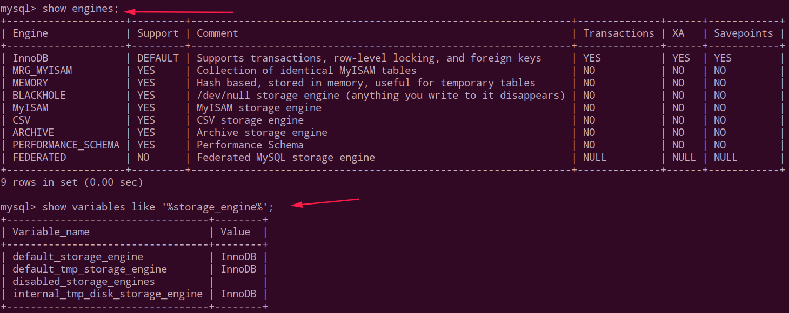

# Mysql存储引擎

查看数据库存储引擎两个命令:

```mysql
show engines;
show variables like '%storage engine%';// 查看默认的存储引擎
```

演示:



关于MyISAM和InnoDB的简单对比:


 问：MyISAM和InnoDB引擎的区别

 - MyISAM 不支持外键，而 InnoDB 支持
 - MyISAM 是非事务安全型的，而 InnoDB 是事务安全型的。
 - **MyISAM 锁的粒度是表级，而 InnoDB 支持行级锁定**。
 - MyISAM 支持全文类型索引，而 InnoDB 不支持全文索引。
 - MyISAM 相对简单，所以在效率上要优于 InnoDB，小型应用可以考虑使用 MyISAM。
 - MyISAM 表是保存成文件的形式，在跨平台的数据转移中使用 MyISAM 存储会省去不少的麻烦。
 - InnoDB 表比 MyISAM 表更安全，可以在保证数据不会丢失的情况下，切换非事务表到事务表（`alter  table tablename type=innodb`）。
 - 锁的区别:
   * InnoDB(默认) ：事务优先 （适合高并发操作；行锁）
   * MyISAM ：性能优先  （表锁）

 应用场景:
 * MyISAM 管理非事务表。它提供高速存储和检索，以及全文搜索能力。如果应用中需要执行大量的 SELECT 查询，那么 MyISAM 是更好的选择。
 * InnoDB 用于事务处理应用程序，具有众多特性，包括 ACID 事务支持。如果应用中需要执行大量的 INSERT 或 UPDATE 操作，则应该使用 InnoDB，这样可以提高多用户并发操作的性能。
