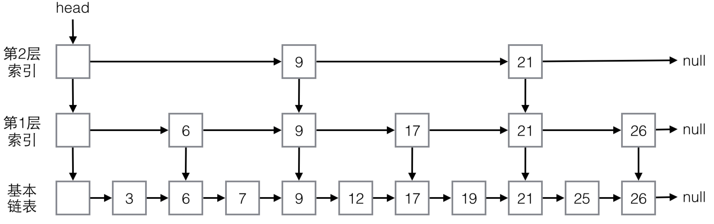

# Redis的跳表数据结构

好文:<https://blog.csdn.net/yellowriver007/article/details/79021103>

ConcurrentSkipListMap有如下特点：

- 没有使用锁，所有操作都是无阻塞的，所有操作都可以并行，包括写，多个线程可以同时写。
- 与ConcurrentHashMap类似，迭代器不会抛出ConcurrentModificationException，是弱一致的，迭代可能反映最新修改也可能不反映，一些方法如putAll, clear不是原子的。
- 与ConcurrentHashMap类似，同样实现了ConcurrentMap接口，直接支持一些原子复合操作。
- 与TreeMap一样，可排序，默认按键自然有序，可以传递比较器自定义排序，实现了SortedMap和NavigableMap接口。

看段简单的使用代码：

```java
public static void main(String[] args) {
    Map<String, String> map = new ConcurrentSkipListMap<>(
            Collections.reverseOrder());
    map.put("a", "abstract");
    map.put("c", "call");
    map.put("b", "basic");
    System.out.println(map.toString());
}
```

程序输出为：

```java
{c=call, b=basic, a=abstract}
```

表示是有序的。

ConcurrentSkipListMap的大部分方法，我们之前都有介绍过，有序的方法，与TreeMap是类似的，原子复合操作，与ConcurrentHashMap是类似的，所以我们就不赘述了。

需要说明一下的是它的size方法，与大多数容器实现不同，这个方法不是常量操作，它需要遍历所有元素，复杂度为O(N)，而且遍历结束后，元素个数可能已经变了，一般而言，在并发应用中，这个方法用处不大。

下面我们主要介绍下其基本实现原理。

**基本实现原理**

我们先来介绍下跳表的结构，跳表是基于链表的，在链表的基础上加了多层索引结构。我们通过一个简单的例子来看下，假定容器中包含如下元素：

```java
3, 6, 7, 9, 12, 17, 19, 21, 25, 26
```

对Map来说，这些值可以视为键。ConcurrentSkipListMap会构造类似下图所示的跳表结构：



最下面一层，就是最基本的单向链表，这个链表是有序的。虽然是有序的，但我们知道，与数组不同，链表不能根据索引直接定位，不能进行二分查找。

为了快速查找，跳表有多层索引结构，这个例子中有两层，第一层有5个节点，第二层有2个节点。高层的索引节点一定同时是低层的索引节点，比如9和21。

高层的索引节点少，低层的多，统计概率上，第一层索引节点是实际元素数的1/2，第二层是第一层的1/2，逐层减半，但这不是绝对的，有随机性，只是大概如此。

对于每个索引节点，有两个指针，一个向右，指向下一个同层的索引节点，另一个向下，指向下一层的索引节点或基本链表节点。

有了这个结构，就可以实现类似二分查找了，查找元素总是从最高层开始，将待查值与下一个索引节点的值进行比较，如果大于索引节点，就向右移动，继续比较，如果小于，则向下移动到下一层进行比较。

下图两条线展示了查找值19和8的过程：


对于19，查找过程是：

1. 与9相比，大于9
2. 向右与21相比，小于21
3. 向下与17相比，大于17
4. 向右与21相比，小于21
5. 向下与19相比，找到

对于8，查找过程是：

1. 与9相比，小于9
2. 向下与6相比，大于6
3. 向右与9相比，小于9
4. 向下与7相比，大于7
5. 向右与9相比，小于9，不能再向下，没找到

这个结构是有序的，查找的性能与二叉树类似，复杂度是O(log(N))，不过，这个结构是如何构建起来的呢？

与二叉树类似，这个结构是在更新过程中进行保持的，保存元素的基本思路是：

1. 先保存到基本链表，找到待插入的位置，找到位置后，先插入基本链表
2. 更新索引层。

对于索引更新，随机计算一个数，表示为该元素最高建几层索引，一层的概率为1/2，二层为1/4，三层为1/8，依次类推。然后从最高层到最低层，在每一层，为该元素建立索引节点，建的过程也是先查找位置，再插入。

对于删除元素，ConcurrentSkipListMap不是一下子真的进行删除，为了避免并发冲突，有一个复杂的标记过程，在内部遍历元素的过程中会真正删除。

以上我们只是介绍了基本思路，为了实现并发安全、高效、无锁非阻塞，ConcurrentSkipListMap的实现非常复杂，具体我们就不探讨了，感兴趣的读者可以参考其源码，其中提到了多篇学术论文，论文中描述了它参考的一些算法。

对于常见的操作，如get/put/remove/containsKey，ConcurrentSkipListMap的复杂度都是O(log(N))。

上面介绍的SkipList结构是为了便于并发操作的，如果不需要并发，可以使用另一种更为高效的结构，数据和所有层的索引放到一个节点中，如下图所示：

 

对于一个元素，只有一个节点，只是每个节点的索引个数可能不同，在新建一个节点时，使用随机算法决定它的索引个数，平均而言，1/2的元素有两个索引，1/4的元素有三个索引，依次类推。