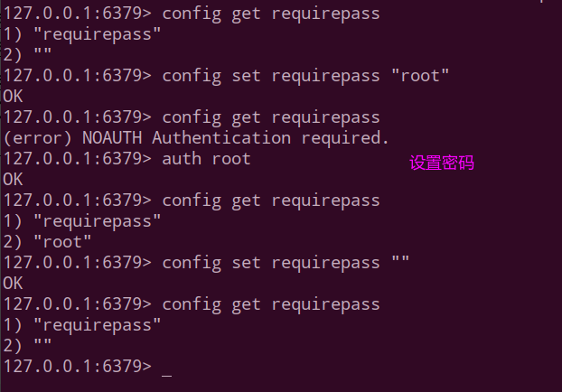

# Redis

* [一、NOSQL基本简介](#nosql基本简介)
* [二、Redis入门与简介](#二redis入门与简介)
* [三、Redis数据类型](#三redis数据类型)
* [四、Redis.conf配置文件](#四redisconf配置文件)

## 一、NOSQL基本简介

### 1、演变

①一开始，一个网站的访问量一般都不大，用单个数据库完全可以轻松应付。


②后来，访问量上升，程序员们开始大量的使用缓存技术来缓解数据库的压力，优化数据库的结构和索引。在这个时候，Memcached就自然的成为一个非常时尚的技术产品。


③由于数据库的写入压力增加，**Memcached只能缓解数据库的读取压力**。**读写集中在一个数据库上让数据库不堪重负，大部分网站开始使用主从复制技术来达到读写分离**，以提高读写性能和读库的可扩展性。Mysql的master-slave模式成为这个时候的网站标配了。


④后来MySQL主库的写压力开始出现瓶颈，而数据量的持续猛增，由于MyISAM使用表锁，在高并发下会出现严重的锁问题，大量的高并发MySQL应用开始使用InnoDB引擎代替MyISAM。

同时，开始流行使用分表分库来缓解写压力和数据增长的扩展问题，分表分库成了一个热门技术。


⑤现在的架构。


### 2、RDBMS和NOSQL对比

RDBMS
* 高度组织化结构化数据，结构化查询语言（SQL）
* 数据和关系都存储在单独的表中
* 数据操纵语言，数据定义语言
* 严格的一致性
* 基础事务

NoSQL
* 代表着不仅仅是SQL，没有声明性查询语言，没有预定义的模式
* 键 - 值对存储，列存储，文档存储，图形数据库
* **最终一致性**，而非ACID属性
* 非结构化和不可预知的数据
* CAP定理
* 高性能，高可用性和可伸缩性

 ### 3、在分布式数据库中CAP原理CAP+BASE

传统数据库：ACID，即：原子性、一致性、隔离性、持久性。

CAP原理:

* C:Consistency（强一致性）；
* A:Availability（可用性）；
* P:Partition tolerance（分区容错性）；

**CAP理论就是说在分布式存储系统中，最多只能实现上面的两点**。

<div align="center"></div><br>

**而由于当前的网络硬件肯定会出现延迟丢包等问题，所以分区容忍性是我们必须需要实现的**。

所以我们只能在一致性和可用性之间进行权衡，**没有NoSQL系统能同时保证这三点。**

*  `CA` : 传统Oracle数据库。单点集群，满足一致性，可用性的系统，通常在可扩展性上不太强大。
* `AP`  : 大多数网站架构的选择。满足可用性，分区容忍性的系统，通常可能对一致性要求低一些。
* `CP` : Redis、Mongodb。满足一致性，分区容忍必的系统，通常性能不是特别高。

 注意：分布式架构的时候必须做出取舍。

一致性和可用性之间取一个平衡。多余大多数web应用，其实并不需要强一致性。因此牺牲C换取P，这是目前分布式数据库产品的方向。

> BASE就是为了解决关系数据库强一致性引起的问题而引起的可用性降低而提出的解决方案。
> BASE其实是下面三个术语的缩写：
> * 基本可用（Basically Available）
> * 软状态（Soft state）
> * 最终一致（Eventually consistent）

## 二、Redis入门与简介

简单来说 redis 就是一个数据库，不过与传统数据库不同的是 redis 的数据是**存在内存中的**，**所以存写速度非常快，因此 redis 被广泛应用于缓存方向**。另外，redis 也经常用来做分布式锁。

### 1、安装

官网下载`redis.xxx.tar.gz`。


修改: 配置文件: `sudo vi /usr/local/redis/etc/redis.conf`。


启动`redis-server`和`redis-cli`。


> 安装可参考[**这篇博客**](https://www.cnblogs.com/limit1/p/9045183.html)。

### 2、相关基础杂项

`redis`默认有16个数据库:


基本命令:

* `select idx`: 选择第idx库。
* `dbsize` : 查看当前数据库的key的数量。
* `flushdb`：清空当前库。
* `Flushall`: 通杀全部库。
* 统一密码管理，16个库都是同样密码，要么都OK要么一个也连接不上。
* Redis索引都是从零开始。
* 默认端口`6379`。

Redis和其他`key-value`缓存产品都有如下特点:

* Redis支持**数据的持久化**，可以将内存中的**数据保持在磁盘**中，重启的时候可以再次加载进行使用；
* Redis不仅仅支持简单的key-value类型的数据，同时还提供`list，set，zset，hash`等数据结构的存储；
* Redis**支持数据的备份**，即master-slave模式的数据备份；

出现一个报错的问题解决方案: https://blog.csdn.net/u011627980/article/details/79891597?utm_source=blogxgwz9

## 三、Redis数据类型

| 结构类型   | 结构存储的值                                                 | 结构的读写能力                                               |
| ---------- | ------------------------------------------------------------ | ------------------------------------------------------------ |
| **STRING** | **可以是字符串、整数或者浮点数**                             | 对整个字符串或者字符串的其中一部分执行操作、对整数和浮点数执行自增或自减操作 |
| **LIST**   | 一个链表，链表上的每个节点都包含了一个字符串                 | 从**两端压入或者弹出元素**  对单个或者多个元素 进行修剪，只保留一个范围内的元素 |
| **SET**    | 包含字符串的**无序**收集器（unordered collection），并且被包含的每个字符串都互不相同的。 | 添加、获取、移除单个元素，检查一个元素是否存在于集合中、 **计算交集、并集、差集** ，从集合里面随机获取元素 |
| **HAST**   | 包含**键值对**的无序散列表                                   | 添加、获取、移除单个键值对 ，获取所有键值对 检查某个键是否存在 |
| **ZSET**   | 字符串成员（member）与浮点数分值（score）之间的**有序映射**，元素的排列顺序由**分值的大小**决定 | 添加、获取、删除元素 ，根据分值范围或者成员来获取元素，计算一个键的排名 |

<div align="center"></div><br>

### 1、基本命令

```shell
127.0.0.1:6379> select 0
OK
127.0.0.1:6379> keys *
1) "k2"
2) "k3"
127.0.0.1:6379> move k2 2 # 将k2移动到２号数据库
(integer) 1
127.0.0.1:6379> select 2
OK
127.0.0.1:6379[2]> keys *
1) "k2"
127.0.0.1:6379[2]> select 0
OK
127.0.0.1:6379> keys *
1) "k3"
127.0.0.1:6379> exists k3
(integer) 1
127.0.0.1:6379> exists k1
(integer) 0
127.0.0.1:6379> del k3
127.0.0.1:6379> set k1 v1
OK
127.0.0.1:6379> set k2 v2
OK
127.0.0.1:6379> set k1 v100  # 默认会覆盖
OK
127.0.0.1:6379> keys *
1) "k2"
2) "k1"
127.0.0.1:6379> type k1
string
127.0.0.1:6379> lpush mylist 1 2 3 4 5
(integer) 5
127.0.0.1:6379> type mylist
list
127.0.0.1:6379> ttl k1 # ttl查看还能存活的时间 -1表示永久, -2表示已经死了
(integer) -1
127.0.0.1:6379> expire k2 10 # 设置k2 的ttl为10秒钟
(integer) 1
127.0.0.1:6379> ttl k2
(integer) 7
127.0.0.1:6379> ttl k2
(integer) 4
127.0.0.1:6379> ttl k2
(integer) -2
127.0.0.1:6379> keys *
1) "mylist"
2) "k1"
127.0.0.1:6379> 
```

### 2、STRING

<div align="center"> </div><br>

```shell
127.0.0.1:6379> del mylist
(integer) 1
127.0.0.1:6379> append k1 12345 # 追加
(integer) 9
127.0.0.1:6379> get k1
"v10012345"
127.0.0.1:6379> STRLEN k1 # 长度
(integer) 9
127.0.0.1:6379> set k2 2
OK
127.0.0.1:6379> INCR k2 # 自增
(integer) 3
127.0.0.1:6379> INCR k2
(integer) 4
127.0.0.1:6379> get k2
"4"
127.0.0.1:6379> DECR k2
(integer) 3
127.0.0.1:6379> get k2
"3"
127.0.0.1:6379> INCRBY k2 10 # + num
(integer) 13
127.0.0.1:6379> get k2
"13"
127.0.0.1:6379> DECRBY k2 10
(integer) 3
127.0.0.1:6379> set k3 v3
OK
127.0.0.1:6379> INCR k3 # incr, decr,incrby,decrby都只能对数字进行操作
(error) ERR value is not an integer or out of range
127.0.0.1:6379> get k1
"v10012345"
127.0.0.1:6379> GETRANGE k1 0 -1 # getrange 获取指定范围的值
"v10012345"
127.0.0.1:6379> GETRANGE k1 0 3
"v100"
127.0.0.1:6379> SETRANGE k1 0 xxx
(integer) 9
127.0.0.1:6379> get k1
"xxx012345"
127.0.0.1:6379> setex k4 10 v4 # set with expire
OK
127.0.0.1:6379> ttl k4
(integer) 7
127.0.0.1:6379> ttl k4
(integer) 2
127.0.0.1:6379> ttl k4
(integer) -2
127.0.0.1:6379> get k4
(nil)
127.0.0.1:6379> keys *
1) "k2"
2) "k3"
3) "k1"
127.0.0.1:6379> setnx k1 v111 # 存在就设值不进去
(integer) 0
127.0.0.1:6379> get k1
"xxx012345"
127.0.0.1:6379> setnx k5 v5 # 不存在就设值
(integer) 1
127.0.0.1:6379> get k5
"v5"
127.0.0.1:6379> mset k1 v1 k2 v2 k3 v3 # 一次设值多个
OK
127.0.0.1:6379> mget k1 k2 k3
1) "v1"
2) "v2"
3) "v3"
127.0.0.1:6379> 
```

### 3、List

<div align="center"></div><br>

总结:

* 它是一个字符串链表，left、right都可以插入添加；
* 如果键不存在，创建新的链表；
* 如果键已存在，新增内容；
* 如果值全移除，对应的键也就消失了。
* 链表的操作无论是头和尾效率都极高，但假如是对中间元素进行操作，效率就很惨淡了。

```shell
127.0.0.1:6379> LPUSH list01 1 2 3 4 5 # 从左边分别推入1、2、3、4、5
(integer) 5
127.0.0.1:6379> LRANGE list01 0 -1
1) "5"
2) "4"
3) "3"
4) "2"
5) "1"
127.0.0.1:6379> RPUSH list02 1 2 3 4 5
(integer) 5
127.0.0.1:6379> LRANGE list02 0 -1
1) "1"
2) "2"
3) "3"
4) "4"
5) "5"
127.0.0.1:6379> LPOP list01 # 弹掉最左边的,是5
"5"
127.0.0.1:6379> LPOP list02
"1"
127.0.0.1:6379> RPOP list01
"1"
127.0.0.1:6379> RPOP list02
"5"
127.0.0.1:6379> LINDEX list01 1 # 相当于 s.charAt()
"3"
127.0.0.1:6379> LINDEX list02 2
"4"
127.0.0.1:6379> LLEN list01 # s.length()
(integer) 3
127.0.0.1:6379> LRANGE list01 0 -1
1) "4"
2) "3"
3) "2"
127.0.0.1:6379> RPUSH list03 1 1 1 2 2 2 3 3 3 4 4 4
(integer) 12
127.0.0.1:6379> LREM list03 2 3 # 删除N个value , 删除2个3
(integer) 2
127.0.0.1:6379> LRANGE list03 0 -1
 1) "1"
 2) "1"
 3) "1"
 4) "2"
 5) "2"
 6) "2"
 7) "3"
 8) "4"
 9) "4"
10) "4"
127.0.0.1:6379> LTRIM list03 3 5 # s = s.substring(3, 5)
OK
127.0.0.1:6379> LRANGE list03 0 -1
1) "2"
2) "2"
3) "2"
127.0.0.1:6379> LRANGE list02 0 -1
1) "2"
2) "3"
3) "4"
127.0.0.1:6379> RPOPLPUSH list02 list03 # RPOPLPUSH,将第一个的最后一个放到第二个的头部
"4"
127.0.0.1:6379> LRANGE list03 0 -1
1) "4"
2) "2"
3) "2"
4) "2"
127.0.0.1:6379> LSET list03 1 x # s.set(idx, value);
OK
127.0.0.1:6379> LRANGE list03 0 -1
1) "4"
2) "x"
3) "2"
4) "2"
127.0.0.1:6379> LINSERT list03 before x java
(integer) 5
127.0.0.1:6379> LRANGE list03 0 -1
1) "4"
2) "java"
3) "x"
4) "2"
5) "2"
127.0.0.1:6379> 


```

### 4、Set

<div align="center"></div><br>

```shell
127.0.0.1:6379> sadd set01 1 1 2 2 3 3 # 创建set01并加入元素
(integer) 3
127.0.0.1:6379> smembers set01 # 查看set中的所有元素,注意是去重的s
1) "1"
2) "2"
3) "3"
127.0.0.1:6379> SISMEMBER set01 1
(integer) 1
127.0.0.1:6379> SISMEMBER set01 x
(integer) 0
127.0.0.1:6379> SCARD set01 # 元素个数
(integer) 3
127.0.0.1:6379> SREM set01 2 # 删除2
(integer) 1
127.0.0.1:6379> SMEMBERS set01
1) "1"
2) "3"
127.0.0.1:6379> sadd set01 5 8 3 12 6
(integer) 4
127.0.0.1:6379> SMEMBERS set01
1) "1"
2) "3"
3) "5"
4) "6"
5) "8"
6) "12"
127.0.0.1:6379> SRANDMEMBER set01 2 # 随机取两个
1) "6"
2) "12"
127.0.0.1:6379> SRANDMEMBER set01 2 # 随机取两个
1) "1"
2) "6"
127.0.0.1:6379> SPOP set01# 随机出栈
"1"
127.0.0.1:6379> SPOP set01
"12"
127.0.0.1:6379> SMEMBERS set01
1) "3"
2) "5"
3) "6"
4) "8"
127.0.0.1:6379> flushdb # 清空了一下
OK
127.0.0.1:6379> SADD set01 1 2 3 4 5
(integer) 5
127.0.0.1:6379> SADD set02 1 2 3 a b
(integer) 5
127.0.0.1:6379> SDIFF set01 set02 # 差集
1) "4"
2) "5"
127.0.0.1:6379> SINTER set01 set02 # 交集
1) "1"
2) "2"
3) "3"
127.0.0.1:6379> SUNION set01 set02 # 并集
1) "b"
2) "3"
3) "1"
4) "5"
5) "a"
6) "4"
7) "2"
127.0.0.1:6379> 


```

注意上面差集: **在第一个set里面而不在后面任何一个set里面的项**。

### 5、Hash

注意Redis里面的Hash和普通的`HashMap`有点小区别，Redis里面的Hash的`value`又是一个`key-value`集合。


<div align="center"></div><br>

```shell
127.0.0.1:6379> flushdb
OK
127.0.0.1:6379> hset user name z3
(integer) 1
127.0.0.1:6379> hget user name
"z3"
127.0.0.1:6379> hmset customer id 11 name li4 age 24 # 批量设置
OK
127.0.0.1:6379> hmget customer id name age
1) "11"
2) "li4"
3) "24"
127.0.0.1:6379> HGETALL customer# 获取所有 key、value、key、value..格式呈现
1) "id"
2) "11"
3) "name"
4) "li4"
5) "age"
6) "24"
127.0.0.1:6379> HDEL customer name # 删除
(integer) 1
127.0.0.1:6379> HGETALL customer 
1) "id"
2) "11"
3) "age"
4) "24"
127.0.0.1:6379> HLEN customer # 长度
(integer) 2
127.0.0.1:6379> HEXISTS customer id # 判断是否存在
(integer) 1
127.0.0.1:6379> HEXISTS customer email
(integer) 0
127.0.0.1:6379> HKEYS customer　# 获取所有key
1) "id"
2) "age"
127.0.0.1:6379> HVALS customer
1) "11"
2) "24"
127.0.0.1:6379> HINCRBY customer age 2 #增
(integer) 26
127.0.0.1:6379> HINCRBY customer age 2
(integer) 28
127.0.0.1:6379> HSET customer score 91.5
(integer) 1
127.0.0.1:6379> HINCRBYFLOAT customer score 0.5
"92"
127.0.0.1:6379> HSETNX customer age 26
(integer) 0
127.0.0.1:6379> HSETNX customer email abc@163.com
(integer) 1
127.0.0.1:6379> 
```

### 6、ZSet(有序集合)

ZSet就是在`set`的基础上，加一个`score`值。里面按照`score`值排序。也就是每两个是一个整体。

例如:

* 之前是set01    :   `v1   v2   v3`；
* 现在是set01    :   `score1  v1   score2  v2    score3  v3`；

<div align="center"></div><br>

```shell
127.0.0.1:6379> flushdb
OK
127.0.0.1:6379> ZADD zset01 60 v1 70 v2 80 v3 90 v4 100 v5 # 添加,每个整体有两个内容v,score
(integer) 5
127.0.0.1:6379> ZRANGE zset01 0 -1
1) "v1"
2) "v2"
3) "v3"
4) "v4"
5) "v5"
127.0.0.1:6379> 
127.0.0.1:6379> ZRANGE zset01 0 -1 withscores
 1) "v1"
 2) "60"
 3) "v2"
 4) "70"
 5) "v3"
 6) "80"
 7) "v4"
 8) "90"
 9) "v5"
10) "100"
127.0.0.1:6379> ZRANGEBYSCORE zset01 60 90
1) "v1"
2) "v2"
3) "v3"
4) "v4"
127.0.0.1:6379> ZRANGEBYSCORE zset01 60 (90
1) "v1"
2) "v2"
3) "v3"
127.0.0.1:6379> ZRANGEBYSCORE zset01 (60 (90
1) "v2"
2) "v3"
127.0.0.1:6379> ZRANGEBYSCORE zset01 60 90 limit 1 2
1) "v2"
2) "v3"
127.0.0.1:6379> ZREM zset01 v5 # 删除v5
(integer) 1
127.0.0.1:6379> ZCARD zset01 # 个数
(integer) 4
127.0.0.1:6379> ZCOUNT zset01 60 80 # 一个范围的个数
(integer) 3
127.0.0.1:6379> ZRANK zset01 v3 # 排名
(integer) 2
127.0.0.1:6379> ZSCORE zset01 v2
"70"
127.0.0.1:6379> ZREVRANK zset01 v3
(integer) 1
127.0.0.1:6379> ZREVRANGE zset01 0 -1
1) "v4"
2) "v3"
3) "v2"
4) "v1"
127.0.0.1:6379> 
```

## 四、Redis.conf配置文件

### 1、GENERAL通用

* daemonize；
* pidfile；
* port；
* tcp-backlog；设置tcp的`backlog`，`backlog`其实是一个连接队列，backlog队列总和=未完成三次握手队列 + 已经完成三次握手队列。在高并发环境下你需要一个高backlog值来避免慢客户端连接问题。注意Linux内核会将这个值减小到`/proc/sys/net/core/somaxconn`的值，所以需要确认增大`somaxconn`和`tcp_max_syn_backlog`两个值。来达到想要的效果；
* timeout；
* `Tcp-keepalive`: 单位为秒，如果设置为0，则不会进行Keepalive检测，建议设置成60 。
* `Syslog-enabled`: 是否把日志输出到syslog中。

### 2、SECURITY安全

设置密码:

<div align="center"></div><br>

### 3、LIMITS限制

#### a、Maxclients

**设置redis同时可以与多少个客户端进行连接**。默认情况下为10000个客户端。

#### b、Maxmemory

**设置redis可以使用的内存量**。一旦到达内存使用上限，redis将会试图移除内部数据，移除规则可以通过`maxmemory-policy`来指定。如果redis无法根据移除规则来移除内存中的数据，或者设置了“不允许移除”，

那么redis则会针对那些需要申请内存的指令返回错误信息，比如SET、LPUSH等。

但是对于无内存申请的指令，仍然会正常响应，比如GET等。如果你的redis是主redis（说明你的redis有从redis），那么在设置内存使用上限时，需要在系统中留出一些内存空间给同步队列缓存，只有在你设置的是“不移除”的情况下，才不用考虑这个因素。

#### c、Maxmemory-policy

缓存过期策略:主要有下面几种。


缓存失效策略（FIFO 、LRU、LFU三种算法的区别）

当缓存需要被清理时（比如空间占用已经接近临界值了），需要使用某种淘汰算法来决定清理掉哪些数据。常用的淘汰算法有下面几种：

1. FIFO：`First In First Out`，先进先出。判断被存储的时间，**离目前最远的数据优先被淘汰**。
2. LRU：`Least Recently Used`，最近最少使用。判断最近被使用的时间，目前最远的数据优先被淘汰(最久没有使用的)。
3. LFU：`Least Frequently Used`，最不经常使用。在一段时间内，数据被使用次数最少的，优先被淘汰(最近一段时间使用的最少的)。

上面的策略:

（1）volatile-lru：使用LRU算法移除key，只对设置了过期时间的键。

（2）allkeys-lru：使用LRU算法移除key。

（3）volatile-random：在过期集合中移除随机的key，只对设置了过期时间的键。

（4）allkeys-random：移除随机的key。

（5）volatile-ttl：移除那些TTL值最小的key，即那些最近要过期的key。

（6）noeviction：不进行移除。针对写操作，只是返回错误信息。


