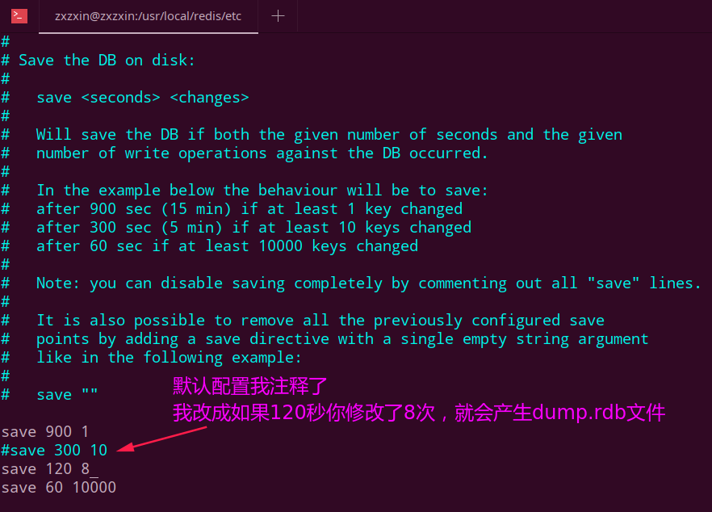
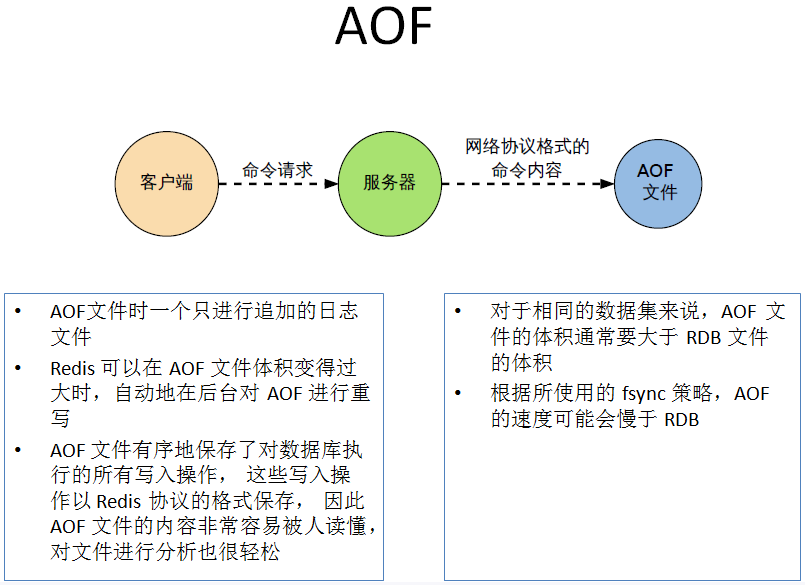
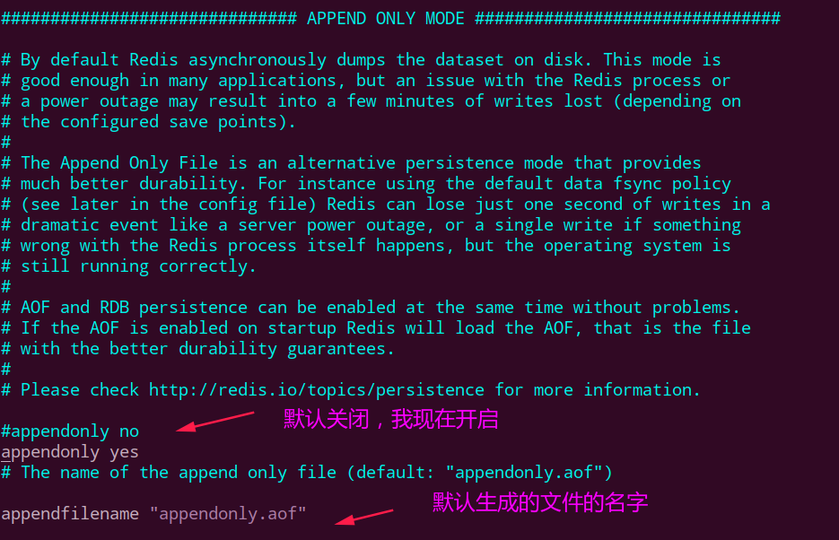
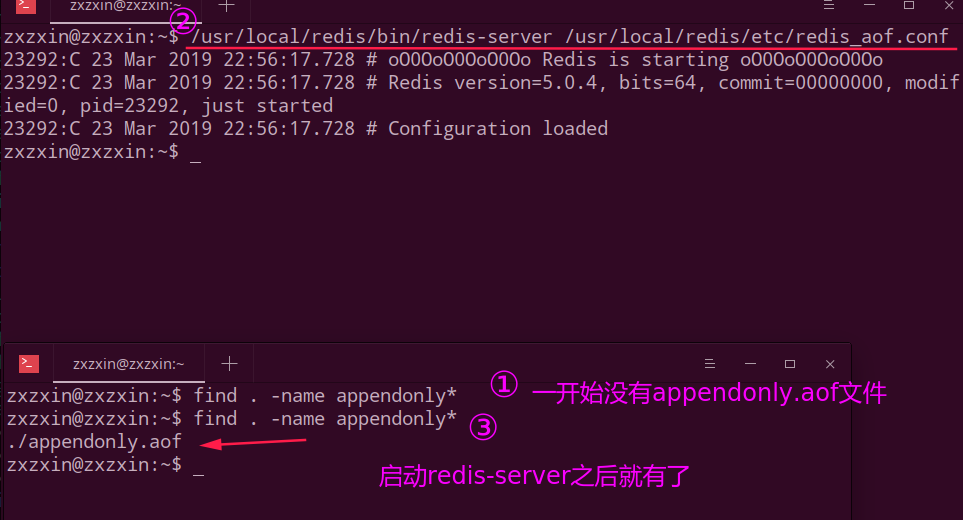
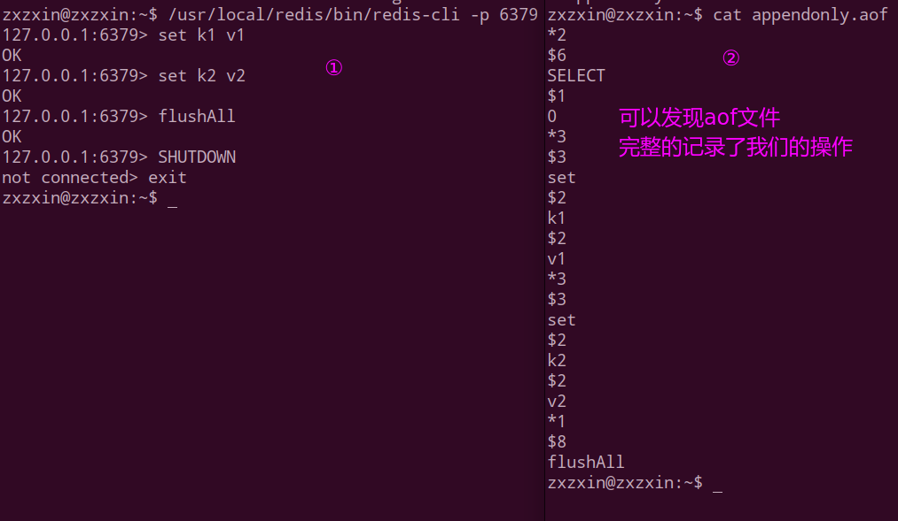
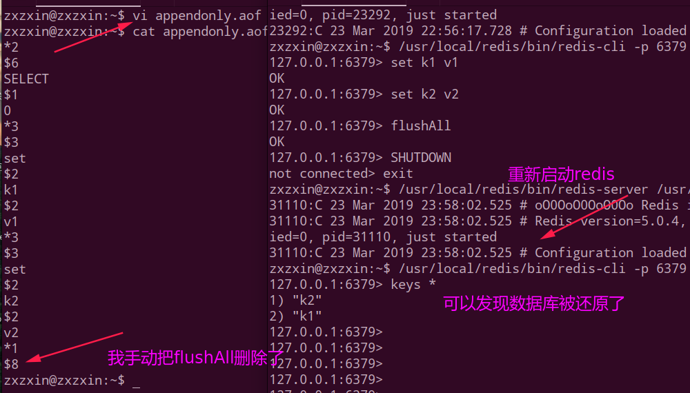
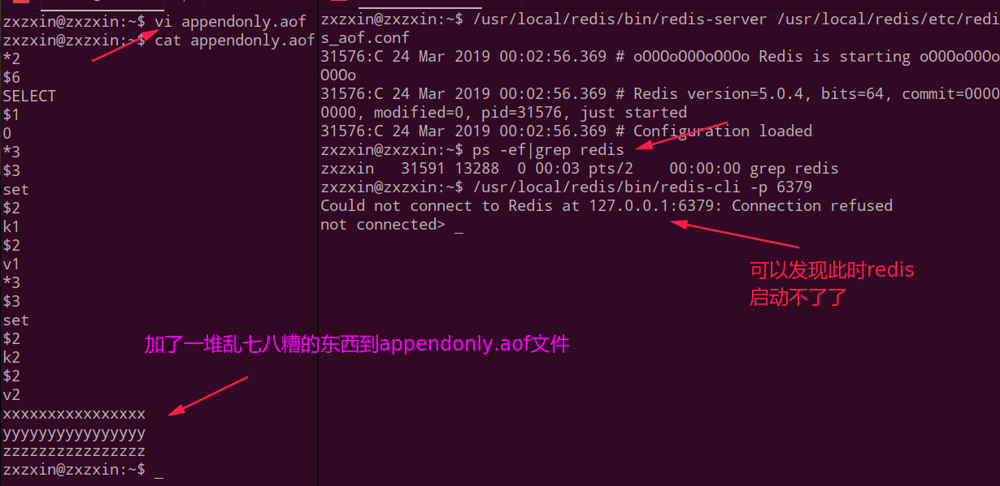
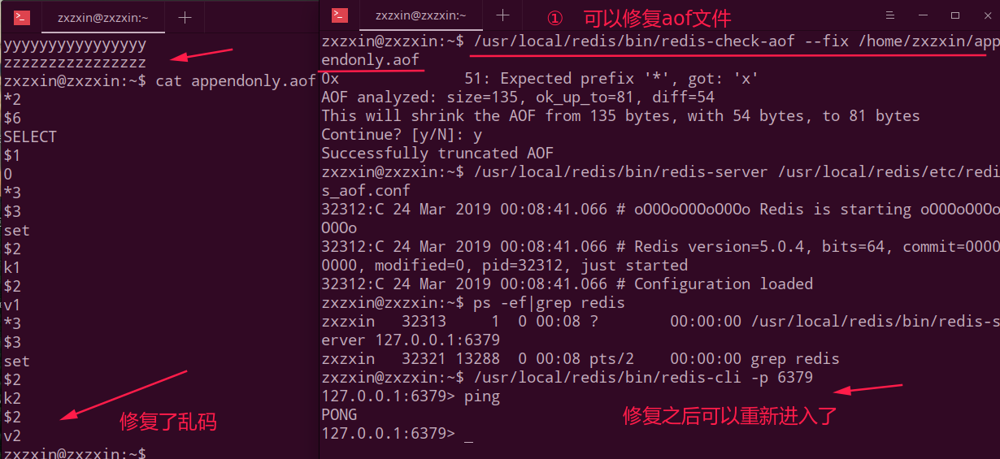

## Redis持久化

### 1、RDB(Redis Database)

#### a、基本概念

概念: **在指定的时间间隔内将内存中的数据集快照写入磁盘， 也就是行话讲的Snapshot快照，它恢复时是将快照文件直接读到内存里**。

Redis会单独创建（fork）一个子进程来进行持久化，会先将数据写入到 一个临时文件中，待持久化过程都结束了，再用这个临时文件替换上次持久化好的文件。 整个过程中，主进程是不进行任何IO操作的，这就确保了极高的性能 如果需要进行大规模数据的恢复，且对于数据恢复的完整性不是非常敏感，那RDB方 式要比AOF方式更加的高效。RDB的缺点是最后一次持久化后的数据可能丢失。

**fork的作用是复制一个与当前进程一样的进程**。**新进程的所有数据（变量、环境变量、程序计数器等） 数值都和原进程一致，但是是一个全新的进程，并作为原进程的子进程**。

rdb 保存的是`dump.rdb`文件

#### b、如何触发RDB快照

①配置文件中默认的快照配置，冷拷贝后重新使用，可以cp dump.rdb dump_new.rdb。然后要还原数据的时候就将`dump_new.rdb`还原成`dump.rdb`，然后重新启动的时候就会自动加载。

②命令save或者是bgsave，这个会强制的备份。

* `Save`：save时**只管保存**，其它不管，全部阻塞。
* `BGSAVE`：Redis会在后台异步进行快照操作， 快照同时还可以响应客户端请求。可以通过lastsave 命令获取最后一次成功执行快照的时间。
* 执行flushall命令，也会产生`dump.rdb`文件，但里面是空的，无意义 (**当时还挖了一个坑**)。

> 即: 调用`save`也就是立刻、马上备份。`flushAll`也可以马上形成备份，但是没有意义。

`redis.conf`相关文件关于 `RDB`的配置:

* `save`配置：RDB是整个内存的压缩过的Snapshot，RDB的数据结构，**可以配置复合的快照触发条件**。

  默认

  是1分钟内改了1万次，

  或5分钟内改了10次，

  或15分钟内改了1次。

* `stop-writes-on-bgsave-error` : 如果配置成no，表示你不在乎数据不一致或者有其他的手段发现和控制。

* `rdbcompression` ：rdbcompression：对于存储到磁盘中的快照，可以设置是否进行压缩存储。如果是的话，redis会采用LZF算法进行压缩。如果你不想消耗CPU来进行压缩的话，可以设置为关闭此功能。

* `dbfilename`:  默认是`dump.rdb`。

* `dir`: 生成`dump.rdb`的默认目录。 

#### c、如何恢复

将备份文件 (`dump.rdb`) 移动到 redis 安装目录并启动服务即可。

CONFIG GET dir获取目录

#### d、优势和劣势

优势:

* 适合大规模的数据恢复；
* 对数据完整性和一致性要求不高；

劣势:

* 在一定间隔时间做一次备份，所以如果redis意外down掉的话，就 会丢失最后一次快照后的所有修改；
* fork的时候，内存中的数据被克隆了一份，大致2倍的膨胀性需要考虑；

#### e、如何停止

动态所有停止RDB保存规则的方法：`redis-cli config set save ""`。

**实战: 更换默认save，并使用dump.rdb恢复配置文件**(后面未做了)

### 2、AOF(Append Only File)

#### a、基本概念

以日志的形式来记录**每个写操作**。

**将Redis执行过的所有写指令记录下来(读操作不记录)**， 只许追加文件但不可以改写文件，redis启动之初会读取该文件重新构建数据，换言之，redis 重启的话就根据日志文件的内容将写指令从前到后执行一次以完成数据的恢复工作。

Aof保存的是`appendonly.aof`文件。

#### b、配置位置

* `appendonly`，默认是`no`，我们要改成`yes`才会有作用；
* `appendfilename`，默认是`appendonly.aof`；
* `appendfsync`: 
  * always：同步持久化 每次发生数据变更会被立即记录到磁盘 性能较差但数据完整性比较好；
  * everysec：出厂默认推荐，异步操作，每秒记录 如果一秒内宕机，有数据丢失；
  * no；
* `no-appendfsync-on-rewrite`：重写时是否可以运用Appendfsync，用默认no即可，保证数据安全性；
* `auto-aof-rewrite-min-size`：设置重写的基准值；
* `auto-aof-rewrite-percentage`：设置重写的基准值；

#### c、 AOF启动、恢复、修复

正常恢复:

* 启动：设置Yes，　--> 修改默认的`appendonly no`，改为yes。
* 将有数据的aof文件复制一份保存到对应目录(`config get dir`)；
* 恢复：重启redis然后重新加载。

异常恢复(就是下面的搞破坏)

* 启备份被写坏的AOF文件；
* `redis-check-aof --fix`进行修复；

第一步: 启动`redis-server`之前和之后的，启动之后就会生成`appendonly.aof`文件:

第二步: 进行相关操作并且查看更新之后的`appendonly.aof`文件:

但是上述文件不能还原我们之前的数据，因为最后一样有一个`flushAll`，还原的时候也会执行这个，所以不能用这个还原，但是我们可以手动的编辑`appendonly.aof`文件，从而还原我们的数据库。

但是如果我们的`appendonly.aof`文件被破坏了，例如我随便加了一些乱码进去，这就会导致`redis`启动不了。

如下，虽然`appendonly.aof`和`dump.rdb`可以共存，但是会优先加载`appendonly.aof`，所以导致不能启动:

此时我们可以使用`redis-check-aof  --fix  appendonly.aof`来修复乱码文件:

#### d、重写rewrite

概念: **AOF采用文件追加方式，文件会越来越大为避免出现此种情况，新增了重写机制, 当AOF文件的大小超过所设定的阈值时，Redis就会启动AOF文件的内容压缩**， 只保留可以恢复数据的最小指令集.可以使用命令`bgrewriteaof`。

原理:

**AOF文件持续增长而过大时，会fork出一条新进程来将文件重写(也是先写临时文件最后再rename)， 遍历新进程的内存中数据，每条记录有一条的Set语句**。重写aof文件的操作，并没有读取旧的aof文件， 而是将整个内存中的数据库内容用命令的方式重写了一个新的aof文件，这点和快照有点类似。

触发机制:

Redis会记录上次重写时的AOF大小，默认配置是当AOF文件大小是上次rewrite后大小的一倍且文件大于64M时触发。

#### e、优势和劣势

优势:

* 每修改同步：`appendfsync always` 同步持久化 每次发生数据变更会被立即记录到磁盘 性能较差但数据完整性比较好。
* 每秒同步：`appendfsync everysec` 异步操作，每秒记录 如果一秒内宕机，有数据丢失。
* 不同步：`appendfsync no` 从不同步。

劣势:

* **相同数据集的数据而言aof文件要远大于rdb文件，恢复速度慢于rdb**；
* **aof运行效率要慢于rdb，每秒同步策略效率较好**，不同步效率和rdb相同；

### 3、RDB和AOF对比和选择

* RDB持久化方式能够在指定的时间间隔能对你的数据进行快照存储。
* AOF持久化方式记录每次对服务器写的操作,当服务器重启的时候会重新执行这些 命令来恢复原始的数据,AOF命令以redis协议追加保存每次写的操作到文件末尾. Redis还能对AOF文件进行后台重写,使得AOF文件的体积不至于过大。
* 只做缓存：如果你只希望你的数据在服务器运行的时候存在,你也可以不使用任何持久化方式。
* 同时开启:
  * 在这种情况下,当redis重启的时候会优先载入AOF文件来恢复原始的数据, 因为在通常情况下AOF文件保存的数据集要比RDB文件保存的数据集要完整。
  * RDB的数据不实时，同时使用两者时服务器重启也只会找AOF文件。那要不要只使用AOF呢？ 作者建议不要，因为RDB更适合用于备份数据库(AOF在不断变化不好备份)， 快速重启，而且不会有AOF可能潜在的bug，留着作为一个万一的手段。

> 性能建议：
>
> 因为RDB文件只用作后备用途，建议只在Slave上持久化RDB文件，而且只要15分钟备份一次就够了，只保留`save 900 1`这条规则。
>
> 如果Enalbe AOF，**好处是在最恶劣情况下也只会丢失不超过两秒数据**，启动脚本较简单只load自己的AOF文件就可以了。代价一是带来了持续的IO，二是AOF rewrite的最后将rewrite过程中产生的新数据写到新文件造成的阻塞几乎是不可避免的。只要硬盘许可，**应该尽量减少AOF rewrite的频率**，AOF重写的基础大小默认值64M太小了，可以设到5G以上。默认超过原大小100%大小时重写可以改到适当的数值。
>
> 如果不Enable AOF ，仅靠Master-Slave Replication 实现高可用性也可以。能省掉一大笔IO也减少了rewrite时带来的系统波动。代价是如果Master/Slave同时倒掉，会丢失十几分钟的数据，启动脚本也要比较两个Master/Slave中的RDB文件，载入较新的那个。新浪微博就选用了这种架构。