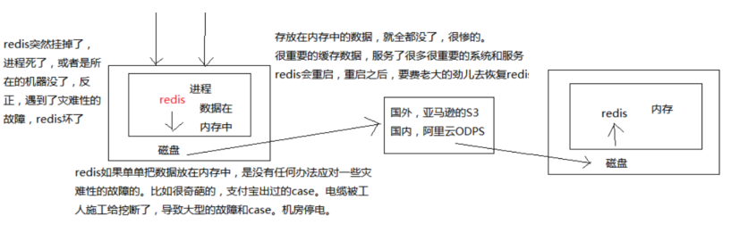
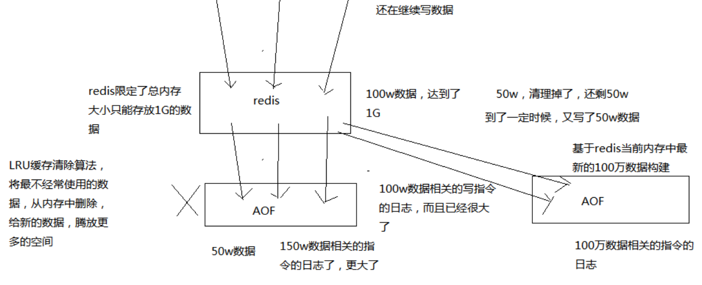
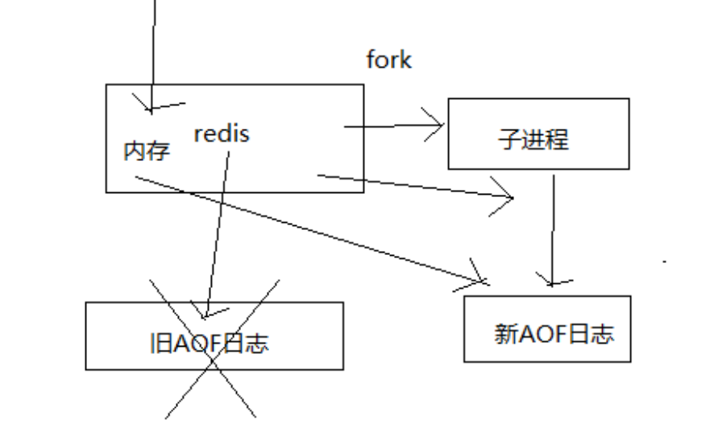
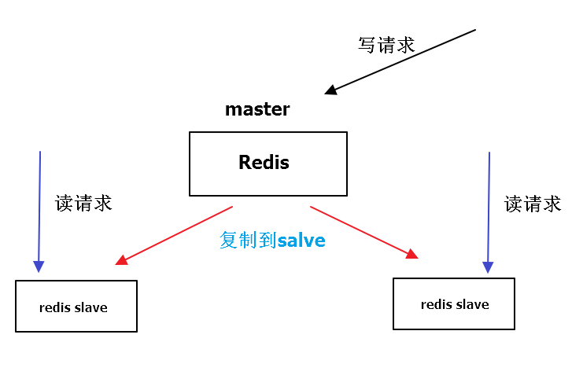

# Redis

## 一、Redis持久化

### 1、Redis持久化意义

redis持久化的意义，在于故障恢复，比如部署了重要的数据，如果没有持久化的话，redis遇到灾难性故障的时候，就会丢失所有的数据。如果通过持久化将数据搞一份儿在磁盘上去，然后定期比如说同步和备份到一些云存储服务上去，那么就可以保证数据不丢失全部，还是可以恢复一部分数据回来的。



### 2、RDB和AOF优缺点

**1、RDB和AOF两种持久化机制的介绍**

RDB持久化机制，对redis中的数据执行周期性的持久化

AOF机制对每条写入命令作为日志，以append-only的模式写入一个日志文件中，在redis重启的时候，可以通过回放AOF日志中的写入指令来重新构建整个数据集

如果我们想要redis仅仅作为纯内存的缓存来用，那么可以禁止RDB和AOF所有的持久化机制

通过RDB或AOF，都可以将redis内存中的数据给持久化到磁盘上面来，然后可以将这些数据备份到别的地方去，比如说阿里云，云服务

如果redis挂了，服务器上的内存和磁盘上的数据都丢了，可以从云服务上拷贝回来之前的数据，放到指定的目录中，然后重新启动redis，redis就会自动根据持久化数据文件中的数据，去恢复内存中的数据，继续对外提供服务

**2、RDB持久化机制的优点**

1）RDB会生成多个数据文件，每个数据文件都代表了某一个时刻中redis的数据，这种多个数据文件的方式，非常适合做冷备，可以将这种完整的数据文件发送到一些远程的安全存储上去，比如说Amazon的S3云服务上去，在国内可以是阿里云的ODPS分布式存储上，以预定好的备份策略来定期备份redis中的数据

2）RDB对redis对外提供的读写服务，影响非常小，**可以让redis保持高性能，因为redis主进程只需要fork一个子进程，让子进程执行磁盘IO操作来进行RDB持久化即可**

3）相对于AOF持久化机制来说，**直接基于RDB数据文件来重启和恢复redis进程，更加快速**

**3、RDB持久化机制的缺点**

1）如果想要在redis故障时，尽可能少的丢失数据，那么RDB没有AOF好。一般来说，RDB数据快照文件，都是每隔5分钟，或者更长时间生成一次，这个时候就得接受一旦redis进程宕机，**那么会丢失最近5分钟的数据**

2）RDB每次在fork子进程来执行RDB快照数据文件生成的时候，如果数据文件特别大，可能会导致对客户端提供的服务暂停数毫秒，或者甚至数秒

**4、AOF持久化机制的优点**

1）**AOF可以更好的保护数据不丢失，一般AOF会每隔1秒，通过一个后台线程执行一次fsync操作，最多丢失1秒钟的数据**

2）**AOF日志文件以append-only模式写入，所以没有任何磁盘寻址的开销，写入性能非常高，而且文件不容易破损，即使文件尾部破损，也很容易修复**

3）**AOF日志文件即使过大的时候，出现后台重写rewrite操作，也不会影响客户端的读写**。因为在rewrite log的时候，会对其中的指导进行压缩，创建出一份需要恢复数据的最小日志出来。再创建新日志文件的时候，老的日志文件还是照常写入。当新的merge后的日志文件ready的时候，再交换新老日志文件即可。

4）AOF日志文件的命令通过非常可读的方式进行记录，这个特性非常适合做灾难性的误删除的紧急恢复。比如某人不小心用flushall命令清空了所有数据，只要这个时候后台rewrite还没有发生，那么就可以立即拷贝AOF文件，将最后一条flushall命令给删了，然后再将该AOF文件放回去，就可以通过恢复机制，自动恢复所有数据



**5、AOF持久化机制的缺点**

1）对于同一份数据来说，AOF日志文件通常比RDB数据快照文件更大

2）AOF开启后，支持的写QPS会比RDB支持的写QPS低，因为AOF一般会配置成每秒fsync一次日志文件，当然，每秒一次fsync，性能也还是很高的

3）以前AOF发生过bug，就是通过AOF记录的日志，进行数据恢复的时候，没有恢复一模一样的数据出来。所以说，类似AOF这种较为复杂的基于命令日志/merge/回放的方式，比基于RDB每次持久化一份完整的数据快照文件的方式，更加脆弱一些，容易有bug。不过AOF就是为了避免rewrite过程导致的bug，因此每次rewrite并不是基于旧的指令日志进行merge的，而是基于当时内存中的数据进行指令的重新构建，这样健壮性会好很多。

**6、RDB和AOF到底该如何选择**

1）不要仅仅使用RDB，因为那样会导致你丢失很多数据

2）也不要仅仅使用AOF，因为那样有两个问题，第一，你通过AOF做冷备，没有RDB做冷备，来的恢复速度更快; 第二，RDB每次简单粗暴生成数据快照，更加健壮，可以避免AOF这种复杂的备份和恢复机制的bug

3）综合使用AOF和RDB两种持久化机制，用AOF来保证数据不丢失，作为数据恢复的第一选择; 用RDB来做不同程度的冷备，在AOF文件都丢失或损坏不可用的时候，还可以使用RDB来进行快速的数据恢复

### 3、RDB持久化配置实战

**1、如何配置RDB持久化机制**

redis.conf文件，也就是`/etc/redis/6379.conf`，去配置持久化

`save 60 1000`

每隔60s，如果有超过1000个key发生了变更，那么就生成一个新的dump.rdb文件，就是当前redis内存中完整的数据快照，这个操作也被称之为snapshotting，快照

也可以手动调用save或者bgsave命令，同步或异步执行rdb快照生成

save可以设置多个，就是多个snapshotting检查点，每到一个检查点，就会去check一下，是否有指定的key数量发生了变更，如果有，就生成一个新的dump.rdb文件

**2、RDB持久化机制的工作流程**

1）redis根据配置自己尝试去生成rdb快照文件

2）fork一个子进程出来

3）子进程尝试将数据dump到临时的rdb快照文件中

4）完成rdb快照文件的生成之后，就替换之前的旧的快照文件

dump.rdb，每次生成一个新的快照，都会覆盖之前的老快照

**3、基于RDB持久化机制的数据恢复实验**

1）在redis中保存几条数据，立即停掉redis进程，然后重启redis，看看刚才插入的数据还在不在，数据还在，为什么？

**带出来一个知识点，通过redis-cli SHUTDOWN这种方式去停掉redis，其实是一种安全退出的模式，redis在退出的时候会将内存中的数据立即生成一份完整的rdb快照**

`/var/redis/6379/dump.rdb`

2）在redis中再保存几条新的数据，用kill -9粗暴杀死redis进程，模拟redis故障异常退出，导致内存数据丢失的场景，这次就发现，redis进程异常被杀掉，数据没有进dump文件，几条最新的数据就丢失了。

3）手动设置一个save检查点，save 5 1

4）写入几条数据，等待5秒钟，会发现自动进行了一次dump rdb快照，在dump.rdb中发现了数据

5）异常停掉redis进程，再重新启动redis，看刚才插入的数据还在

### 4、AOF持久化实战

**1、AOF持久化的配置**

AOF持久化，默认是关闭的，默认是打开RDB持久化

`appendonly yes`，可以打开AOF持久化机制，在生产环境里面，一般来说AOF都是要打开的，除非你说随便丢个几分钟的数据也无所谓

**打开AOF持久化机制之后，redis每次接收到一条写命令，就会写入日志文件中，当然是先写入os cache的，然后每隔一定时间再fsync一下**

而且即使AOF和RDB都开启了，redis重启的时候，也是优先通过AOF进行数据恢复的，因为aof数据比较完整

可以配置AOF的fsync策略，有三种策略可以选择，一种是每次写入一条数据就执行一次fsync; 一种是每隔一秒执行一次fsync; 一种是不主动执行fsync

* always: 每次写入一条数据，立即将这个数据对应的写日志fsync到磁盘上去，性能非常非常差，吞吐量很低; 确保说redis里的数据一条都不丢，那就只能这样了

  mysql -> 内存策略，大量磁盘，QPS到多少，一两k。QPS，每秒钟的请求数量
  redis -> 内存，磁盘持久化，QPS到多少，单机，一般来说，上万QPS没问题

* everysec: 每秒将os cache中的数据fsync到磁盘，这个最常用的，生产环境一般都这么配置，性能很高，QPS还是可以上万的

* no: 仅仅redis负责将数据写入os cache就撒手不管了，然后后面os自己会时不时有自己的策略将数据刷入磁盘，不可控了

**2、AOF持久化的数据恢复实验**

1）先仅仅打开RDB，写入一些数据，然后kill -9杀掉redis进程，接着重启redis，发现数据没了，因为RDB快照还没生成

2）打开AOF的开关，启用AOF持久化

3）写入一些数据，观察AOF文件中的日志内容

其实你在`appendonly.aof`文件中，可以看到刚写的日志，它们其实就是先写入os cache的，然后1秒后才fsync到磁盘中，只有fsync到磁盘中了，才是安全的，要不然光是在os cache中，机器只要重启，就什么都没了

4）kill -9杀掉redis进程，重新启动redis进程，发现数据被恢复回来了，就是从AOF文件中恢复回来的

redis进程启动的时候，直接就会从appendonly.aof中加载所有的日志，把内存中的数据恢复回来

**3、AOF rewrite**

redis中的数据其实有限的，很多数据可能会自动过期，可能会被用户删除，可能会被redis用缓存清除的算法清理掉

redis中的数据会不断淘汰掉旧的，就一部分常用的数据会被自动保留在redis内存中

所以可能很多之前的已经被清理掉的数据，对应的写日志还停留在AOF中，AOF日志文件就一个，会不断的膨胀，到很大很大

所以AOF会自动在后台每隔一定时间做rewrite操作，比如日志里已经存放了针对100w数据的写日志了; redis内存只剩下10万; 基于内存中当前的10万数据构建一套最新的日志，到AOF中; 覆盖之前的老日志; 确保AOF日志文件不会过大，保持跟redis内存数据量一致

redis 2.4之前，还需要手动，开发一些脚本，crontab，通过BGREWRITEAOF命令去执行AOF rewrite，但是redis 2.4之后，会自动进行rewrite操作

在redis.conf中，可以配置rewrite策略

 ```java
auto-aof-rewrite-percentage 100
auto-aof-rewrite-min-size 64mb
 ```

比如说上一次AOF rewrite之后，是128mb

然后就会接着128mb继续写AOF的日志，如果发现增长的比例，超过了之前的100%，256mb，就可能会去触发一次rewrite

但是此时还要去跟min-size，64mb去比较，256mb > 64mb，才会去触发rewrite

1）redis fork一个子进程

2）子进程基于当前内存中的数据，构建日志，开始往一个新的临时的AOF文件中写入日志

3）redis主进程，接收到client新的写操作之后，在内存中写入日志，同时新的日志也继续写入旧的AOF文件

4）子进程写完新的日志文件之后，redis主进程将内存中的新日志再次追加到新的AOF文件中

5）用新的日志文件替换掉旧的日志文件



**4、AOF破损文件的修复**

如果redis在append数据到AOF文件时，机器宕机了，可能会导致AOF文件破损

用`redis-check-aof --fix`命令来修复破损的AOF文件

**5、AOF和RDB同时工作**

1）如果RDB在执行snapshotting操作，那么redis不会执行AOF rewrite; 如果redis再执行AOF rewrite，那么就不会执行RDB snapshotting

2）如果RDB在执行snapshotting，此时用户执行BGREWRITEAOF命令，那么等RDB快照生成之后，才会去执行AOF rewrite

3）同时有RDB snapshot文件和AOF日志文件，那么redis重启的时候，会优先使用AOF进行数据恢复，因为其中的日志更完整

### 5、数据恢复实战

**1、企业级的持久化的配置策略**

在企业中，RDB的生成策略，用默认的也差不多

save 60 10000：如果你希望尽可能确保说，RDB最多丢1分钟的数据，那么尽量就是每隔1分钟都生成一个快照，低峰期，数据量很少，也没必要

10000->生成RDB，1000->RDB，这个根据你自己的应用和业务的数据量，你自己去决定

AOF一定要打开，fsync，everysec

`auto-aof-rewrite-percentage 100`: 就是当前AOF大小膨胀到超过上次100%，上次的两倍
`auto-aof-rewrite-min-size 64mb`: 根据你的数据量来定，16mb，32mb

2、企业级的数据备份方案

RDB非常适合做冷备，每次生成之后，就不会再有修改了

数据备份方案

（1）写crontab定时调度脚本去做数据备份
（2）每小时都copy一份rdb的备份，到一个目录中去，仅仅保留最近48小时的备份
（3）每天都保留一份当日的rdb的备份，到一个目录中去，仅仅保留最近1个月的备份
（4）每次copy备份的时候，都把太旧的备份给删了
（5）每天晚上将当前服务器上所有的数据备份，发送一份到远程的云服务上去

/usr/local/redis

每小时copy一次备份，删除48小时前的数据

```shell
crontab -e

0 * * * * sh /usr/local/redis/copy/redis_rdb_copy_hourly.sh

redis_rdb_copy_hourly.sh

#!/bin/sh 

cur_date=`date +%Y%m%d%k`
rm -rf /usr/local/redis/snapshotting/$cur_date
mkdir /usr/local/redis/snapshotting/$cur_date
cp /var/redis/6379/dump.rdb /usr/local/redis/snapshotting/$cur_date

del_date=`date -d -48hour +%Y%m%d%k`
rm -rf /usr/local/redis/snapshotting/$del_date


每天copy一次备份

crontab -e

0 0 * * * sh /usr/local/redis/copy/redis_rdb_copy_daily.sh

redis_rdb_copy_daily.sh

#!/bin/sh 

cur_date=`date +%Y%m%d`
rm -rf /usr/local/redis/snapshotting/$cur_date
mkdir /usr/local/redis/snapshotting/$cur_date
cp /var/redis/6379/dump.rdb /usr/local/redis/snapshotting/$cur_date

del_date=`date -d -1month +%Y%m%d`
rm -rf /usr/local/redis/snapshotting/$del_date
```

每天一次将所有数据上传一次到远程的云服务器上去

3、数据恢复方案

1）如果是redis进程挂掉，那么重启redis进程即可，直接基于AOF日志文件恢复数据

不演示了，在AOF数据恢复那一块，演示了，fsync everysec，最多就丢一秒的数

2）如果是redis进程所在机器挂掉，那么重启机器后，尝试重启redis进程，尝试直接基于AOF日志文件进行数据恢复

AOF没有破损，也是可以直接基于AOF恢复的

AOF append-only，顺序写入，如果AOF文件破损，那么用redis-check-aof fix

3）如果redis当前最新的AOF和RDB文件出现了丢失/损坏，那么可以尝试基于该机器上当前的某个最新的RDB数据副本进行数据恢复

当前最新的AOF和RDB文件都出现了丢失/损坏到无法恢复，一般不是机器的故障，人为

大数据系统，hadoop，有人不小心就把hadoop中存储的大量的数据文件对应的目录，rm -rf一下，我朋友的一个小公司，运维不太靠谱，权限也弄的不太好

/var/redis/6379下的文件给删除了

找到RDB最新的一份备份，小时级的备份可以了，小时级的肯定是最新的，copy到redis里面去，就可以恢复到某一个小时的数据

**容灾演练**(踩坑)

appendonly.aof + dump.rdb，优先用appendonly.aof去恢复数据，但是我们发现redis自动生成的appendonly.aof是没有数据的

然后我们自己的dump.rdb是有数据的，但是明显没用我们的数据

redis启动的时候，自动重新基于内存的数据，生成了一份最新的rdb快照，直接用空的数据，覆盖掉了我们有数据的，拷贝过去的那份dump.rdb

你停止redis之后，其实应该先删除appendonly.aof，然后将我们的dump.rdb拷贝过去，然后再重启redis

很简单，就是虽然你删除了appendonly.aof，但是因为打开了aof持久化，redis就一定会优先基于aof去恢复，即使文件不在，那就创建一个新的空的aof文件

停止redis，暂时在配置中关闭aof，然后拷贝一份rdb过来，再重启redis，数据能不能恢复过来，可以恢复过来

脑子一热，再关掉redis，手动修改配置文件，打开aof，再重启redis，数据又没了，空的aof文件，所有数据又没了

在数据安全丢失的情况下，基于rdb冷备，如何完美的恢复数据，同时还保持aof和rdb的双开

停止redis，关闭aof，拷贝rdb备份，重启redis，确认数据恢复，直接在命令行热修改redis配置，打开aof，这个redis就会将内存中的数据对应的日志，写入aof文件中

此时aof和rdb两份数据文件的数据就同步了

**redis config set热修改配置参数，可能配置文件中的实际的参数没有被持久化的修改，再次停止redis，手动修改配置文件，打开aof的命令，再次重启redis**

4）如果当前机器上的所有RDB文件全部损坏，那么从远程的云服务上拉取最新的RDB快照回来恢复数据

5）如果是发现有重大的数据错误，比如某个小时上线的程序一下子将数据全部污染了，数据全错了，那么可以选择某个更早的时间点，对数据进行恢复

举个例子，12点上线了代码，发现代码有bug，导致代码生成的所有的缓存数据，写入redis，全部错了

找到一份11点的rdb的冷备，然后按照上面的步骤，去恢复到11点的数据，不就可以了吗

## 二、主从复制

###  1、redis不能支撑高并发的瓶颈

单机。

如果redis要支撑超过10万+的并发，那应该怎么做？

单机的redis几乎不太可能说QPS超过10万+，除非一些特殊情况，比如你的机器性能特别好，配置特别高，物理机，维护做的特别好，而且你的整体的操作不是太复杂

**读写分离**，一般来说，对缓存，一般都是用来支撑读高并发的，写的请求是比较少的，可能写请求也就一秒钟几千，一两千

大量的请求都是读，一秒钟二十万次读

redis主从架构 -> 读写分离架构 -> 可支持水平扩展的读高并发架构



复制: 异步的复制。

**1、redis replication的核心机制**

1）redis采用异步方式复制数据到slave节点，不过redis 2.8开始，slave node会周期性地确认自己每次复制的数据量

2）一个master node是可以配置多个slave node的

3）slave node也可以连接其他的slave node

4）slave node做复制的时候，是不会block master node的正常工作的

5）slave node在做复制的时候，也不会block对自己的查询操作，它会用旧的数据集来提供服务; 但是复制完成的时候，需要删除旧数据集，加载新数据集，这个时候就会暂停对外服务了

6）slave node主要用来进行横向扩容，做读写分离，扩容的slave node可以提高读的吞吐量

slave，高可用性，有很大的关系

**2、master持久化对于主从架构的安全保障的意义**

如果采用了主从架构，那么建议必须开启master node的持久化！

不建议用slave node作为master node的数据热备，因为那样的话，如果你关掉master的持久化，可能在master宕机重启的时候数据是空的，然后可能一经过复制，salve node数据也丢了

master -> RDB和AOF都关闭了 -> 全部在内存中

master宕机，重启，是没有本地数据可以恢复的，然后就会直接认为自己IDE数据是空的

master就会将空的数据集同步到slave上去，所有slave的数据全部清空

100%的数据丢失

master节点，必须要使用持久化机制

第二个，master的各种备份方案，要不要做，万一说本地的所有文件丢失了; 从备份中挑选一份rdb去恢复master; 这样才能确保master启动的时候，是有数据的

即使采用了后续讲解的高可用机制，slave node可以自动接管master node，但是也可能sentinal还没有检测到master failure，master node就自动重启了，还是可能导致上面的所有slave node数据清空故障