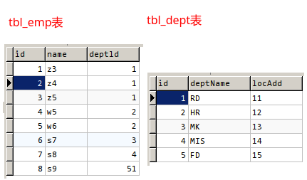
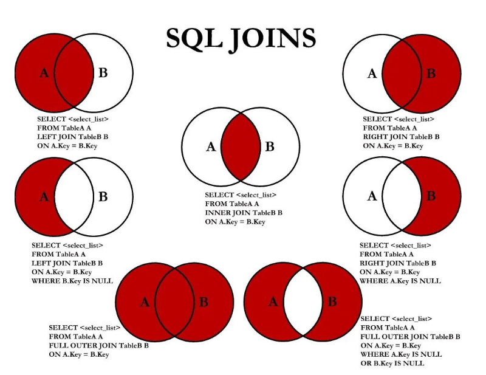
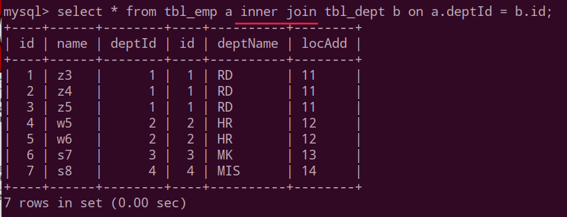
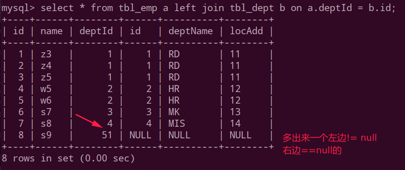
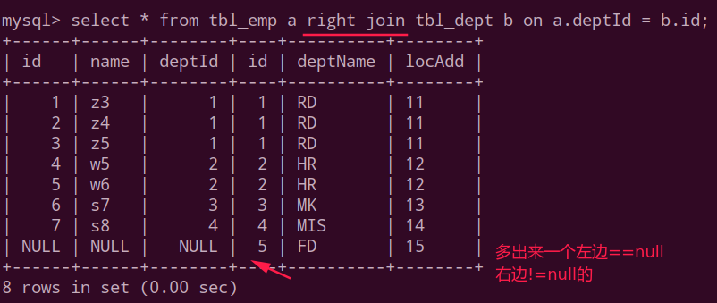
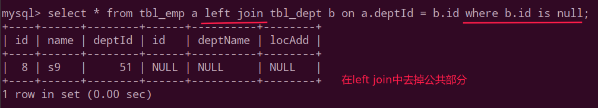
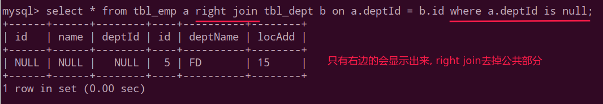
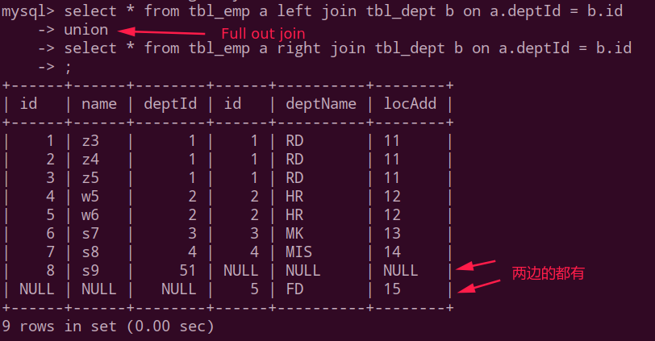
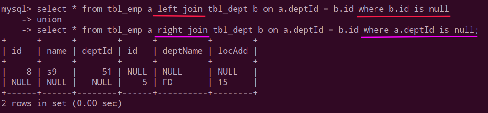

## 七种inner join

先给出案例表:

 

七种查询总结图:

第一种`inner join`:

第二种`left join`:

第三种`right join`:

第四种`left join where b.id is null`:

第五种`right join where a.deptId is null`:

第六种`FULL OUT JOIN`:  (使用`union`实现并集和去重)

第七种: `a、b两者的独有`:

