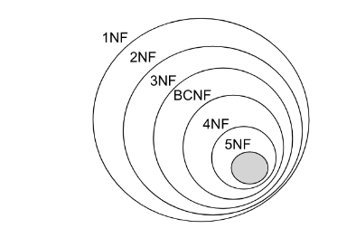
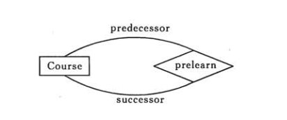
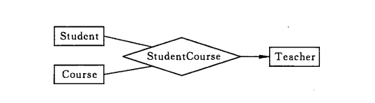
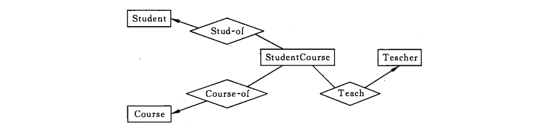

# 关系数据库设计理论

转: https://github.com/CyC2018/CS-Notes/blob/master/docs/notes/%E6%95%B0%E6%8D%AE%E5%BA%93%E7%B3%BB%E7%BB%9F%E5%8E%9F%E7%90%86.md#%E5%87%BD%E6%95%B0%E4%BE%9D%E8%B5%96

## 函数依赖

记 A->B 表示 A 函数决定 B，也可以说 B 函数依赖于 A。

如果 {A1，A2，... ，An} 是关系的一个或多个属性的集合，该集合函数决定了关系的其它所有属性并且是最小的，那么该集合就称为键码。

**对于 A->B，如果能找到 A 的真子集 A'，使得 A'-> B，那么 A->B 就是部分函数依赖**，否则就是完全函数依赖。

对于 A->B，B->C，则 A->C 是一个传递函数依赖。

## 异常

以下的学生课程关系的函数依赖为 Sno, Cname -> Sname, Sdept, Mname, Grade，键码为 {Sno, Cname}。也就是说，确定学生和课程之后，就能确定其它信息。

| Sno  | Sname  | Sdept  | Mname  | Cname  | Grade |
| ---- | ------ | ------ | ------ | ------ | ----- |
| 1    | 学生-1 | 学院-1 | 院长-1 | 课程-1 | 90    |
| 2    | 学生-2 | 学院-2 | 院长-2 | 课程-2 | 80    |
| 2    | 学生-2 | 学院-2 | 院长-2 | 课程-1 | 100   |
| 3    | 学生-3 | 学院-2 | 院长-2 | 课程-2 | 95    |

不符合范式的关系，会产生很多异常，主要有以下四种异常：

- **冗余数据**：例如 `学生-2` 出现了两次。
- 修改异常：修改了一个记录中的信息，但是另一个记录中相同的信息却没有被修改。
- 删除异常：删除一个信息，那么也会丢失其它信息。例如删除了 `课程-1` 需要删除第一行和第三行，那么 `学生-1` 的信息就会丢失。
- 插入异常：例如想要插入一个学生的信息，如果这个学生还没选课，那么就无法插入。

## 范式

范式理论是为了解决以上提到四种异常。

高级别范式的依赖于低级别的范式，1NF 是最低级别的范式。

  
> 范式
> * 1NF ： 符合1NF的关系中的每个属性都不可再分
> * 2NF： 属性完全依赖于主键 [ **消除部分子函数依赖**]
> * 3NF：属性不依赖于其它非主属性[ **消除传递依赖**]
> * BCNF：在1NF基础上，任何非主属性不能对主键子集依赖[在 3NF基础上消除对主码子集的依赖]
> * 4NF：要求把同一表内的多对多关系删除。
> * 5NF：从最终结构重新建立原始结构

### 1. 第一范式 (1NF)

属性不可分。

### 2. 第二范式 (2NF)

每个非主属性**完全函数依赖**于键码。

可以通过分解来满足。

**分解前** 

| Sno  | Sname  | Sdept  | Mname  | Cname  | Grade |
| ---- | ------ | ------ | ------ | ------ | ----- |
| 1    | 学生-1 | 学院-1 | 院长-1 | 课程-1 | 90    |
| 2    | 学生-2 | 学院-2 | 院长-2 | 课程-2 | 80    |
| 2    | 学生-2 | 学院-2 | 院长-2 | 课程-1 | 100   |
| 3    | 学生-3 | 学院-2 | 院长-2 | 课程-2 | 95    |

以上学生课程关系中，`{Sno, Cname} `为键码，有如下函数依赖：

- `Sno -> Sname, Sdept`；
- `Sdept -> Mname`；
- `Sno, Cname-> Grade`；

Grade 完全函数依赖于键码，它没有任何冗余数据，每个学生的每门课都有特定的成绩。

Sname, Sdept 和 Mname 都部分依赖于键码，当一个学生选修了多门课时，这些数据就会出现多次，造成大量冗余数据。

**分解后** 

关系-1

| Sno  | Sname  | Sdept  | Mname  |
| ---- | ------ | ------ | ------ |
| 1    | 学生-1 | 学院-1 | 院长-1 |
| 2    | 学生-2 | 学院-2 | 院长-2 |
| 3    | 学生-3 | 学院-2 | 院长-2 |

有以下函数依赖：

- `Sno -> Sname, Sdept	`
- `Sdept -> Mname`

关系-2

| Sno  | Cname  | Grade |
| ---- | ------ | ----- |
| 1    | 课程-1 | 90    |
| 2    | 课程-2 | 80    |
| 2    | 课程-1 | 100   |
| 3    | 课程-2 | 95    |

有以下函数依赖：

- `Sno, Cname -> Grade`

### 3. 第三范式 (3NF)

**非主属性不传递函数依赖于键码**。

上面的 关系-1 中存在以下传递函数依赖：

- `Sno -> Sdept -> Mname`

可以进行以下分解：

关系-11

| Sno  | Sname  | Sdept  |
| ---- | ------ | ------ |
| 1    | 学生-1 | 学院-1 |
| 2    | 学生-2 | 学院-2 |
| 3    | 学生-3 | 学院-2 |

关系-12

| Sdept  | Mname  |
| ------ | ------ |
| 学院-1 | 院长-1 |
| 学院-2 | 院长-2 |

# 八、ER 图

Entity-Relationship，有三个组成部分：实体、属性、联系。

用来进行关系型数据库系统的概念设计。

## 实体的三种联系

包含一对一，一对多，多对多三种。

- 如果 A 到 B 是一对多关系，那么画个带箭头的线段指向 B；
- 如果是一对一，画两个带箭头的线段；
- 如果是多对多，画两个不带箭头的线段。

下图的 Course 和 Student 是一对多的关系。

 
## 表示出现多次的关系

一个实体在联系出现几次，就要用几条线连接。

下图表示一个课程的先修关系，先修关系出现两个 Course 实体，第一个是先修课程，后一个是后修课程，因此需要用两条线来表示这种关系。

 
## 联系的多向性

虽然老师可以开设多门课，并且可以教授多名学生，但是对于特定的学生和课程，只有一个老师教授，这就构成了一个三元联系。

 

一般只使用二元联系，可以把多元联系转换为二元联系。

## 表示子类

用一个三角形和两条线来连接类和子类，与子类有关的属性和联系都连到子类上，而与父类和子类都有关的连到父类上。

 
