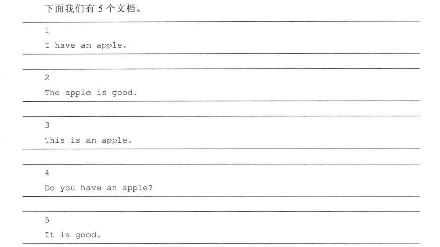
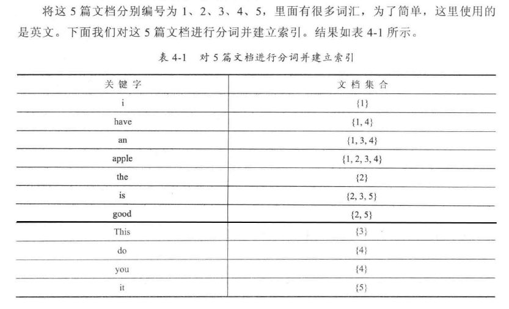

# 倒排索引

b站有一个小视频解释: https://www.bilibili.com/video/av48419102

倒排索引的英文是Inverted Index。比如有一个文档列表，每个文档都会有唯一的ID，我们会以这个ID作为索引去获取文档的具体信息。但是一般我们在查找一个文档的时候并不知道其ID是什么，只知道大概想搜索什么内容，所以我们输入一些关键字，和搜索引擎一样进行搜索。

这时，我们把文档中的关键字做为索引，而不是ID，比如标记“中国”这个词在哪些文档中出现过，给这些关腱字做索引，可能通过“中国”这个词获取了1、5、11、24这几个ID的文档，再根据ID去获取文档：或者直接根据关键字获取文档。

我们在进行文章搜索时，希望搜索内容优先匹配标题，其次匹配文章内容，也就是相关度。我们还可以对两种内容分别索引，再根据所谓的相关度进行显示。这时我们建立的这个索引是倒排索引。

举个例子

可以发现，每个词汇都对应一些文档。有了这个索引表，我们在输入一些词汇后，只需对这些索引的结果取并集就可以了。还有一点需要注意，对于英文来说，虽然单词是This，但是我们做索引的时候应该不区分大小写，不管输入this还是this等，都能搜索出this才对。当然，每个关键字对应的文档集合可以用不同的数据结构来存储。

