# ElasticSearch

## 一、基本概念和优势

1、ES相对于数据库的优势

1)、搜索比数据库快。ES有分片的概念，一个大的索引会被分成多个分片来进行存储数据，使用分布式的架构**对分片进行并行搜索**(基于倒排) 传统数据库的遍历，属于正向全表扫描 （数据库比如要搜索的话 `%xxx%`这种，会进行全表扫描）

2)、数据库不能将搜索词拆分开来，尽可能搜索更多你期望的结果。比如输入"生化机"，就搜索不出来"生化危机"

> ES应用场景:
>
> 检索：ES本身作为一个搜索引擎，用来处理检索的任务再合适不过。
>
> 统计(数据分析)： ES的统计也是基于检索功能的，聚合功能使得统计结果处理起来非常方便。如果你只需要统计而不用检索，可能有其他工具更适合你，比如Spark SQL。
>
> 分布式(近实时): ES自动可以将海量数据分散到多台服务器上去存储和检索。（lucene是单机的）

全文检索，倒排索引：

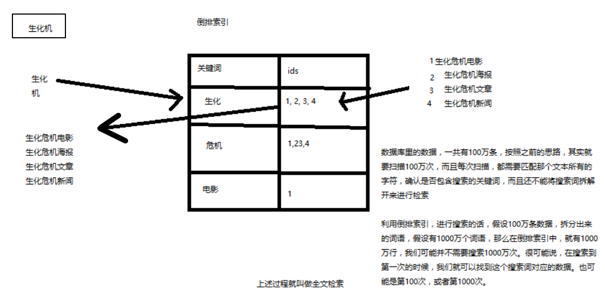

分布式和集群管理:

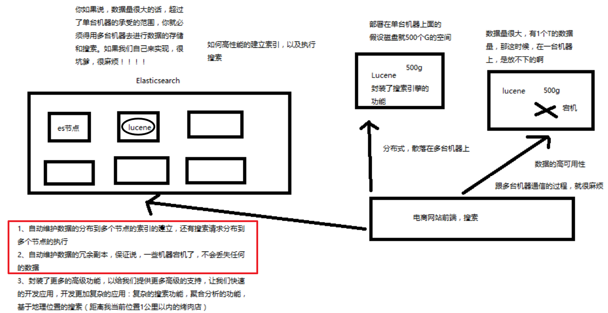

几个核心概念:

1）Cluster：集群，包含多个节点，每个节点属于哪个集群是通过一个配置（集群名称，默认是elasticsearch）来决定的，对于中小型应用来说，刚开始一个集群就一个节点很正常

2）Node：节点，集群中的一个节点，节点也有一个名称（默认是随机分配的），节点名称很重要（在执行运维管理操作的时候），默认节点会去加入一个名称为"elasticsearch"的集群，如果直接启动一堆节点，那么它们会自动组成一个elasticsearch集群，当然一个节点也可以组成一个elasticsearch集群

3）shard：**单台机器无法存储大量数据，es可以将一个索引中的数据切分为多个shard，分布在多台服务器上存储。有了shard就可以横向扩展，存储更多数据，让搜索和分析等操作分布到多台服务器上去执行，提升吞吐量和性能。每个shard都是一个lucene index**。

4）replica：任何一个服务器随时可能故障或宕机，此时shard可能就会丢失，因此可以为每个shard创建多个replica副本。replica可以在shard故障时提供备用服务，保证数据不丢失，多个replica还可以提升搜索操作的吞吐量和性能。primary shard（建立索引时一次设置，不能修改，默认5个），replica shard（随时修改数量，默认1个），默认每个索引10个shard，5个primary shard，5个replica shard，最小的高可用配置，是2台服务器。

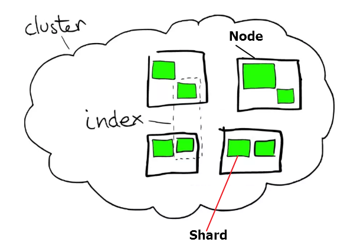


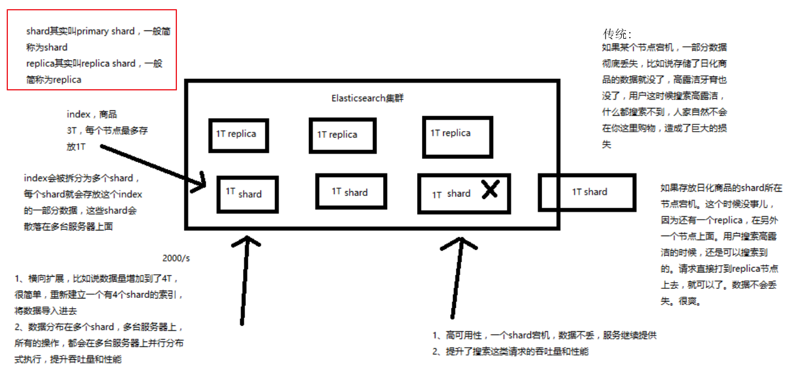

## 二、分布式架构、分片、容错

1、Elasticsearch对复杂分布式机制的透明隐藏特性，Elasticsearch是一套分布式的系统，分布式是为了应对大数据量隐藏了复杂的分布式机制

* 分片机制（我们之前随随便便就将一些document插入到es集群中去了，我们有没有care过数据怎么进行分片的，数据到哪个shard中去）

* cluster discovery（集群发现机制，我们之前在做那个集群status从yellow转green的实验里，直接启动了第二个es进程，那个进程作为一个node自动就发现了集群，并且加入了进去，还接受了部分数据，replica shard）

* shard负载均衡（举例，假设现在有3个节点，总共有25个shard要分配到3个节点上去，es会自动进行均匀分配，以保持每个节点的均衡的读写负载请求）

* shard副本，请求路由，集群扩容，shard重分配


**master节点**

（1）创建或删除索引

（2）增加或删除节点

**节点平等的分布式架构**

1）节点对等，每个节点都能接收所有的请求

2）自动请求路由

3）响应收集

**shard&replica机制再次梳理**

1）index包含多个shard

2）每个shard都是一个最小工作单元，承载部分数据，lucene实例，完整的建立索引和处理请求的能力

3）增减节点时，shard会自动在nodes中负载均衡

4）primary shard和replica shard，每个document肯定只存在于某一个primary shard以及其对应的replica shard中，不可能存在于多个primary shard

5）replica shard是primary shard的副本，负责容错，以及承担读请求负载

6）primary shard的数量在创建索引的时候就固定了，replica shard的数量可以随时修改

7）primary shard的默认数量是5，replica默认是1，默认有10个shard，5个primary shard，5个replica shard

8）primary shard不能和自己的replica shard放在同一个节点上（否则节点宕机，primary shard和副本都丢失，

起不到容错的作用），但是可以和其他primary shard的replica shard放在同一个节点上

**图解单node环境下创建index是什么样子的**

1）单node环境下，创建一个index，有3个primary shard，3个replica shard

2）集群status是yellow

3）这个时候，只会将3个primary shard分配到仅有的一个node上去，另外3个replica shard是无法分配的

4）集群可以正常工作，但是一旦出现节点宕机，数据全部丢失，而且集群不可用，无法承接任何请求

```java
PUT /test_index
{
   "settings" : {
      "number_of_shards" : 3,
      "number_of_replicas" : 1
   }
}
```

**图解2个node环境下replica shard是如何分配的**

1）replica shard分配

2）primary ---> replica同步

3）读请求：primary/replica

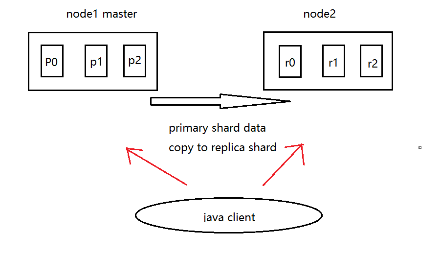

**图解横向扩容过程，如何超出扩容极限，以及如何提升容错性**

1）primary&replica自动负载均衡，6个shard，3 primary，3 replica

2）每个node有更少的shard，IO/CPU/Memory资源给每个shard分配更多，每个shard性能更好

3）扩容的极限，6个shard（3 primary，3 replica），最多扩容到6台机器，每个shard可以占用单台服务器的所有资源，性能最好	

4）超出扩容极限，动态修改replica数量，9个shard（3 primary，6 replica），扩容到9台机器，比3台机器时，拥有3倍的读吞吐量

5）3台机器下，9个shard（3 primary，6 replica），资源更少，但是容错性更好，最多容纳2台机器宕机，6个shard只能容纳0台机器宕机

6）这里的这些知识点，你综合起来看，就是说，一方面告诉你扩容的原理，怎么扩容，怎么提升系统整体吞吐量；另一方面要考虑到系统的容错性，怎么保证提高容错性，让尽可能多的服务器宕机，保证数据不丢失

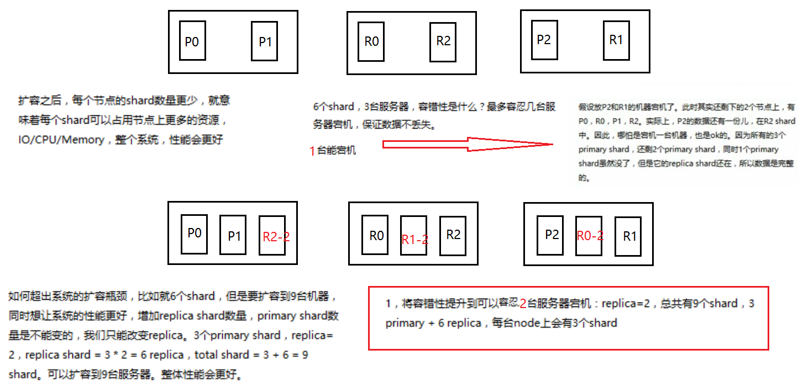

**图解Elasticsearch容错机制：master选举，replica容错，数据恢复**

1）9 shard，3 node

2）master node宕机，自动master选举，red

3）replica容错：新master将replica提升为primary shard，yellow

4）重启宕机node，master copy replica到该node，使用原有的shard并同步宕机后的修改，green

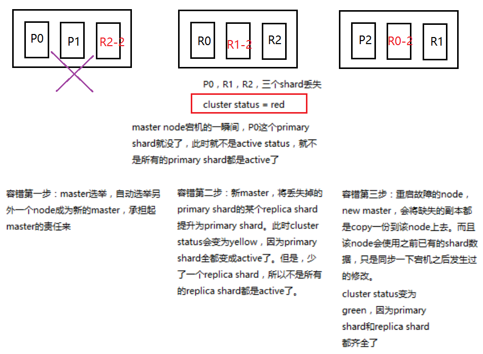

## 三、核心元数据

**_index元数据**

1）代表一个document存放在哪个index中

2）类似的数据放在一个索引，非类似的数据放不同索引：product index（包含了所有的商品），sales index（包含了所有的商品销售数据），inventory index（包含了所有库存相关的数据）。如果你把比如product，sales，human resource（employee），全都放在一个大的index里面，比如说company index，不合适的。

3）index中包含了很多类似的document：类似是什么意思，其实指的就是说，这些document的fields很大一部分是相同的，你说你放了3个document，每个document的fields都完全不一样，这就不是类似了，就不太适合放到一个index里面去了。

**_id元数据**

1）代表document的唯一标识，与index和type一起，可以唯一标识和定位一个document

2）我们可以手动指定document的id（put /index/type/id），也可以不指定，由es自动为我们创建一个id

**手动制定_id和自动生成_id**

手动指定document id

1）根据应用情况来说，是否满足手动指定document id的前提：

一般来说，是从某些其他的系统中，导入一些数据到es时，会采取这种方式，就是使用系统中已有数据的唯一标识，作为es中document的id。如果将数据导入到es中，此时就比较适合采用数据在数据库中已有的primary key。

2）自动生成的id，长度为20个字符，URL安全，base64编码，**GUID，分布式系统并行生成时不可能会发生冲突**

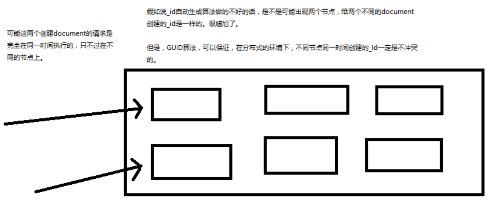

**document的全量替换、强制创建和lazy delete机制**

1、document的全量替换

1）语法与创建文档是一样的，如果document id不存在，那么就是创建；如果document id已经存在，那么就是全量替换操作，替换document的json串内容

2）document是不可变的，如果要修改document的内容，第一种方式就是全量替换，直接对document重新建立索引，替换里面所有的内容

3）es会将老的document标记为deleted，然后新增我们给定的一个document，当我们创建越来越多的document的时候，es会在适当的时机在后台自动删除标记为deleted的document

2、document的强制创建

1）创建文档与全量替换的语法是一样的，有时我们只是想新建文档，不想替换文档，如果强制进行创建呢？

2）PUT /index/type/id?op_type=create，PUT /index/type/id/_create

3、document的删除

1）DELETE /index/type/id

2）**不会理解物理删除，只会将其标记为deleted，当数据越来越多的时候，在后台自动删除**

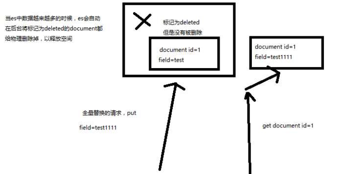

## 四、并发、partial update

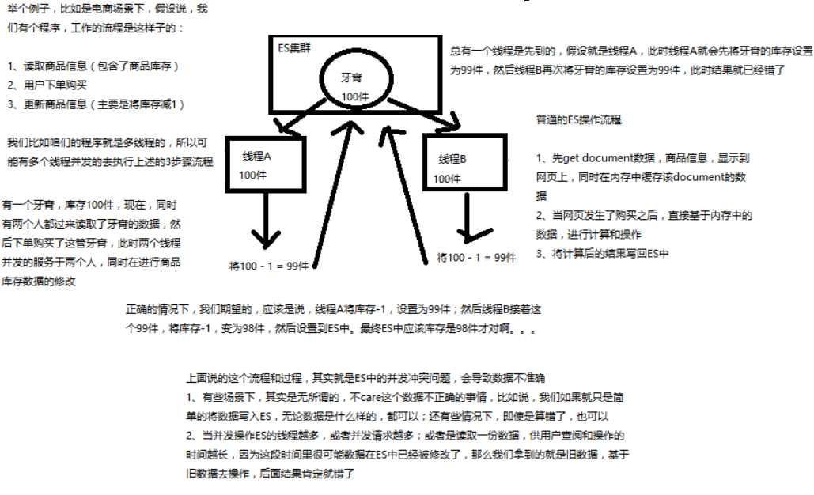

ES使用乐观锁(版本号):

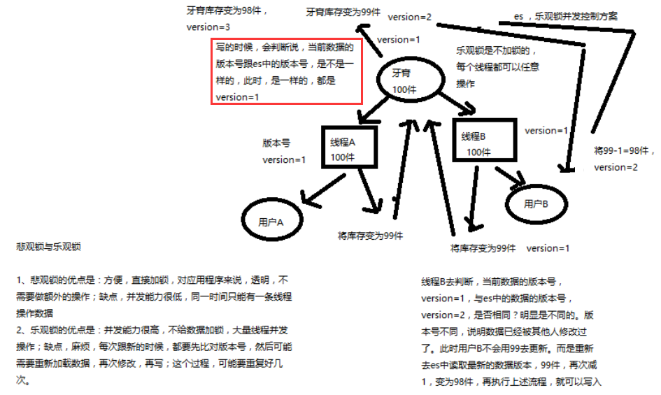

**_version的变换**

* 第一次创建一个document的时候，它的_version内部版本号就是1；以后，每次对这个document执行修改或者删除操作，都会对这个_version版本号自动加1；哪怕是删除，也会对这条数据的版本号加1
* 我们会发现，在删除一个document之后，可以从一个侧面证明，它不是立即物理删除掉的，因为它的一些版本号等信息还是保留着的。先删除一条document，再重新创建这条document，其实会在delete version基础之上，再把version号加1

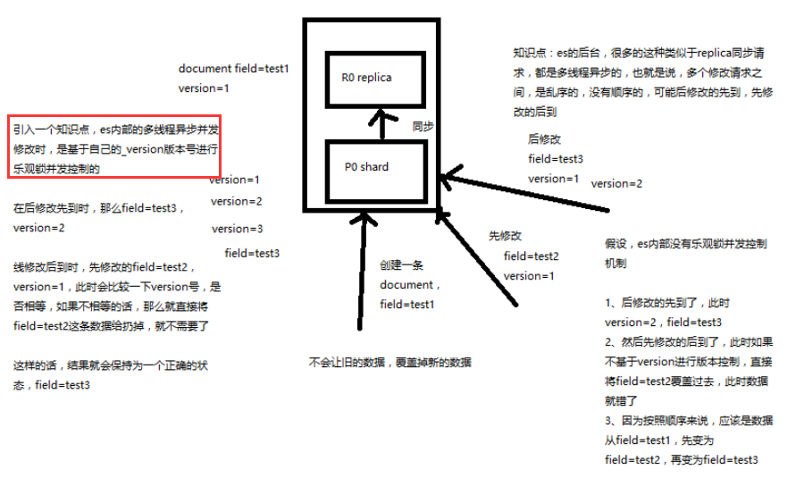

**基于_version并发实战(访问的带上_version)**

```java
1、上机动手实战演练基于_version进行乐观锁并发控制

（1）先构造一条数据出来

PUT /test_index/test_type/7
{
  "test_field": "test test"
}

（2）模拟两个客户端，都获取到了同一条数据

GET test_index/test_type/7

{
  "_index": "test_index",
  "_type": "test_type",
  "_id": "7",
  "_version": 1,
  "found": true,
  "_source": {
    "test_field": "test test"
  }
}

（3）其中一个客户端，先更新了一下这个数据

同时带上数据的版本号，确保说，es中的数据的版本号，跟客户端中的数据的版本号是相同的，才能修改

PUT /test_index/test_type/7?version=1 
{
  "test_field": "test client 1"
}

{
  "_index": "test_index",
  "_type": "test_type",
  "_id": "7",
  "_version": 2,
  "result": "updated",
  "_shards": {
    "total": 2,
    "successful": 1,
    "failed": 0
  },
  "created": false
}

（4）另外一个客户端，尝试基于version=1的数据去进行修改，同样带上version版本号，进行乐观锁的并发控制

PUT /test_index/test_type/7?version=1 
{
  "test_field": "test client 2"
}

{
  "error": {
    "root_cause": [
      {
        "type": "version_conflict_engine_exception",
        "reason": "[test_type][7]: version conflict, current version [2] is different than the one provided [1]",
        "index_uuid": "6m0G7yx7R1KECWWGnfH1sw",
        "shard": "3",
        "index": "test_index"
      }
    ],
    "type": "version_conflict_engine_exception",
    "reason": "[test_type][7]: version conflict, current version [2] is different than the one provided [1]",
    "index_uuid": "6m0G7yx7R1KECWWGnfH1sw",
    "shard": "3",
    "index": "test_index"
  },
  "status": 409
}

（5）在乐观锁成功阻止并发问题之后，尝试正确的完成更新

GET /test_index/test_type/7

{
  "_index": "test_index",
  "_type": "test_type",
  "_id": "7",
  "_version": 2,
  "found": true,
  "_source": {
    "test_field": "test client 1"
  }
}

基于最新的数据和版本号，去进行修改，修改后，带上最新的版本号，可能这个步骤会需要反复执行好几次，才能成功，特别是在多线程并发更新同一条数据很频繁的情况下

PUT /test_index/test_type/7?version=2 
{
  "test_field": "test client 2"
}

{
  "_index": "test_index",
  "_type": "test_type",
  "_id": "7",
  "_version": 3,
  "result": "updated",
  "_shards": {
    "total": 2,
    "successful": 1,
    "failed": 0
  },
  "created": false
}


```

还有一个基于`external_version`的，这个是用户自定义的`_version`，只要比ES中的`_version`大就可以了。

**Partial Update**

PUT /index/type/id，创建文档&替换文档，就是一样的语法

一般对应到应用程序中，每次的执行流程基本是这样的：

1）应用程序先发起一个get请求，获取到document，展示到前台界面，供用户查看和修改

2）用户在前台界面修改数据，发送到后台

3）后台代码，会将用户修改的数据在内存中进行执行，然后封装好修改后的全量数据

4）然后发送PUT请求，到es中，进行全量替换

5）es将老的document标记为deleted，然后重新创建一个新的document

```java

partial update

post /index/type/id/_update 
{
   "doc": {
      "要修改的少数几个field即可，不需要全量的数据"
   }
}

```

看起来，好像就比较方便了，每次就传递少数几个发生修改的field即可，不需要将全量的document数据发送过去

**partial update实现原理以及其优点**

* 所有的查询、修改、和写回操作，都发生在es中的一个shard内部，避免了所有的网络数据传输的开销(减少了2次网络情况)，大大提高了性能；
* 减少了查询和修改中的时间间隔，可以有效减少并发冲突情况；