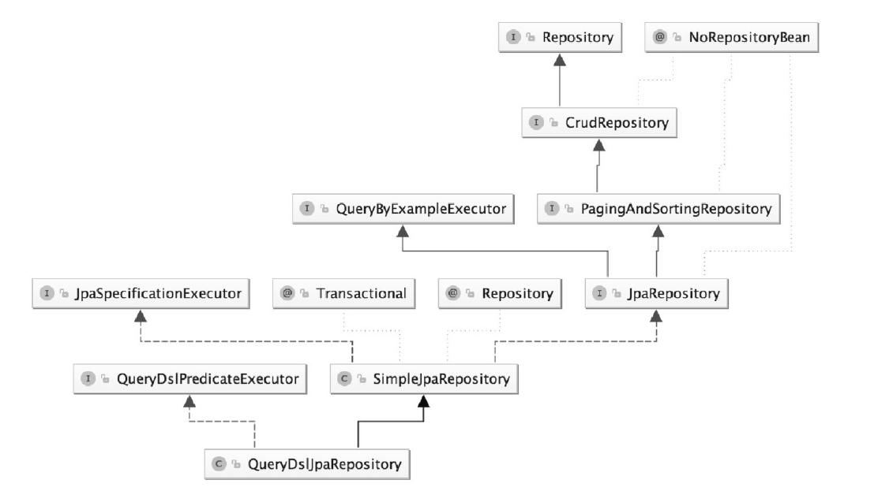

# SpringData

七个Repository接口：

* Repository
* CrudRepository 
* PagingAndSortingRepository 
* QueryByExampleExecutor
* JpaRepository
* JpaSpecificationExecutor
* QueryDslPredicateExecutor

两个实现类:

* SimpleJpaRepository
* QueryDslJpaRepository

底层的封装类:

* EntityManager (javax.persistence)
* EntityManagerImpl (org.hibernate.jpa.internal)

关系结构图:

