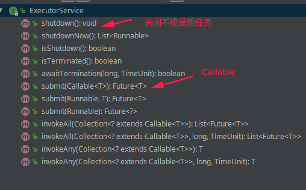
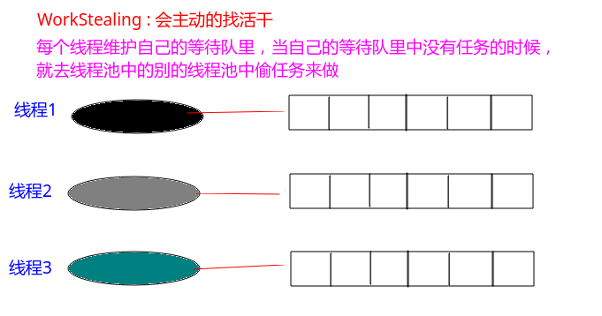
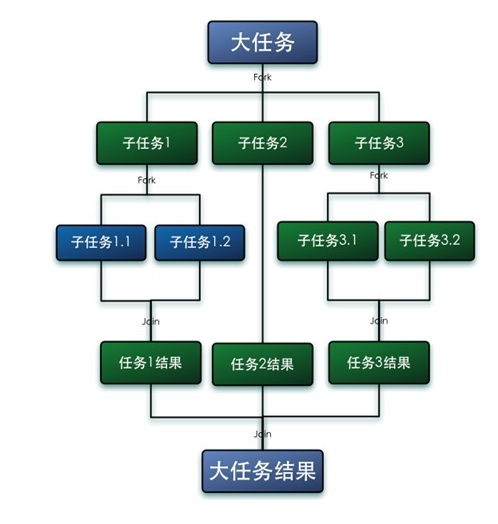
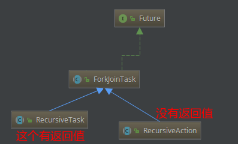
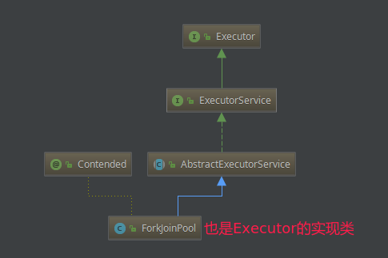
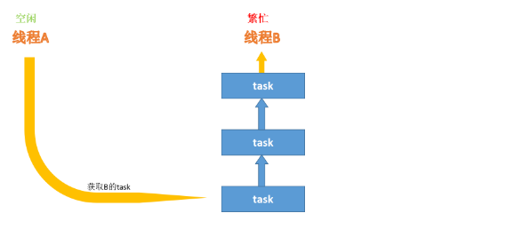
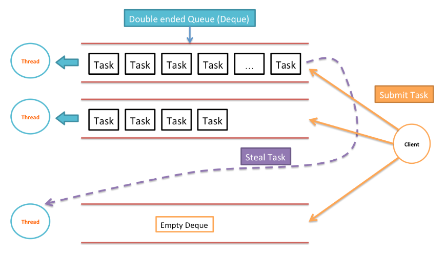

## 三、Executor线程池框架

> 参考文章:
>
> https://www.cnblogs.com/zhujiabin/p/5404771.html
>
> http://wiki.jikexueyuan.com/project/java-concurrency/executor.html
>
> https://www.cnblogs.com/dolphin0520/p/3949310.html

Executor 框架是 Java 5 中引入的，其内部使用了线程池机制，它在 java.util.cocurrent 包下，通过该框架来控制线程的启动、执行和关闭，**可以简化并发编程的操作**。因此，在 Java 5之后，通过 Executor 来启动线程比使用 Thread 的 start 方法更好，除了更易管理，效率更好（用线程池实现，节约开销）外，还有关键的一点：**有助于避免 this 逃逸问题——如果我们在构造器中启动一个线程，因为另一个任务可能会在构造器结束之前开始执行，此时可能会访问到初始化了一半的对象用 Executor 在构造器中**。

Executor 框架包括：线程池，`Executor，Executors，ExecutorService，CompletionService，Future，Callable` 等。

### 1、Executor和ExecutorService

Executor 接口中之定义了一个方法 execute（Runnable command），该方法接收一个 Runable 实例，它用来执行一个任务，任务即一个实现了 Runnable 接口的类。ExecutorService 接口继承自 Executor 接口，它提供了更丰富的实现多线程的方法，比如，ExecutorService 提供了关闭自己的方法，以及可为跟踪一个或多个异步任务执行状况而生成 Future 的方法。 可以调用 ExecutorService 的 `shutdown()`方法来平滑地关闭ExecutorService，调用该方法后，**将导致 ExecutorService 停止接受任何新的任务且等待已经提交的任务执行完成**(已经提交的任务会分两类：一类是已经在执行的，另一类是还没有开始执行的)，当所有已经提交的任务执行完毕后将会关闭 ExecutorService。因此我们一般用该接口来实现和管理多线程。

ExecutorService 的生命周期包括三种状态：运行、关闭、终止。创建后便进入运行状态，当调用了 `shutdown()`方法时，便进入关闭状态，此时意味着 ExecutorService 不再接受新的任务，但它还在执行已经提交了的任务，当素有已经提交了的任务执行完后，便到达终止状态。如果不调用` shutdown()`方法，ExecutorService 会一直处在运行状态，不断接收新的任务，执行新的任务，服务器端一般不需要关闭它，保持一直运行即可。

```java
public class T01_MyExecutor implements Executor {

    @Override
    public void execute(Runnable command) {
        command.run();
//        new Thread(command).start();
    }

    public static void main(String[] args){
        new T01_MyExecutor().execute(() -> System.out.println("hello executor"));
    }
}

```

关于ExecutorService (继承自Executor接口):

```java
public class T02_ExecutorService /**implements ExecutorService*/ {

}
```

接口中的相关方法:



### 2、Callable

关于Callable接口:

看源码说的很清楚，支持:

* 返回值；(Runnable不支持)
* 抛出受检查异常；

```java
@FunctionalInterface
public interface Callable<V> {
    /**
     * Computes a result, or throws an exception if unable to do so.
     *
     * @return computed result
     * @throws Exception if unable to compute a result
     */
    V call() throws Exception;
}

```

怎么使用Callable呢？一般情况下是配合ExecutorService来使用的，在ExecutorService接口中声明了若干个submit方法的重载版本：

```java
<T> Future<T> submit(Callable<T> task);
<T> Future<T> submit(Runnable task, T result);
Future<?> submit(Runnable task);
```

看个案例:

```java
/**
 * 特点:
 *  1. 有返回值、支持泛型
 *  2. 可以抛出检查异常 (Runnable只支持抛出运行异常)
 *
 *  如果没有返回值没有抛出检查异常，建议使用Runnable
 *
 * FutureTask 和 RunnableFuture
 *  public class FutureTask<V> implements RunnableFuture<V> {
 *  }
 *  public interface RunnableFuture<V> extends Runnable, Future<V> {
 *      void run();
 *  }
 */
public class T03_Callable {

    static class RandomCallable implements Callable<Integer>{

        @Override
        public Integer call() throws Exception {
            Thread.sleep(3000);
            return new Random().nextInt(10);
        }
    }

    public static void main(String[] args) throws ExecutionException, InterruptedException {
        // 创建一个Callable对象
        Callable<Integer> callable = new RandomCallable();

        FutureTask<Integer>task = new FutureTask<>(callable);

        Thread t = new Thread(task);

        // 启动线程
        t.start();

        // 得到返回值
        System.out.println(task.isDone());  //true
        Integer result = task.get(); // 阻塞式的，里面sleep了，所以要等待
        System.out.println(task.isDone()); // true
        System.out.println(result);
    }
}
```

输出:

```java
false
true
9
```

### 3、Executors

`Executors` 能够异步的执行任务，并且通常管理一个线程池。这样我们就不用手动的去创建线程了，线程池中的所有线程都将被重用。从而可以在一个 `executorservice` 的整个应用程序生命周期中运行尽可能多的并发任务。

 使用Executors来实现线程池管理:

```java
public class T04_ThreadPool {

    public static void main(String[] args) throws InterruptedException {
        // 创建一个线程池，里面有5个线程
        ExecutorService service = Executors.newFixedThreadPool(5); //使用Executors的方法创建Executor服务

        // 放入6个任务 , 势必有一个任务要等待， --> 且有一个线程要执行两个任务
        for (int i = 0; i < 6; i++) {
            service.execute(() -> { // service.execute(Runnable command)
                try {
                    TimeUnit.MILLISECONDS.sleep(500);
                } catch (InterruptedException e) {
                    e.printStackTrace();
                }
                System.out.println(Thread.currentThread().getName());
            });
        }

        System.out.println(service);
        service.shutdown(); // 等待已经放入的任务执行结束,就会关闭
        System.out.println(service.isTerminated()); // 是否结束了，没有，还在等待已经放入的线程结束
        System.out.println(service.isShutdown());   // 是否正在关闭：是的
        System.out.println(service);

        // 5秒之后，就真的结束了
        TimeUnit.SECONDS.sleep(5);
        System.out.println(service.isTerminated());
        System.out.println(service.isShutdown());
        System.out.println(service);
    }
}

```

输出:


### 4、Future

Future就是对于具体的Runnable或者Callable任务的执行结果进行取消、查询是否完成、获取结果。

Future提供了三种功能：

* 1）判断任务是否完成；
* 2）能够中断任务；
* 3）能够获取任务执行结果。

**因为Future只是一个接口，所以是无法直接用来创建对象使用的，因此就有了FutureTask**。

查看Future源码:

```java
public interface Future<V> {

    boolean cancel(boolean mayInterruptIfRunning);

    boolean isCancelled();

    /**
     * Returns {@code true} if this task completed.
     */
    boolean isDone();

    /**
     * Waits if necessary for the computation to complete, and then
     * retrieves its result.
     */
    V get() throws InterruptedException, ExecutionException;

    /**
     * Waits if necessary for at most the given time for the computation
     * to complete, and then retrieves its result, if available.
     */
    V get(long timeout, TimeUnit unit)
        throws InterruptedException, ExecutionException, TimeoutException;
}

```

> 方法作用:
>
> - cancel方法用来取消任务，如果取消任务成功则返回true，如果取消任务失败则返回false。参数mayInterruptIfRunning表示**是否允许取消正在执行却没有执行完毕的任务，如果设置true，则表示可以取消正在执行过程中的任务**。如果任务已经完成，则无论mayInterruptIfRunning为true还是false，此方法肯定返回false，即如果取消已经完成的任务会返回false；如果任务正在执行，若mayInterruptIfRunning设置为true，则返回true，若mayInterruptIfRunning设置为false，则返回false；如果任务还没有执行，则无论mayInterruptIfRunning为true还是false，肯定返回true。
> - isCancelled方法表示任务是否被取消成功，如果在任务正常完成前被取消成功，则返回 true。
> - isDone方法表示任务是否已经完成，若任务完成，则返回true；
> - get()方法用来获取执行结果，**这个方法会产生阻塞，会一直等到任务执行完毕才返回**；
> - get(long timeout, TimeUnit unit)用来获取执行结果，如果在指定时间内，还没获取到结果，就直接返回null。

### 5、FutureTask

**FutureTask是Future接口的一个唯一实现类**。

我们先来看一下FutureTask的实现：

```java
public class FutureTask<V> implements RunnableFuture<V> {
}
```

FutureTask类实现了RunnableFuture接口，我们看一下RunnableFuture接口的实现：

```java
public interface RunnableFuture<V> extends Runnable, Future<V> {
    /**
     * Sets this Future to the result of its computation
     * unless it has been cancelled.
     */
    void run();
}
```

**可以看出RunnableFuture继承了Runnable接口和Future接口，而FutureTask实现了RunnableFuture接口。所以它既可以作为Runnable被线程执行，又可以作为Future得到Callable的返回值**。

FutureTask提供了2个构造器：

```java
public FutureTask(Callable<V> callable) {
}
public FutureTask(Runnable runnable, V result) {
}
```

例子: 下面部分是使用`Future`接收`ExecuteService`的submit(Callable)接口的返回值的。

```java
public class T05_Future {

    public static void main(String[] args) throws InterruptedException, ExecutionException {

        // 这个就是 和上面那个随机数 RandomCallable一样
        FutureTask<Integer> task = new FutureTask<>(()->{
            TimeUnit.MILLISECONDS.sleep(2000);
            return new Random().nextInt(10);
        }); //new Callable () { Integer call();}

        new Thread(task).start();

        System.out.println(task.get()); //阻塞

        // Future  可以用来接收 submit(Callable) 返回的结果
        //*******************************

        ExecutorService service = Executors.newFixedThreadPool(5);
        Future<Integer> f = service.submit(()->{
            TimeUnit.MILLISECONDS.sleep(2000);
            return new Random().nextInt(100);
        });
        System.out.println(f.get());
        System.out.println(f.isDone());

        service.shutdown(); // 关闭service 不然一直不会关闭
    }
}

```

写一个小应用:

使用并行计算`0~20000`的素数:

```java
public class T06_ParallelComputing {

    public static void main(String[] args) throws InterruptedException, ExecutionException {
        long start = System.currentTimeMillis();
        List<Integer> primes = getPrime(1, 200000);
        long end = System.currentTimeMillis();
        System.out.println("time elapsed: " + (end - start));
//        System.out.println(primes);

        System.out.println("------------------------------------");


        // 上面是普通的计算方法  下面是使用并行计算,会快一些

        final int cpuCoreNum = 4; // 四个线程，一般 >= CPU核数
        ExecutorService service = Executors.newFixedThreadPool(cpuCoreNum);

        MyTask t1 = new MyTask(1, 80000); //1-5 5-10 10-15 15-20
        MyTask t2 = new MyTask(80001, 130000);
        MyTask t3 = new MyTask(130001, 170000);
        MyTask t4 = new MyTask(170001, 200000);
        Future<List<Integer>> f1 = service.submit(t1);
        Future<List<Integer>> f2 = service.submit(t2);
        Future<List<Integer>> f3 = service.submit(t3);
        Future<List<Integer>> f4 = service.submit(t4);
        start = System.currentTimeMillis();
        ArrayList<Integer>primes2 = new ArrayList<>();
        primes2.addAll(f1.get());
        primes2.addAll(f2.get());
        primes2.addAll(f3.get());
        primes2.addAll(f4.get());
        end = System.currentTimeMillis();
        System.out.println("time elapsed: " + (end - start));
//        System.out.println(primes2);
        service.shutdown();
    }

    static class MyTask implements Callable<List<Integer>> {
        int startPos, endPos;

        MyTask(int s, int e) {
            this.startPos = s;
            this.endPos = e;
        }

        @Override
        public List<Integer> call() throws Exception {
            List<Integer> r = getPrime(startPos, endPos);
            return r;
        }
    }

    static boolean isPrime(int num) {
        for (int i = 2; i <= Math.sqrt(num); i++)
            if (num % i == 0) return false;
        return true;
    }

    static List<Integer> getPrime(int start, int end) {
        List<Integer> results = new ArrayList<>();
        for (int i = start; i <= end; i++)
            if (isPrime(i)) results.add(i);
        return results;
    }
}
```

### 6、CachedPool

CachePool原理:

 * (1)当有线程来的时候且现在线程池的线程都在工作的时候，才创建新的线程，否则使用空闲的线程；
 * (2)默认的情况下，如果某个线程空闲超过60秒，就会自动结束；

代码:

```java
/**
 * CachePool原理:
 *  (1)当有线程来的时候且现在线程池的线程都在工作的时候，才创建新的线程，否则使用空闲的线程
 *  (2)默认的情况下，如果某个线程空闲超过60秒，就会自动结束
 */
public class T07_CachedPool {

    public static void main(String[] args) throws InterruptedException {

        ExecutorService service = Executors.newCachedThreadPool();
        System.out.println(service);

        for(int i = 0; i < 2; i++){
            service.execute(()->{
                try {
                    Thread.sleep(500);
                } catch (InterruptedException e) {
                    e.printStackTrace();
                }
                System.out.println(Thread.currentThread().getName()); // 默认pool-number-thread-number
            });
        }

        System.out.println(service);

        TimeUnit.SECONDS.sleep(4);

        System.out.println(service);
    }
}
```

### 7、SingleThreadPool

即在线程池中只有一个线程。

作用:**可以保证任务是顺序执行的**。

```java
/**
 * 在线程池中只有一个线程:
 * 有什么用？
 * 可以保证任务是顺序执行的。
 */
public class T08_SingleThreadPool {

    public static void main(String[] args) {
//        ExecutorService service = Executors.newFixedThreadPool(3); // 多个线程同时执行
        ExecutorService service = Executors.newSingleThreadExecutor(); //一个线程顺序执行
        for (int i = 0; i < 5; i++) {
            final int j = i;
            service.execute(() -> System.out.println(j + " " + Thread.currentThread().getName()));
        }
    }
}

```

### 7、ScheduledPool

ScheduledExecutorService比Timer更安全，功能更强大。

可以延迟和循环周期的执行:

```java
public class T09_ScheduledPool {

    public static void main(String[] args) {
        // 线程池中有5个线程
        ScheduledExecutorService scheduledPool = Executors.newScheduledThreadPool(5);
        // 延迟执行
//        scheduledPool.schedule(() -> System.out.println("delay 3 seconds"), 3, TimeUnit.SECONDS);
        // 循环周期执行
        scheduledPool.scheduleAtFixedRate(() ->
                    System.out.println(Thread.currentThread().getName() +
                            "  --->  delay 1 seconds, and excute every 3 seconds")
                ,
                1, 3, TimeUnit.SECONDS);
    }
}

```

输出:

```java
pool-1-thread-1  --->  delay 1 seconds, and excute every 3 seconds
pool-1-thread-1  --->  delay 1 seconds, and excute every 3 seconds
pool-1-thread-2  --->  delay 1 seconds, and excute every 3 seconds
pool-1-thread-1  --->  delay 1 seconds, and excute every 3 seconds
pool-1-thread-3  --->  delay 1 seconds, and excute every 3 seconds
pool-1-thread-3  --->  delay 1 seconds, and excute every 3 seconds
```

### 8、WorkStealingPool

基本原理:




注意 `WorkStealingPool`的线程是`Daemon`线程。只要虚拟机不结束，就会一直运行。

为什么呢?

**因为这样你有任务来了，它永远都会主动去拿**。

启动的时候，默认是CPU多少核，就启动多少个线程。

测试:

```java
public class T10_WorkStealingPool {

    static class R implements Runnable {
        int time;
        R(int t) {
            this.time = t;
        }
        @Override
        public void run() {
            try {
                TimeUnit.MILLISECONDS.sleep(time);
            } catch (InterruptedException e) {
                e.printStackTrace();
            }
            System.out.println(time + " " + Thread.currentThread().getName());
        }
    }

    public static void main(String[] args) throws Exception {
        ExecutorService service = Executors.newWorkStealingPool();
        System.out.println(Runtime.getRuntime().availableProcessors());

        service.execute(new R(1000));
        service.execute(new R(2000));
        service.execute(new R(2000));
        service.execute(new R(2000)); //daemon
        //关键在这里，最后一个线程一定是 第一个线程执行的，因为第一个线程是最先执行结束的，所以会去抢最后一个任务
        service.execute(new R(2000));

        //由于产生的是精灵线程（守护线程、后台线程），主线程不阻塞的话，看不到输出
        System.in.read();
    }
}
```

### 9、ForkJoinPool

> 参考文章:
>
> http://blog.dyngr.com/blog/2016/09/15/java-forkjoinpool-internals/
>
> https://www.cnblogs.com/shijiaqi1066/p/4631466.html

forkJoinPoll大体主要分为两个操作:

* `fork`操作的作用是把一个大的问题划分成若干个较小的问题。在这个划分过程一般是递归进行的。直到可以直接进行计算。需要恰当地选取子问题的大小。太大的子问题不利于通过并行方式来提高性能，而太小的子问题则会带来较大的额外开销。每个子问题计算完成后，可以得到关于整个问题的部分解。
* `join`操作的作用是把这些分解手机组织起来，得到完整解。

 **简单的说，ForkJoin其核心思想就是分治。Fork分解任务，Join收集数据**。


注意:

* 在fork/join框架中，若某个子问题由于等待另一个子问题的完成而无法继续执行。那么处理该子问题的线程会主动寻找其他尚未运行完成的子问题来执行。这种方式减少了线程的等待时间，提高了性能。
* 子问题中应该避免使用synchronized关键词或其他方式方式的同步。也不应该是一阻塞IO或过多的访问共享变量。在理想情况下，每个子问题的实现中都应该只进行CPU相关的计算，并且只适用每个问题的内部对象。唯一的同步应该只发生在子问题和创建它的父问题之间。



下面介绍一个案例:

>  案例: 计算1至1000的正整数之和。

先看使用 `ExecutorService` 实现的并行累加。

```java
// 普通的用循环就不说了，这里先介绍用 ExecutorService来实现 : 比较麻烦
public class T11_ForkJoinPool1 {

    static class SumTask implements Callable<Integer> {

        private int[] numbers;
        private int from;
        private int to;

        public SumTask(int[] numbers, int from, int to) {
            this.numbers = numbers;
            this.from = from;
            this.to = to;
        }

        @Override
        public Integer call() throws Exception {
            int total = 0;
            for (int i = from; i <= to; i++)
                total += numbers[i];
            return total;
        }
    }

    static class ExecutorServiceCalculator {
        private int parallelNum;
        private ExecutorService pool;

        public ExecutorServiceCalculator() {
            parallelNum = Runtime.getRuntime().availableProcessors(); // CPU的核心数
            pool = Executors.newFixedThreadPool(parallelNum);  // 固定个数线程池
        }

        public long sum(int[] nums) throws ExecutionException, InterruptedException {

            List<Future<Integer>> resFur = new ArrayList<>();

            // 将这些任务分给 parallelNum 个线程, 让这些线程去各个处理, 每个线程分配的任务的数目: nums.length / parallelNum
            // 最后一个任务的数量可能不不止 nums.length / parallelNum

            int part = nums.length / parallelNum;
            // 比如 nums.length == 10, parallelNum = 3,

            for (int i = 0; i < parallelNum; i++) {
                int from = i * part; // 0 * 3 = 3
                int to = (i == parallelNum - 1) ? nums.length - 1 : (i + 1) * part - 1;
                resFur.add(pool.submit(new SumTask(nums, from, to)));
            }

            long all = 0;
            for (Future<Integer> f : resFur)
                all += f.get();
            return all;
        }
    }

    public static void main(String[] args) throws Exception {
        int n = 1000;

        // 普通方法
        int sum = 0;
        for (int i = 1; i <= n; i++) sum += i;
        System.out.println(sum);

        //-------------------------

        int[] nums = new int[n];
        for (int i = 0; i < n; i++) nums[i] = i + 1;
        ExecutorServiceCalculator calService = new ExecutorServiceCalculator();
        System.out.println(calService.sum(nums));

        // calService.pool.shutdown(); // 关闭一下内部的ExecutorService
    }
}
```

然后用ForkJoin优化这个过程:

```java
// 使用forkJoin的写法
public class T12_ForkJoinPool2 {

    final static int PART = 50;

    // 这里使用的是 RecursiveTask，这个是有返回值的，还有一个 RecursiveAction 没有返回值
    static class SumTask extends RecursiveTask<Long> {

        private int[] numbers;
        private int from;
        private int to;

        public SumTask(int[] numbers, int from, int to) {
            this.numbers = numbers;
            this.from = from;
            this.to = to;
        }

        @Override
        protected Long compute() {
            // 当需要计算的数字小于PART时，直接计算结果
            if (to - from < PART) {
                long total = 0;
                for (int i = from; i <= to; i++)
                    total += numbers[i];
                return total;
                // 否则，把任务一分为二，递归计算
            } else {
                int middle = from + (to - from)/2;
                SumTask taskLeft = new SumTask(numbers, from, middle);
                SumTask taskRight = new SumTask(numbers, middle + 1, to);
                taskLeft.fork(); // 分开去求
                taskRight.fork();
                // 返回合并的
                return taskLeft.join() + taskRight.join();
            }
        }
    }

    static class ForkJoinCalculator {

        private ForkJoinPool pool;

        public ForkJoinCalculator() {
            // 也可以使用公用的 ForkJoinPool：
            // pool = ForkJoinPool.commonPool()
            pool = new ForkJoinPool();
        }

        public long sum(int[] nums) {
            // 第一种写法
//            SumTask sumTask = new SumTask(nums, 0, nums.length - 1);
//            pool.execute(sumTask);
//            return sumTask.join();
            // 第二种写法
            return pool.invoke(new SumTask(nums, 0, nums.length - 1));
        }
    }

    public static void main(String[] args) throws Exception {
        int n = 1000;
        int[] nums = new int[n];
        for (int i = 0; i < n; i++) nums[i] = i + 1;
        ForkJoinCalculator forkService = new ForkJoinCalculator();
        System.out.println(forkService.sum(nums));

        // calService.pool.shutdown(); // 关闭一下内部的ExecutorService
    }
}
```

`ForkJoin`类的下的工作任务由`ForkJoinTask`来表示，但是一般不是直接使用这个类，而是使用它的两个子类:



`fork/join`框架任务的执行由ForkJoinTask类的对象之外，**还可以使用一般的Callable和Runnable接口来表示任务**。

ForkJoin要利用线程池ForkJoinPool。每个线程池都有一个WorkQueue实例。

**在ForkJoinPool类的对象中执行的任务大支可以分为两类，一类通过execute、invoke或submit提交的任务**；

另一类是ForkJoinTask类的对象在执行过程中产生的子任务，并通过fork方法来运行。一般的做法是表示整个问题的ForkJoinTask类的对象用第一类型是提交，而在执行过程中产生的子任务并不需要进行处理，ForkJoinPool类对象会负责子任务的执行。



ForkJoinPool是ExecutorService的实现类，因此是一种特殊的线程池。使用方法与Executor框架类似。ForkJoinPool提供如下两个常用的构造器：

```java
ForkJoinPool(int parallelism)   // 创建一个包含parallelism个并行线程的ForkJoinPool。
ForkJoinPool()  //以Runtime.availableProcessors()方法的返回值作为parallelism参数来创建ForkJoinPool。
```

ForkJoinPool有如下三个方法启动线程：

使用ForkJoinPool的`submit(ForkJoinTask task)` 或 invoke(ForkJoinTask task) 方法来执行指定任务。其中ForkJoinTask代表一个可以并行、合并的任务。 

查看区别: 

| **客户端非fork/join调用** | **内部调用fork/join** |                                             |
| ------------------------- | --------------------- | ------------------------------------------- |
| **异步执行**              | execute(ForkJoinTask) | ForkJoinTask.fork                           |
| **等待获取结果**          | invoke(ForkJoinTask)  | ForkJoinTask.invoke                         |
| **执行,获取Future**       | submit(ForkJoinTask)  | ForkJoinTask.fork(ForkJoinTask are Futures) |

 ForkJoinTask是分支合并的执行任何，分支合并的业务逻辑使用者可以再继承了这个抽先类之后，在抽象方法exec()中实现。其中exec()的返回结果和ForkJoinPool的执行调用方( `execute(...),invoke(...),submit(...)` )，共同决定着线程是否阻塞。

ForkJoinTask 是一个抽象类，它还有两个抽象子类：RecurisiveTask和RecurisiveAction。

RecurisiveTask代表有返回值的任务。`RecursiveTask<T>`是泛型类。T是返回值的类型。

`RecurisiveAction`代表没有返回值的任务。

 **ForkJoinPoll**原理:

和其他的ExecutorService一样，ForkJoinPool在提供自身特殊优势的同时也可以作为一个普通的Executor框架来使用，通过submit等方法来提交Runnable任务。

ForkJoinPool最大的特殊之处就在于其实现了工作密取（[work-stealing](http://supertech.csail.mit.edu/papers/steal.pdf)）。

 工作窃取:

所谓工作窃取，即当前线程的Task已经全被执行完毕，则自动取到其他线程的Task池中取出Task继续执行。



ForkJoinPool中维护着多个线程（一般为CPU核数）在不断地执行Task，每个线程除了执行自己职务内的Task之外，还会根据自己工作线程的闲置情况去获取其他繁忙的工作线程的Task，如此一来就能能够减少线程阻塞或是闲置的时间，提高CPU利用率。



ForkJoinPool中的工作线程是由**ForkJoinWorkerThread**类实现的，其通过维护一个双端队列（`ForkJoinPool.WorkQueue`）来存放Task的，这里的Task一般是ForkJoinTask的子类。每一个工作线程简单的通过以下两条原则进行活动：

- 若队列非空，则代表自己线程的Task还没执行完毕，取出Task并执行。
- 若队列为空，则随机选取一个其他的工作线程的Task并执行。

那么为了减少在对Task双端队列进行操作时的Race Condition，这里的双端队列通过维护一个top变量和一个base变量来解决这个问题。top变量类似于栈帧，当ForkJoinTask fork出新的Task或者Client从外部提交一个新的Task的ForkJoinPool时，工作线程将Task以LIFO的方式push到双端队列的队头，top维护队头的位置，可以简单理解为双端队列push的部分为一个栈。而base维护队列的队尾，当别的线程需要从本工作线程密取任务时，是从双端队列的队尾出取出任务。工作队列基于以下几个保证对队列进行操作：

- push和pop操作只会被owner线程调用。
- 只有非owner线程会调用take操作。
- pop和take操作只有在队列将要变成空（当前只有一个元素）时才会需要处理同步问题。

也就是说这个实现的双端队列将整体的同步问题转换为了一个two-party的同步问题，对于take而言我们只要提供一个简单的entry lock来保证所以其他线程的take的一致性，而对于自己owner线程的pop和push几乎不需要同步。

由于ForkJoinPool的这些特性，因此它除了适合用来实现分而治之的计算框架以外，还非常适合用来作为基于event的异步消息处理执行框架，而Akka正是将ForkJoinPool作为默认的底层ExcutorService。事实证明，ForkJoinPool在Akka这种基于消息传递的异步执行环境下能够展现出非常高的性能优势，前提是尽量减少在处理过程中的线程阻塞（如IO等待等等）。

### 10、ParallelStream

最后演示一下Java8中`ParallelStream`进行并行计算的速度:

```java
/**
 * 使用两种方式判断10000 ~ 20000之间的数是不是素数
 */
public class T12_ParallelStream {

    public static void main(String[] args) {
        List<Integer> nums = new ArrayList<>();
        Random r = new Random();
        for (int i = 0; i < 10000; i++) nums.add(1000000 + r.nextInt(1000000));
        //System.out.println(nums);

        // 使用普通的方法
        long start = System.currentTimeMillis();
        nums.forEach(v -> isPrime(v));
        long end = System.currentTimeMillis();
        System.out.println("Time elapsed: " + (end - start));

        //使用parallel stream api
        start = System.currentTimeMillis();
        nums.parallelStream().forEach(T12_ParallelStream::isPrime);
        end = System.currentTimeMillis();
        System.out.println("Time elapsed: " + (end - start));
    }

    static boolean isPrime(int num) {
        for (int i = 2; i <= num / 2; i++)
            if (num % i == 0) return false;
        return true;
    }
}
```

输出:

```java
Time elapsed: 2092
Time elapsed: 730
```