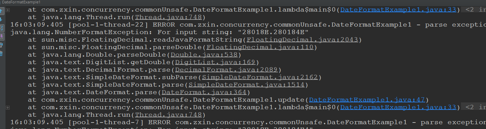

# 线程安全策略

## 一、不可变对象

不可变对象需要满足的条件

* 对象创建以后其状态就不能修改；
* 对象的所有域都是final类型
* 对象是正确创建的(在对象创建期间，this引用没有溢出)

在Java中创建不可变的集合的方法:

* 将集合传入到`Collections.unmodifiableXXX`中。
* 使用Guava的增强的集合。例如`ImmutableList、ImmutableSet、ImmutableMap`等。

## 二、线程封闭 
简单的说就是: **将对象只放到一个线程里面，这样就不会出现线程安全问题**。

* Ad-hoc线程封闭，程序控制实现，最糟糕，忽略；
* 堆栈封闭: 局部变量，无并发问题；
* ThreadLocal线程封闭：目前最好的线程封闭方法； (内部实现:  里面维护了一个Map，Map的key是每个线程的名称，而Map的值就是我们要封闭的对象)

使用ThreadLocal实战：

```java
public class RequestHolder {

    private final static ThreadLocal<Long> requestHolder = new ThreadLocal<>();

    public static void add(Long id) {
        requestHolder.set(id);
    }

    public static Long getId() {
        return requestHolder.get();
    }

    public static void remove() {
        requestHolder.remove();
    }
}

```

使用过滤器。

```java
// Http过滤器
@Slf4j
public class HttpFilter implements Filter {

    @Override
    public void init(FilterConfig filterConfig) throws ServletException {

    }

    @Override
    public void doFilter(ServletRequest servletRequest, ServletResponse servletResponse, FilterChain filterChain) throws IOException, ServletException {
        HttpServletRequest request = (HttpServletRequest) servletRequest;
        log.info("do filter, {}, {}", Thread.currentThread().getId(), request.getServletPath());
        RequestHolder.add(Thread.currentThread().getId());
        filterChain.doFilter(servletRequest, servletResponse);
    }

    @Override
    public void destroy() {

    }
}

```

在拦截器的`afterCompletion()`方法中移除掉`ThreadLocal`中的变量。(调用remove()方法)

```java
//拦截器
@Slf4j
public class HttpInterceptor extends HandlerInterceptorAdapter {

    @Override
    public boolean preHandle(HttpServletRequest request, HttpServletResponse response, Object handler) throws Exception {
        log.info("preHandle");
        return true;
    }

    @Override
    public void afterCompletion(HttpServletRequest request, HttpServletResponse response, Object handler, Exception ex) throws Exception {
        RequestHolder.remove();
        log.info("afterCompletion");
        return;
    }
}

```

注册相关组件: 

```java
// WebMvcConfigurerAdapter已经过时: https://www.cnblogs.com/xingzc/p/8656088.html
@Configuration
public class TLConfiguration extends WebMvcConfigurationSupport {

    // 注册过滤器
    @Bean
    public FilterRegistrationBean httpFilter() {
        FilterRegistrationBean registrationBean = new FilterRegistrationBean();
        registrationBean.setFilter(new HttpFilter());
        registrationBean.addUrlPatterns("/threadLocal/*");
        return registrationBean;
    }

    @Override
    public void addInterceptors(InterceptorRegistry registry) {
        registry.addInterceptor(new HttpInterceptor()).addPathPatterns("/**");
    }
}

```

最后的Controller测试：

```java
@Controller
@RequestMapping("/threadLocal")
public class ThreadLocalController {

    @RequestMapping("/test")
    @ResponseBody
    public Long test() {
        return RequestHolder.getId();
    }
}
```

## 三、常见线程不安全的写法

`SimpleDataFormat`作为成员变量的时候，如果多个线程同时访问，就有可能会抛出异常。

 先看会抛出异常的例子:

```java
// 多线程访问的时候会发生异常
@Slf4j
@NotThreadSafe
public class DateFormatExample1 {

    private static SimpleDateFormat simpleDateFormat = new SimpleDateFormat("yyyyMMdd");

    // 请求总数
    public static int clientTotal = 5000;

    // 同时并发执行的线程数
    public static int threadTotal = 200;

    public static void main(String[] args) throws Exception {
        ExecutorService executorService = Executors.newCachedThreadPool();
        final Semaphore semaphore = new Semaphore(threadTotal);
        final CountDownLatch countDownLatch = new CountDownLatch(clientTotal);
        for (int i = 0; i < clientTotal ; i++) {
            executorService.execute(() -> {
                try {
                    semaphore.acquire();
                    update();
                    semaphore.release();
                } catch (Exception e) {
                    log.error("exception", e);
                }
                countDownLatch.countDown();
            });
        }
        countDownLatch.await();
        executorService.shutdown();
    }

    private static void update() {
        try {
            simpleDateFormat.parse("20180208");
        } catch (Exception e) {
            log.error("parse exception", e);
        }
    }
}

```



如果是每次都放在局部变量中，就不会抛出异常:

```java
// SimpleDataFormat必须使用在局部变量中
@Slf4j
@ThreadSafe
public class DateFormatExample2 {

    // 请求总数
    public static int clientTotal = 5000;

    // 同时并发执行的线程数
    public static int threadTotal = 200;

    public static void main(String[] args) throws Exception {
        ExecutorService executorService = Executors.newCachedThreadPool();
        final Semaphore semaphore = new Semaphore(threadTotal);
        final CountDownLatch countDownLatch = new CountDownLatch(clientTotal);
        for (int i = 0; i < clientTotal ; i++) {
            executorService.execute(() -> {
                try {
                    semaphore.acquire();
                    update();
                    semaphore.release();
                } catch (Exception e) {
                    log.error("exception", e);
                }
                countDownLatch.countDown();
            });
        }
        countDownLatch.await();
        executorService.shutdown();
    }

    private static void update() {
        try {
            SimpleDateFormat simpleDateFormat = new SimpleDateFormat("yyyyMMdd");
            simpleDateFormat.parse("20180208");
        } catch (Exception e) {
            log.error("parse exception", e);
        }
    }
}

```

如果实在要使用的话，可以使用`joda.time`包里面的类，这个可以当做全局变量，而且不会抛出异常。

引入的依赖:

```xml
<dependency>
    <groupId>joda-time</groupId>
    <artifactId>joda-time</artifactId>
</dependency>
```

代码:

```java
// 如果想要使用全局变量的话，就可以使用joda.time中的类: DataTimeFormatter
@Slf4j
@ThreadSafe
public class DateFormatExample3 {

    // 请求总数
    public static int clientTotal = 5000;

    // 同时并发执行的线程数
    public static int threadTotal = 200;

    private static DateTimeFormatter dateTimeFormatter = DateTimeFormat.forPattern("yyyyMMdd");

    public static void main(String[] args) throws Exception {
        ExecutorService executorService = Executors.newCachedThreadPool();
        final Semaphore semaphore = new Semaphore(threadTotal);
        final CountDownLatch countDownLatch = new CountDownLatch(clientTotal);
        for (int i = 0; i < clientTotal; i++) {
            final int count = i;
            executorService.execute(() -> {
                try {
                    semaphore.acquire();
                    update(count);
                    semaphore.release();
                } catch (Exception e) {
                    log.error("exception", e);
                }
                countDownLatch.countDown();
            });
        }
        countDownLatch.await();
        executorService.shutdown();
    }

    private static void update(int i) {
        log.info("{}, {}", i, DateTime.parse("20190208", dateTimeFormatter).toDate());
    }
}
```

