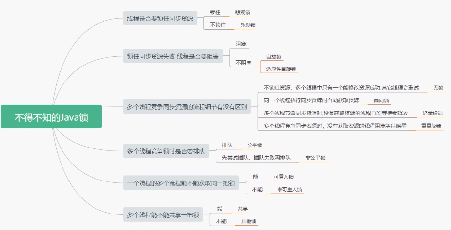
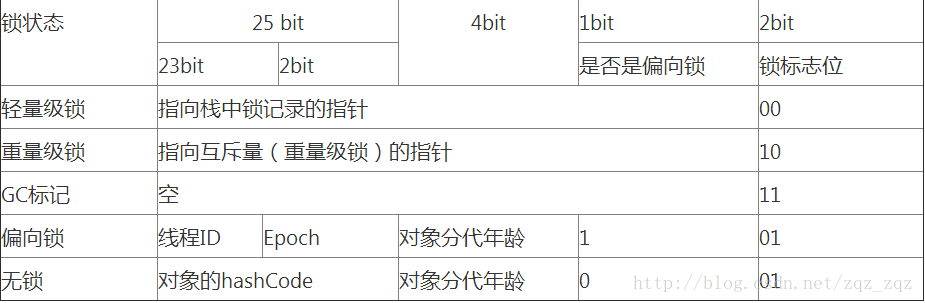
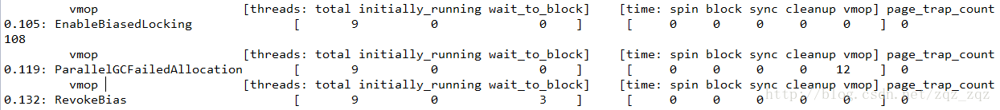
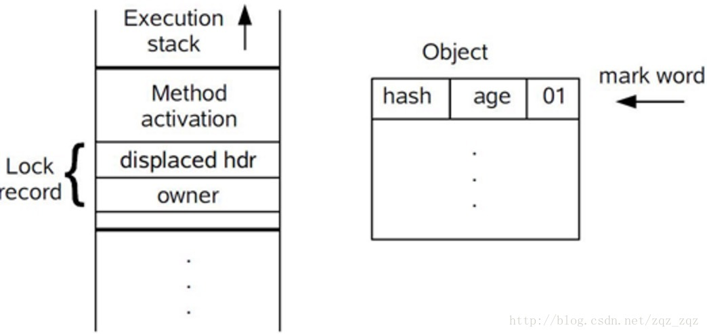
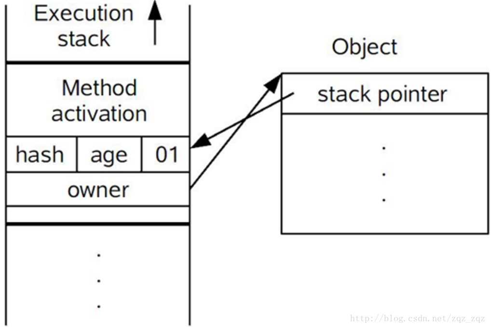
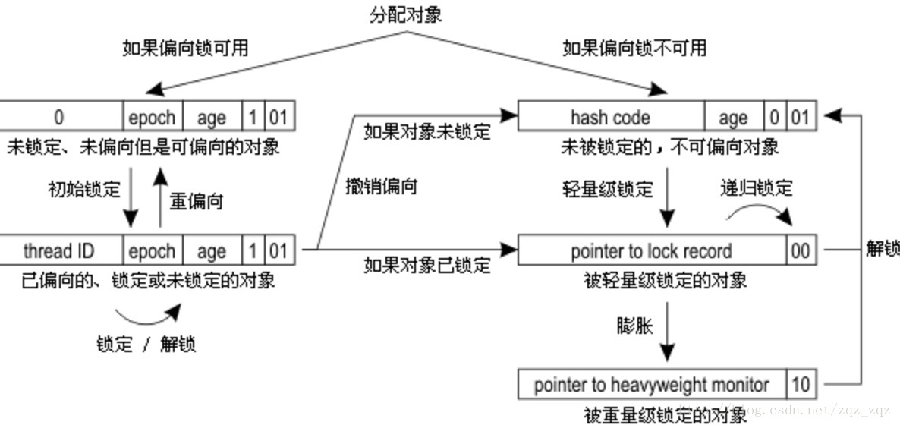

转载至：https://blog.csdn.net/zqz_zqz/article/details/70233767

之前做过一个测试，详情见这篇文章[《多线程 +1操作的几种实现方式，及效率对比》](http://blog.csdn.net/zqz_zqz/article/details/58603938)，当时对这个测试结果很疑惑，反复执行过多次，发现结果是一样的: 

1. 单线程下synchronized效率最高（当时感觉它的效率应该是最差才对）； 
2. AtomicInteger效率最不稳定，不同并发情况下表现不一样：短时间低并发下，效率比synchronized高，有时甚至比LongAdder还高出一点，但是高并发下，性能还不如synchronized，不同情况下性能表现很不稳定； 
3. LongAdder性能稳定，在各种并发情况下表现都不错，整体表现最好,短时间的低并发下比AtomicInteger性能差一点，长时间高并发下性能最高（可以让AtomicInteger下台了）；

这篇文章我们就去揭秘，为什么会是这个测试结果！

## 理解锁的基础知识



如果想要透彻的理解java锁的来龙去脉，需要先了解以下基础知识。

### 基础知识之一：锁的类型

锁从宏观上分类，分为悲观锁与乐观锁。

#### 乐观锁

乐观锁是一种乐观思想，即认为读多写少，遇到并发写的可能性低，每次去拿数据的时候都认为别人不会修改，所以不会上锁，但是在更新的时候会判断一下在此期间别人有没有去更新这个数据，采取在写时先读出当前版本号，然后加锁操作（比较跟上一次的版本号，如果一样则更新），如果失败则要重复读-比较-写的操作。

java中的乐观锁基本都是通过CAS操作实现的，CAS是一种更新的原子操作，比较当前值跟传入值是否一样，一样则更新，否则失败。

#### 悲观锁

悲观锁是就是悲观思想，即认为写多，遇到并发写的可能性高，每次去拿数据的时候都认为别人会修改，所以每次在读写数据的时候都会上锁，这样别人想读写这个数据就会block直到拿到锁。java中的悲观锁就是Synchronized,AQS框架下的锁则是先尝试cas乐观锁去获取锁，获取不到，才会转换为悲观锁，如RetreenLock。

### 基础知识之二：java线程阻塞的代价

java的线程是映射到操作系统原生线程之上的，如果要阻塞或唤醒一个线程就需要操作系统介入，需要在户态与核心态之间切换，这种切换会消耗大量的系统资源，因为用户态与内核态都有各自专用的内存空间，专用的寄存器等，用户态切换至内核态需要传递给许多变量、参数给内核，内核也需要保护好用户态在切换时的一些寄存器值、变量等，以便内核态调用结束后切换回用户态继续工作。

1. 如果线程状态切换是一个高频操作时，这将会消耗很多CPU处理时间；
2. 如果对于那些需要同步的简单的代码块，获取锁挂起操作消耗的时间比用户代码执行的时间还要长，这种同步策略显然非常糟糕的。

synchronized会导致争用不到锁的线程进入阻塞状态，所以说它是java语言中一个重量级的同步操纵，被称为重量级锁，为了缓解上述性能问题，JVM从1.5开始，引入了轻量锁与偏向锁，默认启用了自旋锁，他们都属于乐观锁。

明确java线程切换的代价，是理解java中各种锁的优缺点的基础之一。

### 基础知识之三：markword

在介绍java锁之前，先说下什么是markword，markword是java对象数据结构中的一部分，要详细了解java对象的结构可以[点击这里](http://blog.csdn.net/zqz_zqz/article/details/70246212),这里只做markword的详细介绍，因为对象的markword和java各种类型的锁密切相关；

markword数据的长度在32位和64位的虚拟机（未开启压缩指针）中分别为32bit和64bit，它的最后2bit是锁状态标志位，用来标记当前对象的状态，对象的所处的状态，决定了markword存储的内容，如下表所示:

| 状态             | 标志位 | 存储内容                             |
| ---------------- | ------ | ------------------------------------ |
| 未锁定           | 01     | 对象哈希码、对象分代年龄             |
| 轻量级锁定       | 00     | 指向锁记录的指针                     |
| 膨胀(重量级锁定) | 10     | 执行重量级锁定的指针                 |
| GC标记           | 11     | 空(不需要记录信息)                   |
| 可偏向           | 01     | 偏向线程ID、偏向时间戳、对象分代年龄 |

32位虚拟机在不同状态下markword结构如下图所示：



了解了markword结构，有助于后面了解java锁的加锁解锁过程；

### 小结

前面提到了java的4种锁，他们分别是重量级锁、自旋锁、轻量级锁和偏向锁， 
不同的锁有不同特点，每种锁只有在其特定的场景下，才会有出色的表现，java中没有哪种锁能够在所有情况下都能有出色的效率，引入这么多锁的原因就是为了应对不同的情况；

前面讲到了重量级锁是悲观锁的一种，自旋锁、轻量级锁与偏向锁属于乐观锁，所以现在你就能够大致理解了他们的适用范围，但是具体如何使用这几种锁呢，就要看后面的具体分析他们的特性；

## java中的锁

### 自旋锁

**自旋锁原理非常简单，如果持有锁的线程能在很短时间内释放锁资源，那么那些等待竞争锁的线程就不需要做内核态和用户态之间的切换进入阻塞挂起状态，它们只需要等一等（自旋），等持有锁的线程释放锁后即可立即获取锁，这样就避免用户线程和内核的切换的消耗**。

但是线程自旋是需要消耗cpu的，说白了就是让cpu在做无用功，如果一直获取不到锁，那线程也不能一直占用cpu自旋做无用功，**所以需要设定一个自旋等待的最大时间**。

如果持有锁的线程执行的时间超过自旋等待的最大时间扔没有释放锁，就会导致其它争用锁的线程在最大等待时间内还是获取不到锁，这时争用线程会停止自旋进入阻塞状态。

#### 自旋锁的优缺点

**自旋锁尽可能的减少线程的阻塞，这对于锁的竞争不激烈，且占用锁时间非常短的代码块来说性能能大幅度的提升，因为自旋的消耗会小于线程阻塞挂起再唤醒的操作的消耗，这些操作会导致线程发生两次上下文切换**！

但是如果锁的竞争激烈，或者持有锁的线程需要长时间占用锁执行同步块，这时候就不适合使用自旋锁了，因为自旋锁在获取锁前一直都是占用cpu做无用功，占着XX不XX，同时有大量线程在竞争一个锁，会导致获取锁的时间很长，线程自旋的消耗大于线程阻塞挂起操作的消耗，其它需要cup的线程又不能获取到cpu，造成cpu的浪费。所以这种情况下我们要关闭自旋锁；

#### 自旋锁时间阈值

自旋锁的目的是为了占着CPU的资源不释放，等到获取到锁立即进行处理。但是如何去选择自旋的执行时间呢？如果自旋执行时间太长，会有大量的线程处于自旋状态占用CPU资源，进而会影响整体系统的性能。因此自旋的周期选的额外重要！

JVM对于自旋周期的选择，jdk1.5这个限度是一定的写死的，在1.6引入了适应性自旋锁，适应性自旋锁意味着自旋的时间不在是固定的了，而是由前一次在同一个锁上的自旋时间以及锁的拥有者的状态来决定，基本认为一个线程上下文切换的时间是最佳的一个时间，同时JVM还针对当前CPU的负荷情况做了较多的优化

1. 如果平均负载小于CPUs则一直自旋
2. 如果有超过(CPUs/2)个线程正在自旋，则后来线程直接阻塞
3. 如果正在自旋的线程发现Owner发生了变化则延迟自旋时间（自旋计数）或进入阻塞
4. 如果CPU处于节电模式则停止自旋
5. 自旋时间的最坏情况是CPU的存储延迟（CPU A存储了一个数据，到CPU B得知这个数据直接的时间差）
6. 自旋时会适当放弃线程优先级之间的差异

#### 自旋锁的开启

JDK1.6中-XX:+UseSpinning开启； 
-XX:PreBlockSpin=10 为自旋次数； 
JDK1.7后，去掉此参数，由jvm控制；

### 重量级锁Synchronized

#### Synchronized的作用

在JDK1.5之前都是使用synchronized关键字保证同步的，Synchronized的作用相信大家都已经非常熟悉了；

它可以把任意一个非NULL的对象当作锁。

1. 作用于方法时，锁住的是对象的实例(this)；
2. 当作用于静态方法时，锁住的是Class实例，又因为Class的相关数据存储在永久带PermGen（jdk1.8则是metaspace），永久带是全局共享的，因此静态方法锁相当于类的一个全局锁，会锁所有调用该方法的线程；
3. synchronized作用于一个对象实例时，锁住的是所有以该对象为锁的代码块。

#### Synchronized的实现

实现如下图所示；


它有多个队列，当多个线程一起访问某个对象监视器的时候，对象监视器会将这些线程存储在不同的容器中。

1. Contention List：竞争队列，所有请求锁的线程首先被放在这个竞争队列中；
2. Entry List：Contention List中那些有资格成为候选资源的线程被移动到Entry List中；
3. Wait Set：哪些调用wait方法被阻塞的线程被放置在这里；
4. OnDeck：任意时刻，最多只有一个线程正在竞争锁资源，该线程被成为OnDeck；
5. Owner：当前已经获取到所资源的线程被称为Owner；
6. !Owner：当前释放锁的线程。

JVM每次从队列的尾部取出一个数据用于锁竞争候选者（OnDeck），但是并发情况下，ContentionList会被大量的并发线程进行CAS访问，为了降低对尾部元素的竞争，JVM会将一部分线程移动到EntryList中作为候选竞争线程。Owner线程会在unlock时，将ContentionList中的部分线程迁移到EntryList中，并指定EntryList中的某个线程为OnDeck线程（一般是最先进去的那个线程）。Owner线程并不直接把锁传递给OnDeck线程，而是把锁竞争的权利交给OnDeck，OnDeck需要重新竞争锁。这样虽然牺牲了一些公平性，但是能极大的提升系统的吞吐量，在JVM中，也把这种选择行为称之为“竞争切换”。

OnDeck线程获取到锁资源后会变为Owner线程，而没有得到锁资源的仍然停留在EntryList中。如果Owner线程被wait方法阻塞，则转移到WaitSet队列中，直到某个时刻通过notify或者notifyAll唤醒，会重新进去EntryList中。

处于ContentionList、EntryList、WaitSet中的线程都处于阻塞状态，该阻塞是由操作系统来完成的（Linux内核下采用pthread_mutex_lock内核函数实现的）。

Synchronized是非公平锁。 Synchronized在线程进入ContentionList时，等待的线程会先尝试自旋获取锁，如果获取不到就进入ContentionList，这明显对于已经进入队列的线程是不公平的，还有一个不公平的事情就是自旋获取锁的线程还可能直接抢占OnDeck线程的锁资源。

### 偏向锁

Java偏向锁(Biased Locking)是Java6引入的一项多线程优化。 
偏向锁，顾名思义，**它会偏向于第一个访问锁的线程，如果在运行过程中，同步锁只有一个线程访问，不存在多线程争用的情况，则线程是不需要触发同步的，这种情况下，就会给线程加一个偏向锁。** 
**如果在运行过程中，遇到了其他线程抢占锁，则持有偏向锁的线程会被挂起，JVM会消除它身上的偏向锁，将锁恢复到标准的轻量级锁**。

> *它通过消除资源无竞争情况下的同步原语，进一步提高了程序的运行性能。*

#### 偏向锁的实现

##### 偏向锁获取过程：

1. 访问Mark Word中偏向锁的标识是否设置成1，锁标志位是否为01，确认为可偏向状态。
2. 如果为可偏向状态，则测试线程ID是否指向当前线程，如果是，进入步骤5，否则进入步骤3。
3. 如果线程ID并未指向当前线程，则通过CAS操作竞争锁。如果竞争成功，则将Mark Word中线程ID设置为当前线程ID，然后执行5；如果竞争失败，执行4。
4. 如果CAS获取偏向锁失败，则表示有竞争。当到达全局安全点（safepoint）时获得偏向锁的线程被挂起，偏向锁升级为轻量级锁，然后被阻塞在安全点的线程继续往下执行同步代码。（撤销偏向锁的时候会导致stop the word）
5. 执行同步代码。

> 注意：第四步中到达安全点safepoint会导致stop the word，时间很短。

##### 偏向锁的释放：

偏向锁的撤销在上述第四步骤中有提到。偏向锁只有遇到其他线程尝试竞争偏向锁时，持有偏向锁的线程才会释放锁，线程不会主动去释放偏向锁。偏向锁的撤销，需要等待全局安全点（在这个时间点上没有字节码正在执行），它会首先暂停拥有偏向锁的线程，判断锁对象是否处于被锁定状态，撤销偏向锁后恢复到未锁定（标志位为“01”）或轻量级锁（标志位为“00”）的状态。

#### 偏向锁的适用场景

始终只有一个线程在执行同步块，在它没有执行完释放锁之前，没有其它线程去执行同步块，在锁无竞争的情况下使用，一旦有了竞争就升级为轻量级锁，升级为轻量级锁的时候需要撤销偏向锁，撤销偏向锁的时候会导致stop the word操作； 
在有锁的竞争时，偏向锁会多做很多额外操作，尤其是撤销偏向所的时候会导致进入安全点，安全点会导致stw，导致性能下降，这种情况下应当禁用；

##### 查看停顿–安全点停顿日志

要查看安全点停顿，可以打开安全点日志，通过设置JVM参数 -XX:+PrintGCApplicationStoppedTime 会打出系统停止的时间，添加-XX:+PrintSafepointStatistics -XX:PrintSafepointStatisticsCount=1 这两个参数会打印出详细信息，可以查看到使用偏向锁导致的停顿，时间非常短暂，但是争用严重的情况下，停顿次数也会非常多；

注意：安全点日志不能一直打开： 
\1. 安全点日志默认输出到stdout，一是stdout日志的整洁性，二是stdout所重定向的文件如果不在/dev/shm，可能被锁。 
\2. 对于一些很短的停顿，比如取消偏向锁，打印的消耗比停顿本身还大。 
\3. 安全点日志是在安全点内打印的，本身加大了安全点的停顿时间。

所以安全日志应该只在问题排查时打开。 
如果在生产系统上要打开，再再增加下面四个参数： 
-XX:+UnlockDiagnosticVMOptions -XX: -DisplayVMOutput -XX:+LogVMOutput -XX:LogFile=/dev/shm/vm.log 
打开Diagnostic（只是开放了更多的flag可选，不会主动激活某个flag），关掉输出VM日志到stdout，输出到独立文件,/dev/shm目录（内存文件系统）。



此日志分三部分： 
第一部分是时间戳，VM Operation的类型 
第二部分是线程概况，被中括号括起来 
total: 安全点里的总线程数 
initially_running: 安全点开始时正在运行状态的线程数 
wait_to_block: 在VM Operation开始前需要等待其暂停的线程数

第三部分是到达安全点时的各个阶段以及执行操作所花的时间，其中最重要的是vmop

- spin: 等待线程响应safepoint号召的时间；
- block: 暂停所有线程所用的时间；
- sync: 等于 spin+block，这是从开始到进入安全点所耗的时间，可用于判断进入安全点耗时；
- cleanup: 清理所用时间；
- vmop: 真正执行VM Operation的时间。

可见，那些很多但又很短的安全点，全都是RevokeBias， 高并发的应用会禁用掉偏向锁。

#### jvm开启/关闭偏向锁

- 开启偏向锁：-XX:+UseBiasedLocking -XX:BiasedLockingStartupDelay=0
- 关闭偏向锁：-XX:-UseBiasedLocking

### 轻量级锁

轻量级锁是由偏向所升级来的，偏向锁运行在一个线程进入同步块的情况下，当第二个线程加入锁争用的时候，偏向锁就会升级为轻量级锁； 
轻量级锁的加锁过程：

1. 在代码进入同步块的时候，如果同步对象锁状态为无锁状态（锁标志位为“01”状态，是否为偏向锁为“0”），虚拟机首先将在当前线程的栈帧中建立一个名为锁记录（Lock Record）的空间，用于存储锁对象目前的Mark Word的拷贝，官方称之为 Displaced Mark Word。这时候线程堆栈与对象头的状态如图： 
   　　所示。
2. 拷贝对象头中的Mark Word复制到锁记录中；
3. 拷贝成功后，虚拟机将使用CAS操作尝试将对象的Mark Word更新为指向Lock Record的指针，并将Lock record里的owner指针指向object mark word。如果更新成功，则执行步骤4，否则执行步骤5。
4. 如果这个更新动作成功了，那么这个线程就拥有了该对象的锁，并且对象Mark Word的锁标志位设置为“00”，即表示此对象处于轻量级锁定状态，这时候线程堆栈与对象头的状态如图所示。 
   　　
5. 如果这个更新操作失败了，虚拟机首先会检查对象的Mark Word是否指向当前线程的栈帧，如果是就说明当前线程已经拥有了这个对象的锁，那就可以直接进入同步块继续执行。否则说明多个线程竞争锁，轻量级锁就要膨胀为重量级锁，锁标志的状态值变为“10”，Mark Word中存储的就是指向重量级锁（互斥量）的指针，后面等待锁的线程也要进入阻塞状态。 而当前线程便尝试使用自旋来获取锁，自旋就是为了不让线程阻塞，而采用循环去获取锁的过程。

#### 轻量级锁的释放

释放锁线程视角：由轻量锁切换到重量锁，是发生在轻量锁释放锁的期间，之前在获取锁的时候它拷贝了锁对象头的markword，在释放锁的时候如果它发现在它持有锁的期间有其他线程来尝试获取锁了，并且该线程对markword做了修改，两者比对发现不一致，则切换到重量锁。

因为重量级锁被修改了，所有display mark word和原来的markword不一样了。

怎么补救，就是进入mutex前，compare一下obj的markword状态。确认该markword是否被其他线程持有。

此时如果线程已经释放了markword，那么通过CAS后就可以直接进入线程，无需进入mutex，就这个作用。

尝试获取锁线程视角：如果线程尝试获取锁的时候，轻量锁正被其他线程占有，那么它就会修改markword，修改重量级锁，表示该进入重量锁了。

还有一个注意点：等待轻量锁的线程不会阻塞，它会一直自旋等待锁，并如上所说修改markword。

这就是自旋锁，尝试获取锁的线程，在没有获得锁的时候，不被挂起，而转而去执行一个空循环，即自旋。在若干个自旋后，如果还没有获得锁，则才被挂起，获得锁，则执行代码。

## 总结



synchronized的执行过程： 

1. 检测Mark Word里面是不是当前线程的ID，如果是，表示当前线程处于偏向锁 
2. 如果不是，则使用CAS将当前线程的ID替换Mard Word，如果成功则表示当前线程获得偏向锁，置偏向标志位1 
3. 如果失败，则说明发生竞争，撤销偏向锁，进而升级为轻量级锁。 
4. 当前线程使用CAS将对象头的Mark Word替换为锁记录指针，如果成功，当前线程获得锁 
5. 如果失败，表示其他线程竞争锁，当前线程便尝试使用自旋来获取锁。 
6. 如果自旋成功则依然处于轻量级状态。 
7. 如果自旋失败，则升级为重量级锁。

上面几种锁都是JVM自己内部实现，当我们执行synchronized同步块的时候jvm会根据启用的锁和当前线程的争用情况，决定如何执行同步操作；

在所有的锁都启用的情况下线程进入临界区时会先去获取偏向锁，如果已经存在偏向锁了，则会尝试获取轻量级锁，启用自旋锁，如果自旋也没有获取到锁，则使用重量级锁，没有获取到锁的线程阻塞挂起，直到持有锁的线程执行完同步块唤醒他们；

偏向锁是在无锁争用的情况下使用的，也就是同步开在当前线程没有执行完之前，没有其它线程会执行该同步块，一旦有了第二个线程的争用，偏向锁就会升级为轻量级锁，如果轻量级锁自旋到达阈值后，没有获取到锁，就会升级为重量级锁；

如果线程争用激烈，那么应该禁用偏向锁。

# 锁优化

以上介绍的锁不是我们代码中能够控制的，但是借鉴上面的思想，我们可以优化我们自己线程的加锁操作；

## 减少锁的时间

不需要同步执行的代码，能不放在同步快里面执行就不要放在同步快内，可以让锁尽快释放；

## 减少锁的粒度

它的思想是将物理上的一个锁，拆成逻辑上的多个锁，增加并行度，从而降低锁竞争。它的思想也是用空间来换时间；

java中很多数据结构都是采用这种方法提高并发操作的效率：

### ConcurrentHashMap

java中的ConcurrentHashMap在jdk1.8之前的版本，使用一个Segment 数组

```java
Segment< K,V >[] segments
```

Segment继承自ReenTrantLock，所以每个Segment就是个可重入锁，每个Segment 有一个HashEntry< K,V >数组用来存放数据，put操作时，先确定往哪个Segment放数据，只需要锁定这个Segment，执行put，其它的Segment不会被锁定；所以数组中有多少个Segment就允许同一时刻多少个线程存放数据，这样增加了并发能力。

### LongAdder

LongAdder 实现思路也类似ConcurrentHashMap，LongAdder有一个根据当前并发状况动态改变的Cell数组，Cell对象里面有一个long类型的value用来存储值; 
开始没有并发争用的时候或者是cells数组正在初始化的时候，会使用cas来将值累加到成员变量的base上，在并发争用的情况下，LongAdder会初始化cells数组，在Cell数组中选定一个Cell加锁，数组有多少个cell，就允许同时有多少线程进行修改，最后将数组中每个Cell中的value相加，在加上base的值，就是最终的值；cell数组还能根据当前线程争用情况进行扩容，初始长度为2，每次扩容会增长一倍，直到扩容到大于等于cpu数量就不再扩容，这也就是为什么LongAdder比cas和AtomicInteger效率要高的原因，后面两者都是volatile+cas实现的，他们的竞争维度是1，LongAdder的竞争维度为“Cell个数+1”为什么要+1？因为它还有一个base，如果竞争不到锁还会尝试将数值加到base上；

### LinkedBlockingQueue

LinkedBlockingQueue也体现了这样的思想，在队列头入队，在队列尾出队，入队和出队使用不同的锁，相对于LinkedBlockingArray只有一个锁效率要高；

*拆锁的粒度不能无限拆，最多可以将一个锁拆为当前cup数量个锁即可；*

## 锁粗化

大部分情况下我们是要让锁的粒度最小化，锁的粗化则是要增大锁的粒度; 
在以下场景下需要粗化锁的粒度： 
假如有一个循环，循环内的操作需要加锁，我们应该把锁放到循环外面，否则每次进出循环，都进出一次临界区，效率是非常差的；

## 使用读写锁

ReentrantReadWriteLock 是一个读写锁，读操作加读锁，可以并发读，写操作使用写锁，只能单线程写；

## 读写分离

CopyOnWriteArrayList 、CopyOnWriteArraySet 
CopyOnWrite容器即写时复制的容器。通俗的理解是当我们往一个容器添加元素的时候，不直接往当前容器添加，而是先将当前容器进行Copy，复制出一个新的容器，然后新的容器里添加元素，添加完元素之后，再将原容器的引用指向新的容器。这样做的好处是我们可以对CopyOnWrite容器进行并发的读，而不需要加锁，因为当前容器不会添加任何元素。所以CopyOnWrite容器也是一种读写分离的思想，读和写不同的容器。 
　CopyOnWrite并发容器用于读多写少的并发场景，因为，读的时候没有锁，但是对其进行更改的时候是会加锁的，否则会导致多个线程同时复制出多个副本，各自修改各自的；

## 使用cas

如果需要同步的操作执行速度非常快，并且线程竞争并不激烈，这时候使用cas效率会更高，因为加锁会导致线程的上下文切换，如果上下文切换的耗时比同步操作本身更耗时，且线程对资源的竞争不激烈，使用volatiled+cas操作会是非常高效的选择；

## 消除缓存行的伪共享

除了我们在代码中使用的同步锁和jvm自己内置的同步锁外，还有一种隐藏的锁就是缓存行，它也被称为性能杀手。 
在多核cup的处理器中，每个cup都有自己独占的一级缓存、二级缓存，甚至还有一个共享的三级缓存，为了提高性能，cpu读写数据是以缓存行为最小单元读写的；32位的cpu缓存行为32字节，64位cup的缓存行为64字节，这就导致了一些问题。 
例如，多个不需要同步的变量因为存储在连续的32字节或64字节里面，当需要其中的一个变量时，就将它们作为一个缓存行一起加载到某个cup-1私有的缓存中（虽然只需要一个变量，但是cpu读取会以缓存行为最小单位，将其相邻的变量一起读入），被读入cpu缓存的变量相当于是对主内存变量的一个拷贝，也相当于变相的将在同一个缓存行中的几个变量加了一把锁，这个缓存行中任何一个变量发生了变化，当cup-2需要读取这个缓存行时，就需要先将cup-1中被改变了的整个缓存行更新回主存（即使其它变量没有更改），然后cup-2才能够读取，而cup-2可能需要更改这个缓存行的变量与cpu-1已经更改的缓存行中的变量是不一样的，所以这相当于给几个毫不相关的变量加了一把同步锁； 
为了防止伪共享，不同jdk版本实现方式是不一样的： 

1. 在jdk1.7之前会 将需要独占缓存行的变量前后添加一组long类型的变量，依靠这些无意义的数组的填充做到一个变量自己独占一个缓存行； 
2. 在jdk1.7因为jvm会将这些没有用到的变量优化掉，所以采用继承一个声明了好多long变量的类的方式来实现； 
3. 在jdk1.8中通过添加sun.misc.Contended注解来解决这个问题，若要使该注解有效必须在jvm中添加以下参数： 

-XX:-RestrictContended

sun.misc.Contended注解会在变量前面添加128字节的padding将当前变量与其他变量进行隔离； 
关于什么是缓存行，jdk是如何避免缓存行的，网上有非常多的解释，在这里就不再深入讲解了；

其它方式等待着大家一起补充