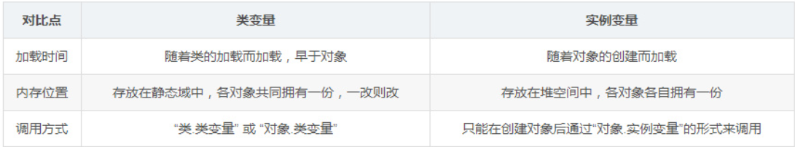

关键字static表示「静态的」，**主要思想是保证无论该类是否产生对象或无论产生多少对象的情况下，某些特定的数据在内存空间中只有一份**。 

  static不能修饰构造器。 

  其中，被修饰后的成员具有如下特点： 

- 随着类的加载而加载，故优先于对象存在；    

- 所修饰的成员，被该类的所有对象所共享；    

- 访问权限允许时，可不创建对象，直接被类调用。   

  关键字static大体上有一下五种用法：

- 静态导入、静态变量、静态方法、静态代码块、静态内部类；

**静态变量**:

**静态方法**:

> 注意：静态的结构随着类的加载而加载，其生命周期早于非静态的结构，同时被回收也要晚于非静态的结构。

**静态代码块：** 

静态代码块仅在类加载时运行一次，主要用于对Java类的静态变量（类属性）进行初始化操作。 

执行顺序：静态代码块 > 构造代码块（非静态代码块） > 构造方法。 

  **静态内部类：** 

内部类的一种，静态内部类不依赖于外部类，即可以不依赖于外部类实例对象而被实例化，且不能访问外部类的非静态成员（属性和方法）。