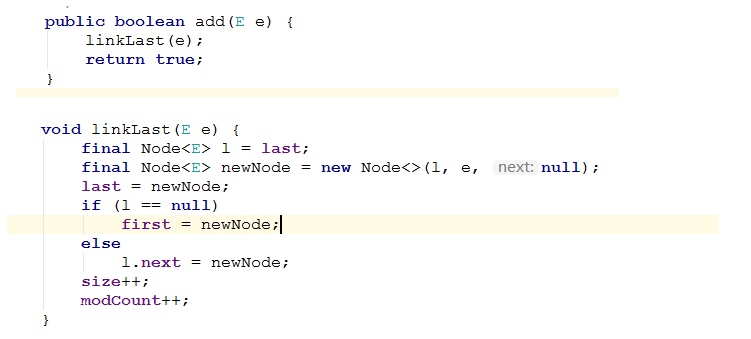
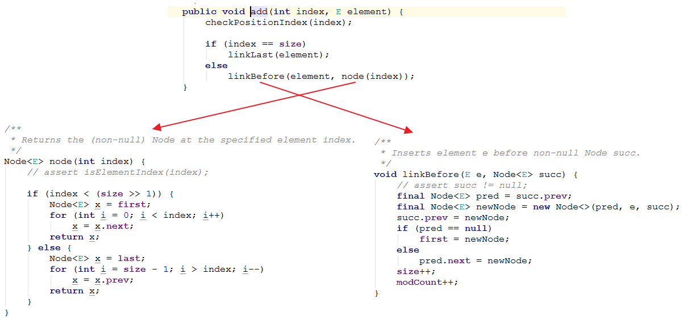
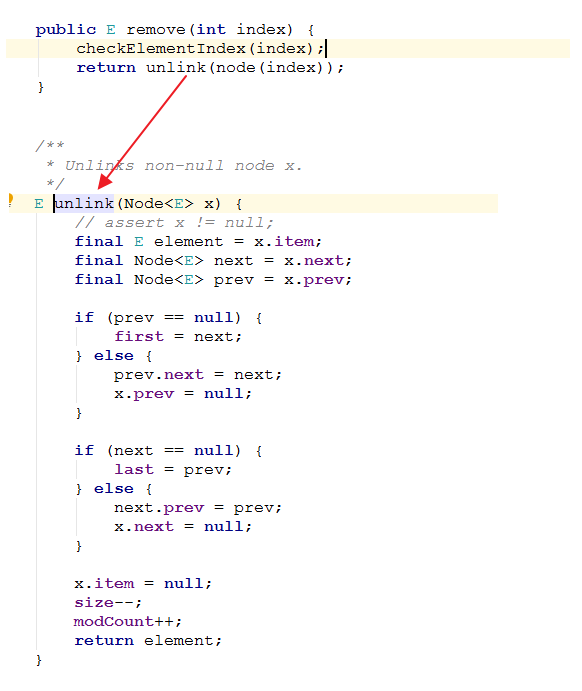

# LinkedList

## 一、基本结构

LinkedList实现了队列接口Queue。

Queue扩展了Collection，它的主要操作有三个：

- 在尾部添加元素 (add, offer)
- 查看头部元素 (element, peek)，返回头部元素，但不改变队列
- 删除头部元素 (remove, poll)，返回头部元素，并且从队列中删除

每个操作对应的两个方法的区别在于，对于特殊情况的处理不同。特殊情况是指，队列为空或者队列为满，为空容易理解，为满是指队列有长度大小限制，而且已经占满了。LinkedList的实现中，队列长度没有限制，但别的Queue的实现可能有。

**在队列为空时，element和remove会抛出异常NoSuchElementException，而peek和poll返回特殊值null，在队列为满时，add会抛出异常IllegalStateException，而offer只是返回false**。

节点内部类:

```java
private static class Node<E> {
    E item;
    Node<E> next;
    Node<E> prev;

    Node(Node<E> prev, E element, Node<E> next) {
        this.item = element;
        this.next = next;
        this.prev = prev;
    }
}
```

定义指向头、尾的指针以及一个`size`。

```java
transient int size = 0;
transient Node<E> first;
transient Node<E> last;
```

## 二、add



`add(index, element)`



### 三、remove



## 四、附源码翻译

```java
package java.util;

import java.util.function.Consumer;

/**
 * Doubly-linked list implementation of the {@code List} and {@code Deque}
 * interfaces.  Implements all optional list operations, and permits all
 * elements (including {@code null}).
 * 双向链表实现了 List 接口和 Deque 接口。
 * 它实现了所有可选的列表操作，并且允许（插入）所有元素（包括 null）
 *
 * <p><strong>Note that this implementation is not synchronized.</strong>
 * If multiple threads access a linked list concurrently, and at least
 * one of the threads modifies the list structurally, it <i>must</i> be
 * synchronized externally.  (A structural modification is any operation
 * that adds or deletes one or more elements; merely setting the value of
 * an element is not a structural modification.)  This is typically
 * accomplished by synchronizing on some object that naturally
 * encapsulates the list.
 * 注意：这个实现是不同步的。
 * 如果多个线程并发访问一个链表，并且至少一个线程修改了链表的结构，它必须在外部进行同步。（结构上的修改是指任何添加和删除一个或多个元素的操作，仅仅设置元素的值不是结构上的修改）
 * 这通常通过在自然封装列表的某些对象上进行同步来完成。
 * If no such object exists, the list should be "wrapped" using the
 * {@link Collections#synchronizedList Collections.synchronizedList}
 * method.  This is best done at creation time, to prevent accidental
 * unsynchronized access to the list:<pre>
 *   List list = Collections.synchronizedList(new LinkedList(...));</pre>
 * 如果不存在此类对象，链表应该用 Collections.synchronizedList 封装，这（使用包装列表）应该在创建的时候做，为了防止非同步的访问列表（示例代码如下）：
 * List list = Collections.synchronizedList(new LinkedList(...));
 *
 *
 * <p>The iterators returned by this class's {@code iterator} and
 * {@code listIterator} methods are <i>fail-fast</i>: if the list is
 * structurally modified at any time after the iterator is created, in
 * any way except through the Iterator's own {@code remove} or
 * {@code add} methods, the iterator will throw a {@link
 * ConcurrentModificationException}.  Thus, in the face of concurrent
 * modification, the iterator fails quickly and cleanly, rather than
 * risking arbitrary, non-deterministic behavior at an undetermined
 * time in the future.
  * 这个类（ArrayList）的 iterator() 方法和 listIterator 方法返回出来的迭代器都是 fail-fast 的。
 * 如果列表在迭代器创建之后在结构上被修改，除了调用迭代器的 remove 方法和 add 方法外，迭代器都会抛出 ConcurrentModificationException 异常。
 * 因此，在并发修改情况下，迭代器快速干净地出 fail，而不是在未来某个不确定的时间，冒任意和不确定的风险。
 *
 *
 * <p>Note that the fail-fast behavior of an iterator cannot be guaranteed
 * as it is, generally speaking, impossible to make any hard guarantees in the
 * presence of unsynchronized concurrent modification.  Fail-fast iterators
 * throw {@code ConcurrentModificationException} on a best-effort basis.
 * Therefore, it would be wrong to write a program that depended on this
 * exception for its correctness:   <i>the fail-fast behavior of iterators
 * should be used only to detect bugs.</i>
 * 注意：迭代器的 fail-fast 行为可能不像它保证的那样，一般来说，在非同步并发修改情况下，不可能去给出
 * 任何硬性的保证。
 * fail-fast 的迭代器会尽最大的努力抛出 ConcurrentModificationException 异常。
 * 因此，写程序依赖这个异常为了正确性这点是错误的，迭代器的 fail-fast 行为仅仅被用来检查（程序中的） bug。
 *
 */

public class LinkedList<E>
    extends AbstractSequentialList<E>
    implements List<E>, Deque<E>, Cloneable, java.io.Serializable
{
    // 链表中元素的个数，transient 关键字修饰，序列化时该值不会被带上
    transient int size = 0;

    /**
     * Pointer to first node.
     * Invariant: (first == null && last == null) ||
     *            (first.prev == null && first.item != null)
     * 指向第一个 node（Node 类的定义在下面），序列化时该值不会被带上
     */
    transient Node<E> first;

    /**
     * Pointer to last node.
     * Invariant: (first == null && last == null) ||
     *            (last.next == null && last.item != null)
     * 指向最后一个 node（Node 类的定义在下面），序列化时该值不会被带上
     */
    transient Node<E> last;

    public LinkedList() {
    }

    /**
     * Constructs a list containing the elements of the specified
     * collection, in the order they are returned by the collection's
     * iterator.
     * 构造一个包含指定集合中元素的链表，以集合迭代器返回的顺序。
     * @param  c the collection whose elements are to be placed into this list
     * c 参数为要将它的元素放入列表的集合
     * @throws NullPointerException if the specified collection is null
     * 抛出 NullPointerException（空指针）异常，如果指定的集合为 null
     */
    public LinkedList(Collection<? extends E> c) {
        this();
        addAll(c);
    }

    /**
     * Links e as first element.
     * 链接 e 元素作为（链表的）第一个元素
     */
    private void linkFirst(E e) {
        // 复制 first 引用
        final Node<E> f = first;
        // 用元素 e 构造新 node
        final Node<E> newNode = new Node<>(null, e, f);
        // fisrt 指向新 node
        first = newNode;
        // 如果原链表为空，也即是 first，last 都指向 null，此时插入头部的 node，first 和 last 都指向这个 node
        if (f == null)
            last = newNode;
        // 原链表不为空，将原头部 node 的 prev 指向这个新 node
        else
            f.prev = newNode;
        // 链表长度加 1，修改次数加 1
        size++;
        modCount++;
    }

    /**
     * Links e as last element.
     * 链接 e 元素作为（链表的）最后一个元素
     */
    void linkLast(E e) {
         // 复制 last 引用
        final Node<E> l = last;
        // 用元素 e 构造新 node
        final Node<E> newNode = new Node<>(l, e, null);
        // last 指向新 node
        last = newNode;
        // 如果原链表为空，也即是 first，last 都指向 null，此时插入尾部的 node，first 和 last 都指向这个 node
        if (l == null)
            first = newNode;
        // 原链表不为空，将原尾部 node 的 next 指向这个新 node
        else
            l.next = newNode;
        // 链表长度加 1，修改次数加 1
        size++;
        modCount++;
    }

    /**
     * Inserts element e before non-null Node succ.
     * 在非 null 的 node succ 前插入元素 e
     */
    void linkBefore(E e, Node<E> succ) {
        // assert succ != null; 这行代码在源码中就是注释掉的，对于 succ 非 null 判断是该方法调用的外部进行的
        // 复制 node succ 的 prev 引用
        final Node<E> pred = succ.prev;
        // 用元素 e 构造新 node
        final Node<E> newNode = new Node<>(pred, e, succ);
        succ.prev = newNode;
        // 如果 node succ 前面没有 node，说明 succ 就是链表中的第一个元素，将 succ 的 prev 指向新 node
        if (pred == null)
            first = newNode;
        // 否则就将 node succ 的前一个 node 的 next 指向新 node
        else
            pred.next = newNode;
        // 链表长度加 1，修改次数加 1
        size++;
        modCount++;
    }

    /**
     * Unlinks non-null first node f.
     * 不链接非空的第一个 node f，即将 node f 从链表头部删除
     */
    private E unlinkFirst(Node<E> f) {
        // assert f == first && f != null;
        // 复制 node f 中元素的值
        final E element = f.item;
        // 复制 node f 后一个 node 的引用
        final Node<E> next = f.next;
        // 将 item，next 指向为 null，利于垃圾回收器回收 f.item 和 f.next 指向的对象
        f.item = null;
        f.next = null; // help GC
        // fisrt 指向 node f 后一个 node
        first = next;
        // 如果这个链表只有 node f 这一个元素，删除 f 后，first 和 last 都指向 null
        if (next == null)
            last = null;
        // 否则，node f 后一个 node 的 prev 指向 null
        else
            next.prev = null;
        // 链表长度减 1，修改次数加 1
        size--;
        modCount++;
        // 返回删除的 node 的元素值
        return element;
    }

    /**
     * Unlinks non-null last node l.
     * 不链接非空的最后一个 node l，即将 node l 从链表尾部删除
     */
    private E unlinkLast(Node<E> l) {
        // assert l == last && l != null;
        // 复制 node l 中元素的值
        final E element = l.item;
         // 复制 node l 前一个 node 的引用
        final Node<E> prev = l.prev;
        // 将 item，next 指向为 null，利于垃圾回收器回收 l.item 和 l.prev 指向的对象
        l.item = null;
        l.prev = null; // help GC
        // last 指向 node l 前一个 node
        last = prev;
        // 如果这个链表只有 node l 这一个元素，删除 l 后，first 和 last 都指向 null
        if (prev == null)
            first = null;
        // 否则，node l 前一个 node 的 next 指向 null
        else
            prev.next = null;
        // 链表长度减 1，修改次数加 1
        size--;
        modCount++;
        return element;
    }

    /**
     * Unlinks non-null node x.
     * 不链接非 null node x，即将 node x 从链表中删除
     */
    E unlink(Node<E> x) {
        // assert x != null;
        // 复制 node x 中元素的值
        final E element = x.item;
        // 复制 node x 前一个和后一个 node 的引用
        final Node<E> next = x.next;
        final Node<E> prev = x.prev;

        // 如果 node x 的前一个 node 为 null，也即是 node x 为链表头部第一个 node，first 只能指向 node 的后一个 node 了
        if (prev == null) {
            first = next;
        // 否则，node x 的前一个 node 的 next 指向 node x 的后一个 node，node x 的 prev 指向 null（这样更加安全，避免后面再次使用 node x 会对原链表产生影响）
        } else {
            prev.next = next;
            x.prev = null;
        }

        // 如果 node x 的后一个 node 为 null，也即是 node x 为链表尾部最后一个 node，last 只能指向 node 的前一个 node 了
        if (next == null) {
            last = prev;
        // 否则，node x 的后一个 node 的 prev 指向 node x 的前一个 node，node x 的 next 指向 null（这样更加安全，避免后面再次使用 node x 会对原链表产生影响）
        } else {
            next.prev = prev;
            x.next = null;
        }

        // help GC
        x.item = null;
        // 链表长度减 1，修改次数加 1
        size--;
        modCount++;
        // 返回删除的 node 的元素的值
        return element;
    }

    /**
     * Returns the first element in this list.
     * 返回链表的第一个元素
     *
     * @return the first element in this list
     * 返回值是链表的第一个元素
     * @throws NoSuchElementException if this list is empty
     * 抛出 NoSuchElementException 异常，如果链表为空
     */
    public E getFirst() {
        final Node<E> f = first;
        // 如果链表是空链表，抛出 NoSuchElementException 异常
        if (f == null)
            throw new NoSuchElementException();
        // 否则返回 first 指向的 node 的元素值
        return f.item;
    }

    /**
     * Returns the last element in this list.
     * 返回链表的最后一个元素
     *
     * @return the last element in this list
     * 返回值是链表的最后一个元素
     * @throws NoSuchElementException if this list is empty
     * 抛出 NoSuchElementException，如果这个链表为空
     */
    public E getLast() {
        final Node<E> l = last;
        // 如果链表是空链表，抛出 NoSuchElementException 异常
        if (l == null)
            throw new NoSuchElementException();
        // 否则返回 first 指向的 node 的元素值
        return l.item;
    }

    /**
     * Removes and returns the first element from this list.
     * 移除并返回链表中的第一个元素
     *
     * @return the first element from this list
     * 返回值是链表中的第一个元素
     * @throws NoSuchElementException if this list is empty
     * 抛出 NoSuchElementException，如果这个链表为空
     */
    public E removeFirst() {
        final Node<E> f = first;
        // 如果链表是空链表，抛出 NoSuchElementException 异常
        if (f == null)
            throw new NoSuchElementException();
        // 调用上面的 unlinkFirst 方法
        return unlinkFirst(f);
    }

    /**
     * Removes and returns the last element from this list.
     * 移除并返回链表中的最后一个元素
     *
     * @return the last element from this list
     * 返回值是链表中的最后一个元素
     * @throws NoSuchElementException if this list is empty
     * 抛出 NoSuchElementException，如果这个链表为空
     */
    public E removeLast() {
        final Node<E> l = last;
        // 如果链表是空链表，抛出 NoSuchElementException 异常
        if (l == null)
            throw new NoSuchElementException();
        // 调用上面的 unlinkLast 方法
        return unlinkLast(l);
    }

    /**
     * Inserts the specified element at the beginning of this list.
     * 在链表的开端插入指定元素
     *
     * @param e the element to add
     * e 参数为要添加的元素
     */
    public void addFirst(E e) {
        // 调用上面的 linkFirst 方法，内部会将元素 e 封装成 node
        linkFirst(e);
    }

    /**
     * Appends the specified element to the end of this list.
     * 在链表的末端添加指定元素
     *
     * <p>This method is equivalent to {@link #add}.
     * 这个方法相当于 add 方法
     * @param e the element to add
     */
    public void addLast(E e) {
        // 调用上面的 linkLast 方法，内部会将元素 e 封装成 node
        linkLast(e);
    }

    /**
     * Returns {@code true} if this list contains the specified element.
     * More formally, returns {@code true} if and only if this list contains
     * at least one element {@code e} such that
     * <tt>(o==null&nbsp;?&nbsp;e==null&nbsp;:&nbsp;o.equals(e))</tt>.
     * 如果链表包含指定元素返回 true，更正式地说，当且仅当链表包含至少一个元素 e 时 (o==null ? e==null : o.equals(e))
     * 
     * @param o element whose presence in this list is to be tested
     * o 参数为将要被测试的在不在列表中的元素
     * @return {@code true} if this list contains the specified element
     * 返回值为 true，如果这个链表包含指定的元素
     */
    public boolean contains(Object o) {
        return indexOf(o) != -1;
    }

    public int size() {
        return size;
    }

    /**
     * Appends the specified element to the end of this list.
     * 添加指定元素到列表末端
     *
     * <p>This method is equivalent to {@link #addLast}.
     * 这个方法相当于 addLast 方法
     * @param e element to be appended to this list
     * e 参数为将要被添加到列表中的元素
     * @return {@code true} (as specified by {@link Collection#add})
     * 返回 true（由 Collection 的 add 方法指定的）
     */
    public boolean add(E e) {
        linkLast(e);
        return true;
    }

    /**
     * Removes the first occurrence of the specified element from this list,
     * if it is present.  If this list does not contain the element, it is
     * unchanged.  More formally, removes the element with the lowest index
     * {@code i} such that
     * <tt>(o==null&nbsp;?&nbsp;get(i)==null&nbsp;:&nbsp;o.equals(get(i)))</tt>
     * (if such an element exists).  Returns {@code true} if this list
     * contained the specified element (or equivalently, if this list
     * changed as a result of the call).
     * 如果指定的元素存在的话，移除列表中第一个出现的指定元素。如果链表不包含这个元素，列表不会被改变。
     * 更正式的说，(o==null ? get(i)==null : o.equals(get(i)))时移除元素为索引最小的（如果这个元素存在的话）
     * 如果这个列表包含这个指定的元素（或者说调用方法的结果是链表改变了），返回 true。
     *
     * @param o element to be removed from this list, if present
     * o 参数为将要被从列表中删除的元素，如果出现
     * @return {@code true} if this list contained the specified element
     * 返回值为 true，如果链表包含指定的元素
     */
    public boolean remove(Object o) {
        // 当元素为 null 时，遍历删除
        if (o == null) {
            for (Node<E> x = first; x != null; x = x.next) {
                if (x.item == null) {
                    unlink(x);
                    return true;
                }
            }
        // 否则，使用 equals 方法比较元素的值，遍历删除
        } else {
            for (Node<E> x = first; x != null; x = x.next) {
                if (o.equals(x.item)) {
                    unlink(x);
                    return true;
                }
            }
        }
        return false;
    }

    /**
     * Appends all of the elements in the specified collection to the end of
     * this list, in the order that they are returned by the specified
     * collection's iterator.  The behavior of this operation is undefined if
     * the specified collection is modified while the operation is in
     * progress.  (Note that this will occur if the specified collection is
     * this list, and it's nonempty.)
     * 添加指定集合中所有的元素到链表末端，以指定集合迭代器返回值的顺序。
     * 如果在这个操作（方法）进行时，指定集合被修改了，则此操作的行为是不确定的。
     * （注意：如果指定的集合是列表，并且它是非空的，则会发生这种情况）
     *
     * @param c collection containing elements to be added to this list
     * c 参数为将要被添加到链表中的包含元素值的集合
     * @return {@code true} if this list changed as a result of the call
     * 返回值为 true，如果链表作为调用的结果被改变了
     * @throws NullPointerException if the specified collection is null
     * 抛出 NullPointerException 异常，如果指定集合是 null
     */
    public boolean addAll(Collection<? extends E> c) {
        // 调用的下方将集合中元素添加到任意开始位置的 addAll 方法
        return addAll(size, c);
    }

    /**
     * Inserts all of the elements in the specified collection into this
     * list, starting at the specified position.  Shifts the element
     * currently at that position (if any) and any subsequent elements to
     * the right (increases their indices).  The new elements will appear
     * in the list in the order that they are returned by the
     * specified collection's iterator.
     * 从指定的位置开始，插入指定集合中所有元素到链表中。移动当前位置的元素（如果有的话）和任何后续的元素到右边（增大它们的索引）。新元素将按照指定集合​​迭代器返回的顺序出现在列表中。
     *
     * @param index index at which to insert the first element
     *              from the specified collection
     * index 参数为插入指定集合第一个元素的索引
     * @param c collection containing elements to be added to this list
     * c 参数为将要被添加到链表中的包含元素值的集合
     * @return {@code true} if this list changed as a result of the call
     * 返回值为 true，如果链表作为调用的结果被改变了
     * @throws IndexOutOfBoundsException {@inheritDoc}
     * 抛出 IndexOutOfBoundsException 异常
     * @throws NullPointerException if the specified collection is null
     * 抛出 NullPointerException 异常，如果指定集合是 null
     */
    public boolean addAll(int index, Collection<? extends E> c) {
        // 检查索引是否越界
        checkPositionIndex(index);

        // 集合转数组
        Object[] a = c.toArray();

        // 获取数组的长度
        int numNew = a.length;
        if (numNew == 0)
            return false;

        // pred 指向当前索引位置的前一个 node（node.prev），succ 指向当前索引位置上的 node
        Node<E> pred, succ;
        // 如果索引是链表的元素个数，这个索引位置是没有 node 的，索引 succ = null，这个索引的前一个位置是链表的末尾，所以 pred = last
        if (index == size) {
            succ = null;
            pred = last;
        // 否则，succ 指向当前索引的 node，pred 指向 succ 的前一个 node
        } else {
            succ = node(index);
            pred = succ.prev;
        }

        // 添加数组中的元素到链表中
        for (Object o : a) {
            @SuppressWarnings("unchecked") E e = (E) o;
            Node<E> newNode = new Node<>(pred, e, null);
            // 如果是从链表头部开始的添加，first 要指向第一个插入元素封装的新 node
            if (pred == null)
                first = newNode;
            // 否则当前 node 的前一个 node 的 next 指向自己
            else
                pred.next = newNode;
            pred = newNode;
        }

        // 插入完后，改变 last 的指向位置
        // 如果是从 index == size 开始插入的，last 指向添加进来的最后一个 node
        if (succ == null) {
            last = pred;
        // 否则，succ 和 pred 互相指向，因为是双向链表嘛，这样才使新添加的链表和 index （包括 index）前面的链表连接上
        } else {
            pred.next = succ;
            succ.prev = pred;
        }

        // 链表长度加上数组长度，修改次数加 1
        size += numNew;
        modCount++;
        return true;
    }

    /**
     * Removes all of the elements from this list.
     * The list will be empty after this call returns.
     * 移除链表中所有的元素，这个链表在调用返回后将为空
     */
    public void clear() {
        // Clearing all of the links between nodes is "unnecessary", but:
        // - helps a generational GC if the discarded nodes inhabit
        //   more than one generation
        // - is sure to free memory even if there is a reachable Iterator
        // 清除 node 之间的链接是 “没有必要的” （这里的意思是其实是有需要的，理由如下），但是：
        // - 如果要被丢弃的节点超过 1 代，帮助分代的垃圾回收器（回收它们）
        // - 即使有可达的迭代器也一定能释放内存

        // 遍历，node 的 prev、item、next 都指向 null
        for (Node<E> x = first; x != null; ) {
            Node<E> next = x.next;
            x.item = null;
            x.next = null;
            x.prev = null;
            x = next;
        }
        // fisrt 和 last 也指向 null
        first = last = null;
        // 链表长度设置为 0，修改次数加 1
        size = 0;
        modCount++;
    }


    // Positional Access Operations
    // （下面是）位置访问操作

    /**
     * Returns the element at the specified position in this list.
     * 返回列表中指定位置的元素值
     *
     * @param index index of the element to return
     * index 参数为要返回的元素的索引
     * @return the element at the specified position in this list
     * @throws IndexOutOfBoundsException {@inheritDoc}
     */
    public E get(int index) {
        // 索引越界检查，链表从本质上来说是没有索引的，不想数组那样可以直接用索引取值，这里索引的存在是为了更好的查找值
        checkElementIndex(index);
        return node(index).item;
    }

    /**
     * Replaces the element at the specified position in this list with the
     * specified element.
     * 用指定元素替换列表中指定位置的元素
     *
     * @param index index of the element to replace
     * index 参数为要被替换的元素的索引
     * @param element element to be stored at the specified position
     * element 参数为要被存储到指定位置的元素
     * @return the element previously at the specified position
     * 返回值为指定位置先前的元素
     * @throws IndexOutOfBoundsException {@inheritDoc}
     * 抛出 IndexOutOfBoundsException 异常
     */
    public E set(int index, E element) {
        // 索引越界检查
        checkElementIndex(index);
        // 取出指定索引位置的 node 和元素值
        Node<E> x = node(index);
        E oldVal = x.item;
        x.item = element;
        // 返回旧元素值
        return oldVal;
    }

    /**
     * Inserts the specified element at the specified position in this list.
     * Shifts the element currently at that position (if any) and any
     * subsequent elements to the right (adds one to their indices).
     * 在链表指定位置插入指定元素，移动当前元素的位置（如果有的话）和其他后续元素的位置到右边（在它们索引上加 1）
     *
     * @param index index at which the specified element is to be inserted
     * index 参数为将插入指定元素的位置
     * @param element element to be inserted
     * element 参数为插入的元素
     * @throws IndexOutOfBoundsException {@inheritDoc}
     * 抛出 IndexOutOfBoundsException 异常
     */
    public void add(int index, E element) {
        // 位置合法性检查
        checkPositionIndex(index);
        // 对于特殊情况，使用特别方法快速插入
        if (index == size)
            linkLast(element);
        else
            linkBefore(element, node(index));
    }

    /**
     * Removes the element at the specified position in this list.  Shifts any
     * subsequent elements to the left (subtracts one from their indices).
     * Returns the element that was removed from the list.
     * 移除链表中指定位置的元素，移动任何后续的元素到左边（它们的索引减 1）
     * 返回从链表中移除的这个元素
     *
     * @param index the index of the element to be removed
     * index 参数为要被移除的元素的索引
     * @return the element previously at the specified position
     * 返回值为指定位置先前的元素
     * @throws IndexOutOfBoundsException {@inheritDoc}
     * 抛出 IndexOutOfBoundsException 异常
     */
    public E remove(int index) {
        // 索引越界检查
        checkElementIndex(index);
        return unlink(node(index));
    }

    /**
     * Tells if the argument is the index of an existing element.
     * 判断这个参数（index）是否是现有元素的索引
     */
    private boolean isElementIndex(int index) {
        return index >= 0 && index < size;
    }

    /**
     * Tells if the argument is the index of a valid position for an
     * iterator or an add operation.
     * 判断这个参数（index）是否是对于迭代器或者添加操作来说是有效的位置
     */
    private boolean isPositionIndex(int index) {
        return index >= 0 && index <= size;
    }

    /**
     * Constructs an IndexOutOfBoundsException detail message.
     * Of the many possible refactorings of the error handling code,
     * this "outlining" performs best with both server and client VMs.
     * 构造一个 IndexOutOfBoundsException 的详细消息。
     * 在错误处理代码许多可能的重构中，这种“描述”对服务器和客户端虚拟机都表现最好。
     */
    private String outOfBoundsMsg(int index) {
        return "Index: "+index+", Size: "+size;
    }

    // 元素索引检查
    private void checkElementIndex(int index) {
        if (!isElementIndex(index))
            throw new IndexOutOfBoundsException(outOfBoundsMsg(index));
    }

    // 位置合法性检查
    private void checkPositionIndex(int index) {
        if (!isPositionIndex(index))
            throw new IndexOutOfBoundsException(outOfBoundsMsg(index));
    }

    /**
     * Returns the (non-null) Node at the specified element index.
     * 返回指定元素索引的 node
     */
    Node<E> node(int index) {
        // assert isElementIndex(index);
        // 这里编写者将查找的次数从 n 降到了 n/2，这也是双向链表的好处之一
        // 如果索引在链表的前一半（大致上），则采取从前往后找
        if (index < (size >> 1)) {
            Node<E> x = first;
            for (int i = 0; i < index; i++)
                x = x.next;
            return x;
        // 否者采取从后往前找
        } else {
            Node<E> x = last;
            for (int i = size - 1; i > index; i--)
                x = x.prev;
            return x;
        }
    }

    // Search Operations
    // （下面是）查找操作

    /**
     * Returns the index of the first occurrence of the specified element
     * in this list, or -1 if this list does not contain the element.
     * More formally, returns the lowest index {@code i} such that
     * <tt>(o==null&nbsp;?&nbsp;get(i)==null&nbsp;:&nbsp;o.equals(get(i)))</tt>,
     * or -1 if there is no such index.
     * 返回列表中第一次出现指定元素的索引（下标），如果列表中不存在这个（指定）元素就返回 -1
     * 更正式的说是，返回最小的索引，
     * 就像这样 (o == null ? get(i) == null : o.equals(get(i)))
     * 或者（列表中）没有该元素的索引就返回 -1
     * @param o element to search for
     * o 参数为要查找的元素
     * @return the index of the first occurrence of the specified element in
     *         this list, or -1 if this list does not contain the element
     * 返回值为列表中第一次出现指定元素的索引（下标），如果列表中不存在这个（指定）元素就返回 -1
     */
    public int indexOf(Object o) {
        // 给出元素的值，从前向后找
        int index = 0;
        if (o == null) {
            for (Node<E> x = first; x != null; x = x.next) {
                if (x.item == null)
                    return index;
                index++;
            }
        } else {
            for (Node<E> x = first; x != null; x = x.next) {
                if (o.equals(x.item))
                    return index;
                index++;
            }
        }
        // 遍历一遍都找不到，返回 -1
        return -1;
    }

    /**
     * Returns the index of the last occurrence of the specified element
     * in this list, or -1 if this list does not contain the element.
     * More formally, returns the highest index {@code i} such that
     * <tt>(o==null&nbsp;?&nbsp;get(i)==null&nbsp;:&nbsp;o.equals(get(i)))</tt>,
     * or -1 if there is no such index.
     * 返回列表中最后一次出现指定元素的索引（下标），如果列表中不存在这个（指定）元素就返回 -1
     * 更正式的说是，返回最大的索引，
     * 就像这样 (o == null ? get(i) == null : o.equals(get(i)))
     * 或者（列表中）没有该元素的索引就返回 -1
     * @param o element to search for
     * o 参数为要查找的元素
     * @return the index of the last occurrence of the specified element in
     *         this list, or -1 if this list does not contain the element
     * 返回值为列表中最后一次出现指定元素的索引（下标），如果列表中不存在这个（指定）元素就返回 -1
     */
    public int lastIndexOf(Object o) {
        // 给出元素的值，从后往前找
        int index = size;
        if (o == null) {
            for (Node<E> x = last; x != null; x = x.prev) {
                index--;
                if (x.item == null)
                    return index;
            }
        } else {
            for (Node<E> x = last; x != null; x = x.prev) {
                index--;
                if (o.equals(x.item))
                    return index;
            }
        }
        // 遍历一遍都找不到，返回 -1
        return -1;
    }

    // Queue operations.
    // （下面是查询操作）

    /**
     * Retrieves, but does not remove, the head (first element) of this list.
     * 检索但不删除链表的头部（第一个元素）
     *
     * @return the head of this list, or {@code null} if this list is empty
     * 返回链表的头部，如果链表为空返回 null
     * @since 1.5
     * 从 1.5 开始
     */
    public E peek() {
        final Node<E> f = first;
        return (f == null) ? null : f.item;
    }

    /**
     * Retrieves, but does not remove, the head (first element) of this list.
     * 检索但不删除链表的头部（第一个元素）
     *
     * @return the head of this list
     * 返回链表的头部（如果链表为空抛出异常）
     * @throws NoSuchElementException if this list is empty
     * 抛出 NoSuchElementException 异常，如果链表为空
     * @since 1.5
     * 从 1.5 开始
     */
    public E element() {
        return getFirst();
    }

    /**
     * Retrieves and removes the head (first element) of this list.
     * 检索并且删除链表的头部（第一个元素）
     *
     * @return the head of this list, or {@code null} if this list is empty
     * 返回链表的头部，如果链表为空返回 null
     * @since 1.5
     * 从 1.5 开始
     */
    public E poll() {
        final Node<E> f = first;
        return (f == null) ? null : unlinkFirst(f);
    }

    /**
     * Retrieves and removes the head (first element) of this list.
     * 检索并且删除链表的头部（第一个元素）
     * 
     * @return the head of this list
     * 返回链表的头部（如果链表为空抛出异常）
     * @throws NoSuchElementException if this list is empty
     * 抛出 NoSuchElementException 异常，如果链表为空
     * @since 1.5
     * 从 1.5 开始
     */
    public E remove() {
        return removeFirst();
    }

    /**
     * Adds the specified element as the tail (last element) of this list.
     * 添加指定的元素到链表的尾部
     *
     * @param e the element to add
     * e 参数为要添加的元素
     * @return {@code true} (as specified by {@link Queue#offer})
     * 返回 true，由 Queue 的 offer 方法指定
     * @since 1.5
     * 从 1.5 开始
     */
    public boolean offer(E e) {
        return add(e);
    }

    // Deque operations
    // 双端队列操作

    /**
     * Inserts the specified element at the front of this list.
     * 在列表的前面（首部）插入指定的元素
     *
     * @param e the element to insert
     * e 参数为要插入的元素
     * @return {@code true} (as specified by {@link Deque#offerFirst})
     * 返回 true，由 Queue 的 offerFirst 方法指定
     * @since 1.6
     * 从 1.6 开始
     */
    public boolean offerFirst(E e) {
        addFirst(e);
        return true;
    }

    /**
     * Inserts the specified element at the end of this list.
     * 在列表的后面（尾部）插入指定的元素
     *
     * @param e the element to insert
     * e 参数为要插入的元素
     * @return {@code true} (as specified by {@link Deque#offerLast})
     * 返回 true，由 Queue 的 offerLast 方法指定
     * @since 1.6
     * 从 1.6 开始
     */
    public boolean offerLast(E e) {
        addLast(e);
        return true;
    }

    /**
     * Retrieves, but does not remove, the first element of this list,
     * or returns {@code null} if this list is empty.
     * 检索但不删除链表的第一个元素，如果链表为空返回 null
     *
     * @return the first element of this list, or {@code null}
     *         if this list is empty
     * 返回值为链表的第一个元素，如果链表为空返回 null
     * @since 1.6
     * 从 1.6 开始
     */
    public E peekFirst() {
        final Node<E> f = first;
        return (f == null) ? null : f.item;
     }

    /**
     * Retrieves, but does not remove, the last element of this list,
     * or returns {@code null} if this list is empty.
     * 检索但不删除链表的第一个元素，如果链表为空返回 null
     * 
     * @return the last element of this list, or {@code null}
     *         if this list is empty
     * 返回值为链表的第一个元素，如果链表为空返回 null
     * @since 1.6
     * 从 1.6 开始
     */
    public E peekLast() {
        final Node<E> l = last;
        return (l == null) ? null : l.item;
    }

    /**
     * Retrieves and removes the first element of this list,
     * or returns {@code null} if this list is empty.
     * 检索并且删除链表的第一个元素，如果链表为空返回 null
     * 
     * @return the first element of this list, or {@code null} if
     *     this list is empty
     * 返回值为链表的第一个元素，如果链表为空返回 null
     * @since 1.6
     * 从 1.6 开始
     */
    public E pollFirst() {
        final Node<E> f = first;
        return (f == null) ? null : unlinkFirst(f);
    }

    /**
     * Retrieves and removes the last element of this list,
     * or returns {@code null} if this list is empty.
     * 检索并且删除链表的第一个元素，如果链表为空返回 null
     *
     * @return the last element of this list, or {@code null} if
     *     this list is empty
     * 返回值为链表的第一个元素，如果链表为空返回 null
     * @since 1.6
     * 从 1.6 开始
     */
    public E pollLast() {
        final Node<E> l = last;
        return (l == null) ? null : unlinkLast(l);
    }

    /**
     * Pushes an element onto the stack represented by this list.  In other
     * words, inserts the element at the front of this list.
     * push 一个元素到链表表示的堆栈。
     * 换句话说，插入元素到列表头部
     *
     * <p>This method is equivalent to {@link #addFirst}.
     * 这个方法相当于 addFirst 方法
     *
     * @param e the element to push
     * e 参数为要 push 的元素
     * @since 1.6
     * 从 1.6 开始
     */
    public void push(E e) {
        addFirst(e);
    }

    /**
     * Pops an element from the stack represented by this list.  In other
     * words, removes and returns the first element of this list.
     * 从链表表示的堆栈 pop 一个元素。
     * 换句话说，移除并返回列表的第一个元素
     * 
     * <p>This method is equivalent to {@link #removeFirst()}.
     * 这个方法相当于 removeFirst 方法
     *
     * @return the element at the front of this list (which is the top
     *         of the stack represented by this list)
     * 返回值为链表的头部的元素（这是此列表所代表的堆栈顶部）
     * @throws NoSuchElementException if this list is empty
     * 抛出 NoSuchElementException 异常，如果链表为空
     * @since 1.6
     * 从 1.6 开始
     */
    public E pop() {
        return removeFirst();
    }

    /**
     * Removes the first occurrence of the specified element in this
     * list (when traversing the list from head to tail).  If the list
     * does not contain the element, it is unchanged.
     * 返回在链表中第一次出现的指定的元素（当遍历这个链表从头到尾）。
     * 如果链表不包含这个元素，它不改变。
     *
     * @param o element to be removed from this list, if present
     * o 参数为从链表移除的元素，如果存在的话
     * @return {@code true} if the list contained the specified element
     * 返回值为 true，如果这个链表包含这个指定的值
     * @since 1.6
     * 从 1.6 开始
     */
    public boolean removeFirstOccurrence(Object o) {
        return remove(o);
    }

    /**
     * Removes the last occurrence of the specified element in this
     * list (when traversing the list from head to tail).  If the list
     * does not contain the element, it is unchanged.
     * 返回在链表中最后一次出现的指定的元素（当遍历这个链表从头到尾）。
     * 如果链表不包含这个元素，它不改变。
     *
     * @param o element to be removed from this list, if present
     * o 参数为从链表移除的元素，如果存在的话
     * @return {@code true} if the list contained the specified element
     * 返回值为 true，如果这个链表包含这个指定的值
     * @since 1.6
     * 从 1.6 开始
     */
    public boolean removeLastOccurrence(Object o) {
        if (o == null) {
            for (Node<E> x = last; x != null; x = x.prev) {
                if (x.item == null) {
                    unlink(x);
                    return true;
                }
            }
        } else {
            for (Node<E> x = last; x != null; x = x.prev) {
                if (o.equals(x.item)) {
                    unlink(x);
                    return true;
                }
            }
        }
        return false;
    }

    /**
     * Returns a list-iterator of the elements in this list (in proper
     * sequence), starting at the specified position in the list.
     * Obeys the general contract of {@code List.listIterator(int)}.<p>
     * 从列表中的指定位置开始，返回列表中元素的列表迭代器（按正确顺序）。
     * 遵守 List.listIterator(int) 的一般概念。
     *
     * The list-iterator is <i>fail-fast</i>: if the list is structurally
     * modified at any time after the Iterator is created, in any way except
     * through the list-iterator's own {@code remove} or {@code add}
     * methods, the list-iterator will throw a
     * {@code ConcurrentModificationException}.  Thus, in the face of
     * concurrent modification, the iterator fails quickly and cleanly, rather
     * than risking arbitrary, non-deterministic behavior at an undetermined
     * time in the future.
     * 如果链表结构在迭代器创建后（）的任何时间修改，这个 list-iterator 都是 fail-fast 的。
     * 除了通过 list-iterator 自己的 remove 或 add 方法外，list-iterator 都将抛出 ConcurrentModificationException 并发修改异常。
     * 因此，在并发修改情况下，迭代器快速干净地出 fail，而不是在未来某个不确定的时间，冒任意和不确定的风险。
     *
     * @param index index of the first element to be returned from the
     *              list-iterator (by a call to {@code next})
     * index 参数为从 list-iterator 返回（通过 next 方法调用）的第一个元素的索引
     * @return a ListIterator of the elements in this list (in proper
     *         sequence), starting at the specified position in the list
     * 在链表中元素（按照顺序）的 ListIterator，以链表指定位置开始
     * @throws IndexOutOfBoundsException {@inheritDoc}
     * 抛出 IndexOutOfBoundsException 异常
     * @see List#listIterator(int)
     * 参看 List 的 listIterator(int) 方法
     */
    public ListIterator<E> listIterator(int index) {
        checkPositionIndex(index);
        return new ListItr(index);
    }

    // 列表迭代器，可以参考 ArrayList 中的列表迭代器
    private class ListItr implements ListIterator<E> {
        private Node<E> lastReturned;
        private Node<E> next;
        private int nextIndex;
        private int expectedModCount = modCount;

        ListItr(int index) {
            // assert isPositionIndex(index);
            next = (index == size) ? null : node(index);
            nextIndex = index;
        }

        public boolean hasNext() {
            return nextIndex < size;
        }

        public E next() {
            checkForComodification();
            if (!hasNext())
                throw new NoSuchElementException();

            lastReturned = next;
            next = next.next;
            nextIndex++;
            return lastReturned.item;
        }

        public boolean hasPrevious() {
            return nextIndex > 0;
        }

        public E previous() {
            checkForComodification();
            if (!hasPrevious())
                throw new NoSuchElementException();

            lastReturned = next = (next == null) ? last : next.prev;
            nextIndex--;
            return lastReturned.item;
        }

        public int nextIndex() {
            return nextIndex;
        }

        public int previousIndex() {
            return nextIndex - 1;
        }

        public void remove() {
            checkForComodification();
            if (lastReturned == null)
                throw new IllegalStateException();

            Node<E> lastNext = lastReturned.next;
            unlink(lastReturned);
            if (next == lastReturned)
                next = lastNext;
            else
                nextIndex--;
            lastReturned = null;
            expectedModCount++;
        }

        public void set(E e) {
            if (lastReturned == null)
                throw new IllegalStateException();
            checkForComodification();
            lastReturned.item = e;
        }

        public void add(E e) {
            checkForComodification();
            lastReturned = null;
            if (next == null)
                linkLast(e);
            else
                linkBefore(e, next);
            nextIndex++;
            expectedModCount++;
        }

        public void forEachRemaining(Consumer<? super E> action) {
            Objects.requireNonNull(action);
            while (modCount == expectedModCount && nextIndex < size) {
                action.accept(next.item);
                lastReturned = next;
                next = next.next;
                nextIndex++;
            }
            checkForComodification();
        }

        final void checkForComodification() {
            if (modCount != expectedModCount)
                throw new ConcurrentModificationException();
        }
    }

    // 链表的基本数据结构类
    private static class Node<E> {
        E item; // 存储元素
        Node<E> next; // 存储当前 node 的后一个 node
        Node<E> prev; // 存储当前 node 的前一个 node

        // 有参构造函数
        Node(Node<E> prev, E element, Node<E> next) {
            this.item = element;
            this.next = next;
            this.prev = prev;
        }
    }

    /**
     * @since 1.6
     * 从 1.6 开始
     */
    // 返回按照降序排列的迭代器
    public Iterator<E> descendingIterator() {
        return new DescendingIterator();
    }

    /**
     * Adapter to provide descending iterators via ListItr.previous
     * 适配器通过ListItr.previous提供降序迭代器
     */
    private class DescendingIterator implements Iterator<E> {
        private final ListItr itr = new ListItr(size());
        // hasNext 方法实际上调用的是 hasPrevious 方法，达到降序的效果
        public boolean hasNext() {
            return itr.hasPrevious();
        }
        public E next() {
            return itr.previous();
        }
        public void remove() {
            itr.remove();
        }
    }

    @SuppressWarnings("unchecked")
    private LinkedList<E> superClone() {
        try {
            // 最终调用的还是 Object 类的 clone 方法
            return (LinkedList<E>) super.clone();
        } catch (CloneNotSupportedException e) {
            throw new InternalError(e);
        }
    }

    /**
     * Returns a shallow copy of this {@code LinkedList}. (The elements
     * themselves are not cloned.)
     * 返回 LinkedList 的浅拷贝（元素本身的值并没有拷贝）
     *
     * @return a shallow copy of this {@code LinkedList} instance
     * 返回值为 LinkedList 实例的浅拷贝
     */
    public Object clone() {
        // 调用 superClone() 方法实现浅克隆
        LinkedList<E> clone = superClone();

        // Put clone into "virgin" state
        // 将 clone 置于原始状态
        clone.first = clone.last = null;
        clone.size = 0;
        clone.modCount = 0;

        // Initialize clone with our elements
        // 用链表的元素初始化克隆
        for (Node<E> x = first; x != null; x = x.next)
            clone.add(x.item);

        return clone;
    }

    /**
     * Returns an array containing all of the elements in this list
     * in proper sequence (from first to last element).
     * 以适当的顺序（从第一个到最后一个元素）返回一个包含列表中所有元素的数组
     *
     * <p>The returned array will be "safe" in that no references to it are
     * maintained by this list.  (In other words, this method must allocate
     * a new array).  The caller is thus free to modify the returned array.
     * 这个返回的数组是安全的，列表中没有保留对数组元素值的引用（换句话说，这个方法必须分配一个新的数组）
     * 调用者因此可以自由修改返回的数组（对列表中的值不会有影响，反过来，列表中的值修改也不会影响数组中的值）
     *
     * <p>This method acts as bridge between array-based and collection-based
     * APIs.
     * 这个方法充当基于数组和基于集合API的桥梁（集合与数组的转换）
     *
     * @return an array containing all of the elements in this list
     *         in proper sequence
     * 返回值为以适当的顺序包含列表中所有元素的数组
     */
    public Object[] toArray() {
        // 最终将链表中的元素值封装到 Object 数组中
        Object[] result = new Object[size];
        int i = 0;
        for (Node<E> x = first; x != null; x = x.next)
            result[i++] = x.item;
        return result;
    }

    /**
     * Returns an array containing all of the elements in this list in
     * proper sequence (from first to last element); the runtime type of
     * the returned array is that of the specified array.  If the list fits
     * in the specified array, it is returned therein.  Otherwise, a new
     * array is allocated with the runtime type of the specified array and
     * the size of this list.
       * 以适当的顺序（从第一个到最后一个元素）返回一个包含列表中所有元素的数组；
     * 返回数组的运行类型是指定数组的类型。
     * 如果列表适合指定的数组，则返回到指定数组中（指定数组长度和列表 size 大小相等）
     * 否则一个以指定数组的类型为运行类型，大小为列表 size 的新数组将被分配
     * 
     * <p>If the list fits in the specified array with room to spare (i.e.,
     * the array has more elements than the list), the element in the array
     * immediately following the end of the list is set to {@code null}.
     * (This is useful in determining the length of the list <i>only</i> if
     * the caller knows that the list does not contain any null elements.)
     * 如果列表适合指定的数组并且还有剩余空间（即指定数组比列表有更多的元素），在数组中紧跟集合末尾的元素被设置为 null。（仅当调用者知道列表中不包含任何 null 元素，在决定列表长度时才是有用的）
     *
     * <p>Like the {@link #toArray()} method, this method acts as bridge between
     * array-based and collection-based APIs.  Further, this method allows
     * precise control over the runtime type of the output array, and may,
     * under certain circumstances, be used to save allocation costs.
     * 这个方法充当基于数组和基于集合API的桥梁（集合与数组的转换）。
     * 此外，该方法允许精确控制输出数组的运行时类型，并且在某些情况下可以用于节省分配成本。
     *
     * <p>Suppose {@code x} is a list known to contain only strings.
     * The following code can be used to dump the list into a newly
     * allocated array of {@code String}:
     * <pre>String[] y = x.toArray(new String[0]);</pre>
     * 假设 x 是一个已知只包含字符串的列表，下面的代码被用来将列表转储到新分配的 String 类型的数组中。
     *
     * Note that {@code toArray(new Object[0])} is identical in function to
     * {@code toArray()}.
     * 注意：toArray(new Object[0]) 方法在功能上和 toArray() 相同
     *
     * @param a the array into which the elements of the list are to
     *          be stored, if it is big enough; otherwise, a new array of the
     *          same runtime type is allocated for this purpose.
     * a 参数是一个用来存储列表元素的数组，前提是这个数组足够大；否则，一个以转换目的和指定数组相同类型的数组将会被分配
     * @return an array containing the elements of the list
     * 返回值为包含列表元素的数组
     * @throws ArrayStoreException if the runtime type of the specified array
     *         is not a supertype of the runtime type of every element in
     *         this list
     * 抛出 ArrayStoreException 异常，如果指定数组的运行时类型不是此列表中每个元素的运行时类型的超类型
     * @throws NullPointerException if the specified array is null
     * 抛出 NullPointerException 异常，如果指定数据为 null
     */
    @SuppressWarnings("unchecked")
    public <T> T[] toArray(T[] a) {
        if (a.length < size)
            a = (T[])java.lang.reflect.Array.newInstance(
                                a.getClass().getComponentType(), size);
        int i = 0;
        Object[] result = a;
        for (Node<E> x = first; x != null; x = x.next)
            result[i++] = x.item;

        if (a.length > size)
            a[size] = null;

        return a;
    }

    // 类序列化序号
    private static final long serialVersionUID = 876323262645176354L;

    /**
     * Saves the state of this {@code LinkedList} instance to a stream
     * (that is, serializes it).
     * 保存 ArrayList 实例的状态到流中（也就是说，序列化它）
     *
     * @serialData The size of the list (the number of elements it
     *             contains) is emitted (int), followed by all of its
     *             elements (each an Object) in the proper order.
     * 序列化的数据为 ArrayList 实例中数组的长度，然后是以正确顺序排列的 Object 元素
     */
    private void writeObject(java.io.ObjectOutputStream s)
        throws java.io.IOException {
        // Write out any hidden serialization magic
         // 执行默认的序列化机制，写出一些隐含的信息
        s.defaultWriteObject();

        // Write out size
        // 写出链表 size
        s.writeInt(size);

        // Write out all elements in the proper order.
        // 以正确的顺序写出所有的元素
        for (Node<E> x = first; x != null; x = x.next)
            s.writeObject(x.item);
    }

    /**
     * Reconstitutes this {@code LinkedList} instance from a stream
     * (that is, deserializes it).
     * 复原 ArrayList 实例从流中（也就是说，反序列化它）
     */
    @SuppressWarnings("unchecked")
    private void readObject(java.io.ObjectInputStream s)
        throws java.io.IOException, ClassNotFoundException {
        // Read in any hidden serialization magic
        // 读入 size 和任何隐藏的东西，执行默认的反序列化机制，读入一些隐含的信息
        s.defaultReadObject();

        // Read in size
        // 读入 size
        int size = s.readInt();

        // Read in all elements in the proper order.
        // 以正确的顺序读入所有元素
        for (int i = 0; i < size; i++)
            linkLast((E)s.readObject());
    }
}
```


