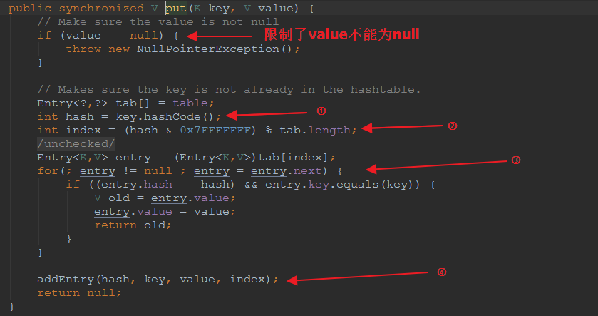

# HashTable

HashTable继承Dictionary类，实现Map接口。

其中Dictionary类是任何可将键映射到相应值的类（如 `Hashtable`）的抽象父类。

每个键和每个值都是一个对象。

在任何一个 `Dictionary` 对象中，每个键至多与一个值相关联。Map是**"key-value键值对"**接口。

HashTable采用"拉链法"实现哈希表，它定义了几个重要的参数：`table、count、threshold、loadFactor、modCount`。

*  `table`：为一个**Entry[]数组类型**，Entry代表了“拉链”的节点，每一个Entry代表了一个键值对，哈希表的"key-value键值对"都是存储在Entry数组中的。
* `count`：HashTable的大小，注意这个大小并不是HashTable的容器大小，而是他所包含Entry键值对的数量。
* ` threshold`：Hashtable的阈值，用于判断是否需要调整Hashtable的容量。**threshold的值="容量*加载因子"**。
* `loadFactor`：加载因子。
*  `modCount`：用来实现“fail-fast”机制的（也就是快速失败）。所谓快速失败就是在并发集合中，其进行迭代操作时，若有其他线程对其进行结构性的修改，这时迭代器会立马感知到，并且立即抛出`ConcurrentModificationException`异常，而不是等到迭代完成之后才告诉你（你已经出错了）。

默认开始的时候，容量为`11`，加载因为为`0.75`  。

```java
public Hashtable(Map<? extends K, ? extends V> t) {
    this(Math.max(2*t.size(), 11), 0.75f);
    putAll(t);
}
```

 定位`index`的方法:

```java
int index = (hash & 0x7FFFFFFF) % tab.length;
```

`put()`方法:

```java
public synchronized V put(K key, V value) {
    if (value == null) {
        throw new NullPointerException();
    }
    // Makes sure the key is not already in the hashtable.
    Entry<?,?> tab[] = table;
    int hash = key.hashCode();
    // 因为hash可能为负数，所以就先和0x7FFFFFFF相与
    // 在HashMap中，是用 (table.length - 1) & hash 计算要放置的位置
    int index = (hash & 0x7FFFFFFF) % tab.length;
    @SuppressWarnings("unchecked")
    Entry<K,V> entry = (Entry<K,V>)tab[index];
    for(; entry != null ; entry = entry.next) {
        if ((entry.hash == hash) && entry.key.equals(key)) {
            V old = entry.value;
            entry.value = value;
            return old;
        }
    }

    addEntry(hash, key, value, index);
    return null;
}
```



* ① 由于直接使用key.hashcode()，而没有向hashmap一样先判断key是否为null，所以key为null时，调用key.hashcode()会出错，所以hashtable中key也不能为null；
* ②hashtable中对hash值进行寻址的方法为hash%数组长度(与hashmap的`index = hash & (tab.length – 1)`不同，所以不要求数组长度必须为2的n次方)；
* ③遍历table[index]所连接的链表，查找是否已经存在key与需要插入的key值相同的节点，如果存在则直接更新value，并返回旧的value；
* ④如果table[index]所连接的链表上不存在相同的key，则通过addEntry()方法将**新节点加到链表的开头**

`addEntry()`方法:

```java
private void addEntry(int hash, K key, V value, int index) {
    modCount++;

    Entry<?,?> tab[] = table;
    if (count >= threshold) {
        // Rehash the table if the threshold is exceeded
        rehash();

        tab = table;
        hash = key.hashCode();
        index = (hash & 0x7FFFFFFF) % tab.length;
    }

    // Creates the new entry.
    @SuppressWarnings("unchecked")
    Entry<K,V> e = (Entry<K,V>) tab[index];
    tab[index] = new Entry<>(hash, key, value, e);
    count++;
}
```

* 如果加入新节点后，hashtable中元素的个数超过了阈值threshold，则利用rehash()对数组进行扩容。
*  e=table[index]，并将新节点加在了e节点的前面，最后table[index]=e。相当于把把新节点放在table[index]位置，即整个链表的首部。 


`rehash()`方法:

```java
protected void rehash() {
    int oldCapacity = table.length;
    Entry<?,?>[] oldMap = table;

    // overflow-conscious code
    int newCapacity = (oldCapacity << 1) + 1;
    if (newCapacity - MAX_ARRAY_SIZE > 0) {
        if (oldCapacity == MAX_ARRAY_SIZE)
            // Keep running with MAX_ARRAY_SIZE buckets
            return;
        newCapacity = MAX_ARRAY_SIZE;
    }
    Entry<?,?>[] newMap = new Entry<?,?>[newCapacity];

    modCount++;
    threshold = (int)Math.min(newCapacity * loadFactor, MAX_ARRAY_SIZE + 1);
    table = newMap;

    for (int i = oldCapacity ; i-- > 0 ;) {
        for (Entry<K,V> old = (Entry<K,V>)oldMap[i] ; old != null ; ) {
            Entry<K,V> e = old;
            old = old.next;

            int index = (e.hash & 0x7FFFFFFF) % newCapacity;
            e.next = (Entry<K,V>)newMap[index];
            newMap[index] = e;
        }
    }
}
```

`rehash()`方法中我们可以看到容量扩大两倍+1，同时需要将原来HashTable中的元素一一复制到新的HashTable中，这个过程是比较消耗时间的，同时还需要重新计算hashSeed的，毕竟容量已经变了。

关于阀值: 比如初始值11、加载因子默认0.75，那么这个时候阀值threshold=8 (`11 * 0.7 5`)，当容器中的元素达到8时，HashTable进行一次扩容操作，容量 = `8 * 2 + 1 = 17`，而阀值`threshold = 17*0.75 = 13`，当容器元素再一次达到阀值时，HashTable还会进行扩容操作，一次类推。

`get()`方法:

```java
public synchronized V get(Object key) {
    Entry<?,?> tab[] = table;
    int hash = key.hashCode();
    int index = (hash & 0x7FFFFFFF) % tab.length;
    for (Entry<?,?> e = tab[index] ; e != null ; e = e.next) {
        if ((e.hash == hash) && e.key.equals(key)) {
            return (V)e.value;
        }
    }
    return null;
}
```

遍历table[index]链表，找到key值相同的节点的value返回，注意同样在该过程中使用到了key的equal方法，所以key被应用与hashtable时不仅要实现hashcode方法还有实现equal方法。


> 附源码注释文章: https://www.cnblogs.com/wupeixuan/p/8620197.html