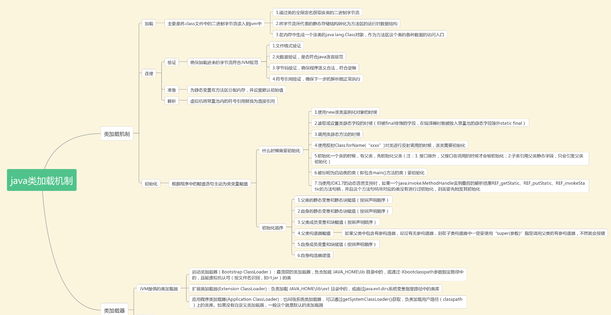
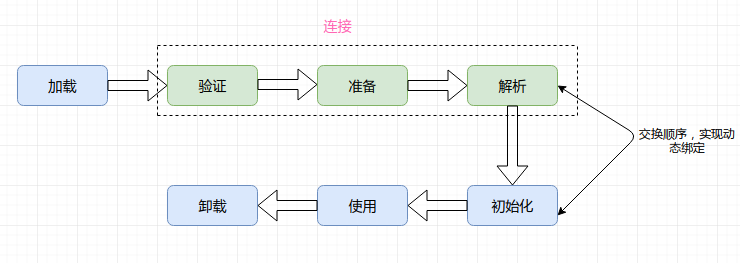
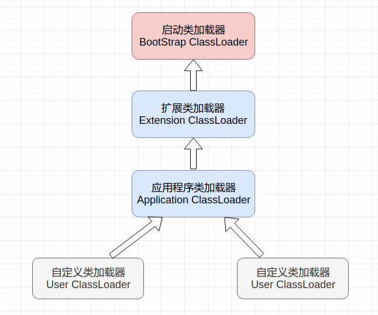

# JVM总结(三) - 类加载机制

* [一、类加载时机](#一类加载时机)
  * [1、主动引用](#1主动引用)
  * [2、被动引用](#2被动引用)
* [二、类加载过程](#二类加载过程)
  * [1、加载](#1加载)
  * [2、验证](#2验证)
  * [3、准备](#3准备)
  * [4、解析](#4解析)
  * [5、初始化](#5初始化)
* [三、类加载器](#三类加载器)
  * [1、类与类加载器](#1类与类加载器)
  * [2、类加载器分类](#2类加载器分类)
  * [3、双亲委派模型](#3双亲委派模型)
  * [4、理解ClassLoader](#4理解classloader)
  * [5、自定义类加载器](#4自定义类加载器)

一张总结图（来自牛客网）



## 一、类加载时机

类从被加载到虚拟机内存中开始，到出内存为止，它的整个生命周期包括 : 加载 (Loading)、验 证(Verification)、准 备 (Preparation)、解 析 (Resolution)、初始化(Initialization)、使用(Using) 和卸载 (Unloading) 7 个阶段。其中验证、准备、解析 3 个部分统称为连接 (Linking)，顺序如图 所示。



其中**解析过程在某些情况下可以在初始化阶段之后再开始**，这是为了支持 Java 的动态绑定。

这 7 个阶段中的：**加载、验证、准备、初始化、卸载**的顺序是固定的。但它们并不一定是严格同步串行执行，它们之间可能会有交叉，但总是以 “开始” 的顺序总是按部就班的。至于解析则有可能在初始化之后才开始，这是为了支持 Java 语言的运行时绑定（也称为动态绑定或晚期绑定）。


Java程序对类的使用方式可以分为两种: **主动引用、被动引用**。

所有的Java虚拟机实现必须在每个类或接口被Java程序 "**首次主动使用**"时才**初始化**他们。

### 1、主动引用

 虚拟机规范中并没有强制约束何时进行加载，但是规范**严格规定了有且只有下列五种情况必须对类进行初始化**（加载、验证、准备都会随之发生）：

* 遇到` new`、`getstatic`、`putstatic`、`invokestatic` 这四条字节码指令时，如果类没有进行过初始化，则必须先触发其初始化。最常见的生成这 4 条指令的场景是：
  * **使用 new 关键字实例化对象的时候**；
  * 读取或设置一个类的静态字段（被 final 修饰、已在编译期把结果放入常量池的静态字段除外）的时候；
  * 以及**调用一个类的静态方法**的时候；
* 通过反射(`Class.forName()`)使用`java.lang.reflect `包的方法对类进行反射调用的时候，如果类没有进行初始化，则需要先触发其初始化；
* 当初始化一个类的时候，**如果发现其父类还没有进行过初始化，则需要先触发其父类的初始化**；
* 当虚拟机启动时，用户需要指定一个要执行的主类（包含 `main() `方法的那个类），虚拟机会先初始化这个主类；
* 当使用 JDK 1.7 的动态语言支持时，如果一个`java.lang.invoke.MethodHandle` 实例最后的解析结果为 `REF_getStatic, REF_putStatic, REF_invokeStatic `的方法句柄，并且这个方法句柄所对应的类没有进行过初始化，则需要先触发其初始化；

### 2、被动引用

**被动使用不会导致类的初始化，只有首次主动引用才会初始化**。

以下三种情况是被动引用:

- 1、通过**子类引用父类的静态字段**，不会导致子类初始化。

测试:

```java
/**
 * 1、对于静态字段来说，只有直接定义了该字段的类才会被初始化
 * 2、当一个类在初始化时，要求其父类全部已经初始化完毕了
 * --X:+TraceClassLoading 用于追踪类的加载信息并打印出来
 *  jvm参数总结:
 *     a、 -XX:+<option>， 表示开启option选项
 *     b、 -XX:-<option>， 表示关闭option选项
 *     c、 -XX:<option>=<value>，表示option选项的值设置为value
 */
public class T1 {

    public static void main(String[] args) {
//        System.out.println(P1.p_str);  //1、对于静态字段来说，只有直接定义了该字段的类才会被初始化
        System.out.println(C1.c_str);    //2、当一个类在初始化时，要求其父类全部已经初始化完毕了

    }
}

class P1{

    public static String p_str = "parent str";

    static {
        System.out.println("Parent static block~");
    }

}

class C1 extends P1{

    public static String c_str = "child str";

    static {
        System.out.println("Child static block~");
    }

}

------------------------------------
分析运行结果:
第一种情况: System.out.println(P1.p_str);
输出: 
Parent static block~
parent str
原因: 由于p_str是父类的，所以不会去加载C1(子类)
第二种情况: System.out.println(C1.c_str);  
输出:
Parent static block~
Child static block~
child str
原因:因为c_str是子类的，而子类加载完毕之前父类都要加载，所以会先输出父类static块
```

- 2、通过**数组定义来引用类**，不会触发此类的初始化。该过程会对数组类进行初始化，数组类是一个由虚拟机自动生成的、直接继承自 Object 的子类，其中包含了数组的属性和方法。

```java
public class T4 {

    public static void main(String[] args) {
        P4 p4_1 = new P4();

        System.out.println("=================");

        P4 p4_2 = new P4(); //这里不会再 执行P4的初始化代码块，只会在  首次主动引用  的时候初始化

        P4[] p4s = new P4[1]; // 数组也不会初始化
        System.out.println(p4s.getClass()); // 对于数组实例来说，其类型是由JVM在运行期间动态生成的，表示为[Lcom.zxin...T4
        P4[][] p4s1 = new P4[1][1];
        System.out.println(p4s1.getClass());

        int[] ints = new int[1];
        System.out.println(ints.getClass());
    }
}

class P4{
    static {
        System.out.println("P4 static block~");
    }
}

输出:(只会进行一次初始化)
P4 static block~
=================
class [Lp1_classloader.P4;
class [[Lp1_classloader.P4;
class [I
```

- 3、**常量**在编译阶段会存入调用类的常量池中，本质上并没有直接引用到定义常量的类，因此不会触发定义常量的类的初始化。

```java
/**
 * final (常量) 对类加载的影响
 *     常量在编译阶段会存入到调用这个常量的方法所在的类的常量池中
 *     本质上，调用类并没有直接引用到定义常量的类，因此不会触发定义常量的类的初始化
 *     注意: 我们指的是 将常量存放到了T2的常量池中，之后T2与P就没有任何关系了(甚至可以将P.class删除)
 *      
 * 助记符:
 *         ldc表示将int,float或是String类型的常量值从常量池中推送至栈顶
 *         bipush表示将单字节(-128~127)的常量值推送至栈顶
 *         sipush表示将int型(-32768~32767)推送至栈顶
 *         iconst_1表示将int型的1推动到栈顶(只有-1~5有这种)
 */
public class T2 {
    public static void main(String[] args) {
        System.out.println(P2.str);
    }
}

class P2{

    public static final String str = "P str";

    static {
        System.out.println("P static block~");
    }
}
```

输出:

```java
P str
```

但是要注意下面的情况:

**当一个常量的值并非编译期间可以确定，那么其值就不会被放到调用类的常量池中，这时在程序运行时，会导致主动使用这个常量所在的类，显然会导致这个列被初始化**。

```java

/**
 * 当一个常量的值并非编译期间可以确定，那么其值就不会被放到调用类的常量池中，
 * 这时在程序运行时，会导致主动使用这个常量所在的类，显然会导致这个列被初始化
 */
public class T3 {

    public static void main(String[] args) {
        System.out.println(P3.str);
    }
}

class P3{

    public static final String str = UUID.randomUUID().toString();

    static {
        System.out.println("P static block~");
    }
}

输出(可以看到P3被加载(static块被输出)):
P static block~
b716f2dd-5a6e-4542-bc88-0cf833216de5
```

* **当一个接口在初始化时，并不要求其父接口都完成了初始化，只有在真正用到父接口的时候，如引用接口中定义的常量时，才会初始化**。

```java
/**
 * 都可以删除
 * 可以删除父接口PI5的.class文件 和 子接口CI5的.class文件
 */
public class T5{
	
	public static void main(String[] args){
		System.out.println(CI5.b);
	}
}

interface PI5{
	public static final int a = new Random().nextInt(4);
}

interface CI5 extends PI5{
	public static final int b = 5;
}
```

可以发现删除`PI5.class`文件之后，也可以运行（如果改成类`class`，且不加上final关键字，就会抛出异常，因为接口就算不加`final`关键字，默认也会加上(接口里面的变量默认是`public static final`)）


但是下面的动态引用还是会需要用到父类的初始化。

```java
/**
 * 这种情况两个都不能删除
 */
public class T5{
	
	public static void main(String[] args){
		System.out.println(CI5.b);
	}
}

interface PI5{
	public static final int a = new Random().nextInt(4);
}

interface CI5 extends PI5{
	//public static final int b = 5;
	public static final int b = new Random().nextInt(5);
}
```

删除父接口的`.class`之后，再次运行，也会抛出异常。（两个都不能删除）


### 3、类加载顺序

类的加载由上到下进行。

注意下列代码。

```java
public class T7 {

    public static void main(String[] args) {

        Singleton singleton = Singleton.getInstance();

        System.out.println("counter1 : " + Singleton.counter1);
        System.out.println("counter2 : " + Singleton.counter2);
    }
}

/**
 * 初始化的顺序: 从上往下
 */
class Singleton{

    public static int counter1;

    private static Singleton singleton = new Singleton();

    private Singleton(){
        counter1++;
        counter2++; //一开始是1，后面又变成了0  (准备阶段的意义)
//        System.out.println("类加载初始化的时候-------counter1 : "+ counter1 + ",  counter2 : " + counter2);
    }

    public static int counter2 = 0; //由1变成0

    public static Singleton getInstance(){
        return singleton;
    }
}
```

上述代码输出：

```java
counter1 : 1
counter2 : 0
```

因为类加载从上到下，虽然在私有构造方法中`counter2`被赋值成了`1`，但是初始化后面代码的时候，又被赋值成了`0`。

## 二、类加载过程

包含了加载、验证、准备、解析和初始化这 5 个阶段（也就是类的生命周期的前5个阶段）。

### 1、加载

加载是类加载的一个阶段，不要混淆。

加载过程完成以下三件事：

- **通过一个类的全限定名来获取定义此类的二进制字节流，即将类的`.class`文件中的二进制数据读入到内存中**(这个就是类加载器做的事情)；
- 将这个**字节流所代表的静态存储结构转化为方法区的运行时存储结构**；
- 在内存中生成一个代表这个类的 **Class 对象(java.lang.Class)**，作为方法区这个类的各种数据的访问入口；

加载源（即二进制字节流可以从以下方式中获取）：

- **文件**：从 ZIP 包读取，这很常见，最终成为日后 JAR、EAR、WAR 格式的基础。
- **网络**：从网络中获取，这种场景最典型的应用是 Applet。
- **计算生成一个二进制流**：运行时计算生成，这种场景使用得最多得就是动态代理技术，在 `java.lang.reflect.Proxy` 中，就是用了` ProxyGenerator.generateProxyClass` 的代理类的二进制字节流。
- **由其他文件生成**：由其他文件生成，典型场景是 JSP 应用，即由 JSP 文件生成对应的 Class 类。
- **数据库**：从数据库读取，这种场景相对少见，例如有些中间件服务器（如 SAP Netweaver）可以选择把程序安装到数据库中来完成程序代码在集群间的分发。

### 2、验证

目的：确保 Class 文件的字节流中包含的信息符合当前虚拟机的要求，并且不会危害虚拟机自身的安全。

- 文件格式验证：验证字节流是否符合 Class 文件格式的规范，并且能被当前版本的虚拟机处理。
  - 是否以 0xCAFEBABE 开头，前四个字节为魔数；
  - 版本号是否合理，如：JDK1.8（52.0）、JDK1.7（51.0）；
  - 常量池中的常量是否有不被支持的类型；
- 元数据验证：对字节码描述的信息进行语义分析，以保证其描述的信息符合 Java 语言规范的要求。
  - 是否有父类-(除了Object类之外，所有的类都应该有父类)；
  - 继承了 final 类？;
  - 非抽象类实现了所有的抽象方法；
- 字节码验证（很复杂）：通过数据流和控制流分析，确保程序语义是合法、符合逻辑的。
  - 运行检查；
  - 栈数据类型和操作码数据参数吻合；
  - 跳转指令指定到合理的位置；（保证不会跳转到方法体以外的字节码上）
- 符号引用验证：发生在虚拟机将符号引用转换为直接引用的时候，对类自身以外（常量池中的各种符号引用）的信息进行匹配性校验。
  - 常量池中描述类是否存在；
  - 访问的方法或字段是否存在且有足够的权限；

### 3、准备

准备阶段正式为**类变量分配内存并设置变量的初始值，但在到达初始化之前，类变量都没有初始化为真正的初始值**。这些变量使用的内存都将在**方法区**中进行分配。类变量是被 static 修饰的变量，准备阶段为类变量分配内存并设置初始值，使用的是方法区的内存。

**实例变量不会在这阶段分配内存，它将会在对象实例化时随着对象一起分配在堆中**。注意，**实例化不是类加载的一个过程，类加载发生在所有实例化操作之前，并且类加载只进行一次，实例化可以进行多次**。

初始值一般为 0 值，例如下面的类变量 value 被初始化为 0 而不是 123，在初始化的 `<clinit>` 中才会被设置为1。

```java
public static int value = 123; // 只有在初始化的<clinit>中才会是123，在准备阶段只是0
```

有一个特例就是`final`型的，即`static final`型的变量会在准备的阶段就附上正确的值:

```java
public static final int value = 123; 
```

### 4、解析

解析阶段是虚拟机将常量池的**符号引用替换为直接引用**的过程:

- 类或接口的解析
- 字段解析
- 类方法解析
- 接口方法解析

> **什么是符号引用和直接引用**？

> - **符号引用**：符号引用是一组符号来描述所引用的目标对象，符号可以是任何形式的字面量，只要使用时能无歧义地定位到目标即可。符号引用与虚拟机实现的内存布局无关，引用的目标对象并不一定已经加载到内存中。
> - **直接引用**：*直接引用可以是直接指向目标对象的指针*、相对偏移量或是一个能间接定位到目标的句柄。直接引用是与虚拟机内存布局实现相关的，同一个符号引用在不同虚拟机实例上翻译出来的直接引用一般不会相同，如果有了直接引用，那引用的目标必定已经在内存中存在。

> 符号引用就是字符串，这个字符串包含足够的信息，以供实际使用时可以找到相应的位置。你比如说某个方法的符号引用，如：`“java/io/PrintStream.println:(Ljava/lang/String;)”`。里面有类的信息，方法名，方法参数等信息。

> 当第一次运行时，要根据字符串的内容，到该类的方法表中搜索这个方法。运行一次之后，符号引用会被替换为直接引用，下次就不用搜索了。直接引用就是偏移量，通过偏移量虚拟机可以直接在该类的内存区域中找到方法字节码的起始位置。

### 5、初始化

**初始化阶段才真正开始执行类中定义的 Java 程序代码**。初始化阶段即虚拟机执行类构造器 `<clinit>()` 方法的过程。

在准备阶段，**类变量已经赋过一次系统要求的初始值，而在初始化阶段，根据程序员通过程序制定的主观计划去初始化类变量和其它资源，即为类的静态变量赋予正确的初始值**。

`<clinit>()` 方法具有以下特点：

* 是由编译器自动收集类中所有类变量的赋值动作和静态语句块中的语句合并产生的，编译器收集的顺序由语句在源文件中出现的顺序决定。特别注意的是，静态语句块只能访问到定义在它之前的类变量，定义在它之后的类变量只能赋值，不能访问。例如以下代码：

```java
public class Test {
    static {
        i = 0;                // 给变量赋值可以正常编译通过
        System.out.print(i);  // 这句编译器会提示“非法向前引用”
    }
    static int i = 1;
}
```

- 与类的构造函数（或者说实例构造器` <init>()`）不同，不需要显式的调用父类的构造器。虚拟机会自动保证在子类的 `<clinit>()` 方法运行之前，父类的 `<clinit>()` 方法已经执行结束。因此虚拟机中第一个执行` <clinit>() `方法的类肯定为 `java.lang.Object`。

- 由于父类的 `<clinit>()` 方法先执行，也就意味着父类中定义的静态语句块要优先于子类的变量赋值操作。例如以下代码：

```java
class Parent {
    public static int A = 1;
    static {
        A = 2;
    }
}

class Sub extends Parent {
    public static int B = A;
}

public class Test {
    public static void main(String[] args) {
        System.out.println(Sub.B);  // 2
    }
}
```

* `<clinit>()` 方法对于类或接口不是必须的，如果一个类中不包含静态语句块，也没有对类变量的赋值操作，编译器可以不为该类生成` <clinit>() `方法。
* 接口中不可以使用静态语句块，但仍然有类变量初始化的赋值操作，因此接口与类一样都会生成 `<clinit>() `方法。但接口与类不同的是，执行接口的 `<clinit>()` 方法不需要先执行父接口的 `<clinit>()` 方法。只有当父接口中定义的变量使用时，父接口才会初始化。另外，接口的实现类在初始化时也一样不会执行接口的 `<clinit>()` 方法。
* 虚拟机会保证一个类的 `<clinit>() `方法在多线程环境下被正确的加锁和同步，如果多个线程同时初始化一个类，只会有一个线程执行这个类的` <clinit>() `方法，其它线程都会阻塞等待，直到活动线程执行`<clinit>()` 方法完毕。如果在一个类的 `<clinit>()` 方法中有耗时的操作，就可能造成多个线程阻塞，在实际过程中此种阻塞很隐蔽。

## 三、类加载器

 虚拟机设计团队把**类加载阶段中的 “通过一个类的全限定名来获取描述此类的二进制字节流（即字节码）” 这个动作放到 Java 虚拟机外部去实现**，以便让应用程序自己决定如何去获取所需要的类（通过一个类的全限之名获取描述此类的二进制字节流）。实现这个动作的代码模块称为 **“类加载器”**。

简而言之: **类加载器ClassLoader就是加载其他类的类，它负责将字节码文件加载到内存，创建Class对象**。

运行Java程序，就是执行java这个命令，指定包含main方法的完整类名，以及一个classpath，即类路径。类路径可以有多个，对于直接的class文件，路径是class文件的根目录，对于jar包，路径是jar包的完整名称（包括路径和jar包名）。

Java运行时，会根据**类的完全限定名寻找并加载类，寻找的方式基本就是在系统类和指定的类路径中寻找，如果是class文件的根目录，则直接查看是否有对应的子目录及文件，如果是jar文件，则首先在内存中解压文件，然后再查看是否有对应的类**。

**负责加载类的类就是类加载器，它的输入是完全限定的类名，输出是Class对象**。

### 1、类与类加载器

两个类相等，需要类本身相等，并且使用同一个类加载器进行加载。这是因为每一个类加载器都拥有一个独立的类名称空间。

这里的相等，包括类的 Class 对象的 `equals()` 方法、`isAssignableFrom() `方法、`isInstance() `方法的返回结果为 true，也包括使用 instanceof 关键字做对象所属关系判定结果为 true。

### 2、类加载器分类

从 Java 虚拟机的角度来讲，只存在以下两种不同的类加载器：

- **启动类加载器**（Bootstrap ClassLoader），这个类加载器用 C++ 实现，是虚拟机自身的一部分；
- **所有其他类的加载器**，这些类由 Java 实现，独立于虚拟机外部，并且全都继承自抽象类 `java.lang.ClassLoader`。

按照开发人员来说，类加载器不是只有一个，一般程序运行时，都会有三个：

* 启动类加载器(`Bootstrap ClassLoader`)：这个加载器是Java虚拟机实现的一部分，不是Java语言实现的，一般是C++实现的，它负责加载Java的基础类，主要是`<JAVA_HOME>/lib/rt.jar`，我们日常用的Java类库比如String, ArrayList等都位于该包内。
* 扩展类加载器(`Extension ClassLoader`)：这个加载器的实现类是`sun.misc.Launcher$ExtClassLoader`，它负责加载Java的一些扩展类，一般是`<JAVA_HOME>/lib/ext`目录中的jar包。
* 应用程序类加载器(`Application ClassLoade`r)：这个加载器的实现类是`sun.misc.Launcher$AppClassLoader`，它负责加载应用程序的类，包括自己写的和引入的第三方法类库，即所有在类路径中指定的类。

### 3、双亲委派模型

上面的三种加载器有一定的关系，可以认为是父子关系，`Application ClassLoader`的父亲是`Extension ClassLoader`，Extension的父亲是`Bootstrap ClassLoader`，**注意不是父子继承关系，而是父子委派关系，子ClassLoader有一个变量parent指向父ClassLoader，在子ClassLoader加载类时，一般会首先通过父ClassLoader加载**，具体来说，在加载一个类时，基本过程是：

* 判断是否已经加载过了，加载过了，直接返回Class对象，一个类只会被一个ClassLoader加载一次。
* 如果没有被加载，先让父ClassLoader去加载，如果加载成功，返回得到的Class对象。
* 在父ClassLoader没有加载成功的前提下，自己尝试加载类。

这个过程一般被称为"双亲委派"模型，即优先让父ClassLoader去加载。为什么要先让父ClassLoader去加载呢？这样，可以**避免Java类库被覆盖**的问题，比如用户程序也定义了一个类`java.lang.String`，通过双亲委派，java.lang.String只会被Bootstrap ClassLoader加载，避免自定义的String覆盖Java类库的定义。需要了解的是，"双亲委派"虽然是一般模型，但也有一些例外，比如：

- 自定义的加载顺序：尽管不被建议，自定义的ClassLoader可以不遵从"双亲委派"这个约定，不过，即使不遵从，以"java"开头的类也不能被自定义类加载器加载，这是由Java的安全机制保证的，以避免混乱。
- 网状加载顺序：在OSGI框架中，类加载器之间的关系是一个网，每个OSGI模块有一个类加载器，不同模块之间可能有依赖关系，在一个模块加载一个类时，可能是从自己模块加载，也可能是委派给其他模块的类加载器加载。
- 父加载器委派给子加载器加载：典型的例子有JNDI服务(`Java Naming and Directory Interface`)，它是Java企业级应用中的一项服务。

一个程序运行时，会创建一个Application ClassLoader，在程序中用到ClassLoader的地方，如果没有指定，一般用的都是这个ClassLoader，所以，**这个ClassLoader也被称为系统类加载器(System ClassLoader)**。



>  如果加载同一个类，该使用哪一个类？父类的。
>
>  为什么要使用双亲委派模型？**主要是为了避免重复加载的问题**。

### 4、理解ClassLoader

类ClassLoader是一个抽象类，Application ClassLoader和Extension ClassLoader的具体实现类分别是`sun.misc.Launcher$AppClassLoader`和`sun.misc.Launcher$ExtClassLoader`，Bootstrap ClassLoader不是由Java实现的，没有对应的类。

每个Class对象都有一个方法，可以获取实际加载它的ClassLoader，方法是： 

```java
public ClassLoader getClassLoader()
```

ClassLoader有一个方法，可以获取它的父ClassLoader：

```java
public final ClassLoader getParent()
```

如果ClassLoader是Bootstrap ClassLoader，返回值为null。

测试:

```java
public class ClassLoaderDemo {

    public static void main(String[] args) {
        ClassLoader cl = ClassLoaderDemo.class.getClassLoader();

        while (cl != null) {
            System.out.println(cl.getClass().getName());
            cl = cl.getParent(); // 一直向上
        }

        System.out.println(String.class.getClassLoader()); // 最后 = null
    }
}
```

输出:

```java
sun.misc.Launcher$AppClassLoader
sun.misc.Launcher$ExtClassLoader
null
```

ClassLoader有一个静态方法，可以获取默认的系统类加载器：

```java
public static ClassLoader getSystemClassLoader()
```

ClassLoader中有一个主要方法，用于加载类：

```java
public Class<?> loadClass(String name) throws ClassNotFoundException
```

测试: 

```java
/**
 * 由于委派机制，Class的getClassLoader()方法返回的不一定是调用loadClass的ClassLoader，
 * 比如，下面代码中，java.util.ArrayList实际由BootStrap ClassLoader加载，所以返回值就是null。
 */
public class Test {

    public static void main(String[] args) {
        ClassLoader cl = ClassLoader.getSystemClassLoader();
        try {
            Class<?> cls = cl.loadClass("java.util.ArrayList"); // 加载这个
            ClassLoader actualLoader = cls.getClassLoader();
            System.out.println(actualLoader);
        } catch (ClassNotFoundException e) {
            e.printStackTrace();
        }
    }
}
```

由于委派机制，Class的`getClassLoader()`方法返回的不一定是调用loadClass的ClassLoader，比如，上面代码中，`java.util.ArrayList`实际由BootStrap ClassLoader加载，所以返回值就是null。

在反射中，有两个方法:

```java
public static Class<?> forName(String className)
public static Class<?> forName(String name, boolean initialize, ClassLoader loader)
```

第一个方法使用系统类加载器加载。第二个指定ClassLoader，参数initialize表示，加载后，是否执行类的初始化代码(如static语句块)，没有指定默认为true。

ClassLoader的loadClass方法和上面forName方法都可以加载类，它们有什么不同呢？基本是一样的，不过，有一个不同，**ClassLoader的loadClass不会执行类的初始化代码**，看个例子：

```java
public class CLInitDemo {

    static class Hello {
        static {
            System.out.println("hello");
        }
    }

    public static void main(String[] args) {
        ClassLoader cl = ClassLoader.getSystemClassLoader();
        String className = CLInitDemo.class.getName() + "$Hello";
        try {
//            Class<?> cls = cl.loadClass(className); //没有输出
            Class<?> cls = Class.forName(className); //输出 hello
        } catch (ClassNotFoundException e) {
            e.printStackTrace();
        }
    }
}
```

使用ClassLoader加载静态内部类Hello，Hello有一个static语句块，输出"hello"，运行该程序，类被加载了，但没有任何输出，即static语句块没有被执行。如果将loadClass的语句换为：` Class<?> cls = Class.forName(className);`，则static语句块会被执行，屏幕将输出"hello"。

> 面试题: 
>
> Java中Class.forName和classloader都可以用来对类进行加载，他们的区别?。 
>
> `Class.forName()`除了将类的.class文件加载到jvm中之外，还会对类进行解释，执行类中的static块。
>
> 而classloader只干一件事情，就是将`.class`文件加载到jvm中，不会执行static中的内容，只有在`newInstance`才会去执行static块。
>
> `Class.forName(name,initialize,loader)`带参数也可控制是否加载static块。并且只有调用了newInstance()方法采用调用构造函数，创建类的对象。

看一下ClassLoader的loadClass的源代码:

```java
public Class<?> loadClass(String name) throws ClassNotFoundException {
    return loadClass(name, false);
}
```

它调用了另一个loadClass方法，其主要代码为(省略了一些代码，加了注释，以便于理解)：

```java
protected Class<?> loadClass(String name, boolean resolve)
        throws ClassNotFoundException {
    synchronized (getClassLoadingLock(name)) {
        // 首先，检查类是否已经被加载了
        Class c = findLoadedClass(name);
        if (c == null) {
            //没被加载，先委派父ClassLoader或BootStrap ClassLoader去加载
            try {
                if (parent != null) {
                    //委派父ClassLoader，resolve参数固定为false
                    c = parent.loadClass(name, false);
                } else {
                    c = findBootstrapClassOrNull(name);
                }
            } catch (ClassNotFoundException e) {
                //没找到，捕获异常，以便尝试自己加载                
            }
            if (c == null) {
                // 自己去加载，findClass才是当前ClassLoader的真正加载方法
                c = findClass(name);
            }
        }
        if (resolve) {
            // 链接，执行static语句块
            resolveClass(c);
        }
        return c;
    }
}
```

参数resolve类似`Class.forName`中的参数initialize，可以看出，其默认值为false，即使通过自定义ClassLoader重写loadClass，设置resolve为true，它调用父ClassLoader的时候，传递的也是固定的false。

findClass是一个protected方法，类ClassLoader的默认实现就是抛出`ClassNotFoundException`，子类应该重写该方法，实现自己的加载逻辑，后文我们会看个具体例子。

### 5、自定义类加载器

载器步骤：

- 定义一个类，继承 ClassLoader；
- 重写 loadClass 方法；
- 实例化 Class 对象；

自定义类加载器的优势

- 类加载器是 Java 语言的一项创新，也是 Java 语言流行的重要原因之一，它最初的设计是为了满足 java applet 的需求而开发出来的；
- 高度的灵活性；
- 通过自定义类加载器可以实现热部署；
- 代码加密；