# JVM总结(二) - 垃圾收集器与内存分配策略

* [一、垃圾回收概述](#一垃圾回收概述)
* [二、如何判定对象为垃圾对象](#二如何判定对象为垃圾对象)
  * [1、引用计数法](#1引用计数法)
  * [2、可达性分析算法](#2可达性分析算法)
  * [3、引用分类](#3引用分类)
  * [4、生存还是死亡-finalize()方法](#4生存还是死亡-finalize方法)
  * [5、回收方法区](#5回收方法区)
* [三、垃圾回收算法](#三垃圾回收算法)
  * [1、标记清除算法](#1标记清除算法)
  * [2、复制算法](#2复制算法)
  * [3、标记整理算法](#3标记整理算法)
  * [4、分代收集算法](#4分代收集算法)
* [四、垃圾收集器](#五垃圾收集器)
  * [1、各个垃圾收集器的联系](#1各个垃圾收集器的联系)
  * [2、Serial收集器](#2serial收集器)
  * [3、ParNew收集器](#3parnew收集器)
  * [4、Parallel Scavenge收集器](#4parallel-scavenge收集器)
  * [5、Serial Old收集器](#5serial-old收集器)
  * [6、Paralell Old收集器](#6paralell-old收集器)
  * [7、CMS收集器](#7cms收集器)
  * [8、G1收集器](#8g1收集器)
  * [9、各种垃圾收集算法的对比](#9各种垃圾收集算法的对比)
* [五、内存分配与回收策略](#六内存分配与回收策略)
  * [1、对象优先在Eden分配](#1对象优先在eden分配)
  * [2、大对象直接进入老年代](#2大对象直接进入老年代)
  * [3、长期存活对象将进入老年代](#3长期存活对象将进入老年代)
  * [4、空间分配担保](#4空间分配担保)
  * [5、动态对象年龄判定](#5动态对象年龄判定)
  * [6、关于逃逸分析以及栈上分配](#6关于逃逸分析以及栈上分配)

***

## 一、垃圾回收概述

关于垃圾回收，主要探讨下面四个问题。

* 1、回收区域

  * **程序计数器、虚拟机栈和本地方法栈**这三个区域属于**线程私有**的，只存在于线程的生命周期内，线程结束之后也会消失，因此不需要对这三个区域进行垃圾回收；
  * 垃圾回收主要是针对 **Java堆和方法区**进行；
* 2、如何判定对象为垃圾对象

  * 引用计数法；
  * 可达性分析；
* 3、如何回收  

  * 回收策略: **标记清除法，复制算法，标记整理法，分代收集算法；**
  * 垃圾回收器(垃圾收集器): **Serial、Parnew、Cms、G1**；
* 4、 何时回收

>  下面的章节对上面的四个方面展开探讨。

***
## 二、如何判定对象为垃圾对象
### 1、引用计数法

* 在对象中添加一个引用计数器；
* 当有地方引用这个对象的时候，引用计数器的值就`+1`，当引用失效的时候，计数器的值就`-1`； 
* 当某个对象的引用计数器的值为`0`的时候，就回收这个对象；
* 这种方法不常用；

示例:

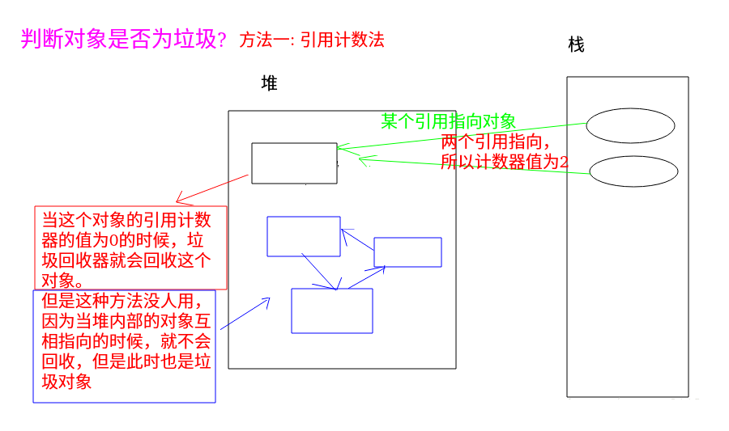

简单的代码验证:

注意要查看JVM的内容，要在运行的时候添加相关的参数: 

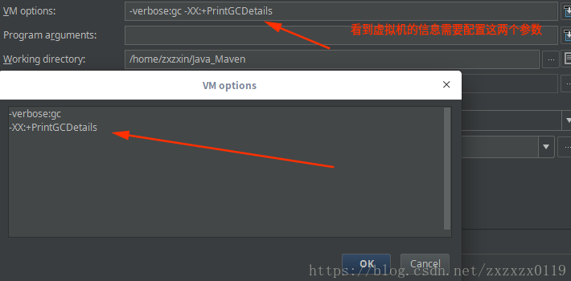


下面进行下图的过程: 
  

代码如下: 

```java
public class ReferenceCountingGC {

    private static class Clazz{
        public Object val;
    }

    public static void main(String[] args) {

        Clazz A = new Clazz();
        Clazz B = new Clazz();

        //内部相互引用
        A.val = B;
        B.val = A;

        //断开外部的引用
        A = null;
        B = null;

        //这里可以回收，说明不是使用的引用计数法
        System.gc(); //通知垃圾回收器回收

        //使用的parallel 垃圾收集器　(没有使用引用计数法)
    }
}

```
看到运行结果 (可以发现还是进行了回收，所以不是用的引用计数法): 


在构造函数中添加内存(创建一个20MB的字节数组)： 

```java
public class ReferenceCountingGC {

    private static class Clazz{
        public Object val;

        public Clazz() {
            byte[] bytes = new byte[20 * 1024 * 1024]; //20MB
        }
    }

    public static void main(String[] args) {

        Clazz A = new Clazz();
        Clazz B = new Clazz();

        //内部相互引用
        A.val = B;
        B.val = A;

        //断开外部的引用
        A = null;
        B = null;

        //这里可以回收，说明不是使用的引用计数法
        System.gc(); //通知垃圾回收器回收
    }
}

```
运行效果: 


### 2、可达性分析算法

第二种判定垃圾对象的方法: 可达性分析法，这个可以解决上面引用计数法不能判定堆内部垃圾对象的问题；


可达性分析算法

* 通过一系列的称为`"GC Roots"`的对象为起点，从这些节点开始向下搜索，搜索走过的路径称为引用链；
* 当一个对象到GC Roots没有任何引用链的时候，则说明这个对象是垃圾对象；

可以作为GC Roots的对象包括一下几个方面:

* 虚拟机栈(栈帧中的本地变量表)中的引用的对象；
* 方法区中类静态属性引用的对象；
* 方法区中常亮对象的引用；
* 本地方法栈中JNI(即一般说的Native方法)引用的对象；

如图: 上面的四个对象存活，下面的三个对象为垃圾对象: 


### 3、引用分类

主要分类:


* 强引用: `StrongReference`: 引用指向对象，类似`"Object obj = new Object();"`这类引用，`gc(Garbage Collection)`运行时不回收；
* 软引用: `SoftReference`: gc运行时**可能**回收(jvm内存不够(内存溢出异常))；
* 弱引用: `WeakReference `: 描述非必须对象，强度比软引用更加弱一些，被弱引用关联的对象只能生存到下一次垃圾回收之前，当垃圾回收器工作时，**无论当前内存是否足够**，都会回收掉这些被弱引用关联的对象(gc运行时回收)；
* 虚引用: `PhantomReference` 类似于无引用，主要跟踪对象被回收的状态，不能单独使用，必须与引用队列(ReferenceQueue)联合使用；

**目的: 避免对象长期驻留在内存中，解决垃圾回收机制回收时机问题；**

*弱引用举例: WeakHashMap : 键为弱引用，回收建后自动删除key-value对象*；

测试:

```java
import java.lang.ref.WeakReference;
import java.util.WeakHashMap;

/**
 * 强与弱引用
 */
public class Refclassify {

    public static void main(String[] args) {

        System.out.println("---------------测试强引用-----------------");
        //强引用: 字符串常量池 (不能回收)
        String str = "abc";
        //弱引用管理 str 对象
        WeakReference<String>wr = new WeakReference<String>(str);
        System.out.println("GC运行前: " + wr.get());
        str = null; // 断开引用
        //通知回收
        System.gc();
        System.runFinalization();
        System.out.println("GC运行后: " + wr.get());


        System.out.println("---------------测试弱引用-----------------");

        
        //注意这里是new String
        String str2 = new String("abc");
        WeakReference<String>wr2 = new WeakReference<String>(str2);
        System.out.println("GC运行前: " + wr2.get());
        str2 = null;
        System.gc();
        System.runFinalization();
        System.out.println("GC运行后: " + wr2.get()); //弱引用管理--> 被回收


        System.out.println("-------------WeakHashMap----------------");//键为弱类型，GC运行被回收
        WeakHashMap<String,String>map = new WeakHashMap<>();
        map.put("a","a1");
        map.put("b","b1");
        //下面两个会被回收   如果map中占用内存很大，希望运行后被回收，就可以使用这个 
        map.put(new String("c"),"c1");
        map.put(new String("d"),"d1");
        System.out.println(map.size());
        System.gc();
        System.runFinalization();
        System.out.println(map.size());
    }
}

```
运行结果：
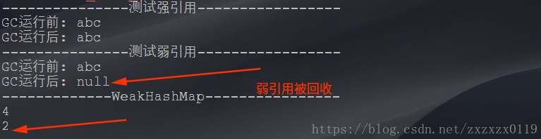

### 4、生存还是死亡-finalize()方法

`finalize()`方法

* **finalize() 类似 C++ 的析构函数，用来做关闭外部资源等工作。**
* 但是 `try-finally` 等方式可以比`finalize()`做的更好，并且该方法运行代价高昂，不确定性大，无法保证各个对象的调用顺序，因此最好不要使用。
* 当一个对象可被回收时，如果需要执行该对象的 finalize() 方法，那么就有可能通过在该方法中让对象重新被引用，从而实现自救。
* **自救只能进行一次，如果回收的对象之前调用了 finalize() 方法自救，后面回收时不会调用 finalize() 方法**。

> 即使在可达性分析算法中不可达的对象，也并非是“非死不可”的，这时候它们暂时处于“缓刑”阶段，要真正宣告一个对象死亡，至少要经历两次标记过程，如果对象在进行可达性分析后发现没有与 GC Roots 相连接的引用链，那它将会被第一次标记并且进行一次筛选，筛选的条件是此对象是否有必要执行 finalize() 方法。当对象没有覆盖 finalize() 方法，或者 finalize() 方法已经被虚拟机调用过，虚拟机将这两种情况都视为“没有必要执行"。
> 如果这个对象被判定为有必要执行 finalize() 方法，那么这个对象将会放置在一个叫做F-Queue 的队列之中，并在稍后由一个由虚拟机自动建立的、低优先级的 Finalizer 线程去执行它。 这里所谓的“执行”是指虚拟机会触发这个方法，但并不承诺会等待它运行结束，这样做的原因是，如果一个对象在 finalize() 方法中执行缓慢，或者发生了死循环(更极端的情况)，将很可能会导致 F-Queue 队列中其他对象永久处于等待，甚至导致整个内存回收系统崩溃。**finalize()方法是对象逃脱死亡命运的最后一次机会**，稍后 GC 将对 F-Queue 中的对象进行第二次小规模的标记，如果对象要在 finalize()中成功拯救自己一一**只要重新与引用链上的任何一个对象建立关联即可，比如把自己 (this 关键字) 赋值给某个类变量或者对象的成员变量**，那在第二次标记时它将被移除出“即将回收”的集合; 如果对象这时候还没有逃脱，那基本上它就真的被回收了。

总结: 

* 对象可以在被GC时 自我拯救；
* 这种自救的机会只有一次，因为一个对象的finalize()方法最多只会被系统自动调用一次；
测试:

```java
/**
 * 此代码演示了两点:
 *   (1) 对象可以在被GC时 自我拯救;
 *   (2) 这种自救的机会只有一次，因为一个对象的finalize()方法最多只会被系统自动调用一次;
 */
public class FinalizeEscapeGC {

    public static FinalizeEscapeGC SAVE_HOOK = null;

    @Override
    protected void finalize() throws Throwable {
        super.finalize();
        System.out.println("finalize method executed !");

        FinalizeEscapeGC.SAVE_HOOK = this; //最后的自救  --> 把自己(this关键字)赋值给某个类变量或者对象的成员变量
    }

    public static void main(String[] args) throws InterruptedException {

        SAVE_HOOK = new FinalizeEscapeGC();

        /**
         * 第一次成功拯救自己
         */

        SAVE_HOOK = null; //没用的对象
        System.gc();      // 通知回收

        //在finalize()中拯救对象 --> 因为finalize()方法优先级很低，所以暂停0.5秒以等待它
        Thread.sleep(500);
        if(SAVE_HOOK != null){
            System.out.println("yes,I'm still alive !");
        }else {
            System.out.println("no ,I'm dead !");
        }

        /**
         * 下面的代码和上面的完全相同，但是这次却自救失败，
         * 因为任何一个对象的finalize()方法都只会被系统自动调用一次
         * 如果进行下一次回收，它的finalize()方法不会再次执行;
         */
        SAVE_HOOK = null;
        System.gc();
        Thread.sleep(500);
        if(SAVE_HOOK != null){
            System.out.println("yes,I'm still alive !");
        }else {
            System.out.println("no ,I'm dead !");
        }
    }
}

```
运行结果: 

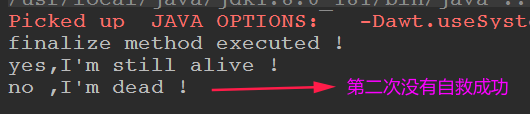


### 5、回收方法区

很多人认为方法区 (或者 HotSpot 虚拟机中的永久代) 是没有垃圾收集的，但是并不是没有，只是在方法区中进行垃圾收集的“性价比”一般比较低 ，而在堆中，尤其是在新生代中，常规应用进行一次垃圾收集一般可以回收 70% ~ 95% 的空间，而永久代的垃圾收集效率远低于此。

**永久代的垃圾收集主要回收两部分内容 : 废弃常量和无用的类**。回收废弃常量与回收Java 堆中的对象非常类似。以常量池中字面量的回收为例，假如一个字符串“abc”已经进入了常量池中，但是当前系统没有任何一个String 对象是叫做“abc”的，换句话说，就是没有任何 String 对象引用常量池中的“abc”常量，也没有其他地方引用了这个字面量，如果这时发生内存回收，而且必要的话，这个“abc”常量就会被系统清理出常量地。常量池中的其他类(接口)、方法、字段的符号引用也与此类似。判定一个常量是否是“废弃常量”比较简单，而要判定一个类是否是“无用的类”的条件则相对苛刻许多。类需要同时满足下面 3 个条件才能算是"无用的类":

* 该类所有的实例都已经被回收，也就是 Java 堆中不存在该类的任何实例。
* 加载该类的 ClassLoader 已经被回收。
* 该类对应的 java.lang.Class 对象没有在任何地方被引用，无法在任何地方通过反射访问该类的方法。

虚拟机可以对满足上述 3 个条件的无用类进行回收，这里说的仅仅是“可以” 。而并不是和对象一样，不使用了就必然会回收。

是否对类进行回收，HotSpot 虚拟机提供了 `-Xnoclassgc` 参数进行控制，还可以使用 `-verbose:class` 以及 `-XX:HTraceClassLoading`、`-XX:HTraceClassUnLoading` 查看类加载和印载信息。

***
## 三、垃圾回收算法
### 1、标记清除算法

* 分为"标记"和"清除"两个阶段: 首先标记出所有需要回收的对象，在标记完成后统一回收所有被标记的对象；
* 主要的两个不足: **(1)效率问题，标记和清除的效率都不高；(2) 空间问题，标记清除之后会产生大量的不连续的内存碎片**，空间碎片太多可能导致以后在程序运行过程中需要分配较大对象时，无法找到足够的内存而不得不提前触发另一次垃圾收集动作；

标记清除算法执行过程如下:

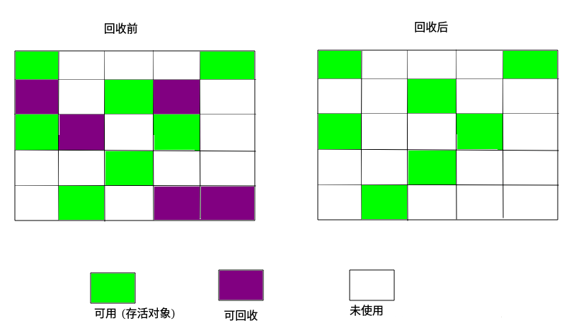

### 2、复制算法

为了解决效率问题，一种称为“复制”(Copying) 的收集算法出现了，它的工作流程如下:

* 它将可用内存按容量划分为大小相等的两块，每次只使用其中的一块；
* 当这一块的内存用完了，就将还存活着的对象复制到另外一块上面；
* 然后再把已使用过的内存空间一次清理掉。

这样使得每次都是对整个**半区进行内存回收**，内存分配时也就不用考虑内存碎片等复杂情况，只要移动堆顶指针，按顺序分配内存即可，实现简单，运行高效。只是这种算法的代价是将内存缩小为了原来的一半，未免太高了一点。

两块的复制过程:


现在的商业虚拟机都采用这种收集算法来回收新生代，IBM 公司的专门研究表明，新生代中的对象 98% 是“朝生夕死”的，所以并不需要按照 1 : 1 的比例来划分内存空间，**而是将内存分为一块较大的 Eden 空间和两块较小的 Survivor 空间，每次使用 Eden 和其中一块 Survivors**。当回收时，将 Eden 和 Survivor 中还存活着的对象一次性地复制到另外一块Survivor空间上，最后清理掉 Eden 和刚才用过的 Survivor 空间。**HotSpot 虚拟机默认 Eden和 Survivor 的大小比例是 8 : 1**，也就是每次新生代中可用内存空间为整个新生代容量的 **90%(80%+10%)**，只有 10% 的内存会被“浪费”。当然，98% 的对象可回收只是一般场景下的数据，我们没有办法保证每次回收都只有不多于10% 的对象存活，当 Survivor 空间不够用时，**需要依赖其他内存 (这里指老年代) 进行分配担保 (HandIe Promotion7)**。


>  拓展，关于新生代，老年代和持久代，具体看[**这篇博客**](https://tech.meituan.com/jvm_optimize.html)。
>
>  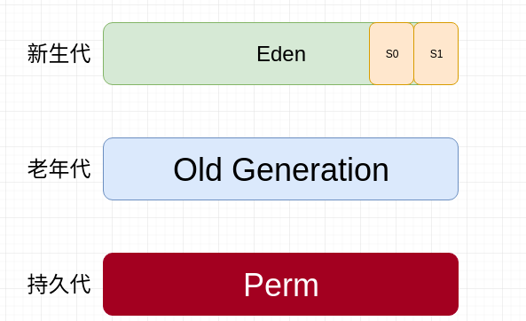
>* ① 新生代（Young Generation）：大多数对象在新生代中被创建，其中很多对象的生命周期很短。每次新生代的垃圾回收（又称Minor GC）后只有少量对象存活，所以选用**复制算法**，只需要少量的复制成本就可以完成回收。新生代内分三个区：一个Eden区，两个Survivor区（一般而言），**大部分对象在Eden区中生成**。当Eden区满时，还存活的对象将被复制到两个Survivor区（中的一个）。当这个Survivor区满时，此区的存活且不满足“晋升”条件的对象将被复制到另外一个Survivor区。对象每经历一次Minor GC，年龄加1，达到“晋升年龄阈值”后，被放到老年代，这个过程也称为“晋升”。显然，“晋升年龄阈值”的大小直接影响着对象在新生代中的停留时间，在Serial和ParNew GC两种回收器中，“晋升年龄阈值”通过参数MaxTenuringThreshold设定，默认值为15。
>* ② 老年代（Old Generation）：在新生代中经历了N次垃圾回收后仍然存活的对象，就会被放到年老代，该区域中对象存活率高。老年代的垃圾回收（又称Major GC）通常使用“标记-清理”或“标记-整理”算法。整堆包括新生代和老年代的垃圾回收称为Full GC（HotSpot VM里，除了CMS之外，其它能收集老年代的GC都会同时收集整个GC堆，包括新生代）。
>* ③ 永久代（Perm Generation）：主要存放元数据，例如Class、Method的元信息，与垃圾回收要回收的Java对象关系不大。相对于新生代和年老代来说，该区域的划分对垃圾回收影响比较小。


### 3、标记整理算法
复制收集算法在对象存活率较高时就要进行较多的复制操作，效率将会变低。更关键的是，如果不想浪费 `50%` 的空间，就需要有额扰的空间进行分配担保，以应对被使用的内存中所有对象都 100% 存活的极端情况，所以在老年代一般不能直接选用这种算法。

根据老年代的特点，有人提出于另外一种“标记 - 整理”(`Mark-Compact`) 算法，标记过程仍然与“标记 - 清除”算法一样，**但后续步又不是直接对可回收对象进行清理，而是让所有存活的对象都向一端移动，然后直接清理掉端边界以外的内存**。 

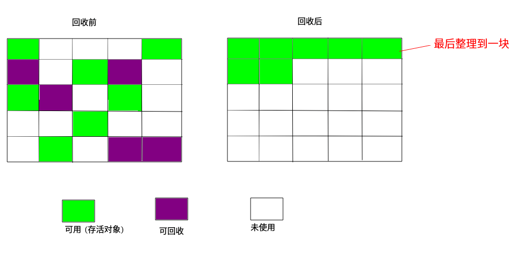

### 4、分代收集算法
当前商业虚拟机的垃圾收集都采用“分代收集”(Generational Collection) 算法，这种算法并没有什么新的思想，只是根据对象存活周期的不同将内存划分为几块。**一般是把 Java堆分为新生代和老年代，这样就可以根据各个年代的特点采用最适当的收集算法**。

在新生代中，每次垃圾收集时都发现有大批对象死去，只有少量存活，那就选用复制算法，只需要付出少量存活对象的复制成本就可以完成收集。而老年代中因为对象存活率高、没有额外空间对它进行分配担保，就必须使用“标记一清理”或者“标记一整理”算法来进行回收。  

***
## 四、垃圾收集器
### 1、各个垃圾收集器的联系
下图展示了7种垃圾收集器，如果有连线表示可以同时使用，上面是新生代，下面是老年代

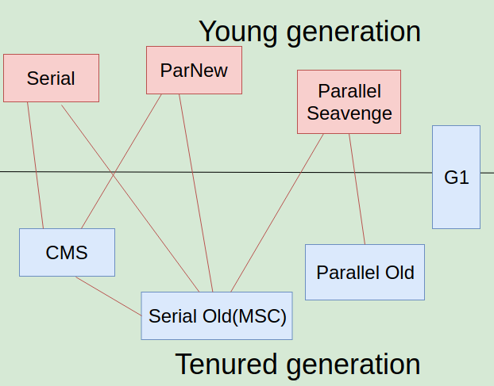

注意，这些收集器都有下面的原则: 

* 单线程与多线程收集的不同：单线程指的是垃圾收集器只使用一个线程进行收集，而多线程使用多个线程；
* 串行与并发：串行指的是垃圾收集器与用户程序交替执行，这意味着在执行垃圾收集的时候需要停顿用户程序；并发指的是垃圾收集器和用户程序同时执行。**除了 CMS 和 G1 之外，其它垃圾收集器都是以串行的方式执行。**

**以下收集器图片均来自[这篇博客](https://hellojz.me/2017/10/10/jvm/gc/)**。
### 2、Serial收集器
概括: 
* 是单线程且串行的收集器；
* 它的优点是简单高效，对于单个 CPU 环境来说，由于没有线程交互的开销，因此拥有最高的单线程收集效率；
* **现在依然是虚拟机运行在 Client 模式下的默认新生代收集器；**(因为在用户的桌面应用场景下，分配给虚拟机管理的内存一般来说不会很大。Serial 收集器收集几十兆甚至一两百兆的新生代停顿时间可以控制在一百多毫秒以内，只要不是太频繁，这点停顿是可以接受的。) 


### 3、ParNew收集器
概括

* 它是 Serial 收集器的多线程版本；
* 是 Server 模式下的虚拟机首选新生代收集器，除了性能原因外，主要是因为除了 Serial 收集器，只有它能与 CMS 收集器配合工作：
>在JDK1.5 时期，HotSpot 推出了 CMS 收集器（Concurrent Mark Sweep），它是 HotSpot 虚拟机中第一款真正意义上的并发收集器（收集线程和用户线程同时执行）。不幸的是，CMS 作为老年代的收集器，却无法与 JDK1.4.0 中已经存在的新生代收集器 Parallel Scavenge 配合工作，所以在 JDK1.5中使用 CMS 来收集老年代的时候，新生代只能选择 ParNew 或者 Serial 收集器中的一个。

* 默认开启的线程数量与 CPU 数量相同，可以使用 -XX:ParallelGCThreads 参数来设置线程数。

* Parallel Scavenge 收集器以及后面提到的 G1 收集器都没有使用传统的 GC 收集器代码框架，而另外独立实现，其余集中收集器则共用了部分的框架代码。


并发和并行在垃圾收集器中的概念: 

> 并发和并行。这两个名词都是并发编程中的概念，**在谈论垃圾收集器的上下文语境中**，它们可以解释如下:
>
> * 并行 (Parallel): 指多条垃圾收集线程并行工作，但此时用户线程仍然处于等待状态；
> * 并发(Concurrent) : 指用户线程与垃圾收集线程同时执行，(但不一定是并行的，可能会交替执行)，用户程序在继续运行，而垃圾收集程序运行于另一个CPU 上；

### 4、Parallel Scavenge收集器
概括：

* 是新生代复制算法，多线程收集器、吞吐量优先的收集器；
* 吞吐量指 CPU 用于运行用户代码的时间占总时间的比值 ；**(吞吐量 = 运行用户代码时间 / (运行用户代码时间 + 垃圾收集时间) )；**

Parallel Scavenge 收集器是一个新生代收集器，它也是使用复制算法的收集器，又是并行的多线程收集器……看上去和 ParNew 都一样，那它有什么特别之处呢?

Parallel Scavenge 收集器的特点是它的关注点与其他收集器不同，CMS 等收集器的关注点是尽可能地缩短垃圾收集时用户线程的停顿时间，**而 Parallel Scavenge 收集器的目标则是达到一个可控制的吞吐量 (Throughput)**。所谓吞吐量就是 CPU 用于运行用户代码的时间与 CPU 总消耗时间的比值，即**吞吐量 = 运行用户代码时间 / (运行用户代码时间 +垃圾收集时间)**，例如，虚拟机总共运行了 100 分钟，其中垃圾收集花掉 1 分钟，那吞吐量就是99%。

停顿时间越短就越适合需要与用户交互的程序，良好的响应速度能提升用户体验，而高吞吐量则可以高效率地利用CPU 时间，尽快完成程序的运算任务，主要适合在后台运算而不需要太多交互的任务。


Parallel Scavenge 收集器提供了两个参数用于精确控制委吐量，分别是控制最大垃圾收集停顿时间的 `-XX:MaxGCPauseMillis` 参数以及直接设置吞吐量大小的` -XX:GCTimeRatio` 参数。

`MaxGCPauseMillis` 参数允许的值是一个大于 0 的毫秒数，收集器将尽可能地保证内存回收花费的时间不超过设定值。不过大家不要认为如果把这个参数的值设置得稍小一点就能使得系统的垃圾收集速度变得更快，GC 停顿时间缩短是以牺牲吞吐量和新生代空间来换取的 : 系统把新生代调小一些，收集 300MB 新生代肯定比收集 500MB 快吧，这也直接导致垃圾收集发生得更频繁一些，原来 10 秒收集一次、每次停顿 100 毫秒，现在变成 5 秒收集一次、每次停顿 70 毫秒。停顿时间的确在下降，但吞吐量也降下来了。

**`GCTimeRatio` 参数的值应当是一个大于 0 且小于 100 的整数，也就是垃圾收集时间占总时间的比率，相当于是吞吐量的倒数**。如果把此参数设置为 19，那允许的最大 GC 时间就占总时间的 5%（即 `1 / (1+19)`)，默认值为 99，就是允许最大 `1%` ( 即 `1/(1+99)`) 的垃圾收集时间。

由于与吞吐量关系密切，Parallel Scavenge 收集器也经常**称为“吞吐量优先”收集器**。除上述两个参数之外，Parallel Scavenge 收集器还有一个参数 `-XX:+UseAdaptiveSizePolicy`值得关注。这是一个开关参数，当这个参数打开之后，就不需要手工指定新生代的大小 (-Xmn)、Eden 与 Survivor 区 的 比 例 (`-XX:SurvivorRatio`)、晋升老年代对象年龄(`-XX:PretenureSizeThreshold`) 等细节参数了，**虚拟机会根据当前系统的运行情况收集性能监控信息，动态调整这些参数以提供最合适的停顿时间或者最大吞吐量，这种调节方式成为GC自适应的调节策略。**


### 5、Serial Old收集器

概括: 

* Serial Old是**Serial 收集器的老年代版本**，它同样是一个**单线程收集器**，使用"标记整理算法"；

* 这个收集器的主要意义也是在于给Client模式下的虚拟机使用；

* 在Server模式下，还有两个用途: (1) 在JDK1.5版本之前和Parallel Scavenge 收集器搭配使用；(2) 作为CMS收集器的后备预案，在并发收集发生Concurrent Mode Failure时使用；


### 6、Paralell Old收集器
概括: 

* Parallel Old 是 Parallel Scavenge 收集器的老年代版本，使用多线程和 ”标记-整理“ 算法；
* 在注重**吞吐量以及 CPU 资源敏感**的场合，都可以优先考虑 Parallel Scavenge 加 Parallel Old 收集器；


### 7、CMS收集器
概括: 

* CMS（Concurrent Mark Sweep），Mark Sweep 即是 标记 - 清除 算法。</font>主要优点：并发收集、低停顿，也称之为并发低停顿收集器（Concurrent Low Pause Collection）；

* 整个过程分为四个步骤: 

  * **① 初始标记(CMS initial Mark) (标记一下 GC Roots 能直接关联到的对象，速度很快，需要停顿**；
  * **② 并发标记(CMS concurrent mark)(时间最长)**；
  * **③重新标记(CMS remark)(需要停顿)**；
  * **④并发清除(CMS concurrent sweep)**；

* 可以注意到上面只有②和④过程是并发的，因为这两个也是最占时间的，所以这就是CMS的优点；

* 缺点：

  * ①吞吐量低：低停顿时间是以牺牲吞吐量为代价的，导致 CPU 利用率不够高(对CPU资源非常敏感)。
  * ②无法处理浮动垃圾，可能出现 Concurrent Mode Failure。浮动垃圾是指并发清除阶段由于用户线程继续运行而产生的垃圾，这部分垃圾只能到下一次 GC 时才能进行回收。由于浮动垃圾的存在，因此需要预留出一部分内存，意味着 CMS 收集不能像其它收集器那样等待老年代快满的时候再回收。如果预留的内存不够存放浮动垃圾，就会出现 Concurrent Mode Failure，这时虚拟机将临时启用 Serial Old 来替代 CMS。
  * ③标记 - 清除算法导致的空间碎片，往往出现老年代空间剩余，但无法找到足够大连续空间来分配当前对象，不得不提前触发一次 Full GC。

* 为了解决上面的由于标记清除算法产生的空间碎片的问题:  

  * CMS 提供了一个开关参数`-XX:+UseCMSCompactAtFullCollection`（默认开启），用于在 CMS 收集器顶不住要进行 Full GC 时开启内存碎片的合并整理过程，内存整理的过程是无法并发的。

  * 参数` -XX:CMSFullGCsBeforeCompaction` 用于设置执行多少次不压缩的 Full GC后，跟着来以此带压缩的，（默认值为0）。


### 8、G1收集器

参考: [**文章一**](http://blog.jobbole.com/109170/)、[**文章二**](https://tech.meituan.com/g1.html)

G1收集器运作步骤

* 初始标记；

* 并发标记；

* 最终标记：为了修正在并发标记期间因用户程序继续运作而导致标记产生变动的那一部分标记记录，虚拟机将这段时间对象变化记录在线程的 `Remembered Set Logs` 里面，最终标记阶段需要把 `Remembered Set Logs` 的数据合并到 Remembered Set 中。这阶段需要停顿线程，但是可并行执行；

* 筛选回收：首先对各个 Region 中的回收价值和成本进行排序，根据用户所期望的 GC 停顿时间来制定回收计划。此阶段其实也可以做到与用户程序一起并发执行，但是因为只回收一部分 Region，时间是用户可控制的，而且停顿用户线程将大幅度提高收集效率；

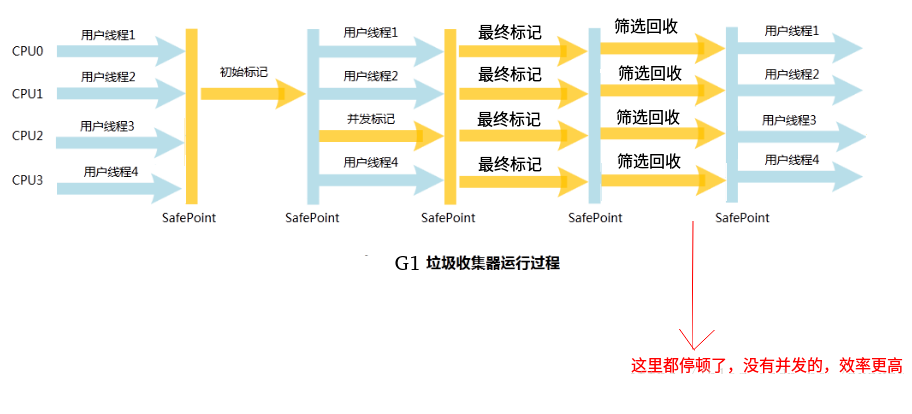

G1收集器的特点: 

G1 是一款面向**服务端应用**的垃圾收集器。HotSpot 开发团队赋予它的使命是(在比较长期的) 未来可以替换掉 JDK 1.5 中发布的 CMS 收集器。与其他 GC 收集器相比，G1 具备如下特点。

* **并行与并发** ， G1 能充分利用多 CPU、多核环境下的硬件优势，使用多个 CPU (CPU或者 CPU 核心) 来缩短 Stop-The-World 停顿的时间，部分其他收集器原本需要停顿Java 线程执行的 GC 动作，GI1 收集器仍然可以通过并发的方式让 Java 程序继续执行。

* **分代收集** : 与其他收集器一样，分代概念在 G1 中依然得以保留。虽然 G1 可以不需要其他收集器配合就能独立管理整个 GC 堆，但它能够采用不同的方式去处理新创建的对象和已经存活了一段时间、效过多次 GC 的旧对象以获取更好的收集效果。

* **空间整合**: 与 CMS 的“标记一清理”算法不同，**G1 从整体来看是基于“标记一整理”算法实现的收集器，从局部(两个 Region 之间) 上来看是基于“复制”算法实现的**，但无论如何，这两种算法都意味着 G1 运作期间不会产生内存空间碎片，收集后能提供规整的可用内存。这种特性有利于程序长时间运行，分配大对象时不会因为无法找到连续内存空间而提前触发下一次 GC。

* **可预测的停顿** : 这是 G1 相对于 CMS 的另一大优势，降低停顿时间是 G1 和 CMS 共同的关注点，但 G1 除了追求低停顿外，还能建立可预测的停顿时间模型，能让使用者明确指定在一个长度为 M 毫秒的时间片段内，消耗在垃圾收集上的时间不得超过N 毫秒，这几乎已经是实时 Java (RTSJ) 的垃圾收集器的特征了。

G1的设计原则就是简单可行的性能调优，其次，**G1将新生代，老年代的物理空间划分取消了**。这样我们再也不用单独的空间对每个代进行设置了，不用担心每个代内存是否足够。

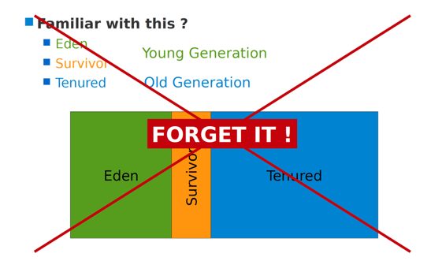

取而代之的是，G1算法将堆划分为若干个区域（Region），它仍然属于分代收集器。不过，这些区域的一部分包含新生代，新生代的垃圾收集依然采用暂停所有应用线程的方式，将存活对象拷贝到老年代或者Survivor空间。老年代也分成很多区域，G1收集器通过将对象从一个区域复制到另外一个区域，完成了清理工作。这就意味着，**在正常的处理过程中，G1完成了堆的压缩（至少是部分堆的压缩），这样也就不会有cms内存碎片问题的存在了**。

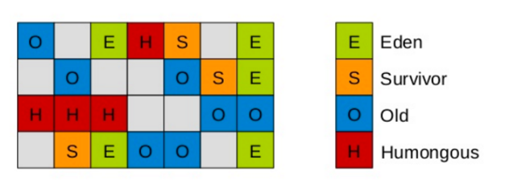

在G1中，还有一种特殊的区域，叫Humongous区域。 **如果一个对象占用的空间超过了分区容量50%以上，G1收集器就认为这是一个巨型对象**。这些巨型对象，默认直接会被分配在**年老代**，但是如果它是一个短期存在的巨型对象，就会对垃圾收集器造成负面影响。为了解决这个问题，G1划分了一个Humongous区，它用来专门存放巨型对象。如果一个H区装不下一个巨型对象，那么G1会寻找连续的H分区来存储。为了能找到连续的H区，有时候不得不启动Full GC。(**在java 8中，持久代也移动到了普通的堆内存空间中，改为元空间**。)

每个 Region 都有一个 Remembered Set，用来记录该 Region 对象的引用对象所在的 Region。通过使用 Remembered Set，在做可达性分析的时候就可以避免全堆扫描。

### 9、各种垃圾收集算法的对比 

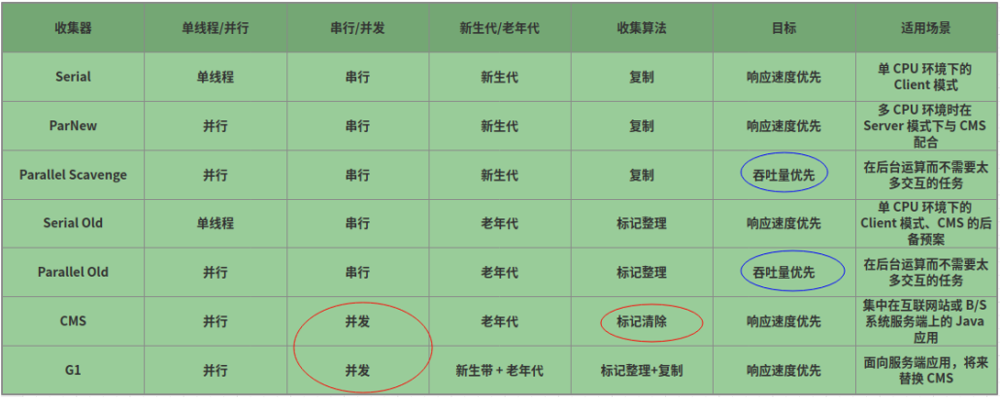

使用垃圾收集器常用的相关参数: 


默认在Server模式下使用 `Paraller`收集器:


参数设置(设置成使用`Serial`)


***
## 五、内存分配与回收策略

Java技术体系中所说的自动内存管理归结为解决了两个问题: 

* 给对象分配内存；
* 回收分配给对象的内存；

回收内存就是前面所讲的回收算法以及垃圾收集器，而**对象分配内存**，大方向讲，就是在堆上分配(但也可能经过JIT编译后被拆散为标量类型并间接的栈上分配)，对象主要分配在新生代的Eden区上，如果启动了本地线程分配缓冲，将按线程有限在TLAB上分配。
下面是几条普遍的**内存分配规则**: 

* 对象优先在Eden分配；
* 大对象直接进入老年代；
* 长期存活对象将进入老年代；
*  空间分配担保；
* 动态对象年龄判定；


下面分配看这几个分配规则。
### 1、对象优先在Eden分配

先看一个测试代码: 
```java
public class TestAllocation {

    public static void main(String[] args){
        byte[] b1 = new byte[2 * 1024 * 1024];  // 2MB
        byte[] b2 = new byte[2 * 1024 * 1024];
        byte[] b3 = new byte[2 * 1024 * 1024];
        byte[] b4 = new byte[4 * 1024 * 1024];
    }
}

```
先配置运行参数: 
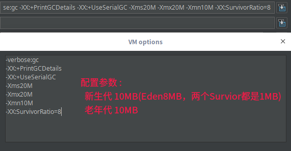

设置和对应内存的关系:

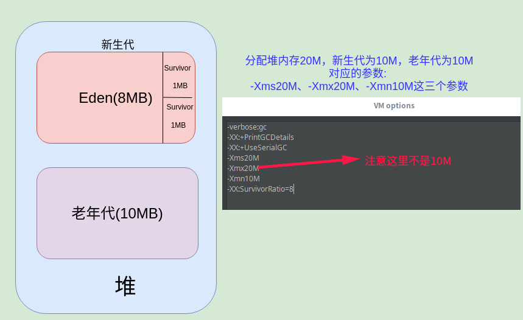

运行结果以及分析: 

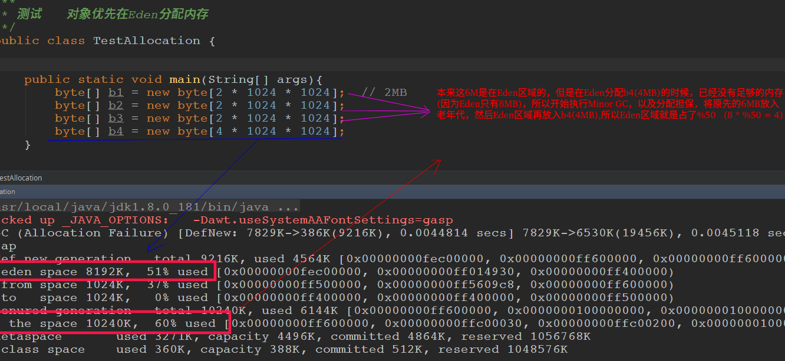

概括来说: 

* 一般直接分配到Eden区域，但是如果Eden区域不够，就进行Minor GC和分配担保； 

* 所以原来的6MB(`b1、b2、b3`)进入了分配担保区(老年代中)，然后新的`b4`继续放入Eden区域；

**另外，注意Minor GC和Full GC的区别**

* 新生代 GC (`Minor GC`) : 指发生在新生代的垃圾收集动作，因为 Java 对象大多都具备朝生夕灭的特性，所以 Minor GC 非常频繁，**一般回收速度度也比较快**。

* 老年代 GC (`Major GC / Full GC`) : 指发生在**老年代的 GC**，出现了 Major GC，经常会伴随至少一次的 Minor GC (但非绝对的，在 Parallel Scavenge 收集器的收集策略里就有直接进行 Major GC 的策略选择过程)。**Major GC 的过度一般会比 Minor GC 慢 10 倍以上**。


### 2、大对象直接进入老年代

概括 
* 大对象是指需要连续内存空间的对象，最典型的大对象是那种很长的字符串以及数组。
* 大的对象不能一直放在新生代的Eden区域，因为这个区域是经常需要GC的部分，所以会降低效率，所以大的对象要放到老年代；
	 有一个默认的大小，当对象的大小超过这个值的时候，会进入老年代，也可以通过	
   `-XX:PretenureSizeThreshold`来设置这个值；**大于此值的对象直接在老年代分配**，避免在 Eden 区和 Survivor 区之间的大量内存复制。

在上面的例子的运行参数(堆大小为20MB)的环境下测试:


再看


通过参数来修改这个默认值: 


则此时7MB也会进入老年代: 

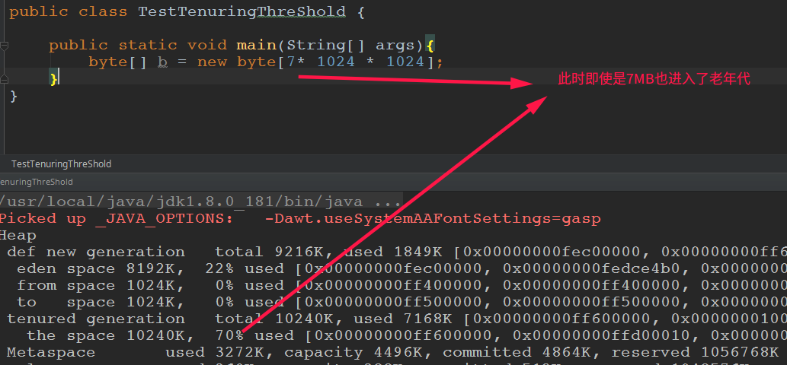

> 注意 : PretenureSizeThreshold 参数只对 Serial 和 ParNew 两款收集器有效，`Parallel Scavenge`收集器不认识这个参数，Parallel Scavenge 收集器一般并不需要设置。如果过到必须使用此参数的场合，可以考虑 ParNew 加 CMS 的收集器组合。

### 3、长期存活对象将进入老年代


* 为对象定义**年龄计数器**，对象在 Eden 出生并经过 Minor GC 依然存活，将移动到 Survivor 中，年龄就增加 1 岁，增加到一定年龄则移动到老年代中。
* `-XX:MaxTenuringThreshold` 用来设置年龄的阈值(到了这个年龄就进入老年代)。
* 例子和上面差不多，只有设置参数不同，这里不重复做了。

### 4、空间分配担保

* 在发生 Minor GC 之前，虚拟机先检查老年代最大可用的连续空间是否大于新生代所有对象总空间，如果条件成立的话，那么 Minor GC 可以确认是安全的。
* 如果不成立的话虚拟机会查看`HandlePromotionFailure`(`-XX:+HandlePromotionFailure`(默认是开启的)) 设置值是否允许担保失败；
* 如果允许那么就会继续检查老年代最大可用的连续空间是否大于历次晋升到老年代对象的平均大小，如果大于，将尝试着进行一次 Minor GC(尽管有风险)；
* 如果小于，或者 `HandlePromotionFailure` 设置不允许冒险，那么就要进行一次 Full GC。

### 5、动态对象年龄判定
* 虚拟机并不是永远地要求对象的年龄必须达到 `MaxTenuringThreshold` 才能晋升老年代；
* 如果在 Survivor 中相同年龄所有对象大小的总和大于 Survivor 空间的一半，则年龄大于或等于该年龄的对象可以直接进入老年代，无需等到 `MaxTenuringThreshold` 中要求的年龄。

***
### 6、关于逃逸分析以及栈上分配
堆的分配已经不是唯一

* 逃逸分析：分析对象的作用域；
* **如果对象的作用域只是在方法体内(没有发生逃逸)**，就可以不需要在堆上分配内存，而是可以在栈上分配内存；

看几个逃逸和不逃逸的例子:
```java
public class StackAllocation {

    public StackAllocation instance;

    /**方法返回 StackAllocation对象，发生逃逸*/
    public StackAllocation getInstance(){
        return instance == null ? new StackAllocation() : instance;
    }

    /**为成员属性赋值，也发生了逃逸*/
    public void setInstance(){
        this.instance = new StackAllocation();
    }


    /**引用成员变量，也发生了逃逸*/
    public void use(){
        StackAllocation s = getInstance();
    }

    /**对象的作用域仅在方法中有效,没有发生逃逸*/
    public void use2(){
        StackAllocation s = new StackAllocation();
    }
}

```

