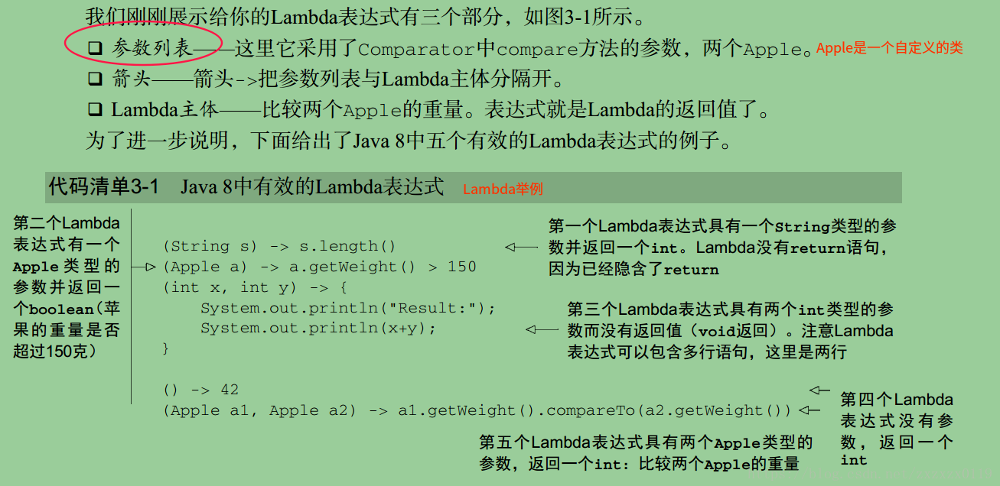
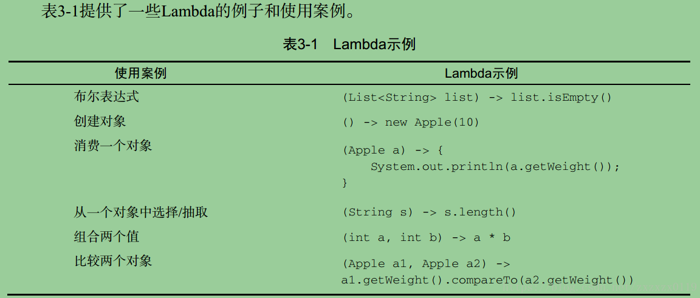
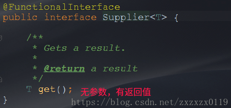
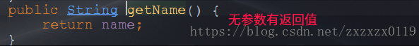
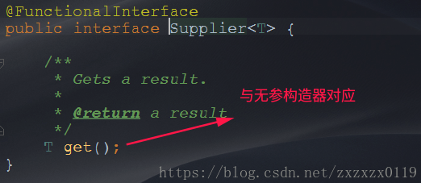
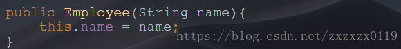
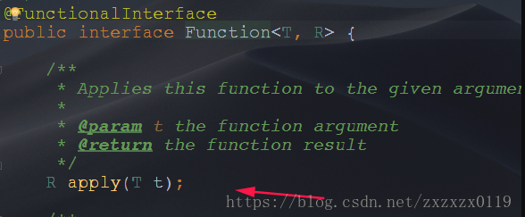

## Lambda表达式总结

 - [使用范例以及例子](#使用范例以及例子)
    - [原始方法](#原始方法)
    - [优化方式一-使用策略模式来优化](#优化方式一-使用策略模式来优化)
    - [优化方式二-使用匿名内部类优化](#优化方式二-使用匿名内部类优化)
    - [优化方式三-使用Lambda表达式](#优化方式三-使用lambda表达式)
    - [优化方式四-使用Stream-API](#优化方式四-使用stream-api)
 - [`Lambda`表达式基础语法](#lambda表达式基础语法)
 - [函数式接口](#函数式接口)
 - [`Lambda`练习
    - [练习一-`Employee`类中先按年龄比，年龄相同按照姓名比-都是升序
    - [练习二-声明一个带两个泛型的接口，并且对两个`Long`型数值计算](#练习二-声明一个带两个泛型的接口并且对两个long型数值计算)
 - [`Java8`四大内置函数式接口](#java8四大内置函数式接口)
 - [方法引用和构造器引用](#方法引用和构造器引用)
     - [方法引用](#方法引用)
     - [构造器引用](#构造器引用)

***
### 使用范例以及例子

使用匿名内部类:
```java
Comparator<Integer>com = new Comparator<Integer>() {
    @Override
    public int compare(Integer o1, Integer o2) {  //降序排列
        return Integer.compare(o2,o1);
    }
};
```

使用`Lambda`表达式: 
```java
 Comparator<Integer> com = (x, y) -> Integer.compare(y, x);
```

**下面给出一个例子来引入`Lambda`表达式。**

给出一个`Employee`类，有`name、age、salary`三个属性：

```java
public class Employee {
    private String name;
    private int age;
    private double salary;

    public Employee() {
    }
    public Employee(String name, int age, double salary) {
        this.name = name;
        this.age = age;
        this.salary = salary;
    }
    public String getName() {
        return name;
    }
    public int getAge() {
        return age;
    }
    public double getSalary() {
        return salary;
    }

    @Override
    public String toString() {
        return "name='" + name + '\'' +
                ", age=" + age +
                ", salary=" + salary;
    }
}

```

然后我们需要通过限制查询数据: 

 - 比如查询年龄`>25`岁的所有员工的信息；
 - 再如查询工资`>4000`的员工信息；


首先给出一个`List`集合类模拟数据库表: 

```java
//将数组转换成集合的
List<Employee> employees = Arrays.asList(
    new Employee("张三",23,3333.33),
    new Employee("李四",24,4444.44),
    new Employee("王五",25,5555.55),
    new Employee("赵六",26,6666.66),
    new Employee("田七",27,7777.77)
);
```
#### 原始方法
然后我们写分别查询出<font color =red>年龄大于`25`岁的员工信息和工资大于`4000`</font>的员工信息，发现`findEmployeesByAge`和`findEmployeesBySalary`两个方法代码非常的相似，<font color =red>只有查询条件不同，所以这个方法是不太可取的。
```java
public void test3(){
    //年龄
    List<Employee> list = findEmployeesByAge(employees);
    for(Employee emp : list){
        System.out.println(emp);
    }
    //工资
    System.out.println("---------------------");
    List<Employee> list2 = findEmployeesBySalary(employees);
    for(Employee emp : list2){
        System.out.println(emp);
    }
}

//原始方法 : 查询出年龄大于25岁的(这个是最原始的方法)
public List<Employee> findEmployeesByAge(List<Employee>list){
    List<Employee>emps = new ArrayList<>();
    for(Employee emp : list){
        if(emp.getAge() > 25){
            emps.add(emp);
        }
    }
    return emps;
}

//原始方法 : 查询出工资大于4000的(这个是最原始的方法)
//和上面的方法唯一的差别只有年龄和工资的改动，代码冗余
public List<Employee> findEmployeesBySalary(List<Employee>list){
    List<Employee>emps = new ArrayList<>();
    for(Employee emp : list){
        if(emp.getSalary() > 4000){
            emps.add(emp);
        }
    }
    return emps;
}

```
#### <font color = green>优化方式一-使用策略模式来优化
策略模式需要行为算法族，于是我们创建查询行为的接口`MyPredicate<T>`: 

```java
public interface MyPredicate <T>{
    public boolean test(T t);
}
```
并创建相关的实现类代表不同的算法行为: (分别是年龄` > 25`和工资` > 4000 `的 ): 

```java
public class FilterEmployeeByAge implements MyPredicate<Employee> {
    @Override
    public boolean test(Employee employee) {
        return  employee.getAge() > 25;
    }
}
```

```java
public class FilterEmployeeBySalary implements MyPredicate<Employee>{
    @Override
    public boolean test(Employee employee) {
        return employee.getSalary()  >= 4000;
    }
}
```
<font color = red>这时我们可以只需要创建通用的方法: 具体的调用只需要传入具体的实现类(接口作为参数)</font>

```java
public List<Employee> filterEmployees(List<Employee>list,MyPredicate<Employee>mp){
    List<Employee>emps = new ArrayList<>();
    for(Employee emp : list){
        if(mp.test(emp)){  //调用相应的过滤器
            emps.add(emp);
        }
    }
    return emps;
}
```
<font color =red>测试的时候就传入两个不同的类，来指定查询的行为</font>

```java
//优化方式一 :  使用策略设计模式进行优化  下面的方法只要写一个
public void test4(){
    List<Employee> list = filterEmployees(this.employees, new FilterEmployeeByAge());
    for(Employee emp : list){
        System.out.println(emp);
    }
    System.out.println("------------------------");
    List<Employee> list2 = filterEmployees(this.employees, new FilterEmployeeBySalary());
    for(Employee emp : list2){
        System.out.println(emp);
    }
}
```
#### <font color = green>优化方式二-使用匿名内部类优化
<font color =red>这样的好处在于不需要创建接口的具体的实现类，(但是还是需要`MyPredicate`接口和`filterEmployees()`方法): 
```java
//优化方式二 ： 使用匿名内部类  这样的好处是不要创建一个额外的 策略类
public void test5(){
    List<Employee> list = filterEmployees(this.employees, new MyPredicate<Employee>() {
        @Override
        public boolean test(Employee employee) {
            return employee.getSalary() > 4000;
        }
    });
    for (Employee emp:list) {
        System.out.println(emp);
    }
}
```
#### <font color = green>优化方式三-使用Lambda表达式
<font color = red>省去匿名内部类的没用的代码，增强可读性:(注意还是需要那个filterEmployees方法)</font>
```java
public void test6(){
    List<Employee> list = filterEmployees(this.employees, (e) -> e.getSalary() > 4000);
    list.forEach(System.out::println);
}
```
#### <font color = green>优化方式四-使用Stream-API
<font color = red>使用`StreamAPI`完全不需要其他的代码，包括不需要`filterEmployees()`方法，代码很简洁:
```java
public void test7(){
    employees.stream().filter( (e) -> e.getSalary() < 4000 ).limit(2).forEach(System.out::println);
    System.out.println("------------------");
    employees.stream().map(Employee::getName).forEach(System.out::println); //打印所有的名字
}
```
***
### Lambda表达式基础语法
**关于箭头操作符:** 

 - `Java8`中引入了一个新的操作符，`"->"`，该操作符称为箭头操作符或者`Lambda`操作符，箭头操作符将`Lambda`表达式拆分成两部分；
 - 左侧:  `Lambda`表达式的<font color = blue>参数列表</font>，对应的是<font color = red>接口中抽象方法的参数列表</font>；
 - 右侧:  `Lambda`表达式中所需要执行的功能(<font color =blue>`Lambda`体</font>)，对应的是<font color = red>对抽象方法的实现；(函数式接口(只能有一个抽象方法))
 - `Lambda`表达式的实质是　<font color =red>对接口的实现</font>；


**语法格式:**


 - <font color =red>(一) 接口中的抽象方法 : 无参数，无返回值；

例如: `Runnable`接口中的`run`方法: 

```java
　　 public void test1(){
        /*final */int num = 2; //jdk1.7之前必须定义为final的下面的匿名内部类中才能访问

        Runnable r = new Runnable() {
            @Override
            public void run() {
                System.out.println("Hello world!" + num); //本质还是不能对num操作(只是jdk自己为我们设置成了final的)
            }
        };
        r.run();

        System.out.println("----------使用Lambda输出-----------");

        Runnable r1 = () -> System.out.println("Hello world!" + num);
        r1.run();
    }
```

 - <font color =red>(二) 接口中的抽象方法 : 一个参数且无返回值；  (若只有一个参数，那么小括号可以省略不写)

```java
public void test2(){
//  Consumer<String>con = (x) -> System.out.println(x);
    Consumer<String>con = x -> System.out.println(x);
    con.accept("Lambda牛逼!");
}
```

 - <font color =red>(三) 两个参数，有返回值，并且有多条语句 ：　**要用大括号括起来，而且要写上`return`**

```java
public void test3(){
     Comparator<Integer>com = (x,y) -> {
         System.out.println("函数式接口");
         return Integer.compare(y,x); //降序
     };
     
     Integer[] nums = {4,2,8,1,5};
     Arrays.sort(nums,com);
     System.out.println(Arrays.toString(nums));
}
```
输出: 

```java
函数式接口
函数式接口
函数式接口
函数式接口
函数式接口
函数式接口
函数式接口
函数式接口
函数式接口
[8, 5, 4, 2, 1]
```

 - <font color =red>(四) 两个参数，有返回值，但是只有一条语句:　**大括号省略，`return`省略**

 

```java
public void test4(){
     Comparator<Integer>com = (x,y) -> Integer.compare(x,y);//升序
     Integer[] nums = {4,2,8,1,5};
     Arrays.sort(nums,com);
     System.out.println(Arrays.toString(nums));
 }
```
输出: 

```java
[1, 2, 4, 5, 8]
```

 

 - <font color =red>(五) `Lambda`表达式的参数列表的数据类型 可以省略不写，因为JVM编译器通过上下文推断出数据类型，即"类型推断"， `(Integer x,Integer y ) -> Integer.compare(x,y)`可以简写成`(x,y) -> Integer.compare(x,y)`；

```java
上联: 左右遇一括号省
下联: 左侧推断类型省
横批: 能省则省
```
***
### 函数式接口

 - <font color =red>若接口中只有一个抽象方法的接口称为函数式接口；
 - <font color =red>可以使用注解`@FunctionlInterface`来标识，可以检查是否是函数式接口；

 例子: 对一个进行`+-*/`的运算：　

函数式接口: 
```java
@FunctionalInterface //函数式接口
public interface MyFunction {
    public Integer getValue(Integer num);
}
```
通用函数: 
```java
public Integer operation(Integer num,MyFunction mf){
    return mf.getValue(num);
}
```
测试: 

```java
public void test5(){
     Integer res = operation(200, (x) -> x * x);
     System.out.println(res);
 }
```
***
### Lambda练习
#### 练习一-`Employee`类中先按年龄比，年龄相同按照姓名比-都是升序
先给出集合，模拟数据库表: 

```java
List<Employee> employees = Arrays.asList(
        new Employee("田七",27,7777.77),
        new Employee("王五",24,5555.55),
        new Employee("张三",23,3333.33),
        new Employee("李四",24,4444.44),
        new Employee("赵六",26,6666.66)
);
```

```java
public void test1(){
   Collections.sort(employees,(x,y) ->{
       if(x.getAge() == y.getAge()){
           return x.getName().compareTo(y.getName());
       }else{
           return Integer.compare(x.getAge(),y.getAge());
       }
   });

   for (Employee emp: employees) {
       System.out.println(emp);
   }
}
```
输出: 

```java
name='张三', age=23, salary=3333.33
name='李四', age=24, salary=4444.44
name='王五', age=24, salary=5555.55
name='赵六', age=26, salary=6666.66
name='田七', age=27, salary=7777.77
```
#### 练习二-声明一个带两个泛型的接口，并且对两个`Long`型数值计算

```java
@FunctionalInterface
public interface MyCalFunction<T,R> {
    public R getValue(T t1,T t2); 
}
```
对应函数和测试: 
```java
 public void test3(){
     op(200L,200L,(x,y) -> x + y);
     op(200L,200L,(x,y) -> x * y);
 }
 public void op(Long l1,Long l2,MyCalFunction<Long,Long>mc){//需求: 对于两个long型运算进行处理
     System.out.println(mc.getValue(l1, l2));
 }
```
更多的例子: (取自`<<`Java8`实战>>`)


(注意类型可以省略(<font color = red>类型推导</font>))。

上图的`Apple`类: 

```java
public class Apple {
    public String color;
    public int weight;

    public Apple() {
    }
    public Apple(String color, int weight) {
        this.color = color;
        this.weight = weight;
    }

    public String getColor() {
        return color;
    }

    public void setColor(String color) {
        this.color = color;
    }

    public int getWeight() {
        return weight;
    }

    public void setWeight(int weight) {
        this.weight = weight;
    }
}
```

***
### Java8四大内置函数式接口
我们发现，如果使用`Lambda`还要自己写一个接口的话太麻烦，所以`Java`自己提供了一些接口: 

 - `Consumer< T >con` 消费性 接口:  `void accept(T t)`；
 - `Supplier< T >sup`供给型接口 :  `T get()`；
 -  `Function< T , R >fun ` 函数式接口 :   `R apply (T t)`；
 -  `Predicate< T >`： 断言形接口 : `boolean test(T t)`；

#### `Consumer< T >con`消费性接口-`void accept(T t)`

```java
@Test
public void test1(){
    apply(1000,(num) -> System.out.println("消费了" + num + "元!"));
}
public void apply(double num,Consumer<Double>con){
    con.accept(num);
}
```

***
#### `Supplier< T >sup`供给型接口-`T get()`
例子: 产生指定个数的整数，并放入集合中；
```java
public void test2(){
    ArrayList<Integer> res = getNumList(10, () -> (int) (Math.random() * 100));
    System.out.println(res);
}
//需求，产生指定个数的整数，并放入集合中
public ArrayList<Integer> getNumList(int num, Supplier<Integer>sup){
    ArrayList<Integer>list = new ArrayList<>();
    for(int i = 0; i < num; i++){
        Integer e = sup.get();
        list.add(e);
    }
    return list;
}
```
#### `Function< T, R >fun`函数式接口-` R apply (T t)`

```java
public void test3(){
    String newStr = strHandler("abc", (str) -> str.toUpperCase());
    System.out.println(newStr);
    newStr = strHandler("   abc  ", (str) -> str.trim());
    System.out.println(newStr);
}
public String strHandler(String str, Function<String,String>fun){
    return fun.apply(str);
}
```
#### `Predicate< T >`断言形接口-`boolean test(T t)`
判断一些字符串数组判断长度`>2`的字符串: 
```java
public void test4(){
    List<String> list = Arrays.asList("Hello", "atguiu", "lambda", "ok", "www", "z");
    List<String> res = filterStr(list, (str) -> str.length() > 2);
    System.out.println(res);
}
//需求
public List<String> filterStr(List<String>list, Predicate<String>pre){
    ArrayList<String>res = new ArrayList<>();
    for(String str : list){
        if(pre.test(str)){
            res.add(str);
        }
    }
    return res;
}
```
***
### 方法引用和构造器引用
#### 方法引用

使用前提: <font color = red>**`Lambda`体中调用方法的参数列表和返回值类型，要和函数式接口中抽象方法的参数列表和返回值类型保持一致；**</font>

 - <font color = red>语法格式(一) 对象::实例方法名

```java
public void test1(){
	//普通写法
     PrintStream ps = System.out;
     Consumer<String>con = (x) -> ps.println(x);
     con.accept("hello !");

     System.out.println("----------------------");
	//简写
     Consumer<String>con1 = ps::println;
     con1.accept("hello ! ");

     System.out.println("----------------------");
	//更简单的写法
     Consumer<String>con2 = System.out::println;
     con2.accept("hello ! ");
}
```
**注意，这样写的前提: `Consumer`中的`accept()`方法和`println()`方法的参数列表和返回类型要完全一致:** 


再看一个例子: 
三种写法的效果是一样的: 
```java
public class TestLambda {

    public static void main(String[] args) {

        // method 1
        Consumer<String> consumer = s -> System.out.println(s);
        useConsumer(consumer,"123");

        //method 2
        useConsumer(s -> System.out.println(s),"123");

        //method3   method reference (方法引用)
        useConsumer(System.out::println,"123"); //因为println和 accept 是同样的只有一个入参，没有返回值
    }

    public static <T> void useConsumer(Consumer<T> consumer,T t){
        consumer.accept(t);
    }
}
```
再看一个例子: 

```java
public static void main(String[] args) {
    //都是输出 字符 'l'
    BiFunction<String,Integer,Character> bf = String::charAt; //这里第一个必须传入　String
    Character c = bf.apply("hello,", 2);
    System.out.println(c);

    //注意这里使用的是Function 接口
    String str = new String("hello");
    Function<Integer,Character> f = str::charAt; //这里不需要String
    Character c2 = f.apply(2);
    System.out.println(c2);
}

```

再看一个例子: 

```java
public void test2(){
    Employee emp = new Employee("zx",23,5555);

    Supplier<String>sup = () -> emp.getName();
    System.out.println(sup.get());

    //简写
    Supplier<String>sup2 = emp::getName;
    System.out.println(sup2.get());
}
```





 - <font color = red>语法格式(二)  类名::静态方法</font>

```java
public void test3(){
     Comparator<Integer>com = (x,y) -> Integer.compare(x,y);

     Comparator<Integer>com2 = Integer::compare;
}
```

`Integer`类中的


`Comparator`接口中的方法: 


 - <font color = red>语法格式(三) 类::实例方法名</font>

使用注意: **若Lambda参数列表中的第一个参数是实例方法的第一个调用者，而第二个参数是实例方法的参数时，可以使用`ClassName :: method`。**
```java
public void test4(){
    BiPredicate<String,String>bp = (x,y) -> x.equals(y);

    BiPredicate<String,String>bp2 = String::equals;
}
```


#### 构造器引用
**需要调用构造器的参数列表，要与函数式接口中的抽象方法的参数列表保持一致；**

```java
public void test5(){
    Supplier<Employee>sup = () -> new Employee();

    Supplier<Employee>sup2 = Employee::new; //调用的是默认的
    System.out.println(sup2.get());
}
```
输出: 

```java
name='null', age=0, salary=0.0
```




再看构造器一个参数的: 

```java
public void test6(){
    Function<String,Employee>fun = Employee::new;
    System.out.println(fun.apply("zx"));
}
```
输出：

```java
name='zx', age=0, salary=0.0
```





如果想要匹配多个的，(两个的可以使用`BiFunction`)，下面看一个三个的: 
例如想匹配这个: 

```java
public class ComplexApple {

    private String name;
    private int weight;
    private String color;

    public ComplexApple() {
    }

    //匹配这个构造方法
    public ComplexApple(String name, int weight, String color) {
        this.name = name;
        this.weight = weight;
        this.color = color;
    }

    public String getName() {
        return name;
    }

    public void setName(String name) {
        this.name = name;
    }

    public int getWeight() {
        return weight;
    }

    public void setWeight(int weight) {
        this.weight = weight;
    }

    public String getColor() {
        return color;
    }

    public void setColor(String color) {
        this.color = color;
    }
}

```
自己建一个接口:

```java
@FunctionalInterface
public interface ThreeFunction<A,B,C,R> {
    R apply(A a,B b,C c);
}

```
测试: 

```java

public class Test {

    public static void main(String[] args) {

        ThreeFunction<String,Integer,String,ComplexApple> tf = ComplexApple::new;

        ComplexApple apple = tf.apply("蓝色", 12, "好苹果");
        
    }
}

```

