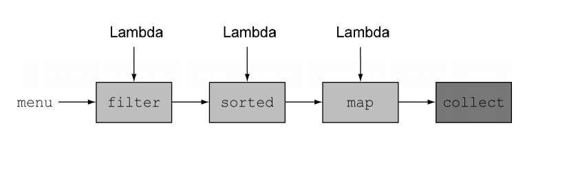
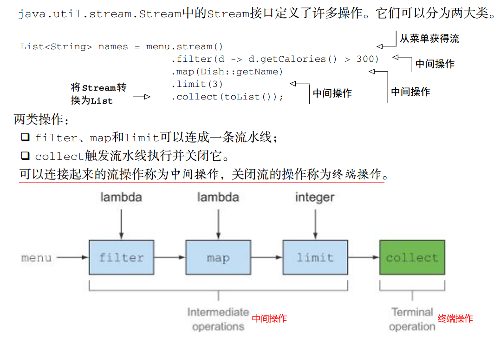
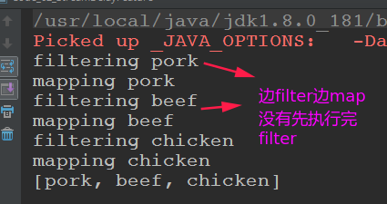

# Stream

* 一、引入流
* 二、使用流
* 三、Optional取代null
* 四、用流收集数据(collect)

## 一、引入流

### 1、一个案例引入

看一个使用`Stream`(Java8)和不使用`Stream`(Java7)代码量的区别。

这里需要筛选出一份菜单中**卡路里<400**的菜的名字。

```java
public class Code_01_Java7AndJava8Compare {

    public static void main(String[] args) {
        // 返回 热量<400 的菜肴 的 名称, 返回结果按照从低到高排序， Java7的写法
        System.out.println(java7());
        System.out.println(java8());
    }

    static List<String> java7(){
        List<Dish> lowCaloricDishes = new ArrayList<>();
        for (Dish d : Dish.menu) {
            if (d.getCalories() < 400) {
                lowCaloricDishes.add(d);
            }
        }
        Collections.sort(lowCaloricDishes, new Comparator<Dish>() {
            public int compare(Dish d1, Dish d2) {
                return Integer.compare(d1.getCalories(), d2.getCalories());
            }
        });
        List<String> lowCaloricDishesName = new ArrayList<>();
        for (Dish d : lowCaloricDishes) {
            lowCaloricDishesName.add(d.getName());
        }
        return lowCaloricDishesName;
    }

    static List<String> java8(){
        List<String> lowCaloricDishesName =
                Dish.menu.stream()
                        .filter(d -> d.getCalories() < 400)
                        .sorted(Comparator.comparing(Dish::getCalories))
                        .map(Dish::getName)
                        .collect(Collectors.toList());
        return lowCaloricDishesName;
    }
}
```

### 2、流简介

* 流简短的定义: 是数据渠道，用于操作数据源(集合，数组等)所生成的元素序列；
  * 元素序列 — 就像集合一样，流也提供了一个接口，可以访问特定元素类型的一组有序
    值。因为集合是数据结构，所以它的主要目的是以特定的时间/ 空间复杂度存储和访问元
    素（如ArrayList 与 LinkedList） 。但**流的目的在于表达计算**，比如你前面见到的
    `filter、 sorted和 map`。**集合讲的是数据，流讲的是计算**。
  * 源 — 流会使用一个提供数据的源，如集合、数组或输入/输出资源；
  * 数据处理操作 — 流的数据处理功能支持类似于数据库的操作，以及函数式编程语言中
    的常用操作，如`filter、 map、 reduce、 find、 match、 sort`等；
* 流的重要的特点
  * 流水线 — 很多流操作本身会返回一个流，这样多个操作就可以链接起来，形成一个大
    的流水线；流水线的操作可以看作对数据源进行数据库式查询；
  * 内部迭代 — 与使用迭代器显式迭代的集合不同，流的迭代操作是在背后进行的；
  * **①`Stream`自己不会存储元素；② `Stream`不会改变原对象，相反，他们会返回一个持有结果的新`Stream`；③Stream操作是延迟执行的，这意味着他们会等到需要结果的时候才执行**；



### 3、流与集合

#### 1)、只能遍历一次

请注意，**和迭代器类似，流只能遍历一次**

- 遍历完之后，我们就说这个流已经被消费掉了；
- 你可以从原始数据源那里再获得一个新的流来重新遍历一遍，就像迭代器一样（这里假设它是集
  合之类的可重复的源，如果是I/O通道就没戏了）；

#### 2)、外部迭代与内部迭代

* 使用`Collection`接口需要用户去做迭代（比如用`for-each`） ，这称为外部迭代；
* 相反， Streams库使用内部迭代；

外部迭代和内部迭代的区别:


### 4、流操作

主要分为两类操作: 中间操作和终端操作。



#### 1)、中间操作

中间操作就是产生的结果(仍然是一个流)。

诸如`filter`或` sorted`等中间操作会返回另一个流。这让多个操作可以连接起来形成一个查询。

```java
// 除非流水线上触发一个终端操作，否则中间操作不会执行任何处理
// 流的延迟性质。
public class Code_02_StreamDelayFeature {
    public static void main(String[] args) {
        List<String> names =
                Dish.menu.stream()
                        .filter(d -> {
                            System.out.println("filtering" + d.getName());
                            return d.getCalories() > 300;
                        })
                        .map(d -> {
                            System.out.println("mapping" + d.getName());
                            return d.getName();
                        })
                        .limit(3)
                        .collect(Collectors.toList());
        System.out.println(names);

//        // 终端操作
//        System.out.println("-------Terminal Operation------");
//        Dish.menu.stream().forEach(System.out::println);
    }
}

```

看运行结果，可以发现`Stream`是有延迟的性质。



#### 2)、终止操作

终止操作会从流的流水线生成结果。其结果是任何不是流的值，比如List、 Integer，甚至 void。

#### 3)、流的使用步骤

流的流水线背后的理念类似于构建器模式。

三个基本步骤: 

* 创建Stream : 需要一个数据源(如：集合，数组)，获取一个流；
* 中间操作: 一个中间操作链，对数据源的数据进行处理；
* 终止操作(终端操作): 一个终止操作，执行中间操作链，并产生结果；

## 二、使用流

### 1、构建流

构建的流的方式有:

* 从Collection中构建；

* 从值`value`(`Stream.of()`)中构建；

* 从数组中构建(`Arrays.stream()`)；

* 从文件中构建；

* 由函数生成: 创建无限流；

创建的几种方法的示例代码:

```java
/** 创建流的几种方法 */
public class Code_03_CreateStream {

    public static void main(String[] args) throws IOException {
        PrintStream out = System.out;

        out.println("--------fromCollection--------");
        fromCollection().forEach(x -> out.print(x + " ")); // 从Collection中创建Stream
        out.println("\n" + "-------fromValues---------");
        fromValues().forEach(x -> out.print(x + " ")); // 从Collection中创建Stream
        out.println("\n" + "--------fromArrays--------");
        fromArrays().forEach(x -> out.print(x + " ")); // 从Collection中创建Stream
        out.println("\n" + "--------fromFile--------");
        fromFile().forEach(out::println); // 从函数中创建
        out.println("\n" + "--------fromIterate--------");
        fromIterate().forEach(x -> out.print(x + " ")); // 从函数中创建
        out.println("\n" + "--------fromGenerate--------");
        fromGenerate().forEach(x -> out.print(x + " ")); // 从函数中创建
        out.println("\n" + "--------fromCustom--------");
        fromCustom().forEach(x -> out.print(x + " "));
        out.println("\n" + "----------------");
    }

    static Stream<String> fromCollection() {
        List<String> list = Arrays.asList("aa", "bb", "cc");
        return list.stream();
    }

    static Stream<String> fromValues() {
        return Stream.of("aa", "bb", "cc");
    }

    static Stream<String> fromArrays() {
        String[] str = {"aa", "bb", "cc"};
        return Arrays.stream(str);
    }

    static Stream<String> fromFile() throws IOException {
        Path path = Paths.get("/home/zxzxin/Main.java");
        Stream<String> stream = Files.lines(path);
        return stream;
    }

    static Stream fromIterate() {
        return Stream.iterate(0, n -> n + 2).limit(5); // 函数创建的无限流
    }

    static Stream<Double> fromGenerate(){
        return Stream.generate(Math::random).limit(5);
    }

    // 创建Custom的流  (CusSupplier)
    static Stream<Custom>fromCustom(){
        return Stream.generate(new CusSupplier()).limit(5);
    }

    static class CusSupplier implements Supplier<Custom> {

        private int index = 0;

        private Random random = new Random(System.currentTimeMillis());

        @Override
        public Custom get() {
            index = random.nextInt(100);
            return new Custom(index, "name-" + index);
        }
    }

    static class Custom {
        private int id;
        private String name;

        public Custom(int id, String name) {
            this.id = id;
            this.name = name;
        }

        @Override
        public String toString() {
            return "Obj{" +
                    "name='" + name + '\'' +
                    ", id=" + id +
                    '}';
        }
    }
}
```

输出: 

```java
--------fromCollection--------
aa bb cc 
-------fromValues---------
aa bb cc 
--------fromArrays--------
aa bb cc 
--------fromFile--------
import java.io.*;
import java.util.*;

public class Main {

    public static void main(String[] args) {
        Scanner in = new Scanner(new BufferedInputStream(System.in));
        PrintStream out = System.out;
    }
}

--------fromIterate--------
0 2 4 6 8 
--------fromGenerate--------
0.18018050075496417 0.948721748467966 0.37983036182518304 0.679145483357325 0.21520045208568783 
--------fromCustom--------
Obj{name='name-73', id=73} Obj{name='name-84', id=84} Obj{name='name-14', id=14} Obj{name='name-79', id=79} Obj{name='name-51', id=51} 
----------------

```

### 2、filter、limit、skip、map、flatMap

* filter : 该操作会接受一个谓词（一个返回boolean的函数）(`Predicate`)作为参数，并返回一个包括所有符合谓词的元素的流；
* limit : 流支持`limit(n)`方法，该方法会返回一个不超过给定长度的流；
* skip : 流还支持`skip(n)`方法，返回一个扔掉了前n 个元素的流；
* map : 流支持map方法，它会接受一个函数(`Function`)作为参数。这个函数会被应用到每个元素上，并将其映射成一个新的元素（使用映射一词，是因为它和转换类似，但其中的细微差别在于它是“创建一个新版本”而不是去“修改”）；
* flatMap (**扁平化**): `flatmap()`方法让你**把一个流中的每个值都换成另一个流，然后把所有的流连接**
  **起来成为一个流**；

测试代码:

```java
public class Code_04_StreamOperations1 {

    static PrintStream out;

    public static void main(String[] args){
        out = System.out;
        out.println( "-------filterTest---------");
        filterTest();
        out.println("\n" + "-------limitTest---------");
        limitTest();
        out.println("\n" + "-------skipTest---------");
        skipTest();
        out.println("\n" + "-------mapTest---------");
        mapTest();
        out.println("\n" + "-------flatMapTest---------");
        flatMapTest();
    }

    static void filterTest(){
        List<Integer> numbers = Arrays.asList(1, 2, 1, 3, 3, 2, 4);
        // 山选出偶数且没有重复
        numbers.stream()
                .filter(i -> i % 2 == 0)
                .distinct() // 去重
                .forEach(x -> out.print(x + " "));
        out.println();
    }

    static void limitTest(){
        List<Integer> numbers = Arrays.asList(1, 2, 1, 3, 3, 2, 4);
        numbers.stream().
                limit(3). // 取前3个
                forEach(x -> out.print(x + " "));
        out.println();
    }

    static void skipTest(){
        List<Integer> numbers = Arrays.asList(1, 2, 1, 3, 3, 2, 4);
        numbers.stream().
                skip(3). // 跳过前3个
                forEach(x -> out.print(x + " "));
        out.println();
    }

    // map里面需要的是 Function
    static void mapTest(){
        // 例子1
        List<Integer> numbers = Arrays.asList(1, 2, 1, 3, 3, 2, 4);
        numbers.stream().
                map(i -> i * 2). // 跳过前3个
                collect(Collectors.toList()).
                forEach(x -> out.print(x + " "));
        out.println();

        // 例子2
        List<String> words = Arrays.asList("aa", "bbb", "cccc", "ddddd"); // 长度分别为 2, 3, 4, 5
        words.stream()
                .map(String::length)
                .collect(Collectors.toList())
                .forEach(x -> out.print(x + " "));
        out.println();
    }

    // 将 words去重输出字符
    static void flatMapTest(){
        String[] words = {"Hello", "World"};
        // {h, e, l, l, o}, {w, o, r, l, d}
        Stream<String[]> stream = Arrays.stream(words).map(x -> x.split(""));
        Stream<String> stringStream = stream.flatMap(s -> Arrays.stream(s));
        stringStream.distinct().forEach(x -> out.print(x + " "));
        out.println();
    }
}
```

输出：

```c
-------filterTest---------
2 4 

-------limitTest---------
1 2 1 

-------skipTest---------
3 3 2 4 

-------mapTest---------
2 4 2 6 6 4 8 
2 3 4 5 

-------flatMapTest---------
H e l o W r d 
```

### 3、match、find、reduce

* match：查看元素是否匹配(返回boolean)，包括`allMatch(), anyMatch()、noneMatch()`；
* find : 
  *  `isPresent()`将在Optional包含值的时候返回true, 否则返回false；
  *  `ifPresent(Consumer<T> block)`会在值存在的时候执行给定的代码块；
  * `T get()`会在值存在时返回值，否则抛出一个NoSuchElement异常；
  * `T orElse(T other)`会在值存在时返回值，否则返回一个默认值；
  * `Optional<T> of(T value)`  : 通过value构造一个Optional；

```java
public class Code_05_StreamOperations2 {

    static PrintStream out;

    public static void main(String[] args) {
        out = System.out;
        out.println("-------matchTest---------");
        matchTest();
        out.println("\n" + "-------findTest---------");
        findTest();
        out.println("\n" + "-------reduceTest---------");
        reduceTest();
    }

    static void matchTest(){
        List<Integer> arr = Arrays.asList(1, 2, 3, 4, 5, 6, 7);
        out.println(arr.stream().allMatch(i -> i > 10));
        out.println(arr.stream().anyMatch(i -> i > 6));
        out.println(arr.stream().noneMatch(i -> i < 0));
    }

    static void findTest(){
        List<Integer> arr = Arrays.asList(1, 2, 3, 4, 5, 6, 7);
        Optional<Integer> any = arr.stream().filter(i -> i % 2 == 0).findAny();
        out.println(any.get());
        Optional<Integer> first = arr.stream().filter(i -> i % 2 == 0).findFirst();
        first.ifPresent(out::println);
        out.println(first.get()); //没有就抛出 NoSuchElementException
        out.println(first.orElse(-1)); // 如果first为空就输出-1
        System.out.println(first.filter(i -> i == 2).get()); // Optional还会产生一个stream
        System.out.println(find(arr, -1, i -> i > 10)); // 自己写的一个防止空指针的，而Optional中有一个已经存在的
    }

    static int find(List<Integer> values, int defaultValue, Predicate<Integer> predicate){
        for(int val : values){
            if(predicate.test(val))
                return val;
        }
        return defaultValue;
    }

    // reduce 也是一个terminal的操作
    static void reduceTest(){
        List<Integer> arr = Arrays.asList(1, 2, 3, 4, 5, 6, 7);
        System.out.println(arr.stream().reduce(0, (a, b) -> a + b)); //计算数组的和 ,有初始值就是Integer
        arr.stream().reduce((a, b) -> a + b).ifPresent(out::println); // 没有初始值就是 Optional

        // 提取所有的偶数相乘
        int res = arr.stream().filter(x -> x%2 == 0).reduce(1, (a, b) -> a*b);
        Optional.of(res).ifPresent(out::println);
    }

}
```

输出:

```java
-------matchTest---------
false
true
true

-------findTest---------
2
2
2
2
2
-1

-------reduceTest---------
28
28
48

```

### 4、数值流

Java 8引入了三个原始类型特化流接口来解决这个问题：`IntStream、 DoubleStream和LongStream`，分别将流中的元素特化为`int、 long和 double`，从而避免了暗含的装箱成本。这些特化的原因并不在于流的复杂性，而是装箱造成的复杂性——即类似int和 Integer之间的效率差异。

映射方法:

* 映射到数值流
  * 将流转换为特化版本的常用方法是mapToInt、 mapToDouble和 mapToLong；
  * 例如mapToInt返回一个IntStream（而不是一个`Stream<Integer>`）；
*  转换回对象流
  * 使用`boxed()`方法；
  * 用处: 例如，IntStream上的操作只能产生原始整数。

例子(勾股数):

```java
public class Code_06_NumericStream {

    public static void main(String[] args) {
        System.out.println("-------example1---------");
        example1();
        System.out.println("\n" + "-------example2---------");
        example2();
        System.out.println("\n" + "-------example3---------");
        example3();

    }
    static void example1(){
        List<Integer> arr = Arrays.asList(1, 3, 2, 5, 3, 3, 4);

        Stream<Integer> integerStream = arr.stream().filter(i -> i.intValue() > 3);
        Integer res = integerStream.reduce(0, Integer::sum);

        IntStream intStream = arr.stream().mapToInt(i -> i.intValue());
        int res2 = intStream.filter(i -> i > 3).sum();

        System.out.println(res + " " + res2); // 一样的，但是转换成IntStream效率更高
    }

    // 产生 a = 5 勾股数
    static void example2(){
        int a = 5;
        Stream<int[]> triples1 = IntStream.rangeClosed(1, 100)
                .filter(b -> Math.sqrt(a * a + b * b) % 1 == 0)
                .boxed()
                .map(b -> new int[]{a, b, (int) Math.sqrt(a * a + b * b)});

        triples1.forEach(t ->
                System.out.println(t[0] + ", " + t[1] + ", " + t[2]));

    }

    // 产生100以内的所有勾股数
    static void example3(){
        Stream<int[]> triples2 =
                IntStream.rangeClosed(1, 100).boxed()
                        .flatMap(a -> IntStream.rangeClosed(a, 100) // a也是100内随机产生的
                                .filter(b -> Math.sqrt(a*a + b*b) % 1 == 0)
                                .mapToObj(b -> new int[]{a, b, (int)Math.sqrt(a * a + b * b)})
                        );
        triples2.limit(10).
                forEach(t ->
                System.out.println(t[0] + ", " + t[1] + ", " + t[2]));
    }
}

```

输出:

```java
-------example1---------
9 9

-------example2---------
5, 12, 13

-------example3---------
3, 4, 5
5, 12, 13
6, 8, 10
7, 24, 25
8, 15, 17
9, 12, 15
9, 40, 41
10, 24, 26
11, 60, 61
12, 16, 20

```

## 三、Optional取代null

简单使用:

```java
public class T1 {
    public static void main(String[] args) {
        Optional<Integer> optional = Optional.empty();
//        Optional<Integer> optional = Optional.of(2);

        //不推荐的写法
        if(optional.isPresent()){
            System.out.println(optional.get());
        }
        //推荐的写法(通过函数式写法)
        optional.ifPresent(System.out::println);

        System.out.println("-------------");
        System.out.println(optional.orElse(-1));

        System.out.println("-------------");
        System.out.println(optional.orElseGet(() -> -1));

    }
}

```

一个很有用的实例:  **需要返回Company里面的员工列表，如果没有就返回一个空的list**

代码:

```java
@Data
@AllArgsConstructor
public class Company {

    private String name;

    List<Employee> employees;
}

```

```java
@Data
@AllArgsConstructor
public class Employee {

    private String name;

}
```

测试代码:

```java
public class T1 {

    static Company company =
            new Company("baidu", Arrays.asList(new Employee("zhangsan"), new Employee("lisi")));

    //传统方法
    static List<Employee> m1(){
        List<Employee> list = company.getEmployees();
        if(list != null){
            return list;
        }else {
            return new ArrayList<>();
        }
    }

    //使用函数式+Optional
    static List<Employee> m2(){
        return Optional.ofNullable(company).map(c -> c.getEmployees()).orElse(Collections.emptyList());
    }

    public static void main(String[] args) {

        System.out.println(m1());
        System.out.println(m2());
    }
}
```

输出:

```java
[Employee(name=zhangsan), Employee(name=lisi)]
[Employee(name=zhangsan), Employee(name=lisi)]
```

> 重要的一点是 ***Optional*** **不是** ***Serializable***。因此，它不应该用作类的字段，不用Optional作为类的成员变量和方法参数


看Optional实际中应用的场景，去除多余的 `if(xx != null)`的判断:

实体类:

```java
@Data
@AllArgsConstructor
public class User {
    private String name;
    private Address address;
}

@Data
@AllArgsConstructor
public class Address {

    private Country country;

}

@Data
@AllArgsConstructor
public class Country {

    private String name;

    private String city;
}

```

```java
public class T {

    public static void main(String[] args) {
        User user = getUser();
        if (user != null) {
            Address address = user.getAddress();
            if (address != null) {
                Country country = address.getCountry();
                if (country != null) {
                    String city = country.getCity();
                    if (city != null) {
                        city = city.toUpperCase();
                        System.out.println(city);
                    }
                }
            }
        }
    }

    static User getUser(){
        return new User("zhangsan", new Address(new Country("china", "changsha")));
    }
}

```


改造:


改造实体类:

 ```java
@AllArgsConstructor
public class User {
    private String name;
    private Address address;

    public Optional<Address> getAddress() {
        return Optional.ofNullable(address);
    }
}

@AllArgsConstructor
public class Address {

    private Country country;

    public Optional<Country> getCountry() {
        return Optional.ofNullable(country);
    }

}

 ```

测试:

```java
public class T {

    public static void main(String[] args) {
        User user = getUser();
        String res = Optional.ofNullable(user)
                .flatMap(u -> u.getAddress())
                .flatMap(a -> a.getCountry())
                .map(c -> c.getCity())
                .orElse("default").toUpperCase();
        System.out.println(res);
    }

    static User getUser(){
        return new User("zhangsan", new Address(new Country("china", "changsha")));
    }
}

```

