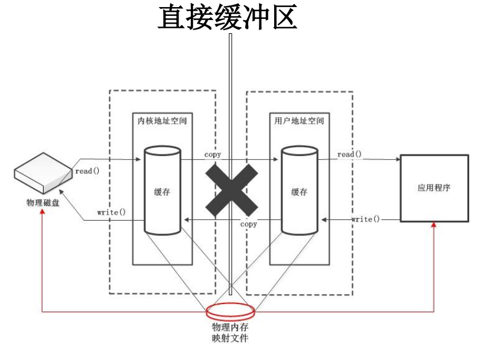
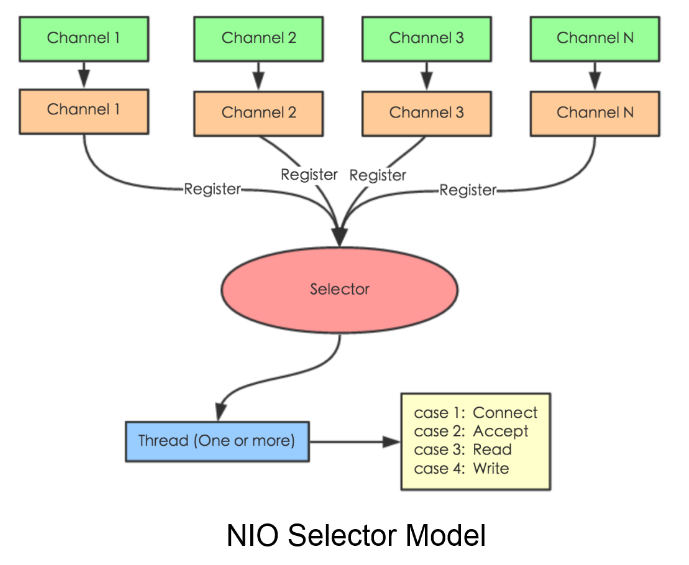
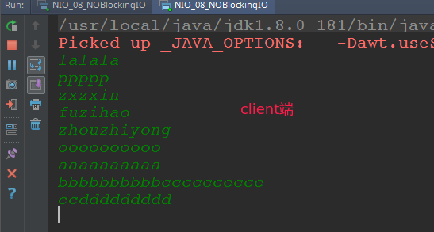

# NIO基础

* Java NIO 与 IO 的主要区别
* 缓冲区(Buffer)
* 通道(Channel)
* NIO 的非阻塞式网络通信
  * 选择器(Selector)
  * SocketChannel、ServerSocketChannel、DatagramChannel
* 管道(Pipe)
* Java NIO2 (Path、Paths 与 Files )

## 一、Java NIO 与 IO 的主要区别

NIO与原来的IO有同样的作用和目的，但是使用的方式完全不同，**NIO支持面向缓冲区的、基于通道的IO操作**。NIO将以更加高效的方式进行文件的读写操作。

| IO                      | NIO                         |
| ----------------------- | --------------------------- |
| 面向流(Stream Oriented) | 面向缓冲区(Buffer Oriented) |
| 阻塞IO(Blocking IO)     | 非阻塞IO(Non Blocking IO)   |
| (无)                    | 选择器(Selectors)           |

## 二、缓冲区(Buffer)

Java NIO系统的核心在于：通道(Channel)和缓冲区(Buffer)。

缓冲区（Buffer）

*  缓冲区（Buffer）：**一个用于特定基本数据类型的容器**。由 java.nio 包定义的，所有缓冲区都是 Buffer 抽象类的子类。

*  Java NIO 中的 Buffer 主要用于与 NIO 通道进行交互，**数据是从通道读入缓冲区，从缓冲区写入通道中的**。

### 1、缓冲区Buffer

Buffer 就像一个数组，可以保存多个相同类型的数据。根据数据类型不同(boolean 除外) ，有以下 Buffer 常用子类: `ByteBuffer、CharBuffer、ShortBuffer、IntBuffer、LongBuffer`等。

上述 Buffer 类 他们都采用相似的方法进行管理数据，只是各自管理的数据类型不同而已。都是通过如下方法获取一个 Buffer 对象：

```java
static XxxBuffer allocate(int capacity) : 创建一个容量为 capacity 的 XxxBuffer 对象
```

缓冲区的基本属性、Buffer 中的重要概念：

* **容量 (capacity)** ：表示 Buffer 最大数据容量，缓冲区容量不能为负，并且创建后不能更改。

* **限制 (limit)**：第一个不应该读取或写入的数据的索引，即位于 limit 后的数据不可读写。缓冲区的限制不能为负，并且不能大于其容量。

* **位置 (position)**：下一个要读取或写入的数据的索引。缓冲区的位置不能为负，并且不能大于其限制

* **标记 (mark)与重置 (reset)**：标记是一个索引，通过 Buffer 中的 mark() 方法指定 Buffer 中一个特定的 position，之后可以通过调用 reset() 方法恢复到这个 position.

标记、位置、限制、容量遵守以下不变式： `0 <= mark <= position <= limit <= capacity`


改变的过程: 

* 1)、新建一个大小为 10 个字节的缓冲区，此时 position 为 0，而 `limit = capacity = 10`。capacity 变量不会改变，下面的讨论会忽略它。
* 2)、从输入通道中读取 5 个字节数据写入缓冲区中，此时 position 为 5，limit 保持不变。
* 3)、在将缓冲区的数据写到输出通道之前，需要先调用 `flip()` 方法，**这个方法将 limit 设置为当前 position**，并将 position 设置为 0。
*  4)、从缓冲区中取 4 个字节到输出缓冲中，此时 position 设为 4。
*  5)、最后需要调用 clear() 方法来清空缓冲区，此时 position 和 limit 都被设置为最初位置。

测试: 

```java
/**
 * 一、通过 allocate() 获取缓冲区
 * 二、缓冲区存取数据的两个核心方法：
     * put() : 存入数据到缓冲区中
     * get() : 获取缓冲区中的数据
 * 三、缓冲区中的四个核心属性：
     * capacity :  容量，表示缓冲区中最大存储数据的容量。一旦声明不能改变。
     * limit :    界限，表示缓冲区中可以操作数据的大小。（limit 后数据不能进行读写）
     * position : 位置，表示缓冲区中正在操作数据的位置。
     * mark :     标记，表示记录当前 position 的位置。可以通过 reset() 恢复到 mark 的位置
     * 0 <= mark <= position <= limit <= capacity
 * 四、直接缓冲区与非直接缓冲区：
     * 非直接缓冲区：通过 allocate() 方法分配缓冲区，将缓冲区建立在 JVM 的内存中
     * 直接缓冲区：通过 allocateDirect() 方法分配直接缓冲区，将缓冲区建立在物理内存中。可以提高效率
 */
public class NIO_01_Buffer {

    static PrintStream out = System.out;

    public static void main(String[] args) {
        String str = "abcde";

        //1. 分配一个指定大小的缓冲区
        ByteBuffer buf = ByteBuffer.allocate(1024);

        out.println("----------------allocate()----------------");
        out.println(buf.position() + " " + buf.limit() + " " + buf.capacity()); //0 1024 1024

        //2. 利用 put() 存入数据到缓冲区中
        buf.put(str.getBytes());

        out.println("-----------------put()----------------");
        out.println(buf.position() + " " + buf.limit() + " " + buf.capacity()); // 5 1024 1024

        //3. 切换读取数据模式
        buf.flip();

        out.println("-----------------flip()----------------");
        out.println(buf.position() + " " + buf.limit() + " " + buf.capacity()); // 0 5 1024

        //4. 利用 get() 读取缓冲区中的数据
        byte[] dst = new byte[buf.limit()];
        buf.get(dst);
        out.println(new String(dst, 0, dst.length));

        out.println("-----------------get()----------------");
        out.println(buf.position() + " " + buf.limit() + " " + buf.capacity()); // 5 5 1024

        //5. rewind() : 可重复读
        buf.rewind();

        out.println("-----------------rewind()----------------");
        out.println(buf.position() + " " + buf.limit() + " " + buf.capacity()); // 0 5 1024

        //6. clear() : 清空缓冲区. 但是缓冲区中的数据依然存在，但是处于“被遗忘”状态
        buf.clear();


        //7. clear()之后数据依然存在，处于遗忘状态
        out.println("-----------------clear()----------------");
        out.println(buf.position() + " " + buf.limit() + " " + buf.capacity()); //0 1024 1024

        out.println((char) buf.get()); // 依然存在
    }
}

```

输出：

```java
----------------allocate()----------------
0 1024 1024
-----------------put()----------------
5 1024 1024
-----------------flip()----------------
0 5 1024
abcde
-----------------get()----------------
5 5 1024
-----------------rewind()----------------
0 5 1024
-----------------clear()----------------
0 1024 1024
a
```

### 2、Buffer常用方法

| 方 法                  | 描 述                                                     |
| ---------------------- | --------------------------------------------------------- |
| Buffer clear()         | 清空缓冲区并返回对缓冲区的引用                            |
| Buffer flip()          | 将缓冲区的界限设置为当前位置，并将当前位置充值为 0        |
| int capacity()         | 返回 Buffer 的 capacity 大小                              |
| boolean hasRemaining() | 判断缓冲区中是否还有元素                                  |
| int limit()            | 返回 Buffer 的界限(limit) 的位置                          |
| Buffer limit(int n)    | 将设置缓冲区界限为 n, 并返回一个具有新 limit 的缓冲区对象 |
| Buffer mark()          | 对缓冲区设置标记                                          |
| int position()         | 返回缓冲区的当前位置 position                             |
| Buffer position(int n) | 将设置缓冲区的当前位置为 n , 并返回修改后的 Buffer 对象   |
| int remaining()        | 返回 position 和 limit 之间的元素个数                     |
| Buffer reset()         | 将位置 position 转到以前设置的 mark 所在的位置            |
| Buffer rewind()        | 将位置设为为 0， 取消设置的 mark                          |

Buffer 所有子类提供了两个用于数据操作的方法：get() 与 put() 方法

获取 Buffer 中的数据

* get() ：读取单个字节；
* get(byte[] dst)：批量读取多个字节到 dst 中；
* get(int index)：读取指定索引位置的字节(不会移动 position)；

放入数据到 Buffer 中

* put(byte b)：将给定单个字节写入缓冲区的当前位置；
* put(byte[] src)：将 src 中的字节写入缓冲区的当前位置；
* put(int index, byte b)：将指定字节写入缓冲区的索引位置(不会移动 position)；

测试一下`mark`的作用: 

```java
public class NIO_02_Buffer_mark {
    public static void main(String[] args){

        String str = "abcde";
        ByteBuffer buf = ByteBuffer.allocate(1024);
        buf.put(str.getBytes());
        
        //读模式
        buf.flip();

        byte[] dst = new byte[buf.limit()];
        buf.get(dst, 0, 2);
        System.out.println(new String(dst, 0, 2));
        System.out.println(buf.position());

        //mark() : 标记
        buf.mark();

        buf.get(dst, 2, 2);
        System.out.println(new String(dst, 2, 2));
        System.out.println(buf.position());

        //reset() : 恢复到 mark 的位置
        buf.reset();
        System.out.println(buf.position());

        //判断缓冲区中是否还有剩余数据
        if(buf.hasRemaining()){
            System.out.println(buf.remaining());//获取缓冲区中可以操作的数量
        }
    }
}
```

输出:

```java
ab
2
cd
4
2
3
```

### 3、直接与非直接缓冲区

字节缓冲区要么是直接的，要么是非直接的。

如果为直接字节缓冲区，则 Java 虚拟机会尽最大努力直接在此缓冲区上执行**本机 I/O 操作**。也就是说，在每次调用基础操作系统的一个本机 I/O 操作之前（或之后），虚拟机都会尽量**避免将缓冲区的内容复制到中间缓冲区中（或从中间缓冲区中复制内容）**。

直接字节缓冲区可以通过调用此类的` allocateDirect()` 工厂方法来创建。

此方法返回的缓冲区进行分配和取消分配所需成本通常高于非直接缓冲区。直接缓冲区的内容可以驻留在常规的垃圾回收堆之外，因此，它们对应用程序的内存需求量造成的影响可能并不明显。所以，**建议将直接缓冲区主要分配给那些易受基础系统的本机 I/O 操作影响的大型、持久的缓冲区**。一般情况下，最好仅在直接缓冲区能在程序性能方面带来明显好处时分配它们。

**直接字节缓冲区还可以通过 FileChannel 的 map() 方法 将文件区域直接映射到内存中来创建**。该方法返回
`MappedByteBuffer` 。Java 平台的实现有助于通过 JNI 从本机代码创建直接字节缓冲区。如果以上这些缓冲区
中的某个缓冲区实例指的是不可访问的内存区域，则试图访问该区域不会更改该缓冲区的内容，并且将会在
访问期间或稍后的某个时间导致抛出不确定的异常。

> 字节缓冲区是直接缓冲区还是非直接缓冲区可通过调用其 `isDirect()` 方法来确定。提供此方法是为了能够在性能关键型代码中执行显式缓冲区管理。




## 三、通道(Channel)

### 1、通道

通道（Channel）：由 java.nio.channels 包定义的。Channel 表示 IO 源与目标打开的连接。
Channel 类似于传统的“流”。只不过 Channel 本身不能直接访问数据，Channel 只能与Buffer 进行交互。

通道`Channel`：

- 通道表示**打开到 IO 设备(例如：文件、套接字)的连接**。
- 若需要使用 NIO 系统，**需要获取用于连接 IO 设备的通道以及用于容纳数据的缓冲区**。
- 然后操作缓冲区，对数据进行处理。


### 2、常见实现类和使用

Java 为 Channel 接口提供的最主要实现类如下：

* FileChannel：用于读取、写入、映射和操作文件的通道；
* DatagramChannel：通过 UDP 读写网络中的数据通道；
* SocketChannel：通过 TCP 读写网络中的数据；
* ServerSocketChannel：可以监听新进来的 TCP 连接，对每一个新进来的连接都会创建一个SocketChannel；

获取通道的一种方式是对支持通道的对象调用`getChannel()` 方法。支持通道的类如下：

* FileInputStream、FileOutputStream
* RandomAccessFile
* DatagramSocket、Socket、ServerSocket

获取通道的其他方式是使用 Files 类的静态方法 `newByteChannel() `获取字节通道。

或者通过通道的静态方法` open() `打开并返回指定通道。

基础使用，使用`Channel`完成文件的复制: 

```java
// 利用通道完成文件的复制(非直接缓冲区)
static void testCopyFileUseChannel() throws Exception {
    long start = System.currentTimeMillis();

    //① 获取通道
    FileInputStream fis = new FileInputStream("/home/zxzxin/Java_Maven/socket/src/nio/1.jpg");
    FileOutputStream fos = new FileOutputStream("/home/zxzxin/Java_Maven/socket/src/nio/2.jpg");

    FileChannel inChannel = fis.getChannel();
    FileChannel outChannel = fos.getChannel();

    //② 分配指定大小的缓冲区
    ByteBuffer buf = ByteBuffer.allocate(1024);

    //③ 将通道中的数据存入缓冲区中
    while (inChannel.read(buf) != -1) {
        buf.flip();   //切换读取数据的模式

        outChannel.write(buf);//④将缓冲区中的数据写入通道中
        buf.clear();   //清空缓冲区
    }

    // 关闭
    outChannel.close();
    inChannel.close();
    fos.close();
    fis.close();

    long end = System.currentTimeMillis();
    System.out.println("耗费时间为：" + (end - start));
}
```

下面使用直接缓冲区完成文件的复制 (和`alloacteDirect()`原理一样):

```java
// 使用直接缓冲区完成文件的复制
static void testCopyFileUseDirectBuffer() throws Exception {

    String src = "/home/zxzxin/Java_Maven/socket/src/nio/1.jpg";
    String dst = "/home/zxzxin/Java_Maven/socket/src/nio/3.jpg";
    FileChannel inChannel = FileChannel.open(Paths.get(src), StandardOpenOption.READ); //读
    FileChannel outChannel = FileChannel.open(Paths.get(dst),
                                              StandardOpenOption.WRITE,
                                              StandardOpenOption.READ, //这里要加上这个，因为下面的outMappedBuf有一个READ_WRITE模式，所以要加上READ
                                              StandardOpenOption.CREATE); // CREATE就是如果不存在就创建

    // 内存映射文件， 原理和allocateDirect()一模一样，只有ByteBuffer支持内存映射
    MappedByteBuffer inMappedBuf = inChannel.map(MapMode.READ_ONLY, 0, inChannel.size());
    MappedByteBuffer outMappedBuf = outChannel.map(MapMode.READ_WRITE, 0, inChannel.size());

    // 直接对缓冲区进行读写操作  (不需要通道)
    byte[] destBytes = new byte[inMappedBuf.limit()];
    inMappedBuf.get(destBytes);
    outMappedBuf.put(destBytes);

    outChannel.close();
    inChannel.close();
}
```

还有一种方式，使用的`ChannelTransfer`，代码如下:

```java
// 通道之间的数据传输  (也是使用直接缓冲区)
static void testChannelTransfer() throws Exception{
    String src = "/home/zxzxin/Java_Maven/socket/src/nio/1.jpg";
    String dst = "/home/zxzxin/Java_Maven/socket/src/nio/4.jpg";
    FileChannel inChannel = FileChannel.open(Paths.get(src), StandardOpenOption.READ); //读
    FileChannel outChannel = FileChannel.open(Paths.get(dst),
                                              StandardOpenOption.WRITE,
                                              StandardOpenOption.READ, //这里要加上这个，因为下面的outMappedBuf有一个READ_WRITE模式，所以要加上READ
                                              StandardOpenOption.CREATE); // CREATE就是如果不存在就创建

    inChannel.transferTo(0, inChannel.size(), outChannel);
    // 下面这个和上面一样
    //        outChannel.transferFrom(inChannel, 0, inChannel.size());

    inChannel.close();
    outChannel.close();
}
```

### 2、分散与聚集

分散读取（`Scattering Reads`）是指从 Channel 中读取的数据“分散”到多个 Buffer 中。

注意：按照缓冲区的顺序，从 Channel 中读取的数据依次将 Buffer 填满。

聚集写入（`Gathering Writes`）是指将多个 Buffer 中的数据“聚集”到 Channel。

注意：按照缓冲区的顺序，写入 position 和 limit 之间的数据到 Channel 。


代码:

```java
/**
 * 五、分散(Scatter)与聚集(Gather)
 * 分散读取（Scattering Reads）：将通道中的数据分散到多个缓冲区中
 * 聚集写入（Gathering Writes）：将多个缓冲区中的数据聚集到通道中
 */

public class NIO_04_ScatterGather {

    public static void main(String[] args) throws Exception{
        RandomAccessFile raf1 = new RandomAccessFile("/home/zxzxin/Java_Maven/socket/src/nio/1.txt", "rw");

        //1. 获取通道
        FileChannel channel1 = raf1.getChannel();

        //2. 分配指定大小的缓冲区
        ByteBuffer buf1 = ByteBuffer.allocate(100);
        ByteBuffer buf2 = ByteBuffer.allocate(1024);

        //3. 分散读取
        ByteBuffer[] bufs = {buf1, buf2};
        channel1.read(bufs);

        for (ByteBuffer byteBuffer : bufs) byteBuffer.flip();

        System.out.println(new String(bufs[0].array(), 0, bufs[0].limit()));
        System.out.println("---------------------------");
        System.out.println(new String(bufs[1].array(), 0, bufs[1].limit()));

        //4. 聚集写入
        RandomAccessFile raf2 = new RandomAccessFile("/home/zxzxin/Java_Maven/socket/src/nio/2.txt", "rw");
        FileChannel channel2 = raf2.getChannel();

        channel2.write(bufs);
    }
}
```

总结 FileChannel 的常用方法:

| 方 法                         | 描 述                                        |
| ----------------------------- | -------------------------------------------- |
| int read(ByteBuffer dst)      | 从 Channel 中读取数据到 ByteBuffer           |
| long read(ByteBuffer[] dsts)  | 将 Channel 中的数据“分散”到 ByteBuffer[]     |
| int write(ByteBuffer src)     | 将 ByteBuffer 中的数据写入到 Channel         |
| long write(ByteBuffer[] srcs) | 将 ByteBuffer[] 中的数据“聚集”到 Channel     |
| long position()               | 返回此通道的文件位置                         |
| FileChannel position(long p)  | 设置此通道的文件位置                         |
| long size()                   | 返回此通道的文件的当前大小                   |
| FileChannel truncate(long s)  | 将此通道的文件截取为给定大小                 |
| void force(boolean metaData)  | 强制将所有对此通道的文件更新写入到存储设备中 |

### 4、编码和解码使用

相关API使用:

```java
import java.nio.*;
import java.nio.charset.*;

public class NIO_05_Charset {

    public static void main(String[] args) throws CharacterCodingException {
        Charset cs1 = Charset.forName("GBK");

        //获取编码器
        CharsetEncoder ce = cs1.newEncoder();
        //获取解码器
        CharsetDecoder cd = cs1.newDecoder();

        CharBuffer cBuf = CharBuffer.allocate(1024);
        cBuf.put("尚硅谷威武！");
        cBuf.flip();

        //编码
        ByteBuffer bBuf = ce.encode(cBuf);
        for (int i = 0; i < 12; i++) System.out.println(bBuf.get());

        //解码
        bBuf.flip();
        CharBuffer cBuf2 = cd.decode(bBuf);
        System.out.println(cBuf2.toString());

        System.out.println("-------------------------下面会乱码-----------------------------");

        Charset cs2 = Charset.forName("UTF-8");
        bBuf.flip();
        CharBuffer cBuf3 = cs2.decode(bBuf);
        System.out.println(cBuf3.toString());
    }
}
```

## 四、NIO 的非阻塞式网络通信

### 1、NIO阻塞和非阻塞式

传统的 IO 流都是阻塞式的。也就是说，**当一个线程调用 read() 或 write() 时，该线程被阻塞，直到有一些数据被读取或写入，该线程在此期间不能执行其他任务**。因此，在完成网络通信进行 IO 操作时，由于线程会阻塞，**所以服务器端必须为每个客户端都提供一个独立的线程进行处理**，当服务器端需要处理大量客户端时，性能急剧下降。

Java NIO 是非阻塞模式的。**当线程从某通道进行读写数据时，若没有数据可用时，该线程可以进行其他任务**。线程通常将非阻塞 IO 的空闲时间用于在其他通道上执行 IO 操作，所以单独的线程可以管理多个输入和输出通道。因此，NIO 可以让服务器端使用一个或有限几个线程来同时处理连接到服务器端的所有客户端。

先看之前的`BlockingIO`，使用客户端和服务器端。

```java
/**
 * 一、使用 NIO 完成网络通信的三个核心：
 *
 * 1. 通道（Channel）：负责连接
 *
 * 	   java.nio.channels.Channel 接口：
 * 			|--SelectableChannel
 * 				|--SocketChannel
 * 				|--ServerSocketChannel
 * 				|--DatagramChannel
 *
 * 				|--Pipe.SinkChannel
 * 				|--Pipe.SourceChannel
 *
 * 2. 缓冲区（Buffer）：负责数据的存取
 *
 * 3. 选择器（Selector）：是 SelectableChannel 的多路复用器。用于监控 SelectableChannel 的 IO 状况
 */
public class NIO_06_BlockingIO_01 {

    static void client() throws IOException {

        //1. 获取通道
        SocketChannel socketChannel = SocketChannel.open(new InetSocketAddress("127.0.0.1", 9898));

        FileChannel inChannel = FileChannel.open(Paths.get("/home/zxzxin/Java_Maven/socket/src/nio/1.jpg"),
                StandardOpenOption.READ);

        //2. 分配指定大小的缓冲区
        ByteBuffer buf = ByteBuffer.allocate(1024);

        //3. 读取本地文件，并发送到服务端
        while (inChannel.read(buf) != -1) {
            buf.flip();
            socketChannel.write(buf);
            buf.clear();
        }

        //4. 关闭通道
        inChannel.close();
        socketChannel.close();
    }

    //服务端
    static void server() throws IOException {
        //1. 获取通道
        ServerSocketChannel serverSocketChannel = ServerSocketChannel.open();

        FileChannel outChannel = FileChannel.open(Paths.get("/home/zxzxin/Java_Maven/socket/src/nio/5.jpg"),
                StandardOpenOption.WRITE, StandardOpenOption.CREATE);

        //2. 绑定连接
        serverSocketChannel.bind(new InetSocketAddress(9898));

        //3. 获取客户端连接的通道
        SocketChannel sChannel = serverSocketChannel.accept();

        //4. 分配指定大小的缓冲区
        ByteBuffer buf = ByteBuffer.allocate(1024);

        //5. 接收客户端的数据，并保存到本地
        while (sChannel.read(buf) != -1) {
            buf.flip();
            outChannel.write(buf);
            buf.clear();
        }

        //6. 关闭通道
        sChannel.close();
        outChannel.close();
        serverSocketChannel.close();
    }

    public static void main(String[] args) throws Exception{
        // 先启动 server(), 然后启动 client()

//        server();

        client();
    }
}
```

使用`SocketChannel.shutdownOutput()`关闭socketChannel。

```java
public class NIO_07_BlockingIO_02 {

    //客户端
    static void client() throws IOException {
        SocketChannel socketChannel = SocketChannel.open(new InetSocketAddress("127.0.0.1", 9898));

        FileChannel inChannel = FileChannel.open(Paths.get("/home/zxzxin/Java_Maven/socket/src/nio/1.jpg"),
                StandardOpenOption.READ);

        ByteBuffer buf = ByteBuffer.allocate(1024);

        while(inChannel.read(buf) != -1){
            buf.flip();
            socketChannel.write(buf);
            buf.clear();
        }

        socketChannel.shutdownOutput(); // 一定要先关闭socketChannel

        //接收服务端的反馈, 注意上面要关闭
        int len = 0;
        while((len = socketChannel.read(buf)) != -1){
            buf.flip();
            System.out.println(new String(buf.array(), 0, len));
            buf.clear();
        }

        inChannel.close();
        socketChannel.close();
    }

    //服务端
    static void server() throws IOException{
        ServerSocketChannel serverSocketChannel = ServerSocketChannel.open();

        FileChannel outChannel = FileChannel.open(Paths.get("/home/zxzxin/Java_Maven/socket/src/nio/6.jpg"),
                StandardOpenOption.WRITE, StandardOpenOption.CREATE);

        serverSocketChannel.bind(new InetSocketAddress(9898));

        SocketChannel sChannel = serverSocketChannel.accept();

        ByteBuffer buf = ByteBuffer.allocate(1024);

        while(sChannel.read(buf) != -1){
            buf.flip();
            outChannel.write(buf);
            buf.clear();
        }

        //发送反馈给客户端
        buf.put("服务端接收数据成功".getBytes());
        buf.flip();
        sChannel.write(buf);

        sChannel.close();
        outChannel.close();
        serverSocketChannel.close();
    }

    public static void main(String[] args) throws Exception{
//        server();

        client();
    }
}
```

### 2、Selector实现非阻塞

然后看使用非阻塞式IO。

选择器（Selector） 是 SelectableChannle 对象的多路复用器，Selector 可以同时监控多个 SelectableChannel 的 IO 状况，也就是说，利用 Selector 可使一个单独的线程管理多个 Channel。Selector 是非阻塞 IO 的核心

<div align="center">   </div><br>

> 图片出处: <https://itimetraveler.github.io/2018/05/15/%E3%80%90Java%E3%80%91NIO%E7%9A%84%E7%90%86%E8%A7%A3/>

`Selector`使用：

* 创建 Selector ：通过调用` Selector.open() `方法创建一个 Selector。
* 向选择器注册通道：`SelectableChannel.register(Selector sel, int ops)`。

当调用 `register(Selector sel, int ops) `将通道注册选择器时，选择器对通道的监听事件，需要通过第二个参数 ops 指定。
可以监听的事件类型（可使用 SelectionKey 的四个常量表示）：

* 读 : `SelectionKey.OP_READ （1）`
*  写 : `SelectionKey.OP_WRITE （4）`
* 连接 : `SelectionKey.OP_CONNECT （8）`
* 接收 : `SelectionKey.OP_ACCEPT （16）`

若注册时不止监听一个事件，则可以使用“位或”操作符连接。

`SelectionKey`：表示 SelectableChannel 和 Selector 之间的注册关系。**每次向选择器注册通道时就会选择一个事件(选择键)**。选择键包含两个表示为整数值的操作集。操作集的每一位都表示该键的通道所支持的一类可选择操
作。

| 方 法                       | 描 述                            |
| --------------------------- | -------------------------------- |
| int interestOps()           | 获取感兴趣事件集合               |
| int readyOps()              | 获取通道已经准备就绪的操作的集合 |
| SelectableChannel channel() | 获取注册通道                     |
| Selector selector()         | 返回选择器                       |
| boolean isReadable()        | 检测 Channal 中读事件是否就绪    |
| boolean isWritable()        | 检测 Channal 中写事件是否就绪    |
| boolean isConnectable()     | 检测 Channel 中连接是否就绪      |
| boolean isAcceptable()      | 检测 Channel 中接收是否就绪      |

非阻塞式IO测试:

Java NIO中的SocketChannel是一个连接到TCP网络套接字的通道。作步骤：

* 打开 SocketChannel
* 读写数据
* 关闭 SocketChannel

> Java NIO中的 ServerSocketChannel 是一个可以监听新进来的TCP连接的通道，就像标准IO中的ServerSocket一样。

代码:

```java
public class NIO_08_NOBlockingIO {

    //客户端
    static void client() throws IOException {
        //1. 获取通道
        SocketChannel socketChannel = SocketChannel.open(new InetSocketAddress("127.0.0.1", 9898));

        //2. 切换非阻塞模式
        socketChannel.configureBlocking(false);

        //3. 分配指定大小的缓冲区
        ByteBuffer buf = ByteBuffer.allocate(1024);

        //4. 发送数据给服务端
        Scanner scan = new Scanner(System.in);

        while(scan.hasNext()){
            String str = scan.next();
            buf.put((new Date().toString() + "\n" + str).getBytes());
            buf.flip();
            socketChannel.write(buf);
            buf.clear();
        }

        //5. 关闭通道
        socketChannel.close();
    }

    //服务端
    static void server() throws IOException{
        //1. 获取通道
        ServerSocketChannel serverSocketChannel = ServerSocketChannel.open();

        //2. 切换非阻塞模式
        serverSocketChannel.configureBlocking(false);

        //3. 绑定连接
        serverSocketChannel.bind(new InetSocketAddress(9898));

        //4. 获取选择器
        Selector selector = Selector.open();

        //5. 将通道注册到选择器上, 并且指定“监听接收事件”
        serverSocketChannel.register(selector, SelectionKey.OP_ACCEPT);

        //6. 轮询式的获取选择器上已经“准备就绪”的事件
        while(selector.select() > 0){

            //7. 获取当前选择器中所有注册的“选择键(已就绪的监听事件)”
            Iterator<SelectionKey> it = selector.selectedKeys().iterator();

            while(it.hasNext()){
                //8. 获取准备“就绪”的是事件
                SelectionKey sk = it.next();

                //9. 判断具体是什么事件准备就绪
                if(sk.isAcceptable()){
                    //10. 若“接收就绪”，获取客户端连接
                    SocketChannel sChannel = serverSocketChannel.accept();

                    //11. 切换非阻塞模式
                    sChannel.configureBlocking(false);

                    //12. 将该通道注册到选择器上
                    sChannel.register(selector, SelectionKey.OP_READ);
                }else if(sk.isReadable()){
                    //13. 获取当前选择器上“读就绪”状态的通道
                    SocketChannel sChannel = (SocketChannel) sk.channel();

                    //14. 读取数据
                    ByteBuffer buf = ByteBuffer.allocate(1024);

                    int len = 0;
                    while((len = sChannel.read(buf)) > 0 ){
                        buf.flip();
                        System.out.println(new String(buf.array(), 0, len));
                        buf.clear();
                    }
                }
                //15. 取消选择键 SelectionKey
                it.remove();
            }
        }
    }

    public static void main(String[] args) throws Exception{

//        server();  // 服务器端

        client(); // 可以启动多个服务器端，这样就可以实现一个聊天室
    }
}
```


先启动`server()`，然后启动`client()`，我们可以测试:

在`client`输入一些字符:



可以在`server()`端看到输入的字符响应:


也可以使用`UDP`协议的，是类似的:

```java
public class NIO_09_NOBlockingIO_02 {

    static void send() throws IOException {
        DatagramChannel dc = DatagramChannel.open();

        dc.configureBlocking(false);

        ByteBuffer buf = ByteBuffer.allocate(1024);

        Scanner scan = new Scanner(System.in);

        while(scan.hasNext()){
            String str = scan.next();
            buf.put((new Date().toString() + ":\n" + str).getBytes());
            buf.flip();
            dc.send(buf, new InetSocketAddress("127.0.0.1", 9898));
            buf.clear();
        }

        dc.close();
    }

    static void receive() throws IOException{
        DatagramChannel dc = DatagramChannel.open();

        dc.configureBlocking(false); //非阻塞

        dc.bind(new InetSocketAddress(9898));

        Selector selector = Selector.open();

        dc.register(selector, SelectionKey.OP_READ); // READ模式

        while(selector.select() > 0){

            Iterator<SelectionKey> it = selector.selectedKeys().iterator();

            while(it.hasNext()){
                SelectionKey sk = it.next();

                if(sk.isReadable()){
                    ByteBuffer buf = ByteBuffer.allocate(1024);

                    dc.receive(buf);
                    buf.flip();
                    System.out.println(new String(buf.array(), 0, buf.limit()));
                    buf.clear();
                }
            }
            it.remove();
        }
    }

    public static void main(String[] args) throws Exception{

//        receive();
        send();
    }
}
```

### 3、Pipe管道

Java NIO 管道是2个线程之间的单向数据连接。**Pipe有一个source通道和一个sink通道。数据会被写到sink通道，从source通道读取**。


代码:

```java
public class NIO_10_Pipe {

    public static void main(String[] args) throws Exception{
        //1. 获取管道
        Pipe pipe = Pipe.open();

        //2. 将缓冲区中的数据写入管道
        ByteBuffer buf = ByteBuffer.allocate(1024);

        Pipe.SinkChannel sinkChannel = pipe.sink();
        buf.put("通过单向管道发送数据".getBytes());
        buf.flip();
        sinkChannel.write(buf);

        //3. 读取缓冲区中的数据
        Pipe.SourceChannel sourceChannel = pipe.source();
        buf.flip();
        int len = sourceChannel.read(buf);
        System.out.println(new String(buf.array(), 0, len));

        sourceChannel.close();
        sinkChannel.close();
    }
}

```

