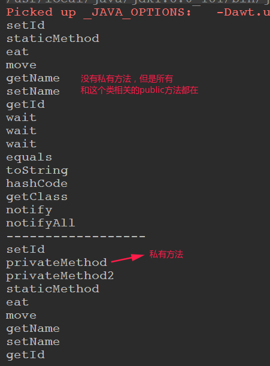

# 反射基础

* [一、基本介绍](#一基本介绍)
* [二、反射和类的信息的相关API](#二反射和类的信息的相关api)
* [三、实例操作相关](#三实例操作相关)
* [四、反射的应用实例](#四反射的应用实例)
  * [1、通过配置文件生成类](#1通过配置文件生成类)
  * [2、反射略过泛型检查](#2反射略过泛型检查)
  * [3、编写一个可以为任何对象设置任何属性的方法](#3编写一个可以为任何对象设置任何属性的方法)

反射大部分方法概述:


基本过程: 

1、编译Java文件，生成`.class`文件

2、使用Java虚拟机（JVM）将字节码文件（字节码文件在内存中使用Class类表示）加载到内存

4、使用反射的时候，首先获取到Class类，就可以得到class文件里的所有内容，包含属性、构造方法、普通方法

5、属性通过Filed类表示、构造方法通过Constructor表示、普通方法通过Method表示


## 一、基本介绍

反射机制是在**运行状态中**:

* 对于任意一个类，都能够知道这个类的所有属性和方法；
* 对于任意一个对象和，都能够调用它的任意一个方法和属性；

**反射提供的功能**:

* 在运行时判断任意一个对象所属的类；
* 在运行时构造任意一个类的对象；
* 在运行时判断任意一个类所具有的成员变量和方法；
* 在运行时调用任意一个对象的方法；
* 生成动态代理；

下面的部分将会用到一个例子，这个例子的一些基本类如下，其实很简单，就是两个实体类`Dog`和`Cat`，都实现了`Animal`接口和`Movable`接口，代表它们都是动物而且可以移动:

```java
public interface Animal {
    void eat();
}
```

```java
public interface Movable {
    void move();
}
```

```java
public class Cat implements Animal,Movable {
    @Override
    public void eat() {
    }
    @Override
    public void move() {
    }
}
```

```java
public class Dog implements Animal, Movable{

    private int id;
    private String name;
    private int age;

    // 公共属性
    public String desc;

    public Dog() {

    }
    // 私有方法
    private Dog(String name) {
        this.name = name;
    }

    // 三个参数的构造方法
    public Dog(int id, String name, int age) {
        this.id = id;
        this.name = name;
        this.age = age;
    }

    public int getId() {
        return id;
    }

    public void setId(int id) {
        this.id = id;
    }

    public void setName(String name) {
        this.name = name;
    }

    public String getName() {
        return name;
    }

    // 两个私有方法
    private void privateMethod() {
        System.out.println(" private method...");
    }

    private void privateMethod2(String name) {
        System.out.println(" private method2..."+name);
    }

    // 一个静态方法
    public static void staticMethod() {
        System.out.println("static method ...");
    }

    // eat是重写的方法
    @Override
    public void eat() {
        System.out.println("dog eat...(interface override method)");
    }

    @Override
    public void move() {
        System.out.println("dog move...(interface override method)");
    }
}
```

## 二、反射和类的信息的相关API

### 1、创建反射的三种方法

获取反射对象的三种方式(反射的入口):

* 1)、`Class.forName(全类名)`；
* 2)、`XX.class`；
* 3)、`对象.getClass()`；

例子:

```java
public class ReflectEntrance {
    
    public static void main(String[] args) throws ClassNotFoundException {
        // 1. Class.forName()
        Class<?> dClazz = Class.forName("javaPrimary.reflect.Dog");
        System.out.println(dClazz);

        // 2. 类名.class
        Class<Dog> dClazz2 = Dog.class;
        System.out.println(dClazz2);

        // 3. 对象.getClass()
        Dog dog = new Dog();
        Class<?> dClazz3 = dog.getClass();
        System.out.println(dClazz3);
    }
}
```

输出:

```java
class javaPrimary.reflect.Dog
class javaPrimary.reflect.Dog
class javaPrimary.reflect.Dog
```

### 2、用反射获取类的方法

注意，其中`getMethods()`和`getDeclaredMethods()`的不同:

* `getMethods()`会获取到这个类以及和它有关的类(接口、父类)的所有`public`方法；
* `getDeclaredMethods()`只会获取**当前类**的所有方法(包括`private、protected`)；

测试:

```java
public class ReflectMethod {

    public static void main(String[] args) throws ClassNotFoundException {
        Class<?> dClazz = Class.forName("javaPrimary.reflect.Dog");

        // 获取所有的公共方法(没有private)
        // 但是有它所有有关联的类的方法，包括接口，它的父类Object
        Method[] methods = dClazz.getMethods();
        for(Method method : methods)
            System.out.println(method.getName());

        System.out.println("------------------");

        // 可以得到当前类的所有的方法: 包括私有的方法
        Method[] declaredMethods = dClazz.getDeclaredMethods();
        for(Method method : declaredMethods)
            System.out.println(method.getName());
    }
}
```

输出:



### 3、用反射获取接口

```java
public class ReflectInterface {

    public static void main(String[] args) throws ClassNotFoundException {
        Class<?> dClazz = Class.forName("javaPrimary.reflect.Dog");

        // 获取Dog实现的所有的接口
        Class<?>[] interfaces = dClazz.getInterfaces();
        for(Class<?>inter : interfaces)
            System.out.println(inter);
    }
}
```

输出:

```java
interface javaPrimary.reflect.Animal
interface javaPrimary.reflect.Movable
```

### 4、用反射获取成员变量

注意也是有`getFields()`和`getDeclaredFields()`的区别。

```java
public class ReflectField {

    public static void main(String[] args) throws ClassNotFoundException {
        Class<?> dClazz = Class.forName("javaPrimary.reflect.Dog");

        // 只能获取到公共的属性， 为了测试我这里用了一个desc的 public属性
        Field[] fields = dClazz.getFields();  
        for(Field field : fields)
            System.out.println(field);

        System.out.println("------------------");

        Field[] declaredFields = dClazz.getDeclaredFields();
        for(Field field : declaredFields)
            System.out.println(field);
    }
}
```

输出:

```java
public java.lang.String javaPrimary.reflect.Dog.desc
------------------
private int javaPrimary.reflect.Dog.id
private java.lang.String javaPrimary.reflect.Dog.name
private int javaPrimary.reflect.Dog.age
public java.lang.String javaPrimary.reflect.Dog.desc
```


### 5、用反射获取构造器

```java
public class ReflectConstructor {

    public static void main(String[] args) throws ClassNotFoundException {
        Class<?> dClazz = Class.forName("javaPrimary.reflect.Dog");

        // 注意没有获取到私有的那个构造方法 private Dog(String name)
        Constructor<?>[] constructors = dClazz.getConstructors();
        for (Constructor<?> c : constructors)
            System.out.println(c);

        System.out.println("------------------");

        // 这里可以获取到当前类的所有方法(包括private)
        Constructor<?>[] declaredConstructors = dClazz.getDeclaredConstructors();
        for (Constructor<?> dc : declaredConstructors)
            System.out.println(dc);
    }
}
```

输出如下，可以看到下面的那个输出了那个私有的构造方法：

```java
public javaPrimary.reflect.Dog()
public javaPrimary.reflect.Dog(int,java.lang.String,int)
------------------
public javaPrimary.reflect.Dog()
public javaPrimary.reflect.Dog(int,java.lang.String,int)
private javaPrimary.reflect.Dog(java.lang.String)
```

### 6、用反射获取父类

```java
public class ReflectSupClass {

    public static void main(String[] args) throws ClassNotFoundException {
        Class<?> dClazz = Class.forName("javaPrimary.reflect.Dog");

        Class<?> superclass = dClazz.getSuperclass();
        System.out.println(superclass); // 默认就是Object
    }
}
```

输出，可以看到输出了默认的父类`Object`:

```java
class java.lang.Object
```

### 7、用反射创建实例

反射的一大作用就是用来创建实例，然后通过实例调用方法:

```java
public class ReflectInstance {

    public static void main(String[] args) throws Exception {
        Class<?> dClazz = Class.forName("javaPrimary.reflect.Dog");

        Object o = dClazz.newInstance();
        Dog dog = (Dog) o;
        System.out.println(dog);
        dog.eat(); //调用dog的eat()
    }
}
```

输出:

```java
javaPrimary.reflect.Dog@135fbaa4
dog eat...(interface override method)
```

## 三、实例操作相关

### 1、获取到对象的实例，并操作对象

```java
public class InstanceOperation {

    public static void main(String[] args) throws Exception {
        Class<?> dClazz = Class.forName("javaPrimary.reflect.Dog");

        Dog dog = (Dog) dClazz.newInstance();
        // 操作属性
        dog.setName("旺财");
        dog.setId(101);

        System.out.println(dog.getName());
    }
}
```

输出:

```java
旺财
```

### 2、setAccessible在属性上的使用

上面我们获取到对象之后，操作属性是通过公有的`setter()`方法，但是也可以通过获取到属性，来给属性通过`set()`方法赋值，但是这里要注意一个问题，因为我们的属性都是`private`，所以我们要通过一个`setAccessible()`函数来获得属性的访问权。

```java
/** setAccessible的和使用 */
public class InstanceOperation2 {

    public static void main(String[] args) throws Exception {
        Class<?> dClazz = Class.forName("javaPrimary.reflect.Dog");

        Dog dog = (Dog) dClazz.newInstance();

        Field nameField = dClazz.getDeclaredField("name");

        // 下面是很关键的一部，如果没有这一步，就会出错(访问权限不够)
        // 修改访问权限
        nameField.setAccessible(true); // 打开属性的访问权限
        nameField.set(dog, "旺财");
        System.out.println(dog.getName());
    }
}
```

输出:

```java
旺财
```

### 3、setAccessible在方法上的使用

这里注意`Method`里面有一个`invoke()`方法，**方法的第一个参数是调用方法的对象，第二个参数是被调用的方法的参数**。

```java
/** setAccessible的和使用 */
public class InstanceOperation3 {

    public static void main(String[] args) throws Exception {
        Class<?> dClazz = Class.forName("javaPrimary.reflect.Dog");

        Dog dog = (Dog) dClazz.newInstance();

        // 获取到一个私有方法
        Method pmethod = dClazz.getDeclaredMethod("privateMethod");

        pmethod.setAccessible(true);
        // 方法不是set，而是invoke() ,第一个参数是 : 方法调用的对象，第二个参数是 : 方法的参数
        pmethod.invoke(dog, null); //因为privateMethod()没有参数，所以args = null

        Method pmethod2 = dClazz.getDeclaredMethod("privateMethod2", String.class);//这里要传入privateMethod2参数的类型
        pmethod2.setAccessible(true);
        pmethod2.invoke(dog, "旺财");
    }
}
```

输出:

```java
 private method...
 private method2...旺财
```

### 4、操作构造方法

操作构造方法，也要注意如果是私有的构造方法，也要通过`setAccessible(true)`来操作。

```java
/** setAccessible的和使用 */
public class InstanceOperation4 {

    public static void main(String[] args) throws Exception {
        Class<?> dClazz = Class.forName("javaPrimary.reflect.Dog");

       // 获取指定的构造方法, 那个三个参数的构造方法

        Constructor<?> threeCtr = dClazz.getConstructor(int.class, String.class, int.class);
        // 下面这种写法是错误的，在反射中、Int和Integer是不同的,即Int.class != Integer.class
//        Constructor<?> threeCtr = dClazz.getConstructor(Integer.class, String.class, Integer.class);
        Dog dog = (Dog) threeCtr.newInstance(101, "旺财", 2);
        System.out.println("id : " + dog.getId() + ", name : " + dog.getName());

        Constructor<?> oneCtr = dClazz.getDeclaredConstructor(String.class); //拿到私有的构造方法
        oneCtr.setAccessible(true); // 这一步也是很重要的
        Dog dog2 = (Dog) oneCtr.newInstance("大黄");
        System.out.println(dog2.getName());
    }
}
```

输出:

```java
id : 101, name : 旺财
大黄
```

## 四、反射的应用实例

### 1、通过配置文件生成类

给定一个类`A`，里面有一个方法`a()`。

```java
package javaPrimary.reflect;

public class A {
    public void a(){
        System.out.println("执行A类的a方法....");
    }
}
```

我们在配置文件中定义一些配置属性:

`class.txt`文件内容如下:

```txt
className=javaPrimary.reflect.A
methodName=a
```

然后就可以利用反射来获取`A`的实例，并调用方法，注意，**这是程序动态运行过程中才获取的**，我们只需要将配置文件的`className = B`，`methodName = b`，就可以换一个类，可见反射的强大。


```java
public class GenerateClassByReflect {

    public static void main(String[] args) throws Exception {
        Properties prop = new Properties();
        prop.load(new FileReader("/home/zxzxin/Java_Maven/Java8/src/main/java/javaPrimary/reflect/class.txt"));

        String className = prop.getProperty("className");
        String methodName = prop.getProperty("methodName");

        Class<?> clazz = Class.forName(className);

        Method method = clazz.getMethod(methodName);
        method.invoke(clazz.newInstance());// 后面是可变参数，可以省略
    }
}
```

输出：

```java
执行A类的a方法....
```

### 2、反射略过泛型检查

我们知道`ArrayList<Integer>`不可能添加`String`类型，但是我们通过反射可以向`ArrayList<Integer>`添加`String`，具体如下:

```java
public class GenericIgnore {

    public static void main(String[] args) throws Exception {
        ArrayList<Integer> list = new ArrayList<>();
        list.add(2);
        list.add(4);
        list.add(1);
//        list.add("hello"); //这个是会报编译错的

        //但是下面可以让list添加String类型
        Class<?> listClass = list.getClass();
        
        Method addMethod = listClass.getMethod("add", Object.class); //传一个Object，此时可以加Integer,String...
        addMethod.invoke(list, "字符串");

        System.out.println(list);
    }
}
```

输出:

```java
[2, 4, 1, 字符串]
```

### 3、编写一个可以为任何对象设置任何属性的方法

```java
public class PropertyUtil {

    // 给任何对象，任何属性赋值 
    public static void setProperty(Object obj, String propertyName, Object value){
        Class<?> clazz = obj.getClass();//反射得到Class
        try {
            Field declaredField = clazz.getDeclaredField(propertyName);
            declaredField.setAccessible(true);
            declaredField.set(obj, value);
        } catch (Exception e) {
            e.printStackTrace();
        }
    }

    public static void main(String[] args){
        Dog dog = new Dog();
        PropertyUtil.setProperty(dog, "name", "旺财");
        System.out.println(dog.getName());
    }
}
```

输出:

```java
旺财
```

