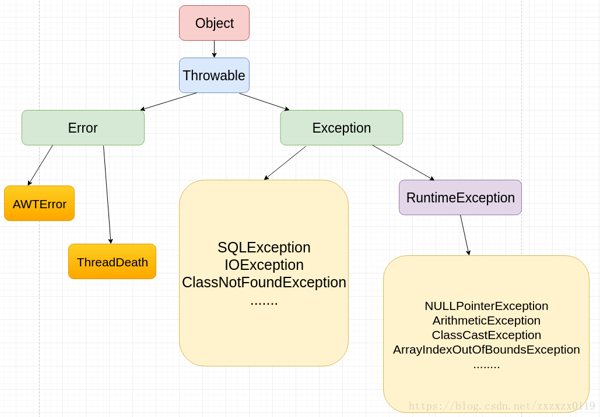
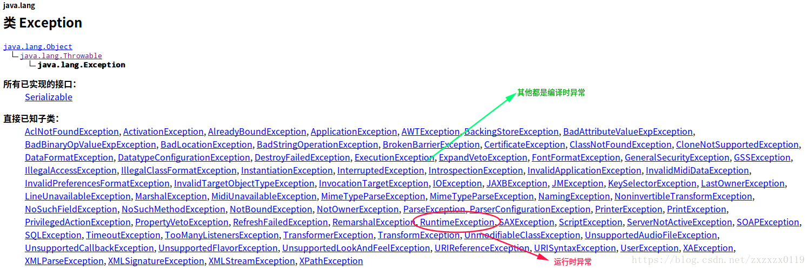

## Java异常小总结
 * [异常的介绍](#异常的介绍)
 * [异常的分类](#异常的分类)
 * [异常的处理](#异常的处理)
 * [`finally`和`throws`使用](#finally和throws使用)
 * [自定义异常](#自定义异常)
***
### <font color = red id = "1">异常的介绍
 在`Java`语言中，将程序执行中发生的不正常情况称为“异常”(开发过程中的语法错误和逻辑错误不是异常)。`Java`程序在执行过程中所发生的异常事件可分为两类(都是属于`Throwable`下的)：
* `Error`:  Java虚拟机无法解决的严重问题。如：JVM系统内部错误、资源耗尽、虚拟机错误(`VirtualMacheError`)及其子类内存溢出错误(`OutOfMemoryError`)和栈溢出错误(`StackOverflowError`)。一般不编写针对性的代码进行处理；
* `Exception`: 其它因编程错误或偶然的外在因素导致的一般性问题，可以使用针对性的代码进行处理。例如：
空指针访问、试图读取不存在的文件、网络连接中断； <font color = red> 异常

一个简单的异常演示: 

```java
public class TestExceptionOne {
    public static void main(String[] args) {
        String str = null;
        str.indexOf("zx"); // NullPointerException
        System.out.println("--------");
    }
}
```
程序会发生`NullPointerException`具体过程如下: 

当执行`str.indexOf("zx")`的时候，`Java`发现`str`的值为`null`，无法继续执行，于是启用<font color = blue>异常处理机制</font>，首先<font color = blue>创建一个异常对象</font>，这里是类`NullPointerException`的对象，然后查找看谁能处理这个异常，在上面的代码中，没有代码能处理这个异常，于是`Java`就启用<font color = red>默认处理机制(异常发生点后的代码都不会执行)，那就是打印异常栈信息到屏幕，并退出程序</font>。异常栈信息包括了从异常发生点到最上层调用者的轨迹、行号等。

再看一个例子: 
```java
import java.util.Scanner;

public class TestExceptionOne {
    public static void main(String[] args) {
        System.out.println("请输入一串数字: ");
        Scanner cin = new Scanner(System.in);
        String str = cin.next();
        int num = Integer.parseInt(str);
        System.out.println(num);
    }
}
```
<font color = green>从这个例子来看，为什么需要处理异常呢?

如果用户输入的不是数字，最后就会抛出`NumberFormatException`异常，对于屏幕输出中的<font color = red>异常栈信息</font>，使用的用户无法理解，也不知道该怎么办，我们需要给用户一个较为友好的信息，告诉用户，他应该输入的是数字，要做到这一点，我们需要自己"捕获"异常。

查看`NumberFormatException`和`Integer`的源码可以发现: 


分析: 
* 就是创建了一个类的对象，只是这个类是一个异常类。`throw`就是抛出异常，会触发`Java`的异常处理机制。之前那个`NullPointerException`可以认为`throw`是由`Java`虚拟机自己实现的。

* `throw`关键字可以与`return`关键字进行对比，`return`代表正常退出，`throw`代表异常退出，`return`的返回位置是确定的，就是上一级调用者，而`throw`后执行哪行代码则是不确定的，由异常处理机制动态确定。

* 异常处理机制会从当前函数开始查找看谁"捕获"了这个异常，<font color = red>当前函数没有就查看上一层，直到主函数，如果主函数也没有，就使用默认机制</font>，即输出<font color = blue>异常栈信息</font>并退出，这正是我们在屏幕输出中看到的。


上面的程序改进加上异常处理 `try - catch`:

```java
import java.util.Scanner;

public class TestExceptionOne {
    public static void main(String[] args) {
        System.out.println("请输入一串数字: ");
        Scanner cin = new Scanner(System.in);
        try {
            String str = cin.next();
            int num = Integer.parseInt(str);
            System.out.println(num);
        }catch (NumberFormatException e){
            System.out.println("输入的不是一串数字..");
        }
    }
}
```
<font color = blue>捕获异常后，程序就不会异常退出了，但`try`语句内异常点之后的其他代码就不会执行了，执行完`catch`内的语句后，<font color =red>程序会继续执行`catch`大括号外的代码。
***
### <font color = red id = "2">异常的分类


**整体的架构图:**




对于这些错误，一般有两种解决方法：
* 一是遇到错误就终止程序的运行；
* 另一种方法是由程序员在编写程序时，就考虑到错误的检测、错误消息的提示，以及错误的处理；

捕获错误最理想的是在<font color = red>编译期间</font>，但有的错误只有在<font color = red>运行时</font>才会发生。比如：除数为`0`，数组下标越界等

关于`Throwable`类：

有四个构造方法: 
```java
public Throwable()
public Throwable(String message)
public Throwable(String message, Throwable cause)
public Throwable(Throwable cause)
```
有两个主要参数，一个是`message`，表示异常消息，另一个是`cause`，表示触发该异常的其他异常。异常可以形成一个异常链，上层的异常由底层异常触发，`cause`表示底层异常。

`Throwable`还有一个`public`方法用于设置`cause`：
```java
Throwable initCause(Throwable cause)
```
`Throwable`的某些子类没有带`cause`参数的构造方法，就可以通过这个方法来设置，这个方法最多只能被调用一次。

所有构造方法中都有一句重要的函数调用：<font color = red>它会将异常栈信息保存下来，这是我们能看到异常栈的关键。</font>
```java
fillInStackTrace();
```

`Throwable`有一些常用方法用于获取异常信息：

```java
void printStackTrace()  // 打印异常栈信息到标准错误输出流，
//它还有两个重载的方法：打印栈信息到指定的流。
void printStackTrace(PrintStream s)  
void printStackTrace(PrintWriter s)
String getMessage()  // 获取设置的异常message和cause
Throwable getCause()
StackTraceElement[] getStackTrace() //获取异常栈每一层的信息，每个StackTraceElement包括文件名、类名、函数名、行号等信息。
```


**分类：编译时异常和运行时异常**

**<font color = green>运行时异常:**
* 是指编译器不要求强制处置的异常。一般是指编程时的逻辑错误，是程序员应该积极避免其出现的异常。`java.lang.RuntimeException`类及它的子类都是运行时异常。
* 对于这类异常，可以不作处理，因为这类异常很普遍，若全处理可能会对程序的可读性和运行效率产生影响。

**<font color = green>编译时异常</font>**
* 是指编译器要求必须处置的异常。即程序在运行时由于外界因素造成的一般性异常。编译器要求java程序必须捕获或声明所有编译时异常。
* 对于这类异常，如果程序不处理，可能会带来意想不到的结果。

**<font color = green>区别</font>**
*  `RuntimeException`(运行时异常)比较特殊，含义是`unchecked exception `(未受检异常)，相对而言，`Exception`的其他子类和`Exception`自身则是`checked exception`(受检异常)，`Error`及其子类也是`unchecked exception`；
* `checked`还是`unchecked`，区别在于Java如何处理这两种异常，对于`checked`异常，Java会强制要求程序员进行处理，否则会有编译错误，而对于`unchecked`异常则没有这个要求；

常见的运行时异常`RuntimeException`: 

***
### <font color = red id = "3">异常的处理以及自定义异常

Java提供的异常处理机制是<font color = red>抓抛模型。
* `Java`程序的执行过程中如出现异常，会生成一个异常类对象，该异常对象将被提交给`Java`运行时系统，这个过程称为抛出(`throw`)异常。

* 异常对象的生成:  
	* 由虚拟机自动生成：程序运行过程中，虚拟机检测到程序发生了问题，如果在当前代码中没有找到相应的处理程序，就会在后台自动创建一个对应异常类的实例对象并抛出 --> <font color = blue>自动抛出</font>；
	* 由程序员手动创建：`Exception exception = new ClassCastException();` -->  创建好的异常对象不抛出对程序没有任何影响，和创建一个普通对象一样；

* 如果一个方法内抛出异常，该异常对象会被抛给调用者方法中处理。如果异常没有在调用者方法中处理，它继续被抛给这个调用方法的上层方法。这个过程将一直继续下去，直到异常被处理。这一过程称为捕获(`catch`)异常。如果一个异常回到`main()`方法，并且`main()`也不处理，则程序运行终止。(<font color = red>就是上面说的异常链</font>)


**异常处理的5个关键字**


<font color= green>**Java提供的"抓抛模型"**</font>
* `"抛"`，当我们执行代码时，一旦出现异常，就会在异常的代码出生成一个对应的异常类型的对象，并将此对象抛出(**自动抛出/手动抛出**)。
	* ① 一旦抛出此异常类的对象，那么程序就终止执行；
	* ② 此异常类的对象抛给方法的调用者；
	* ③ 异常类既可以是现成的异常类，也可以是自己创建的异常类；


* `"抓"`，抓住上一步抛出来的异常类的对象，如何抓? 即为异常的处理方式。

<font color= green>**"抓"的两种处理方式**</font>

* 第一种处理的方式: `try catch`
	* ① 注意`try`内声明的变量，类似于局部变量，出了`try{}`语句，就不能被调用；
	* ② `catch`语句内部是对异常对象的处理 ，例如 `getMessage()`、`printStackTrace()`；
	* ③ 可以有多个`catch`语句，`try`中抛出的异常类对象从上往下去匹配`catch`中的异常类的类型，一旦满足就执行`catch`中的代码，执行完，<font color = blue>就跳出其后的多条`catch`语句</font>；
	* ④ 对于运行时异常，可以不显示的处理。对于编译时异常，必须要显示的进行处理；
	* ⑤ 若`catch`中有多个异常类型是"并列关系"，熟上熟下都可以。<font color = red>若是"包含"关系，必须将子类放在父类的上面，否则报错；</font>
	* ⑥  `finally`中存放的是一定会执行的代码，不管`try`中，`catch`中是否仍有异常未处理，以及是否有`return `语句；
	* ⑦ `try - catch`是可以嵌套的；
	* ⑧ `catch`块内处理完后，<font color=  blue>可以重新抛出异常</font>，异常可以是原来的，也可以是新建的(为什么要重新抛出呢？因为当前代码不能够完全处理该异常，需要调用者进一步处理)；

* 第二种处理的方式: `throws `(在方法的声明处，显示的抛出改异常对象的类型)
	* 当异常在一个方法内部出现的时候，会抛一个异常类的对象，抛给方法的调用者；
	* 异常的对象可以逐层向上抛，直至`main()`中，当然在向上抛的过程中，可以再通过`try-catch`进行处理；

> 注意:  <font color = blue>子类重写父类的方法，其抛出的异常类型只能是**被重写的方法的异常类的子类或和异常类一样；**</font>


<font color = green>**这里补充一下异常使用原则:**

异常应该且仅用于异常情况，也就是说异常不能代替正常的条件判断。比如说，循环处理数组元素的时候，你应该先检查索引是否有效再进行处理，而不是等着抛出索引异常再结束循环。对于一个引用变量，如果正常情况下它的值也可能为`null`，那就应该先检查是不是`null`，不为`null`的情况下再进行调用。
另一方面，真正出现异常的时候，应该抛出异常，而不是返回特殊值，比如`String`的`substring`方法，它返回一个子字符串，代码如下：
```java
public String substring(int beginIndex) {
    if (beginIndex < 0) {
        throw new StringIndexOutOfBoundsException(beginIndex);
    }
    int subLen = value.length - beginIndex;
    if (subLen < 0) {
        throw new StringIndexOutOfBoundsException(subLen);
    }
    return (beginIndex == 0) ? this : new String(value, beginIndex, subLen);
}
```
代码会检查`beginIndex`的有效性，如果无效，会抛出`StringIndexOutOfBoundsException`。纯技术上一种可能的替代方法是不抛异常而返回特殊值`null`，但`beginIndex`无效是异常情况，异常不能假装当正常处理。

***
### <font color = red id = "4">`finally`和`throws`使用

`finally`内的代码不管有无异常发生，都会执行。具体来说：
* 如果没有异常发生，在`try`内的代码执行结束<font color  =red>后</font>执行；
* 如果有异常发生且被`catch`捕获，在`catch`内的代码执行结束<font color  =red>后</font>执行；
* 如果有异常发生但没被捕获，<font color = blue>则在异常被抛给上层<font color = red> 之前</font>执行</font>。

由于`finally`的这个特点，它一般用于**释放资源，如数据库连接、文件流**等。

> 注意: `try/catch/finally`语法中，`catch`不是必需的，也就是可以只有`try/finally`，表示不捕获异常，异常自动向上传递，但`finally`中的代码在异常发生后也执行。


`finally`有一个容易出错的地方，就是配合`return `的使用：

* 如果在try或者catch语句内有return语句，则return语句在finally语句执行结束后才执行，但finally并不能改变返回值；

看下面例子：

```java
public class TestExceptionOne {
    public static void main(String[] args) {
        System.out.println(method()); // 10
    }
    public static int method(){
        int ret = 10;
        try{
            return ret;
        }finally{
            ret = 20;
        }
    }
}
```
程序输出`10`。实际执行过程是，<font color = red>在执行到`try`内的`return ret;`语句前，会先将返回值`ret`保存在一个临时变量中，然后才执行`finally`语句，最后`try`再返回那个临时变量，`finally`中对`ret`的修改不会被返回。</font>

如果在`finally`中也有`return`语句呢？ <font color=  red>`try`和`catch`内的`return`会丢失，实际会返回`finally`中的返回值。`finally`中有`return`不仅会覆盖`try`和`catch`内的返回值，而且还会掩盖`try`和`catch`内的异常，就像异常没有发生一样，例如：

```java
public class TestExceptionOne {
    public static void main(String[] args) {
        System.out.println(method()); // 20
    }
    public static int method(){
        int ret = 10;
        try{
            int a = 5/0; // Exception will not happened
            return ret;
        }finally{
            return 20;
        }
    }
}

```
`5/0`会触发`ArithmeticException`，但是`finally`中有`return`语句，这个方法就会返回`20`，而不再向上传递异常了。

`finally`中不仅`return`语句会掩盖异常，如果`finally`中抛出了异常，则原异常就会被掩盖:

```java
public class TestExceptionOne {
    public static void main(String[] args) {
        method();
    }

    public static void method(){
        try{
            int a = 5/0; // replaced
        }finally{
            throw new RuntimeException("hello");
        }
    }
}

```
`finally`中抛出了`RuntimeException`，则原异常`ArithmeticException`就丢失了。


所以为避免混淆，应该避免在`finally`中使用`return`语句或者抛出异常，如果调用的其他代码可能抛出异常，则应该捕获异常并进行处理。

再看一个`finally`中使用`return`的例子: 

```java
public class ReturnExceptionDemo {

    public static void methodA(){
        try {
            System.out.println("进入方法A!");
            throw new RuntimeException("在方法A中制造异常!");

        }finally {
            System.out.println("执行方法A中的finally!");
        }
    }

    public static int methodB(){
        try {
            System.out.println("进入方法B!");
            return 1;
        } finally {
            System.out.println("执行方法B中的finally!");
            return 2;
        }
    }

    public static void main(String[] args) {
        try {
            methodA();
        } catch (Exception e) {
            System.out.println(e.getMessage());
        }
        System.out.println(methodB());
    }
}

```
输出: 


<font color=green>**throws关键字**


`throws`跟在方法的括号后面，可以声明多个异常，以逗号分隔。
这个声明的含义是说:
* 我这个方法内可能抛出这些异常，我没有进行处理，至少没有处理完，调用者必须进行处理。
* 这个声明没有说明，具体什么情况会抛出什么异常，作为一个良好的实践，应该将这些信息用注释的方式进行说明，这样调用者才能更好的处理异常。


对于`RuntimeException`和`checked exception`区别: 

* 对于`RuntimeException(unchecked exception)`，是不要求使用`throws`进行声明的，但对于`checked exception`，则必须进行声明，换句话说，如果没有声明，则不能抛出。

* 对于`checked exception`，<font color= red>不可以抛出而不声明，但可以声明抛出但实际不抛出，</font>不抛出声明它干嘛？主要用于在父类方法中声明，父类方法内可能没有抛出，但子类重写方法后可能就抛出了，子类不能抛出父类方法中没有声明的`checked exception`，所以就将所有可能抛出的异常都写到父类上了。

如果一个方法内调用了另一个声明抛出`checked exception`的方法，则必须处理这些`checked exception`，不过，处理的方式既可以是`catch`，也可以是继续使用`throws`，如下代码所示：
```java
public void tester() throws AppException {
    try {
        test();
    }  catch (SQLException e) {
        e.printStackTrace();
    }
}
```
对于`test`抛出的`SQLException`，这里使用了`catch`，而对于`AppException`，则将其添加到了自己方法的`throws`语句中，表示当前方法也处理不了，还是由上层处理吧。

***
### <font color  = red  id = "5">自定义异常

除了`Java API`中定义的异常类，也可以自己定义异常类，一般通过继承`Exception`或者它的某个子类，如果父类是`RuntimeException`或它的某个子类，则自定义异常也是`unchecked exception`，如果是`Exception`或`Exception`的其他子类，则自定义异常是`checked exception`。

如何自定义一个异常类: 
* 自定义的异常类继承现有的异常类；
* 提供一个序列化`ID`，提供几个重载的构造器；

```java
/**
 * 自己创建的异常类对象
 */
public class MyException extends Exception{

    //序列化的机制  可以唯一的确定一个异常类的对象
    static final long serialVersionUID = -338751699319948L;

    public MyException() {

    }
    public MyException(String message) {
        super(message);
    }
}
```
再看自定义异常的一个案例:
```java
public class EcmDefDemo {
    public static void main(String[] args) {
        Scanner cin = new Scanner(System.in);
        try {
//            int a = cin.nextInt();
//            int b = cin.nextInt();
            int a = Integer.parseInt(args[0]);
            int b = Integer.parseInt(args[1]);
            ecm(a,b); //<font color = red id = "1">执行除法
        }catch (NumberFormatException e) {
            System.out.println("输入的数据类型不一致....");
        }
        catch (ArrayIndexOutOfBoundsException e) {
            System.out.println("缺少了输入数据.....");
        }
        catch (ArithmeticException e) {
            System.out.println("分母为0了.....");
        }
        catch (DefException e) {
            System.out.println(e.getMessage());
        }
    }

    //判断是否输入负数，如果输入了，就抛出一个异常
    public static void ecm (int a,int b) throws DefException {
        if(a < 0 || b < 0){
            throw new DefException("你输入的数值存在负数.....");
        }
        System.out.println(a / b);
    }
}

class DefException extends Exception{
    static final long serialVersionUID = -33873124229948L;
    public DefException() {
    }
    public DefException(String message) {
        super(message);
    }
}
```
***

