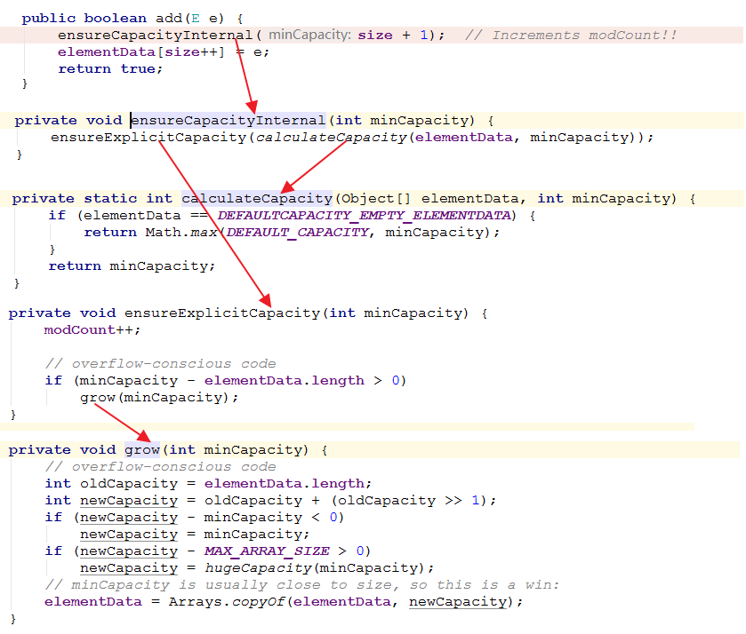
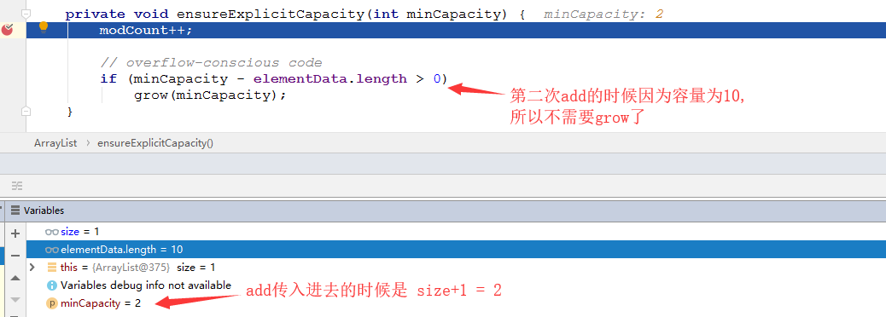

# ArrayList

## 一、源码重点

### 1、容量和扩充

默认初始容量为`10`。

```java
/**
 * Default initial capacity.
 */
private static final int DEFAULT_CAPACITY = 10;

transient Object[] elementData; // non-private to simplify nested class access

/**
* The size of the ArrayList (the number of elements it contains).
* @serial
*/
private int size;
```

扩容，默认是`1.5`倍:

```java
private void grow(int minCapacity) {
    // overflow-conscious code
    int oldCapacity = elementData.length;
    int newCapacity = oldCapacity + (oldCapacity >> 1);// 1.5倍
    if (newCapacity - minCapacity < 0)
        newCapacity = minCapacity;
    if (newCapacity - MAX_ARRAY_SIZE > 0)
        newCapacity = hugeCapacity(minCapacity);
    // minCapacity is usually close to size, so this is a win:
    elementData = Arrays.copyOf(elementData, newCapacity);
}
```

`fast-fail`相关，检查`modCount`和`expectedModCount`是否相等:

```java
final void checkForComodification() {
    if (modCount != expectedModCount)
        throw new ConcurrentModificationException();
}
```

### 2、迭代的陷阱

关于迭代器，有一种常见的误用，就是在迭代的中间调用容器的删除方法，比如要删除一个整数ArrayList中所有小于100的数，直觉上，代码可以这么写：

```java
public void remove(ArrayList<Integer> list){
    for(Integer a : list){
        if(a <= 100){
            list.remove(a);
        }
    }
}
```

运行时会抛出`java.util.ConcurrentModificationException`。

发生了并发修改异常，为什么呢？迭代器内部会维护一些索引位置相关的数据，**要求在迭代过程中，容器不能发生结构性变化**，否则这些索引位置就失效了。所谓结构性变化就是添加、插入和删除元素，只是修改元素内容不算结构性变化。

**每次发生结构性变化的时候modCount都会增加，而每次迭代器操作的时候都会检查expectedModCount是否与modCount相同，这样就能检测出结构性变化**。

如何避免异常呢？可以使用迭代器的remove方法，如下所示：

```java
public static void remove(ArrayList<Integer> list){
    Iterator<Integer> it = list.iterator();
    while(it.hasNext()){
        if(it.next()<=100){
            it.remove();
        }
    }
}
```

迭代器如何知道发生了结构性变化，并抛出异常？它自己的remove方法为何又可以使用呢？我们需要看下迭代器的工作原理。

不过，需要注意的是，**调用`remove()`方法前必须先调**用`next()`，比如，通过迭代器删除所有元素，直觉上，可以这么写：

```java
public static void removeAll(ArrayList<Integer> list){
    Iterator<Integer> it = list.iterator();
    while(it.hasNext()){
        it.remove();    
    }
}
```

运行会抛出:` java.lang.IllegalStateException`。

内部的Itr类:

```java
private class Itr implements Iterator<E> {
    int cursor;       // cursor表示下一个要返回的元素位置
    int lastRet = -1; // lastRet表示最后一个返回的索引位置
    int expectedModCount = modCount;

    Itr() {}

    public boolean hasNext() {
        return cursor != size;
    }

    @SuppressWarnings("unchecked")
    public E next() {
        checkForComodification();
        int i = cursor;
        if (i >= size)
            throw new NoSuchElementException();
        Object[] elementData = ArrayList.this.elementData;
        if (i >= elementData.length)
            throw new ConcurrentModificationException();
        cursor = i + 1;
        return (E) elementData[lastRet = i];
    }

    public void remove() {
        if (lastRet < 0)
            throw new IllegalStateException();
        checkForComodification();

        try {
            ArrayList.this.remove(lastRet);
            cursor = lastRet;
            lastRet = -1;
            expectedModCount = modCount;
        } catch (IndexOutOfBoundsException ex) {
            throw new ConcurrentModificationException();
        }
    }

    final void checkForComodification() {
        if (modCount != expectedModCount)
            throw new ConcurrentModificationException();
    }
}
```


### 3、关于`Arrays.asList()`

```java
Integer[] a = {1,2,3};
List<Integer> list = Arrays.asList(a);
```

需要注意的是，这个方法返回的List，**它的实现类并不是ArrayList，而是Arrays类的一个内部类**，在这个内部类的实现中，内部用的的数组就是传入的数组，没有拷贝，也不会动态改变大小，所以对数组的修改也会反映到List中，**对List调用add/remove方法会抛出异常**。

要使用ArrayList完整的方法，应该新建一个ArrayList，如下所示：

```java
List<Integer> list = new ArrayList<Integer>(Arrays.asList(a));
```

### 4、扩容的机制




实战:

如下的代码，在**第一次调用add**的时候下面的参数分别如下:


参数：


到第二次调用的时候呢? (`list.add(2)`)，我们来看一下里面的内容:



下一次`grow`就是在添加第11个元素的时候。

## 四、附详细源码注释

转载: https://www.cnblogs.com/gxl1995/p/7534171344218b3784f1beb90d621337.html

```java
import java.util.*;
import java.util.function.Consumer;
import java.util.function.Predicate;
import java.util.function.UnaryOperator;

public class ArrayList<E> extends AbstractList<E> implements List<E>, RandomAccess, Cloneable, java.io.Serializable {
    /**
     * 序列号
     */
    private static final long serialVersionUID = 8683452581122892189L;

    /**
     * 默认容量
     */
    private static final int DEFAULT_CAPACITY = 10;

    /**
     * 一个空数组
     * 当用户指定该 ArrayList 容量为 0 时，返回该空数组
     */
    private static final Object[] EMPTY_ELEMENTDATA = {};

    /**
     * 一个空数组实例
     * - 当用户没有指定 ArrayList 的容量时(即调用无参构造函数)，返回的是该数组==>刚创建一个 ArrayList 时，其内数据量为 0。
     * - 当用户第一次添加元素时，该数组将会扩容，变成默认容量为 10(DEFAULT_CAPACITY) 的一个数组===>通过  ensureCapacityInternal() 实现
     * 它与 EMPTY_ELEMENTDATA 的区别就是：该数组是默认返回的，而后者是在用户指定容量为 0 时返回
     */
    private static final Object[] DEFAULTCAPACITY_EMPTY_ELEMENTDATA = {};

    /**
     * ArrayList基于数组实现，用该数组保存数据, ArrayList 的容量就是该数组的长度
     * - 该值为 DEFAULTCAPACITY_EMPTY_ELEMENTDATA 时，当第一次添加元素进入 ArrayList 中时，数组将扩容值 DEFAULT_CAPACITY(10)
     */
    transient Object[] elementData; // non-private to simplify nested class access

    /**
     * ArrayList实际存储的数据数量
     */
    private int size;

    /**
     * 创建一个初试容量的、空的ArrayList
     * @param  initialCapacity  初始容量
     * @throws IllegalArgumentException 当初试容量值非法(小于0)时抛出
     */
    public ArrayList(int initialCapacity) {
        if (initialCapacity > 0) {
            this.elementData = new Object[initialCapacity];
        } else if (initialCapacity == 0) {
            this.elementData = EMPTY_ELEMENTDATA;
        } else {
            throw new IllegalArgumentException("Illegal Capacity: "+
                    initialCapacity);
        }
    }

    /**
     * 无参构造函数：
     * - 创建一个 空的 ArrayList，此时其内数组缓冲区 elementData = {}, 长度为 0
     * - 当元素第一次被加入时，扩容至默认容量 10
     */
    public ArrayList() {
        this.elementData = DEFAULTCAPACITY_EMPTY_ELEMENTDATA;
    }

    /**
     * 创建一个包含collection的ArrayList
     * @param c 要放入 ArrayList 中的集合，其内元素将会全部添加到新建的 ArrayList 实例中
     * @throws NullPointerException 当参数 c 为 null 时抛出异常
     */
    public ArrayList(Collection<? extends E> c) {
        //将集合转化成Object[]数组
        elementData = c.toArray();
        //把转化后的Object[]数组长度赋值给当前ArrayList的size，并判断是否为0
        if ((size = elementData.length) != 0) {
            // c.toArray might (incorrectly) not return Object[] (see 6260652)
            // 这句话意思是：c.toArray 可能不会返回 Object[]，可以查看 java 官方编号为 6260652 的 bug
            if (elementData.getClass() != Object[].class)
                // 若 c.toArray() 返回的数组类型不是 Object[]，则利用 Arrays.copyOf(); 来构造一个大小为 size 的 Object[] 数组
                elementData = Arrays.copyOf(elementData, size, Object[].class);
        } else {
            // 替换空数组
            this.elementData = EMPTY_ELEMENTDATA;
        }
    }

    /**
     * 将数组缓冲区大小调整到实际 ArrayList 存储元素的大小，即 elementData = Arrays.copyOf(elementData, size);
     * - 该方法由用户手动调用，以减少空间资源浪费的目的 ce.
     */
    public void trimToSize() {
        // modCount 是 AbstractList 的属性值：protected transient int modCount = 0;
        // [问] modCount 有什么用？
        modCount++;
        // 当实际大小 < 数组缓冲区大小时
        // 如调用默认构造函数后，刚添加一个元素，此时 elementData.length = 10，而 size = 1
        // 通过这一步，可以使得空间得到有效利用，而不会出现资源浪费的情况
        if (size < elementData.length) {
            // 注意这里：这里的执行顺序不是 (elementData = (size == 0) ) ? EMPTY_ELEMENTDATA : Arrays.copyOf(elementData, size);
            // 而是：elementData = ((size == 0) ? EMPTY_ELEMENTDATA : Arrays.copyOf(elementData, size));
            // 这里是运算符优先级的语法
            // 调整数组缓冲区 elementData，变为实际存储大小 Arrays.copyOf(elementData, size)
            //先判断size是否为0，如果为0:实际存储为EMPTY_ELEMENTDATA,如果有数据就是Arrays.copyOf(elementData, size)
            elementData = (size == 0)
                    ? EMPTY_ELEMENTDATA
                    : Arrays.copyOf(elementData, size);
        }
    }

    /**
     * 指定 ArrayList 的容量
     * @param   minCapacity   指定的最小容量
     */
    public void ensureCapacity(int minCapacity) {
        // 最小扩充容量，默认是 10
        // 这句就是：判断是不是空的ArrayList,如果是的最小扩充容量10，否则最小扩充量为0
        //上面无参构造函数创建后，当元素第一次被加入时，扩容至默认容量 10,就是靠这句代码
        int minExpand = (elementData != DEFAULTCAPACITY_EMPTY_ELEMENTDATA)
                ? 0
                : DEFAULT_CAPACITY;
        // 若用户指定的最小容量 > 最小扩充容量，则以用户指定的为准，否则还是 10
        if (minCapacity > minExpand) {
            ensureExplicitCapacity(minCapacity);
        }
    }
    /**
     * 私有方法：明确 ArrayList 的容量，提供给本类使用的方法
     * - 用于内部优化，保证空间资源不被浪费：尤其在 add() 方法添加时起效
     * @param minCapacity    指定的最小容量
     */
    private void ensureCapacityInternal(int minCapacity) {
        // 若 elementData == {}，则取 minCapacity 为 默认容量和参数 minCapacity 之间的最大值
        // 注：ensureCapacity() 是提供给用户使用的方法，在 ArrayList 的实现中并没有使用
        if (elementData == DEFAULTCAPACITY_EMPTY_ELEMENTDATA) {
            minCapacity= Math.max(DEFAULT_CAPACITY, minCapacity);
        }
        ensureExplicitCapacity(minCapacity);
    }
    /**
     * 私有方法：明确 ArrayList 的容量
     * - 用于内部优化，保证空间资源不被浪费：尤其在 add() 方法添加时起效
     * @param minCapacity    指定的最小容量
     */
    private void ensureExplicitCapacity(int minCapacity) {
        // 将“修改统计数”+1，该变量主要是用来实现fail-fast机制的
        modCount++;
        // 防止溢出代码：确保指定的最小容量 > 数组缓冲区当前的长度
        // overflow-conscious code
        if (minCapacity - elementData.length > 0)
            grow(minCapacity);
    }

    /**
     * 数组缓冲区最大存储容量
     * - 一些 VM 会在一个数组中存储某些数据--->为什么要减去 8 的原因
     * - 尝试分配这个最大存储容量，可能会导致 OutOfMemoryError(当该值 > VM 的限制时)
     */
    private static final int MAX_ARRAY_SIZE = Integer.MAX_VALUE - 8;

    /**
     * 私有方法：扩容，以确保 ArrayList 至少能存储 minCapacity 个元素
     * - 扩容计算：newCapacity = oldCapacity + (oldCapacity >> 1);  扩充当前容量的1.5倍
     * @param minCapacity    指定的最小容量
     */
    private void grow(int minCapacity) {
        // 防止溢出代码
        int oldCapacity = elementData.length;
        // 运算符 >> 是带符号右移. 如 oldCapacity = 10,则 newCapacity = 10 + (10 >> 1) = 10 + 5 = 15
        int newCapacity = oldCapacity + (oldCapacity >> 1);
        if (newCapacity - minCapacity < 0)  // 若 newCapacity 依旧小于 minCapacity
            newCapacity = minCapacity;
        if (newCapacity - MAX_ARRAY_SIZE > 0)   // 若 newCapacity 大于最大存储容量，则进行大容量分配
            newCapacity = hugeCapacity(minCapacity);
        // minCapacity is usually close to size, so this is a win:
        elementData = Arrays.copyOf(elementData, newCapacity);
    }
    /**
     * 私有方法：大容量分配，最大分配 Integer.MAX_VALUE
     * @param minCapacity
     */
    private static int hugeCapacity(int minCapacity) {
        if (minCapacity < 0) // overflow
            throw new OutOfMemoryError();
        return (minCapacity > MAX_ARRAY_SIZE) ?
                Integer.MAX_VALUE :
                MAX_ARRAY_SIZE;
    }

    /**
     * 返回ArrayList实际存储的元素数量
     */
    public int size() {
        return size;
    }

    /**
     * ArrayList是否有元素
     */
    public boolean isEmpty() {
        return size == 0;
    }

    /**
     * 是否包含o元素
     */
    public boolean contains(Object o) {
        // 根据 indexOf() 的值(索引值)来判断，大于等于 0 就包含
        // 注意：等于 0 的情况不能漏，因为索引号是从 0 开始计数的
        return indexOf(o) >= 0;
    }

    /**
     * 顺序查找，返回元素的最低索引值(最首先出现的索引位置)
     * @return 存在？最低索引值：-1
     */
    public int indexOf(Object o) {
        if (o == null) {
            for (int i = 0; i < size; i++)
                if (elementData[i]==null)
                    return i;
        } else {
            for (int i = 0; i < size; i++)
                if (o.equals(elementData[i]))
                    return i;
        }
        return -1;
    }

    /**
     * 逆序查找，返回元素的最低索引值(最首先出现的索引位置)
     * @return 存在？最低索引值：-1
     */
    public int lastIndexOf(Object o) {
        if (o == null) {
            for (int i = size-1; i >= 0; i--)
                if (elementData[i]==null)
                    return i;
        } else {
            for (int i = size-1; i >= 0; i--)
                if (o.equals(elementData[i]))
                    return i;
        }
        return -1;
    }

    /**
     * 实现的有Cloneable接口，深度复制：对拷贝出来的 ArrayList 对象的操作，不会影响原来的 ArrayList
     * @return 一个克隆的 ArrayList 实例(深度复制的结果)
     */
    public Object clone() {
        try {
            // Object 的克隆方法：会复制本对象及其内所有基本类型成员和 String 类型成员，但不会复制对象成员、引用对象
            ArrayList<?> v = (ArrayList<?>) super.clone();
            // 对需要进行复制的引用变量，进行独立的拷贝：将存储的元素移入新的 ArrayList 中
            v.elementData = Arrays.copyOf(elementData, size);
            v.modCount = 0;
            return v;
        } catch (CloneNotSupportedException e) {
            // this shouldn't happen, since we are Cloneable
            throw new InternalError(e);
        }
    }

    /**
     * 返回 ArrayList 的 Object 数组
     * - 包含 ArrayList 的所有储存元素
     * - 对返回的该数组进行操作，不会影响该 ArrayList（相当于分配了一个新的数组）==>该操作是安全的
     * - 元素存储顺序与 ArrayList 中的一致
     */
    public Object[] toArray() {
        return Arrays.copyOf(elementData, size);
    }

    /**
     * 返回 ArrayList 元素组成的数组
     * @param a 需要存储 list 中元素的数组
     * 若 a.length >= list.size，则将 list 中的元素按顺序存入 a 中，然后 a[list.size] = null, a[list.size + 1] 及其后的元素依旧是 a 的元素
     * 否则，将返回包含list 所有元素且数组长度等于 list 中元素个数的数组
     * 注意：若 a 中本来存储有元素，则 a 会被 list 的元素覆盖，且 a[list.size] = null
     * @return
     * @throws ArrayStoreException 当 a.getClass() != list 中存储元素的类型时
     * @throws NullPointerException 当 a 为 null 时
     */
    @SuppressWarnings("unchecked")
    public <T> T[] toArray(T[] a) {
        // 若数组a的大小 < ArrayList的元素个数,则新建一个T[]数组，
        // 数组大小是"ArrayList的元素个数",并将“ArrayList”全部拷贝到新数组中
        if (a.length < size)
            // Make a new array of a's runtime type, but my contents:
            return (T[]) Arrays.copyOf(elementData, size, a.getClass());
        // 若数组a的大小 >= ArrayList的元素个数,则将ArrayList的全部元素都拷贝到数组a中。
        System.arraycopy(elementData, 0, a, 0, size);
        if (a.length > size)
            a[size] = null;
        return a;
    }
    /**
     * 获取指定位置上的元素，从0开始
     */
    public E get(int index) {
        rangeCheck(index);//检查是否越界
        return elementData(index);
    }
    /**
     * 检查数组是否在界线内
     */
    private void rangeCheck(int index) {
        if (index >= size)
            throw new IndexOutOfBoundsException(outOfBoundsMsg(index));
    }
    /**
     * 返回在索引为 index 的元素：数组的随机访问
     * - 默认包访问权限
     *
     * 封装粒度很强，连数组随机取值都封装为一个方法。
     * 主要是避免每次取值都要强转===>设置值就没有封装成一个方法，因为设置值不需要强转
     * @param index
     * @return
     */
    @SuppressWarnings("unchecked")
    E elementData(int index) {
        return (E) elementData[index];
    }


    /**
     * 设置 index 位置元素的值
     * @param index 索引值
     * @param element 需要存储在 index 位置的元素值
     * @return 替换前在 index 位置的元素值
     * @throws IndexOutOfBoundsException {@inheritDoc}
     */
    public E set(int index, E element) {
        rangeCheck(index);//越界检查

        E oldValue = elementData(index);//获取旧数值
        elementData[index] = element;
        return oldValue;
    }

    /**
     *增加指定的元素到ArrayList的最后位置
     * @param e 要添加的元素
     * @return
     */
    public boolean add(E e) {
        // 确定ArrayList的容量大小---严谨
        // 注意：size + 1，保证资源空间不被浪费，
        // ☆☆☆按当前情况，保证要存多少个元素，就只分配多少空间资源
        ensureCapacityInternal(size + 1);  // Increments modCount!!
        elementData[size++] = e;
        return true;
    }

    /**
     *
     *在这个ArrayList中的指定位置插入指定的元素，
     *  - 在指定位置插入新元素，原先在 index 位置的值往后移动一位
     * @param index 指定位置
     * @param element 指定元素
     * @throws IndexOutOfBoundsException
     */
    public void add(int index, E element) {
        rangeCheckForAdd(index);//判断角标是否越界
        //看上面的，size+1，保证资源空间不浪费，按当前情况，保证要存多少元素，就只分配多少空间资源
        ensureCapacityInternal(size + 1);  // Increments modCount!!
        //第一个是要复制的数组，第二个是从要复制的数组的第几个开始，
        // 第三个是复制到那，四个是复制到的数组第几个开始，最后一个是复制长度
        System.arraycopy(elementData, index, elementData, index + 1,
                size - index);
        elementData[index] = element;
        size++;
    }

    /**
     * 移除指定位置的元素
     * index 之后的所有元素依次左移一位
     * @param index 指定位置
     * @return 被移除的元素
     * @throws IndexOutOfBoundsException
     */
    public E remove(int index) {
        rangeCheck(index);

        modCount++;
        E oldValue = elementData(index);

        int numMoved = size - index - 1;//要移动的长度
        if (numMoved > 0)
            System.arraycopy(elementData, index+1, elementData, index,
                    numMoved);
        // 将最后一个元素置空
        elementData[--size] = null;

        return oldValue;
    }

    /**
     * 移除list中指定的第一个元素(符合条件索引最低的)
     * 如果list中不包含这个元素，这个list不会改变
     * 如果包含这个元素，index 之后的所有元素依次左移一位
     * @param o 这个list中要被移除的元素
     * @return
     */
    public boolean remove(Object o) {
        if (o == null) {
            for (int index = 0; index < size; index++)
                if (elementData[index] == null) {
                    fastRemove(index);
                    return true;
                }
        } else {
            for (int index = 0; index < size; index++)
                if (o.equals(elementData[index])) {
                    fastRemove(index);
                    return true;
                }
        }
        return false;
    }

    /**
     * 快速删除第 index 个元素
     * 和public E remove(int index)相比
     * 私有方法，跳过检查，不返回被删除的值
     * @param index 要删除的脚标
     */
    private void fastRemove(int index) {
        modCount++;//这个地方改变了modCount的值了
        int numMoved = size - index - 1;//移动的个数
        if (numMoved > 0)
            System.arraycopy(elementData, index+1, elementData, index,
                    numMoved);
        elementData[--size] = null; //将最后一个元素清除
    }

    /**
     * 移除list中的所有元素，这个list表将在调用之后置空
     * - 它会将数组缓冲区所以元素置为 null
     * - 清空后，我们直接打印 list，却只会看见一个 [], 而不是 [null, null, ….] ==> toString() 和 迭代器进行了处理
     */
    public void clear() {
        modCount++;

        // clear to let GC do its work
        for (int i = 0; i < size; i++)
            elementData[i] = null;

        size = 0;
    }

    /**
     * 将一个集合的所有元素顺序添加（追加）到 lits 末尾
     * - ArrayList 是线程不安全的。
     * - 该方法没有加锁，当一个线程正在将 c 中的元素加入 list 中，但同时有另一个线程在更改 c 中的元素，可能会有问题
     * @param c  要追加的集合
     * @return <tt>true</tt> ？ list 元素个数有改变时，成功：失败
     * @throws NullPointerException 当 c 为 null 时
     */
    public boolean addAll(Collection<? extends E> c) {
        Object[] a = c.toArray();
        int numNew = a.length;//要添加元素的个数
        ensureCapacityInternal(size + numNew);  //扩容
        System.arraycopy(a, 0, elementData, size, numNew);
        size += numNew;
        return numNew != 0;
    }

    /**
     * 从 List 中指定位置开始插入指定集合的所有元素,
     * -list中原来位置的元素向后移
     * - 并不会覆盖掉在 index 位置原有的值
     * - 类似于 insert 操作，在 index 处插入 c.length 个元素（原来在此处的 n 个元素依次右移）
     * @param index 插入指定集合的索引
     * @param c 要添加的集合
     * @return ？ list 元素个数有改变时，成功：失败
     * @throws IndexOutOfBoundsException {@inheritDoc}
     * @throws NullPointerException if the specified collection is null
     */
    public boolean addAll(int index, Collection<? extends E> c) {
        rangeCheckForAdd(index);

        Object[] a = c.toArray();//是将list直接转为Object[] 数组
        int numNew = a.length;  //要添加集合的元素数量
        ensureCapacityInternal(size + numNew);  // 扩容

        int numMoved = size - index;//list中要移动的数量
        if (numMoved > 0)
            System.arraycopy(elementData, index, elementData, index + numNew,
                    numMoved);

        System.arraycopy(a, 0, elementData, index, numNew);
        size += numNew;
        return numNew != 0;
    }

    /**
     * 移除list中 [fromIndex,toIndex) 的元素
     * - 从toIndex之后(包括toIndex)的元素向前移动(toIndex-fromIndex)个元素
     * -如果(toIndex==fromIndex)这个操作没有影响
     * @throws IndexOutOfBoundsException if {@code fromIndex} or
     *         {@code toIndex} is out of range
     *         ({@code fromIndex < 0 ||
     *          fromIndex >= size() ||
     *          toIndex > size() ||
     *          toIndex < fromIndex})
     */
    protected void removeRange(int fromIndex, int toIndex) {
        modCount++;
        int numMoved = size - toIndex;//要移动的数量
        System.arraycopy(elementData, toIndex, elementData, fromIndex,
                numMoved);

        // 删除后，list 的长度
        int newSize = size - (toIndex-fromIndex);
        //将失效元素置空
        for (int i = newSize; i < size; i++) {
            elementData[i] = null;
        }
        size = newSize;
    }


    /**
     * 添加时检查索引是否越界
     */
    private void rangeCheckForAdd(int index) {
        if (index > size || index < 0)
            throw new IndexOutOfBoundsException(outOfBoundsMsg(index));
    }

    /**
     * 构建IndexOutOfBoundsException详细消息
     */
    private String outOfBoundsMsg(int index) {
        return "Index: "+index+", Size: "+size;
    }

    /**
     * 移除list中指定集合包含的所有元素
     * @param c 要从list中移除的指定集合
     * @return {@code true} if this list changed as a result of the call
     * @throws ClassCastException 如果list中的一个元素的类和指定集合不兼容
     * (<a href="Collection.html#optional-restrictions">optional</a>)
     * @throws NullPointerException  如果list中包含一个空元素，而指定集合中不允许有空元素
     */
    public boolean removeAll(Collection<?> c) {
        Objects.requireNonNull(c);//判断集合是否为空，如果为空报NullPointerException
        //批量移除c集合的元素，第二个参数：是否采补集
        return batchRemove(c, false);
    }

    /**
     * Retains only the elements in this list that are contained in the
     * specified collection.  In other words, removes from this list all
     * of its elements that are not contained in the specified collection.
     *
     * @param c collection containing elements to be retained in this list
     * @return {@code true} if this list changed as a result of the call
     * @throws ClassCastException if the class of an element of this list
     *         is incompatible with the specified collection
     * (<a href="Collection.html#optional-restrictions">optional</a>)
     * @throws NullPointerException if this list contains a null element and the
     *         specified collection does not permit null elements
     * (<a href="Collection.html#optional-restrictions">optional</a>),
     *         or if the specified collection is null
     * @see Collection#contains(Object)
     */
    public boolean retainAll(Collection<?> c) {
        Objects.requireNonNull(c);
        return batchRemove(c, true);
    }

    /**
     * 批处理移除
     * @param c 要移除的集合
     * @param complement 是否是补集
     *                   如果true：移除list中除了c集合中的所有元素
     *                   如果false：移除list中 c集合中的元素
     */
    private boolean batchRemove(Collection<?> c, boolean complement) {
        final Object[] elementData = this.elementData;
        int r = 0, w = 0;
        boolean modified = false;
        try {
            //遍历数组，并检查这个集合是否对应值，移动要保留的值到数组前面，w最后值为要保留的值得数量
            //如果保留：将相同元素移动到前段，如果不保留：将不同的元素移动到前段
            for (; r < size; r++)
                if (c.contains(elementData[r]) == complement)
                    elementData[w++] = elementData[r];
        } finally {
            //最后 r=size 注意for循环中最后的r++
            //     w=保留元素的大小
            // Preserve behavioral compatibility with AbstractCollection,
            // even if c.contains() throws.
            //r!=size表示可能出错了，
            if (r != size) {
                System.arraycopy(elementData, r,
                        elementData, w,
                        size - r);
                w += size - r;
            }
            //如果w==size：表示全部元素都保留了，所以也就没有删除操作发生，所以会返回false；反之，返回true，并更改数组
            //而 w!=size;即使try抛出异常，也能正常处理异常抛出前的操作，因为w始终要为保留的前半部分，数组也不会因此乱序
            if (w != size) {
                // clear to let GC do its work
                for (int i = w; i < size; i++)
                    elementData[i] = null;
                modCount += size - w;
                size = w;
                modified = true;
            }
        }
        return modified;
    }

    /**
     *  私有方法
     *  将ArrayList实例序列化
     */
    private void writeObject(java.io.ObjectOutputStream s)
            throws java.io.IOException{
        // 写入所有元素数量的任何隐藏的东西
        int expectedModCount = modCount;
        s.defaultWriteObject();

        //写入clone行为的容量大小
        s.writeInt(size);

        //以合适的顺序写入所有的元素
        for (int i=0; i<size; i++) {
            s.writeObject(elementData[i]);
        }

        if (modCount != expectedModCount) {
            throw new ConcurrentModificationException();
        }
    }

    /**
     * 私有方法
     * 从反序列化中重构ArrayList实例
     */
    private void readObject(java.io.ObjectInputStream s)
            throws java.io.IOException, ClassNotFoundException {
        elementData = EMPTY_ELEMENTDATA;

        //读出大小和隐藏的东西
        s.defaultReadObject();

        // 从输入流中读取ArrayList的size
        s.readInt(); // ignored

        if (size > 0) {
            ensureCapacityInternal(size);

            Object[] a = elementData;
            // 从输入流中将“所有的元素值”读出
            for (int i=0; i<size; i++) {
                a[i] = s.readObject();
            }
        }
    }

    /**
     * 返回从指定索引开始到结束的带有元素的list迭代器
     */
    public ListIterator<E> listIterator(int index) {
        if (index < 0 || index > size)
            throw new IndexOutOfBoundsException("Index: "+index);
        return new ListItr(index);
    }

    /**
     * 返回从0索引开始到结束的带有元素的list迭代器
     */
    public ListIterator<E> listIterator() {
        return new ListItr(0);
    }

    /**
     * 以一种合适的排序返回一个iterator到元素的结尾
     */
    public Iterator<E> iterator() {
        return new Itr();
    }

    /**
     * Itr是AbstractList.Itr的优化版本
     * 为什么会报ConcurrentModificationException异常?
     * 1. Iterator 是工作在一个独立的线程中，并且拥有一个 mutex 锁。
     * 2. Iterator 被创建之后会建立一个指向原来对象的单链索引表，当原来的对象数量发生变化时，
     * 这个索引表的内容不会同步改变，所以当索引指针往后移动的时候就找不到要迭代的对象，
     * 3. 所以按照 fail-fast 原则 Iterator 会马上抛出 java.util.ConcurrentModificationException 异常。
     * 4. 所以 Iterator 在工作的时候是不允许被迭代的对象被改变的。
     * 但你可以使用 Iterator 本身的方法 remove() 来删除对象，
     * 5. Iterator.remove() 方法会在删除当前迭代对象的同时维护索引的一致性。
     */
    private class Itr implements Iterator<E> {
        int cursor;       // 下一个元素返回的索引
        int lastRet = -1; // 最后一个元素返回的索引  -1 if no such
        int expectedModCount = modCount;

        /**
         * 是否有下一个元素
         */
        public boolean hasNext() {
            return cursor != size;
        }

        /**
         * 返回list中的值
         */
        @SuppressWarnings("unchecked")
        public E next() {
            checkForComodification();
            int i = cursor;//i当前元素的索引
            if (i >= size)//第一次检查：角标是否越界越界
                throw new NoSuchElementException();
            Object[] elementData = ArrayList.this.elementData;
            if (i >= elementData.length)//第二次检查,list集合中数量是否发生变化
                throw new ConcurrentModificationException();
            cursor = i + 1; //cursor 下一个元素的索引
            return (E) elementData[lastRet = i];//最后一个元素返回的索引
        }

        /**
         * 移除集合中的元素
         */
        public void remove() {
            if (lastRet < 0)
                throw new IllegalStateException();
            checkForComodification();

            try {
                //移除list中的元素
                ArrayList.this.remove(lastRet);
                //由于cursor比lastRet大1，所有这行代码是指指针往回移动一位
                cursor = lastRet;
                //将最后一个元素返回的索引重置为-1
                lastRet = -1;
                //重新设置了expectedModCount的值，避免了ConcurrentModificationException的产生
                expectedModCount = modCount;
            } catch (IndexOutOfBoundsException ex) {
                throw new ConcurrentModificationException();
            }
        }

        /**
         * jdk 1.8中使用的方法
         * 将list中的所有元素都给了consumer，可以使用这个方法来取出元素
         */
        @Override
        @SuppressWarnings("unchecked")
        public void forEachRemaining(Consumer<? super E> consumer) {
            Objects.requireNonNull(consumer);
            final int size = ArrayList.this.size;
            int i = cursor;
            if (i >= size) {
                return;
            }
            final Object[] elementData = ArrayList.this.elementData;
            if (i >= elementData.length) {
                throw new ConcurrentModificationException();
            }
            while (i != size && modCount == expectedModCount) {
                consumer.accept((E) elementData[i++]);
            }
            // update once at end of iteration to reduce heap write traffic
            cursor = i;
            lastRet = i - 1;
            checkForComodification();
        }

        /**
         * 检查modCount是否等于expectedModCount
         * 在 迭代时list集合的元素数量发生变化时会造成这两个值不相等
         */
        final void checkForComodification() {
            //当expectedModCount和modCount不相等时，就抛出ConcurrentModificationException
            if (modCount != expectedModCount)
                throw new ConcurrentModificationException();
        }
    }
    /*------------------------------------- Itr 结束 -------------------------------------------*/
    /**
     * AbstractList.ListItr 的优化版本
     * ListIterator 与普通的 Iterator 的区别：
     * - 它可以进行双向移动，而普通的迭代器只能单向移动
     * - 它可以添加元素(有 add() 方法)，而后者不行
     */
    private class ListItr extends Itr implements ListIterator<E> {
        ListItr(int index) {
            super();
            cursor = index;
        }

        /**
         * 是否有前一个元素
         */
        public boolean hasPrevious() {
            return cursor != 0;
        }

        /**
         * 获取下一个元素的索引
         */
        public int nextIndex() {
            return cursor;
        }

        /**
         * 获取 cursor 前一个元素的索引
         * - 是 cursor 前一个，而不是当前元素前一个的索引。
         * - 若调用 next() 后马上调用该方法，则返回的是当前元素的索引。
         * - 若调用 next() 后想获取当前元素前一个元素的索引，需要连续调用两次该方法。
         */
        public int previousIndex() {
            return cursor - 1;
        }

        /**
         * 返回 cursor 前一元素
         */
        @SuppressWarnings("unchecked")
        public E previous() {
            checkForComodification();
            int i = cursor - 1;
            if (i < 0)//第一次检查：索引是否越界
                throw new NoSuchElementException();
            Object[] elementData = ArrayList.this.elementData;
            if (i >= elementData.length)//第二次检查
                throw new ConcurrentModificationException();
            cursor = i;//cursor回移
            return (E) elementData[lastRet = i];//返回 cursor 前一元素
        }

        /**
         * 将数组的最后一个元素,设置成元素e
         */
        public void set(E e) {
            if (lastRet < 0)
                throw new IllegalStateException();
            checkForComodification();

            try {
                //将数组最后一个元素，设置成元素e
                ArrayList.this.set(lastRet, e);
            } catch (IndexOutOfBoundsException ex) {
                throw new ConcurrentModificationException();
            }
        }

        /**
         * 添加元素
         */
        public void add(E e) {
            checkForComodification();

            try {
                int i = cursor;//当前元素的索引后移一位
                ArrayList.this.add(i, e);//在i位置上添加元素e
                cursor = i + 1;//cursor后移一位
                lastRet = -1;
                expectedModCount = modCount;
            } catch (IndexOutOfBoundsException ex) {
                throw new ConcurrentModificationException();
            }
        }
    }
    /*------------------------------------- ListItr 结束 -------------------------------------------*/
    /**
     * 获取从 fromIndex 到 toIndex 之间的子集合(左闭右开区间)
     * - 若 fromIndex == toIndex，则返回的空集合
     * - 对该子集合的操作，会影响原有集合
     * - 当调用了 subList() 后，若对原有集合进行删除操作(删除subList 中的首个元素)时，会抛出异常 java.util.ConcurrentModificationException
     *  这个和Itr的原因差不多由于modCount发生了改变，对集合的操作需要用子集合提供的方法
     * - 该子集合支持所有的集合操作
     *
     * 原因看 SubList 内部类的构造函数就可以知道
     * @throws IndexOutOfBoundsException {@inheritDoc}
     * @throws IllegalArgumentException {@inheritDoc}
     */
    public List<E> subList(int fromIndex, int toIndex) {
        subListRangeCheck(fromIndex, toIndex, size);
        return new SubList(this, 0, fromIndex, toIndex);
    }

    /**
     * 检查传入索引的合法性
     * 注意[fromIndex,toIndex)
     */
    static void subListRangeCheck(int fromIndex, int toIndex, int size) {
        if (fromIndex < 0)
            throw new IndexOutOfBoundsException("fromIndex = " + fromIndex);
        if (toIndex > size)//由于是左闭右开的，所以toIndex可以等于size
            throw new IndexOutOfBoundsException("toIndex = " + toIndex);
        if (fromIndex > toIndex)
            throw new IllegalArgumentException("fromIndex(" + fromIndex +
                    ") > toIndex(" + toIndex + ")");
    }

    /**
     * 私有类
     * 嵌套内部类：也实现了 RandomAccess，提供快速随机访问特性
     * 这个是通过映射来实现的
     */
    private class SubList extends AbstractList<E> implements RandomAccess {
        private final AbstractList<E> parent; //实际传入的是ArrayList本身
        private final int parentOffset;  // 相对于父集合的偏移量，其实就是 fromIndex
        private final int offset;  // 偏移量，默认是 0
        int size;   //SubList中的元素个数

        SubList(AbstractList<E> parent,
                int offset, int fromIndex, int toIndex) {
            // 看到这部分，就理解为什么对 SubList 的操作，会影响父集合---> 因为子集合的处理，仅仅是给出了一个映射到父集合相应区间的引用
            // 再加上 final，的修饰，就能明白为什么进行了截取子集合操作后，父集合不能删除 SubList 中的首个元素了--->offset 不能更改
            this.parent = parent;
            this.parentOffset = fromIndex;//原来的偏移量
            this.offset = offset + fromIndex;//加了offset的偏移量
            this.size = toIndex - fromIndex;
            this.modCount = ArrayList.this.modCount;
        }

        /**
         * 设置新值，返回旧值
         */
        public E set(int index, E e) {
            rangeCheck(index);//越界检查
            checkForComodification();//检查
            //从这一条语句可以看出：对子类添加元素，是直接操作父类添加的
            E oldValue = ArrayList.this.elementData(offset + index);
            ArrayList.this.elementData[offset + index] = e;
            return oldValue;
        }

        /**
         * 获取指定索引的元素
         */
        public E get(int index) {
            rangeCheck(index);
            checkForComodification();
            return ArrayList.this.elementData(offset + index);
        }

        /**
         * 返回元素的数量
         */
        public int size() {
            checkForComodification();
            return this.size;
        }

        /**
         * 指定位置添加元素
         */
        public void add(int index, E e) {
            rangeCheckForAdd(index);
            checkForComodification();
            //从这里可以看出，先通过index拿到在原来数组上的索引，再调用父类的添加方法实现添加
            parent.add(parentOffset + index, e);
            this.modCount = parent.modCount;
            this.size++;
        }

        /**
         * 移除指定位置的元素
         */
        public E remove(int index) {
            rangeCheck(index);
            checkForComodification();
            E result = parent.remove(parentOffset + index);
            this.modCount = parent.modCount;
            this.size--;
            return result;
        }

        /**
         * 移除subList中的[fromIndex,toIndex)之间的元素
         */
        protected void removeRange(int fromIndex, int toIndex) {
            checkForComodification();
            parent.removeRange(parentOffset + fromIndex,
                    parentOffset + toIndex);
            this.modCount = parent.modCount;
            this.size -= toIndex - fromIndex;
        }

        /**
         * 添加集合中的元素到subList结尾
         * @param c
         * @return
         */
        public boolean addAll(Collection<? extends E> c) {
            //调用父类的方法添加集合元素
            return addAll(this.size, c);
        }

        /**
         * 在subList指定位置,添加集合中的元素
         */
        public boolean addAll(int index, Collection<? extends E> c) {
            rangeCheckForAdd(index);//越界检查
            int cSize = c.size();
            if (cSize==0)
                return false;

            checkForComodification();
            //调用父类的方法添加
            parent.addAll(parentOffset + index, c);
            this.modCount = parent.modCount;
            this.size += cSize;
            return true;
        }

        /**
         * subList中的迭代器
         */
        public Iterator<E> iterator() {
            return listIterator();
        }

        /**
         * 返回从指定索引开始到结束的带有元素的list迭代器
         */
        public ListIterator<E> listIterator(final int index) {
            checkForComodification();
            rangeCheckForAdd(index);
            final int offset = this.offset;//偏移量

            return new ListIterator<E>() {
                int cursor = index;
                int lastRet = -1;//最后一个元素的下标
                int expectedModCount = ArrayList.this.modCount;

                public boolean hasNext() {
                    return cursor != SubList.this.size;
                }

                @SuppressWarnings("unchecked")
                public E next() {
                    checkForComodification();
                    int i = cursor;
                    if (i >= SubList.this.size)
                        throw new NoSuchElementException();
                    Object[] elementData = ArrayList.this.elementData;
                    if (offset + i >= elementData.length)
                        throw new ConcurrentModificationException();
                    cursor = i + 1;
                    return (E) elementData[offset + (lastRet = i)];
                }

                public boolean hasPrevious() {
                    return cursor != 0;
                }

                @SuppressWarnings("unchecked")
                public E previous() {
                    checkForComodification();
                    int i = cursor - 1;
                    if (i < 0)
                        throw new NoSuchElementException();
                    Object[] elementData = ArrayList.this.elementData;
                    if (offset + i >= elementData.length)
                        throw new ConcurrentModificationException();
                    cursor = i;
                    return (E) elementData[offset + (lastRet = i)];
                }
                //jdk8的方法
                @SuppressWarnings("unchecked")
                public void forEachRemaining(Consumer<? super E> consumer) {
                    Objects.requireNonNull(consumer);
                    final int size = SubList.this.size;
                    int i = cursor;
                    if (i >= size) {
                        return;
                    }
                    final Object[] elementData = ArrayList.this.elementData;
                    if (offset + i >= elementData.length) {
                        throw new ConcurrentModificationException();
                    }
                    while (i != size && modCount == expectedModCount) {
                        consumer.accept((E) elementData[offset + (i++)]);
                    }
                    // update once at end of iteration to reduce heap write traffic
                    lastRet = cursor = i;
                    checkForComodification();
                }

                public int nextIndex() {
                    return cursor;
                }

                public int previousIndex() {
                    return cursor - 1;
                }

                public void remove() {
                    if (lastRet < 0)
                        throw new IllegalStateException();
                    checkForComodification();

                    try {
                        SubList.this.remove(lastRet);
                        cursor = lastRet;
                        lastRet = -1;
                        expectedModCount = ArrayList.this.modCount;
                    } catch (IndexOutOfBoundsException ex) {
                        throw new ConcurrentModificationException();
                    }
                }

                public void set(E e) {
                    if (lastRet < 0)
                        throw new IllegalStateException();
                    checkForComodification();

                    try {
                        ArrayList.this.set(offset + lastRet, e);
                    } catch (IndexOutOfBoundsException ex) {
                        throw new ConcurrentModificationException();
                    }
                }

                public void add(E e) {
                    checkForComodification();

                    try {
                        int i = cursor;
                        SubList.this.add(i, e);
                        cursor = i + 1;
                        lastRet = -1;
                        expectedModCount = ArrayList.this.modCount;
                    } catch (IndexOutOfBoundsException ex) {
                        throw new ConcurrentModificationException();
                    }
                }

                final void checkForComodification() {
                    if (expectedModCount != ArrayList.this.modCount)
                        throw new ConcurrentModificationException();
                }
            };
        }
        //subList的方法，同样可以再次截取List同样是使用映射方式
        public List<E> subList(int fromIndex, int toIndex) {
            subListRangeCheck(fromIndex, toIndex, size);
            return new SubList(this, offset, fromIndex, toIndex);
        }

        private void rangeCheck(int index) {
            if (index < 0 || index >= this.size)
                throw new IndexOutOfBoundsException(outOfBoundsMsg(index));
        }

        private void rangeCheckForAdd(int index) {
            if (index < 0 || index > this.size)
                throw new IndexOutOfBoundsException(outOfBoundsMsg(index));
        }

        private String outOfBoundsMsg(int index) {
            return "Index: "+index+", Size: "+this.size;
        }

        private void checkForComodification() {
            if (ArrayList.this.modCount != this.modCount)
                throw new ConcurrentModificationException();
        }
        /**
         * subList方法：获取一个分割器
         * - fail-fast
         * - late-binding：后期绑定
         * - java8 开始提供
         */
        public Spliterator<E> spliterator() {
            checkForComodification();
            return new ArrayListSpliterator<E>(ArrayList.this, offset,
                    offset + this.size, this.modCount);
        }
    }
    /*------------------SubList结束-------------------------------*/
    //1.8方法
    @Override
    public void forEach(Consumer<? super E> action) {
        Objects.requireNonNull(action);
        final int expectedModCount = modCount;
        @SuppressWarnings("unchecked")
        final E[] elementData = (E[]) this.elementData;
        final int size = this.size;
        for (int i=0; modCount == expectedModCount && i < size; i++) {
            action.accept(elementData[i]);//这里将所有元素都接受到Consumer中了，所有可以使用1.8中的方法直接获取每一个元素
        }
        if (modCount != expectedModCount) {
            throw new ConcurrentModificationException();
        }
    }

    /**
     * 获取一个分割器
     * - fail-fast 机制和itr，subList一个机制
     * - late-binding：后期绑定
     * - java8 开始提供
     * @return a {@code Spliterator} over the elements in this list
     * @since 1.8
     */
    @Override
    public Spliterator<E> spliterator() {
        return new ArrayListSpliterator<>(this, 0, -1, 0);
    }

    /** Index-based split-by-two, lazily initialized Spliterator */
    // 基于索引的、二分的、懒加载的分割器
    static final class ArrayListSpliterator<E> implements Spliterator<E> {

        //用于存放ArrayList对象
        private final ArrayList<E> list;
        //起始位置（包含），advance/split操作时会修改
        private int index;
        //结束位置（不包含），-1 表示到最后一个元素
        private int fence;
        //用于存放list的modCount
        private int expectedModCount;
        //默认的起始位置是0,默认的结束位置是-1
        ArrayListSpliterator(ArrayList<E> list, int origin, int fence,
                             int expectedModCount) {
            this.list = list; // OK if null unless traversed
            this.index = origin;
            this.fence = fence;
            this.expectedModCount = expectedModCount;
        }
        //在第一次使用时实例化结束位置
        private int getFence() {
            int hi; // (a specialized variant appears in method forEach)
            ArrayList<E> lst;
            //fence<0时（第一次初始化时，fence才会小于0）：
            if ((hi = fence) < 0) {
                //如果list集合中没有元素
                if ((lst = list) == null)
                    //list 为 null时，fence=0
                    hi = fence = 0;
                else {
                    //否则，fence = list的长度。
                    expectedModCount = lst.modCount;
                    hi = fence = lst.size;
                }
            }
            return hi;
        }
        //分割list，返回一个新分割出的spliterator实例
        //相当于二分法，这个方法会递归
        //1.ArrayListSpliterator本质上还是对原list进行操作，只是通过index和fence来控制每次处理范围
        //2.也可以得出，ArrayListSpliterator在遍历元素时，不能对list进行结构变更操作，否则抛错。
        public ArrayListSpliterator<E> trySplit() {
            //hi:结束位置(不包括)  lo:开始位置   mid:中间位置
            int hi = getFence(), lo = index, mid = (lo + hi) >>> 1;
            //当lo>=mid,表示不能在分割，返回null
            //当lo<mid时,可分割，切割（lo，mid）出去，同时更新index=mid
            /**如:   | 0 | 1 | 2 | 3 | 4 | 5 |    数组长度为6 的进行 split
             *   结束角标 hi:6    开始角标lo:0    mid:3    lo<mid
             *   [0,3)  同时 lo:3   hi:6    mid:4
             *   [3,4)  同时  lo:4   hi:6   mid:5
             *   [4,5)  同时   lo:5   hid:6   mid:5
             *   null
             */
            return (lo >= mid) ? null : // divide range in half unless too small
                    new ArrayListSpliterator<E>(list, lo, index = mid,
                            expectedModCount);
        }
        //返回true 时，只表示可能还有元素未处理
        //返回false 时，没有剩余元素处理了。。。
        public boolean tryAdvance(Consumer<? super E> action) {
            if (action == null)
                throw new NullPointerException();
            int hi = getFence(), i = index;
            if (i < hi) {
                index = i + 1;//角标前移
                @SuppressWarnings("unchecked") E e = (E)list.elementData[i];//取出元素
                action.accept(e);//给Consumer类函数
                if (list.modCount != expectedModCount)//遍历时，结构发生变更，抛错
                    throw new ConcurrentModificationException();
                return true;
            }
            return false;
        }
        //顺序遍历处理所有剩下的元素
        //Consumer类型，传入值处理
        public void forEachRemaining(Consumer<? super E> action) {
            int i, hi, mc; // hi list的长度 )
            ArrayList<E> lst; Object[] a;//数组，元素集合
            if (action == null)
                throw new NullPointerException();
            //如果list不为空 而且  list中的元素不为空
            if ((lst = list) != null && (a = lst.elementData) != null) {
                //当fence<0时，表示fence和expectedModCount未初始化，可以思考一下这里能否直接调用getFence()，嘿嘿？
                if ((hi = fence) < 0) {
                    mc = lst.modCount;
                    hi = lst.size;//由于上面判断过了，可以直接将lst大小给hi(不包括)
                }
                else
                    mc = expectedModCount;
                if ((i = index) >= 0 && (index = hi) <= a.length) {
                    for (; i < hi; ++i) {//将所有元素给Consumer
                        @SuppressWarnings("unchecked") E e = (E) a[i];
                        action.accept(e);
                    }
                    if (lst.modCount == mc)
                        return;
                }
            }
            throw new ConcurrentModificationException();
        }
        //估算大小
        public long estimateSize() {
            return (long) (getFence() - index);
        }
        //打上特征值：、可以返回size
        public int characteristics() {
            //命令，大小，子大小
            return Spliterator.ORDERED | Spliterator.SIZED | Spliterator.SUBSIZED;
        }
    }

    /**
     * 1.8方法
     * 根据Predicate条件来移除元素
     * 将所有元素依次根据filter的条件判断
     * Predicate 是 传入元素 返回 boolean 类型的接口
     */
    @Override
    public boolean removeIf(Predicate<? super E> filter) {
        Objects.requireNonNull(filter);
        // figure out which elements are to be removed
        // any exception thrown from the filter predicate at this stage
        // will leave the collection unmodified
        int removeCount = 0;
        final BitSet removeSet = new BitSet(size);
        final int expectedModCount = modCount;
        final int size = this.size;
        for (int i=0; modCount == expectedModCount && i < size; i++) {
            @SuppressWarnings("unchecked")
            final E element = (E) elementData[i];
            if (filter.test(element)) {//如果元素满足条件
                removeSet.set(i);//将满足条件的角标存放到set中
                removeCount++;//移除set的数量
            }
        }
        if (modCount != expectedModCount) {//判断是否外部修改了
            throw new ConcurrentModificationException();
        }

        // shift surviving elements left over the spaces left by removed elements
        final boolean anyToRemove = removeCount > 0;//如果有移除元素
        if (anyToRemove) {
            final int newSize = size - removeCount;//新大小
            //i:[0,size)   j[0,newSize)
            for (int i=0, j=0; (i < size) && (j < newSize); i++, j++) {
                i = removeSet.nextClearBit(i);//i是[0,size)中不是set集合中的角标
                elementData[j] = elementData[i];//新元素
            }
            //将空元素置空
            for (int k=newSize; k < size; k++) {
                elementData[k] = null;  // Let gc do its work
            }
            this.size = newSize;
            if (modCount != expectedModCount) {
                throw new ConcurrentModificationException();
            }
            modCount++;
        }

        return anyToRemove;
    }

    /**
     * UnaryOperator 接受一个什么类型的参数，返回一个什么类型的参数
     * 对数组中的每一个元素进行一系列的操作，返回同样的元素，
     * 如果 List<Student> lists  将list集合中的每一个student姓名改为张三
     * 使用这个方法就非常方便
     * @param operator
     */
    @Override
    @SuppressWarnings("unchecked")
    public void replaceAll(UnaryOperator<E> operator) {
        Objects.requireNonNull(operator);
        final int expectedModCount = modCount;
        final int size = this.size;
        for (int i=0; modCount == expectedModCount && i < size; i++) {
            //取出每一个元素给operator的apply方法
            elementData[i] = operator.apply((E) elementData[i]);
        }
        if (modCount != expectedModCount) {
            throw new ConcurrentModificationException();
        }
        modCount++;
    }

    /**
     * 根据 Comparator条件进行排序
     * Comparator（e1,e2） 返回 boolean类型
     */
    @Override
    @SuppressWarnings("unchecked")
    public void sort(Comparator<? super E> c) {
        final int expectedModCount = modCount;
        Arrays.sort((E[]) elementData, 0, size, c);
        if (modCount != expectedModCount) {
            throw new ConcurrentModificationException();
        }
        modCount++;
    }
}
```

