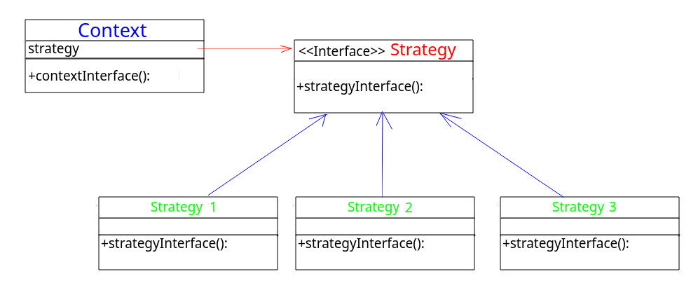
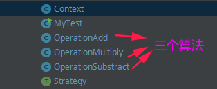

# 策略模式

* [一、基本概念](#一基本概念)
* [二、结构](#二结构)
* [三、案例](#三案例)
* [四、总结](#四总结)

## 一、基本概念

策略模式是**行为型**设计模式。

其用意是针对一组算法，**将每一个算法封装到具有共同接口的独立的类中，从而使得它们可以相互替换**。

策略模式使得算法可以在不影响到客户端的情况下发生变化。

## 二、结构

下面是基本结构:



三类角色:

* **环境(Context)角色**：持有一个`Strategy`的引用。
* **抽象策略(Strategy)角色**：这是一个抽象角色，通常由一个接口或抽象类实现。此角色给出所有的具体策略类所需的接口。
* **具体策略(ConcreteStrategy)角色**：包装了相关的算法或行为。

## 三、案例

案例实现:

> 定义一族算法，可以实现对两个数的操作，例如`+、-、*、/`等。

实现代码整体框架图:



具体代码实现:

`Context`类:

```java
/**
 * Context 是一个使用了某种策略的类。 实现了 Strategy 接口的实体策略类
 */
public class Context {

    private Strategy strategy;

    public Context(Strategy strategy) {
        this.strategy = strategy;
    }

    public int executeStrategy(int num1, int num2){
        return strategy.doOperation(num1, num2);
    }
}
```

`Strategy`接口:

```java
/**策略的公共接口*/
public interface Strategy {
    int doOperation(int num1, int num2);
}
```

三种对应的算法实现:

```java
/** 算法１: 实现加法 */
public class OperationAdd implements Strategy {
    @Override
    public int doOperation(int num1, int num2) {
        return num1 + num2;
    }
}
```

```java
/** 算法2：实现减法 */
public class OperationSubstract implements Strategy{
    @Override
    public int doOperation(int num1, int num2) {
        return num1 - num2;
    }
}
```

```java
/** 算法3: 实现乘法 */
public class OperationMultiply implements Strategy{
    @Override
    public int doOperation(int num1, int num2) {
        return num1 * num2;
    }
}
```

测试类：

```java
public class MyTest {
    public static void main(String[] args) {

        Context context = new Context(new OperationAdd());

        System.out.println("10 + 5 = " + context.executeStrategy(10, 5));

        context = new Context(new OperationSubstract());
        System.out.println("10 - 5 = " + context.executeStrategy(10, 5));

        context = new Context(new OperationMultiply());
        System.out.println("10 * 5 = " + context.executeStrategy(10, 5));
    }
}
```

程序输出:

```java
10 + 5 = 15
10 - 5 = 5
10 * 5 = 50
```

## 四、总结

* 策略模式的重心不是如何实现算法，而是如何组织、调用这些算法；
* 策略模式一个很大的特点就是各个策略算法的平等性。对于一系列具体的策略算法，大家的地位是完全一样的，正因为这个平等性，才能实现算法之间可以相互替换；
* 使用策略模式可以避免使用多重条件(if-else)语句；