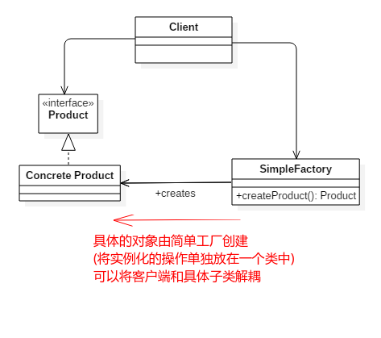

# 简单工厂模式

* [一、基本概念](#一基本概念)
* [二、结构](#二结构)
* [三、案例](#三案例)
* [四、总结](#四总结)

## 一、基本概念

**简单工厂模式是类的创建模式，又叫做静态工厂方法（Static Factory Method）模式。简单工厂模式是由一个工厂对象决定创建出哪一种产品类的实例**。

在创建一个对象时不向客户暴露内部细节，并提供一个创建对象的通用接口。

## 二、结构

简单工厂把实例化的操作单独放到一个类中，这个类就是简单工厂类(**Simple Factory**)，让简单工厂类来决定应该用哪个具体子类来实例化 (而不是在客户端中决定)。

这样做能把客户类和具体子类的实现解耦，客户类不再需要知道有哪些子类以及应当实例化哪个子类。

客户类往往有多个，如果不使用简单工厂，那么所有的客户类都要知道所有子类的细节。而且一旦子类发生改变，例如增加子类，那么所有的客户类都要进行修改。

结构:



## 三、案例

> 模拟在`type == 1`的时候创建`ConcreteProduct1`、在`type == 2`的时候创建`ConcreteProduct2`、其他时候创建`ConcreteProduct`。

```java
public interface Product {
}
```

```java
public class ConcreteProduct implements Product {
}
```

```java
public class ConcreteProduct1 implements Product {
}
```

```java
public class ConcreteProduct2 implements Product {
}
```

如果我们按照下面的方式创建，则我们在客户端包含了这些需要判断条件的实例化代码，则可以将这些实例化代码放到简单工厂中:

```java
public class MyTest {
    // 不好的设计
    public static void main(String[] args) {
        int type = 1;
        Product product;
        if (type == 1) {
            product = new ConcreteProduct1();
        } else if (type == 2) {
            product = new ConcreteProduct2();
        } else {
            product = new ConcreteProduct();
        }
        // do something with the product
    }
}
```

于是我们可以增加一个简单工厂类:

```java
public class SimpleFactory {

    // 也可以将createProduct写成静态的
    public Product createProduct(int type) {
        if (type == 1) {
            return new ConcreteProduct1();
        } else if (type == 2) {
            return new ConcreteProduct2();
        }
        return new ConcreteProduct();
    }
}
```

然后我们的测试类可以写成下面的样子:

```java
public class MyTest {

    public static void main(String[] args) {
        SimpleFactory simpleFactory = new SimpleFactory();
        Product product = simpleFactory.createProduct(1);
        // do something with product
    }
}
```

这样既让客户端和具体类解耦，而且在客户端也看不到具体的繁杂的实例化代码。

## 四、总结

缺点 : 这个工厂类集中了所有的创建逻辑，当有复杂的多层次等级结构时，所有的业务逻辑都在这个工厂类中实现。什么时候它不能工作了，整个系统都会受到影响。

我们强调**职责单一**原则，一个类只提供一种功能。