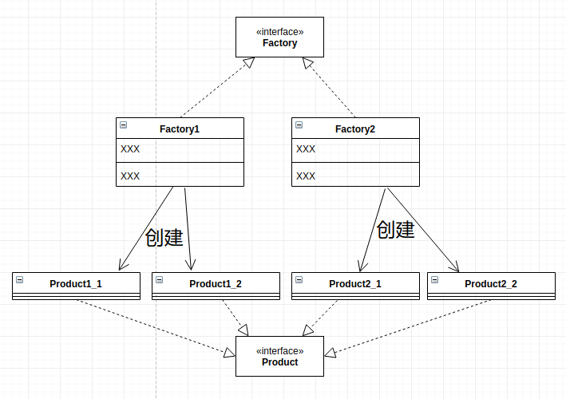
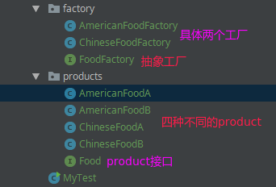
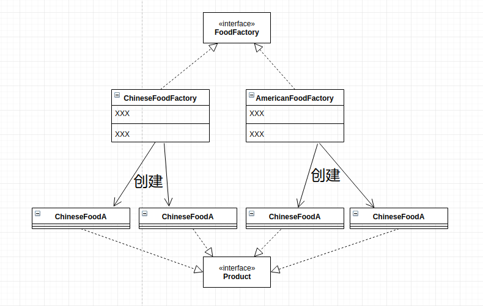

# 工厂方法模式

* [一、基本概念](#一基本概念)
* [二、结构](#二结构)
* [三、案例](#三案例)
* [四、总结](#四总结)

## 一、基本概念

**工厂方法模式是类的创建模式，又叫做虚拟构造子(Virtual Constructor)模式或者多态性工厂（Polymorphic Factory）模式**。
工厂方法模式的用意是**定义一个创建产品对象的工厂接口，将实际创建工作推迟到子类中**。

或者说引入工厂模式的目的就是我们需要多个工厂，但是每个工厂内部又要划分情况，如果只用一个工厂的话，会产生多种复合的情况。

比如说我们有两个工厂，每个工厂有3种情况，如果用简单工厂模式，要分为 `3 * 2 = 6`种情况，所以可以用工厂方法模式解决。

## 二、结构

在简单工厂中，创建对象的是另一个类，而在工厂方法中，是由大工厂的子类(或者实现类)来创建对象。

即上面有一个大工厂，下面是分类的工厂。



## 三、案例

> 案例，模拟需要生成中国食物A，中国食物B，美国食物A，美国食物B。

代码逻辑结构图:



基本结构图:



先给出这些食物(`Product`):

```java
public interface Food {
}

public class AmericanFoodA implements Food {
}

public class AmericanFoodB implements Food {
}

public class ChineseFoodA implements Food {
}

public class ChineseFoodB implements Food {
}
```

然后是抽象工厂:

```java
public interface FoodFactory {
    Food makeFood(String name);
}
```

然后就是两个子工厂:

```java
public class ChineseFoodFactory implements FoodFactory {
    @Override
    public Food makeFood(String name) {
        if (name.equals("A")) {
            return new ChineseFoodA();
        } else if (name.equals("B")) {
            return new ChineseFoodB();
        } else {
            return null;
        }
    }
}
```

```java
public class AmericanFoodFactory implements FoodFactory {
    @Override
    public Food makeFood(String name) {
        if (name.equals("A")) {
            return new AmericanFoodA();
        } else if (name.equals("B")) {
            return new AmericanFoodB();
        } else {
            return null;
        }
    }
}
```

最后测试:

```java
public class MyTest {
    public static void main(String[] args) {
        // 先选择一个具体的工厂
        FoodFactory factory = new ChineseFoodFactory();

        // 由第一步的工厂产生具体的对象，不同的工厂造出不一样的对象
        Food food = factory.makeFood("A"); //  chineseFood * A
    }
}
```

## 四、总结

工厂方法模式和简单工厂模式在结构上的不同很明显。

**工厂方法模式的核心是一个抽象工厂类，而简单工厂模式把核心放在一个具体类上**。

工厂方法模式退化后可以变得很像简单工厂模式。设想如果非常确定一个系统只需要一个具体工厂类，那么不妨把抽象工厂类合并到具体工厂类中去。由于只有一个具体工厂类，所以不妨将工厂方法改为静态方法，这时候就得到了简单工厂模式。
