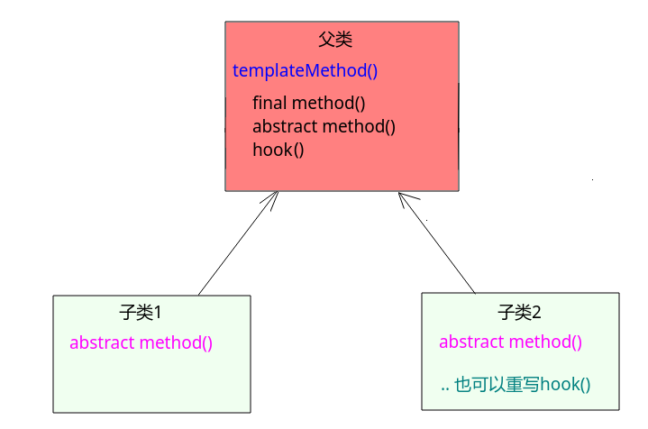

# 模板方法设计模式

* [一、基本概念](#一基本概念)
* [二、结构](#二结构)
* [三、案例](#三案例)
* [四、总结](#四总结)

## 一、基本概念

**模板方法模式是类的行为模式。准备一个抽象类，将部分逻辑以具体方法以及具体构造函数的形式实现，然后声明一些抽象方法来迫使子类实现剩余的逻辑。不同的子类可以以不同的方式实现这些抽象方法，从而对剩余的逻辑有不同的实现。这就是模板方法模式的用意。**

> 例如: 在现实生活中，完成某件事情是需要 n 个固定步骤的。如"在淘宝进行购物"这件事情的完成一般需要三个步骤: **登录网站、挑选商品、 付款**。但对于登录网站与付款这两步，每个人几乎都是相同的操作。但不同的地方是，每个人所挑选的商品是不同的。
> 在软件开发过程中同样存在这样的情况。某类的某个方法的实现，需要几个固定步骤。在这些固定步骤中,对于该类的不同对象， 有些步骤的实现是固定不变的，有些步骤的实现是大相径庭的，有些步骤的实现是可变可不变的。对于这种情况，就适合使用模板方法设计模式编程。

## 二、结构 

基本结构:

在模板方法设计模式中，存在一个**父类**(一般是**抽象**的)。其中包含 两类方法:  模板方法 和 3 种步骤方法；

* 模板方法: 即实现某种算法的方法步骤。这些步骤都是调用的步骤方法实现的。
* 步骤方法:即完成模板方法的每个阶段性方法。
  * 抽象方法: 子类必须实现的方法。即子类的个性化定义；
  * 最终方法(固定方法): 子类不能重写的方法，即所有子类都要做的步骤；
  * 钩子方法: 父类给了默认实现，子类可以重写，也可以不重写的方法；

结构:



## 三、案例

> 实现在网站上购物的案例。

基本逻辑图:


代码:

首先看`Shopping`类:

```java
public abstract class Shopping {

    // 模板方法
    public void buyGoods(){
        useLogin(); //固定的方法，子类不能重写
        buy();      //抽象方法，子类必须实现
        pay();      //钩子方法(hook)，子类可以重写
    }

    // 固定方法(最终方法)
    public final void useLogin() {
        System.out.println("用户登录");
    }

    //抽象方法
    public abstract void buy();

    // 钩子方法
    public void pay(){
        System.out.println("使用银联支付");
    }
}
```

然后是两个子类:

```java
public class ShoesShopping extends Shopping {
    @Override
    public void buy() {
        System.out.println("购买Nike鞋子!!!!");
    }
}
```

```java
public class ClothesShopping extends Shopping {
    @Override
    public void buy() {
        System.out.println("购买海澜之家男装!!!!!");
    }

    // 重写了钩子方法
    @Override
    public void pay() {
        System.out.println("使用支付宝支付");
    }
}
```

测试:

```java
public class MyTest {

    public static void main(String[] args){
        Shopping shoesShopping = new ShoesShopping();
        shoesShopping.buyGoods();

        System.out.println("-----------------------");
        Shopping clothesShopping = new ClothesShopping();
        clothesShopping.buyGoods();
    }
}
```

输出：

```java
用户登录
购买Nike鞋子!!!!
使用银联支付
-----------------------
用户登录
购买海澜之家男装!!!!!
使用支付宝支付
```

## 四、总结

有时候为了防止恶意操作，模板方法也会加上 `final` 关键词。