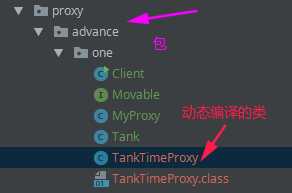
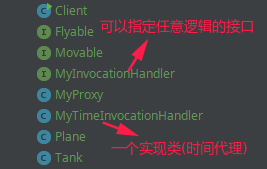
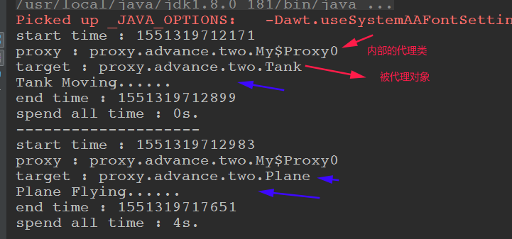
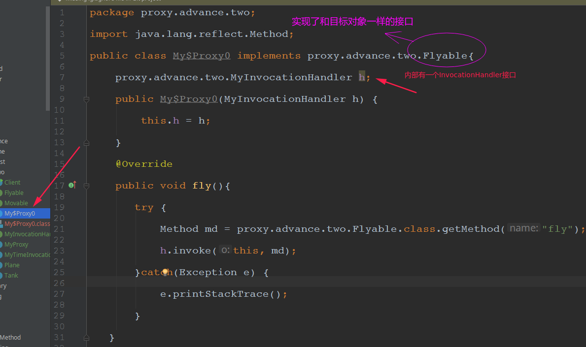
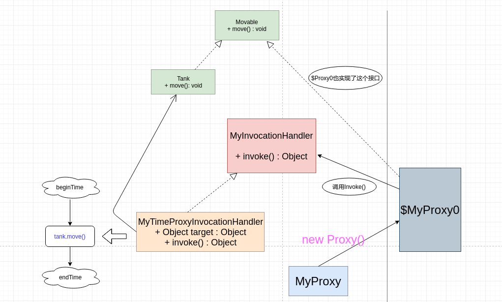

# 代理模式(二)

* [一、目的](#一目的)
* [二、模拟Java底层动态代理实现](#二、模拟java底层动态代理实现)
  * [1、模拟`TimeTankProxy`但是封装在`MyProxy`中](#1模拟timetankproxy但是封装在myproxy中)
  * [2、可以对任意接口进行代理，且可以自定义代理逻辑](#2可以对任意接口进行代理且可以自定义代理逻辑)
* [三、总结](#三总结)


## 一、目的

在代理模式(一)里面我们了解了**静态代理、动态代理、CGLIB代理**的基本使用。

这篇主要来将`JDK`动态代理底层的原理，以及有关`$Proxy0、InvocationHandler`相关的原理。

## 二、模拟Java底层动态代理实现

### 1、模拟`TimeTankProxy`但是封装在`MyProxy`中

只是将`TankTimeProxy`封装在了Proxy内部，我们用动态编译(JDK1.6 Complier)在程序运行的时候动态生成`TankTimeProxy`类。

缺点: 只能对`TankTimeProxy`进行代理

下面我们初步模拟`JDK`内部动态代理，因为动态代理就是不能看到代理类，所以我们将代理类写到`MyProxy`内部，在程序运行的时候动态生成。

```java
public interface Movable {
    void move();
}
```

```java
public class Tank implements Movable {
    @Override
    public void move() {
        // 坦克移动
        System.out.println("Tank Moving......");
        try {
            Thread.sleep(new Random().nextInt(5000)); // 随机产生 1~5秒, 模拟坦克在移动　
        } catch (InterruptedException e) {
            e.printStackTrace();
        }
    }
}
```

下面看我们很重要的`MyProxy`类，它有一个静态方法`newProxyInstance()`可以用来生成代理对象:

注意这里 `package proxy.advance.one`是我要动态编译生成的那个代理类`TankTimeProxy`最后生成所在的包。

```java
public class MyProxy {

    // 用来产生代理类
    public static Object newProxyInstance() throws Exception{
        String rt = "\n\r";

        //动态代理文件的源码 : 需要动态编译代码
        String src = "package proxy.advance.one;" + rt +
                "public class TankTimeProxy implements Movable {" + rt +
                "      private Movable tank;" + rt +
                "      public TankTimeProxy(Movable tank) {" + rt +
                "             this.tank = tank;" + rt +
                "      }" + rt +
                "     @Override" + rt +
                "     public void move() {" + rt +
                "          long start = System.currentTimeMillis();" + rt +
                "          System.out.println(\"start time : \" + start);" + rt +
                "          tank.move();" + rt +
                "          long end = System.currentTimeMillis();" + rt +
                "          System.out.println(\"end time : \" + end);" + rt +
                "          System.out.println(\"spend all time : \" + (end - start)/1000 + \"s.\");" + rt +
                "      }" + rt +
                "}";

        //把源码写到java文件里
        File file = new File("/home/zxzxin/Java_Maven/DesignPatterns/src/main/java/proxy/advance/one/TankTimeProxy.java");
        FileWriter fw = new FileWriter(file);
        fw.write(src);  fw.flush(); fw.close();

        //下面的代理，就是动态编译
        //编译源码，生成class,注意编译环境要换成jdk才有compiler,单纯的jre没有compiler，会空指针错误
        JavaCompiler jc = ToolProvider.getSystemJavaCompiler();
        StandardJavaFileManager fileMgr = jc.getStandardFileManager(null, null, null);//文件管事器
        Iterable units = fileMgr.getJavaFileObjects(file); //编译单元
        JavaCompiler.CompilationTask t = jc.getTask(null, fileMgr, null, null, null, units);//编译任务
        t.call();
        fileMgr.close();

        //把类load到内存里 并　生成新对象       !!!!!注意:下面的home前面不要加 /
        URL[] urls = new URL[]{new URL("file:/" + "home/zxzxin/Java_Maven/DesignPatterns/src/main/java/")};
        URLClassLoader ul = new URLClassLoader(urls);
        Class c = ul.loadClass("proxy.advance.one.TankTimeProxy");

        //生成实例return c.newInstance();   //c.newInstance()会调用无参数的Constructor，若类没有无参的Constructor时会出错
        Constructor ctr = c.getConstructor(Movable.class);   // 可以得到带有参数的构造方法()
        return ctr.newInstance(new Tank());
    }
}
```

测试:

```java
public class Client {
    public static void main(String[] args) throws Exception {
        Movable tank = new Tank();
        // 现在就是说删除了TankTimeProxy，还是要能实现动态代理
        Movable tankProxy = (Movable) MyProxy.newProxyInstance(); // 动态代理不需要写出代理类的名字
        tankProxy.move();
    }
}
```

输出: (和我们使用JDK动态代理一样的)

```java
start time : 1551318534681
Tank Moving......
end time : 1551318536469
spend all time : 1s.
```

我们动态生成编译的类也在当前包下:




### 2、可以对任意接口进行代理，且可以自定义代理逻辑

上面虽然实现了对JDK的动态代理的模拟，但是却只能对`Movable`接口进行代理，而且代理的逻辑只能是`TimeProxy`，下面我们来改进`MyProxy`类:

这里我们里面的那个字符串拼接代理类，不叫`TankTimeProxy`了，暂且叫`$MyProxy0`。

* 首先，要实现对任意接口的任意方法代理：

  * 实现代理任意接口: 我们要把接口类型作为参数传给`MyProxy`的`newProxyInstance(Class inface)`；
  * 代理接口的所有方法: 用`inface.getMethods()`取出所有方法，拼接实现方法的字符串(反射)；

* 要实现代理的任意逻辑:

  * 要把代理逻辑抽离，应独立出一个策略接口: `MyInvocationHandler`接口，并接收被代理的对象及方法作为参数`invoke(Object o, Method m)；`；
  * 而且需要把本身作为参数传给`MyProxy`的静态方法`newProxyInstance(Class inface, MyInvocationHandler h)` ；
  * 而且我们具体的策略(**即MyInvocationHandler的实现类**)本身聚合被**代理类target**，以便在target的方法前后增加代理逻辑；
  * 而且其中很重要的一步: **我们需要把MyInvocationHandler**作为成员遍历放到`$MyProxy0`中，而且在每一个代理方法内部，要调用被代理对象的原始方法，具体就是下面两行:

  ```java
  "  Method md = " + inface.getName() + ".class.getMethod(\"" + m.getName() + "\");" + rt +   //这个接口传入了 ,注意一定要写inface.getName
  "  h.invoke(this, md);" + rt +
     
  比如传入Movable接口，里面有move()方法，则上面生成的代码是这样:
  Method md = proxy.advance.two.Flyable.class.getMethod("fly");
  h.invoke(this, md);
  ```
  
讲的差不多了，现在看代码实现:



代码:

```java
/**
 * 能处理任何方法的	调用  只要给我一个Method就能对这个方法进行特殊的处理
 * 特殊处理的方式是由子类(实现类)决定
 */
public interface MyInvocationHandler {
    void invoke(Object o, Method m);
}
```

最重要的`MyProxy`类，传入了两个参数，分别是可以指定任意接口，以及指定任意逻辑。

```java
public class MyProxy {

    public static Object newProxyInstance(Class inface, MyInvocationHandler h) throws Exception {
        String rt = "\n\r";
        String methodStr = "";
        Method[] methods = inface.getMethods(); //获取接口的所有方法 , 为所有这些方法都生成代理
        /*
        原来固定的思路 : 只能对时间代理
		for(Method m : methods) {
			methodStr += "@Override" + rt +
						 "public void " + m.getName() + "() {" + rt +
						 	"   long start = System.currentTimeMillis();" + rt +
							"   System.out.println(\"start time : \" + start);" + rt +
							"   t." + m.getName() + "();" + rt +
							"   long end = System.currentTimeMillis();" + rt +
							"   System.out.println("spend all time : " + (end - start)/1000 + "s.");" + rt +
						 "}";
		}
		*/
        for (Method m : methods) {
            methodStr += "    @Override" + rt +
                    "    public void " + m.getName() + "(){" + rt +
                    "       try {" + rt +
                    "           Method md = " + inface.getName() + ".class.getMethod(\"" + m.getName() + "\");" + rt +   //这个接口传入了 ,注意一定要写inface.getName
                    "           h.invoke(this, md);" + rt +
                    "       }catch(Exception e) {" + rt +
                    "           e.printStackTrace();" + rt +
                    "       }" + rt +
                    "   }";
        }

        String src =
                "package proxy.advance.two;" + rt +
                        "import java.lang.reflect.Method;" + rt +
                        "public class My$Proxy0 implements " + inface.getName() + "{" + rt +
                        "    proxy.advance.two.MyInvocationHandler h;" + rt + //定义成员变量 MyInvocationHandler对象
                        "    public My$Proxy0(MyInvocationHandler h) {" + rt +
                        "        this.h = h;" + rt +
                        "    }" + rt +
                        methodStr + rt +
                        "}";

        //把源码写到java文件里
        File file = new File("/home/zxzxin/Java_Maven/DesignPatterns/src/main/java/proxy/advance/two/My$Proxy0.java");
        FileWriter fw = new FileWriter(file);
        fw.write(src);
        fw.flush();
        fw.close();

        //下面的代理，就是动态编译
        //编译源码，生成class,注意编译环境要换成jdk才有compiler,单纯的jre没有compiler，会空指针错误
        JavaCompiler jc = ToolProvider.getSystemJavaCompiler();
        StandardJavaFileManager fileMgr = jc.getStandardFileManager(null, null, null);//文件管事器
        Iterable units = fileMgr.getJavaFileObjects(file); //编译单元
        JavaCompiler.CompilationTask t = jc.getTask(null, fileMgr, null, null, null, units);//编译任务
        t.call();
        fileMgr.close();

        //把类load到内存里 并　生成新对象       !!!!!注意:下面的home前面不要加 /
        URL[] urls = new URL[]{new URL("file:/" + "home/zxzxin/Java_Maven/DesignPatterns/src/main/java/")};
        URLClassLoader ul = new URLClassLoader(urls);
        Class c = ul.loadClass("proxy.advance.two.My$Proxy0");
//        System.out.println("Class c : " + c);

        // 这是之前的
        //  生成实例return c.newInstance();   //c.newInstance()会调用无参数的Constructor，若类没有无参的Constructor时会出错
//        Constructor ctr = c.getConstructor(Movable.class);   // 可以得到带有参数的构造方法()
//        return ctr.newInstance(new Tank());
        Constructor ctr = c.getConstructor(MyInvocationHandler.class);  // 哪个处理器实现，就创建这个类的实例对象　
        Object m = ctr.newInstance(h);
        return m;
    }
}
```

看一个指定时间逻辑的实现类:

```java
public class MyTimeInvocationHandler implements MyInvocationHandler {

    private Object target; //注意是 Object,这样可以对任意对象进行时间的代理

    public MyTimeInvocationHandler(Object target) {
        this.target = target;
    }

    @Override
    public void invoke(Object proxy, Method m) {
        // 在前面做一些事情: 记录开始时间
        long start = System.currentTimeMillis();
        System.out.println("start time : " + start);
        System.out.println("proxy : " + proxy.getClass().getName()); // 打印proxy 到底是什么
        System.out.println("target : " + target.getClass().getName()); // 打印 target 到底是什么
        try {
            m.invoke(target); // 调用 target的方法
        } catch (Exception e) {
            e.printStackTrace();
        }
        long end = System.currentTimeMillis();
        System.out.println("end time : " + end);
        System.out.println("spend all time : " + (end - start) / 1000 + "s.");
    }
}
```

测试: (这里我加了一个`Flyable`和`Plane`)，测试可以放入任意接口(这两个类在代理模式(一)中也有，代码很简单，就不贴了):

```java
//　可以生成实现了任何接口的代理, 只要把接口传进去就可以了
public class Client {
    public static void main(String[] args) throws Exception {
        Movable tank = new Tank();
        MyInvocationHandler timeHandler = new MyTimeInvocationHandler(tank);
        Movable tankProxy = (Movable) MyProxy.newProxyInstance(Movable.class, timeHandler); // 传入类的.class即可
        tankProxy.move();

        System.out.println("--------------------");

        Flyable plane = new Plane();
        timeHandler = new MyTimeInvocationHandler(plane);
        Flyable planeProxy = (Flyable) MyProxy.newProxyInstance(Flyable.class, timeHandler);
        planeProxy.fly();
    }
}
```

输出:



看我们在包下生成的`MyProxy0`类的内容:



现在再看这个整体的框架联系图，应该就比较清晰了:



## 三、总结

在上面的主程序测试类中，当调用`tank.move()`的时候，就会调用`invoke(this, md)`，而这个`md`就是具体实现`MyInvocationHandler`接口的`MyTimeProxyInvocation`的方法， 也就是`invoke()`(在这个方法中我们在前后加了自己的逻辑)方法。